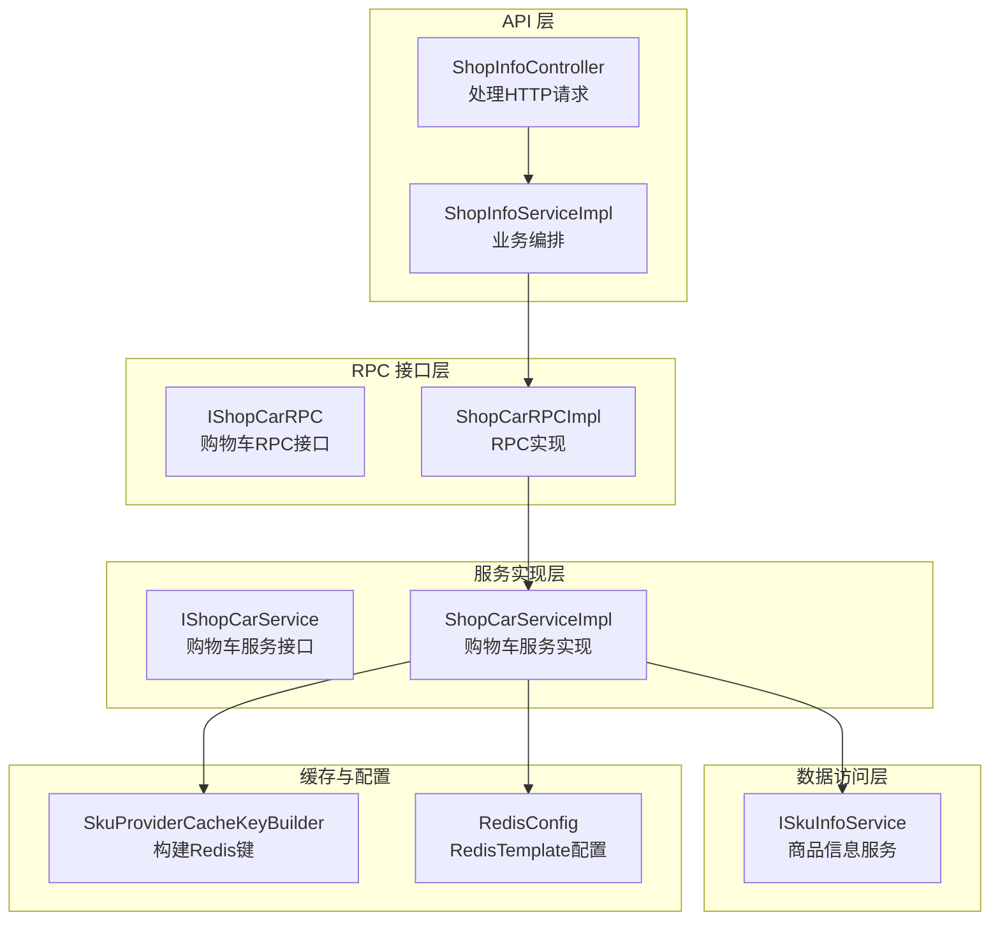
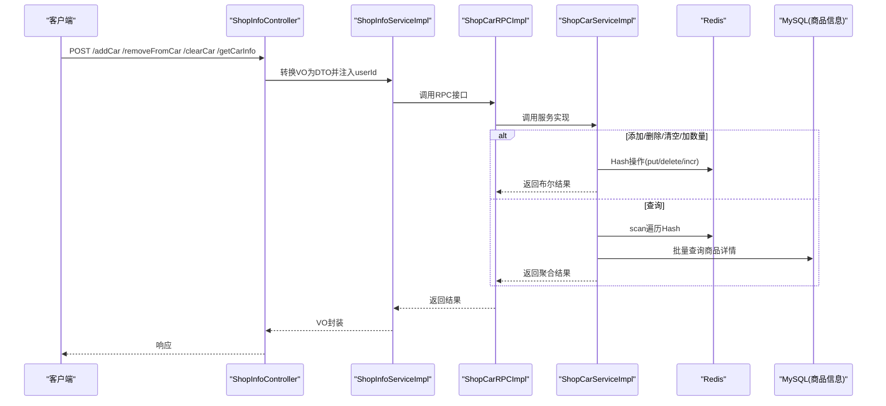
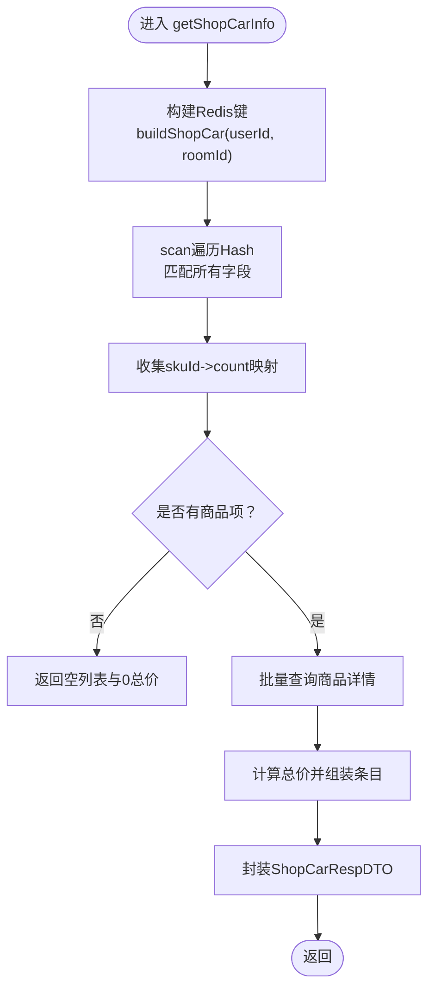
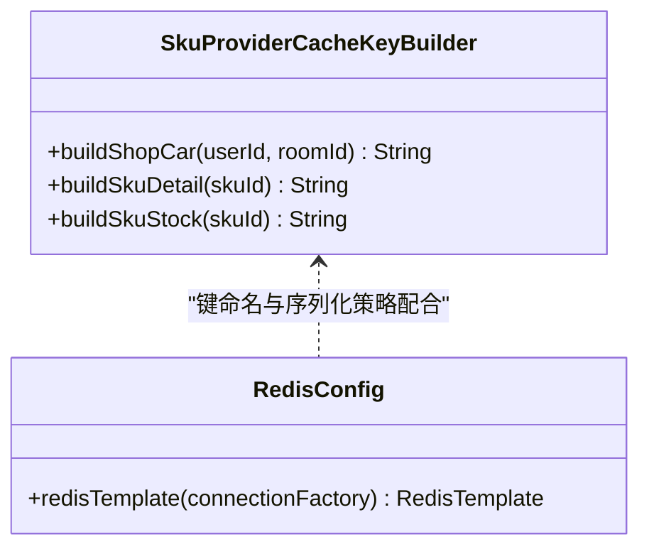
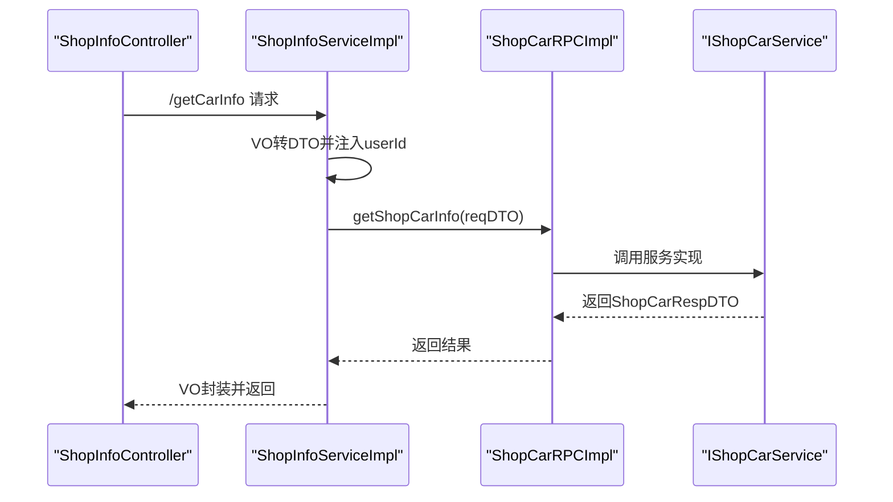
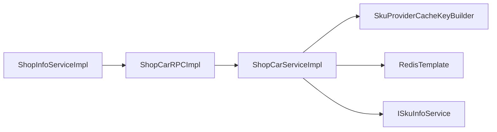

# 购物车服务

<cite>
**本文引用的文件**
- [ShopCarServiceImpl.java](file://live-sku-provider/src/main/java/com/logilong/live/sku/provider/service/impl/ShopCarServiceImpl.java)
- [IShopCarService.java](file://live-sku-provider/src/main/java/com/logilong/live/sku/provider/service/IShopCarService.java)
- [ShopCarRPCImpl.java](file://live-sku-provider/src/main/java/com/logilong/live/sku/provider/rpc/ShopCarRPCImpl.java)
- [IShopCarRPC.java](file://live-sku-interface/src/main/java/com/logilong/live/sku/interfaces/IShopCarRPC.java)
- [SkuProviderCacheKeyBuilder.java](file://live-framework/live-framework-redis-starter/src/main/java/com/logilong/live/framework/redis/starter/key/SkuProviderCacheKeyBuilder.java)
- [RedisConfig.java](file://live-framework/live-framework-redis-starter/src/main/java/com/logilong/live/framework/redis/starter/config/RedisConfig.java)
- [ShopCarReqDTO.java](file://live-sku-interface/src/main/java/com/logilong/live/sku/dto/ShopCarReqDTO.java)
- [ShopCarRespDTO.java](file://live-sku-interface/src/main/java/com/logilong/live/sku/dto/ShopCarRespDTO.java)
- [ShopCarItemRespDTO.java](file://live-sku-interface/src/main/java/com/logilong/live/sku/dto/ShopCarItemRespDTO.java)
- [ShopCarReqVO.java](file://live-api/src/main/java/com/logilong/live/api/vo/req/ShopCarReqVO.java)
- [ShopCarRespVO.java](file://live-api/src/main/java/com/logilong/live/api/vo/resp/ShopCarRespVO.java)
- [ShopInfoServiceImpl.java](file://live-api/src/main/java/com/logilong/live/api/service/impl/ShopInfoServiceImpl.java)
- [ShopInfoController.java](file://live-api/src/main/java/com/logilong/live/api/controller/ShopInfoController.java)
- [ISkuInfoService.java](file://live-sku-provider/src/main/java/com/logilong/live/sku/provider/service/ISkuInfoService.java)
</cite>

## 目录
1. [引言](#引言)
2. [项目结构](#项目结构)
3. [核心组件](#核心组件)
4. [架构总览](#架构总览)
5. [详细组件分析](#详细组件分析)
6. [依赖关系分析](#依赖关系分析)
7. [性能考量](#性能考量)
8. [故障排查指南](#故障排查指南)
9. [结论](#结论)

## 引言
本文件围绕“购物车服务”的实现机制展开，重点覆盖以下方面：
- 核心操作：添加、删除、修改数量、清空、查询
- 数据模型与存储：以直播间为维度，使用Redis Hash结构存储购物车数据
- 数据聚合：getShopCarInfo如何整合Redis中的购物车数据与MySQL中的商品信息
- 非持久化设计对性能的影响
- 分布式环境下的一致性保障策略

## 项目结构
购物车服务位于SKU提供者模块，通过Dubbo RPC对外暴露接口；API层负责接收前端请求并转换为领域DTO后调用RPC；Redis提供者模块负责构建缓存键与序列化配置；SKU信息服务负责从MySQL加载商品详情。

图表来源
- [ShopInfoController.java](file://live-api/src/main/java/com/logilong/live/api/controller/ShopInfoController.java#L34-L66)
- [ShopInfoServiceImpl.java](file://live-api/src/main/java/com/logilong/live/api/service/impl/ShopInfoServiceImpl.java#L59-L93)
- [IShopCarRPC.java](file://live-sku-interface/src/main/java/com/logilong/live/sku/interfaces/IShopCarRPC.java#L1-L31)
- [ShopCarRPCImpl.java](file://live-sku-provider/src/main/java/com/logilong/live/sku/provider/rpc/ShopCarRPCImpl.java#L1-L41)
- [IShopCarService.java](file://live-sku-provider/src/main/java/com/logilong/live/sku/provider/service/IShopCarService.java#L1-L32)
- [ShopCarServiceImpl.java](file://live-sku-provider/src/main/java/com/logilong/live/sku/provider/service/impl/ShopCarServiceImpl.java#L1-L91)
- [SkuProviderCacheKeyBuilder.java](file://live-framework/live-framework-redis-starter/src/main/java/com/logilong/live/framework/redis/starter/key/SkuProviderCacheKeyBuilder.java#L1-L41)
- [RedisConfig.java](file://live-framework/live-framework-redis-starter/src/main/java/com/logilong/live/framework/redis/starter/config/RedisConfig.java#L1-L28)
- [ISkuInfoService.java](file://live-sku-provider/src/main/java/com/logilong/live/sku/provider/service/ISkuInfoService.java#L1-L21)

章节来源
- [ShopInfoController.java](file://live-api/src/main/java/com/logilong/live/api/controller/ShopInfoController.java#L34-L66)
- [ShopInfoServiceImpl.java](file://live-api/src/main/java/com/logilong/live/api/service/impl/ShopInfoServiceImpl.java#L59-L93)
- [IShopCarRPC.java](file://live-sku-interface/src/main/java/com/logilong/live/sku/interfaces/IShopCarRPC.java#L1-L31)
- [ShopCarRPCImpl.java](file://live-sku-provider/src/main/java/com/logilong/live/sku/provider/rpc/ShopCarRPCImpl.java#L1-L41)
- [IShopCarService.java](file://live-sku-provider/src/main/java/com/logilong/live/sku/provider/service/IShopCarService.java#L1-L32)
- [ShopCarServiceImpl.java](file://live-sku-provider/src/main/java/com/logilong/live/sku/provider/service/impl/ShopCarServiceImpl.java#L1-L91)
- [SkuProviderCacheKeyBuilder.java](file://live-framework/live-framework-redis-starter/src/main/java/com/logilong/live/framework/redis/starter/key/SkuProviderCacheKeyBuilder.java#L1-L41)
- [RedisConfig.java](file://live-framework/live-framework-redis-starter/src/main/java/com/logilong/live/framework/redis/starter/config/RedisConfig.java#L1-L28)
- [ISkuInfoService.java](file://live-sku-provider/src/main/java/com/logilong/live/sku/provider/service/ISkuInfoService.java#L1-L21)

## 核心组件
- 接口与实现
  - IShopCarService：定义购物车核心能力（添加、删除、清空、加数量、查询）
  - ShopCarServiceImpl：基于Redis Hash实现购物车操作，并在查询时聚合MySQL商品信息
- RPC层
  - IShopCarRPC：对外暴露RPC接口
  - ShopCarRPCImpl：将RPC转发至服务实现
- 缓存键与Redis配置
  - SkuProviderCacheKeyBuilder：统一构建Redis键前缀与命名规范
  - RedisConfig：配置RedisTemplate的序列化策略，确保Hash键值正确序列化
- DTO与VO
  - ShopCarReqDTO/RespDTO：服务间传输对象
  - ShopCarReqVO/RespVO：API层对外响应对象
  - ShopCarItemRespDTO：单项购物车条目封装

章节来源
- [IShopCarService.java](file://live-sku-provider/src/main/java/com/logilong/live/sku/provider/service/IShopCarService.java#L1-L32)
- [ShopCarServiceImpl.java](file://live-sku-provider/src/main/java/com/logilong/live/sku/provider/service/impl/ShopCarServiceImpl.java#L1-L91)
- [IShopCarRPC.java](file://live-sku-interface/src/main/java/com/logilong/live/sku/interfaces/IShopCarRPC.java#L1-L31)
- [ShopCarRPCImpl.java](file://live-sku-provider/src/main/java/com/logilong/live/sku/provider/rpc/ShopCarRPCImpl.java#L1-L41)
- [SkuProviderCacheKeyBuilder.java](file://live-framework/live-framework-redis-starter/src/main/java/com/logilong/live/framework/redis/starter/key/SkuProviderCacheKeyBuilder.java#L1-L41)
- [RedisConfig.java](file://live-framework/live-framework-redis-starter/src/main/java/com/logilong/live/framework/redis/starter/config/RedisConfig.java#L1-L28)
- [ShopCarReqDTO.java](file://live-sku-interface/src/main/java/com/logilong/live/sku/dto/ShopCarReqDTO.java#L1-L17)
- [ShopCarRespDTO.java](file://live-sku-interface/src/main/java/com/logilong/live/sku/dto/ShopCarRespDTO.java#L1-L21)
- [ShopCarItemRespDTO.java](file://live-sku-interface/src/main/java/com/logilong/live/sku/dto/ShopCarItemRespDTO.java#L1-L22)
- [ShopCarReqVO.java](file://live-api/src/main/java/com/logilong/live/api/vo/req/ShopCarReqVO.java#L1-L11)
- [ShopCarRespVO.java](file://live-api/src/main/java/com/logilong/live/api/vo/resp/ShopCarRespVO.java#L1-L18)

## 架构总览
购物车服务采用“API -> RPC -> 服务实现 -> Redis/MySQL”的分层架构。API层负责参数校验与上下文注入；RPC层作为服务边界；服务实现层完成Redis Hash操作与MySQL商品信息聚合；缓存键与Redis配置确保键空间清晰与序列化一致。

图表来源
- [ShopInfoController.java](file://live-api/src/main/java/com/logilong/live/api/controller/ShopInfoController.java#L34-L66)
- [ShopInfoServiceImpl.java](file://live-api/src/main/java/com/logilong/live/api/service/impl/ShopInfoServiceImpl.java#L59-L93)
- [ShopCarRPCImpl.java](file://live-sku-provider/src/main/java/com/logilong/live/sku/provider/rpc/ShopCarRPCImpl.java#L1-L41)
- [ShopCarServiceImpl.java](file://live-sku-provider/src/main/java/com/logilong/live/sku/provider/service/impl/ShopCarServiceImpl.java#L33-L91)
- [ISkuInfoService.java](file://live-sku-provider/src/main/java/com/logilong/live/sku/provider/service/ISkuInfoService.java#L1-L21)

## 详细组件分析

### 组件A：ShopCarServiceImpl（购物车服务实现）
- 设计要点
  - 以“用户+直播间”为维度组织购物车，键名由SkuProviderCacheKeyBuilder生成
  - 使用Redis Hash结构存储：字段为skuId，值为数量（整型）
  - 查询时先scan遍历Hash，再批量查询MySQL商品详情，最后聚合返回
- 关键流程
  - 添加：向Hash写入skuId=1
  - 删除：从Hash删除指定skuId
  - 清空：删除该维度的整个Hash键
  - 加数量：对Hash中对应skuId的值自增
  - 查询：scan遍历Hash得到skuId->count映射，批量查询商品详情，计算总价并组装响应

图表来源
- [ShopCarServiceImpl.java](file://live-sku-provider/src/main/java/com/logilong/live/sku/provider/service/impl/ShopCarServiceImpl.java#L64-L91)
- [SkuProviderCacheKeyBuilder.java](file://live-framework/live-framework-redis-starter/src/main/java/com/logilong/live/framework/redis/starter/key/SkuProviderCacheKeyBuilder.java#L33-L35)
- [ISkuInfoService.java](file://live-sku-provider/src/main/java/com/logilong/live/sku/provider/service/ISkuInfoService.java#L1-L21)

章节来源
- [ShopCarServiceImpl.java](file://live-sku-provider/src/main/java/com/logilong/live/sku/provider/service/impl/ShopCarServiceImpl.java#L33-L91)

### 组件B：Redis键与序列化配置
- 键命名规范
  - buildShopCar(userId, roomId)：形成“前缀+shop_Car+userId+roomId”的唯一键，天然按直播间维度隔离
- RedisTemplate序列化
  - key/hashKey使用String序列化
  - value/hashValue使用JSON序列化，确保Hash值可读且跨语言兼容

图表来源
- [SkuProviderCacheKeyBuilder.java](file://live-framework/live-framework-redis-starter/src/main/java/com/logilong/live/framework/redis/starter/key/SkuProviderCacheKeyBuilder.java#L1-L41)
- [RedisConfig.java](file://live-framework/live-framework-redis-starter/src/main/java/com/logilong/live/framework/redis/starter/config/RedisConfig.java#L1-L28)

章节来源
- [SkuProviderCacheKeyBuilder.java](file://live-framework/live-framework-redis-starter/src/main/java/com/logilong/live/framework/redis/starter/key/SkuProviderCacheKeyBuilder.java#L1-L41)
- [RedisConfig.java](file://live-framework/live-framework-redis-starter/src/main/java/com/logilong/live/framework/redis/starter/config/RedisConfig.java#L1-L28)

### 组件C：API层编排与RPC调用
- API层
  - ShopInfoController：提供/addCar、/removeFromCar、/clearCar、/getCarInfo四个端点
  - ShopInfoServiceImpl：将请求VO转换为DTO，注入当前用户ID，调用RPC并做VO->DTO转换
- RPC层
  - ShopCarRPCImpl：直接转发到ShopCarServiceImpl

图表来源
- [ShopInfoController.java](file://live-api/src/main/java/com/logilong/live/api/controller/ShopInfoController.java#L34-L66)
- [ShopInfoServiceImpl.java](file://live-api/src/main/java/com/logilong/live/api/service/impl/ShopInfoServiceImpl.java#L59-L93)
- [ShopCarRPCImpl.java](file://live-sku-provider/src/main/java/com/logilong/live/sku/provider/rpc/ShopCarRPCImpl.java#L1-L41)
- [IShopCarService.java](file://live-sku-provider/src/main/java/com/logilong/live/sku/provider/service/IShopCarService.java#L1-L32)

章节来源
- [ShopInfoController.java](file://live-api/src/main/java/com/logilong/live/api/controller/ShopInfoController.java#L34-L66)
- [ShopInfoServiceImpl.java](file://live-api/src/main/java/com/logilong/live/api/service/impl/ShopInfoServiceImpl.java#L59-L93)
- [ShopCarRPCImpl.java](file://live-sku-provider/src/main/java/com/logilong/live/sku/provider/rpc/ShopCarRPCImpl.java#L1-L41)

## 依赖关系分析
- 组件耦合
  - ShopCarServiceImpl依赖RedisTemplate、SkuProviderCacheKeyBuilder、ISkuInfoService
  - API层依赖ShopCarRPCImpl，ShopCarRPCImpl依赖IShopCarService
- 外部依赖
  - Redis：Hash结构用于购物车数据存储
  - MySQL：通过ISkuInfoService批量查询商品详情
- 潜在循环依赖
  - 当前结构无循环依赖，API->RPC->Service单向依赖链清晰

图表来源
- [ShopInfoServiceImpl.java](file://live-api/src/main/java/com/logilong/live/api/service/impl/ShopInfoServiceImpl.java#L59-L93)
- [ShopCarRPCImpl.java](file://live-sku-provider/src/main/java/com/logilong/live/sku/provider/rpc/ShopCarRPCImpl.java#L1-L41)
- [ShopCarServiceImpl.java](file://live-sku-provider/src/main/java/com/logilong/live/sku/provider/service/impl/ShopCarServiceImpl.java#L1-L91)
- [SkuProviderCacheKeyBuilder.java](file://live-framework/live-framework-redis-starter/src/main/java/com/logilong/live/framework/redis/starter/key/SkuProviderCacheKeyBuilder.java#L1-L41)
- [RedisConfig.java](file://live-framework/live-framework-redis-starter/src/main/java/com/logilong/live/framework/redis/starter/config/RedisConfig.java#L1-L28)
- [ISkuInfoService.java](file://live-sku-provider/src/main/java/com/logilong/live/sku/provider/service/ISkuInfoService.java#L1-L21)

章节来源
- [ShopInfoServiceImpl.java](file://live-api/src/main/java/com/logilong/live/api/service/impl/ShopInfoServiceImpl.java#L59-L93)
- [ShopCarRPCImpl.java](file://live-sku-provider/src/main/java/com/logilong/live/sku/provider/rpc/ShopCarRPCImpl.java#L1-L41)
- [ShopCarServiceImpl.java](file://live-sku-provider/src/main/java/com/logilong/live/sku/provider/service/impl/ShopCarServiceImpl.java#L1-L91)

## 性能考量
- Redis Hash的优势
  - O(1)的字段读写与自增，适合高频的加购/加数量/删除操作
  - 以直播间维度隔离，避免跨房间数据污染，便于清理与过期控制
- 扫描与批量查询
  - scan遍历Hash的时间复杂度与Hash大小线性相关；建议结合业务限制购物车规模或引入分页扫描
  - 批量查询商品详情减少多次RPC/SQL往返，提升整体吞吐
- 序列化与内存
  - JSON序列化便于调试与跨语言，但可能带来额外内存开销；需结合实际数据量评估
- 非持久化设计
  - 以直播间为维度的缓存天然具备生命周期短、易失效的特点，降低长期内存占用与数据一致性成本
  - 对于需要跨会话保留的场景，需考虑迁移策略或引入短期持久化

[本节为通用性能讨论，无需列出具体文件来源]

## 故障排查指南
- 常见问题定位
  - Redis连接异常：检查RedisTemplate配置与连接池参数
  - 键冲突或命名不一致：核对SkuProviderCacheKeyBuilder的前缀与分隔符
  - 商品信息缺失：确认ISkuInfoService的批量查询是否返回完整数据
  - scan性能问题：关注Hash规模，必要时增加上限或分页
- 排查步骤
  - 在ShopCarServiceImpl的关键节点打印日志（如构建键、scan结果、批量查询结果）
  - 使用Redis命令行验证键是否存在、字段是否正确
  - 校验DTO/VO转换是否丢失字段

章节来源
- [RedisConfig.java](file://live-framework/live-framework-redis-starter/src/main/java/com/logilong/live/framework/redis/starter/config/RedisConfig.java#L1-L28)
- [SkuProviderCacheKeyBuilder.java](file://live-framework/live-framework-redis-starter/src/main/java/com/logilong/live/framework/redis/starter/key/SkuProviderCacheKeyBuilder.java#L1-L41)
- [ISkuInfoService.java](file://live-sku-provider/src/main/java/com/logilong/live/sku/provider/service/ISkuInfoService.java#L1-L21)
- [ShopCarServiceImpl.java](file://live-sku-provider/src/main/java/com/logilong/live/sku/provider/service/impl/ShopCarServiceImpl.java#L64-L91)

## 结论
- 以直播间为维度的购物车设计充分利用Redis Hash的高性能特性，满足高并发下的加购/加数量/删除/清空等操作
- getShopCarInfo通过scan+批量查询实现高效聚合，兼顾实时性与性能
- 非持久化设计降低了长期内存占用与一致性维护成本，适合直播间的临时性购物场景
- 在分布式环境下，可通过键空间隔离与合理的过期策略保障一致性；对于需要跨会话保留的业务，建议引入短期持久化或迁移策略