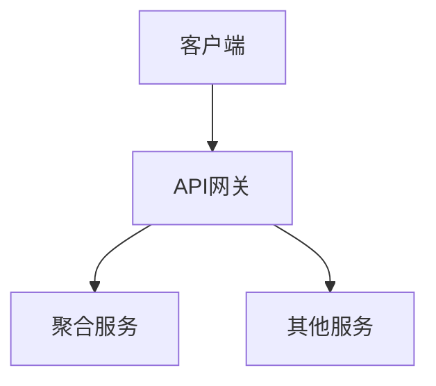
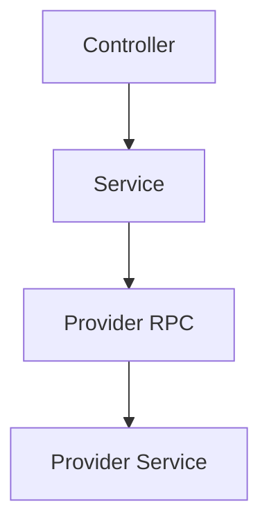
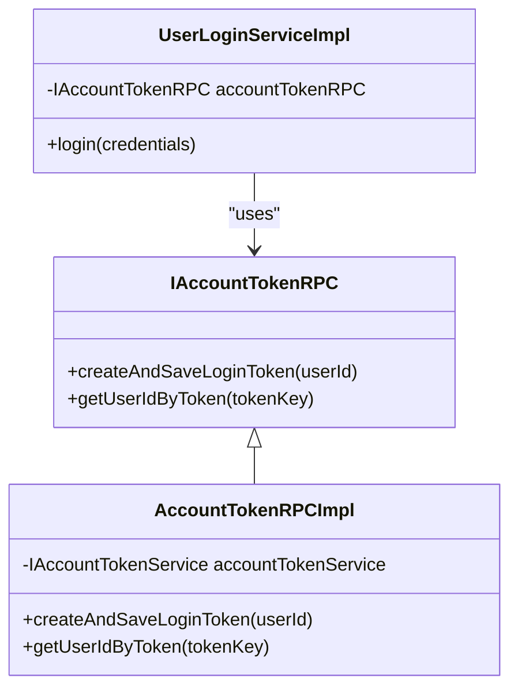
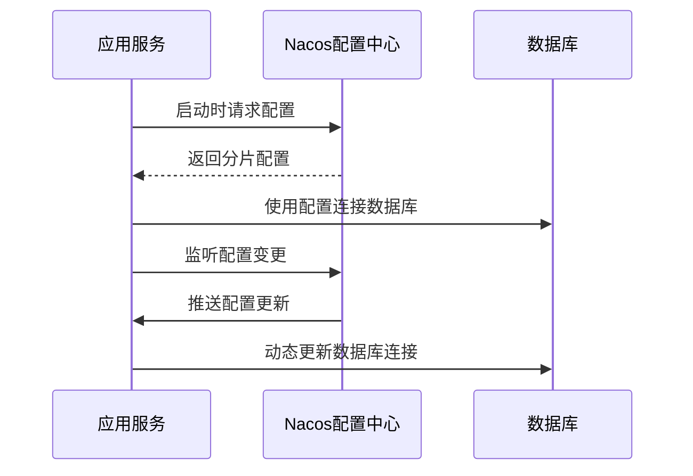
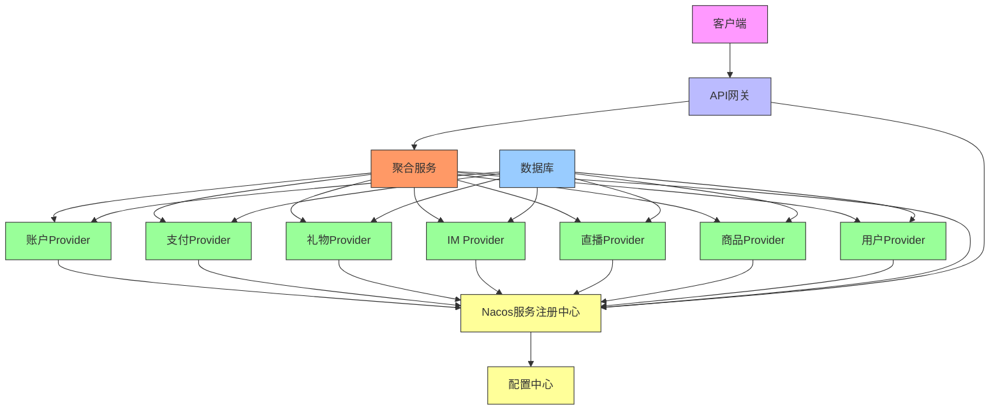
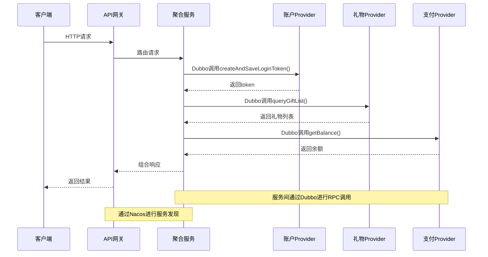

# 微服务架构设计

<cite>
**本文档引用的文件**   
- [pom.xml](file://pom.xml)
- [GateWayApplication.java](file://live-gateway/src/main/java/com/logilong/live/gateway/GateWayApplication.java)
- [ApiWebApplication.java](file://live-api/src/main/java/com/logilong/live/api/ApiWebApplication.java)
- [AccountProviderApplication.java](file://live-account-provider/src/main/java/com/logilong/live/account/provider/AccountProviderApplication.java)
- [BankProviderApplication.java](file://live-bank-provider/src/main/java/com/logilong/live/bank/provider/BankProviderApplication.java)
- [bootstrap.yml](file://live-gateway/src/main/resources/bootstrap.yml)
- [bootstrap.yml](file://live-api/src/main/resources/bootstrap.yml)
- [bootstrap.yml](file://live-account-provider/src/main/resources/bootstrap.yml)
- [bootstrap.yml](file://live-bank-provider/src/main/resources/bootstrap.yml)
- [bootstrap.yml](file://live-gift-provider/src/main/resources/bootstrap.yml)
- [bootstrap.yml](file://live-living-provider/src/main/resources/bootstrap.yml)
- [bootstrap.yml](file://live-im-router-provider/src/main/resources/bootstrap.yml)
- [bootstrap.yml](file://live-im-core-server/src/main/resources/bootstrap.yml)
- [bootstrap.yml](file://live-user-provider/src/main/resources/bootstrap.yml)
- [bootstrap.yml](file://live-msg-provider/src/main/resources/bootstrap.yml)
- [bootstrap.yml](file://live-id-generate-provider/src/main/resources/bootstrap.yml)
- [bootstrap.yml](file://live-bank-api/src/main/resources/bootstrap.yml)
- [NacosDriverURLProvider.java](file://live-framework/live-framework-datasource-starter/src/main/java/com/logilong/live/framework/datasource/starter/config/NacosDriverURLProvider.java)
- [IAccountTokenRPC.java](file://live-account-interface/src/main/java/com/logilong/live/account/interfaces/IAccountTokenRPC.java)
- [ILiveCurrencyAccountRPC.java](file://live-bank-interface/src/main/java/com/logilong/live/bank/interfaces/ILiveCurrencyAccountRPC.java)
- [IGiftConfigRPC.java](file://live-gift-interface/src/main/java/com/logilong/live/gift/interfaces/IGiftConfigRPC.java)
- [ImRouterRPCImpl.java](file://live-im-router-provider/src/main/java/com/logilong/live/im/router/provider/rpc/ImRouterRPCImpl.java)
- [RouterHandlerRPCImpl.java](file://live-im-core-server/src/main/java/com/logilong/live/im/core/server/rpc/RouterHandlerRPCImpl.java)
- [UserRPCImpl.java](file://live-user-provider/src/main/java/com/logilong/live/user/provider/rpc/UserRPCImpl.java)
- [ImOnlineRPCImpl.java](file://live-im-provider/src/main/java/com/logilong/live/im/provider/rpc/ImOnlineRPCImpl.java)
- [IdGenerateRPCImpl.java](file://live-id-generate-provider/src/main/java/com/logilong/live/id/generate/provider/rpc/IdGenerateRPCImpl.java)
- [ShopCarRPCImpl.java](file://live-sku-provider/src/main/java/com/logilong/live/sku/provider/rpc/ShopCarRPCImpl.java)
- [SmsRPCImpl.java](file://live-msg-provider/src/main/java/com/logilong/live/msg/provider/rpc/SmsRPCImpl.java)
</cite>

## 目录
1. [系统架构概述](#系统架构概述)
2. [核心组件分析](#核心组件分析)
3. [服务暴露与引用机制](#服务暴露与引用机制)
4. [服务发现与Nacos集成](#服务发现与nacos集成)
5. [系统上下文图](#系统上下文图)
6. [组件交互图](#组件交互图)
7. [服务拆分原则与粒度控制](#服务拆分原则与粒度控制)
8. [故障隔离机制](#故障隔离机制)
9. [RPC接口解耦设计实践](#rpc接口解耦设计实践)

## 系统架构概述

liveplatform采用典型的三层微服务架构模型，由API网关、聚合服务（live-api）和多个独立业务Provider构成。这种架构设计实现了清晰的职责分离和松耦合的系统结构。

API网关作为系统的统一入口，负责请求路由、安全认证和流量控制。聚合服务（live-api）作为业务逻辑的协调者，负责整合多个Provider的服务调用，为前端提供统一的API接口。各个业务Provider（如账户、支付、礼物、IM、直播、商品、用户等）则专注于各自的业务领域，实现高内聚、低耦合的服务设计。

该架构基于Spring Cloud Alibaba生态，使用Dubbo作为RPC框架实现服务间的高效通信，Nacos作为服务注册与配置中心实现服务发现和配置管理。每个微服务都是独立部署的Spring Boot应用，通过Docker容器化部署，实现了服务的独立伸缩和故障隔离。

**Section sources**
- [pom.xml](file://pom.xml#L17-L45)
- [GateWayApplication.java](file://live-gateway/src/main/java/com/logilong/live/gateway/GateWayApplication.java#L8-L16)
- [ApiWebApplication.java](file://live-api/src/main/java/com/logilong/live/api/ApiWebApplication.java#L9-L16)

## 核心组件分析

### API网关 (live-gateway)

API网关是系统的流量入口，基于Spring Cloud Gateway构建。它负责将外部请求路由到相应的后端服务，同时提供统一的安全认证、限流熔断和监控功能。

网关通过Nacos进行服务发现，能够动态感知后端服务实例的变化。它还实现了自定义的过滤器（如AccountCheckFilter）用于请求的预处理和安全校验。



**Diagram sources**
- [GateWayApplication.java](file://live-gateway/src/main/java/com/logilong/live/gateway/GateWayApplication.java#L8-L16)
- [bootstrap.yml](file://live-gateway/src/main/resources/bootstrap.yml#L1-L29)

**Section sources**
- [GateWayApplication.java](file://live-gateway/src/main/java/com/logilong/live/gateway/GateWayApplication.java#L1-L17)
- [bootstrap.yml](file://live-gateway/src/main/resources/bootstrap.yml#L1-L29)

### 聚合服务 (live-api)

聚合服务（live-api）是业务逻辑的协调中心，负责整合多个Provider的服务调用。它通过RESTful API为前端提供统一的接口，同时通过Dubbo调用后端Provider的服务。

该服务采用典型的MVC架构，包含Controller层处理HTTP请求，Service层协调业务逻辑，VO层定义数据传输对象。每个Controller对应一个业务领域，如BankController处理支付相关请求，GiftController处理礼物相关请求等。



**Diagram sources**
- [ApiWebApplication.java](file://live-api/src/main/java/com/logilong/live/api/ApiWebApplication.java#L9-L16)
- [bootstrap.yml](file://live-api/src/main/resources/bootstrap.yml#L1-L22)

**Section sources**
- [ApiWebApplication.java](file://live-api/src/main/java/com/logilong/live/api/ApiWebApplication.java#L1-L19)
- [bootstrap.yml](file://live-api/src/main/resources/bootstrap.yml#L1-L22)

### 业务Provider

各个业务Provider是独立的微服务，每个Provider专注于一个特定的业务领域。它们通过Dubbo暴露RPC接口，供聚合服务或其他Provider调用。

Provider的典型结构包括：
- rpc包：实现Dubbo服务接口，作为服务提供者
- service包：实现核心业务逻辑
- dao包：数据访问层，与数据库交互
- ProviderApplication：服务启动类

所有Provider都通过@EnableDubbo注解启用Dubbo功能，并通过@EnableDiscoveryClient注册到Nacos服务注册中心。

**Section sources**
- [AccountProviderApplication.java](file://live-account-provider/src/main/java/com/logilong/live/account/provider/AccountProviderApplication.java#L1-L20)
- [BankProviderApplication.java](file://live-bank-provider/src/main/java/com/logilong/live/bank/provider/BankProviderApplication.java#L1-L24)
- [bootstrap.yml](file://live-account-provider/src/main/resources/bootstrap.yml#L1-L22)
- [bootstrap.yml](file://live-bank-provider/src/main/resources/bootstrap.yml#L1-L22)

## 服务暴露与引用机制

### Dubbo服务暴露

在liveplatform中，Dubbo作为RPC框架实现服务间的高效通信。服务提供者通过@DubboService注解暴露服务接口，服务消费者通过@DubboReference注解引用远程服务。

服务暴露的实现方式是在Provider的rpc包中创建实现类，这些类实现定义在interface模块中的RPC接口。例如，账户服务通过AccountTokenRPCImpl类实现IAccountTokenRPC接口，支付服务通过PayOrderRPCImpl类实现IPayOrderRPC接口。

```java
@DubboService
public class AccountTokenRPCImpl implements IAccountTokenRPC {
    @Resource
    private IAccountTokenService accountTokenService;
    
    @Override
    public String createAndSaveLoginToken(Long userId) {
        return accountTokenService.createAndSaveLoginToken(userId);
    }
}
```

### 服务引用

聚合服务（live-api）通过@DubboReference注解引用各个Provider的服务。Spring容器会自动创建远程服务的代理对象，使得远程调用如同本地调用一样简单。

服务引用通常在Service实现类中通过字段注入的方式完成。例如，UserLoginServiceImpl通过注入UserRPC来调用用户服务的远程方法。



**Diagram sources**
- [IAccountTokenRPC.java](file://live-account-interface/src/main/java/com/logilong/live/account/interfaces/IAccountTokenRPC.java#L3-L21)
- [AccountTokenRPCImpl.java](file://live-account-provider/src/main/java/com/logilong/live/account/provider/rpc/AccountTokenRPCImpl.java)
- [UserLoginServiceImpl.java](file://live-api/src/main/java/com/logilong/live/api/service/impl/UserLoginServiceImpl.java)

**Section sources**
- [ImRouterRPCImpl.java](file://live-im-router-provider/src/main/java/com/logilong/live/im/router/provider/rpc/ImRouterRPCImpl.java#L12-L27)
- [RouterHandlerRPCImpl.java](file://live-im-core-server/src/main/java/com/logilong/live/im/core/server/rpc/RouterHandlerRPCImpl.java#L11-L27)
- [UserRPCImpl.java](file://live-user-provider/src/main/java/com/logilong/live/user/provider/rpc/UserRPCImpl.java#L13-L38)
- [ImOnlineRPCImpl.java](file://live-im-provider/src/main/java/com/logilong/live/im/provider/rpc/ImOnlineRPCImpl.java#L9-L18)
- [IdGenerateRPCImpl.java](file://live-id-generate-provider/src/main/java/com/logilong/live/id/generate/provider/rpc/IdGenerateRPCImpl.java#L9-L23)
- [ShopCarRPCImpl.java](file://live-sku-provider/src/main/java/com/logilong/live/sku/provider/rpc/ShopCarRPCImpl.java#L10-L40)
- [SmsRPCImpl.java](file://live-msg-provider/src/main/java/com/logilong/live/msg/provider/rpc/SmsRPCImpl.java#L11-L26)

## 服务发现与Nacos集成

### Nacos服务注册

所有微服务都通过Nacos实现服务注册与发现。在bootstrap.yml配置文件中，每个服务都配置了唯一的spring.application.name，这是服务在Nacos中的标识。

服务启动时，通过@EnableDiscoveryClient注解自动注册到Nacos服务注册中心。Nacos服务器地址配置为live-server:8848，命名空间为live-test，便于环境隔离。

```yaml
spring:
  application:
    name: live-account-provider
  cloud:
    nacos:
      discovery:
        server-addr: live-server:8848
        namespace: live-test
```

### 配置中心集成

Nacos不仅作为服务注册中心，还作为配置中心使用。服务启动时会从Nacos获取对应的配置文件，实现配置的集中管理和动态更新。

配置文件的命名遵循${spring.application.name}.yaml的模式，通过optional:nacos:${spring.application.name}.yaml的导入方式实现配置的动态加载。这种方式使得服务可以在不重启的情况下更新配置。

### 自定义Nacos驱动

系统通过自定义NacosDriverURLProvider实现了ShardingSphere JDBC从Nacos获取分片配置的功能。这个SPI扩展使得数据库分片配置可以集中管理在Nacos中，提高了配置的灵活性和可维护性。



**Diagram sources**
- [NacosDriverURLProvider.java](file://live-framework/live-framework-datasource-starter/src/main/java/com/logilong/live/framework/datasource/starter/config/NacosDriverURLProvider.java#L20-L95)
- [bootstrap.yml](file://live-gateway/src/main/resources/bootstrap.yml#L1-L29)
- [bootstrap.yml](file://live-api/src/main/resources/bootstrap.yml#L1-L22)

**Section sources**
- [bootstrap.yml](file://live-gateway/src/main/resources/bootstrap.yml#L1-L29)
- [bootstrap.yml](file://live-api/src/main/resources/bootstrap.yml#L1-L22)
- [bootstrap.yml](file://live-account-provider/src/main/resources/bootstrap.yml#L1-L22)
- [bootstrap.yml](file://live-bank-provider/src/main/resources/bootstrap.yml#L1-L22)
- [bootstrap.yml](file://live-gift-provider/src/main/resources/bootstrap.yml#L1-L22)
- [bootstrap.yml](file://live-living-provider/src/main/resources/bootstrap.yml#L1-L24)
- [bootstrap.yml](file://live-im-router-provider/src/main/resources/bootstrap.yml#L1-L26)
- [bootstrap.yml](file://live-im-core-server/src/main/resources/bootstrap.yml#L1-L22)
- [bootstrap.yml](file://live-user-provider/src/main/resources/bootstrap.yml#L1-L22)
- [bootstrap.yml](file://live-msg-provider/src/main/resources/bootstrap.yml#L1-L22)
- [bootstrap.yml](file://live-id-generate-provider/src/main/resources/bootstrap.yml#L1-L22)
- [bootstrap.yml](file://live-bank-api/src/main/resources/bootstrap.yml#L1-L22)
- [NacosDriverURLProvider.java](file://live-framework/live-framework-datasource-starter/src/main/java/com/logilong/live/framework/datasource/starter/config/NacosDriverURLProvider.java#L20-L95)

## 系统上下文图



**Diagram sources**
- [pom.xml](file://pom.xml#L17-L45)
- [bootstrap.yml](file://live-gateway/src/main/resources/bootstrap.yml#L1-L29)
- [bootstrap.yml](file://live-api/src/main/resources/bootstrap.yml#L1-L22)

## 组件交互图



**Diagram sources**
- [GateWayApplication.java](file://live-gateway/src/main/java/com/logilong/live/gateway/GateWayApplication.java#L8-L16)
- [ApiWebApplication.java](file://live-api/src/main/java/com/logilong/live/api/ApiWebApplication.java#L9-L16)
- [IAccountTokenRPC.java](file://live-account-interface/src/main/java/com/logilong/live/account/interfaces/IAccountTokenRPC.java#L3-L21)
- [IGiftConfigRPC.java](file://live-gift-interface/src/main/java/com/logilong/live/gift/interfaces/IGiftConfigRPC.java#L7-L28)
- [ILiveCurrencyAccountRPC.java](file://live-bank-interface/src/main/java/com/logilong/live/bank/interfaces/ILiveCurrencyAccountRPC.java#L8-L53)

## 服务拆分原则与粒度控制

### 服务边界划分

liveplatform的服务拆分遵循单一职责原则，每个服务专注于一个明确的业务领域：

- **账户服务**：负责用户认证、token管理等安全相关功能
- **支付服务**：处理虚拟货币账户、交易记录等金融相关功能
- **礼物服务**：管理礼物配置、红包、送礼记录等社交功能
- **IM服务**：提供即时通讯能力，包括消息路由、在线状态等
- **直播服务**：管理直播间、直播记录、PK功能等直播核心功能
- **商品服务**：处理商品信息、购物车、库存等电商相关功能
- **用户服务**：管理用户基本信息、标签、手机号等用户数据

### 粒度控制策略

服务粒度的控制基于业务耦合度和变更频率。高内聚、低耦合的功能被封装在同一个服务中，而可能独立演进的功能则被拆分为独立的服务。

例如，将礼物配置管理（IGiftConfigRPC）和礼物记录管理（IGiftRecordRPC）拆分为不同的接口，因为它们的变更频率和访问模式不同。同样，将IM核心服务（im-core-server）和IM业务服务（im-provider）分离，以支持不同的扩展需求。

### 数据所有权原则

每个服务拥有自己的数据库表，遵循数据所有权原则。例如，账户服务管理用户token表，支付服务管理虚拟货币账户表，礼物服务管理礼物配置表等。这种设计避免了服务间的数据库耦合，提高了系统的可维护性。

**Section sources**
- [pom.xml](file://pom.xml#L17-L45)
- [IAccountTokenRPC.java](file://live-account-interface/src/main/java/com/logilong/live/account/interfaces/IAccountTokenRPC.java#L3-L21)
- [ILiveCurrencyAccountRPC.java](file://live-bank-interface/src/main/java/com/logilong/live/bank/interfaces/ILiveCurrencyAccountRPC.java#L8-L53)
- [IGiftConfigRPC.java](file://live-gift-interface/src/main/java/com/logilong/live/gift/interfaces/IGiftConfigRPC.java#L7-L28)

## 故障隔离机制

### 服务独立部署

每个微服务都是独立的Spring Boot应用，可以独立编译、打包和部署。这种独立性确保了一个服务的故障不会直接影响其他服务的运行。

通过Docker容器化部署，每个服务运行在独立的容器中，拥有独立的内存空间和资源配额。Kubernetes或类似的容器编排平台可以实现服务的自动伸缩和故障恢复。

### 熔断与降级

系统通过Dubbo的容错机制实现服务调用的熔断与降级。当某个服务不可用时，调用方可以快速失败并返回默认值或执行备用逻辑，避免故障扩散。

例如，在获取礼物列表时，如果礼物服务不可用，聚合服务可以返回缓存的礼物列表或空列表，而不是让整个请求失败。

### 资源隔离

通过Nacos的命名空间（namespace）功能，不同环境（如测试、预发布、生产）的服务实例被隔离在不同的命名空间中，避免了环境间的相互影响。

数据库层面通过ShardingSphere实现数据分片，将不同业务的数据存储在不同的数据库实例中，实现了数据层面的资源隔离。

**Section sources**
- [bootstrap.yml](file://live-gateway/src/main/resources/bootstrap.yml#L1-L29)
- [bootstrap.yml](file://live-api/src/main/resources/bootstrap.yml#L1-L22)
- [bootstrap.yml](file://live-account-provider/src/main/resources/bootstrap.yml#L1-L22)

## RPC接口解耦设计实践

### 接口与实现分离

系统采用接口与实现分离的设计模式，将RPC接口定义在独立的interface模块中，如live-account-interface、live-bank-interface等。Provider模块实现这些接口，Consumer模块引用这些接口。

这种设计实现了服务提供者和服务消费者的完全解耦，使得双方可以独立演进。只要接口定义不变，实现的修改不会影响调用方。

### DTO数据传输对象

服务间通信使用专门的DTO（Data Transfer Object）对象，而不是直接传递领域对象。DTO对象定义了服务间传输的数据结构，避免了领域模型的泄露。

例如，IAccountTokenRPC接口使用简单的String和Long类型作为参数和返回值，而ILiveCurrencyAccountRPC接口使用AccountTradeReqDTO和AccountTradeRespDTO作为复杂的请求和响应对象。

### 版本管理

通过Maven的依赖管理机制，可以精确控制interface模块的版本。当需要修改接口时，可以通过创建新的版本来实现向后兼容，避免对现有服务造成影响。

例如，ILiveCurrencyAccountRPC接口中同时存在decr和decrV2方法，V2版本可能是为了支持新的业务需求而添加的，而保留旧版本以确保兼容性。

```mermaid
graph TD
A[Consumer] --> B[Interface]
B --> C[Provider]
D[新版本Consumer] --> E[新版本Interface]
E --> F[新版本Provider]
G[旧版本Consumer] --> B
B --> H[旧版本Provider]
style A fill:#f9f,stroke:#333
style B fill:#ff9,stroke:#333
style C fill:#9f9,stroke:#333
style D fill:#f9f,stroke:#333
style E fill:#ff9,stroke:#333
style F fill:#9f9,stroke:#333
style G fill:#f9f,stroke:#333
style H fill:#9f9,stroke:#333
Note over B,E: 接口模块独立版本管理
Note over C,F: 提供者可独立演进
Note over A,D,G: 消费者可选择接口版本
```

**Diagram sources**
- [IAccountTokenRPC.java](file://live-account-interface/src/main/java/com/logilong/live/account/interfaces/IAccountTokenRPC.java#L3-L21)
- [ILiveCurrencyAccountRPC.java](file://live-bank-interface/src/main/java/com/logilong/live/bank/interfaces/ILiveCurrencyAccountRPC.java#L8-L53)
- [IGiftConfigRPC.java](file://live-gift-interface/src/main/java/com/logilong/live/gift/interfaces/IGiftConfigRPC.java#L7-L28)

**Section sources**
- [pom.xml](file://pom.xml#L17-L45)
- [IAccountTokenRPC.java](file://live-account-interface/src/main/java/com/logilong/live/account/interfaces/IAccountTokenRPC.java#L3-L21)
- [ILiveCurrencyAccountRPC.java](file://live-bank-interface/src/main/java/com/logilong/live/bank/interfaces/ILiveCurrencyAccountRPC.java#L8-L53)
- [IGiftConfigRPC.java](file://live-gift-interface/src/main/java/com/logilong/live/gift/interfaces/IGiftConfigRPC.java#L7-L28)