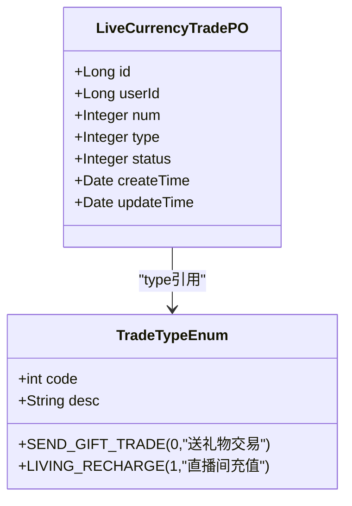
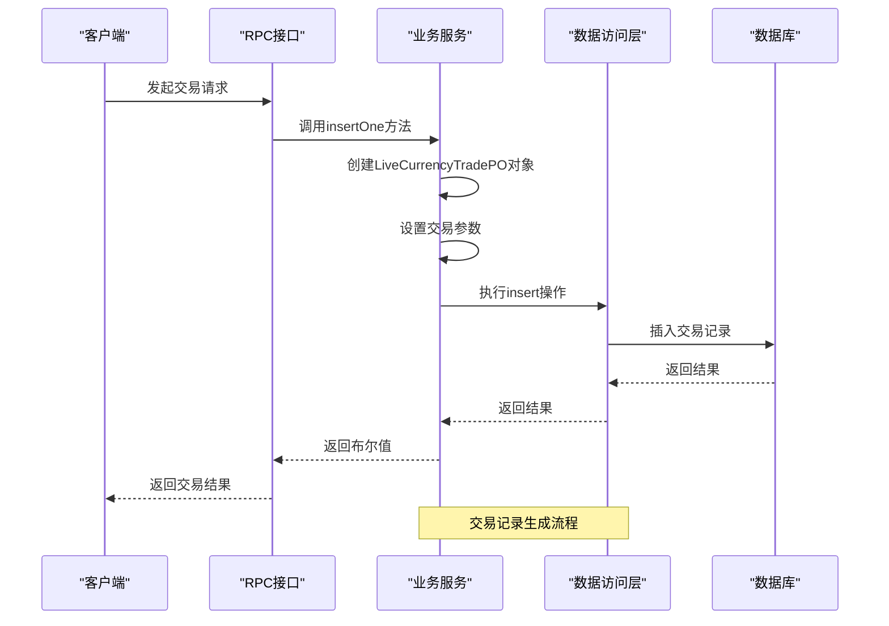
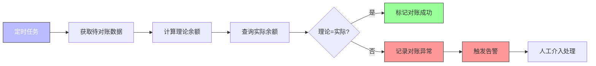

# 交易流水管理

<cite>
**本文档引用的文件**   
- [LiveCurrencyTradePO.java](file://live-bank-provider/src/main/java/com/logilong/live/bank/provider/dao/po/LiveCurrencyTradePO.java)
- [TradeTypeEnum.java](file://live-bank-interface/src/main/java/com/logilong/live/bank/constants/TradeTypeEnum.java)
- [LiveCurrencyTradeServiceImpl.java](file://live-bank-provider/src/main/java/com/logilong/live/bank/provider/service/impl/LiveCurrencyTradeServiceImpl.java)
- [LiveCurrencyAccountRPCImpl.java](file://live-bank-provider/src/main/java/com/logilong/live/bank/provider/rpc/LiveCurrencyAccountRPCImpl.java)
- [ILiveCurrencyAccountRPC.java](file://live-bank-interface/src/main/java/com/logilong/live/bank/interfaces/ILiveCurrencyAccountRPC.java)
- [AccountTradeReqDTO.java](file://live-bank-interface/src/main/java/com/logilong/live/bank/dto/AccountTradeReqDTO.java)
- [AccountTradeRespDTO.java](file://live-bank-interface/src/main/java/com/logilong/live/bank/dto/AccountTradeRespDTO.java)
- [ShardingJdbcDatasourceAutoInitConnectionConfig.java](file://live-framework/live-framework-datasource-starter/src/main/java/com/logilong/live/framework/datasource/starter/config/ShardingJdbcDatasourceAutoInitConnectionConfig.java)
- [ILiveCurrencyTradeMapper.java](file://live-bank-provider/src/main/java/com/logilong/live/bank/provider/dao/mapper/ILiveCurrencyTradeMapper.java)
- [ILiveCurrencyAccountService.java](file://live-bank-provider/src/main/java/com/logilong/live/bank/provider/service/ILiveCurrencyAccountService.java)
</cite>

## 目录
1. [引言](#引言)
2. [交易流水实体结构分析](#交易流水实体结构分析)
3. [交易记录生成机制](#交易记录生成机制)
4. [数据一致性保障方案](#数据一致性保障方案)
5. [分库分表策略与查询优化](#分库分表策略与查询优化)
6. [对账功能实现](#对账功能实现)
7. [总结](#总结)

## 引言
本文档详细描述了虚拟货币交易流水的管理机制，涵盖交易记录的生成、查询与对账功能。系统通过分布式架构设计，实现了高并发场景下的资金流动管理，确保了交易数据的准确性与可追溯性。交易流水作为核心业务数据，与账户余额系统紧密耦合，通过严格的事务控制和分库分表策略，保障了系统的高性能与数据一致性。

## 交易流水实体结构分析



**图示来源**
- [LiveCurrencyTradePO.java](file://live-bank-provider/src/main/java/com/logilong/live/bank/provider/dao/po/LiveCurrencyTradePO.java#L10-L22)
- [TradeTypeEnum.java](file://live-bank-interface/src/main/java/com/logilong/live/bank/constants/TradeTypeEnum.java#L10-L13)

**交易流水实体（LiveCurrencyTradePO）关键字段设计意图：**

- **id**: 主键，自增，唯一标识每笔交易记录
- **userId**: 用户ID，标识交易主体，用于关联用户账户
- **num**: 交易金额，表示虚拟货币的数量变化
- **type**: 交易类型，引用TradeTypeEnum枚举，区分不同业务场景的交易
- **status**: 交易状态，标识交易的有效性（如有效、无效）
- **createTime**: 创建时间，记录交易发生的时间戳
- **updateTime**: 更新时间，记录交易状态变更的时间

**交易类型枚举（TradeTypeEnum）设计：**
系统定义了两种核心交易类型：SEND_GIFT_TRADE（送礼物交易）和LIVING_RECHARGE（直播间充值），通过枚举方式确保交易类型的规范性和可扩展性。每个枚举值包含code和desc两个属性，便于数据库存储和业务展示。

**Section sources**
- [LiveCurrencyTradePO.java](file://live-bank-provider/src/main/java/com/logilong/live/bank/provider/dao/po/LiveCurrencyTradePO.java#L10-L22)
- [TradeTypeEnum.java](file://live-bank-interface/src/main/java/com/logilong/live/bank/constants/TradeTypeEnum.java#L10-L17)

## 交易记录生成机制



**图示来源**
- [LiveCurrencyTradeServiceImpl.java](file://live-bank-provider/src/main/java/com/logilong/live/bank/provider/service/impl/LiveCurrencyTradeServiceImpl.java#L21-L34)
- [ILiveCurrencyTradeMapper.java](file://live-bank-provider/src/main/java/com/logilong/live/bank/provider/dao/mapper/ILiveCurrencyTradeMapper.java#L8-L9)

交易记录的生成通过`LiveCurrencyTradeServiceImpl.insertOne`方法实现。该方法接收用户ID、交易金额和交易类型三个参数，创建`LiveCurrencyTradePO`对象并设置相关字段，然后通过MyBatis Plus的`insert`方法将交易记录持久化到数据库。交易状态默认设置为有效状态（VALID_STATUS），确保新生成的交易记录处于可用状态。

异常处理机制通过try-catch块实现，当插入操作发生异常时，系统会记录错误日志并返回false，确保交易失败时能够及时发现和处理。

**Section sources**
- [LiveCurrencyTradeServiceImpl.java](file://live-bank-provider/src/main/java/com/logilong/live/bank/provider/service/impl/LiveCurrencyTradeServiceImpl.java#L21-L34)

## 数据一致性保障方案

```mermaid
flowchart TD
A[交易请求] --> B{余额充足?}
B --> |是| C[扣减账户余额]
C --> D[生成交易流水]
D --> E[更新账户余额缓存]
E --> F[返回成功]
B --> |否| G[返回余额不足]
G --> H[不生成交易流水]
style C fill:#f9f,stroke:#333
style D fill:#f9f,stroke:#333
style E fill:#f9f,stroke:#333
style C stroke-width:2px
style D stroke-width:2px
style E stroke-width:2px
Note over C,D,E: 这三个步骤应在同一事务中执行
```

**图示来源**
- [ILiveCurrencyAccountRPC.java](file://live-bank-interface/src/main/java/com/logilong/live/bank/interfaces/ILiveCurrencyAccountRPC.java#L46-L51)
- [AccountTradeReqDTO.java](file://live-bank-interface/src/main/java/com/logilong/live/bank/dto/AccountTradeReqDTO.java#L13-L14)

系统通过以下机制保障交易流水与账户余额之间的数据一致性：

1. **事务控制**：在执行账户扣减和交易流水生成时，使用数据库事务确保操作的原子性。要么同时成功，要么同时失败。

2. **余额预检查**：通过`decrV2`方法在扣减前检查账户余额，避免出现负余额的情况。该方法先查询当前余额，判断是否足够后再执行扣减操作。

3. **RPC接口设计**：`ILiveCurrencyAccountRPC`接口提供了`consume`和`consumeForSendGift`两个专门用于消费的RPC方法，这些方法内部封装了余额检查和扣减逻辑，确保业务层面的一致性。

4. **响应对象设计**：`AccountTradeRespDTO`类包含isSuccess、code和msg字段，能够清晰地返回交易结果和错误信息，便于调用方处理各种场景。

**Section sources**
- [LiveCurrencyAccountRPCImpl.java](file://live-bank-provider/src/main/java/com/logilong/live/bank/provider/rpc/LiveCurrencyAccountRPCImpl.java#L32-L39)
- [ILiveCurrencyAccountRPC.java](file://live-bank-interface/src/main/java/com/logilong/live/bank/interfaces/ILiveCurrencyAccountRPC.java#L46-L51)
- [AccountTradeRespDTO.java](file://live-bank-interface/src/main/java/com/logilong/live/bank/dto/AccountTradeRespDTO.java#L13-L16)

## 分库分表策略与查询优化

```mermaid
graph TB
subgraph "应用层"
App[应用服务]
end
subgraph "ShardingSphere"
Sharding[ShardingSphere-JDBC]
Config[分片配置]
end
subgraph "数据库层"
DB1[(数据库1)]
DB2[(数据库2)]
DB3[(数据库3)]
DB4[(数据库4)]
end
App --> Sharding
Sharding --> Config
Sharding --> DB1
Sharding --> DB2
Sharding --> DB3
Sharding --> DB4
style Sharding fill:#f96,stroke:#333,color:#fff
style Config fill:#9f9,stroke:#333
Note over Sharding: ShardingSphere-JDBC作为分库分表中间件
Note over Config: 基于用户ID进行分片
```

**图示来源**
- [ShardingJdbcDatasourceAutoInitConnectionConfig.java](file://live-framework/live-framework-datasource-starter/src/main/java/com/logilong/live/framework/datasource/starter/config/ShardingJdbcDatasourceAutoInitConnectionConfig.java#L18-L29)
- [pom.xml](file://live-user-provider/pom.xml#L54-L56)

系统采用ShardingSphere-JDBC实现分库分表策略，主要特点如下：

1. **分片键选择**：以用户ID作为分片键，确保同一用户的交易记录存储在同一个数据库分片中，便于按用户查询交易流水。

2. **自动初始化**：通过`ShardingJdbcDatasourceAutoInitConnectionConfig`配置类，在应用启动时自动初始化数据源连接，避免Hikari连接池的初始化问题。

3. **配置集成**：在项目pom.xml中引入shardingsphere-jdbc-core依赖，将分库分表能力集成到应用中。

4. **性能优化**：
   - 针对大数据量场景，建立适当的数据库索引（如userId、createTime等字段）
   - 使用分页查询避免一次性加载过多数据
   - 通过缓存热点数据减少数据库访问压力
   - 利用ShardingSphere的查询优化器自动优化SQL执行计划

**Section sources**
- [ShardingJdbcDatasourceAutoInitConnectionConfig.java](file://live-framework/live-framework-datasource-starter/src/main/java/com/logilong/live/framework/datasource/starter/config/ShardingJdbcDatasourceAutoInitConnectionConfig.java#L18-L29)
- [pom.xml](file://live-user-provider/pom.xml#L54-L56)

## 对账功能实现



**图示来源**
- [ILiveCurrencyAccountRPC.java](file://live-bank-interface/src/main/java/com/logilong/live/bank/interfaces/ILiveCurrencyAccountRPC.java#L36-L41)
- [LiveCurrencyAccountRPCImpl.java](file://live-bank-provider/src/main/java/com/logilong/live/bank/provider/rpc/LiveCurrencyAccountRPCImpl.java#L42-L48)

对账功能的实现思路如下：

1. **对账接口设计**：通过`getByUserId`和`getBalance`接口获取账户的完整信息和余额，作为对账的数据源。

2. **定时任务处理**：
   - 系统配置定时任务，定期执行对账流程
   - 任务从交易流水表中获取指定时间范围内的所有交易记录
   - 根据交易类型和金额计算理论账户余额
   - 与数据库中存储的实际余额进行比对

3. **差异处理机制**：
   - 当理论余额与实际余额不一致时，记录对账异常
   - 触发告警通知相关人员
   - 提供详细的差异报告，包括不一致的交易记录
   - 支持人工介入处理和数据修正

4. **可追溯性保障**：
   - 所有对账操作都记录日志
   - 保留历史对账结果，便于审计和问题追踪
   - 交易流水的createTime字段为对账提供了时间维度的依据

**Section sources**
- [LiveCurrencyAccountRPCImpl.java](file://live-bank-provider/src/main/java/com/logilong/live/bank/provider/rpc/LiveCurrencyAccountRPCImpl.java#L42-L48)
- [ILiveCurrencyAccountRPC.java](file://live-bank-interface/src/main/java/com/logilong/live/bank/interfaces/ILiveCurrencyAccountRPC.java#L36-L41)

## 总结
本文档全面分析了虚拟货币交易流水的管理机制。系统通过精心设计的实体结构、严格的事务控制、合理的分库分表策略和完善的对账功能，实现了高并发场景下资金流动的安全性和准确性。LiveCurrencyTradePO实体与TradeTypeEnum枚举的结合，确保了交易类型的规范管理；ShardingSphere-JDBC的引入解决了大数据量下的性能瓶颈；而定时对账机制则为系统的数据一致性提供了最后一道防线。整体架构体现了微服务环境下金融级数据管理的最佳实践。