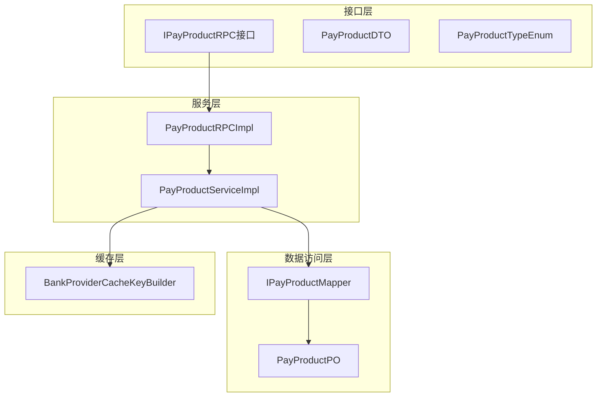
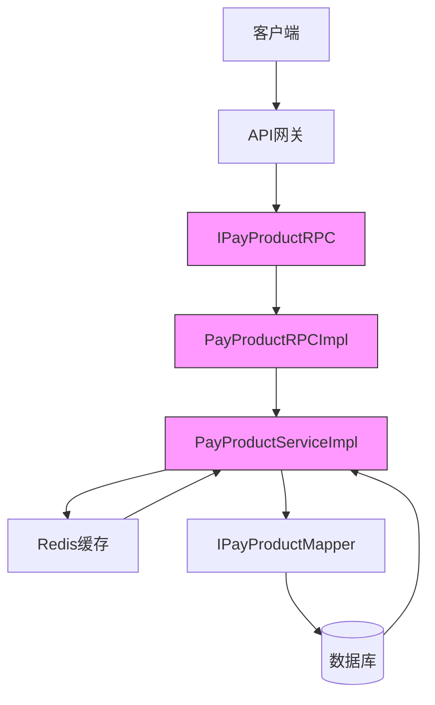
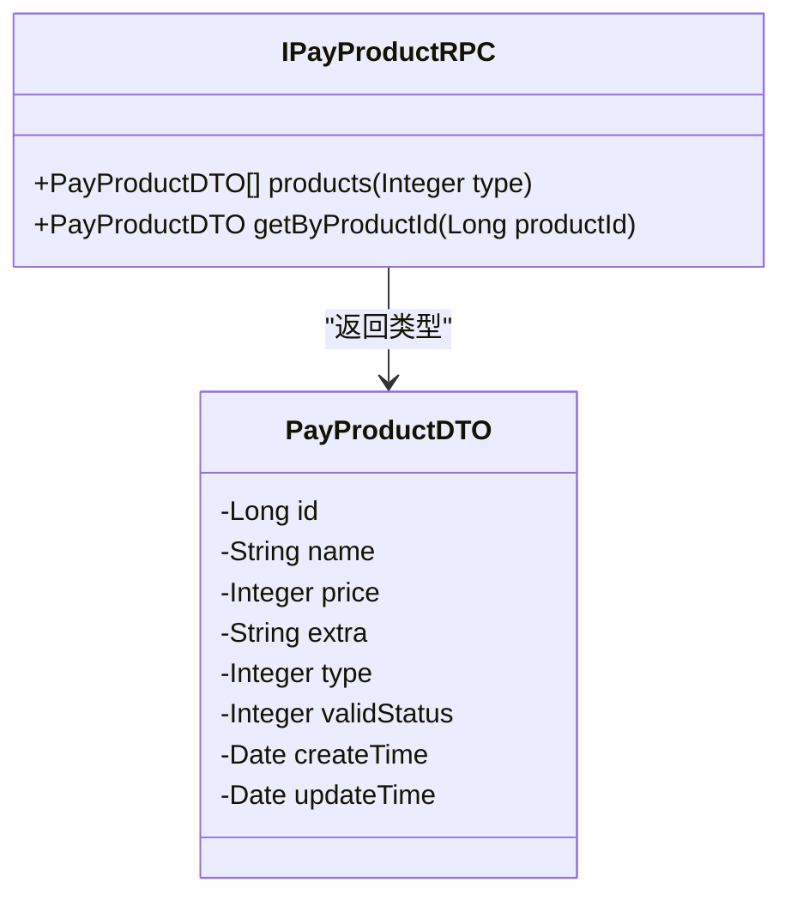
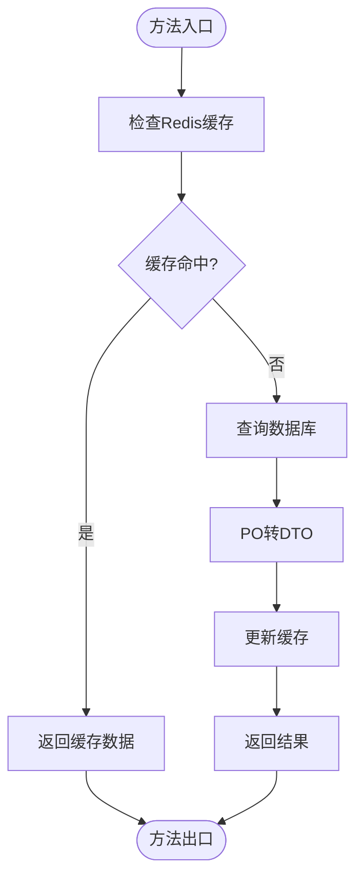
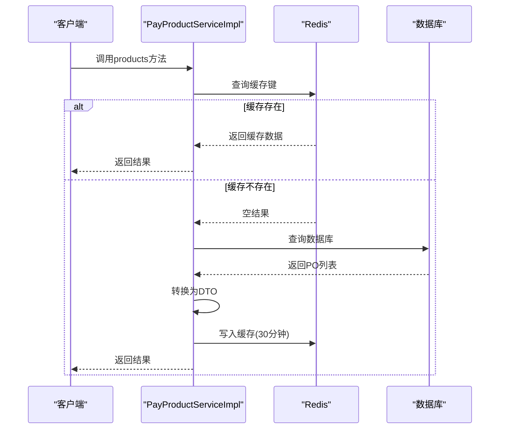
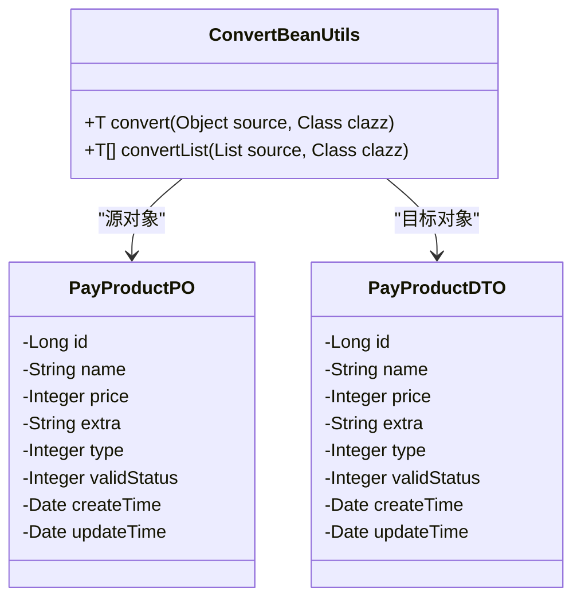
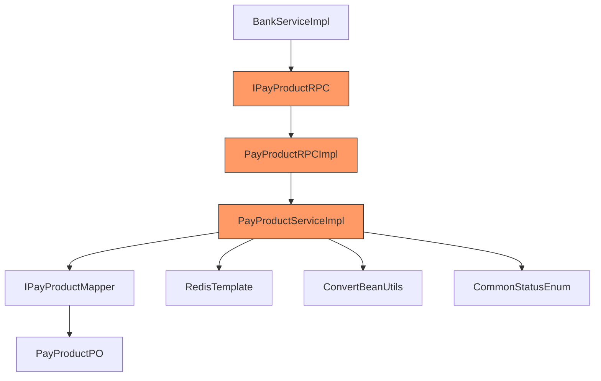

# 支付产品管理

<cite>
**本文档引用的文件**
- [IPayProductRPC.java](file://live-bank-interface/src/main/java/com/logilong/live/bank/interfaces/IPayProductRPC.java)
- [PayProductDTO.java](file://live-bank-interface/src/main/java/com/logilong/live/bank/dto/PayProductDTO.java)
- [PayProductTypeEnum.java](file://live-bank-interface/src/main/java/com/logilong/live/bank/constants/PayProductTypeEnum.java)
- [PayProductRPCImpl.java](file://live-bank-provider/src/main/java/com/logilong/live/bank/provider/rpc/PayProductRPCImpl.java)
- [PayProductServiceImpl.java](file://live-bank-provider/src/main/java/com/logilong/live/bank/provider/service/impl/PayProductServiceImpl.java)
- [PayProductPO.java](file://live-bank-provider/src/main/java/com/logilong/live/bank/provider/dao/po/PayProductPO.java)
- [IPayProductMapper.java](file://live-bank-provider/src/main/java/com/logilong/live/bank/provider/dao/mapper/IPayProductMapper.java)
- [BankProviderCacheKeyBuilder.java](file://live-framework/live-framework-redis-starter/src/main/java/com/logilong/live/framework/redis/starter/key/BankProviderCacheKeyBuilder.java)
- [CommonStatusEnum.java](file://live-common-interface/src/main/java/com/logilong/live/common/interfaces/enums/CommonStatusEnum.java)
</cite>

## 目录
1. [引言](#引言)
2. [项目结构](#项目结构)
3. [核心组件](#核心组件)
4. [架构概述](#架构概述)
5. [详细组件分析](#详细组件分析)
6. [依赖分析](#依赖分析)
7. [性能考虑](#性能考虑)
8. [故障排除指南](#故障排除指南)
9. [结论](#结论)

## 引言
本文档全面讲解支付产品服务的设计与实现，重点分析IPayProductRPC接口中批量查询products和单个查询getByProductId方法的业务逻辑。详细阐述PayProductDTO数据传输对象与PayProductPO持久化对象之间的转换关系，以及不同业务场景下支付产品的分类管理机制（PayProductTypeEnum）。同时说明产品信息缓存策略、商品数据的读写分离设计与数据库查询性能优化方案。

## 项目结构
支付产品管理模块采用典型的分层架构设计，包含接口定义、服务实现、数据访问等层次。核心功能分布在live-bank-interface和live-bank-provider两个模块中，通过Dubbo RPC进行服务调用。

**图示来源**
- [IPayProductRPC.java](file://live-bank-interface/src/main/java/com/logilong/live/bank/interfaces/IPayProductRPC.java)
- [PayProductRPCImpl.java](file://live-bank-provider/src/main/java/com/logilong/live/bank/provider/rpc/PayProductRPCImpl.java)
- [PayProductServiceImpl.java](file://live-bank-provider/src/main/java/com/logilong/live/bank/provider/service/impl/PayProductServiceImpl.java)
- [IPayProductMapper.java](file://live-bank-provider/src/main/java/com/logilong/live/bank/provider/dao/mapper/IPayProductMapper.java)
- [PayProductPO.java](file://live-bank-provider/src/main/java/com/logilong/live/bank/provider/dao/po/PayProductPO.java)
- [BankProviderCacheKeyBuilder.java](file://live-framework/live-framework-redis-starter/src/main/java/com/logilong/live/framework/redis/starter/key/BankProviderCacheKeyBuilder.java)

**本节来源**
- [IPayProductRPC.java](file://live-bank-interface/src/main/java/com/logilong/live/bank/interfaces/IPayProductRPC.java)
- [PayProductRPCImpl.java](file://live-bank-provider/src/main/java/com/logilong/live/bank/provider/rpc/PayProductRPCImpl.java)

## 核心组件
支付产品管理的核心组件包括接口定义、数据传输对象、服务实现和持久化对象。这些组件协同工作，提供高效稳定的支付产品查询服务。

**本节来源**
- [IPayProductRPC.java](file://live-bank-interface/src/main/java/com/logilong/live/bank/interfaces/IPayProductRPC.java)
- [PayProductDTO.java](file://live-bank-interface/src/main/java/com/logilong/live/bank/dto/PayProductDTO.java)
- [PayProductPO.java](file://live-bank-provider/src/main/java/com/logilong/live/bank/provider/dao/po/PayProductPO.java)

## 架构概述
支付产品服务采用典型的三层架构：接口层、服务层和数据访问层。通过Dubbo框架实现服务暴露与调用，利用Redis实现多级缓存策略，有效提升系统性能。

**图示来源**
- [IPayProductRPC.java](file://live-bank-interface/src/main/java/com/logilong/live/bank/interfaces/IPayProductRPC.java)
- [PayProductRPCImpl.java](file://live-bank-provider/src/main/java/com/logilong/live/bank/provider/rpc/PayProductRPCImpl.java)
- [PayProductServiceImpl.java](file://live-bank-provider/src/main/java/com/logilong/live/bank/provider/service/impl/PayProductServiceImpl.java)
- [IPayProductMapper.java](file://live-bank-provider/src/main/java/com/logilong/live/bank/provider/dao/mapper/IPayProductMapper.java)

## 详细组件分析

### 接口定义分析
IPayProductRPC接口定义了两个核心方法：批量查询products和单个查询getByProductId，为上层应用提供统一的支付产品访问入口。

**图示来源**
- [IPayProductRPC.java](file://live-bank-interface/src/main/java/com/logilong/live/bank/interfaces/IPayProductRPC.java#L8-L21)
- [PayProductDTO.java](file://live-bank-interface/src/main/java/com/logilong/live/bank/dto/PayProductDTO.java#L10-L23)

**本节来源**
- [IPayProductRPC.java](file://live-bank-interface/src/main/java/com/logilong/live/bank/interfaces/IPayProductRPC.java#L8-L21)
- [PayProductDTO.java](file://live-bank-interface/src/main/java/com/logilong/live/bank/dto/PayProductDTO.java#L10-L23)

### 服务实现分析
PayProductServiceImpl实现了核心业务逻辑，包括缓存策略、数据库查询和对象转换。采用读写分离设计，优先从Redis缓存读取数据，提高响应速度。

**图示来源**
- [PayProductServiceImpl.java](file://live-bank-provider/src/main/java/com/logilong/live/bank/provider/service/impl/PayProductServiceImpl.java#L30-L80)

**本节来源**
- [PayProductServiceImpl.java](file://live-bank-provider/src/main/java/com/logilong/live/bank/provider/service/impl/PayProductServiceImpl.java#L30-L80)

### 缓存策略分析
系统采用两级缓存策略，针对批量查询和单个查询分别构建不同的缓存键，有效降低数据库压力。

**图示来源**
- [PayProductServiceImpl.java](file://live-bank-provider/src/main/java/com/logilong/live/bank/provider/service/impl/PayProductServiceImpl.java#L30-L54)
- [BankProviderCacheKeyBuilder.java](file://live-framework/live-framework-redis-starter/src/main/java/com/logilong/live/framework/redis/starter/key/BankProviderCacheKeyBuilder.java#L18-L26)

**本节来源**
- [PayProductServiceImpl.java](file://live-bank-provider/src/main/java/com/logilong/live/bank/provider/service/impl/PayProductServiceImpl.java#L30-L54)
- [BankProviderCacheKeyBuilder.java](file://live-framework/live-framework-redis-starter/src/main/java/com/logilong/live/framework/redis/starter/key/BankProviderCacheKeyBuilder.java#L18-L26)

### 对象转换分析
系统通过ConvertBeanUtils工具类实现PayProductPO到PayProductDTO的转换，确保数据在不同层次间的正确传递。

**图示来源**
- [PayProductPO.java](file://live-bank-provider/src/main/java/com/logilong/live/bank/provider/dao/po/PayProductPO.java#L15-L26)
- [PayProductDTO.java](file://live-bank-interface/src/main/java/com/logilong/live/bank/dto/PayProductDTO.java#L10-L23)
- [PayProductServiceImpl.java](file://live-bank-provider/src/main/java/com/logilong/live/bank/provider/service/impl/PayProductServiceImpl.java#L44)

**本节来源**
- [PayProductPO.java](file://live-bank-provider/src/main/java/com/logilong/live/bank/provider/dao/po/PayProductPO.java#L15-L26)
- [PayProductDTO.java](file://live-bank-interface/src/main/java/com/logilong/live/bank/dto/PayProductDTO.java#L10-L23)
- [PayProductServiceImpl.java](file://live-bank-provider/src/main/java/com/logilong/live/bank/provider/service/impl/PayProductServiceImpl.java#L44)

## 依赖分析
支付产品服务依赖多个核心组件，形成完整的调用链路。

**图示来源**
- [PayProductRPCImpl.java](file://live-bank-provider/src/main/java/com/logilong/live/bank/provider/rpc/PayProductRPCImpl.java#L12-L26)
- [PayProductServiceImpl.java](file://live-bank-provider/src/main/java/com/logilong/live/bank/provider/service/impl/PayProductServiceImpl.java#L21-L80)
- [IPayProductMapper.java](file://live-bank-provider/src/main/java/com/logilong/live/bank/provider/dao/mapper/IPayProductMapper.java#L8-L9)

**本节来源**
- [PayProductRPCImpl.java](file://live-bank-provider/src/main/java/com/logilong/live/bank/provider/rpc/PayProductRPCImpl.java#L12-L26)
- [PayProductServiceImpl.java](file://live-bank-provider/src/main/java/com/logilong/live/bank/provider/service/impl/PayProductServiceImpl.java#L21-L80)

## 性能考虑
系统在性能方面进行了多项优化设计：

1. **缓存策略**：采用Redis缓存，批量查询缓存30分钟，单个查询也设置合理过期时间
2. **读写分离**：优先读取缓存，减少数据库压力
3. **空值缓存**：对空结果也进行缓存，防止缓存穿透
4. **批量操作**：使用leftPushAll进行批量缓存写入，提高效率
5. **数据库优化**：通过LambdaQueryWrapper构建查询条件，确保查询效率

**本节来源**
- [PayProductServiceImpl.java](file://live-bank-provider/src/main/java/com/logilong/live/bank/provider/service/impl/PayProductServiceImpl.java#L30-L54)

## 故障排除指南
常见问题及解决方案：

1. **缓存未生效**：检查Redis连接是否正常，确认缓存键生成逻辑
2. **数据不一致**：验证缓存更新时机，确保数据变更时及时清除缓存
3. **查询性能低下**：检查数据库索引，确认type和validStatus字段有适当索引
4. **转换异常**：确保PO和DTO字段类型匹配，特别是日期类型处理

**本节来源**
- [PayProductServiceImpl.java](file://live-bank-provider/src/main/java/com/logilong/live/bank/provider/service/impl/PayProductServiceImpl.java#L30-L80)
- [BankProviderCacheKeyBuilder.java](file://live-framework/live-framework-redis-starter/src/main/java/com/logilong/live/framework/redis/starter/key/BankProviderCacheKeyBuilder.java#L18-L26)

## 结论
支付产品管理服务通过合理的分层设计和缓存策略，实现了高性能、高可用的产品查询功能。系统采用标准的DTO-Service-PO模式，确保代码的可维护性和扩展性。通过Dubbo RPC暴露服务接口，便于其他模块调用。缓存机制有效降低了数据库压力，提高了系统响应速度。整体设计充分考虑了性能、可靠性和可维护性，为平台提供了稳定的支付产品支持。