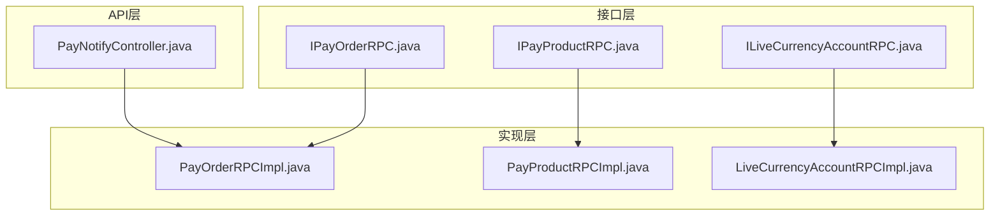
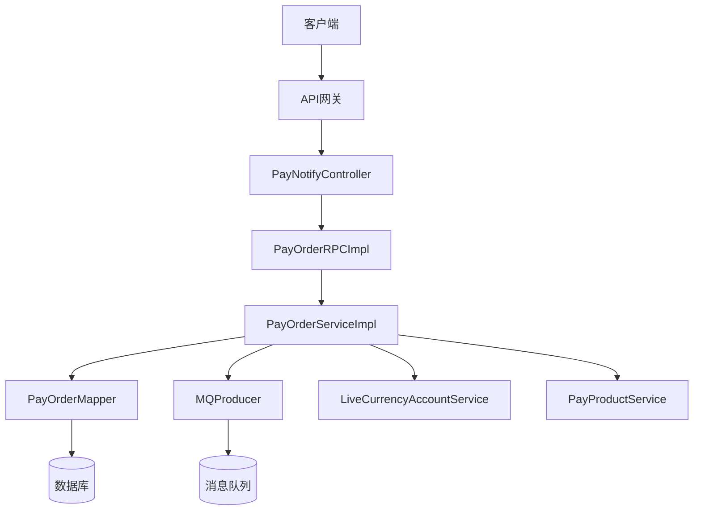
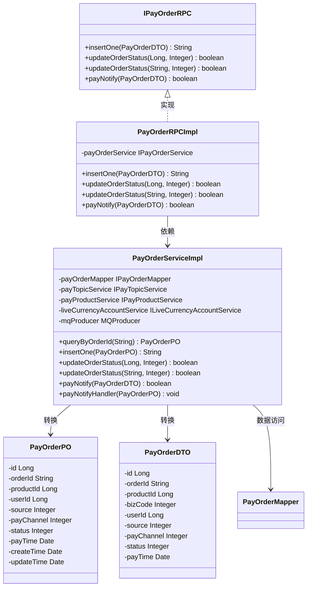
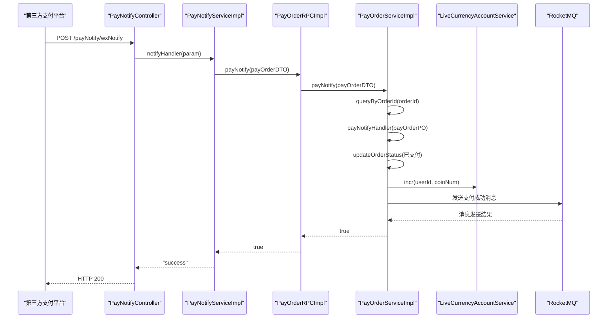
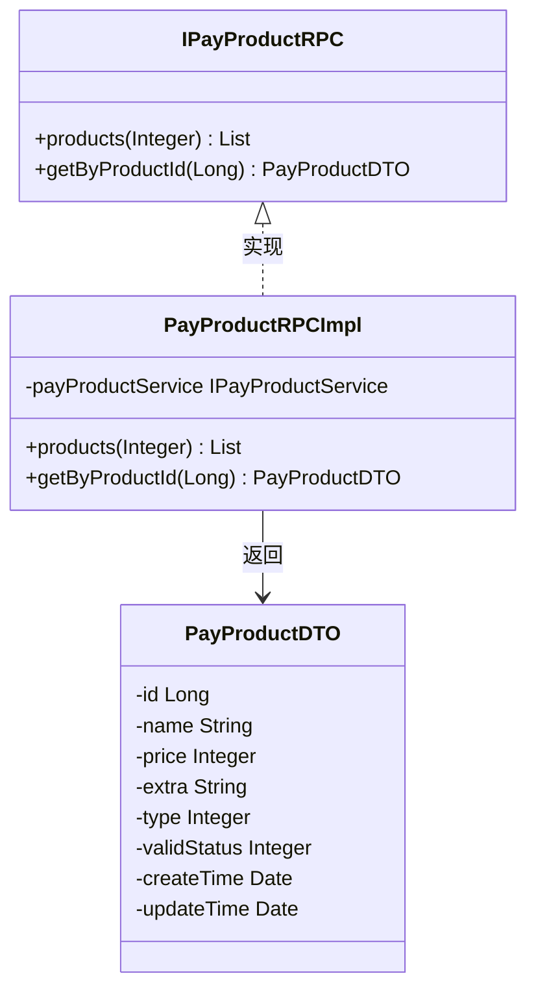
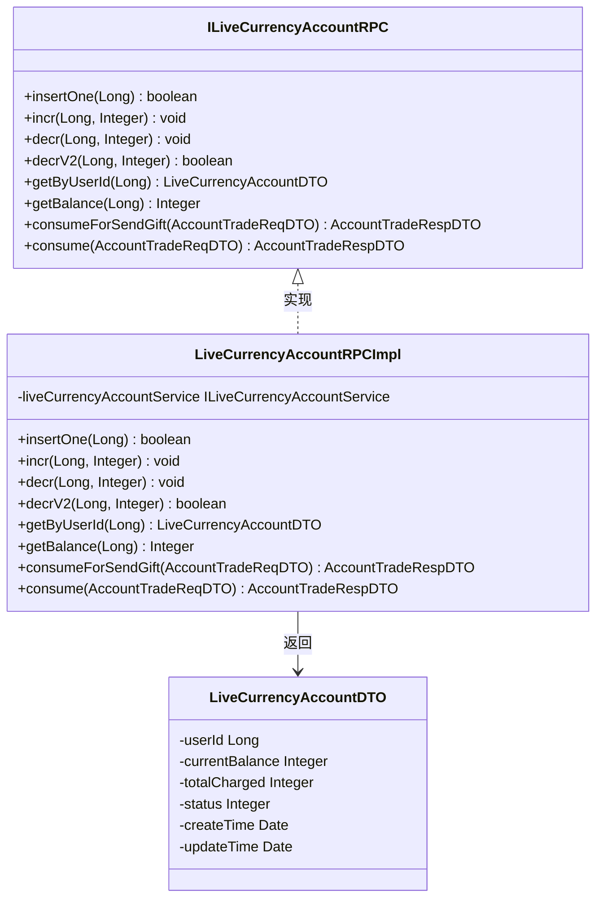
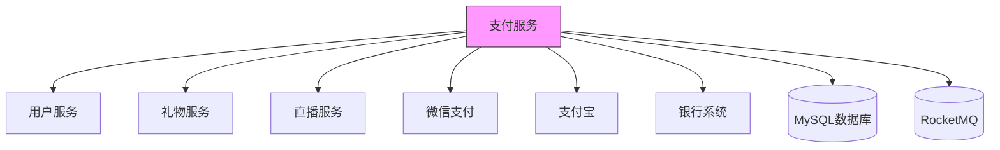

# 支付服务

<cite>
**本文档引用的文件**
- [IPayOrderRPC.java](file://live-bank-interface/src/main/java/com/logilong/live/bank/interfaces/IPayOrderRPC.java)
- [IPayProductRPC.java](file://live-bank-interface/src/main/java/com/logilong/live/bank/interfaces/IPayProductRPC.java)
- [ILiveCurrencyAccountRPC.java](file://live-bank-interface/src/main/java/com/logilong/live/bank/interfaces/ILiveCurrencyAccountRPC.java)
- [PayOrderRPCImpl.java](file://live-bank-provider/src/main/java/com/logilong/live/bank/provider/rpc/PayOrderRPCImpl.java)
- [PayProductRPCImpl.java](file://live-bank-provider/src/main/java/com/logilong/live/bank/provider/rpc/PayProductRPCImpl.java)
- [LiveCurrencyAccountRPCImpl.java](file://live-bank-provider/src/main/java/com/logilong/live/bank/provider/rpc/LiveCurrencyAccountRPCImpl.java)
- [PayNotifyController.java](file://live-bank-api/src/main/java/com/logilong/live/bank/api/controller/PayNotifyController.java)
- [PayOrderPO.java](file://live-bank-provider/src/main/java/com/logilong/live/bank/provider/dao/po/PayOrderPO.java)
- [PayOrderServiceImpl.java](file://live-bank-provider/src/main/java/com/logilong/live/bank/provider/service/impl/PayOrderServiceImpl.java)
- [PayOrderDTO.java](file://live-bank-interface/src/main/java/com/logilong/live/bank/dto/PayOrderDTO.java)
- [PayProductDTO.java](file://live-bank-interface/src/main/java/com/logilong/live/bank/dto/PayProductDTO.java)
- [LiveCurrencyAccountDTO.java](file://live-bank-interface/src/main/java/com/logilong/live/bank/dto/LiveCurrencyAccountDTO.java)
- [PayNotifyServiceImpl.java](file://live-bank-api/src/main/java/com/logilong/live/bank/api/service/impl/PayNotifyServiceImpl.java)
- [OrderStatusEnum.java](file://live-bank-interface/src/main/java/com/logilong/live/bank/constants/OrderStatusEnum.java)
- [PayProductTypeEnum.java](file://live-bank-interface/src/main/java/com/logilong/live/bank/constants/PayProductTypeEnum.java)
- [PayChannelEnum.java](file://live-bank-interface/src/main/java/com/logilong/live/bank/constants/PayChannelEnum.java)
- [PaySourceEnum.java](file://live-bank-interface/src/main/java/com/logilong/live/bank/constants/PaySourceEnum.java)
</cite>

## 目录
1. [简介](#简介)
2. [项目结构](#项目结构)
3. [核心组件](#核心组件)
4. [架构概述](#架构概述)
5. [详细组件分析](#详细组件分析)
6. [依赖分析](#依赖分析)
7. [性能考虑](#性能考虑)
8. [故障排除指南](#故障排除指南)
9. [结论](#结论)

## 简介
本文档全面解析支付服务的架构设计与业务实现，涵盖支付订单（PayOrder）、支付产品（PayProduct）和虚拟货币账户（LiveCurrencyAccount）三大核心功能。详细说明IPayOrderRPC等Dubbo接口的定义规范及其实现类PayOrderRPCImpl的服务暴露机制。阐述支付回调处理流程（PayNotifyController）与数据库持久化设计（PayOrderPO）。结合支付场景说明事务管理、幂等性保障与对账机制。分析该服务与银行系统、第三方支付平台的集成方式及安全合规要求。

## 项目结构
支付服务采用微服务架构，分为接口层、实现层和API层。接口定义位于`live-bank-interface`模块，实现位于`live-bank-provider`模块，API控制器位于`live-bank-api`模块。这种分层设计实现了接口与实现的解耦，便于服务的独立部署和维护。

**图示来源**
- [IPayOrderRPC.java](file://live-bank-interface/src/main/java/com/logilong/live/bank/interfaces/IPayOrderRPC.java)
- [PayOrderRPCImpl.java](file://live-bank-provider/src/main/java/com/logilong/live/bank/provider/rpc/PayOrderRPCImpl.java)
- [PayNotifyController.java](file://live-bank-api/src/main/java/com/logilong/live/bank/api/controller/PayNotifyController.java)

**本节来源**
- [IPayOrderRPC.java](file://live-bank-interface/src/main/java/com/logilong/live/bank/interfaces/IPayOrderRPC.java)
- [PayOrderRPCImpl.java](file://live-bank-provider/src/main/java/com/logilong/live/bank/provider/rpc/PayOrderRPCImpl.java)
- [PayNotifyController.java](file://live-bank-api/src/main/java/com/logilong/live/bank/api/controller/PayNotifyController.java)

## 核心组件
支付服务的核心组件包括支付订单、支付产品和虚拟货币账户三大功能模块。这些组件通过Dubbo RPC进行通信，实现了服务的分布式调用。支付订单管理交易生命周期，支付产品提供商品信息，虚拟货币账户处理虚拟币的增减操作。

**本节来源**
- [IPayOrderRPC.java](file://live-bank-interface/src/main/java/com/logilong/live/bank/interfaces/IPayOrderRPC.java)
- [IPayProductRPC.java](file://live-bank-interface/src/main/java/com/logilong/live/bank/interfaces/IPayProductRPC.java)
- [ILiveCurrencyAccountRPC.java](file://live-bank-interface/src/main/java/com/logilong/live/bank/interfaces/ILiveCurrencyAccountRPC.java)

## 架构概述
支付服务采用典型的微服务架构，通过Dubbo实现服务间的RPC调用。系统分为接口定义、服务实现和API网关三层。接口层定义了服务契约，实现层提供具体业务逻辑，API层处理外部请求。服务间通过RocketMQ进行异步消息通信，确保系统的高可用性和最终一致性。

**图示来源**
- [PayNotifyController.java](file://live-bank-api/src/main/java/com/logilong/live/bank/api/controller/PayNotifyController.java)
- [PayOrderRPCImpl.java](file://live-bank-provider/src/main/java/com/logilong/live/bank/provider/rpc/PayOrderRPCImpl.java)
- [PayOrderServiceImpl.java](file://live-bank-provider/src/main/java/com/logilong/live/bank/provider/service/impl/PayOrderServiceImpl.java)

## 详细组件分析

### 支付订单组件分析
支付订单组件是交易系统的核心，负责管理订单的全生命周期。该组件通过IPayOrderRPC接口暴露服务，由PayOrderRPCImpl实现类提供具体实现。订单状态管理遵循严格的有限状态机，确保交易的一致性和可靠性。

#### 类图

**图示来源**
- [IPayOrderRPC.java](file://live-bank-interface/src/main/java/com/logilong/live/bank/interfaces/IPayOrderRPC.java)
- [PayOrderRPCImpl.java](file://live-bank-provider/src/main/java/com/logilong/live/bank/provider/rpc/PayOrderRPCImpl.java)
- [PayOrderServiceImpl.java](file://live-bank-provider/src/main/java/com/logilong/live/bank/provider/service/impl/PayOrderServiceImpl.java)
- [PayOrderPO.java](file://live-bank-provider/src/main/java/com/logilong/live/bank/provider/dao/po/PayOrderPO.java)
- [PayOrderDTO.java](file://live-bank-interface/src/main/java/com/logilong/live/bank/dto/PayOrderDTO.java)

#### 支付回调流程

**图示来源**
- [PayNotifyController.java](file://live-bank-api/src/main/java/com/logilong/live/bank/api/controller/PayNotifyController.java)
- [PayNotifyServiceImpl.java](file://live-bank-api/src/main/java/com/logilong/live/bank/api/service/impl/PayNotifyServiceImpl.java)
- [PayOrderRPCImpl.java](file://live-bank-provider/src/main/java/com/logilong/live/bank/provider/rpc/PayOrderRPCImpl.java)
- [PayOrderServiceImpl.java](file://live-bank-provider/src/main/java/com/logilong/live/bank/provider/service/impl/PayOrderServiceImpl.java)

**本节来源**
- [PayNotifyController.java](file://live-bank-api/src/main/java/com/logilong/live/bank/api/controller/PayNotifyController.java)
- [PayNotifyServiceImpl.java](file://live-bank-api/src/main/java/com/logilong/live/bank/api/service/impl/PayNotifyServiceImpl.java)
- [PayOrderRPCImpl.java](file://live-bank-provider/src/main/java/com/logilong/live/bank/provider/rpc/PayOrderRPCImpl.java)
- [PayOrderServiceImpl.java](file://live-bank-provider/src/main/java/com/logilong/live/bank/provider/service/impl/PayOrderServiceImpl.java)

### 支付产品组件分析
支付产品组件管理所有可购买的商品信息，包括价格、类型和额外配置。该组件通过IPayProductRPC接口暴露服务，由PayProductRPCImpl实现类提供具体实现。

#### 类图

**图示来源**
- [IPayProductRPC.java](file://live-bank-interface/src/main/java/com/logilong/live/bank/interfaces/IPayProductRPC.java)
- [PayProductRPCImpl.java](file://live-bank-provider/src/main/java/com/logilong/live/bank/provider/rpc/PayProductRPCImpl.java)
- [PayProductDTO.java](file://live-bank-interface/src/main/java/com/logilong/live/bank/dto/PayProductDTO.java)

**本节来源**
- [IPayProductRPC.java](file://live-bank-interface/src/main/java/com/logilong/live/bank/interfaces/IPayProductRPC.java)
- [PayProductRPCImpl.java](file://live-bank-provider/src/main/java/com/logilong/live/bank/provider/rpc/PayProductRPCImpl.java)

### 虚拟货币账户组件分析
虚拟货币账户组件管理用户的虚拟币余额和交易。该组件通过ILiveCurrencyAccountRPC接口暴露服务，由LiveCurrencyAccountRPCImpl实现类提供具体实现。

#### 类图

**图示来源**
- [ILiveCurrencyAccountRPC.java](file://live-bank-interface/src/main/java/com/logilong/live/bank/interfaces/ILiveCurrencyAccountRPC.java)
- [LiveCurrencyAccountRPCImpl.java](file://live-bank-provider/src/main/java/com/logilong/live/bank/provider/rpc/LiveCurrencyAccountRPCImpl.java)
- [LiveCurrencyAccountDTO.java](file://live-bank-interface/src/main/java/com/logilong/live/bank/dto/LiveCurrencyAccountDTO.java)

**本节来源**
- [ILiveCurrencyAccountRPC.java](file://live-bank-interface/src/main/java/com/logilong/live/bank/interfaces/ILiveCurrencyAccountRPC.java)
- [LiveCurrencyAccountRPCImpl.java](file://live-bank-provider/src/main/java/com/logilong/live/bank/provider/rpc/LiveCurrencyAccountRPCImpl.java)

## 依赖分析
支付服务与其他系统存在紧密的依赖关系。通过Dubbo RPC与用户服务、礼物服务等其他微服务通信，通过RocketMQ与消息系统集成，通过数据库访问层与MySQL数据库交互。服务还依赖于第三方支付平台的回调接口。

**图示来源**
- [PayOrderRPCImpl.java](file://live-bank-provider/src/main/java/com/logilong/live/bank/provider/rpc/PayOrderRPCImpl.java)
- [PayOrderServiceImpl.java](file://live-bank-provider/src/main/java/com/logilong/live/bank/provider/service/impl/PayOrderServiceImpl.java)
- [PayNotifyController.java](file://live-bank-api/src/main/java/com/logilong/live/bank/api/controller/PayNotifyController.java)

**本节来源**
- [PayOrderRPCImpl.java](file://live-bank-provider/src/main/java/com/logilong/live/bank/provider/rpc/PayOrderRPCImpl.java)
- [PayOrderServiceImpl.java](file://live-bank-provider/src/main/java/com/logilong/live/bank/provider/service/impl/PayOrderServiceImpl.java)

## 性能考虑
支付服务在设计时充分考虑了性能因素。通过Redis缓存热点数据，使用数据库连接池优化数据库访问，采用异步消息处理非核心业务逻辑。对于高并发场景，如送礼功能，专门设计了优化的扣减库存逻辑。

**本节来源**
- [LiveCurrencyAccountRPCImpl.java](file://live-bank-provider/src/main/java/com/logilong/live/bank/provider/rpc/LiveCurrencyAccountRPCImpl.java)
- [PayOrderServiceImpl.java](file://live-bank-provider/src/main/java/com/logilong/live/bank/provider/service/impl/PayOrderServiceImpl.java)

## 故障排除指南
当支付服务出现问题时，应首先检查日志文件中的错误信息。常见的问题包括订单状态不一致、支付回调失败、虚拟币余额错误等。对于支付回调问题，需要验证回调参数的完整性和正确性，检查订单是否存在以及状态是否合法。

**本节来源**
- [PayOrderServiceImpl.java](file://live-bank-provider/src/main/java/com/logilong/live/bank/provider/service/impl/PayOrderServiceImpl.java)
- [PayNotifyServiceImpl.java](file://live-bank-api/src/main/java/com/logilong/live/bank/api/service/impl/PayNotifyServiceImpl.java)

## 结论
支付服务通过清晰的分层架构和模块化设计，实现了高内聚、低耦合的系统结构。服务通过Dubbo RPC提供稳定的接口，通过RocketMQ实现异步解耦，确保了系统的可靠性和可扩展性。未来可以进一步优化事务管理，增强对账机制，提高系统的安全性和稳定性。