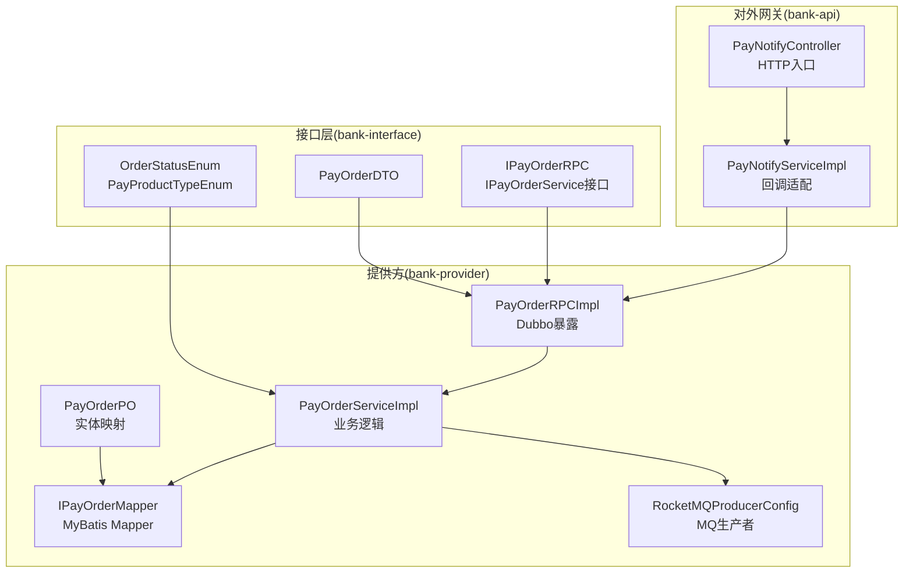
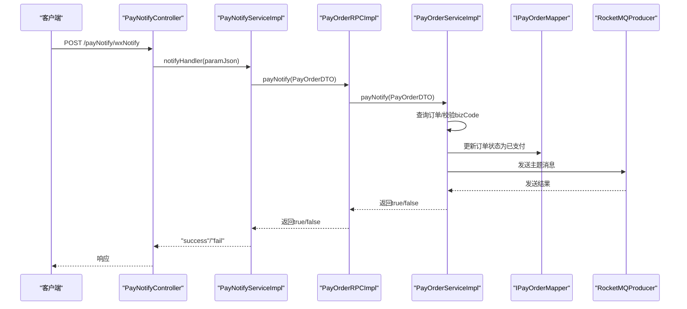
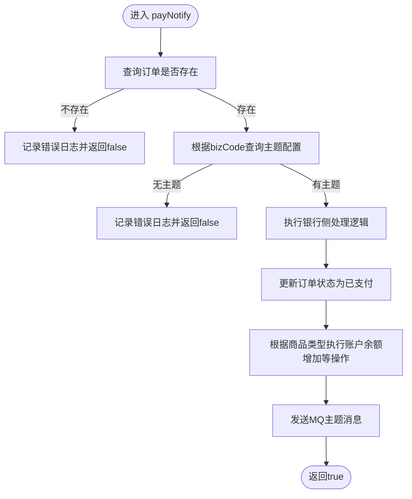
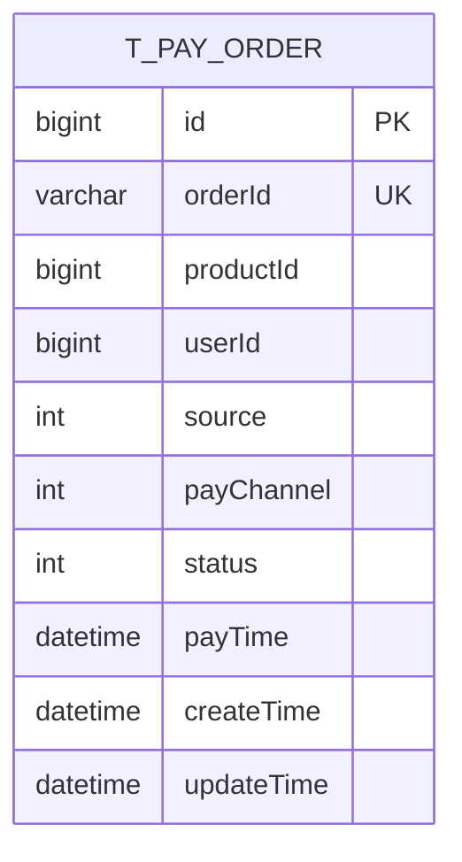
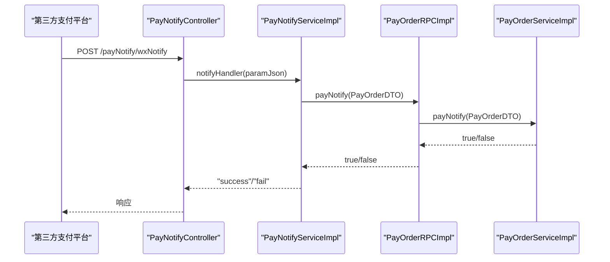
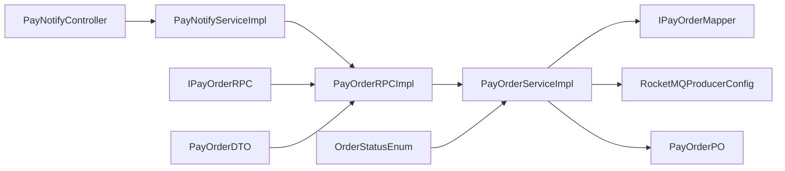

# 支付订单服务

<cite>
**本文引用的文件列表**
- [IPayOrderRPC.java](file://live-bank-interface/src/main/java/com/logilong/live/bank/interfaces/IPayOrderRPC.java)
- [PayOrderRPCImpl.java](file://live-bank-provider/src/main/java/com/logilong/live/bank/provider/rpc/PayOrderRPCImpl.java)
- [IPayOrderService.java](file://live-bank-provider/src/main/java/com/logilong/live/bank/provider/service/IPayOrderService.java)
- [PayOrderServiceImpl.java](file://live-bank-provider/src/main/java/com/logilong/live/bank/provider/service/impl/PayOrderServiceImpl.java)
- [IPayOrderMapper.java](file://live-bank-provider/src/main/java/com/logilong/live/bank/provider/dao/mapper/IPayOrderMapper.java)
- [PayOrderPO.java](file://live-bank-provider/src/main/java/com/logilong/live/bank/provider/dao/po/PayOrderPO.java)
- [PayOrderDTO.java](file://live-bank-interface/src/main/java/com/logilong/live/bank/dto/PayOrderDTO.java)
- [OrderStatusEnum.java](file://live-bank-interface/src/main/java/com/logilong/live/bank/constants/OrderStatusEnum.java)
- [PayProductTypeEnum.java](file://live-bank-interface/src/main/java/com/logilong/live/bank/constants/PayProductTypeEnum.java)
- [PayNotifyController.java](file://live-bank-api/src/main/java/com/logilong/live/bank/api/controller/PayNotifyController.java)
- [PayNotifyServiceImpl.java](file://live-bank-api/src/main/java/com/logilong/live/bank/api/service/impl/PayNotifyServiceImpl.java)
- [RocketMQProducerConfig.java](file://live-framework/live-framework-mq-starter/src/main/java/com/logilong/live/framework/mq/starter/producer/RocketMQProducerConfig.java)
- [RocketMQProducerProperties.java](file://live-framework/live-framework-mq-starter/src/main/java/com/logilong/live/framework/mq/starter/properties/RocketMQProducerProperties.java)
- [bootstrap.yml](file://live-bank-provider/src/main/resources/bootstrap.yml)
- [GlobalExceptionHandler.java](file://live-framework/live-framework-web-starter/src/main/java/com/logilong/live/web/starter/error/GlobalExceptionHandler.java)
</cite>

## 目录
1. [简介](#简介)
2. [项目结构](#项目结构)
3. [核心组件](#核心组件)
4. [架构总览](#架构总览)
5. [详细组件分析](#详细组件分析)
6. [依赖关系分析](#依赖关系分析)
7. [性能与扩展性](#性能与扩展性)
8. [故障排查指南](#故障排查指南)
9. [结论](#结论)
10. [附录](#附录)

## 简介
本文件面向支付订单服务的完整实现流程，围绕以下目标展开：
- 接口与实现：IPayOrderRPC接口定义、PayOrderRPCImpl远程调用暴露、PayOrderServiceImpl业务逻辑处理、IPayOrderMapper数据持久化。
- 核心能力：订单创建(insertOne)、状态更新(updateOrderStatus)、支付回调(payNotify)。
- 数据模型：基于PayOrderPO实体的字段映射与索引优化建议。
- 状态机与幂等：订单状态机(OrderStatusEnum)、幂等性保障与分布式事务处理思路。
- 使用场景：订单生成与状态变更的完整调用链路示例。
- 异常与日志：异常处理与日志追踪机制。

## 项目结构
支付订单服务涉及三层：
- 接口层（bank-interface）：定义RPC接口与领域常量、DTO。
- 提供方（bank-provider）：实现RPC、服务、DAO与PO，接入MQ与数据库。
- 对外网关（bank-api）：接收外部回调，转发至RPC。

图表来源
- [IPayOrderRPC.java](file://live-bank-interface/src/main/java/com/logilong/live/bank/interfaces/IPayOrderRPC.java#L1-L31)
- [PayOrderRPCImpl.java](file://live-bank-provider/src/main/java/com/logilong/live/bank/provider/rpc/PayOrderRPCImpl.java#L1-L37)
- [IPayOrderService.java](file://live-bank-provider/src/main/java/com/logilong/live/bank/provider/service/IPayOrderService.java#L1-L32)
- [PayOrderServiceImpl.java](file://live-bank-provider/src/main/java/com/logilong/live/bank/provider/service/impl/PayOrderServiceImpl.java#L1-L126)
- [IPayOrderMapper.java](file://live-bank-provider/src/main/java/com/logilong/live/bank/provider/dao/mapper/IPayOrderMapper.java#L1-L10)
- [PayOrderPO.java](file://live-bank-provider/src/main/java/com/logilong/live/bank/provider/dao/po/PayOrderPO.java#L1-L26)
- [PayNotifyController.java](file://live-bank-api/src/main/java/com/logilong/live/bank/api/controller/PayNotifyController.java#L1-L26)
- [PayNotifyServiceImpl.java](file://live-bank-api/src/main/java/com/logilong/live/bank/api/service/impl/PayNotifyServiceImpl.java#L1-L28)
- [RocketMQProducerConfig.java](file://live-framework/live-framework-mq-starter/src/main/java/com/logilong/live/framework/mq/starter/producer/RocketMQProducerConfig.java#L1-L52)

章节来源
- [IPayOrderRPC.java](file://live-bank-interface/src/main/java/com/logilong/live/bank/interfaces/IPayOrderRPC.java#L1-L31)
- [PayOrderRPCImpl.java](file://live-bank-provider/src/main/java/com/logilong/live/bank/provider/rpc/PayOrderRPCImpl.java#L1-L37)
- [PayOrderServiceImpl.java](file://live-bank-provider/src/main/java/com/logilong/live/bank/provider/service/impl/PayOrderServiceImpl.java#L1-L126)
- [IPayOrderMapper.java](file://live-bank-provider/src/main/java/com/logilong/live/bank/provider/dao/mapper/IPayOrderMapper.java#L1-L10)
- [PayOrderPO.java](file://live-bank-provider/src/main/java/com/logilong/live/bank/provider/dao/po/PayOrderPO.java#L1-L26)
- [PayNotifyController.java](file://live-bank-api/src/main/java/com/logilong/live/bank/api/controller/PayNotifyController.java#L1-L26)
- [PayNotifyServiceImpl.java](file://live-bank-api/src/main/java/com/logilong/live/bank/api/service/impl/PayNotifyServiceImpl.java#L1-L28)
- [RocketMQProducerConfig.java](file://live-framework/live-framework-mq-starter/src/main/java/com/logilong/live/framework/mq/starter/producer/RocketMQProducerConfig.java#L1-L52)

## 核心组件
- IPayOrderRPC：定义订单创建、状态更新、支付回调三类RPC接口，作为对外暴露的契约。
- PayOrderRPCImpl：通过Dubbo注解暴露RPC，内部委托IPayOrderService完成具体逻辑。
- IPayOrderService/PayOrderServiceImpl：封装订单创建、状态更新、支付回调的业务处理，包含状态机驱动与异步通知。
- IPayOrderMapper/PayOrderPO：基于MyBatis的Mapper与实体映射，支撑订单持久化。
- 支付回调：Bank-API接收外部回调，经适配后调用RPC，触发业务处理与MQ通知。

章节来源
- [IPayOrderRPC.java](file://live-bank-interface/src/main/java/com/logilong/live/bank/interfaces/IPayOrderRPC.java#L1-L31)
- [PayOrderRPCImpl.java](file://live-bank-provider/src/main/java/com/logilong/live/bank/provider/rpc/PayOrderRPCImpl.java#L1-L37)
- [IPayOrderService.java](file://live-bank-provider/src/main/java/com/logilong/live/bank/provider/service/IPayOrderService.java#L1-L32)
- [PayOrderServiceImpl.java](file://live-bank-provider/src/main/java/com/logilong/live/bank/provider/service/impl/PayOrderServiceImpl.java#L1-L126)
- [IPayOrderMapper.java](file://live-bank-provider/src/main/java/com/logilong/live/bank/provider/dao/mapper/IPayOrderMapper.java#L1-L10)
- [PayOrderPO.java](file://live-bank-provider/src/main/java/com/logilong/live/bank/provider/dao/po/PayOrderPO.java#L1-L26)
- [PayNotifyController.java](file://live-bank-api/src/main/java/com/logilong/live/bank/api/controller/PayNotifyController.java#L1-L26)
- [PayNotifyServiceImpl.java](file://live-bank-api/src/main/java/com/logilong/live/bank/api/service/impl/PayNotifyServiceImpl.java#L1-L28)

## 架构总览
支付订单服务采用“接口层-提供方-网关”分层，结合Dubbo RPC与RocketMQ异步通知，形成清晰的职责边界与可扩展性。

图表来源
- [PayNotifyController.java](file://live-bank-api/src/main/java/com/logilong/live/bank/api/controller/PayNotifyController.java#L1-L26)
- [PayNotifyServiceImpl.java](file://live-bank-api/src/main/java/com/logilong/live/bank/api/service/impl/PayNotifyServiceImpl.java#L1-L28)
- [PayOrderRPCImpl.java](file://live-bank-provider/src/main/java/com/logilong/live/bank/provider/rpc/PayOrderRPCImpl.java#L1-L37)
- [PayOrderServiceImpl.java](file://live-bank-provider/src/main/java/com/logilong/live/bank/provider/service/impl/PayOrderServiceImpl.java#L1-L126)
- [IPayOrderMapper.java](file://live-bank-provider/src/main/java/com/logilong/live/bank/provider/dao/mapper/IPayOrderMapper.java#L1-L10)
- [RocketMQProducerConfig.java](file://live-framework/live-framework-mq-starter/src/main/java/com/logilong/live/framework/mq/starter/producer/RocketMQProducerConfig.java#L1-L52)

## 详细组件分析

### 接口层：IPayOrderRPC
- 职责：定义订单创建、按主键或订单号更新状态、支付回调三类RPC方法。
- 设计要点：方法签名明确输入输出，便于RPC序列化与跨进程调用；回调参数使用PayOrderDTO承载必要字段。

章节来源
- [IPayOrderRPC.java](file://live-bank-interface/src/main/java/com/logilong/live/bank/interfaces/IPayOrderRPC.java#L1-L31)
- [PayOrderDTO.java](file://live-bank-interface/src/main/java/com/logilong/live/bank/dto/PayOrderDTO.java#L1-L24)

### 远程调用暴露：PayOrderRPCImpl
- 职责：通过Dubbo注解暴露RPC，内部将DTO转换为PO后委派给服务层。
- 关键点：使用通用转换工具将DTO转为PO，保持接口与实现的解耦。

章节来源
- [PayOrderRPCImpl.java](file://live-bank-provider/src/main/java/com/logilong/live/bank/provider/rpc/PayOrderRPCImpl.java#L1-L37)

### 业务逻辑：PayOrderServiceImpl
- 订单创建(insertOne)：生成唯一orderId并写入数据库，返回orderId。
- 状态更新(updateOrderStatus)：支持按主键与按订单号两种更新路径，均返回布尔结果。
- 支付回调(payNotify)：校验订单与业务码，执行银行侧处理逻辑，随后向MQ发送主题消息，最后返回true。

图表来源
- [PayOrderServiceImpl.java](file://live-bank-provider/src/main/java/com/logilong/live/bank/provider/service/impl/PayOrderServiceImpl.java#L1-L126)
- [OrderStatusEnum.java](file://live-bank-interface/src/main/java/com/logilong/live/bank/constants/OrderStatusEnum.java#L1-L24)
- [PayProductTypeEnum.java](file://live-bank-interface/src/main/java/com/logilong/live/bank/constants/PayProductTypeEnum.java#L1-L17)

章节来源
- [IPayOrderService.java](file://live-bank-provider/src/main/java/com/logilong/live/bank/provider/service/IPayOrderService.java#L1-L32)
- [PayOrderServiceImpl.java](file://live-bank-provider/src/main/java/com/logilong/live/bank/provider/service/impl/PayOrderServiceImpl.java#L1-L126)

### 数据持久化：IPayOrderMapper 与 PayOrderPO
- 实体映射：表名为t_pay_order，主键自增，包含用户ID、商品ID、来源、支付渠道、状态、支付时间、创建与更新时间等字段。
- Mapper接口：继承MyBatis基础Mapper，提供通用CRUD能力。

图表来源
- [PayOrderPO.java](file://live-bank-provider/src/main/java/com/logilong/live/bank/provider/dao/po/PayOrderPO.java#L1-L26)
- [IPayOrderMapper.java](file://live-bank-provider/src/main/java/com/logilong/live/bank/provider/dao/mapper/IPayOrderMapper.java#L1-L10)

章节来源
- [PayOrderPO.java](file://live-bank-provider/src/main/java/com/logilong/live/bank/provider/dao/po/PayOrderPO.java#L1-L26)
- [IPayOrderMapper.java](file://live-bank-provider/src/main/java/com/logilong/live/bank/provider/dao/mapper/IPayOrderMapper.java#L1-L10)

### 支付回调：Bank-API 与 RPC 转发
- 网关控制器：接收外部回调参数，解析为业务对象。
- 适配服务：组装PayOrderDTO并调用IPayOrderRPC.payNotify。
- RPC实现：直接委派服务层处理。

图表来源
- [PayNotifyController.java](file://live-bank-api/src/main/java/com/logilong/live/bank/api/controller/PayNotifyController.java#L1-L26)
- [PayNotifyServiceImpl.java](file://live-bank-api/src/main/java/com/logilong/live/bank/api/service/impl/PayNotifyServiceImpl.java#L1-L28)
- [PayOrderRPCImpl.java](file://live-bank-provider/src/main/java/com/logilong/live/bank/provider/rpc/PayOrderRPCImpl.java#L1-L37)
- [PayOrderServiceImpl.java](file://live-bank-provider/src/main/java/com/logilong/live/bank/provider/service/impl/PayOrderServiceImpl.java#L1-L126)

章节来源
- [PayNotifyController.java](file://live-bank-api/src/main/java/com/logilong/live/bank/api/controller/PayNotifyController.java#L1-L26)
- [PayNotifyServiceImpl.java](file://live-bank-api/src/main/java/com/logilong/live/bank/api/service/impl/PayNotifyServiceImpl.java#L1-L28)
- [PayOrderRPCImpl.java](file://live-bank-provider/src/main/java/com/logilong/live/bank/provider/rpc/PayOrderRPCImpl.java#L1-L37)
- [PayOrderServiceImpl.java](file://live-bank-provider/src/main/java/com/logilong/live/bank/provider/service/impl/PayOrderServiceImpl.java#L1-L126)

### 订单状态机与幂等性
- 状态机：使用OrderStatusEnum定义待支付、支付中、已支付、撤销、无效五种状态，确保状态流转可控。
- 幂等性：payNotify在查询订单与主题配置时失败即返回false，避免重复处理；同时服务层仅在查询到有效订单时才执行后续处理，减少重复写入风险。
- 分布式事务：当前实现通过MQ异步通知，不直接在回调中执行跨库事务；若需强一致，可在MQ消息处理侧引入事务消息或最终一致性补偿机制。

章节来源
- [OrderStatusEnum.java](file://live-bank-interface/src/main/java/com/logilong/live/bank/constants/OrderStatusEnum.java#L1-L24)
- [PayOrderServiceImpl.java](file://live-bank-provider/src/main/java/com/logilong/live/bank/provider/service/impl/PayOrderServiceImpl.java#L1-L126)

### 典型使用场景与调用链
- 场景一：订单生成
  - 输入：PayOrderDTO（含用户、商品、来源、渠道等）
  - 调用链：IPayOrderRPC.insertOne -> PayOrderRPCImpl.insertOne -> PayOrderServiceImpl.insertOne -> IPayOrderMapper.insert
  - 输出：返回orderId
- 场景二：状态变更
  - 输入：订单号或主键、目标状态
  - 调用链：IPayOrderRPC.updateOrderStatus -> PayOrderRPCImpl.updateOrderStatus -> PayOrderServiceImpl.updateOrderStatus -> IPayOrderMapper.updateById/update
- 场景三：支付回调
  - 输入：回调参数（解析为PayOrderDTO）
  - 调用链：PayNotifyController -> PayNotifyServiceImpl -> IPayOrderRPC.payNotify -> PayOrderRPCImpl.payNotify -> PayOrderServiceImpl.payNotify -> IPayOrderMapper.update + MQ通知

章节来源
- [IPayOrderRPC.java](file://live-bank-interface/src/main/java/com/logilong/live/bank/interfaces/IPayOrderRPC.java#L1-L31)
- [PayOrderRPCImpl.java](file://live-bank-provider/src/main/java/com/logilong/live/bank/provider/rpc/PayOrderRPCImpl.java#L1-L37)
- [IPayOrderService.java](file://live-bank-provider/src/main/java/com/logilong/live/bank/provider/service/IPayOrderService.java#L1-L32)
- [PayOrderServiceImpl.java](file://live-bank-provider/src/main/java/com/logilong/live/bank/provider/service/impl/PayOrderServiceImpl.java#L1-L126)
- [IPayOrderMapper.java](file://live-bank-provider/src/main/java/com/logilong/live/bank/provider/dao/mapper/IPayOrderMapper.java#L1-L10)

## 依赖关系分析
- 组件耦合：RPC实现依赖服务接口；服务实现依赖Mapper与MQ生产者；网关依赖RPC接口。
- 外部依赖：Dubbo用于RPC暴露与消费；RocketMQ用于异步通知；Nacos用于注册与配置中心；MyBatis用于ORM。

图表来源
- [PayNotifyController.java](file://live-bank-api/src/main/java/com/logilong/live/bank/api/controller/PayNotifyController.java#L1-L26)
- [PayNotifyServiceImpl.java](file://live-bank-api/src/main/java/com/logilong/live/bank/api/service/impl/PayNotifyServiceImpl.java#L1-L28)
- [PayOrderRPCImpl.java](file://live-bank-provider/src/main/java/com/logilong/live/bank/provider/rpc/PayOrderRPCImpl.java#L1-L37)
- [PayOrderServiceImpl.java](file://live-bank-provider/src/main/java/com/logilong/live/bank/provider/service/impl/PayOrderServiceImpl.java#L1-L126)
- [IPayOrderMapper.java](file://live-bank-provider/src/main/java/com/logilong/live/bank/provider/dao/mapper/IPayOrderMapper.java#L1-L10)
- [PayOrderPO.java](file://live-bank-provider/src/main/java/com/logilong/live/bank/provider/dao/po/PayOrderPO.java#L1-L26)
- [IPayOrderRPC.java](file://live-bank-interface/src/main/java/com/logilong/live/bank/interfaces/IPayOrderRPC.java#L1-L31)
- [PayOrderDTO.java](file://live-bank-interface/src/main/java/com/logilong/live/bank/dto/PayOrderDTO.java#L1-L24)
- [OrderStatusEnum.java](file://live-bank-interface/src/main/java/com/logilong/live/bank/constants/OrderStatusEnum.java#L1-L24)

章节来源
- [bootstrap.yml](file://live-bank-provider/src/main/resources/bootstrap.yml#L1-L22)
- [RocketMQProducerConfig.java](file://live-framework/live-framework-mq-starter/src/main/java/com/logilong/live/framework/mq/starter/producer/RocketMQProducerConfig.java#L1-L52)
- [RocketMQProducerProperties.java](file://live-framework/live-framework-mq-starter/src/main/java/com/logilong/live/framework/mq/starter/properties/RocketMQProducerProperties.java#L1-L18)

## 性能与扩展性
- 数据库访问：MyBatis Mapper提供高效CRUD；查询时使用Lambda条件构造器，建议在orderId上建立唯一索引以提升查询性能。
- MQ异步：RocketMQ生产者配置了异步线程池与重试策略，适合高吞吐回调场景；建议为高频主题设置合理的分区与副本策略。
- RPC与注册中心：Dubbo与Nacos结合，便于服务治理与弹性扩容；建议为回调接口配置超时与熔断策略。
- 扩展点：可通过新增业务码与主题映射扩展异步通知范围；商品类型枚举可扩展以支持更多充值场景。

[本节为通用性能讨论，无需列出具体文件来源]

## 故障排查指南
- 回调失败
  - 现象：网关返回“fail”
  - 排查：检查PayNotifyServiceImpl是否正确解析回调参数；确认IPayOrderRPC.payNotify返回值；查看服务层日志与MQ发送结果。
- 订单未找到
  - 现象：服务层记录错误日志并返回false
  - 排查：确认回调中的orderId是否正确；核对数据库中是否存在对应记录。
- 主题配置缺失
  - 现象：服务层记录错误日志并返回false
  - 排查：确认bizCode与主题映射是否配置正确；检查主题名称是否为空。
- MQ发送异常
  - 现象：服务层记录发送异常日志
  - 排查：检查RocketMQProducerConfig配置与NameServer连通性；查看异步线程池与重试次数设置。
- 全局异常
  - 现象：网关层统一异常处理返回系统异常
  - 排查：查看GlobalExceptionHandler日志定位具体异常位置。

章节来源
- [PayNotifyServiceImpl.java](file://live-bank-api/src/main/java/com/logilong/live/bank/api/service/impl/PayNotifyServiceImpl.java#L1-L28)
- [PayOrderServiceImpl.java](file://live-bank-provider/src/main/java/com/logilong/live/bank/provider/service/impl/PayOrderServiceImpl.java#L1-L126)
- [RocketMQProducerConfig.java](file://live-framework/live-framework-mq-starter/src/main/java/com/logilong/live/framework/mq/starter/producer/RocketMQProducerConfig.java#L1-L52)
- [GlobalExceptionHandler.java](file://live-framework/live-framework-web-starter/src/main/java/com/logilong/live/web/starter/error/GlobalExceptionHandler.java#L1-L33)

## 结论
支付订单服务通过清晰的接口分层、RPC暴露与异步通知机制，实现了订单创建、状态更新与支付回调的完整闭环。服务层以状态机与幂等性保障为核心，结合MQ实现最终一致性。建议在数据库层面完善索引，在MQ层面优化分区与重试策略，并在业务扩展时遵循现有模式进行主题与商品类型的扩展。

[本节为总结性内容，无需列出具体文件来源]

## 附录
- 配置参考
  - 注册与配置中心：Nacos地址与命名空间已在提供方配置文件中声明。
  - MQ生产者：RocketMQProducerProperties定义了NameServer、分组、超时与重试等参数。
- 数据库索引建议
  - orderId：唯一索引，用于快速查询与幂等判断。
  - userId/productId：根据查询与统计需求评估是否添加索引。
- 日志与监控
  - 建议在关键节点增加埋点与指标采集，结合全局异常处理器统一记录与告警。

章节来源
- [bootstrap.yml](file://live-bank-provider/src/main/resources/bootstrap.yml#L1-L22)
- [RocketMQProducerProperties.java](file://live-framework/live-framework-mq-starter/src/main/java/com/logilong/live/framework/mq/starter/properties/RocketMQProducerProperties.java#L1-L18)
- [PayOrderPO.java](file://live-bank-provider/src/main/java/com/logilong/live/bank/provider/dao/po/PayOrderPO.java#L1-L26)