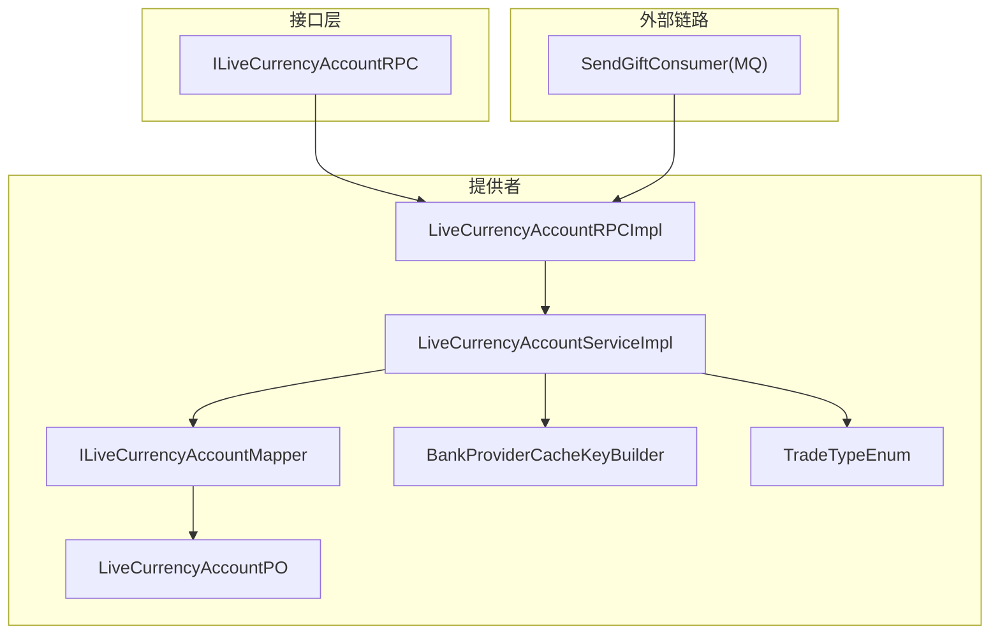
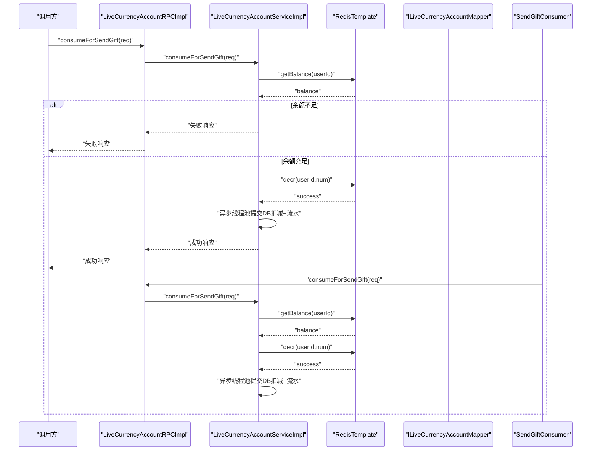
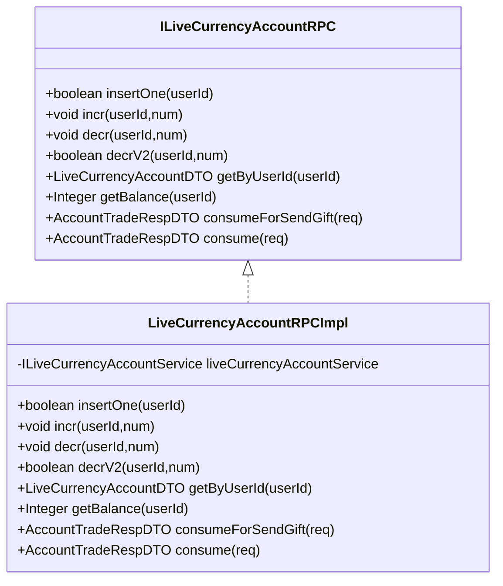
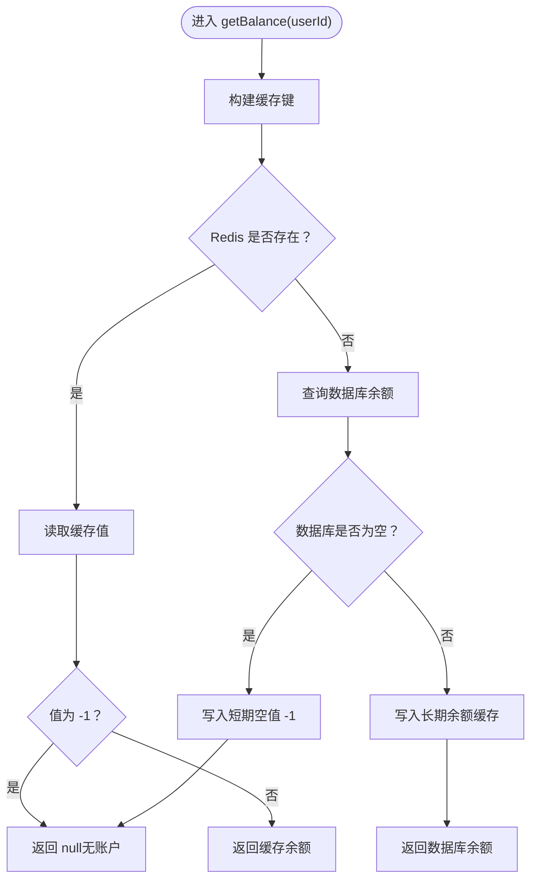
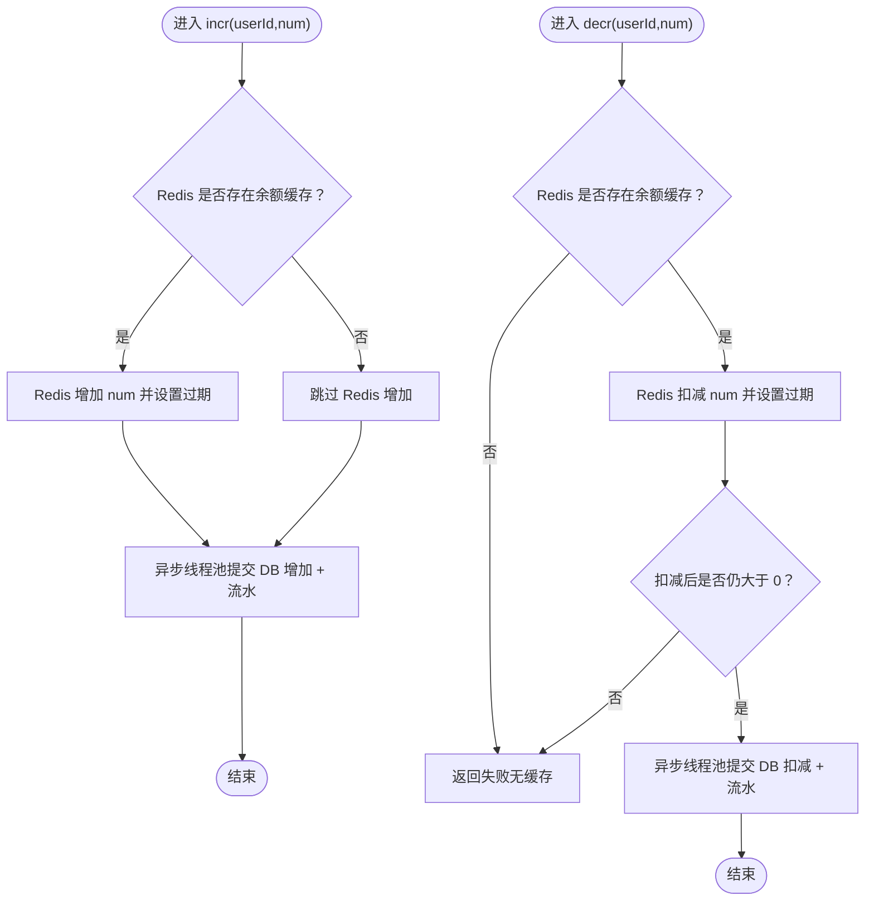
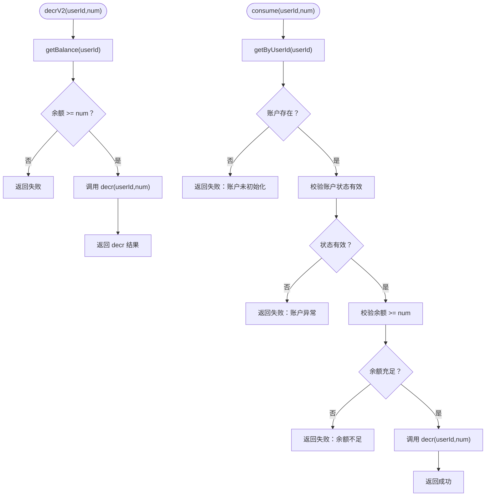
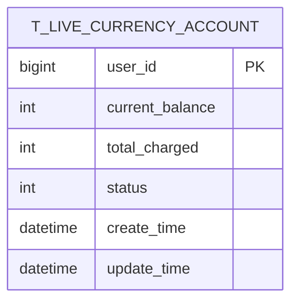
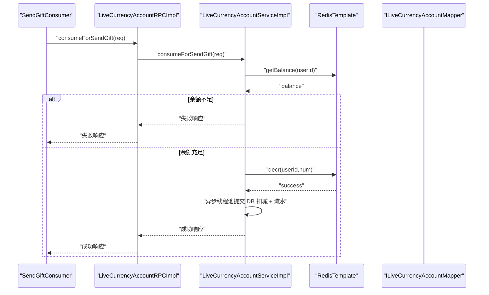
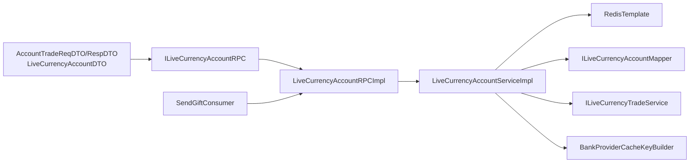

# 虚拟货币账户体系

<cite>
**本文引用的文件列表**
- [ILiveCurrencyAccountRPC.java](file://live-bank-interface/src/main/java/com/logilong/live/bank/interfaces/ILiveCurrencyAccountRPC.java)
- [LiveCurrencyAccountRPCImpl.java](file://live-bank-provider/src/main/java/com/logilong/live/bank/provider/rpc/LiveCurrencyAccountRPCImpl.java)
- [ILiveCurrencyAccountService.java](file://live-bank-provider/src/main/java/com/logilong/live/bank/provider/service/ILiveCurrencyAccountService.java)
- [LiveCurrencyAccountServiceImpl.java](file://live-bank-provider/src/main/java/com/logilong/live/bank/provider/service/impl/LiveCurrencyAccountServiceImpl.java)
- [ILiveCurrencyAccountMapper.java](file://live-bank-provider/src/main/java/com/logilong/live/bank/provider/dao/mapper/ILiveCurrencyAccountMapper.java)
- [LiveCurrencyAccountPO.java](file://live-bank-provider/src/main/java/com/logilong/live/bank/provider/dao/po/LiveCurrencyAccountPO.java)
- [BankProviderCacheKeyBuilder.java](file://live-framework/live-framework-redis-starter/src/main/java/com/logilong/live/framework/redis/starter/key/BankProviderCacheKeyBuilder.java)
- [TradeTypeEnum.java](file://live-bank-interface/src/main/java/com/logilong/live/bank/constants/TradeTypeEnum.java)
- [AccountTradeReqDTO.java](file://live-bank-interface/src/main/java/com/logilong/live/bank/dto/AccountTradeReqDTO.java)
- [AccountTradeRespDTO.java](file://live-bank-interface/src/main/java/com/logilong/live/bank/dto/AccountTradeRespDTO.java)
- [LiveCurrencyAccountDTO.java](file://live-bank-interface/src/main/java/com/logilong/live/bank/dto/LiveCurrencyAccountDTO.java)
- [SendGiftConsumer.java](file://live-gift-provider/src/main/java/com/logilong/live/gift/provider/consumer/SendGiftConsumer.java)
</cite>

## 目录
1. [简介](#简介)
2. [项目结构](#项目结构)
3. [核心组件](#核心组件)
4. [架构总览](#架构总览)
5. [组件详解](#组件详解)
6. [依赖关系分析](#依赖关系分析)
7. [性能与一致性](#性能与一致性)
8. [故障排查指南](#故障排查指南)
9. [结论](#结论)

## 简介
本文件系统化梳理直播平台虚拟货币账户体系的架构设计与核心功能实现，重点解析 ILiveCurrencyAccountRPC 接口中的账户创建、余额增减、高并发扣减（consumeForSendGift）等关键方法；对比 decrV2 与 consume 的余额校验与扣减逻辑差异；分析 LiveCurrencyAccountPO 表结构设计与索引策略；阐述余额查询 getBalance 的缓存优化与实时性保障；并结合送礼场景深入剖析 consumeForSendGift 的高并发优化实现，包括 Redis 原子操作与分布式锁的应用思路。

## 项目结构
围绕虚拟货币账户体系，主要涉及以下模块：
- 接口层：ILiveCurrencyAccountRPC 定义 RPC 接口契约
- 提供者 RPC 实现：LiveCurrencyAccountRPCImpl 将接口委托给服务层
- 服务层：ILiveCurrencyAccountService 及其实现 LiveCurrencyAccountServiceImpl 负责业务逻辑
- 数据访问层：ILiveCurrencyAccountMapper 对应 t_live_currency_account 表
- 缓存键构建：BankProviderCacheKeyBuilder 统一生成 Redis 键
- 流水记录：TradeTypeEnum、ILiveCurrencyTradeService/PO 记录交易流水
- 送礼链路：SendGiftConsumer 通过 MQ 触发扣减流程

图表来源
- [ILiveCurrencyAccountRPC.java](file://live-bank-interface/src/main/java/com/logilong/live/bank/interfaces/ILiveCurrencyAccountRPC.java#L1-L53)
- [LiveCurrencyAccountRPCImpl.java](file://live-bank-provider/src/main/java/com/logilong/live/bank/provider/rpc/LiveCurrencyAccountRPCImpl.java#L1-L60)
- [LiveCurrencyAccountServiceImpl.java](file://live-bank-provider/src/main/java/com/logilong/live/bank/provider/service/impl/LiveCurrencyAccountServiceImpl.java#L1-L209)
- [ILiveCurrencyAccountMapper.java](file://live-bank-provider/src/main/java/com/logilong/live/bank/provider/dao/mapper/ILiveCurrencyAccountMapper.java#L1-L21)
- [LiveCurrencyAccountPO.java](file://live-bank-provider/src/main/java/com/logilong/live/bank/provider/dao/po/LiveCurrencyAccountPO.java#L1-L24)
- [BankProviderCacheKeyBuilder.java](file://live-framework/live-framework-redis-starter/src/main/java/com/logilong/live/framework/redis/starter/key/BankProviderCacheKeyBuilder.java#L1-L37)
- [TradeTypeEnum.java](file://live-bank-interface/src/main/java/com/logilong/live/bank/constants/TradeTypeEnum.java#L1-L18)
- [SendGiftConsumer.java](file://live-gift-provider/src/main/java/com/logilong/live/gift/provider/consumer/SendGiftConsumer.java#L54-L102)

章节来源
- [ILiveCurrencyAccountRPC.java](file://live-bank-interface/src/main/java/com/logilong/live/bank/interfaces/ILiveCurrencyAccountRPC.java#L1-L53)
- [LiveCurrencyAccountRPCImpl.java](file://live-bank-provider/src/main/java/com/logilong/live/bank/provider/rpc/LiveCurrencyAccountRPCImpl.java#L1-L60)
- [LiveCurrencyAccountServiceImpl.java](file://live-bank-provider/src/main/java/com/logilong/live/bank/provider/service/impl/LiveCurrencyAccountServiceImpl.java#L1-L209)
- [ILiveCurrencyAccountMapper.java](file://live-bank-provider/src/main/java/com/logilong/live/bank/provider/dao/mapper/ILiveCurrencyAccountMapper.java#L1-L21)
- [LiveCurrencyAccountPO.java](file://live-bank-provider/src/main/java/com/logilong/live/bank/provider/dao/po/LiveCurrencyAccountPO.java#L1-L24)
- [BankProviderCacheKeyBuilder.java](file://live-framework/live-framework-redis-starter/src/main/java/com/logilong/live/framework/redis/starter/key/BankProviderCacheKeyBuilder.java#L1-L37)
- [TradeTypeEnum.java](file://live-bank-interface/src/main/java/com/logilong/live/bank/constants/TradeTypeEnum.java#L1-L18)
- [SendGiftConsumer.java](file://live-gift-provider/src/main/java/com/logilong/live/gift/provider/consumer/SendGiftConsumer.java#L54-L102)

## 核心组件
- ILiveCurrencyAccountRPC：定义账户创建、余额增减、余额查询、消费与送礼专用扣减等接口
- LiveCurrencyAccountRPCImpl：基于 Dubbo 暴露 RPC，转发至服务层
- ILiveCurrencyAccountService/LiveCurrencyAccountServiceImpl：实现业务逻辑，含 Redis 缓存、异步落库、流水记录
- ILiveCurrencyAccountMapper/LiveCurrencyAccountPO：MyBatis 映射 t_live_currency_account 表
- BankProviderCacheKeyBuilder：统一构建用户余额缓存键
- TradeTypeEnum：交易类型枚举，用于流水记录
- SendGiftConsumer：MQ 消费者，触发送礼扣减

章节来源
- [ILiveCurrencyAccountRPC.java](file://live-bank-interface/src/main/java/com/logilong/live/bank/interfaces/ILiveCurrencyAccountRPC.java#L1-L53)
- [LiveCurrencyAccountRPCImpl.java](file://live-bank-provider/src/main/java/com/logilong/live/bank/provider/rpc/LiveCurrencyAccountRPCImpl.java#L1-L60)
- [ILiveCurrencyAccountService.java](file://live-bank-provider/src/main/java/com/logilong/live/bank/provider/service/ILiveCurrencyAccountService.java#L1-L41)
- [LiveCurrencyAccountServiceImpl.java](file://live-bank-provider/src/main/java/com/logilong/live/bank/provider/service/impl/LiveCurrencyAccountServiceImpl.java#L1-L209)
- [ILiveCurrencyAccountMapper.java](file://live-bank-provider/src/main/java/com/logilong/live/bank/provider/dao/mapper/ILiveCurrencyAccountMapper.java#L1-L21)
- [LiveCurrencyAccountPO.java](file://live-bank-provider/src/main/java/com/logilong/live/bank/provider/dao/po/LiveCurrencyAccountPO.java#L1-L24)
- [BankProviderCacheKeyBuilder.java](file://live-framework/live-framework-redis-starter/src/main/java/com/logilong/live/framework/redis/starter/key/BankProviderCacheKeyBuilder.java#L1-L37)
- [TradeTypeEnum.java](file://live-bank-interface/src/main/java/com/logilong/live/bank/constants/TradeTypeEnum.java#L1-L18)
- [SendGiftConsumer.java](file://live-gift-provider/src/main/java/com/logilong/live/gift/provider/consumer/SendGiftConsumer.java#L54-L102)

## 架构总览
整体采用“接口层—提供者—服务层—数据访问层”的分层架构，配合 Redis 缓存与异步线程池实现高并发下的高性能与最终一致性。送礼场景通过 MQ 异步化，前端仅做轻量校验，后端在 MQ 消费端完成二次校验与扣减。

图表来源
- [LiveCurrencyAccountRPCImpl.java](file://live-bank-provider/src/main/java/com/logilong/live/bank/provider/rpc/LiveCurrencyAccountRPCImpl.java#L51-L60)
- [LiveCurrencyAccountServiceImpl.java](file://live-bank-provider/src/main/java/com/logilong/live/bank/provider/service/impl/LiveCurrencyAccountServiceImpl.java#L118-L186)
- [ILiveCurrencyAccountMapper.java](file://live-bank-provider/src/main/java/com/logilong/live/bank/provider/dao/mapper/ILiveCurrencyAccountMapper.java#L13-L20)
- [SendGiftConsumer.java](file://live-gift-provider/src/main/java/com/logilong/live/gift/provider/consumer/SendGiftConsumer.java#L84-L102)

## 组件详解

### ILiveCurrencyAccountRPC 接口与实现
- 账户创建：insertOne
- 余额增减：incr、decr
- 余额查询：getByUserId、getBalance
- 消费与送礼专用扣减：consume、consumeForSendGift
- 兼容旧版 decrV2：decrV2（先查余额再扣减）

图表来源
- [ILiveCurrencyAccountRPC.java](file://live-bank-interface/src/main/java/com/logilong/live/bank/interfaces/ILiveCurrencyAccountRPC.java#L1-L53)
- [LiveCurrencyAccountRPCImpl.java](file://live-bank-provider/src/main/java/com/logilong/live/bank/provider/rpc/LiveCurrencyAccountRPCImpl.java#L1-L60)

章节来源
- [ILiveCurrencyAccountRPC.java](file://live-bank-interface/src/main/java/com/logilong/live/bank/interfaces/ILiveCurrencyAccountRPC.java#L1-L53)
- [LiveCurrencyAccountRPCImpl.java](file://live-bank-provider/src/main/java/com/logilong/live/bank/provider/rpc/LiveCurrencyAccountRPCImpl.java#L1-L60)

### 余额查询 getBalance 的缓存优化与实时性保障
- 缓存键：通过 BankProviderCacheKeyBuilder.buildUserBalance(userId) 生成
- 优先命中 Redis：若存在直接返回；为 -1 表示不存在账户，缓存短期空值
- 未命中 Redis：回源数据库查询，命中后写入 Redis（带过期时间），未命中写入短期空值
- 过期策略：余额缓存默认较长有效期，空值缓存短期有效，避免缓存穿透

图表来源
- [LiveCurrencyAccountServiceImpl.java](file://live-bank-provider/src/main/java/com/logilong/live/bank/provider/service/impl/LiveCurrencyAccountServiceImpl.java#L118-L134)
- [BankProviderCacheKeyBuilder.java](file://live-framework/live-framework-redis-starter/src/main/java/com/logilong/live/framework/redis/starter/key/BankProviderCacheKeyBuilder.java#L28-L36)

章节来源
- [LiveCurrencyAccountServiceImpl.java](file://live-bank-provider/src/main/java/com/logilong/live/bank/provider/service/impl/LiveCurrencyAccountServiceImpl.java#L118-L134)
- [BankProviderCacheKeyBuilder.java](file://live-framework/live-framework-redis-starter/src/main/java/com/logilong/live/framework/redis/starter/key/BankProviderCacheKeyBuilder.java#L28-L36)

### 余额增减与异步落库
- 增加余额 incr：若 Redis 中已有余额缓存，则先在 Redis 上累加并设置过期；随后在异步线程池中执行数据库增加与流水记录
- 扣减余额 decr：若 Redis 中存在余额缓存且扣减后仍大于 0，则在 Redis 上扣减并设置过期；随后在异步线程池中执行数据库扣减与流水记录
- 异步线程池：固定大小线程池，避免阻塞主流程，遵循 BASE 理论，保证最终一致性

图表来源
- [LiveCurrencyAccountServiceImpl.java](file://live-bank-provider/src/main/java/com/logilong/live/bank/provider/service/impl/LiveCurrencyAccountServiceImpl.java#L55-L109)
- [ILiveCurrencyAccountMapper.java](file://live-bank-provider/src/main/java/com/logilong/live/bank/provider/dao/mapper/ILiveCurrencyAccountMapper.java#L13-L17)

章节来源
- [LiveCurrencyAccountServiceImpl.java](file://live-bank-provider/src/main/java/com/logilong/live/bank/provider/service/impl/LiveCurrencyAccountServiceImpl.java#L55-L109)
- [ILiveCurrencyAccountMapper.java](file://live-bank-provider/src/main/java/com/logilong/live/bank/provider/dao/mapper/ILiveCurrencyAccountMapper.java#L13-L17)

### decrV2 与 consume 的差异与适用场景
- decrV2：先查询余额，余额不足直接返回失败；余额充足时调用 decr 执行扣减
- consume：先按用户维度查询账户 DTO，校验账户存在、状态有效、余额充足后再扣减
- 适用场景：
  - decrV2：适用于需要“先校验再扣减”的场景，但不包含账户状态校验
  - consume：适用于需要严格账户状态与余额一致性的场景，适合通用消费入口

图表来源
- [LiveCurrencyAccountRPCImpl.java](file://live-bank-provider/src/main/java/com/logilong/live/bank/provider/rpc/LiveCurrencyAccountRPCImpl.java#L32-L39)
- [LiveCurrencyAccountServiceImpl.java](file://live-bank-provider/src/main/java/com/logilong/live/bank/provider/service/impl/LiveCurrencyAccountServiceImpl.java#L189-L207)

章节来源
- [LiveCurrencyAccountRPCImpl.java](file://live-bank-provider/src/main/java/com/logilong/live/bank/provider/rpc/LiveCurrencyAccountRPCImpl.java#L32-L39)
- [LiveCurrencyAccountServiceImpl.java](file://live-bank-provider/src/main/java/com/logilong/live/bank/provider/service/impl/LiveCurrencyAccountServiceImpl.java#L189-L207)

### LiveCurrencyAccountPO 表结构设计与索引策略
- 表名：t_live_currency_account
- 主键：userId（输入型主键）
- 关键字段：
  - currentBalance：当前余额
  - totalCharged：累计充值金额
  - status：账户状态
  - createTime/updateTime：创建与更新时间
- 索引策略建议：
  - 主键索引：userId（已由 MyBatis-Plus 注解声明）
  - 查询索引：status + userId（用于按状态快速过滤）
  - 余额查询：queryBalance(userId) 使用 status=1 限制有效账户
- 余额扣减 SQL：使用条件判断确保余额充足才扣减，避免负数

图表来源
- [LiveCurrencyAccountPO.java](file://live-bank-provider/src/main/java/com/logilong/live/bank/provider/dao/po/LiveCurrencyAccountPO.java#L1-L24)
- [ILiveCurrencyAccountMapper.java](file://live-bank-provider/src/main/java/com/logilong/live/bank/provider/dao/mapper/ILiveCurrencyAccountMapper.java#L13-L20)

章节来源
- [LiveCurrencyAccountPO.java](file://live-bank-provider/src/main/java/com/logilong/live/bank/provider/dao/po/LiveCurrencyAccountPO.java#L1-L24)
- [ILiveCurrencyAccountMapper.java](file://live-bank-provider/src/main/java/com/logilong/live/bank/provider/dao/mapper/ILiveCurrencyAccountMapper.java#L13-L20)

### 送礼场景高并发优化：consumeForSendGift
- 前置校验：getBalance(userId) 判断余额是否充足
- 扣减策略：decr(userId,num) 基于 Redis 原子扣减，扣减成功后异步落库
- MQ 异步化：SendGiftConsumer 从 MQ 拉取消息，再次调用 consumeForSendGift，确保幂等与最终一致性
- 分布式锁思路：注释中提供了基于 Redis SETNX 的分布式锁方案（可选实现），用于保证余额判断与扣减的原子性

图表来源
- [LiveCurrencyAccountServiceImpl.java](file://live-bank-provider/src/main/java/com/logilong/live/bank/provider/service/impl/LiveCurrencyAccountServiceImpl.java#L176-L186)
- [SendGiftConsumer.java](file://live-gift-provider/src/main/java/com/logilong/live/gift/provider/consumer/SendGiftConsumer.java#L84-L102)

章节来源
- [LiveCurrencyAccountServiceImpl.java](file://live-bank-provider/src/main/java/com/logilong/live/bank/provider/service/impl/LiveCurrencyAccountServiceImpl.java#L176-L186)
- [SendGiftConsumer.java](file://live-gift-provider/src/main/java/com/logilong/live/gift/provider/consumer/SendGiftConsumer.java#L84-L102)

## 依赖关系分析
- 接口层依赖 DTO 与枚举（AccountTradeReqDTO、AccountTradeRespDTO、LiveCurrencyAccountDTO、TradeTypeEnum）
- RPC 层依赖服务层
- 服务层依赖：
  - RedisTemplate：进行余额缓存读写与原子操作
  - ILiveCurrencyAccountMapper：数据库余额增减与查询
  - ILiveCurrencyTradeService：流水记录
  - BankProviderCacheKeyBuilder：统一缓存键生成
- MQ 消费者依赖 RPC 层，形成最终一致性闭环

图表来源
- [ILiveCurrencyAccountRPC.java](file://live-bank-interface/src/main/java/com/logilong/live/bank/interfaces/ILiveCurrencyAccountRPC.java#L1-L53)
- [LiveCurrencyAccountRPCImpl.java](file://live-bank-provider/src/main/java/com/logilong/live/bank/provider/rpc/LiveCurrencyAccountRPCImpl.java#L1-L60)
- [LiveCurrencyAccountServiceImpl.java](file://live-bank-provider/src/main/java/com/logilong/live/bank/provider/service/impl/LiveCurrencyAccountServiceImpl.java#L1-L209)
- [ILiveCurrencyAccountMapper.java](file://live-bank-provider/src/main/java/com/logilong/live/bank/provider/dao/mapper/ILiveCurrencyAccountMapper.java#L1-L21)
- [BankProviderCacheKeyBuilder.java](file://live-framework/live-framework-redis-starter/src/main/java/com/logilong/live/framework/redis/starter/key/BankProviderCacheKeyBuilder.java#L1-L37)
- [SendGiftConsumer.java](file://live-gift-provider/src/main/java/com/logilong/live/gift/provider/consumer/SendGiftConsumer.java#L54-L102)

章节来源
- [ILiveCurrencyAccountRPC.java](file://live-bank-interface/src/main/java/com/logilong/live/bank/interfaces/ILiveCurrencyAccountRPC.java#L1-L53)
- [LiveCurrencyAccountRPCImpl.java](file://live-bank-provider/src/main/java/com/logilong/live/bank/provider/rpc/LiveCurrencyAccountRPCImpl.java#L1-L60)
- [LiveCurrencyAccountServiceImpl.java](file://live-bank-provider/src/main/java/com/logilong/live/bank/provider/service/impl/LiveCurrencyAccountServiceImpl.java#L1-L209)
- [ILiveCurrencyAccountMapper.java](file://live-bank-provider/src/main/java/com/logilong/live/bank/provider/dao/mapper/ILiveCurrencyAccountMapper.java#L1-L21)
- [BankProviderCacheKeyBuilder.java](file://live-framework/live-framework-redis-starter/src/main/java/com/logilong/live/framework/redis/starter/key/BankProviderCacheKeyBuilder.java#L1-L37)
- [SendGiftConsumer.java](file://live-gift-provider/src/main/java/com/logilong/live/gift/provider/consumer/SendGiftConsumer.java#L54-L102)

## 性能与一致性
- Redis 原子操作：decr 使用 Redis 原子递减，避免竞争条件
- 异步落库：通过线程池异步执行数据库操作，降低主流程延迟
- 最终一致性：BASE 理论，CAP 中 AP 选择，保证高可用与性能
- MQ 异步化：送礼场景通过 MQ 消费，二次校验与扣减，提升吞吐
- 缓存策略：长有效期余额缓存 + 短期空值缓存，兼顾性能与一致性

[本节为通用性能讨论，无需列出具体文件来源]

## 故障排查指南
- 余额不足：consume 返回余额不足；decrV2 返回失败；consumeForSendGift 返回失败
- 账户异常：consume 校验账户状态无效时返回失败
- Redis 未命中：getBalance 未命中 Redis 会回源数据库；检查缓存键构建与过期策略
- 扣减失败：decr 未命中缓存或扣减后小于等于 0 会返回失败；检查 Redis 原子操作与过期时间
- MQ 重复消费：SendGiftConsumer 使用幂等键避免重复处理；检查幂等键生成与过期时间

章节来源
- [LiveCurrencyAccountServiceImpl.java](file://live-bank-provider/src/main/java/com/logilong/live/bank/provider/service/impl/LiveCurrencyAccountServiceImpl.java#L189-L207)
- [SendGiftConsumer.java](file://live-gift-provider/src/main/java/com/logilong/live/gift/provider/consumer/SendGiftConsumer.java#L84-L102)

## 结论
该虚拟货币账户体系通过“接口—提供者—服务—数据访问”分层与 Redis 缓存、异步线程池、MQ 异步化等手段，实现了高并发下的高效余额管理与最终一致性。consumeForSendGift 在送礼场景中通过 Redis 原子扣减与异步落库，显著提升了吞吐能力；decrV2 与 consume 在校验范围与适用场景上各有侧重，可根据业务需求选择。表结构设计简洁清晰，配合合理的索引与缓存策略，满足了直播场景下的性能与一致性要求。