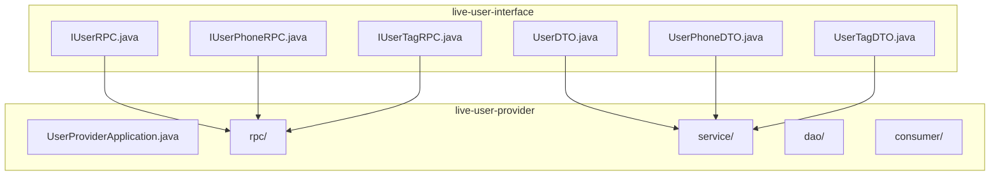
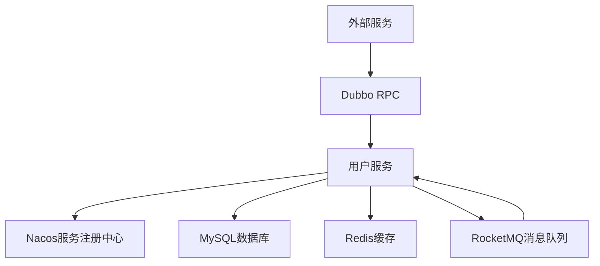
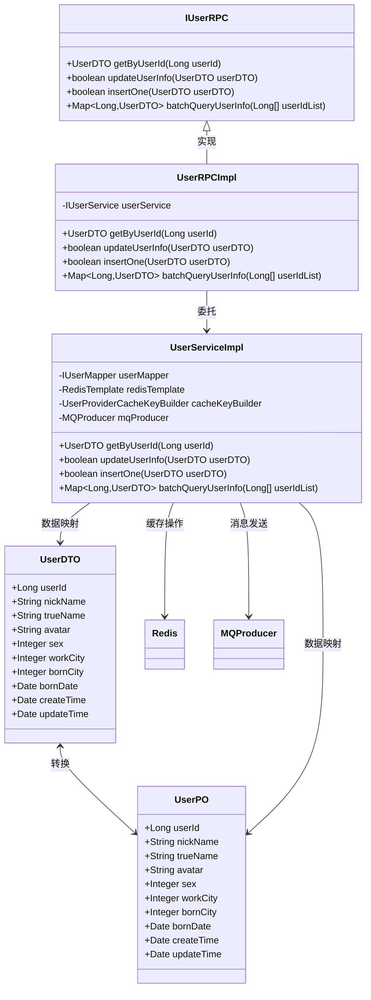
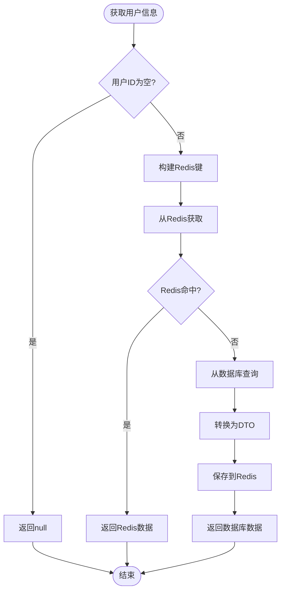
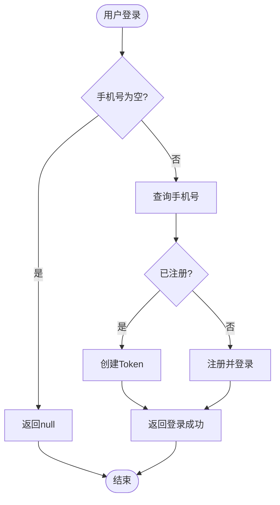
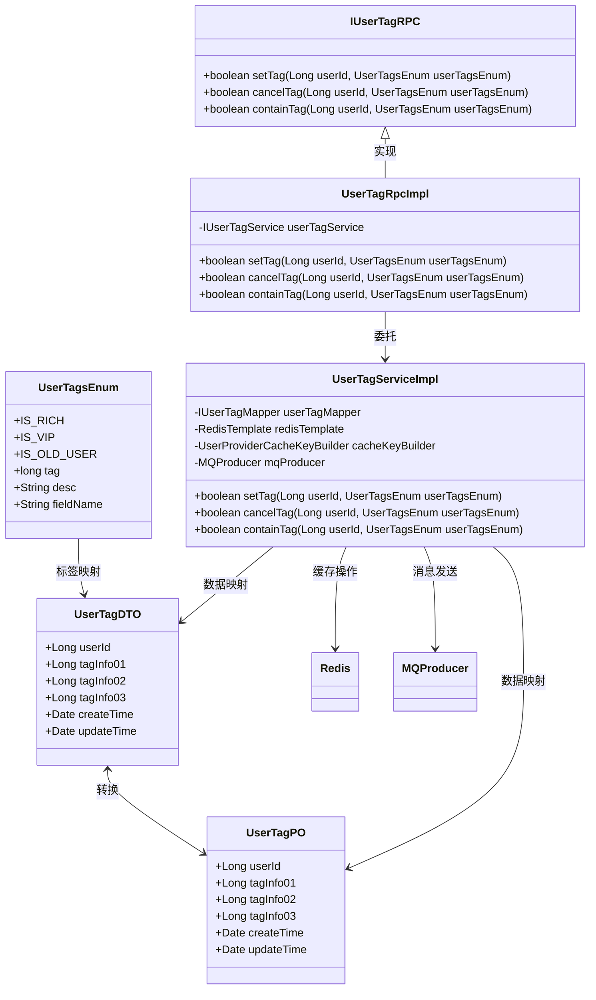
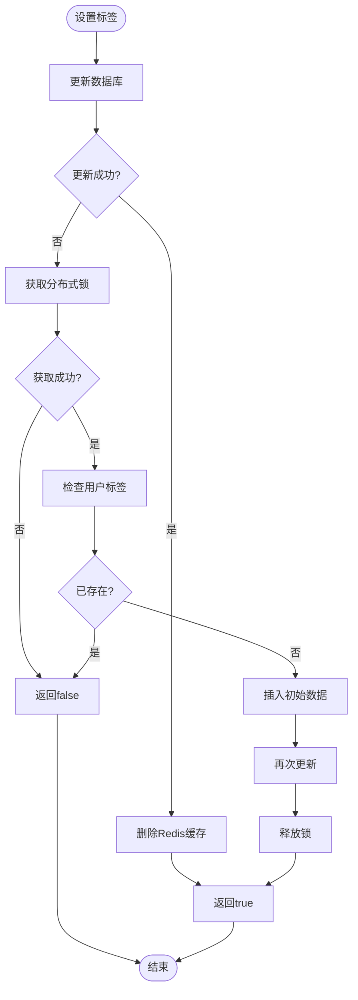
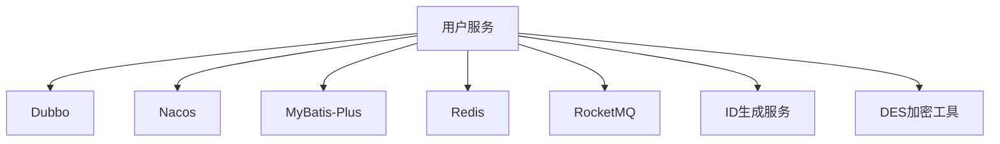

# 用户服务

<cite>
**本文档引用文件**  
- [UserProviderApplication.java](file://live-user-provider/src/main/java/com/logilong/live/user/provider/UserProviderApplication.java)
- [IUserRPC.java](file://live-user-interface/src/main/java/com/logilong/live/user/interfaces/IUserRPC.java)
- [UserRPCImpl.java](file://live-user-provider/src/main/java/com/logilong/live/user/provider/rpc/UserRPCImpl.java)
- [UserServiceImpl.java](file://live-user-provider/src/main/java/com/logilong/live/user/provider/service/impl/UserServiceImpl.java)
- [UserPO.java](file://live-user-provider/src/main/java/com/logilong/live/user/provider/dao/po/UserPO.java)
- [UserDTO.java](file://live-user-interface/src/main/java/com/logilong/live/user/dto/UserDTO.java)
- [IUserPhoneRPC.java](file://live-user-interface/src/main/java/com/logilong/live/user/interfaces/IUserPhoneRPC.java)
- [UserPhoneServiceImpl.java](file://live-user-provider/src/main/java/com/logilong/live/user/provider/service/impl/UserPhoneServiceImpl.java)
- [IUserTagRPC.java](file://live-user-interface/src/main/java/com/logilong/live/user/interfaces/IUserTagRPC.java)
- [UserTagServiceImpl.java](file://live-user-provider/src/main/java/com/logilong/live/user/provider/service/impl/UserTagServiceImpl.java)
- [UserTagsEnum.java](file://live-user-interface/src/main/java/com/logilong/live/user/constants/UserTagsEnum.java)
- [UserTagDTO.java](file://live-user-interface/src/main/java/com/logilong/live/user/dto/UserTagDTO.java)
- [UserProviderCacheKeyBuilder.java](file://live-framework/live-framework-redis-starter/src/main/java/com/logilong/live/framework/redis/starter/key/UserProviderCacheKeyBuilder.java)
- [RocketMQConsumerConfig.java](file://live-user-provider/src/main/java/com/logilong/live/user/provider/consumer/RocketMQConsumerConfig.java)
</cite>

## 目录
1. [简介](#简介)
2. [项目结构](#项目结构)
3. [核心组件](#核心组件)
4. [架构概览](#架构概览)
5. [详细组件分析](#详细组件分析)
6. [依赖分析](#依赖分析)
7. [性能考虑](#性能考虑)
8. [故障排除指南](#故障排除指南)
9. [结论](#结论)

## 简介
本文档深入解析用户服务的架构设计与核心功能实现，涵盖用户基本信息管理、手机号绑定与用户标签系统三大模块。详细说明UserProviderApplication如何通过Dubbo暴露IUserRPC等接口，并与Nacos服务注册中心集成。阐述用户数据模型（UserPO）设计原则与敏感信息加密存储策略。分析RocketMQ消费者（RocketMQConsumerConfig）在用户数据异步处理中的应用，以及缓存穿透防护与用户信息一致性保障机制。

## 项目结构
用户服务模块采用典型的微服务分层架构，包含接口定义模块（live-user-interface）和实现模块（live-user-provider）。接口模块定义了IUserRPC、IUserPhoneRPC和IUserTagRPC三个核心RPC接口，供其他服务调用。实现模块包含数据访问层（DAO）、业务逻辑层（Service）和远程过程调用层（RPC），通过Spring Boot和Dubbo框架实现服务化。

**图示来源**
- [IUserRPC.java](file://live-user-interface/src/main/java/com/logilong/live/user/interfaces/IUserRPC.java)
- [IUserPhoneRPC.java](file://live-user-interface/src/main/java/com/logilong/live/user/interfaces/IUserPhoneRPC.java)
- [IUserTagRPC.java](file://live-user-interface/src/main/java/com/logilong/live/user/interfaces/IUserTagRPC.java)
- [UserProviderApplication.java](file://live-user-provider/src/main/java/com/logilong/live/user/provider/UserProviderApplication.java)

## 核心组件
用户服务的核心组件包括用户基本信息管理、手机号绑定和用户标签系统。这些组件通过清晰的分层架构实现，确保了代码的可维护性和可扩展性。用户基本信息管理负责用户资料的增删改查，手机号绑定模块处理用户登录和手机注册，用户标签系统则实现了用户特征的标记和查询功能。

**组件来源**
- [UserServiceImpl.java](file://live-user-provider/src/main/java/com/logilong/live/user/provider/service/impl/UserServiceImpl.java)
- [UserPhoneServiceImpl.java](file://live-user-provider/src/main/java/com/logilong/live/user/provider/service/impl/UserPhoneServiceImpl.java)
- [UserTagServiceImpl.java](file://live-user-provider/src/main/java/com/logilong/live/user/provider/service/impl/UserTagServiceImpl.java)

## 架构概览
用户服务采用Dubbo作为RPC框架，通过Nacos进行服务注册与发现。服务启动时，UserProviderApplication通过@EnableDubbo注解暴露RPC接口，同时通过@EnableDiscoveryClient与Nacos集成。数据访问层使用MyBatis-Plus操作数据库，Redis作为缓存层提升查询性能，RocketMQ用于异步处理缓存一致性。

**图示来源**
- [UserProviderApplication.java](file://live-user-provider/src/main/java/com/logilong/live/user/provider/UserProviderApplication.java)
- [UserRPCImpl.java](file://live-user-provider/src/main/java/com/logilong/live/user/provider/rpc/UserRPCImpl.java)

## 详细组件分析

### 用户基本信息管理分析
用户基本信息管理模块实现了用户资料的CRUD操作，通过缓存优化和批量查询提升性能。

#### 对象关系图

**图示来源**
- [UserDTO.java](file://live-user-interface/src/main/java/com/logilong/live/user/dto/UserDTO.java)
- [UserPO.java](file://live-user-provider/src/main/java/com/logilong/live/user/provider/dao/po/UserPO.java)
- [IUserRPC.java](file://live-user-interface/src/main/java/com/logilong/live/user/interfaces/IUserRPC.java)
- [UserRPCImpl.java](file://live-user-provider/src/main/java/com/logilong/live/user/provider/rpc/UserRPCImpl.java)
- [UserServiceImpl.java](file://live-user-provider/src/main/java/com/logilong/live/user/provider/service/impl/UserServiceImpl.java)

#### 查询流程图

**图示来源**
- [UserServiceImpl.java](file://live-user-provider/src/main/java/com/logilong/live/user/provider/service/impl/UserServiceImpl.java#L44-L58)

### 手机号绑定分析
手机号绑定模块实现了用户登录和手机注册功能，通过分布式ID生成器确保用户ID的唯一性。

#### 登录流程图

**图示来源**
- [UserPhoneServiceImpl.java](file://live-user-provider/src/main/java/com/logilong/live/user/provider/service/impl/UserPhoneServiceImpl.java#L51-L65)

### 用户标签系统分析
用户标签系统采用位运算存储用户特征，通过分布式锁解决缓存击穿问题。

#### 类图

**图示来源**
- [UserTagsEnum.java](file://live-user-interface/src/main/java/com/logilong/live/user/constants/UserTagsEnum.java)
- [UserTagDTO.java](file://live-user-interface/src/main/java/com/logilong/live/user/dto/UserTagDTO.java)
- [UserTagPO.java](file://live-user-provider/src/main/java/com/logilong/live/user/provider/dao/po/UserTagPO.java)
- [IUserTagRPC.java](file://live-user-interface/src/main/java/com/logilong/live/user/interfaces/IUserTagRPC.java)
- [UserTagRpcImpl.java](file://live-user-provider/src/main/java/com/logilong/live/user/provider/rpc/UserTagRpcImpl.java)
- [UserTagServiceImpl.java](file://live-user-provider/src/main/java/com/logilong/live/user/provider/service/impl/UserTagServiceImpl.java)

#### 设置标签流程

**图示来源**
- [UserTagServiceImpl.java](file://live-user-provider/src/main/java/com/logilong/live/user/provider/service/impl/UserTagServiceImpl.java#L51-L93)

## 依赖分析
用户服务依赖于多个基础组件和外部服务，形成了完整的微服务生态系统。

**图示来源**
- [UserProviderApplication.java](file://live-user-provider/src/main/java/com/logilong/live/user/provider/UserProviderApplication.java)
- [UserPhoneServiceImpl.java](file://live-user-provider/src/main/java/com/logilong/live/user/provider/service/impl/UserPhoneServiceImpl.java)
- [UserTagServiceImpl.java](file://live-user-provider/src/main/java/com/logilong/live/user/provider/service/impl/UserTagServiceImpl.java)

## 性能考虑
用户服务在性能优化方面采用了多种策略，包括缓存、批量操作和并行处理。

### 缓存策略
- **多级缓存**：使用Redis作为一级缓存，减少数据库访问
- **空值缓存**：防止缓存穿透，对不存在的数据也进行缓存
- **随机过期时间**：避免缓存雪崩，设置随机的过期时间
- **批量获取**：使用multiGet减少网络IO

### 查询优化
- **批量查询**：对多个用户ID的查询使用batchQueryUserInfo
- **并行处理**：使用parallelStream并行查询数据库
- **管道操作**：使用Redis管道设置多个键的过期时间

### 一致性保障
- **延迟双删**：通过RocketMQ延迟消息实现缓存的二次删除
- **分布式锁**：使用Redis的setNX命令解决缓存击穿问题
- **事务管理**：关键操作使用@Transactional确保数据一致性

**性能来源**
- [UserServiceImpl.java](file://live-user-provider/src/main/java/com/logilong/live/user/provider/service/impl/UserServiceImpl.java)
- [UserTagServiceImpl.java](file://live-user-provider/src/main/java/com/logilong/live/user/provider/service/impl/UserTagServiceImpl.java)

## 故障排除指南
### 常见问题
1. **缓存不一致**：检查RocketMQ消费者是否正常运行
2. **登录失败**：确认ID生成服务是否可用
3. **标签设置无效**：检查分布式锁是否正常获取
4. **查询性能低下**：确认缓存是否生效

### 监控指标
- Redis缓存命中率
- 数据库查询响应时间
- RocketMQ消息处理延迟
- Dubbo调用成功率

### 日志分析
- 查看UserProviderApplication启动日志确认服务注册
- 检查RocketMQConsumerConfig日志确认消费者启动
- 分析UserTagServiceImpl日志确认分布式锁操作

**故障排除来源**
- [RocketMQConsumerConfig.java](file://live-user-provider/src/main/java/com/logilong/live/user/provider/consumer/RocketMQConsumerConfig.java)
- [UserTagServiceImpl.java](file://live-user-provider/src/main/java/com/logilong/live/user/provider/service/impl/UserTagServiceImpl.java)

## 结论
用户服务通过合理的架构设计和多种优化策略，实现了高性能、高可用的用户管理功能。服务采用Dubbo进行RPC调用，通过Nacos实现服务发现，使用Redis提升查询性能，并通过RocketMQ保证缓存一致性。在数据安全方面，敏感信息通过DES加密存储，确保了用户隐私的安全。整体设计充分考虑了微服务架构的特点，具有良好的可扩展性和维护性。