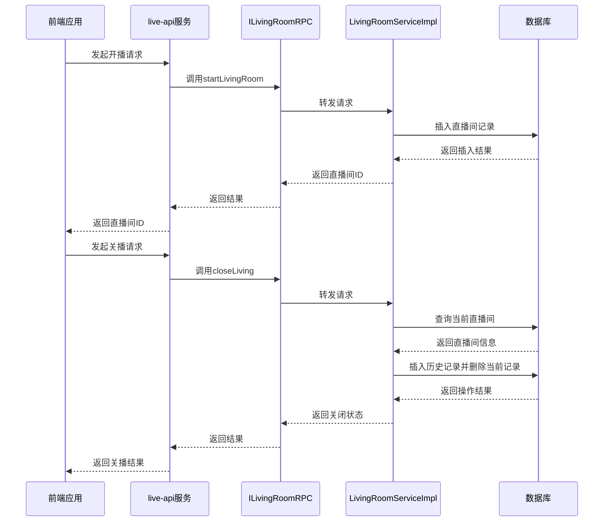
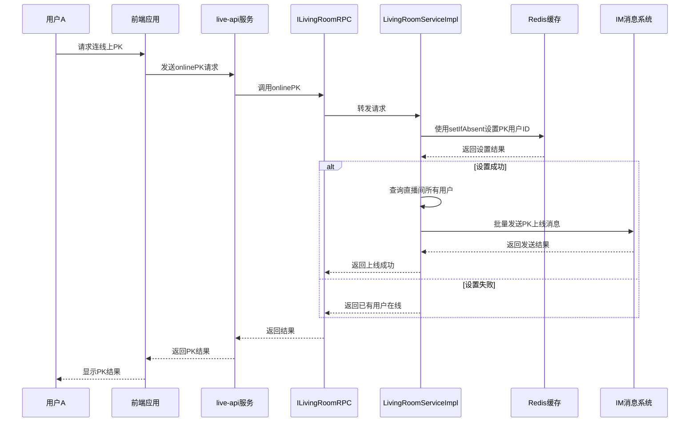
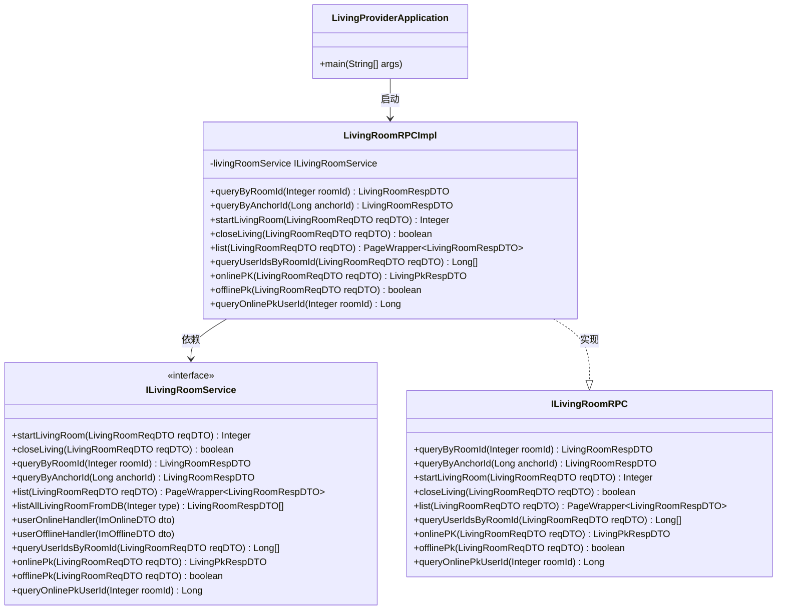
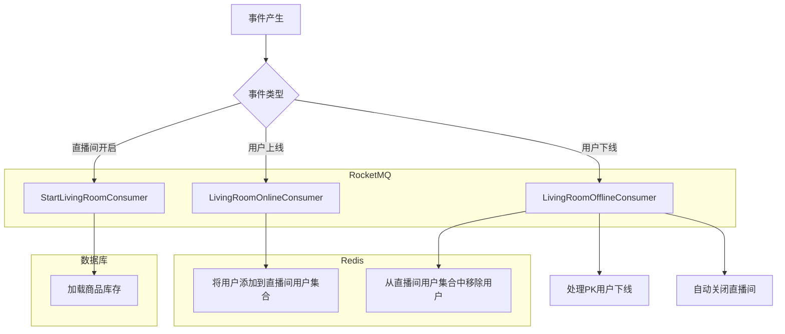
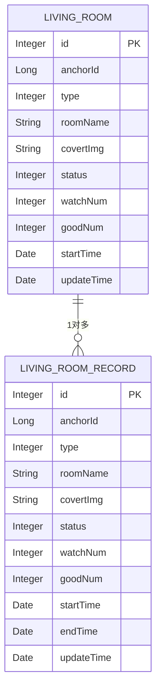
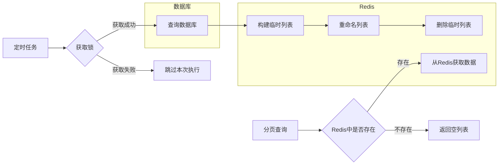
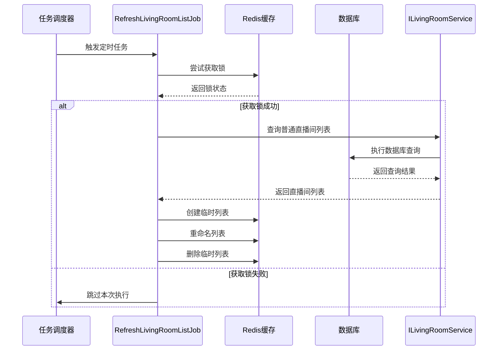
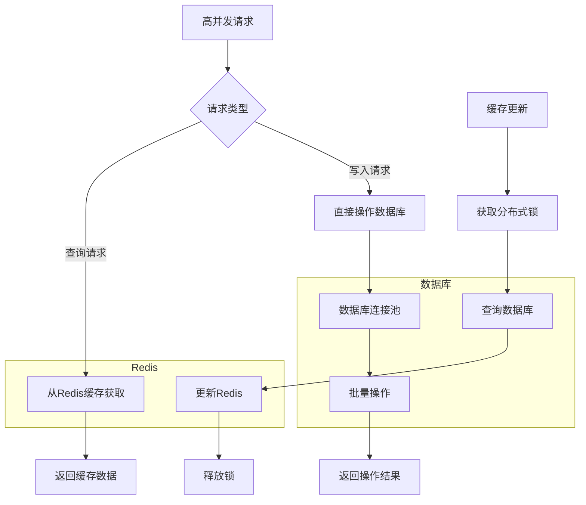

# 直播服务

<cite>
**本文档引用的文件**
- [LivingProviderApplication.java](file://live-living-provider/src/main/java/com/logilong/live/living/provider/LivingProviderApplication.java)
- [ILivingRoomRPC.java](file://live-living-interface/src/main/java/com/logilong/live/living/interfaces/rpc/ILivingRoomRPC.java)
- [LivingRoomRPCImpl.java](file://live-living-provider/src/main/java/com/logilong/live/living/provider/rpc/LivingRoomRPCImpl.java)
- [LivingRoomServiceImpl.java](file://live-living-provider/src/main/java/com/logilong/live/living/provider/service/impl/LivingRoomServiceImpl.java)
- [LivingRoomPO.java](file://live-living-provider/src/main/java/com/logilong/live/living/provider/dao/po/LivingRoomPO.java)
- [LivingRoomReqDTO.java](file://live-living-interface/src/main/java/com/logilong/live/living/interfaces/dto/LivingRoomReqDTO.java)
- [LivingRoomRespDTO.java](file://live-living-interface/src/main/java/com/logilong/live/living/interfaces/dto/LivingRoomRespDTO.java)
- [StartLivingRoomConsumer.java](file://live-living-provider/src/main/java/com/logilong/live/living/provider/consumer/StartLivingRoomConsumer.java)
- [LivingRoomOnlineConsumer.java](file://live-living-provider/src/main/java/com/logilong/live/living/provider/consumer/LivingRoomOnlineConsumer.java)
- [LivingRoomOfflineConsumer.java](file://live-living-provider/src/main/java/com/logilong/live/living/provider/consumer/LivingRoomOfflineConsumer.java)
- [RefreshLivingRoomListJob.java](file://live-living-provider/src/main/java/com/logilong/live/living/provider/config/RefreshLivingRoomListJob.java)
- [LivingProviderCacheKeyBuilder.java](file://live-framework/live-framework-redis-starter/src/main/java/com/logilong/live/framework/redis/starter/key/LivingProviderCacheKeyBuilder.java)
- [LivingRoomTypeEnum.java](file://live-living-interface/src/main/java/com/logilong/live/living/interfaces/constants/LivingRoomTypeEnum.java)
</cite>

## 目录
1. [直播服务概述](#直播服务概述)
2. [直播间生命周期管理](#直播间生命周期管理)
3. [PK互动功能实现](#pk互动功能实现)
4. [Dubbo服务暴露与RPC接口](#dubbo服务暴露与rpc接口)
5. [事件驱动机制与RocketMQ消费者](#事件驱动机制与rocketmq消费者)
6. [直播间数据模型设计](#直播间数据模型设计)
7. [分页查询优化策略](#分页查询优化策略)
8. [直播列表刷新任务](#直播列表刷新任务)
9. [高并发场景下的性能表现](#高并发场景下的性能表现)

## 直播服务概述

直播服务是直播平台的核心模块，负责直播间生命周期的管理、PK互动功能的实现以及相关数据的处理。该服务通过Dubbo框架暴露远程过程调用（RPC）接口，为其他微服务提供直播间相关的功能。同时，利用RocketMQ消息队列实现事件驱动架构，确保系统在高并发场景下的稳定性和可扩展性。

**本节来源**
- [LivingProviderApplication.java](file://live-living-provider/src/main/java/com/logilong/live/living/provider/LivingProviderApplication.java)

## 直播间生命周期管理

直播间生命周期管理包括创建、开启和关闭三个核心操作。当主播发起开播请求时，系统会创建一个新的直播间记录，并将其状态设置为"开启"。关闭直播间时，系统会将当前直播间的记录转移到历史记录表中，并更新其状态为"关闭"。

**图示来源**
- [LivingRoomServiceImpl.java](file://live-living-provider/src/main/java/com/logilong/live/living/provider/service/impl/LivingRoomServiceImpl.java#L68-L86)
- [LivingRoomServiceImpl.java](file://live-living-provider/src/main/java/com/logilong/live/living/provider/service/impl/LivingRoomServiceImpl.java#L91-L107)

**本节来源**
- [LivingRoomServiceImpl.java](file://live-living-provider/src/main/java/com/logilong/live/living/provider/service/impl/LivingRoomServiceImpl.java)
- [ILivingRoomRPC.java](file://live-living-interface/src/main/java/com/logilong/live/living/interfaces/rpc/ILivingRoomRPC.java)

## PK互动功能实现

PK互动功能允许两个主播进行实时互动比赛。当用户请求连线上PK时，系统会检查当前是否已有其他用户在线PK，如果没有，则允许该用户上线并通知直播间内所有观众。用户下线时，系统会清除其PK状态。

**图示来源**
- [LivingRoomServiceImpl.java](file://live-living-provider/src/main/java/com/logilong/live/living/provider/service/impl/LivingRoomServiceImpl.java#L224-L247)
- [LivingRoomServiceImpl.java](file://live-living-provider/src/main/java/com/logilong/live/living/provider/service/impl/LivingRoomServiceImpl.java#L279-L292)

**本节来源**
- [LivingRoomServiceImpl.java](file://live-living-provider/src/main/java/com/logilong/live/living/provider/service/impl/LivingRoomServiceImpl.java)
- [ILivingRoomRPC.java](file://live-living-interface/src/main/java/com/logilong/live/living/interfaces/rpc/ILivingRoomRPC.java)

## Dubbo服务暴露与RPC接口

`LivingProviderApplication`通过Dubbo框架暴露`ILivingRoomRPC`接口，使其他微服务能够远程调用直播间相关功能。`LivingRoomRPCImpl`类实现了`ILivingRoomRPC`接口，并通过`@DubboService`注解将其实例注册为Dubbo服务。

**图示来源**
- [LivingProviderApplication.java](file://live-living-provider/src/main/java/com/logilong/live/living/provider/LivingProviderApplication.java)
- [LivingRoomRPCImpl.java](file://live-living-provider/src/main/java/com/logilong/live/living/provider/rpc/LivingRoomRPCImpl.java)
- [ILivingRoomRPC.java](file://live-living-interface/src/main/java/com/logilong/live/living/interfaces/rpc/ILivingRoomRPC.java)

**本节来源**
- [LivingProviderApplication.java](file://live-living-provider/src/main/java/com/logilong/live/living/provider/LivingProviderApplication.java)
- [LivingRoomRPCImpl.java](file://live-living-provider/src/main/java/com/logilong/live/living/provider/rpc/LivingRoomRPCImpl.java)
- [ILivingRoomRPC.java](file://live-living-interface/src/main/java/com/logilong/live/living/interfaces/rpc/ILivingRoomRPC.java)

## 事件驱动机制与RocketMQ消费者

直播服务采用事件驱动架构，通过RocketMQ消息队列处理各种事件。`StartLivingRoomConsumer`监听直播间开启事件，当有新的直播间开启时，会触发商品库存预加载操作。`LivingRoomOnlineConsumer`和`LivingRoomOfflineConsumer`分别监听用户上线和下线事件，用于维护直播间内的用户集合。

**图示来源**
- [StartLivingRoomConsumer.java](file://live-living-provider/src/main/java/com/logilong/live/living/provider/consumer/StartLivingRoomConsumer.java)
- [LivingRoomOnlineConsumer.java](file://live-living-provider/src/main/java/com/logilong/live/living/provider/consumer/LivingRoomOnlineConsumer.java)
- [LivingRoomOfflineConsumer.java](file://live-living-provider/src/main/java/com/logilong/live/living/provider/consumer/LivingRoomOfflineConsumer.java)

**本节来源**
- [StartLivingRoomConsumer.java](file://live-living-provider/src/main/java/com/logilong/live/living/provider/consumer/StartLivingRoomConsumer.java)
- [LivingRoomOnlineConsumer.java](file://live-living-provider/src/main/java/com/logilong/live/living/provider/consumer/LivingRoomOnlineConsumer.java)
- [LivingRoomOfflineConsumer.java](file://live-living-provider/src/main/java/com/logilong/live/living/provider/consumer/LivingRoomOfflineConsumer.java)

## 直播间数据模型设计

直播间数据模型设计包含两个主要实体：`LivingRoomPO`和`LivingRoomRecordPO`。`LivingRoomPO`用于存储当前正在直播的房间信息，而`LivingRoomRecordPO`用于存储已结束直播的历史记录。这种设计实现了数据的冷热分离，提高了查询效率。

**图示来源**
- [LivingRoomPO.java](file://live-living-provider/src/main/java/com/logilong/live/living/provider/dao/po/LivingRoomPO.java)
- [LivingRoomRecordPO.java](file://live-living-provider/src/main/java/com/logilong/live/living/provider/dao/po/LivingRoomRecordPO.java)

**本节来源**
- [LivingRoomPO.java](file://live-living-provider/src/main/java/com/logilong/live/living/provider/dao/po/LivingRoomPO.java)
- [LivingRoomRecordPO.java](file://live-living-provider/src/main/java/com/logilong/live/living/provider/dao/po/LivingRoomRecordPO.java)

## 分页查询优化策略

为了提高分页查询的性能，系统采用了Redis缓存策略。`RefreshLivingRoomListJob`定时任务会定期将数据库中的直播间列表同步到Redis中，使用List数据结构存储。查询时直接从Redis中获取数据，避免了频繁的数据库查询操作。

**图示来源**
- [RefreshLivingRoomListJob.java](file://live-living-provider/src/main/java/com/logilong/live/living/provider/config/RefreshLivingRoomListJob.java)
- [LivingRoomServiceImpl.java](file://live-living-provider/src/main/java/com/logilong/live/living/provider/service/impl/LivingRoomServiceImpl.java#L150-L165)

**本节来源**
- [RefreshLivingRoomListJob.java](file://live-living-provider/src/main/java/com/logilong/live/living/provider/config/RefreshLivingRoomListJob.java)
- [LivingRoomServiceImpl.java](file://live-living-provider/src/main/java/com/logilong/live/living/provider/service/impl/LivingRoomServiceImpl.java)

## 直播列表刷新任务

`RefreshLivingRoomListJob`是一个定时任务，负责将数据库中的直播间列表同步到Redis缓存中。该任务使用`ScheduledThreadPoolExecutor`以固定延迟的方式执行，每秒执行一次。为了避免多个实例同时执行导致的数据不一致，任务执行前会尝试获取分布式锁。

**图示来源**
- [RefreshLivingRoomListJob.java](file://live-living-provider/src/main/java/com/logilong/live/living/provider/config/RefreshLivingRoomListJob.java)

**本节来源**
- [RefreshLivingRoomListJob.java](file://live-living-provider/src/main/java/com/logilong/live/living/provider/config/RefreshLivingRoomListJob.java)

## 高并发场景下的性能表现

在高并发场景下，直播服务通过多种机制保证系统的性能和稳定性。首先，使用Redis缓存减少数据库压力；其次，采用分布式锁避免多个实例同时更新缓存；最后，使用连接池和批量操作优化数据库访问。

**图示来源**
- [LivingRoomServiceImpl.java](file://live-living-provider/src/main/java/com/logilong/live/living/provider/service/impl/LivingRoomServiceImpl.java)
- [RefreshLivingRoomListJob.java](file://live-living-provider/src/main/java/com/logilong/live/living/provider/config/RefreshLivingRoomListJob.java)

**本节来源**
- [LivingRoomServiceImpl.java](file://live-living-provider/src/main/java/com/logilong/live/living/provider/service/impl/LivingRoomServiceImpl.java)
- [RefreshLivingRoomListJob.java](file://live-living-provider/src/main/java/com/logilong/live/living/provider/config/RefreshLivingRoomListJob.java)