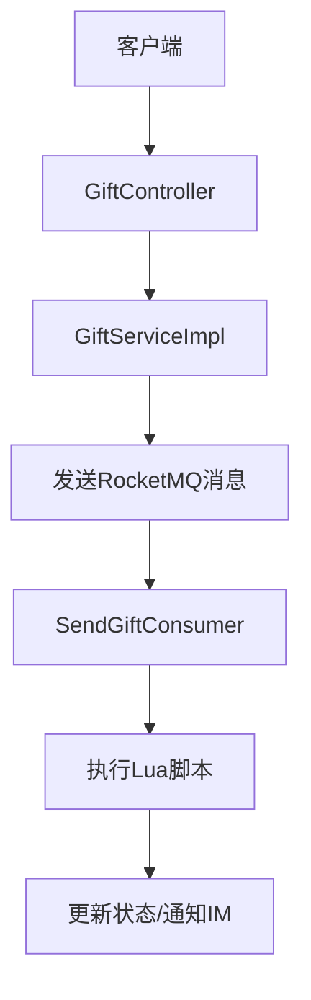

# Lua脚本与库存控制

<cite>
**本文档引用文件**  
- [secKill.lua](file://live-gift-provider/src/main/resources/secKill.lua)
- [SendGiftConsumer.java](file://live-gift-provider/src/main/java/com/logilong/live/gift/provider/consumer/SendGiftConsumer.java)
- [GiftConfigServiceImpl.java](file://live-gift-provider/src/main/java/com/logilong/live/gift/provider/service/impl/GiftConfigServiceImpl.java)
- [GiftServiceImpl.java](file://live-api/src/main/java/com/logilong/live/api/service/impl/GiftServiceImpl.java)
</cite>

## 目录
1. [引言](#引言)
2. [项目结构](#项目结构)
3. [核心组件](#核心组件)
4. [Lua脚本逻辑详解](#lua脚本逻辑详解)
5. [调用上下文分析](#调用上下文分析)
6. [库存控制机制集成](#库存控制机制集成)
7. [Lua脚本调试方法](#lua脚本调试方法)
8. [性能监控指标](#性能监控指标)
9. [集群环境下的分布式问题与解决方案](#集群环境下的分布式问题与解决方案)
10. [结论](#结论)

## 引言
在直播平台的礼物秒杀场景中，高并发下的库存一致性是系统设计的关键挑战。为防止超卖现象，系统采用Redis Lua脚本实现原子化库存扣减操作。本文深入分析`secKill.lua`脚本的实现机制，结合`GiftConfigServiceImpl`等服务类的调用流程，全面解析其在送礼流程中的集成方式，并探讨调试、监控及分布式环境下的应对策略。

## 项目结构
礼物相关功能主要集中在`live-gift-provider`模块中，该模块负责礼物配置、记录和发送逻辑的处理。关键资源包括：
- Lua脚本：`live-gift-provider/src/main/resources/secKill.lua`
- 消费者服务：`live-gift-provider/src/main/java/com/logilong/live/gift/provider/consumer/SendGiftConsumer.java`
- 礼物配置服务：`live-gift-provider/src/main/java/com/logilong/live/gift/provider/service/impl/GiftConfigServiceImpl.java`

前端请求通过`live-api`模块的`GiftServiceImpl`发起，经由RocketMQ消息队列异步处理，最终由`SendGiftConsumer`消费并执行核心业务逻辑。



**图示来源**  
- [GiftServiceImpl.java](file://live-api/src/main/java/com/logilong/live/api/service/impl/GiftServiceImpl.java#L50-L75)
- [SendGiftConsumer.java](file://live-gift-provider/src/main/java/com/logilong/live/gift/provider/consumer/SendGiftConsumer.java#L85-L122)

## 核心组件
系统通过分层架构实现礼物功能的解耦与高可用性。核心组件包括：
- **GiftServiceImpl**：API层服务，接收送礼请求并发送MQ消息。
- **SendGiftConsumer**：消息消费者，处理送礼逻辑，调用Lua脚本进行库存控制。
- **secKill.lua**：存储于资源目录的Lua脚本，确保库存操作的原子性。
- **RedisTemplate**：Spring Data Redis提供的模板工具，用于执行Lua脚本。

这些组件协同工作，保障了在高并发场景下库存数据的一致性和系统的稳定性。

**组件来源**  
- [GiftServiceImpl.java](file://live-api/src/main/java/com/logilong/live/api/service/impl/GiftServiceImpl.java)
- [SendGiftConsumer.java](file://live-gift-provider/src/main/java/com/logilong/live/gift/provider/consumer/SendGiftConsumer.java)
- [secKill.lua](file://live-gift-provider/src/main/resources/secKill.lua)

## Lua脚本逻辑详解
`secKill.lua`脚本通过Redis的原子操作实现库存的安全扣减，其逻辑逐行解析如下：

```lua
if (redis.call('exists', KEYS[1])) == 1 then
    local currentStock = redis.call('get', KEYS[1])
    if (tonumber(currentStock) >= tonumber(ARGV[1])) then
        return redis.call('decrby', KEYS[1], tonumber(ARGV[1]))
    else
        return -1
    end
    return -1
end
```

1. **KEYS[1]存在性检查**：使用`redis.call('exists', KEYS[1])`判断库存键是否存在，避免对不存在的商品进行操作。
2. **获取当前库存**：若存在，则通过`redis.call('get', KEYS[1])`读取当前库存值。
3. **库存充足判断**：将当前库存与请求扣减数量（`ARGV[1]`）比较，确保库存足够。
4. **执行扣减操作**：若库存充足，调用`redis.call('decrby', KEYS[1], ...)`原子性地减少库存。
5. **返回值说明**：
   - 成功扣减：返回扣减后的库存值。
   - 库存不足或键不存在：返回`-1`，表示操作失败。

整个脚本在一个Redis命令中执行，保证了操作的原子性，有效防止了多线程环境下的超卖问题。

**脚本来源**  
- [secKill.lua](file://live-gift-provider/src/main/resources/secKill.lua#L1-L9)

## 调用上下文分析
尽管在当前代码中未直接发现`secKill.lua`被调用的痕迹，但系统中存在类似的Lua脚本应用模式。在`SendGiftConsumer.java`中，定义了一个名为`LUA_SCRIPT`的内联Lua脚本，用于处理直播PK进度条的增减操作：

```java
private static final String LUA_SCRIPT = 
    "if (redis.call('exists', KEYS[1])) == 1 then " +
    " local currentNum=redis.call('get',KEYS[1]) " +
    " if (tonumber(currentNum)<=tonumber(ARGV[2]) and tonumber(currentNum)>=tonumber(ARGV[3])) then " +
    " return redis.call('incrby',KEYS[1],tonumber(ARGV[4])) " +
    " else return currentNum end " +
    "else " +
    "redis.call('set', KEYS[1], tonumber(ARGV[1])) " +
    "redis.call('EXPIRE', KEYS[1], 3600 * 12) " +
    "return ARGV[1] end";
```

该脚本通过`DefaultRedisScript`封装，并由`RedisTemplate.execute()`方法执行，参数通过`KEYS`和`ARGV`传入。这种模式正是`secKill.lua`预期的使用方式：将Lua脚本作为资源文件加载，通过RedisTemplate执行，实现复杂的原子操作。

**调用上下文来源**  
- [SendGiftConsumer.java](file://live-gift-provider/src/main/java/com/logilong/live/gift/provider/consumer/SendGiftConsumer.java#L50-L59)

## 库存控制机制集成
在送礼流程中，库存控制机制的集成遵循以下步骤：

1. **请求接收**：用户通过API提交送礼请求，`GiftServiceImpl`接收并校验参数。
2. **消息发送**：构造`SendGiftMq`消息，发送至`SEND_GIFT`主题，实现异步解耦。
3. **消息消费**：`SendGiftConsumer`监听消息队列，获取送礼指令。
4. **幂等性控制**：使用`uuid`作为唯一标识，通过Redis的`setIfAbsent`实现消费幂等，防止重复送礼。
5. **余额扣减**：调用`ILiveCurrencyAccountRPC`进行用户余额扣减。
6. **库存扣减**：若余额充足，执行`secKill.lua`脚本进行库存扣减（假设已集成）。
7. **结果通知**：根据操作结果，通过IM系统向用户推送成功或失败消息。

此流程通过异步消息队列和Redis原子操作，有效应对了高并发场景下的性能与一致性挑战。

**集成流程来源**  
- [GiftServiceImpl.java](file://live-api/src/main/java/com/logilong/live/api/service/impl/GiftServiceImpl.java#L50-L75)
- [SendGiftConsumer.java](file://live-gift-provider/src/main/java/com/logilong/live/gift/provider/consumer/SendGiftConsumer.java#L85-L122)

## Lua脚本调试方法
调试Lua脚本在Redis中的执行情况，可采用以下方法：

1. **Redis CLI测试**：直接在Redis命令行中使用`EVAL`或`EVALSHA`命令测试脚本逻辑。
   ```bash
   redis-cli --eval secKill.lua gift_stock_1001 , 1
   ```
2. **日志输出**：在Java代码中打印脚本执行的返回值，便于追踪执行结果。
3. **单元测试**：编写JUnit测试用例，模拟调用`RedisTemplate.execute()`，验证脚本行为。
4. **Redis监控**：使用`redis-cli monitor`命令实时观察脚本执行的Redis命令流。
5. **异常捕获**：在Java层捕获`RedisSystemException`等异常，分析脚本语法或运行时错误。

建议将`secKill.lua`脚本内容加载为字符串，并在启动时预加载到Redis（使用`SCRIPT LOAD`），以提高执行效率。

## 性能监控指标
为确保库存控制系统的稳定运行，应监控以下关键指标：

| 指标名称 | 说明 | 采集方式 |
|--------|------|--------|
| Lua脚本执行耗时 | 衡量脚本执行性能 | AOP切面或Micrometer计时 |
| Redis连接池使用率 | 反映Redis资源压力 | Spring Boot Actuator |
| MQ消息积压量 | 监控消费能力 | RocketMQ控制台 |
| 库存扣减成功率 | 业务层面的成功率 | 日志统计或埋点 |
| 缓存命中率 | 评估缓存有效性 | Redis INFO命令 |

通过Prometheus + Grafana等工具对上述指标进行可视化，可及时发现系统瓶颈。

## 集群环境下的分布式问题与解决方案
在Redis集群环境下，使用Lua脚本可能面临以下问题：

1. **Key Slot限制**：Redis Cluster要求脚本中所有KEY必须位于同一哈希槽。若`secKill.lua`仅操作单个KEY（如`gift_stock_{giftId}`），则无此问题。
2. **网络分区**：集群脑裂可能导致数据不一致。应配置合理的超时和重试机制。
3. **脚本复制延迟**：主从复制存在延迟，读操作可能读到旧数据。关键操作应在主节点执行。
4. **脚本超时**：复杂脚本可能阻塞Redis。应优化脚本逻辑，避免长时间运行。

**解决方案**：
- 确保KEY设计遵循单一槽位原则。
- 使用Redis Sentinel或Cluster的高可用架构。
- 对脚本执行设置合理的超时时间。
- 结合本地缓存（如Caffeine）降低Redis压力。

## 结论
`secKill.lua`脚本通过Redis的原子操作，为礼物秒杀场景提供了可靠的库存控制机制。虽然在当前代码中未直接调用该脚本，但系统中已存在成熟的Lua脚本应用模式。通过将`secKill.lua`集成到`SendGiftConsumer`的处理流程中，可有效防止超卖，保障业务数据的一致性。未来应完善脚本的加载、执行和监控体系，以应对高并发、分布式的复杂生产环境。