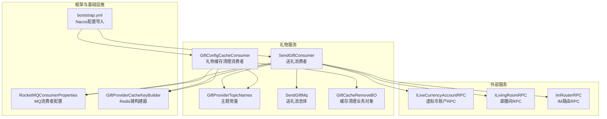
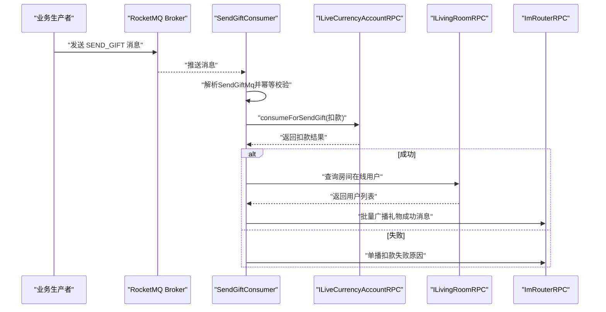
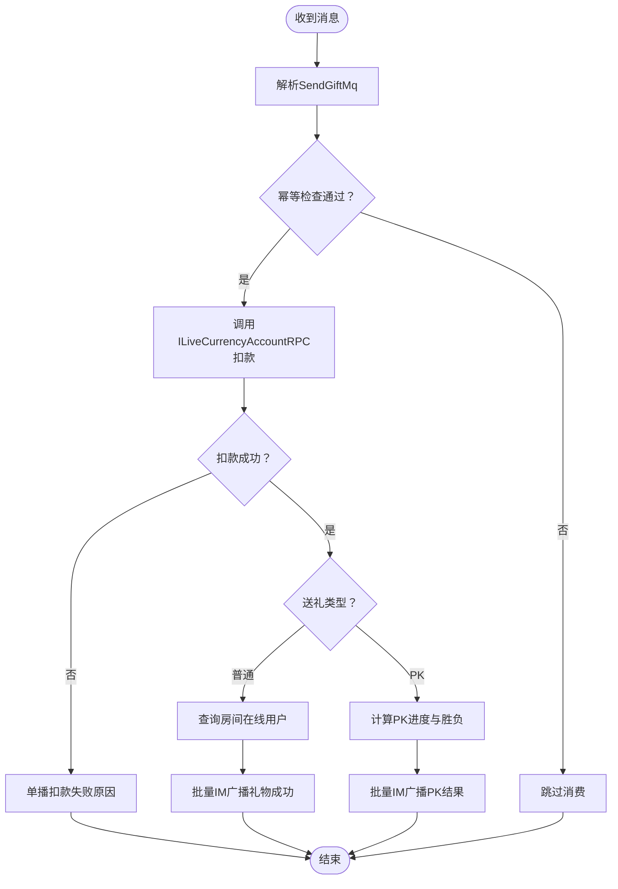
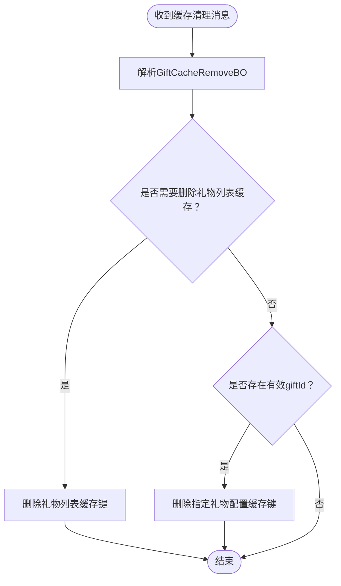
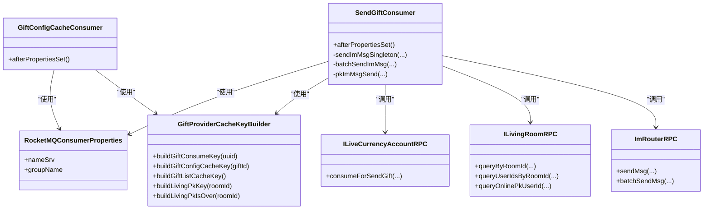

# 异步消息消费者

<cite>
**本文引用的文件**
- [SendGiftConsumer.java](file://live-gift-provider/src/main/java/com/logilong/live/gift/provider/consumer/SendGiftConsumer.java)
- [GiftConfigCacheConsumer.java](file://live-gift-provider/src/main/java/com/logilong/live/gift/provider/consumer/GiftConfigCacheConsumer.java)
- [GiftProviderTopicNames.java](file://live-common-interface/src/main/java/com/logilong/live/common/interfaces/topic/GiftProviderTopicNames.java)
- [SendGiftMq.java](file://live-common-interface/src/main/java/com/logilong/live/common/interfaces/dto/SendGiftMq.java)
- [RocketMQConsumerProperties.java](file://live-framework/live-framework-mq-starter/src/main/java/com/logilong/live/framework/mq/starter/properties/RocketMQConsumerProperties.java)
- [GiftProviderCacheKeyBuilder.java](file://live-framework/live-framework-redis-starter/src/main/java/com/logilong/live/framework/redis/starter/key/GiftProviderCacheKeyBuilder.java)
- [GiftCacheRemoveBO.java](file://live-gift-provider/src/main/java/com/logilong/live/gift/provider/service/bo/GiftCacheRemoveBO.java)
- [SendGiftTypeEnum.java](file://live-gift-interface/src/main/java/com/logilong/live/gift/constants/SendGiftTypeEnum.java)
- [ILiveCurrencyAccountRPC.java](file://live-bank-interface/src/main/java/com/logilong/live/bank/interfaces/ILiveCurrencyAccountRPC.java)
- [ILivingRoomRPC.java](file://live-living-interface/src/main/java/com/logilong/live/living/interfaces/rpc/ILivingRoomRPC.java)
- [ImRouterRPC.java](file://live-im-router-interface/src/main/java/com/logilong/live/im/router/interfaces/ImRouterRPC.java)
- [bootstrap.yml](file://live-gift-provider/src/main/resources/bootstrap.yml)
</cite>

## 目录
1. [引言](#引言)
2. [项目结构](#项目结构)
3. [核心组件](#核心组件)
4. [架构总览](#架构总览)
5. [详细组件分析](#详细组件分析)
6. [依赖关系分析](#依赖关系分析)
7. [性能考量](#性能考量)
8. [故障排查指南](#故障排查指南)
9. [结论](#结论)

## 引言
本文件聚焦于礼物服务中的RocketMQ消费者组件，系统性梳理以下内容：
- SendGiftConsumer如何处理送礼消息，覆盖消息解析、业务校验、账户扣款、IM广播与记录写入等关键步骤；
- GiftConfigCacheConsumer如何消费“移除礼物缓存”消息，实现跨节点缓存同步；
- 结合GiftProviderTopicNames中定义的主题名称，完整串联消息生产与消费链路；
- 探讨消费者幂等性、失败重试与消息堆积的应对策略，保障高负载下的系统稳定性。

## 项目结构
礼物服务消费者位于gift-provider模块，RocketMQ消费者通过Spring容器初始化，订阅主题并消费消息；缓存键构建由Redis Starter提供；业务RPC接口来自银行、直播房间与IM路由模块。

图表来源
- [SendGiftConsumer.java](file://live-gift-provider/src/main/java/com/logilong/live/gift/provider/consumer/SendGiftConsumer.java#L74-L126)
- [GiftConfigCacheConsumer.java](file://live-gift-provider/src/main/java/com/logilong/live/gift/provider/consumer/GiftConfigCacheConsumer.java#L35-L61)
- [GiftProviderTopicNames.java](file://live-common-interface/src/main/java/com/logilong/live/common/interfaces/topic/GiftProviderTopicNames.java#L1-L21)
- [SendGiftMq.java](file://live-common-interface/src/main/java/com/logilong/live/common/interfaces/dto/SendGiftMq.java#L1-L17)
- [GiftCacheRemoveBO.java](file://live-gift-provider/src/main/java/com/logilong/live/gift/provider/service/bo/GiftCacheRemoveBO.java#L1-L11)
- [RocketMQConsumerProperties.java](file://live-framework/live-framework-mq-starter/src/main/java/com/logilong/live/framework/mq/starter/properties/RocketMQConsumerProperties.java#L1-L16)
- [GiftProviderCacheKeyBuilder.java](file://live-framework/live-framework-redis-starter/src/main/java/com/logilong/live/framework/redis/starter/key/GiftProviderCacheKeyBuilder.java#L1-L89)
- [ILiveCurrencyAccountRPC.java](file://live-bank-interface/src/main/java/com/logilong/live/bank/interfaces/ILiveCurrencyAccountRPC.java#L1-L52)
- [ILivingRoomRPC.java](file://live-living-interface/src/main/java/com/logilong/live/living/interfaces/rpc/ILivingRoomRPC.java#L1-L57)
- [ImRouterRPC.java](file://live-im-router-interface/src/main/java/com/logilong/live/im/router/interfaces/ImRouterRPC.java#L1-L18)
- [bootstrap.yml](file://live-gift-provider/src/main/resources/bootstrap.yml#L1-L22)

章节来源
- [SendGiftConsumer.java](file://live-gift-provider/src/main/java/com/logilong/live/gift/provider/consumer/SendGiftConsumer.java#L74-L126)
- [GiftConfigCacheConsumer.java](file://live-gift-provider/src/main/java/com/logilong/live/gift/provider/consumer/GiftConfigCacheConsumer.java#L35-L61)
- [GiftProviderTopicNames.java](file://live-common-interface/src/main/java/com/logilong/live/common/interfaces/topic/GiftProviderTopicNames.java#L1-L21)
- [RocketMQConsumerProperties.java](file://live-framework/live-framework-mq-starter/src/main/java/com/logilong/live/framework/mq/starter/properties/RocketMQConsumerProperties.java#L1-L16)
- [GiftProviderCacheKeyBuilder.java](file://live-framework/live-framework-redis-starter/src/main/java/com/logilong/live/framework/redis/starter/key/GiftProviderCacheKeyBuilder.java#L1-L89)
- [bootstrap.yml](file://live-gift-provider/src/main/resources/bootstrap.yml#L1-L22)

## 核心组件
- 送礼消费者（SendGiftConsumer）
  - 订阅主题：GiftProviderTopicNames.SEND_GIFT
  - 功能：解析消息、幂等控制、账户扣款、IM广播、PK进度计算与广播
- 礼物缓存清理消费者（GiftConfigCacheConsumer）
  - 订阅主题：GiftProviderTopicNames.REMOVE_GIFT_CACHE
  - 功能：按业务对象删除指定礼物配置或列表缓存键，实现跨节点缓存同步

章节来源
- [SendGiftConsumer.java](file://live-gift-provider/src/main/java/com/logilong/live/gift/provider/consumer/SendGiftConsumer.java#L74-L126)
- [GiftConfigCacheConsumer.java](file://live-gift-provider/src/main/java/com/logilong/live/gift/provider/consumer/GiftConfigCacheConsumer.java#L35-L61)
- [GiftProviderTopicNames.java](file://live-common-interface/src/main/java/com/logilong/live/common/interfaces/topic/GiftProviderTopicNames.java#L1-L21)

## 架构总览
消息生产与消费链路如下：
- 生产端：业务模块向RocketMQ发送“送礼”和“移除礼物缓存”两类消息；
- 消费端：gift-provider分别启动两个消费者，分别处理上述两类消息；
- 缓存键：统一由GiftProviderCacheKeyBuilder生成，便于跨节点一致化；
- 外部依赖：虚拟币账户RPC、直播间RPC、IM路由RPC。

图表来源
- [SendGiftConsumer.java](file://live-gift-provider/src/main/java/com/logilong/live/gift/provider/consumer/SendGiftConsumer.java#L84-L123)
- [ILiveCurrencyAccountRPC.java](file://live-bank-interface/src/main/java/com/logilong/live/bank/interfaces/ILiveCurrencyAccountRPC.java#L43-L52)
- [ILivingRoomRPC.java](file://live-living-interface/src/main/java/com/logilong/live/living/interfaces/rpc/ILivingRoomRPC.java#L39-L41)
- [ImRouterRPC.java](file://live-im-router-interface/src/main/java/com/logilong/live/im/router/interfaces/ImRouterRPC.java#L6-L18)

## 详细组件分析

### SendGiftConsumer：送礼消息处理流程
- 主题订阅与消费者初始化
  - 订阅主题：GiftProviderTopicNames.SEND_GIFT
  - 设置消费者组名、批量拉取消息数、从头开始消费
- 幂等性控制
  - 使用Redis基于uuid的setIfAbsent锁，超时时间较长，避免重复消费
- 业务处理
  - 解析消息体SendGiftMq，区分普通送礼与PK送礼类型
  - 调用ILiveCurrencyAccountRPC进行扣款，返回结果决定后续动作
  - 成功：查询房间在线用户，批量广播礼物成功消息；PK场景下同时计算PK进度并广播PK结果
  - 失败：单播扣款失败原因给用户
- 关键点
  - PK进度使用Lua脚本原子计数，保证并发安全
  - 使用GiftProviderCacheKeyBuilder生成PK相关缓存键，确保跨节点一致性

图表来源
- [SendGiftConsumer.java](file://live-gift-provider/src/main/java/com/logilong/live/gift/provider/consumer/SendGiftConsumer.java#L84-L123)
- [SendGiftTypeEnum.java](file://live-gift-interface/src/main/java/com/logilong/live/gift/constants/SendGiftTypeEnum.java#L1-L18)
- [GiftProviderCacheKeyBuilder.java](file://live-framework/live-framework-redis-starter/src/main/java/com/logilong/live/framework/redis/starter/key/GiftProviderCacheKeyBuilder.java#L61-L75)
- [ILiveCurrencyAccountRPC.java](file://live-bank-interface/src/main/java/com/logilong/live/bank/interfaces/ILiveCurrencyAccountRPC.java#L43-L52)
- [ILivingRoomRPC.java](file://live-living-interface/src/main/java/com/logilong/live/living/interfaces/rpc/ILivingRoomRPC.java#L39-L41)
- [ImRouterRPC.java](file://live-im-router-interface/src/main/java/com/logilong/live/im/router/interfaces/ImRouterRPC.java#L11-L18)

章节来源
- [SendGiftConsumer.java](file://live-gift-provider/src/main/java/com/logilong/live/gift/provider/consumer/SendGiftConsumer.java#L74-L126)
- [SendGiftMq.java](file://live-common-interface/src/main/java/com/logilong/live/common/interfaces/dto/SendGiftMq.java#L1-L17)
- [SendGiftTypeEnum.java](file://live-gift-interface/src/main/java/com/logilong/live/gift/constants/SendGiftTypeEnum.java#L1-L18)
- [GiftProviderCacheKeyBuilder.java](file://live-framework/live-framework-redis-starter/src/main/java/com/logilong/live/framework/redis/starter/key/GiftProviderCacheKeyBuilder.java#L61-L75)
- [ILiveCurrencyAccountRPC.java](file://live-bank-interface/src/main/java/com/logilong/live/bank/interfaces/ILiveCurrencyAccountRPC.java#L43-L52)
- [ILivingRoomRPC.java](file://live-living-interface/src/main/java/com/logilong/live/living/interfaces/rpc/ILivingRoomRPC.java#L39-L41)
- [ImRouterRPC.java](file://live-im-router-interface/src/main/java/com/logilong/live/im/router/interfaces/ImRouterRPC.java#L11-L18)

### GiftConfigCacheConsumer：缓存清理消息处理
- 主题订阅与消费者初始化
  - 订阅主题：GiftProviderTopicNames.REMOVE_GIFT_CACHE
  - 设置消费者组名、批量拉取消息数、从头开始消费
- 业务处理
  - 解析消息体GiftCacheRemoveBO，根据字段决定删除礼物列表缓存或指定礼物配置缓存
  - 使用GiftProviderCacheKeyBuilder生成对应缓存键，执行删除操作
- 作用
  - 实现跨节点缓存同步，确保配置变更后各节点缓存一致

图表来源
- [GiftConfigCacheConsumer.java](file://live-gift-provider/src/main/java/com/logilong/live/gift/provider/consumer/GiftConfigCacheConsumer.java#L35-L61)
- [GiftCacheRemoveBO.java](file://live-gift-provider/src/main/java/com/logilong/live/gift/provider/service/bo/GiftCacheRemoveBO.java#L1-L11)
- [GiftProviderCacheKeyBuilder.java](file://live-framework/live-framework-redis-starter/src/main/java/com/logilong/live/framework/redis/starter/key/GiftProviderCacheKeyBuilder.java#L73-L83)

章节来源
- [GiftConfigCacheConsumer.java](file://live-gift-provider/src/main/java/com/logilong/live/gift/provider/consumer/GiftConfigCacheConsumer.java#L35-L61)
- [GiftCacheRemoveBO.java](file://live-gift-provider/src/main/java/com/logilong/live/gift/provider/service/bo/GiftCacheRemoveBO.java#L1-L11)
- [GiftProviderCacheKeyBuilder.java](file://live-framework/live-framework-redis-starter/src/main/java/com/logilong/live/framework/redis/starter/key/GiftProviderCacheKeyBuilder.java#L73-L83)

### 主题与消息体
- 主题定义
  - REMOVE_GIFT_CACHE：用于移除礼物相关缓存
  - SEND_GIFT：用于处理送礼事件
  - RECEIVE_RED_PACKET：用于红包相关事件（与礼物服务同属GiftProviderTopicNames）
- 消息体
  - SendGiftMq：包含用户、礼物、价格、接收者、房间、资源URL、唯一标识、类型等字段
  - GiftCacheRemoveBO：包含是否删除列表缓存与礼物ID字段

章节来源
- [GiftProviderTopicNames.java](file://live-common-interface/src/main/java/com/logilong/live/common/interfaces/topic/GiftProviderTopicNames.java#L1-L21)
- [SendGiftMq.java](file://live-common-interface/src/main/java/com/logilong/live/common/interfaces/dto/SendGiftMq.java#L1-L17)
- [GiftCacheRemoveBO.java](file://live-gift-provider/src/main/java/com/logilong/live/gift/provider/service/bo/GiftCacheRemoveBO.java#L1-L11)

## 依赖关系分析
- 组件耦合
  - SendGiftConsumer依赖RocketMQ消费者配置、Redis键构建器、银行RPC、直播房间RPC、IM路由RPC
  - GiftConfigCacheConsumer依赖RocketMQ消费者配置、Redis键构建器、缓存清理业务对象
- 外部接口契约
  - ILiveCurrencyAccountRPC：提供扣款接口，支持“送礼专用扣款”
  - ILivingRoomRPC：提供房间查询、在线用户查询、PK状态查询
  - ImRouterRPC：提供单播与批量IM消息发送能力
- 配置来源
  - RocketMQConsumerProperties：从配置中心读取NameServer与消费者组名
  - bootstrap.yml：引入Nacos配置，自动加载同名服务配置

图表来源
- [SendGiftConsumer.java](file://live-gift-provider/src/main/java/com/logilong/live/gift/provider/consumer/SendGiftConsumer.java#L74-L126)
- [GiftConfigCacheConsumer.java](file://live-gift-provider/src/main/java/com/logilong/live/gift/provider/consumer/GiftConfigCacheConsumer.java#L35-L61)
- [RocketMQConsumerProperties.java](file://live-framework/live-framework-mq-starter/src/main/java/com/logilong/live/framework/mq/starter/properties/RocketMQConsumerProperties.java#L1-L16)
- [GiftProviderCacheKeyBuilder.java](file://live-framework/live-framework-redis-starter/src/main/java/com/logilong/live/framework/redis/starter/key/GiftProviderCacheKeyBuilder.java#L1-L89)
- [ILiveCurrencyAccountRPC.java](file://live-bank-interface/src/main/java/com/logilong/live/bank/interfaces/ILiveCurrencyAccountRPC.java#L43-L52)
- [ILivingRoomRPC.java](file://live-living-interface/src/main/java/com/logilong/live/living/interfaces/rpc/ILivingRoomRPC.java#L10-L57)
- [ImRouterRPC.java](file://live-im-router-interface/src/main/java/com/logilong/live/im/router/interfaces/ImRouterRPC.java#L6-L18)

章节来源
- [SendGiftConsumer.java](file://live-gift-provider/src/main/java/com/logilong/live/gift/provider/consumer/SendGiftConsumer.java#L74-L126)
- [GiftConfigCacheConsumer.java](file://live-gift-provider/src/main/java/com/logilong/live/gift/provider/consumer/GiftConfigCacheConsumer.java#L35-L61)
- [RocketMQConsumerProperties.java](file://live-framework/live-framework-mq-starter/src/main/java/com/logilong/live/framework/mq/starter/properties/RocketMQConsumerProperties.java#L1-L16)
- [GiftProviderCacheKeyBuilder.java](file://live-framework/live-framework-redis-starter/src/main/java/com/logilong/live/framework/redis/starter/key/GiftProviderCacheKeyBuilder.java#L1-L89)
- [ILiveCurrencyAccountRPC.java](file://live-bank-interface/src/main/java/com/logilong/live/bank/interfaces/ILiveCurrencyAccountRPC.java#L43-L52)
- [ILivingRoomRPC.java](file://live-living-interface/src/main/java/com/logilong/live/living/interfaces/rpc/ILivingRoomRPC.java#L10-L57)
- [ImRouterRPC.java](file://live-im-router-interface/src/main/java/com/logilong/live/im/router/interfaces/ImRouterRPC.java#L6-L18)

## 性能考量
- 幂等性
  - 使用Redis基于uuid的setIfAbsent锁，避免重复消费；锁超时时间较长，降低误删概率
- 批量消费
  - 设置批量拉取消息数，减少网络往返与上下文切换
- 原子计数
  - PK进度使用Lua脚本原子计数，避免竞态条件
- 缓存键设计
  - 统一的键构建器，便于跨节点一致性与清理
- 失败处理
  - 扣款失败立即单播提示，避免长时间阻塞；成功后批量广播，降低IM压力
- 配置来源
  - 通过Nacos集中管理RocketMQ配置，便于动态调整消费者组与NameServer

章节来源
- [SendGiftConsumer.java](file://live-gift-provider/src/main/java/com/logilong/live/gift/provider/consumer/SendGiftConsumer.java#L84-L123)
- [GiftConfigCacheConsumer.java](file://live-gift-provider/src/main/java/com/logilong/live/gift/provider/consumer/GiftConfigCacheConsumer.java#L35-L61)
- [GiftProviderCacheKeyBuilder.java](file://live-framework/live-framework-redis-starter/src/main/java/com/logilong/live/framework/redis/starter/key/GiftProviderCacheKeyBuilder.java#L61-L83)
- [RocketMQConsumerProperties.java](file://live-framework/live-framework-mq-starter/src/main/java/com/logilong/live/framework/mq/starter/properties/RocketMQConsumerProperties.java#L1-L16)
- [bootstrap.yml](file://live-gift-provider/src/main/resources/bootstrap.yml#L1-L22)

## 故障排查指南
- 消费未生效
  - 确认消费者已启动并订阅到正确主题
  - 检查RocketMQConsumerProperties配置是否正确
- 幂等问题
  - 观察Redis中是否存在gift_consume_key对应的uuid键；若存在且未过期，表示已被消费
- 扣款失败
  - 检查ILiveCurrencyAccountRPC返回结果；确认用户余额充足
- PK进度异常
  - 检查PK相关缓存键是否存在；核对Lua脚本参数与边界值
- 缓存未刷新
  - 确认GiftConfigCacheConsumer是否收到清理消息；核对GiftCacheRemoveBO字段

章节来源
- [SendGiftConsumer.java](file://live-gift-provider/src/main/java/com/logilong/live/gift/provider/consumer/SendGiftConsumer.java#L84-L123)
- [GiftConfigCacheConsumer.java](file://live-gift-provider/src/main/java/com/logilong/live/gift/provider/consumer/GiftConfigCacheConsumer.java#L35-L61)
- [GiftProviderCacheKeyBuilder.java](file://live-framework/live-framework-redis-starter/src/main/java/com/logilong/live/framework/redis/starter/key/GiftProviderCacheKeyBuilder.java#L61-L83)
- [ILiveCurrencyAccountRPC.java](file://live-bank-interface/src/main/java/com/logilong/live/bank/interfaces/ILiveCurrencyAccountRPC.java#L43-L52)

## 结论
- SendGiftConsumer与GiftConfigCacheConsumer分别承担“送礼事件处理”和“缓存清理同步”的职责，二者共同构成礼物服务的异步消息闭环；
- 通过幂等锁、批量消费、原子计数与统一缓存键设计，系统在高并发场景下具备良好的稳定性与一致性；
- 建议持续监控消息堆积情况，结合RocketMQ的重试与死信队列策略，进一步完善失败重试与告警机制。