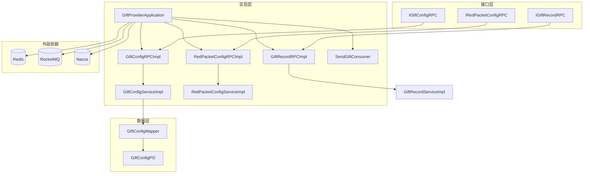
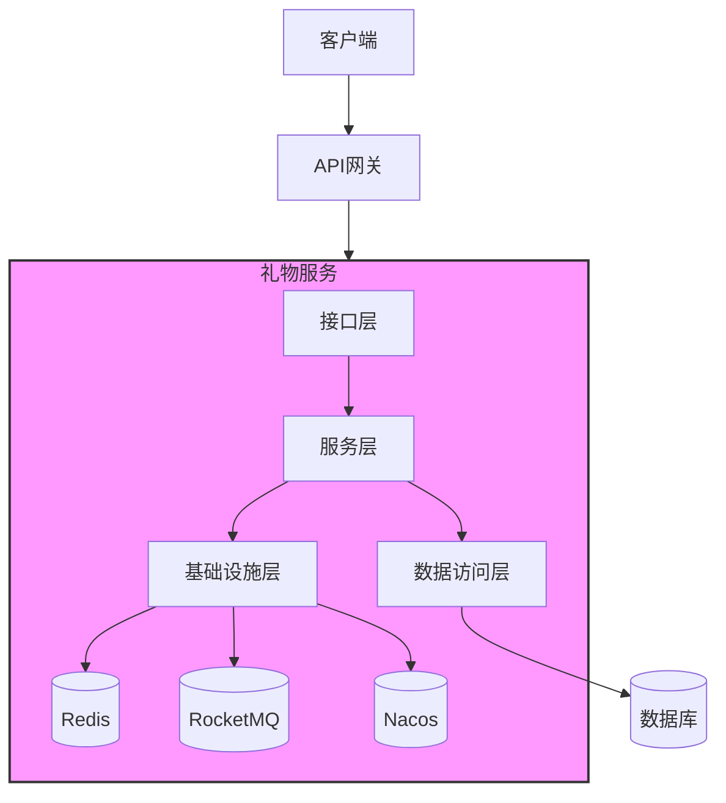
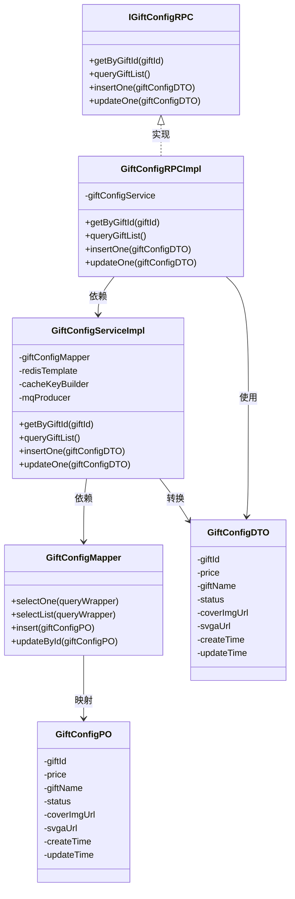
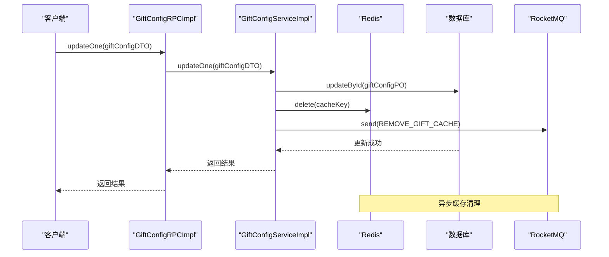
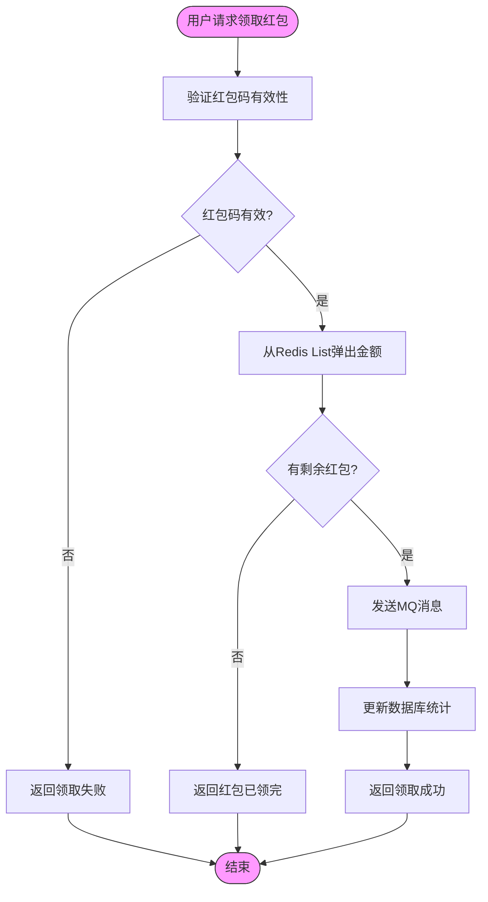
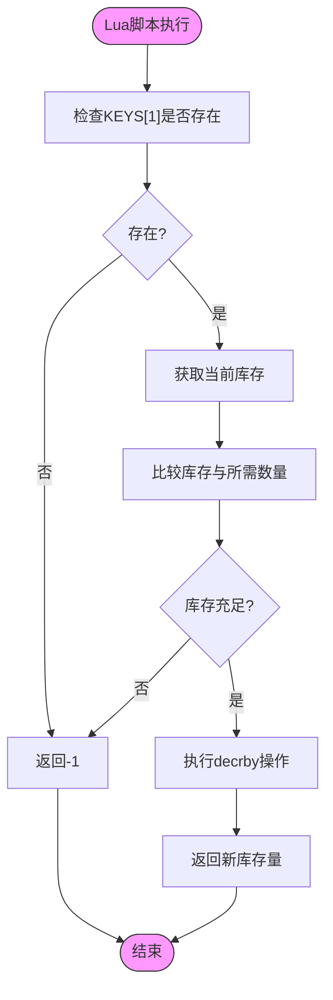
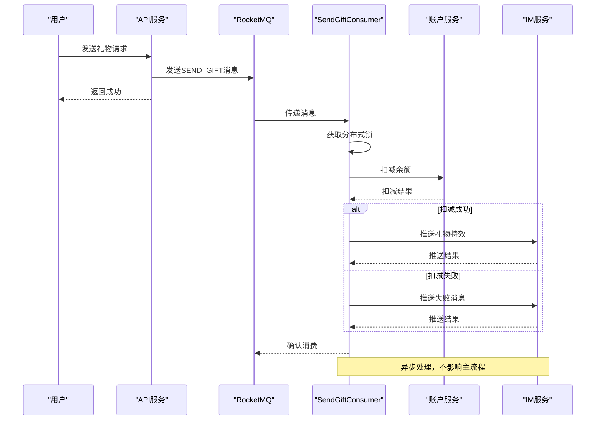
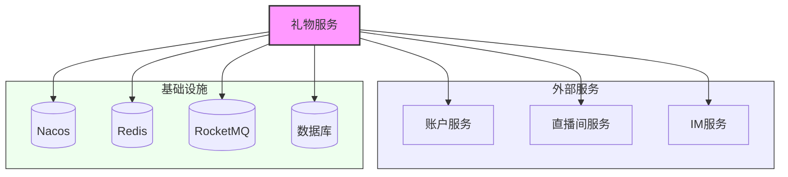

# 礼物服务

<cite>
**本文档引用的文件**
- [IGiftConfigRPC.java](file://live-gift-interface/src/main/java/com/logilong/live/gift/interfaces/IGiftConfigRPC.java)
- [IGiftRecordRPC.java](file://live-gift-interface/src/main/java/com/logilong/live/gift/interfaces/IGiftRecordRPC.java)
- [IRedPacketConfigRPC.java](file://live-gift-interface/src/main/java/com/logilong/live/gift/interfaces/IRedPacketConfigRPC.java)
- [GiftProviderApplication.java](file://live-gift-provider/src/main/java/com/logilong/live/gift/provider/GiftProviderApplication.java)
- [GiftConfigRPCImpl.java](file://live-gift-provider/src/main/java/com/logilong/live/gift/provider/rpc/GiftConfigRPCImpl.java)
- [GiftRecordRPCImpl.java](file://live-gift-provider/src/main/java/com/logilong/live/gift/provider/rpc/GiftRecordRPCImpl.java)
- [RedPacketConfigRPCImpl.java](file://live-gift-provider/src/main/java/com/logilong/live/gift/provider/rpc/RedPacketConfigRPCImpl.java)
- [SendGiftConsumer.java](file://live-gift-provider/src/main/java/com/logilong/live/gift/provider/consumer/SendGiftConsumer.java)
- [GiftConfigServiceImpl.java](file://live-gift-provider/src/main/java/com/logilong/live/gift/provider/service/impl/GiftConfigServiceImpl.java)
- [RedPacketConfigServiceImpl.java](file://live-gift-provider/src/main/java/com/logilong/live/gift/provider/service/impl/RedPacketConfigServiceImpl.java)
- [GiftConfigMapper.java](file://live-gift-provider/src/main/java/com/logilong/live/gift/provider/dao/mapper/GiftConfigMapper.java)
- [GiftConfigPO.java](file://live-gift-provider/src/main/java/com/logilong/live/gift/provider/dao/po/GiftConfigPO.java)
- [GiftConfigDTO.java](file://live-gift-interface/src/main/java/com/logilong/live/gift/dto/GiftConfigDTO.java)
- [GiftRecordDTO.java](file://live-gift-interface/src/main/java/com/logilong/live/gift/dto/GiftRecordDTO.java)
- [secKill.lua](file://live-gift-provider/src/main/resources/secKill.lua)
</cite>

## 目录
1. [简介](#简介)
2. [项目结构](#项目结构)
3. [核心组件](#核心组件)
4. [架构概述](#架构概述)
5. [详细组件分析](#详细组件分析)
6. [依赖分析](#依赖分析)
7. [性能考虑](#性能考虑)
8. [故障排除指南](#故障排除指南)
9. [结论](#结论)

## 简介
本文档系统阐述了礼物服务的整体架构与核心功能实现，重点分析了礼物配置管理、礼物记录追踪及红包功能（RedPacket）三大组件。文档解析了IGiftConfigRPC等Dubbo接口契约设计，说明了GiftProviderApplication如何初始化服务实例并注册到Nacos。特别剖析了秒杀场景下的Lua脚本（secKill.lua）在库存扣减中的应用，以及RocketMQ消息驱动的异步送礼流程（SendGiftConsumer）。结合直播间互动场景，说明了高并发下的性能优化策略与缓存一致性保障机制。

## 项目结构
礼物服务采用微服务架构，主要由接口层（live-gift-interface）和实现层（live-gift-provider）组成。接口层定义了Dubbo RPC服务契约，实现层提供了具体的业务逻辑。服务通过Nacos进行服务注册与发现，使用Redis作为缓存层，RocketMQ作为消息中间件实现异步处理。

**图示来源**
- [IGiftConfigRPC.java](file://live-gift-interface/src/main/java/com/logilong/live/gift/interfaces/IGiftConfigRPC.java)
- [GiftConfigRPCImpl.java](file://live-gift-provider/src/main/java/com/logilong/live/gift/provider/rpc/GiftConfigRPCImpl.java)
- [GiftConfigServiceImpl.java](file://live-gift-provider/src/main/java/com/logilong/live/gift/provider/service/impl/GiftConfigServiceImpl.java)
- [GiftConfigMapper.java](file://live-gift-provider/src/main/java/com/logilong/live/gift/provider/dao/mapper/GiftConfigMapper.java)
- [GiftConfigPO.java](file://live-gift-provider/src/main/java/com/logilong/live/gift/provider/dao/po/GiftConfigPO.java)

**章节来源**
- [IGiftConfigRPC.java](file://live-gift-interface/src/main/java/com/logilong/live/gift/interfaces/IGiftConfigRPC.java)
- [GiftProviderApplication.java](file://live-gift-provider/src/main/java/com/logilong/live/gift/provider/GiftProviderApplication.java)

## 核心组件
礼物服务的核心组件包括礼物配置管理、礼物记录追踪和红包功能三大模块。礼物配置管理负责礼物信息的增删改查和缓存管理；礼物记录追踪负责记录用户送礼行为；红包功能实现了红包雨的创建、发放和领取机制。这些组件通过Dubbo RPC接口对外提供服务，并通过RocketMQ实现异步处理，确保系统的高性能和高可用性。

**章节来源**
- [IGiftConfigRPC.java](file://live-gift-interface/src/main/java/com/logilong/live/gift/interfaces/IGiftConfigRPC.java)
- [IGiftRecordRPC.java](file://live-gift-interface/src/main/java/com/logilong/live/gift/interfaces/IGiftRecordRPC.java)
- [IRedPacketConfigRPC.java](file://live-gift-interface/src/main/java/com/logilong/live/gift/interfaces/IRedPacketConfigRPC.java)

## 架构概述
礼物服务采用分层架构设计，包括接口层、服务层、数据访问层和基础设施层。接口层定义了Dubbo RPC服务契约，服务层实现了核心业务逻辑，数据访问层负责与数据库交互，基础设施层提供了缓存、消息队列等公共服务。服务启动时通过GiftProviderApplication初始化，并注册到Nacos服务注册中心，实现服务发现和负载均衡。

**图示来源**
- [GiftProviderApplication.java](file://live-gift-provider/src/main/java/com/logilong/live/gift/provider/GiftProviderApplication.java)
- [GiftConfigRPCImpl.java](file://live-gift-provider/src/main/java/com/logilong/live/gift/provider/rpc/GiftConfigRPCImpl.java)
- [GiftConfigServiceImpl.java](file://live-gift-provider/src/main/java/com/logilong/live/gift/provider/service/impl/GiftConfigServiceImpl.java)

## 详细组件分析

### 礼物配置管理分析
礼物配置管理组件负责礼物信息的全生命周期管理，包括查询、新增、更新等操作。该组件实现了完善的缓存策略，通过Redis缓存热点数据，有效减轻数据库压力。同时，采用RocketMQ消息队列实现缓存的异步更新，确保缓存与数据库的一致性。

#### 对象关系图

**图示来源**
- [IGiftConfigRPC.java](file://live-gift-interface/src/main/java/com/logilong/live/gift/interfaces/IGiftConfigRPC.java)
- [GiftConfigRPCImpl.java](file://live-gift-provider/src/main/java/com/logilong/live/gift/provider/rpc/GiftConfigRPCImpl.java)
- [GiftConfigServiceImpl.java](file://live-gift-provider/src/main/java/com/logilong/live/gift/provider/service/impl/GiftConfigServiceImpl.java)
- [GiftConfigMapper.java](file://live-gift-provider/src/main/java/com/logilong/live/gift/provider/dao/mapper/GiftConfigMapper.java)
- [GiftConfigPO.java](file://live-gift-provider/src/main/java/com/logilong/live/gift/provider/dao/po/GiftConfigPO.java)
- [GiftConfigDTO.java](file://live-gift-interface/src/main/java/com/logilong/live/gift/dto/GiftConfigDTO.java)

#### 缓存更新流程

**图示来源**
- [GiftConfigRPCImpl.java](file://live-gift-provider/src/main/java/com/logilong/live/gift/provider/rpc/GiftConfigRPCImpl.java)
- [GiftConfigServiceImpl.java](file://live-gift-provider/src/main/java/com/logilong/live/gift/provider/service/impl/GiftConfigServiceImpl.java)

**章节来源**
- [GiftConfigRPCImpl.java](file://live-gift-provider/src/main/java/com/logilong/live/gift/provider/rpc/GiftConfigRPCImpl.java)
- [GiftConfigServiceImpl.java](file://live-gift-provider/src/main/java/com/logilong/live/gift/provider/service/impl/GiftConfigServiceImpl.java)

### 红包功能分析
红包功能组件实现了红包雨的完整业务流程，包括红包配置、准备、发放和领取。该组件采用二倍均值法生成红包金额，确保公平性。通过Redis List存储红包金额，实现高效的并发领取。使用RocketMQ实现异步处理，确保用户余额的准确更新。

#### 红包领取流程

**图示来源**
- [RedPacketConfigServiceImpl.java](file://live-gift-provider/src/main/java/com/logilong/live/gift/provider/service/impl/RedPacketConfigServiceImpl.java)
- [IRedPacketConfigRPC.java](file://live-gift-interface/src/main/java/com/logilong/live/gift/interfaces/IRedPacketConfigRPC.java)

### 秒杀场景库存扣减分析
在秒杀场景下，礼物服务使用Lua脚本实现原子性的库存扣减操作。该脚本首先检查库存Key是否存在，然后获取当前库存量，如果库存充足则执行扣减操作，否则返回-1表示库存不足。这种设计确保了在高并发场景下的数据一致性。

#### Lua脚本逻辑

**图示来源**
- [secKill.lua](file://live-gift-provider/src/main/resources/secKill.lua)

**章节来源**
- [secKill.lua](file://live-gift-provider/src/main/resources/secKill.lua)

### 异步送礼流程分析
异步送礼流程通过RocketMQ消息驱动，实现了送礼操作的解耦。当用户送礼时，系统发送消息到SEND_GIFT主题，SendGiftConsumer消费该消息并执行余额扣减、礼物特效推送等操作。该设计提高了系统的响应速度和可靠性。

#### 异步送礼序列图

**图示来源**
- [SendGiftConsumer.java](file://live-gift-provider/src/main/java/com/logilong/live/gift/provider/consumer/SendGiftConsumer.java)

**章节来源**
- [SendGiftConsumer.java](file://live-gift-provider/src/main/java/com/logilong/live/gift/provider/consumer/SendGiftConsumer.java)

## 依赖分析
礼物服务依赖于多个外部系统和服务，包括Nacos服务注册中心、Redis缓存、RocketMQ消息队列、数据库以及账户服务、直播间服务和IM服务等。这些依赖关系通过Dubbo RPC和消息队列实现松耦合，确保了系统的可扩展性和稳定性。

**图示来源**
- [GiftProviderApplication.java](file://live-gift-provider/src/main/java/com/logilong/live/gift/provider/GiftProviderApplication.java)
- [SendGiftConsumer.java](file://live-gift-provider/src/main/java/com/logilong/live/gift/provider/consumer/SendGiftConsumer.java)
- [RedPacketConfigServiceImpl.java](file://live-gift-provider/src/main/java/com/logilong/live/gift/provider/service/impl/RedPacketConfigServiceImpl.java)

**章节来源**
- [GiftProviderApplication.java](file://live-gift-provider/src/main/java/com/logilong/live/gift/provider/GiftProviderApplication.java)
- [SendGiftConsumer.java](file://live-gift-provider/src/main/java/com/logilong/live/gift/provider/consumer/SendGiftConsumer.java)

## 性能考虑
礼物服务在设计时充分考虑了高并发场景下的性能需求。通过Redis缓存热点数据，减少数据库访问压力；使用Lua脚本实现原子操作，确保数据一致性；采用消息队列实现异步处理，提高系统响应速度；通过分布式锁防止重复消费，保证业务逻辑的正确性。这些优化策略共同保障了系统在高并发场景下的稳定运行。

## 故障排除指南
当礼物服务出现异常时，可按照以下步骤进行排查：首先检查Nacos服务注册状态，确保服务正常注册；其次检查Redis连接状态，确保缓存服务可用；然后检查RocketMQ消息积压情况，确保消息正常消费；最后查看服务日志，定位具体异常原因。对于缓存一致性问题，可检查MQ消息发送和消费情况；对于性能问题，可检查数据库慢查询和Redis内存使用情况。

**章节来源**
- [SendGiftConsumer.java](file://live-gift-provider/src/main/java/com/logilong/live/gift/provider/consumer/SendGiftConsumer.java)
- [GiftConfigServiceImpl.java](file://live-gift-provider/src/main/java/com/logilong/live/gift/provider/service/impl/GiftConfigServiceImpl.java)
- [RedPacketConfigServiceImpl.java](file://live-gift-provider/src/main/java/com/logilong/live/gift/provider/service/impl/RedPacketConfigServiceImpl.java)

## 结论
礼物服务通过合理的架构设计和性能优化，实现了高可用、高性能的礼物管理功能。服务采用微服务架构，通过Dubbo RPC提供接口，使用Redis和RocketMQ等中间件提升性能。在秒杀等高并发场景下，通过Lua脚本保证数据一致性，通过消息队列实现异步处理。整体设计充分考虑了直播场景的特殊需求，为用户提供流畅的互动体验。