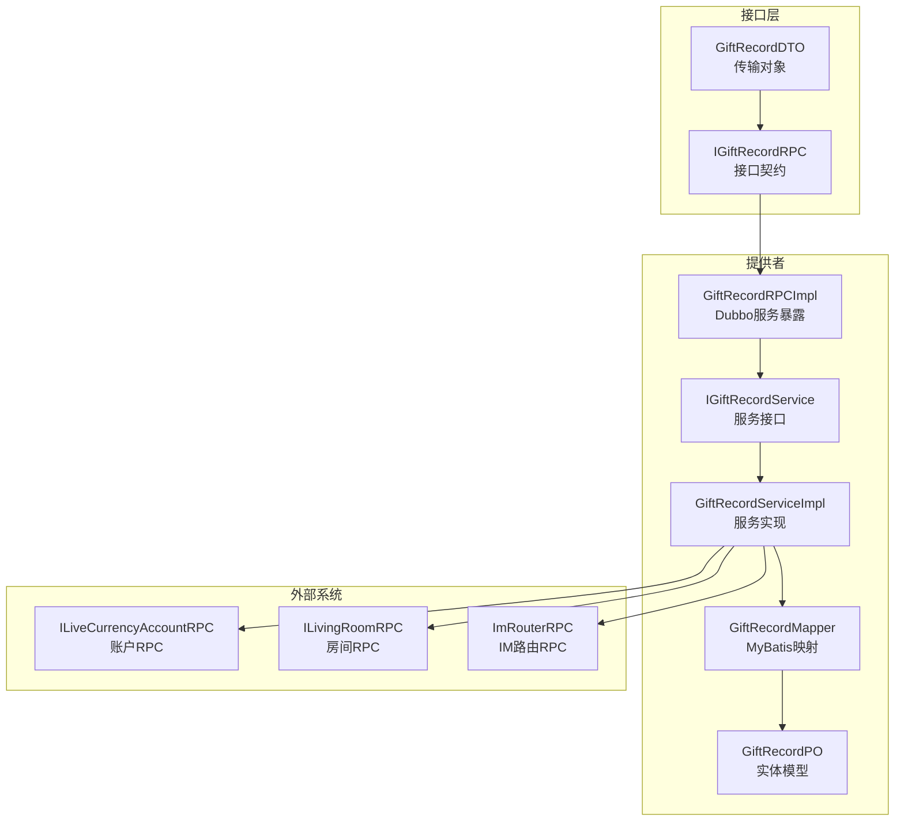
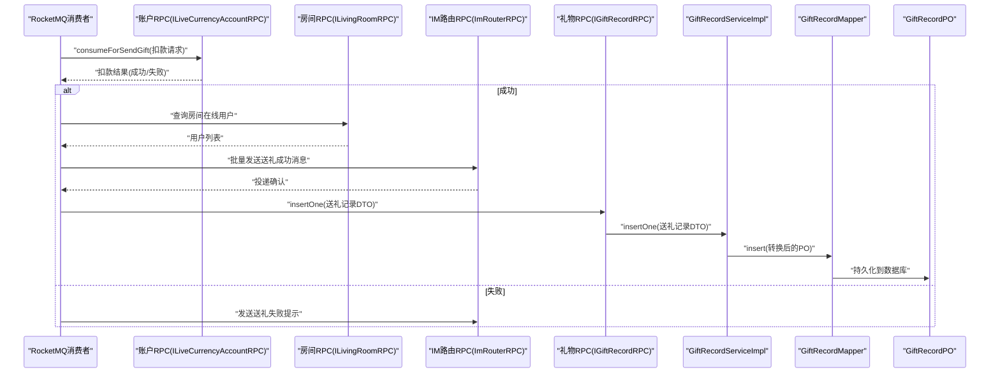
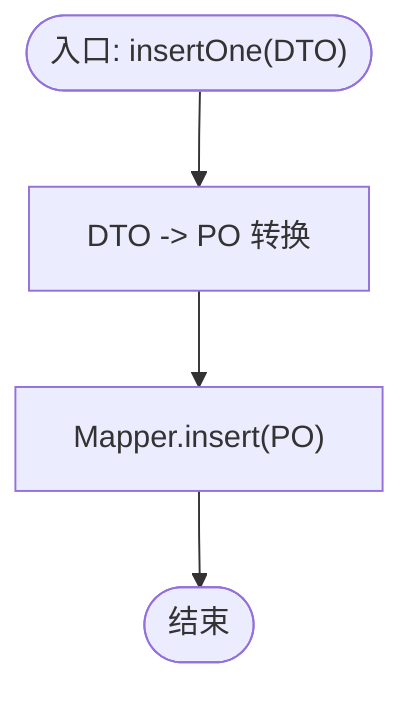
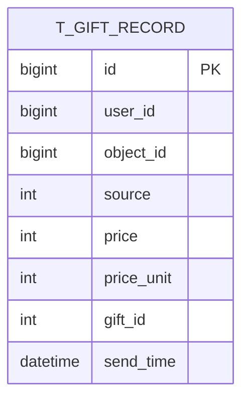
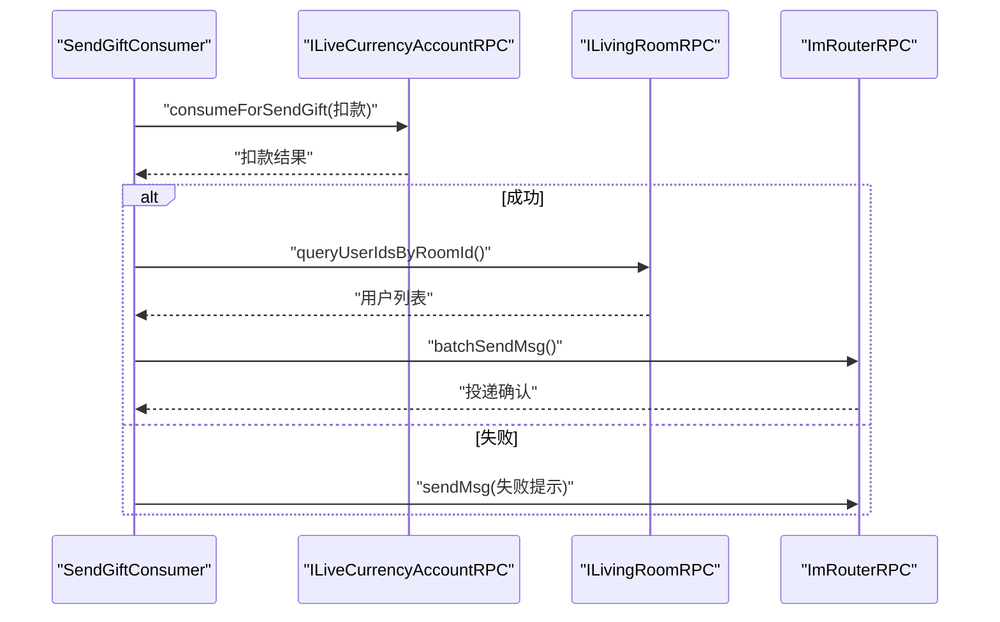
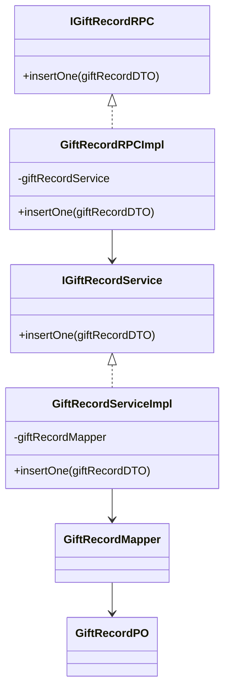

# 礼物记录服务

<cite>
**本文引用的文件**
- [IGiftRecordRPC.java](file://live-gift-interface/src/main/java/com/logilong/live/gift/interfaces/IGiftRecordRPC.java)
- [GiftRecordRPCImpl.java](file://live-gift-provider/src/main/java/com/logilong/live/gift/provider/rpc/GiftRecordRPCImpl.java)
- [IGiftRecordService.java](file://live-gift-provider/src/main/java/com/logilong/live/gift/provider/service/IGiftRecordService.java)
- [GiftRecordServiceImpl.java](file://live-gift-provider/src/main/java/com/logilong/live/gift/provider/service/impl/GiftRecordServiceImpl.java)
- [GiftRecordMapper.java](file://live-gift-provider/src/main/java/com/logilong/live/gift/provider/dao/mapper/GiftRecordMapper.java)
- [GiftRecordPO.java](file://live-gift-provider/src/main/java/com/logilong/live/gift/provider/dao/po/GiftRecordPO.java)
- [GiftRecordDTO.java](file://live-gift-interface/src/main/java/com/logilong/live/gift/dto/GiftRecordDTO.java)
- [SendGiftConsumer.java](file://live-gift-provider/src/main/java/com/logilong/live/gift/provider/consumer/SendGiftConsumer.java)
- [SendGiftTypeEnum.java](file://live-gift-interface/src/main/java/com/logilong/live/gift/constants/SendGiftTypeEnum.java)
- [SendGiftMq.java](file://live-common-interface/src/main/java/com/logilong/live/common/interfaces/dto/SendGiftMq.java)
- [LiveCurrencyAccountRPCImpl.java](file://live-bank-provider/src/main/java/com/logilong/live/bank/provider/rpc/LiveCurrencyAccountRPCImpl.java)
- [ILivingRoomRPC.java](file://live-living-interface/src/main/java/com/logilong/live/living/interfaces/rpc/ILivingRoomRPC.java)
- [ImRouterRPC.java](file://live-im-router-interface/src/main/java/com/logilong/live/im/router/interfaces/ImRouterRPC.java)
- [bootstrap.yml](file://live-gift-provider/src/main/resources/bootstrap.yml)
- [GiftProviderCacheKeyBuilder.java](file://live-framework/redis-starter/src/main/java/com/logilong/live/framework/redis/starter/key/GiftProviderCacheKeyBuilder.java)
</cite>

## 目录
1. [简介](#简介)
2. [项目结构](#项目结构)
3. [核心组件](#核心组件)
4. [架构总览](#架构总览)
5. [详细组件分析](#详细组件分析)
6. [依赖关系分析](#依赖关系分析)
7. [性能与扩展性](#性能与扩展性)
8. [故障排查指南](#故障排查指南)
9. [结论](#结论)
10. [附录](#附录)

## 简介
本文件系统性阐述礼物记录服务的设计与实现，聚焦用户送礼行为的数据持久化流程。内容覆盖：
- IGiftRecordRPC接口契约及跨服务调用职责
- GiftRecordRPCImpl的Dubbo服务暴露机制
- GiftRecordServiceImpl的创建与持久化逻辑
- 与账户系统、支付系统的协同处理
- 数据表结构与索引优化策略
- 大规模送礼记录存储的分库分表可行性探讨

## 项目结构
礼物记录服务位于独立模块中，采用“接口-提供者”分层设计：
- 接口层（live-gift-interface）定义RPC契约与DTO
- 提供者（live-gift-provider）实现RPC、服务与DAO层，负责数据持久化与业务编排

图表来源
- [IGiftRecordRPC.java](file://live-gift-interface/src/main/java/com/logilong/live/gift/interfaces/IGiftRecordRPC.java#L1-L12)
- [GiftRecordRPCImpl.java](file://live-gift-provider/src/main/java/com/logilong/live/gift/provider/rpc/GiftRecordRPCImpl.java#L1-L21)
- [IGiftRecordService.java](file://live-gift-provider/src/main/java/com/logilong/live/gift/provider/service/IGiftRecordService.java#L1-L16)
- [GiftRecordServiceImpl.java](file://live-gift-provider/src/main/java/com/logilong/live/gift/provider/service/impl/GiftRecordServiceImpl.java#L1-L24)
- [GiftRecordMapper.java](file://live-gift-provider/src/main/java/com/logilong/live/gift/provider/dao/mapper/GiftRecordMapper.java#L1-L11)
- [GiftRecordPO.java](file://live-gift-provider/src/main/java/com/logilong/live/gift/provider/dao/po/GiftRecordPO.java#L1-L25)
- [LiveCurrencyAccountRPCImpl.java](file://live-bank-provider/src/main/java/com/logilong/live/bank/provider/rpc/LiveCurrencyAccountRPCImpl.java#L39-L60)
- [ILivingRoomRPC.java](file://live-living-interface/src/main/java/com/logilong/live/living/interfaces/rpc/ILivingRoomRPC.java)
- [ImRouterRPC.java](file://live-im-router-interface/src/main/java/com/logilong/live/im/router/interfaces/ImRouterRPC.java)

章节来源
- [bootstrap.yml](file://live-gift-provider/src/main/resources/bootstrap.yml#L1-L22)

## 核心组件
- IGiftRecordRPC：定义送礼记录插入的RPC接口，作为对外契约
- GiftRecordRPCImpl：通过Dubbo注解暴露服务，转发调用至服务层
- IGiftRecordService/GiftRecordServiceImpl：完成DTO转PO与持久化
- GiftRecordMapper/GiftRecordPO：MyBatis映射与实体模型
- SendGiftConsumer：接收MQ消息，协调账户扣款、房间与IM通知，最终触发送礼记录写入

章节来源
- [IGiftRecordRPC.java](file://live-gift-interface/src/main/java/com/logilong/live/gift/interfaces/IGiftRecordRPC.java#L1-L12)
- [GiftRecordRPCImpl.java](file://live-gift-provider/src/main/java/com/logilong/live/gift/provider/rpc/GiftRecordRPCImpl.java#L1-L21)
- [IGiftRecordService.java](file://live-gift-provider/src/main/java/com/logilong/live/gift/provider/service/IGiftRecordService.java#L1-L16)
- [GiftRecordServiceImpl.java](file://live-gift-provider/src/main/java/com/logilong/live/gift/provider/service/impl/GiftRecordServiceImpl.java#L1-L24)
- [GiftRecordMapper.java](file://live-gift-provider/src/main/java/com/logilong/live/gift/provider/dao/mapper/GiftRecordMapper.java#L1-L11)
- [GiftRecordPO.java](file://live-gift-provider/src/main/java/com/logilong/live/gift/provider/dao/po/GiftRecordPO.java#L1-L25)

## 架构总览
用户送礼的端到端流程如下：
- MQ消费者接收送礼事件
- 调用账户RPC进行余额扣减
- 成功后根据送礼类型向房间内用户广播IM消息
- 最终调用礼物RPC写入送礼记录

图表来源
- [SendGiftConsumer.java](file://live-gift-provider/src/main/java/com/logilong/live/gift/provider/consumer/SendGiftConsumer.java#L1-L212)
- [LiveCurrencyAccountRPCImpl.java](file://live-bank-provider/src/main/java/com/logilong/live/bank/provider/rpc/LiveCurrencyAccountRPCImpl.java#L39-L60)
- [ILivingRoomRPC.java](file://live-living-interface/src/main/java/com/logilong/live/living/interfaces/rpc/ILivingRoomRPC.java)
- [ImRouterRPC.java](file://live-im-router-interface/src/main/java/com/logilong/live/im/router/interfaces/ImRouterRPC.java)
- [IGiftRecordRPC.java](file://live-gift-interface/src/main/java/com/logilong/live/gift/interfaces/IGiftRecordRPC.java#L1-L12)
- [GiftRecordServiceImpl.java](file://live-gift-provider/src/main/java/com/logilong/live/gift/provider/service/impl/GiftRecordServiceImpl.java#L1-L24)
- [GiftRecordMapper.java](file://live-gift-provider/src/main/java/com/logilong/live/gift/provider/dao/mapper/GiftRecordMapper.java#L1-L11)
- [GiftRecordPO.java](file://live-gift-provider/src/main/java/com/logilong/live/gift/provider/dao/po/GiftRecordPO.java#L1-L25)

## 详细组件分析

### IGiftRecordRPC接口契约与跨服务调用
- 契约定义：提供一个插入送礼记录的方法，参数为DTO，返回void
- 使用场景：由MQ消费者在扣款成功后调用，确保送礼记录与扣款动作的原子性
- 优点：接口简单、职责单一，便于测试与替换实现

章节来源
- [IGiftRecordRPC.java](file://live-gift-interface/src/main/java/com/logilong/live/gift/interfaces/IGiftRecordRPC.java#L1-L12)

### GiftRecordRPCImpl的Dubbo服务暴露机制
- 通过Dubbo注解暴露服务，自动注册到注册中心
- 内部仅委派给服务层，保持轻量与可替换性
- 配置由提供者侧的引导文件管理

章节来源
- [GiftRecordRPCImpl.java](file://live-gift-provider/src/main/java/com/logilong/live/gift/provider/rpc/GiftRecordRPCImpl.java#L1-L21)
- [bootstrap.yml](file://live-gift-provider/src/main/resources/bootstrap.yml#L1-L22)

### GiftRecordServiceImpl：创建与持久化逻辑
- 将DTO转换为PO，再调用Mapper执行插入
- 采用Spring注解声明为服务，便于依赖注入与事务控制
- 与ConvertBeanUtils配合，减少样板代码

图表来源
- [GiftRecordServiceImpl.java](file://live-gift-provider/src/main/java/com/logilong/live/gift/provider/service/impl/GiftRecordServiceImpl.java#L1-L24)
- [GiftRecordMapper.java](file://live-gift-provider/src/main/java/com/logilong/live/gift/provider/dao/mapper/GiftRecordMapper.java#L1-L11)
- [GiftRecordPO.java](file://live-gift-provider/src/main/java/com/logilong/live/gift/provider/dao/po/GiftRecordPO.java#L1-L25)

章节来源
- [GiftRecordServiceImpl.java](file://live-gift-provider/src/main/java/com/logilong/live/gift/provider/service/impl/GiftRecordServiceImpl.java#L1-L24)

### 数据模型与DAO层
- 实体类GiftRecordPO映射数据库表t_gift_record，包含主键、用户ID、对象ID、来源、价格、价格单位、礼物ID、发送时间等字段
- Mapper继承MyBatis-Plus的BaseMapper，提供通用CRUD能力
- DTO与PO字段基本一致，便于转换

图表来源
- [GiftRecordPO.java](file://live-gift-provider/src/main/java/com/logilong/live/gift/provider/dao/po/GiftRecordPO.java#L1-L25)
- [GiftRecordMapper.java](file://live-gift-provider/src/main/java/com/logilong/live/gift/provider/dao/mapper/GiftRecordMapper.java#L1-L11)

章节来源
- [GiftRecordPO.java](file://live-gift-provider/src/main/java/com/logilong/live/gift/provider/dao/po/GiftRecordPO.java#L1-L25)
- [GiftRecordMapper.java](file://live-gift-provider/src/main/java/com/logilong/live/gift/provider/dao/mapper/GiftRecordMapper.java#L1-L11)
- [GiftRecordDTO.java](file://live-gift-interface/src/main/java/com/logilong/live/gift/dto/GiftRecordDTO.java#L1-L24)

### 与账户系统、支付系统的协同
- MQ消费者在扣款成功后，按送礼类型分别处理：
  - 默认送礼：向房间内所有用户广播送礼成功消息
  - PK送礼：维护PK进度并判定胜负，同时广播PK相关消息
- 账户RPC提供扣款与余额查询能力；房间RPC用于查询在线用户；IM路由RPC用于消息投递

图表来源
- [SendGiftConsumer.java](file://live-gift-provider/src/main/java/com/logilong/live/gift/provider/consumer/SendGiftConsumer.java#L1-L212)
- [LiveCurrencyAccountRPCImpl.java](file://live-bank-provider/src/main/java/com/logilong/live/bank/provider/rpc/LiveCurrencyAccountRPCImpl.java#L39-L60)
- [ILivingRoomRPC.java](file://live-living-interface/src/main/java/com/logilong/live/living/interfaces/rpc/ILivingRoomRPC.java)
- [ImRouterRPC.java](file://live-im-router-interface/src/main/java/com/logilong/live/im/router/interfaces/ImRouterRPC.java)

章节来源
- [SendGiftConsumer.java](file://live-gift-provider/src/main/java/com/logilong/live/gift/provider/consumer/SendGiftConsumer.java#L1-L212)
- [SendGiftTypeEnum.java](file://live-gift-interface/src/main/java/com/logilong/live/gift/constants/SendGiftTypeEnum.java#L1-L18)
- [SendGiftMq.java](file://live-common-interface/src/main/java/com/logilong/live/common/interfaces/dto/SendGiftMq.java#L1-L17)

## 依赖关系分析
- 接口层与提供者层通过RPC契约解耦
- 提供者内部通过服务层与DAO层解耦
- MQ消费者依赖账户、房间与IM路由RPC，形成跨服务协作
- 缓存键构建器统一管理缓存键命名，避免硬编码

图表来源
- [IGiftRecordRPC.java](file://live-gift-interface/src/main/java/com/logilong/live/gift/interfaces/IGiftRecordRPC.java#L1-L12)
- [GiftRecordRPCImpl.java](file://live-gift-provider/src/main/java/com/logilong/live/gift/provider/rpc/GiftRecordRPCImpl.java#L1-L21)
- [IGiftRecordService.java](file://live-gift-provider/src/main/java/com/logilong/live/gift/provider/service/IGiftRecordService.java#L1-L16)
- [GiftRecordServiceImpl.java](file://live-gift-provider/src/main/java/com/logilong/live/gift/provider/service/impl/GiftRecordServiceImpl.java#L1-L24)
- [GiftRecordMapper.java](file://live-gift-provider/src/main/java/com/logilong/live/gift/provider/dao/mapper/GiftRecordMapper.java#L1-L11)
- [GiftRecordPO.java](file://live-gift-provider/src/main/java/com/logilong/live/gift/provider/dao/po/GiftRecordPO.java#L1-L25)

章节来源
- [GiftProviderCacheKeyBuilder.java](file://live-framework/redis-starter/src/main/java/com/logilong/live/framework/redis/starter/key/GiftProviderCacheKeyBuilder.java#L54-L88)

## 性能与扩展性
- 数据持久化路径短且稳定：DTO -> PO -> Mapper.insert，无复杂业务逻辑，具备良好吞吐能力
- 跨服务调用顺序明确：先扣款，再通知，最后落库，避免重复写入
- 缓存与异步处理：
  - 账户系统采用Redis缓存与异步线程池处理DB变更，满足高并发下的最终一致性
  - MQ消费者使用Redis分布式锁避免重复消费
- 分库分表可行性评估：
  - 表结构字段丰富，适合按时间或用户维度进行分片
  - 建议以send_time或user_id作为分片键，结合复合索引优化查询
  - 若未来需要全局统计，可在分片基础上引入汇总层或宽表

章节来源
- [SendGiftConsumer.java](file://live-gift-provider/src/main/java/com/logilong/live/gift/provider/consumer/SendGiftConsumer.java#L1-L212)
- [LiveCurrencyAccountRPCImpl.java](file://live-bank-provider/src/main/java/com/logilong/live/bank/provider/rpc/LiveCurrencyAccountRPCImpl.java#L39-L60)

## 故障排查指南
- RPC调用失败
  - 检查注册中心连通性与命名空间配置
  - 核对服务版本与接口签名是否匹配
- 账户扣款异常
  - 查看账户RPC返回状态与错误码
  - 关注异步DB处理线程池是否正常
- MQ重复消费
  - 检查Redis分布式锁是否正确设置与释放
  - 校验消息UUID去重逻辑
- IM消息未送达
  - 确认房间用户列表查询是否成功
  - 校验IM路由RPC的bizCode与消息体格式

章节来源
- [SendGiftConsumer.java](file://live-gift-provider/src/main/java/com/logilong/live/gift/provider/consumer/SendGiftConsumer.java#L1-L212)
- [LiveCurrencyAccountRPCImpl.java](file://live-bank-provider/src/main/java/com/logilong/live/bank/provider/rpc/LiveCurrencyAccountRPCImpl.java#L39-L60)

## 结论
礼物记录服务通过清晰的接口契约与分层实现，将送礼记录的创建与持久化置于稳定的流水线上。配合账户系统与IM系统的协同，实现了从扣款到通知再到落库的完整闭环。当前实现简洁高效，具备良好的扩展性与可维护性；面向大规模数据时，建议结合时间或用户维度进行分片，并完善索引与汇总策略。

## 附录
- 关键字段说明
  - user_id：送礼用户ID
  - object_id：接收对象ID（如主播或PK对手）
  - gift_id：礼物配置ID
  - price/price_unit：价格与计价单位
  - source：来源标识
  - send_time：送礼时间
- 建议索引
  - 唯一键：(user_id, send_time) 或 (object_id, send_time)
  - 范围查询：send_time
  - 统计查询：gift_id + send_time