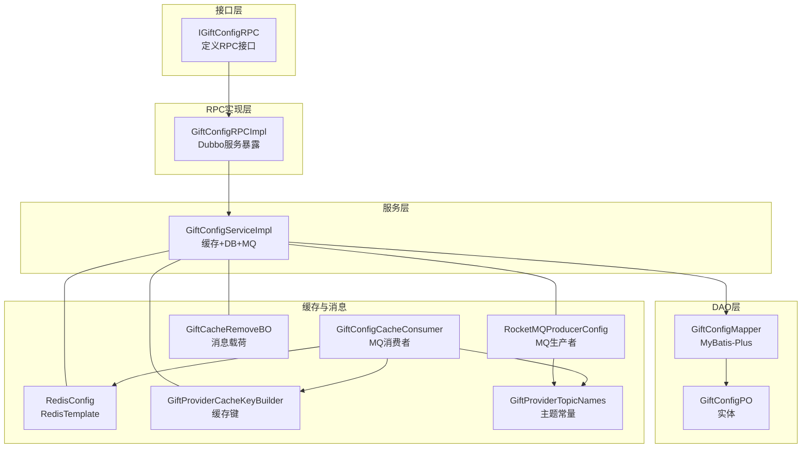
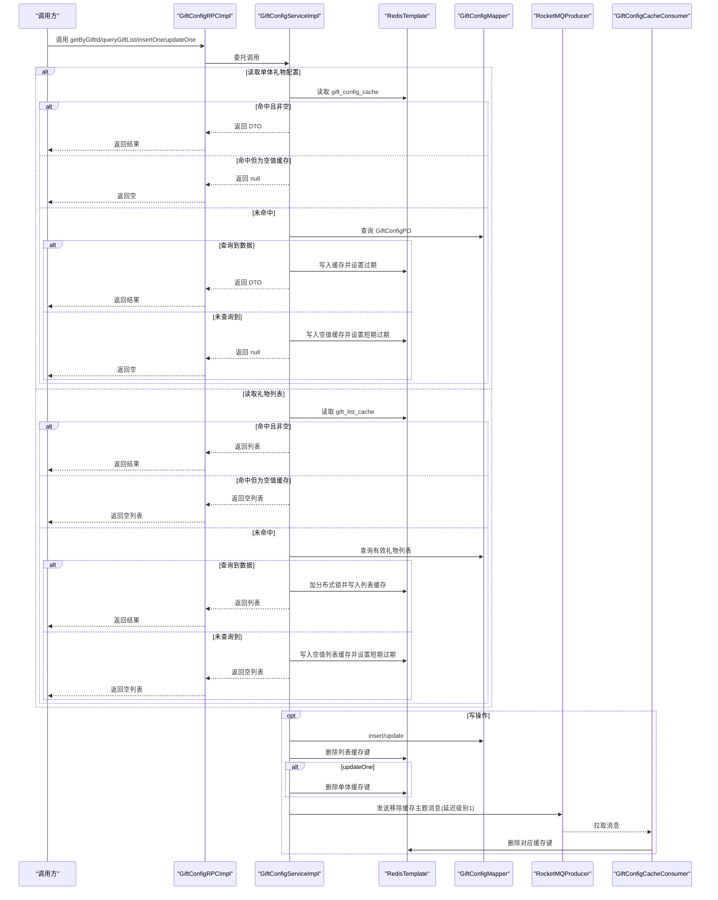
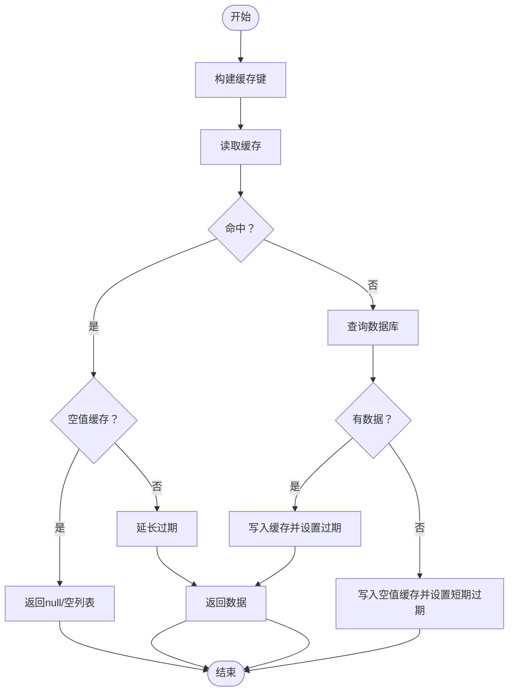
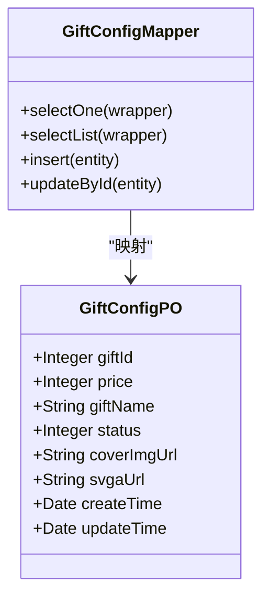
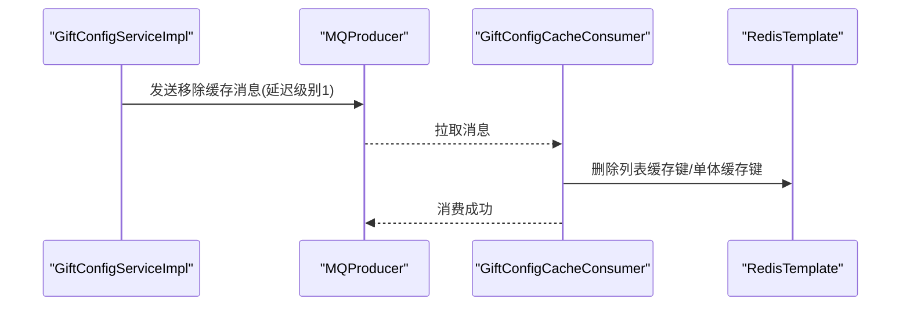
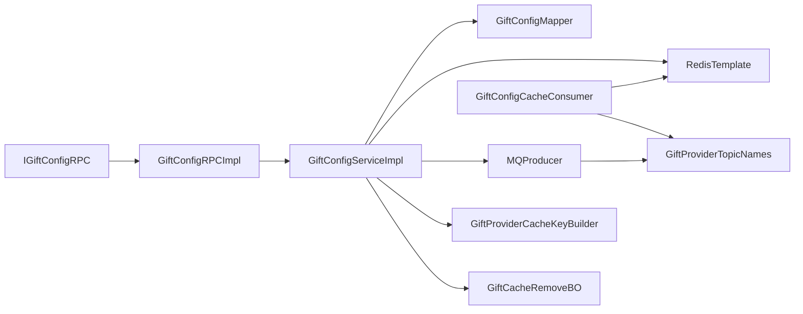

# 礼物配置服务

<cite>
**本文引用的文件**
- [IGiftConfigRPC.java](file://live-gift-interface/src/main/java/com/logilong/live/gift/interfaces/IGiftConfigRPC.java)
- [GiftConfigRPCImpl.java](file://live-gift-provider/src/main/java/com/logilong/live/gift/provider/rpc/GiftConfigRPCImpl.java)
- [IGiftConfigService.java](file://live-gift-provider/src/main/java/com/logilong/live/gift/provider/service/IGiftConfigService.java)
- [GiftConfigServiceImpl.java](file://live-gift-provider/src/main/java/com/logilong/live/gift/provider/service/impl/GiftConfigServiceImpl.java)
- [GiftConfigMapper.java](file://live-gift-provider/src/main/java/com/logilong/live/gift/dao/mapper/GiftConfigMapper.java)
- [GiftConfigPO.java](file://live-gift-provider/src/main/java/com/logilong/live/gift/provider/dao/po/GiftConfigPO.java)
- [GiftConfigDTO.java](file://live-gift-interface/src/main/java/com/logilong/live/gift/dto/GiftConfigDTO.java)
- [GiftProviderCacheKeyBuilder.java](file://live-framework/live-framework-redis-starter/src/main/java/com/logilong/live/framework/redis/starter/key/GiftProviderCacheKeyBuilder.java)
- [RedisConfig.java](file://live-framework/live-framework-redis-starter/src/main/java/com/logilong/live/framework/redis/starter/config/RedisConfig.java)
- [RocketMQProducerConfig.java](file://live-framework/live-framework-mq-starter/src/main/java/com/logilong/live/framework/mq/starter/producer/RocketMQProducerConfig.java)
- [GiftConfigCacheConsumer.java](file://live-gift-provider/src/main/java/com/logilong/live/gift/provider/consumer/GiftConfigCacheConsumer.java)
- [GiftProviderTopicNames.java](file://live-common-interface/src/main/java/com/logilong/live/common/interfaces/topic/GiftProviderTopicNames.java)
- [GiftCacheRemoveBO.java](file://live-gift-provider/src/main/java/com/logilong/live/gift/provider/service/bo/GiftCacheRemoveBO.java)
- [bootstrap.yml](file://live-gift-provider/src/main/resources/bootstrap.yml)
</cite>

## 目录
1. [简介](#简介)
2. [项目结构](#项目结构)
3. [核心组件](#核心组件)
4. [架构总览](#架构总览)
5. [详细组件分析](#详细组件分析)
6. [依赖关系分析](#依赖关系分析)
7. [性能考量与调优建议](#性能考量与调优建议)
8. [故障排查指南](#故障排查指南)
9. [结论](#结论)

## 简介
本文件系统性阐述礼物配置服务的实现机制，覆盖以下关键点：
- 接口定义：IGiftConfigRPC 的 getByGiftId、queryGiftList、insertOne、updateOne 四个核心方法。
- 服务暴露：GiftConfigRPCImpl 如何通过 Dubbo 暴露 RPC 服务。
- 缓存策略：GiftConfigServiceImpl 基于 Redis 的单体缓存与列表缓存，以及空值防穿透设计。
- 缓存一致性：通过 RocketMQ 异步清理缓存，保证写后读一致性。
- 数据访问：GiftConfigMapper 与 MyBatis-Plus 集成，DAO 层实现。
- 高并发优化：在缓存、MQ、Redis 序列化与连接池等方面的调优建议。

## 项目结构
礼物配置服务位于独立的服务模块中，采用“接口-实现-DAO-缓存-消息”的分层组织：
- 接口层：IGiftConfigRPC 定义对外 RPC 能力。
- RPC 实现层：GiftConfigRPCImpl 将接口委托给服务层。
- 服务层：GiftConfigServiceImpl 实现业务逻辑与缓存控制。
- DAO 层：GiftConfigMapper 继承 MyBatis-Plus 的 BaseMapper，访问 t_gift_config 表。
- 缓存与消息：RedisConfig 提供 RedisTemplate；RocketMQProducerConfig 提供 MQ 生产者；GiftConfigCacheConsumer 订阅移除缓存主题。
- 工具与常量：GiftProviderCacheKeyBuilder 构建缓存键；GiftProviderTopicNames 定义 MQ 主题；GiftCacheRemoveBO 作为消息载荷。

图表来源
- [IGiftConfigRPC.java](file://live-gift-interface/src/main/java/com/logilong/live/gift/interfaces/IGiftConfigRPC.java#L1-L29)
- [GiftConfigRPCImpl.java](file://live-gift-provider/src/main/java/com/logilong/live/gift/provider/rpc/GiftConfigRPCImpl.java#L1-L37)
- [GiftConfigServiceImpl.java](file://live-gift-provider/src/main/java/com/logilong/live/gift/provider/service/impl/GiftConfigServiceImpl.java#L1-L154)
- [GiftConfigMapper.java](file://live-gift-provider/src/main/java/com/logilong/live/gift/dao/mapper/GiftConfigMapper.java#L1-L10)
- [GiftConfigPO.java](file://live-gift-provider/src/main/java/com/logilong/live/gift/provider/dao/po/GiftConfigPO.java#L1-L25)
- [RedisConfig.java](file://live-framework/live-framework-redis-starter/src/main/java/com/logilong/live/framework/redis/starter/config/RedisConfig.java#L1-L28)
- [GiftProviderCacheKeyBuilder.java](file://live-framework/live-framework-redis-starter/src/main/java/com/logilong/live/framework/redis/starter/key/GiftProviderCacheKeyBuilder.java#L1-L89)
- [RocketMQProducerConfig.java](file://live-framework/live-framework-mq-starter/src/main/java/com/logilong/live/framework/mq/starter/producer/RocketMQProducerConfig.java#L1-L53)
- [GiftConfigCacheConsumer.java](file://live-gift-provider/src/main/java/com/logilong/live/gift/provider/consumer/GiftConfigCacheConsumer.java#L1-L64)
- [GiftProviderTopicNames.java](file://live-common-interface/src/main/java/com/logilong/live/common/interfaces/topic/GiftProviderTopicNames.java#L1-L21)
- [GiftCacheRemoveBO.java](file://live-gift-provider/src/main/java/com/logilong/live/gift/provider/service/bo/GiftCacheRemoveBO.java#L1-L11)

章节来源
- [IGiftConfigRPC.java](file://live-gift-interface/src/main/java/com/logilong/live/gift/interfaces/IGiftConfigRPC.java#L1-L29)
- [GiftConfigRPCImpl.java](file://live-gift-provider/src/main/java/com/logilong/live/gift/provider/rpc/GiftConfigRPCImpl.java#L1-L37)
- [GiftConfigServiceImpl.java](file://live-gift-provider/src/main/java/com/logilong/live/gift/provider/service/impl/GiftConfigServiceImpl.java#L1-L154)
- [GiftConfigMapper.java](file://live-gift-provider/src/main/java/com/logilong/live/gift/dao/mapper/GiftConfigMapper.java#L1-L10)
- [GiftConfigPO.java](file://live-gift-provider/src/main/java/com/logilong/live/gift/provider/dao/po/GiftConfigPO.java#L1-L25)
- [GiftProviderCacheKeyBuilder.java](file://live-framework/live-framework-redis-starter/src/main/java/com/logilong/live/framework/redis/starter/key/GiftProviderCacheKeyBuilder.java#L1-L89)
- [RedisConfig.java](file://live-framework/live-framework-redis-starter/src/main/java/com/logilong/live/framework/redis/starter/config/RedisConfig.java#L1-L28)
- [RocketMQProducerConfig.java](file://live-framework/live-framework-mq-starter/src/main/java/com/logilong/live/framework/mq/starter/producer/RocketMQProducerConfig.java#L1-L53)
- [GiftConfigCacheConsumer.java](file://live-gift-provider/src/main/java/com/logilong/live/gift/provider/consumer/GiftConfigCacheConsumer.java#L1-L64)
- [GiftProviderTopicNames.java](file://live-common-interface/src/main/java/com/logilong/live/common/interfaces/topic/GiftProviderTopicNames.java#L1-L21)
- [GiftCacheRemoveBO.java](file://live-gift-provider/src/main/java/com/logilong/live/gift/provider/service/bo/GiftCacheRemoveBO.java#L1-L11)
- [bootstrap.yml](file://live-gift-provider/src/main/resources/bootstrap.yml#L1-L22)

## 核心组件
- IGiftConfigRPC：定义 RPC 接口，包含按 ID 查询、查询全部、新增、更新四个方法。
- GiftConfigRPCImpl：使用 @DubboService 注解暴露服务，内部委托给 IGiftConfigService。
- GiftConfigServiceImpl：实现缓存读取、空值防穿透、列表缓存、写后异步清理缓存、MQ 延迟消息发送。
- GiftConfigMapper：继承 MyBatis-Plus BaseMapper，访问 t_gift_config 表。
- RedisConfig：提供 RedisTemplate，统一序列化策略。
- GiftProviderCacheKeyBuilder：构建礼物配置与列表缓存键、锁键等。
- RocketMQProducerConfig：提供 MQ 生产者 Bean，支持异步发送与线程池。
- GiftConfigCacheConsumer：订阅移除礼物缓存主题，执行实际删除操作。
- GiftProviderTopicNames：定义 MQ 主题常量。
- GiftCacheRemoveBO：MQ 消息载荷，携带是否删除列表缓存与具体礼物ID。
- GiftConfigDTO/PO：传输对象与持久化对象，字段对应 t_gift_config 表。

章节来源
- [IGiftConfigRPC.java](file://live-gift-interface/src/main/java/com/logilong/live/gift/interfaces/IGiftConfigRPC.java#L1-L29)
- [GiftConfigRPCImpl.java](file://live-gift-provider/src/main/java/com/logilong/live/gift/provider/rpc/GiftConfigRPCImpl.java#L1-L37)
- [GiftConfigServiceImpl.java](file://live-gift-provider/src/main/java/com/logilong/live/gift/provider/service/impl/GiftConfigServiceImpl.java#L1-L154)
- [GiftConfigMapper.java](file://live-gift-provider/src/main/java/com/logilong/live/gift/dao/mapper/GiftConfigMapper.java#L1-L10)
- [GiftConfigPO.java](file://live-gift-provider/src/main/java/com/logilong/live/gift/provider/dao/po/GiftConfigPO.java#L1-L25)
- [GiftConfigDTO.java](file://live-gift-interface/src/main/java/com/logilong/live/gift/dto/GiftConfigDTO.java#L1-L25)
- [RedisConfig.java](file://live-framework/live-framework-redis-starter/src/main/java/com/logilong/live/framework/redis/starter/config/RedisConfig.java#L1-L28)
- [GiftProviderCacheKeyBuilder.java](file://live-framework/live-framework-redis-starter/src/main/java/com/logilong/live/framework/redis/starter/key/GiftProviderCacheKeyBuilder.java#L1-L89)
- [RocketMQProducerConfig.java](file://live-framework/live-framework-mq-starter/src/main/java/com/logilong/live/framework/mq/starter/producer/RocketMQProducerConfig.java#L1-L53)
- [GiftConfigCacheConsumer.java](file://live-gift-provider/src/main/java/com/logilong/live/gift/provider/consumer/GiftConfigCacheConsumer.java#L1-L64)
- [GiftProviderTopicNames.java](file://live-common-interface/src/main/java/com/logilong/live/common/interfaces/topic/GiftProviderTopicNames.java#L1-L21)
- [GiftCacheRemoveBO.java](file://live-gift-provider/src/main/java/com/logilong/live/gift/provider/service/bo/GiftCacheRemoveBO.java#L1-L11)

## 架构总览
整体采用“接口-实现-服务-DAO-缓存-消息”分层，RPC 通过 Dubbo 暴露，服务层负责缓存与 MQ 协同，DAO 层基于 MyBatis-Plus 访问数据库。

图表来源
- [GiftConfigRPCImpl.java](file://live-gift-provider/src/main/java/com/logilong/live/gift/provider/rpc/GiftConfigRPCImpl.java#L1-L37)
- [GiftConfigServiceImpl.java](file://live-gift-provider/src/main/java/com/logilong/live/gift/provider/service/impl/GiftConfigServiceImpl.java#L1-L154)
- [GiftConfigMapper.java](file://live-gift-provider/src/main/java/com/logilong/live/gift/dao/mapper/GiftConfigMapper.java#L1-L10)
- [GiftProviderCacheKeyBuilder.java](file://live-framework/live-framework-redis-starter/src/main/java/com/logilong/live/framework/redis/starter/key/GiftProviderCacheKeyBuilder.java#L1-L89)
- [RocketMQProducerConfig.java](file://live-framework/live-framework-mq-starter/src/main/java/com/logilong/live/framework/mq/starter/producer/RocketMQProducerConfig.java#L1-L53)
- [GiftConfigCacheConsumer.java](file://live-gift-provider/src/main/java/com/logilong/live/gift/provider/consumer/GiftConfigCacheConsumer.java#L1-L64)
- [GiftProviderTopicNames.java](file://live-common-interface/src/main/java/com/logilong/live/common/interfaces/topic/GiftProviderTopicNames.java#L1-L21)

## 详细组件分析

### 接口与RPC实现
- IGiftConfigRPC：定义 getByGiftId、queryGiftList、insertOne、updateOne 四个方法，用于礼物配置的查询与变更。
- GiftConfigRPCImpl：使用 @DubboService 暴露服务，内部仅做方法转发至 IGiftConfigService，职责清晰、轻薄。

章节来源
- [IGiftConfigRPC.java](file://live-gift-interface/src/main/java/com/logilong/live/gift/interfaces/IGiftConfigRPC.java#L1-L29)
- [GiftConfigRPCImpl.java](file://live-gift-provider/src/main/java/com/logilong/live/gift/provider/rpc/GiftConfigRPCImpl.java#L1-L37)

### 服务层：缓存策略与空值防穿透
- 单体缓存（按 giftId）：
  - 读取：先查 Redis，命中则延长过期时间并返回；若命中空值缓存则直接返回 null。
  - 未命中：查询数据库，命中则写入 Redis 并设置较长过期；未命中则写入空值缓存并设置短期过期，防止缓存穿透。
- 列表缓存（全量礼物）：
  - 读取：从 Redis 列表读取，命中则延长过期并返回；若命中空值列表则返回空列表。
  - 未命中：查询数据库，命中则加分布式锁（短超时）写入列表缓存并设置较长过期；未命中则写入空值列表缓存并设置短期过期。
- 写后清理：
  - insertOne：删除列表缓存键；构造移除缓存消息（延迟级别1）发送 MQ。
  - updateOne：删除列表缓存键与单体缓存键；构造移除缓存消息（延迟级别1）发送 MQ。
- MQ 消费端：
  - 订阅移除礼物缓存主题，根据消息载荷判断删除列表缓存或单体缓存键，实现最终一致性。

图表来源
- [GiftConfigServiceImpl.java](file://live-gift-provider/src/main/java/com/logilong/live/gift/provider/service/impl/GiftConfigServiceImpl.java#L43-L109)
- [GiftProviderCacheKeyBuilder.java](file://live-framework/live-framework-redis-starter/src/main/java/com/logilong/live/framework/redis/starter/key/GiftProviderCacheKeyBuilder.java#L73-L88)

章节来源
- [GiftConfigServiceImpl.java](file://live-gift-provider/src/main/java/com/logilong/live/gift/provider/service/impl/GiftConfigServiceImpl.java#L43-L151)
- [GiftProviderCacheKeyBuilder.java](file://live-framework/live-framework-redis-starter/src/main/java/com/logilong/live/framework/redis/starter/key/GiftProviderCacheKeyBuilder.java#L73-L88)

### 数据访问层：MyBatis-Plus 集成
- GiftConfigMapper 继承 BaseMapper，天然具备增删改查能力。
- GiftConfigPO 对应 t_gift_config 表，包含 giftId、price、giftName、status、coverImgUrl、svgaUrl、createTime、updateTime 等字段。
- 服务层通过 Mapper 执行条件查询（如按 giftId 与状态过滤），并进行插入与更新。

图表来源
- [GiftConfigMapper.java](file://live-gift-provider/src/main/java/com/logilong/live/gift/dao/mapper/GiftConfigMapper.java#L1-L10)
- [GiftConfigPO.java](file://live-gift-provider/src/main/java/com/logilong/live/gift/provider/dao/po/GiftConfigPO.java#L1-L25)

章节来源
- [GiftConfigMapper.java](file://live-gift-provider/src/main/java/com/logilong/live/gift/dao/mapper/GiftConfigMapper.java#L1-L10)
- [GiftConfigPO.java](file://live-gift-provider/src/main/java/com/logilong/live/gift/provider/dao/po/GiftConfigPO.java#L1-L25)

### 缓存与消息：Redis 与 RocketMQ
- Redis 配置：
  - RedisConfig 提供 RedisTemplate，统一使用字符串键与 JSON 值序列化，便于跨语言与可读性。
- 缓存键构建：
  - GiftProviderCacheKeyBuilder 提供 gift_config_cache、gift_list_cache、gift_list_lock 等键生成方法。
- MQ 生产者：
  - RocketMQProducerConfig 创建 DefaultMQProducer，配置名称服务器、重试次数、异步线程池等。
- MQ 消费者：
  - GiftConfigCacheConsumer 订阅移除礼物缓存主题，批量拉取消息并删除对应缓存键，实现最终一致。

图表来源
- [GiftConfigServiceImpl.java](file://live-gift-provider/src/main/java/com/logilong/live/gift/provider/service/impl/GiftConfigServiceImpl.java#L111-L151)
- [RocketMQProducerConfig.java](file://live-framework/live-framework-mq-starter/src/main/java/com/logilong/live/framework/mq/starter/producer/RocketMQProducerConfig.java#L1-L53)
- [GiftConfigCacheConsumer.java](file://live-gift-provider/src/main/java/com/logilong/live/gift/provider/consumer/GiftConfigCacheConsumer.java#L1-L64)
- [GiftProviderTopicNames.java](file://live-common-interface/src/main/java/com/logilong/live/common/interfaces/topic/GiftProviderTopicNames.java#L1-L21)
- [GiftCacheRemoveBO.java](file://live-gift-provider/src/main/java/com/logilong/live/gift/provider/service/bo/GiftCacheRemoveBO.java#L1-L11)

章节来源
- [RedisConfig.java](file://live-framework/live-framework-redis-starter/src/main/java/com/logilong/live/framework/redis/starter/config/RedisConfig.java#L1-L28)
- [GiftProviderCacheKeyBuilder.java](file://live-framework/live-framework-redis-starter/src/main/java/com/logilong/live/framework/redis/starter/key/GiftProviderCacheKeyBuilder.java#L1-L89)
- [RocketMQProducerConfig.java](file://live-framework/live-framework-mq-starter/src/main/java/com/logilong/live/framework/mq/starter/producer/RocketMQProducerConfig.java#L1-L53)
- [GiftConfigCacheConsumer.java](file://live-gift-provider/src/main/java/com/logilong/live/gift/provider/consumer/GiftConfigCacheConsumer.java#L1-L64)
- [GiftProviderTopicNames.java](file://live-common-interface/src/main/java/com/logilong/live/common/interfaces/topic/GiftProviderTopicNames.java#L1-L21)
- [GiftCacheRemoveBO.java](file://live-gift-provider/src/main/java/com/logilong/live/gift/provider/service/bo/GiftCacheRemoveBO.java#L1-L11)

## 依赖关系分析
- 接口与实现：
  - IGiftConfigRPC 与 GiftConfigRPCImpl 之间为接口-实现关系，RPC 层仅做转发。
- 服务与 DAO：
  - GiftConfigServiceImpl 依赖 GiftConfigMapper 进行数据库访问。
- 缓存与消息：
  - 服务层依赖 RedisTemplate、GiftProviderCacheKeyBuilder、RocketMQProducerConfig。
  - MQ 消费者依赖 RocketMQConsumerProperties、RedisTemplate、GiftProviderCacheKeyBuilder。
- 配置与环境：
  - bootstrap.yml 提供 Nacos 配置导入，服务注册与发现依赖 Nacos。

图表来源
- [IGiftConfigRPC.java](file://live-gift-interface/src/main/java/com/logilong/live/gift/interfaces/IGiftConfigRPC.java#L1-L29)
- [GiftConfigRPCImpl.java](file://live-gift-provider/src/main/java/com/logilong/live/gift/provider/rpc/GiftConfigRPCImpl.java#L1-L37)
- [GiftConfigServiceImpl.java](file://live-gift-provider/src/main/java/com/logilong/live/gift/provider/service/impl/GiftConfigServiceImpl.java#L1-L154)
- [GiftConfigMapper.java](file://live-gift-provider/src/main/java/com/logilong/live/gift/dao/mapper/GiftConfigMapper.java#L1-L10)
- [GiftProviderCacheKeyBuilder.java](file://live-framework/live-framework-redis-starter/src/main/java/com/logilong/live/framework/redis/starter/key/GiftProviderCacheKeyBuilder.java#L1-L89)
- [RocketMQProducerConfig.java](file://live-framework/live-framework-mq-starter/src/main/java/com/logilong/live/framework/mq/starter/producer/RocketMQProducerConfig.java#L1-L53)
- [GiftConfigCacheConsumer.java](file://live-gift-provider/src/main/java/com/logilong/live/gift/provider/consumer/GiftConfigCacheConsumer.java#L1-L64)
- [GiftProviderTopicNames.java](file://live-common-interface/src/main/java/com/logilong/live/common/interfaces/topic/GiftProviderTopicNames.java#L1-L21)
- [GiftCacheRemoveBO.java](file://live-gift-provider/src/main/java/com/logilong/live/gift/provider/service/bo/GiftCacheRemoveBO.java#L1-L11)

章节来源
- [IGiftConfigRPC.java](file://live-gift-interface/src/main/java/com/logilong/live/gift/interfaces/IGiftConfigRPC.java#L1-L29)
- [GiftConfigRPCImpl.java](file://live-gift-provider/src/main/java/com/logilong/live/gift/provider/rpc/GiftConfigRPCImpl.java#L1-L37)
- [GiftConfigServiceImpl.java](file://live-gift-provider/src/main/java/com/logilong/live/gift/provider/service/impl/GiftConfigServiceImpl.java#L1-L154)
- [GiftConfigMapper.java](file://live-gift-provider/src/main/java/com/logilong/live/gift/dao/mapper/GiftConfigMapper.java#L1-L10)
- [GiftProviderCacheKeyBuilder.java](file://live-framework/live-framework-redis-starter/src/main/java/com/logilong/live/framework/redis/starter/key/GiftProviderCacheKeyBuilder.java#L1-L89)
- [RocketMQProducerConfig.java](file://live-framework/live-framework-mq-starter/src/main/java/com/logilong/live/framework/mq/starter/producer/RocketMQProducerConfig.java#L1-L53)
- [GiftConfigCacheConsumer.java](file://live-gift-provider/src/main/java/com/logilong/live/gift/provider/consumer/GiftConfigCacheConsumer.java#L1-L64)
- [GiftProviderTopicNames.java](file://live-common-interface/src/main/java/com/logilong/live/common/interfaces/topic/GiftProviderTopicNames.java#L1-L21)
- [GiftCacheRemoveBO.java](file://live-gift-provider/src/main/java/com/logilong/live/gift/provider/service/bo/GiftCacheRemoveBO.java#L1-L11)

## 性能考量与调优建议
- 缓存命中率与过期策略
  - 单体缓存设置较长过期时间，列表缓存同样设置较长过期；空值缓存设置短期过期，降低缓存穿透风险。
  - 列表缓存写入时使用短超时的分布式锁，避免阻塞主流程。
- MQ 异步清理
  - 写操作后立即删除缓存键，同时发送延迟消息，确保最终一致性；延迟级别1可快速生效。
- Redis 序列化
  - 使用 JSON 序列化，便于调试与跨语言兼容；注意对象大小与序列化开销。
- 连接与线程池
  - RocketMQ 生产者线程池大小可根据 CPU 核数与消息吞吐量调整；合理设置队列长度与超时。
- 数据库访问
  - 条件查询添加状态过滤与 limit，减少无效扫描；批量写入列表缓存时注意 Redis 命令组合与网络往返。
- 并发与限流
  - 在网关或服务入口增加限流与熔断，避免突发流量冲击缓存与数据库。
- 监控与告警
  - 关注缓存命中率、MQ 延迟、数据库慢查询与 Redis 命中耗时指标，建立告警阈值。

[本节为通用性能建议，不直接分析具体文件，故无章节来源]

## 故障排查指南
- 缓存未命中或穿透
  - 检查 Redis 键是否正确构建（GiftProviderCacheKeyBuilder）；确认空值缓存策略是否生效。
  - 核对查询条件（状态、ID）是否与数据库一致。
- MQ 消息堆积
  - 检查 RocketMQProducerConfig 的线程池与重试配置；确认 GiftConfigCacheConsumer 是否正常启动并消费。
  - 查看 GiftConfigCacheConsumer 的日志输出，确认订阅主题与消费组配置。
- 写后读不一致
  - 确认 insertOne/updateOne 是否删除了列表缓存键与单体缓存键；检查 MQ 延迟级别与消费是否及时。
- Redis 序列化异常
  - 检查 RedisConfig 的序列化配置；确认 GiftCacheRemoveBO 字段与消息体一致。
- 配置加载问题
  - 检查 bootstrap.yml 中 Nacos 地址、命名空间与配置导入是否正确。

章节来源
- [GiftConfigServiceImpl.java](file://live-gift-provider/src/main/java/com/logilong/live/gift/provider/service/impl/GiftConfigServiceImpl.java#L111-L151)
- [GiftConfigCacheConsumer.java](file://live-gift-provider/src/main/java/com/logilong/live/gift/provider/consumer/GiftConfigCacheConsumer.java#L1-L64)
- [RocketMQProducerConfig.java](file://live-framework/live-framework-mq-starter/src/main/java/com/logilong/live/framework/mq/starter/producer/RocketMQProducerConfig.java#L1-L53)
- [RedisConfig.java](file://live-framework/live-framework-redis-starter/src/main/java/com/logilong/live/framework/redis/starter/config/RedisConfig.java#L1-L28)
- [bootstrap.yml](file://live-gift-provider/src/main/resources/bootstrap.yml#L1-L22)

## 结论
礼物配置服务通过清晰的分层设计与完善的缓存策略，实现了高可用与高性能的礼物配置管理。单体缓存与列表缓存配合空值防穿透，写后通过 RocketMQ 异步清理缓存，确保了强一致性的最终一致性。DAO 层基于 MyBatis-Plus，简化了数据库访问。在高并发场景下，建议进一步优化 MQ 线程池、Redis 序列化与连接参数，并完善监控与告警体系，以获得更稳健的运行表现。