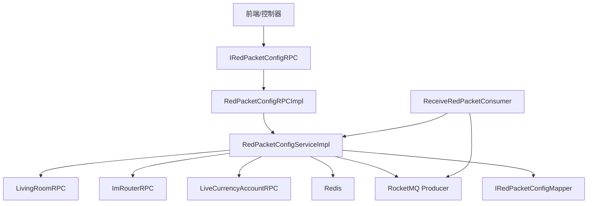
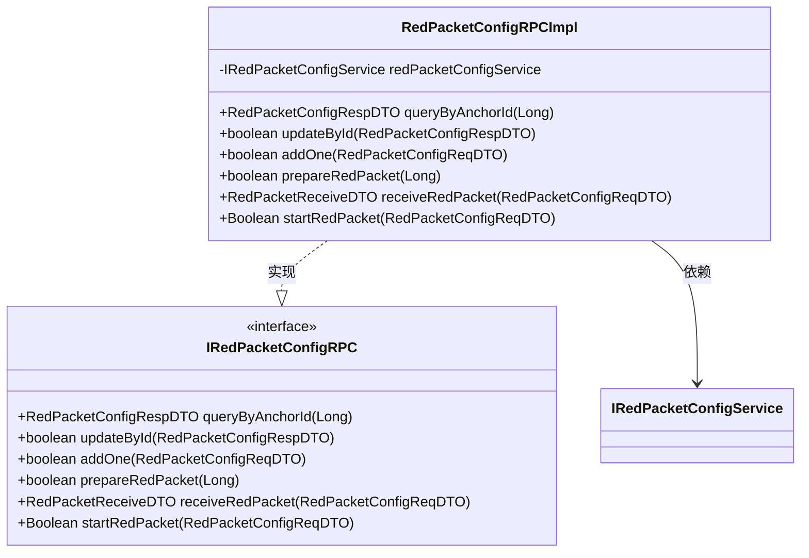
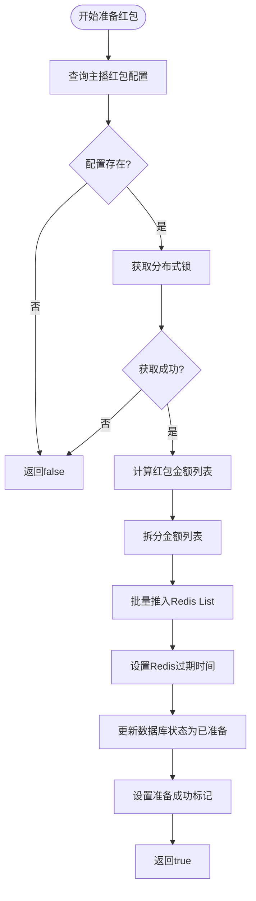
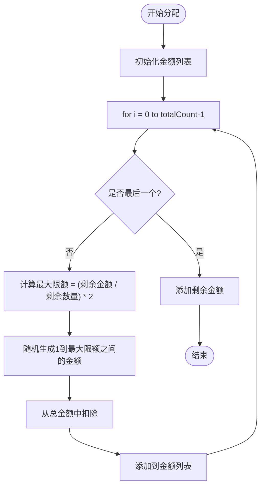
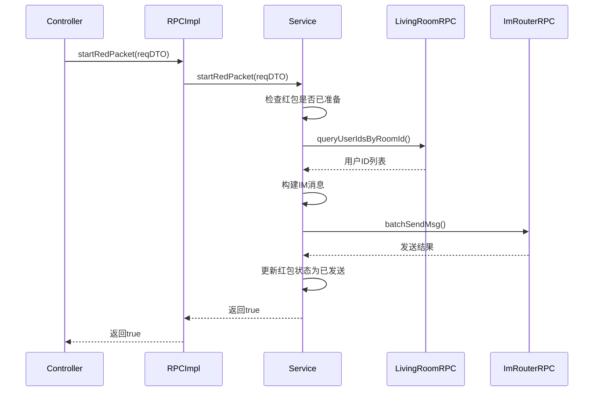
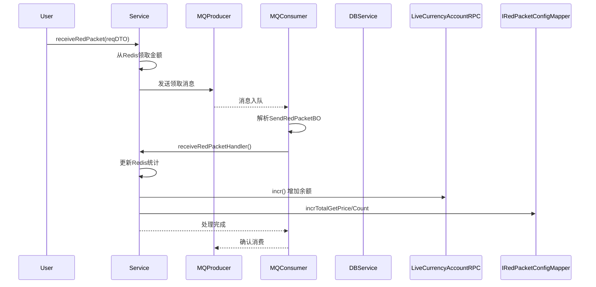
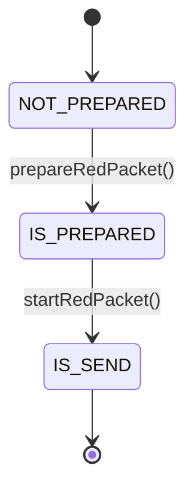

# 红包功能

<cite>
**本文档引用文件**  
- [IRedPacketConfigRPC.java](file://live-gift-interface/src/main/java/com/logilong/live/gift/interfaces/IRedPacketConfigRPC.java)
- [RedPacketConfigRPCImpl.java](file://live-gift-provider/src/main/java/com/logilong/live/gift/provider/rpc/RedPacketConfigRPCImpl.java)
- [RedPacketConfigServiceImpl.java](file://live-gift-provider/src/main/java/com/logilong/live/gift/provider/service/impl/RedPacketConfigServiceImpl.java)
- [ReceiveRedPacketConsumer.java](file://live-gift-provider/src/main/java/com/logilong/live/gift/provider/consumer/ReceiveRedPacketConsumer.java)
- [RedPacketConfigReqDTO.java](file://live-gift-interface/src/main/java/com/logilong/live/gift/dto/RedPacketConfigReqDTO.java)
- [RedPacketConfigRespDTO.java](file://live-gift-interface/src/main/java/com/logilong/live/gift/dto/RedPacketConfigRespDTO.java)
- [RedPacketReceiveDTO.java](file://live-gift-interface/src/main/java/com/logilong/live/gift/dto/RedPacketReceiveDTO.java)
- [SendRedPacketBO.java](file://live-gift-interface/src/main/java/com/logilong/live/gift/bo/SendRedPacketBO.java)
- [RedPacketStatusEnum.java](file://live-gift-interface/src/main/java/com/logilong/live/gift/constants/RedPacketStatusEnum.java)
- [IRedPacketConfigMapper.java](file://live-gift-provider/src/main/java/com/logilong/live/gift/provider/dao/mapper/IRedPacketConfigMapper.java)
- [RedPacketConfigPO.java](file://live-gift-provider/src/main/java/com/logilong/live/gift/provider/dao/po/RedPacketConfigPO.java)
- [GiftProviderCacheKeyBuilder.java](file://live-framework/live-framework-redis-starter/src/main/java/com/logilong/live/framework/redis/starter/key/GiftProviderCacheKeyBuilder.java)
</cite>

## 目录
1. [红包功能概述](#红包功能概述)
2. [核心组件与架构](#核心组件与架构)
3. [红包配置管理接口设计](#红包配置管理接口设计)
4. [红包配置RPC实现](#红包配置rpc实现)
5. [红包核心业务逻辑](#红包核心业务逻辑)
6. [异步领取处理机制](#异步领取处理机制)
7. [高并发场景下的控制策略](#高并发场景下的控制策略)
8. [数据结构与状态管理](#数据结构与状态管理)
9. [总结](#总结)

## 红包功能概述

红包功能是直播平台中用于增强用户互动的重要模块，支持主播发起“红包雨”活动，观众可在直播间内参与抢红包。该功能涵盖红包的配置、准备、发放、领取及过期处理等完整生命周期。系统采用分布式架构设计，结合Redis缓存、RocketMQ消息队列和Dubbo远程调用，确保高并发场景下的性能与一致性。

**Section sources**
- [IRedPacketConfigRPC.java](file://live-gift-interface/src/main/java/com/logilong/live/gift/interfaces/IRedPacketConfigRPC.java#L1-L39)
- [RedPacketConfigServiceImpl.java](file://live-gift-provider/src/main/java/com/logilong/live/gift/provider/service/impl/RedPacketConfigServiceImpl.java#L1-L239)

## 核心组件与架构

红包功能涉及多个核心组件，包括接口层、RPC实现层、服务层、DAO层、消费者和缓存构建器。整体架构遵循分层设计原则，各组件职责清晰，通过Dubbo进行服务调用，通过RocketMQ实现异步解耦。



**Diagram sources**
- [IRedPacketConfigRPC.java](file://live-gift-interface/src/main/java/com/logilong/live/gift/interfaces/IRedPacketConfigRPC.java#L1-L39)
- [RedPacketConfigRPCImpl.java](file://live-gift-provider/src/main/java/com/logilong/live/gift/provider/rpc/RedPacketConfigRPCImpl.java#L1-L49)
- [RedPacketConfigServiceImpl.java](file://live-gift-provider/src/main/java/com/logilong/live/gift/provider/service/impl/RedPacketConfigServiceImpl.java#L1-L239)
- [ReceiveRedPacketConsumer.java](file://live-gift-provider/src/main/java/com/logilong/live/gift/provider/consumer/ReceiveRedPacketConsumer.java#L1-L56)

## 红包配置管理接口设计

`IRedPacketConfigRPC` 接口定义了红包配置的核心操作，采用RPC远程调用方式供其他服务调用。接口设计遵循单一职责原则，每个方法对应一个明确的业务场景。

| 方法名 | 参数类型 | 返回类型 | 功能描述 |
|--------|--------|--------|--------|
| queryByAnchorId | Long | RedPacketConfigRespDTO | 根据主播ID查询红包配置 |
| updateById | RedPacketConfigRespDTO | boolean | 更新红包配置 |
| addOne | RedPacketConfigReqDTO | boolean | 新增红包配置 |
| prepareRedPacket | Long | boolean | 准备红包金额列表 |
| receiveRedPacket | RedPacketConfigReqDTO | RedPacketReceiveDTO | 用户领取红包 |
| startRedPacket | RedPacketConfigReqDTO | Boolean | 开始红包雨活动 |

**Section sources**
- [IRedPacketConfigRPC.java](file://live-gift-interface/src/main/java/com/logilong/live/gift/interfaces/IRedPacketConfigRPC.java#L1-L39)

## 红包配置RPC实现

`RedPacketConfigRPCImpl` 是 `IRedPacketConfigRPC` 接口的具体实现类，通过Dubbo暴露为远程服务。该类主要负责DTO与PO之间的转换，并调用底层服务完成业务逻辑。



**Diagram sources**
- [IRedPacketConfigRPC.java](file://live-gift-interface/src/main/java/com/logilong/live/gift/interfaces/IRedPacketConfigRPC.java#L1-L39)
- [RedPacketConfigRPCImpl.java](file://live-gift-provider/src/main/java/com/logilong/live/gift/provider/rpc/RedPacketConfigRPCImpl.java#L1-L49)

## 红包核心业务逻辑

`RedPacketConfigServiceImpl` 是红包功能的核心服务实现类，封装了红包的准备、发放、领取等关键逻辑。

### 红包准备流程

当主播配置红包后，系统调用 `prepareRedPacket` 方法准备红包金额列表。该方法使用“二倍均值法”算法分配金额，并将结果存储在Redis中。



**Diagram sources**
- [RedPacketConfigServiceImpl.java](file://live-gift-provider/src/main/java/com/logilong/live/gift/provider/service/impl/RedPacketConfigServiceImpl.java#L95-L122)

### 红包金额分配算法

系统采用“二倍均值法”进行红包金额分配，确保每个红包金额随机且总和等于配置金额。



**Diagram sources**
- [RedPacketConfigServiceImpl.java](file://live-gift-provider/src/main/java/com/logilong/live/gift/provider/service/impl/RedPacketConfigServiceImpl.java#L224-L238)

### 红包发放流程

`startRedPacket` 方法负责启动红包雨活动，向直播间所有用户发送抢红包通知。



**Diagram sources**
- [RedPacketConfigServiceImpl.java](file://live-gift-provider/src/main/java/com/logilong/live/gift/provider/service/impl/RedPacketConfigServiceImpl.java#L125-L154)

## 异步领取处理机制

系统采用RocketMQ实现红包领取的异步处理，通过 `ReceiveRedPacketConsumer` 消费者处理领取消息，确保高并发下的系统稳定性。



**Diagram sources**
- [RedPacketConfigServiceImpl.java](file://live-gift-provider/src/main/java/com/logilong/live/gift/provider/service/impl/RedPacketConfigServiceImpl.java#L172-L198)
- [ReceiveRedPacketConsumer.java](file://live-gift-provider/src/main/java/com/logilong/live/gift/provider/consumer/ReceiveRedPacketConsumer.java#L1-L56)

## 高并发场景下的控制策略

### 分布式锁控制

在准备红包时，使用Redis分布式锁防止重复操作：

```java
Boolean isLock = redisTemplate.opsForValue().setIfAbsent(
    cacheKeyBuilder.buildRedPacketInitLock(redPacketConfigPO.getConfigCode()), 
    1, 3L, TimeUnit.SECONDS);
```

### 库存控制

红包金额存储在Redis List中，通过 `rightPop` 操作实现原子性领取，避免超领问题。

### 限流与降级

- 消息队列：通过RocketMQ缓冲高并发请求
- Redis缓存：热点数据缓存，减少数据库压力
- 异步处理：领取结果异步更新，提升响应速度

**Section sources**
- [RedPacketConfigServiceImpl.java](file://live-gift-provider/src/main/java/com/logilong/live/gift/provider/service/impl/RedPacketConfigServiceImpl.java#L102-L105)
- [ReceiveRedPacketConsumer.java](file://live-gift-provider/src/main/java/com/logilong/live/gift/provider/consumer/ReceiveRedPacketConsumer.java#L31-L55)

## 数据结构与状态管理

### 核心数据结构

| 类名 | 作用 |
|------|------|
| RedPacketConfigPO | 数据库实体类，存储红包配置 |
| RedPacketConfigReqDTO | 请求数据传输对象 |
| RedPacketConfigRespDTO | 响应数据传输对象 |
| RedPacketReceiveDTO | 领取结果DTO |
| SendRedPacketBO | 消息体业务对象 |

### 红包状态管理



状态枚举 `RedPacketStatusEnum` 定义了三种状态：
- NOT_PREPARED(1): 待准备
- IS_PREPARED(2): 已准备
- IS_SEND(3): 已发送

**Section sources**
- [RedPacketStatusEnum.java](file://live-gift-interface/src/main/java/com/logilong/live/gift/constants/RedPacketStatusEnum.java#L1-L19)
- [RedPacketConfigPO.java](file://live-gift-provider/src/main/java/com/logilong/live/gift/provider/dao/po/RedPacketConfigPO.java#L1-L29)

## 总结

红包功能通过分层架构设计，实现了高可用、高性能的红包雨系统。核心要点包括：
1. 使用“二倍均值法”实现公平的红包分配
2. 利用Redis List实现高性能的并发领取
3. 通过RocketMQ实现异步解耦，保障系统稳定性
4. 采用分布式锁防止重复操作
5. 基于Dubbo的RPC调用实现服务间通信

该设计能够有效应对直播场景下的高并发挑战，确保用户体验和系统可靠性。