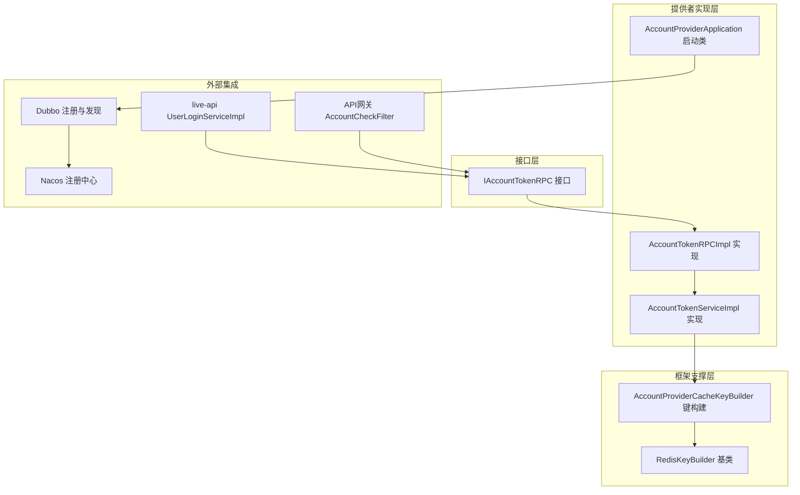
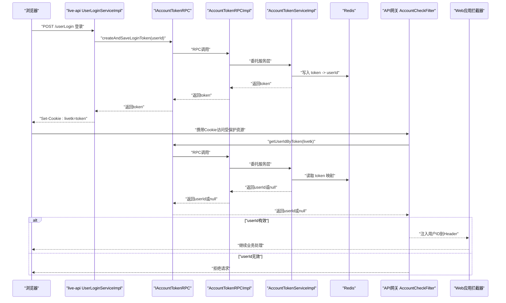
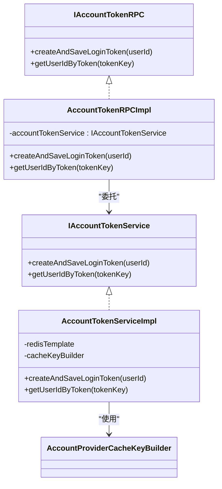
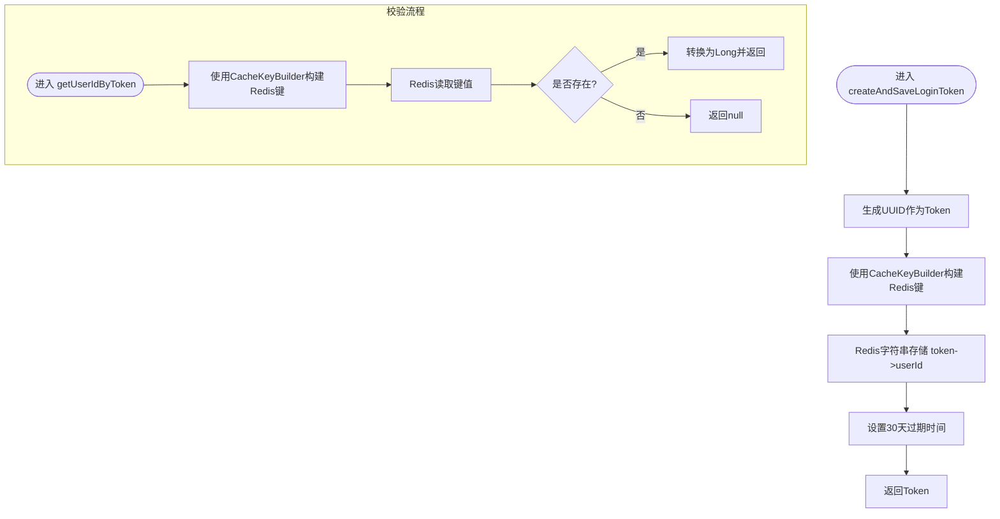
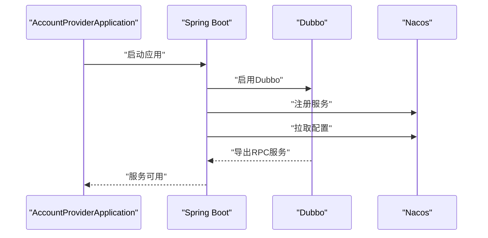
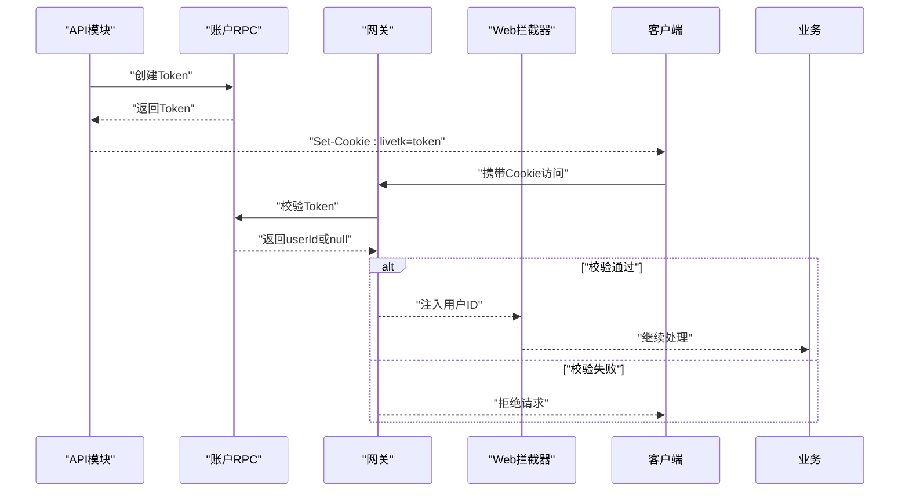
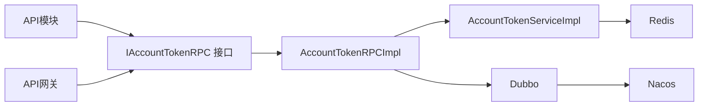

# 账户服务

<cite>
**本文引用的文件列表**
- [IAccountTokenRPC.java](file://live-account-interface/src/main/java/com/logilong/live/account/interfaces/IAccountTokenRPC.java)
- [AccountTokenRPCImpl.java](file://live-account-provider/src/main/java/com/logilong/live/account/provider/rpc/AccountTokenRPCImpl.java)
- [IAccountTokenService.java](file://live-account-provider/src/main/java/com/logilong/live/account/provider/service/IAccountTokenService.java)
- [AccountTokenServiceImpl.java](file://live-account-provider/src/main/java/com/logilong/live/account/provider/service/impl/AccountTokenServiceImpl.java)
- [AccountProviderApplication.java](file://live-account-provider/src/main/java/com/logilong/live/account/provider/AccountProviderApplication.java)
- [bootstrap.yml](file://live-account-provider/src/main/resources/bootstrap.yml)
- [AccountCheckFilter.java](file://live-gateway/src/main/java/com/logilong/live/gateway/filter/AccountCheckFilter.java)
- [UserLoginServiceImpl.java](file://live-api/src/main/java/com/logilong/live/api/service/impl/UserLoginServiceImpl.java)
- [AccountProviderCacheKeyBuilder.java](file://live-framework/live-framework-redis-starter/src/main/java/com/logilong/live/framework/redis/starter/key/AccountProviderCacheKeyBuilder.java)
- [RedisKeyBuilder.java](file://live-framework/live-framework-redis-starter/src/main/java/com/logilong/live/framework/redis/starter/key/RedisKeyBuilder.java)
- [LiveUserInfoInterceptor.java](file://live-framework/live-framework-web-starter/src/main/java/com/logilong/live/web/starter/context/LiveUserInfoInterceptor.java)
- [pom.xml](file://pom.xml)
</cite>

## 目录
1. [简介](#简介)
2. [项目结构](#项目结构)
3. [核心组件](#核心组件)
4. [架构总览](#架构总览)
5. [详细组件分析](#详细组件分析)
6. [依赖关系分析](#依赖关系分析)
7. [性能考量](#性能考量)
8. [故障排查指南](#故障排查指南)
9. [结论](#结论)

## 简介
本文件围绕账户服务模块展开，系统性解析账户Token管理能力的设计与实现，重点覆盖：
- IAccountTokenRPC接口定义的Token创建与校验能力
- AccountTokenRPCImpl在账户提供者中的RPC实现
- AccountProviderApplication如何通过Dubbo暴露RPC服务并与Nacos注册中心集成
- 用户认证流程中Token的生成、验证与传递链路
- 与API网关、live-api模块的服务间调用模式
- 安全性设计、缓存策略与异常处理机制

## 项目结构
账户服务由三层组成：接口层、提供者实现层、框架支撑层（Redis键构建、Web拦截器等）。
- 接口层：定义跨模块可复用的Token RPC接口
- 提供者实现层：基于Dubbo实现RPC接口，使用Redis存储Token与用户映射
- 框架支撑层：统一的Redis Key前缀与命名规范，以及Web层上下文注入

图表来源
- [IAccountTokenRPC.java](file://live-account-interface/src/main/java/com/logilong/live/account/interfaces/IAccountTokenRPC.java#L1-L22)
- [AccountTokenRPCImpl.java](file://live-account-provider/src/main/java/com/logilong/live/account/provider/rpc/AccountTokenRPCImpl.java#L1-L24)
- [AccountTokenServiceImpl.java](file://live-account-provider/src/main/java/com/logilong/live/account/provider/service/impl/AccountTokenServiceImpl.java#L1-L33)
- [AccountProviderApplication.java](file://live-account-provider/src/main/java/com/logilong/live/account/provider/AccountProviderApplication.java#L1-L20)
- [AccountProviderCacheKeyBuilder.java](file://live-framework/live-framework-redis-starter/src/main/java/com/logilong/live/framework/redis/starter/key/AccountProviderCacheKeyBuilder.java#L1-L18)
- [RedisKeyBuilder.java](file://live-framework/live-framework-redis-starter/src/main/java/com/logilong/live/framework/redis/starter/key/RedisKeyBuilder.java#L1-L22)
- [AccountCheckFilter.java](file://live-gateway/src/main/java/com/logilong/live/gateway/filter/AccountCheckFilter.java#L1-L101)
- [UserLoginServiceImpl.java](file://live-api/src/main/java/com/logilong/live/api/service/impl/UserLoginServiceImpl.java#L1-L88)

章节来源
- [pom.xml](file://pom.xml#L1-L92)

## 核心组件
- IAccountTokenRPC：定义Token创建与校验两个RPC方法，作为跨模块契约
- AccountTokenRPCImpl：Dubbo注解暴露的RPC实现，委托给服务层
- AccountTokenServiceImpl：基于Redis的Token持久化与查询，使用统一键构建器
- AccountProviderApplication：启用Dubbo与服务发现，以非Web方式启动
- AccountProviderCacheKeyBuilder/RedisKeyBuilder：统一Redis键前缀与分隔符，避免冲突
- AccountCheckFilter：网关侧全局过滤器，从Cookie提取Token并调用RPC校验
- UserLoginServiceImpl：API侧登录流程，调用RPC创建Token并写入Cookie

章节来源
- [IAccountTokenRPC.java](file://live-account-interface/src/main/java/com/logilong/live/account/interfaces/IAccountTokenRPC.java#L1-L22)
- [AccountTokenRPCImpl.java](file://live-account-provider/src/main/java/com/logilong/live/account/provider/rpc/AccountTokenRPCImpl.java#L1-L24)
- [AccountTokenServiceImpl.java](file://live-account-provider/src/main/java/com/logilong/live/account/provider/service/impl/AccountTokenServiceImpl.java#L1-L33)
- [AccountProviderApplication.java](file://live-account-provider/src/main/java/com/logilong/live/account/provider/AccountProviderApplication.java#L1-L20)
- [AccountProviderCacheKeyBuilder.java](file://live-framework/live-framework-redis-starter/src/main/java/com/logilong/live/framework/redis/starter/key/AccountProviderCacheKeyBuilder.java#L1-L18)
- [RedisKeyBuilder.java](file://live-framework/live-framework-redis-starter/src/main/java/com/logilong/live/framework/redis/starter/key/RedisKeyBuilder.java#L1-L22)
- [AccountCheckFilter.java](file://live-gateway/src/main/java/com/logilong/live/gateway/filter/AccountCheckFilter.java#L1-L101)
- [UserLoginServiceImpl.java](file://live-api/src/main/java/com/logilong/live/api/service/impl/UserLoginServiceImpl.java#L1-L88)

## 架构总览
账户服务在整体系统中的位置如下：
- API网关负责统一鉴权与请求转发
- API模块负责登录流程，调用账户RPC创建Token并写入Cookie
- 账户提供者通过Dubbo暴露RPC，使用Redis存储Token与用户映射
- Web应用通过拦截器将用户ID注入线程上下文，便于后续业务处理

图表来源
- [UserLoginServiceImpl.java](file://live-api/src/main/java/com/logilong/live/api/service/impl/UserLoginServiceImpl.java#L1-L88)
- [IAccountTokenRPC.java](file://live-account-interface/src/main/java/com/logilong/live/account/interfaces/IAccountTokenRPC.java#L1-L22)
- [AccountTokenRPCImpl.java](file://live-account-provider/src/main/java/com/logilong/live/account/provider/rpc/AccountTokenRPCImpl.java#L1-L24)
- [AccountTokenServiceImpl.java](file://live-account-provider/src/main/java/com/logilong/live/account/provider/service/impl/AccountTokenServiceImpl.java#L1-L33)
- [AccountCheckFilter.java](file://live-gateway/src/main/java/com/logilong/live/gateway/filter/AccountCheckFilter.java#L1-L101)
- [LiveUserInfoInterceptor.java](file://live-framework/live-framework-web-starter/src/main/java/com/logilong/live/web/starter/context/LiveUserInfoInterceptor.java#L1-L35)

## 详细组件分析

### IAccountTokenRPC 接口与职责
- 方法一：创建并保存登录Token，返回字符串Token
- 方法二：根据Token键获取用户ID，用于鉴权校验
- 设计要点：接口最小化，职责单一；面向RPC调用，不包含业务细节

章节来源
- [IAccountTokenRPC.java](file://live-account-interface/src/main/java/com/logilong/live/account/interfaces/IAccountTokenRPC.java#L1-L22)

### AccountTokenRPCImpl 实现与Dubbo暴露
- 使用Dubbo注解暴露服务，实现IAccountTokenRPC
- 将具体逻辑委托给服务层IAccountTokenService
- 作为提供者侧RPC入口，供网关与API模块调用

图表来源
- [IAccountTokenRPC.java](file://live-account-interface/src/main/java/com/logilong/live/account/interfaces/IAccountTokenRPC.java#L1-L22)
- [AccountTokenRPCImpl.java](file://live-account-provider/src/main/java/com/logilong/live/account/provider/rpc/AccountTokenRPCImpl.java#L1-L24)
- [IAccountTokenService.java](file://live-account-provider/src/main/java/com/logilong/live/account/provider/service/IAccountTokenService.java#L1-L16)
- [AccountTokenServiceImpl.java](file://live-account-provider/src/main/java/com/logilong/live/account/provider/service/impl/AccountTokenServiceImpl.java#L1-L33)
- [AccountProviderCacheKeyBuilder.java](file://live-framework/live-framework-redis-starter/src/main/java/com/logilong/live/framework/redis/starter/key/AccountProviderCacheKeyBuilder.java#L1-L18)

章节来源
- [AccountTokenRPCImpl.java](file://live-account-provider/src/main/java/com/logilong/live/account/provider/rpc/AccountTokenRPCImpl.java#L1-L24)

### AccountTokenServiceImpl 缓存策略与数据结构
- Token生成：UUID随机字符串
- 存储结构：Redis字符串键值，键由统一前缀+类型+分隔符+Token构成
- 过期策略：30天过期，到期自动清理
- 复杂度：单键读写均为O(1)，适合高并发场景
- 可扩展点：支持滑动过期、分布式锁、Token刷新等

图表来源
- [AccountTokenServiceImpl.java](file://live-account-provider/src/main/java/com/logilong/live/account/provider/service/impl/AccountTokenServiceImpl.java#L1-L33)
- [AccountProviderCacheKeyBuilder.java](file://live-framework/live-framework-redis-starter/src/main/java/com/logilong/live/framework/redis/starter/key/AccountProviderCacheKeyBuilder.java#L1-L18)
- [RedisKeyBuilder.java](file://live-framework/live-framework-redis-starter/src/main/java/com/logilong/live/framework/redis/starter/key/RedisKeyBuilder.java#L1-L22)

章节来源
- [AccountTokenServiceImpl.java](file://live-account-provider/src/main/java/com/logilong/live/account/provider/service/impl/AccountTokenServiceImpl.java#L1-L33)

### AccountProviderApplication 启动与Dubbo/Nacos集成
- 启动方式：非Web应用，仅启用Dubbo与服务发现
- Dubbo：通过注解启用服务导出
- 服务发现：集成Nacos，注册服务并从Nacos拉取配置
- 配置来源：bootstrap.yml中声明Nacos地址、命名空间与配置导入

图表来源
- [AccountProviderApplication.java](file://live-account-provider/src/main/java/com/logilong/live/account/provider/AccountProviderApplication.java#L1-L20)
- [bootstrap.yml](file://live-account-provider/src/main/resources/bootstrap.yml#L1-L22)

章节来源
- [AccountProviderApplication.java](file://live-account-provider/src/main/java/com/logilong/live/account/provider/AccountProviderApplication.java#L1-L20)
- [bootstrap.yml](file://live-account-provider/src/main/resources/bootstrap.yml#L1-L22)

### 用户认证流程：Token生成、验证与传递
- 登录阶段：API模块调用账户RPC创建Token，写入Cookie（livetk）
- 网关阶段：网关过滤器从Cookie读取Token，调用账户RPC校验，失败则拦截
- 业务阶段：校验通过后将用户ID注入HTTP头，Web拦截器将其放入线程上下文

图表来源
- [UserLoginServiceImpl.java](file://live-api/src/main/java/com/logilong/live/api/service/impl/UserLoginServiceImpl.java#L1-L88)
- [AccountCheckFilter.java](file://live-gateway/src/main/java/com/logilong/live/gateway/filter/AccountCheckFilter.java#L1-L101)
- [IAccountTokenRPC.java](file://live-account-interface/src/main/java/com/logilong/live/account/interfaces/IAccountTokenRPC.java#L1-L22)
- [LiveUserInfoInterceptor.java](file://live-framework/live-framework-web-starter/src/main/java/com/logilong/live/web/starter/context/LiveUserInfoInterceptor.java#L1-L35)

章节来源
- [UserLoginServiceImpl.java](file://live-api/src/main/java/com/logilong/live/api/service/impl/UserLoginServiceImpl.java#L1-L88)
- [AccountCheckFilter.java](file://live-gateway/src/main/java/com/logilong/live/gateway/filter/AccountCheckFilter.java#L1-L101)
- [LiveUserInfoInterceptor.java](file://live-framework/live-framework-web-starter/src/main/java/com/logilong/live/web/starter/context/LiveUserInfoInterceptor.java#L1-L35)

### 与API网关和live-api模块的交互关系
- API网关：全局过滤器在请求进入业务模块前进行Token校验，避免无效请求进入下游
- live-api：登录服务负责调用账户RPC创建Token并下发Cookie
- Web拦截器：将用户ID从Header注入线程上下文，供业务层读取

章节来源
- [AccountCheckFilter.java](file://live-gateway/src/main/java/com/logilong/live/gateway/filter/AccountCheckFilter.java#L1-L101)
- [UserLoginServiceImpl.java](file://live-api/src/main/java/com/logilong/live/api/service/impl/UserLoginServiceImpl.java#L1-L88)
- [LiveUserInfoInterceptor.java](file://live-framework/live-framework-web-starter/src/main/java/com/logilong/live/web/starter/context/LiveUserInfoInterceptor.java#L1-L35)

## 依赖关系分析
- 组件耦合
  - RPC实现依赖服务层接口，低耦合高内聚
  - 服务层依赖Redis与键构建器，职责清晰
  - 网关与API模块均依赖接口层，形成稳定的跨模块契约
- 外部依赖
  - Dubbo：服务导出与远程调用
  - Nacos：服务注册与配置中心
  - Redis：Token持久化与快速校验

图表来源
- [IAccountTokenRPC.java](file://live-account-interface/src/main/java/com/logilong/live/account/interfaces/IAccountTokenRPC.java#L1-L22)
- [AccountTokenRPCImpl.java](file://live-account-provider/src/main/java/com/logilong/live/account/provider/rpc/AccountTokenRPCImpl.java#L1-L24)
- [AccountTokenServiceImpl.java](file://live-account-provider/src/main/java/com/logilong/live/account/provider/service/impl/AccountTokenServiceImpl.java#L1-L33)
- [AccountCheckFilter.java](file://live-gateway/src/main/java/com/logilong/live/gateway/filter/AccountCheckFilter.java#L1-L101)
- [UserLoginServiceImpl.java](file://live-api/src/main/java/com/logilong/live/api/service/impl/UserLoginServiceImpl.java#L1-L88)

章节来源
- [pom.xml](file://pom.xml#L1-L92)

## 性能考量
- Redis单键读写O(1)，适合高并发场景
- Token过期时间长（30天），减少频繁写入与重建
- 键命名规范统一，避免键冲突与运维复杂度
- 建议优化方向
  - 引入滑动过期：在访问时延长过期时间
  - 引入Token刷新：提供刷新接口，降低长期Token泄露风险
  - 分布式锁：防止并发重复创建同一用户的Token
  - 缓存预热：热点用户Token提前加载到本地缓存

## 故障排查指南
- 常见问题与定位
  - 网关拦截：检查Cookie中livetk是否存在与格式是否正确
  - RPC调用失败：确认账户提供者已启动并注册到Nacos
  - Redis不可用：检查连接配置与键空间权限
  - Token过期：确认Redis键是否仍存在且未过期
- 关键日志
  - 网关过滤器会记录缺少Cookie、Token无效等情况
  - 登录流程会记录Cookie写入与用户ID
- 快速恢复建议
  - 重新登录以获取新Token
  - 检查Nacos服务状态与命名空间配置
  - 校验Redis连通性与键空间

章节来源
- [AccountCheckFilter.java](file://live-gateway/src/main/java/com/logilong/live/gateway/filter/AccountCheckFilter.java#L1-L101)
- [UserLoginServiceImpl.java](file://live-api/src/main/java/com/logilong/live/api/service/impl/UserLoginServiceImpl.java#L1-L88)
- [bootstrap.yml](file://live-account-provider/src/main/resources/bootstrap.yml#L1-L22)

## 结论
账户服务通过简洁的RPC接口与轻量的Redis存储，实现了高效的Token管理能力。配合API网关的统一鉴权与Web拦截器的上下文注入，形成了完整的用户认证闭环。当前实现具备良好的可扩展性，可在保持接口稳定的基础上引入滑动过期、Token刷新与分布式锁等机制，进一步提升安全性与用户体验。