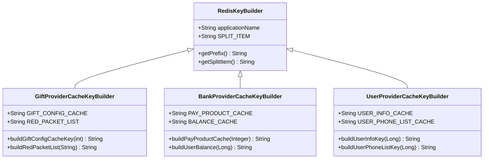
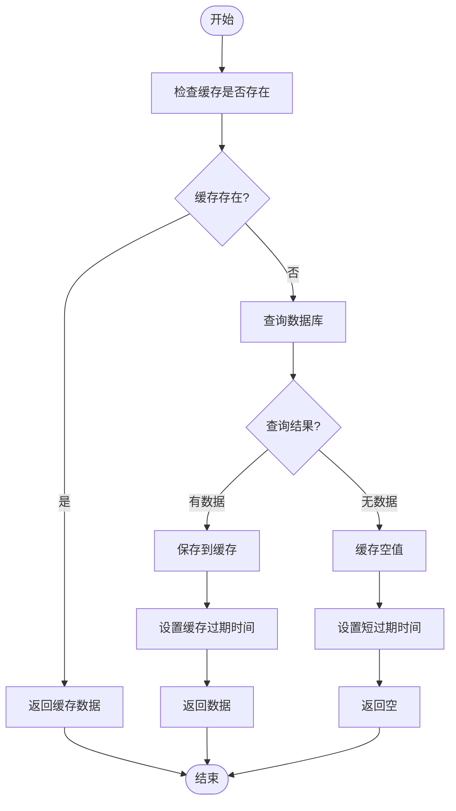
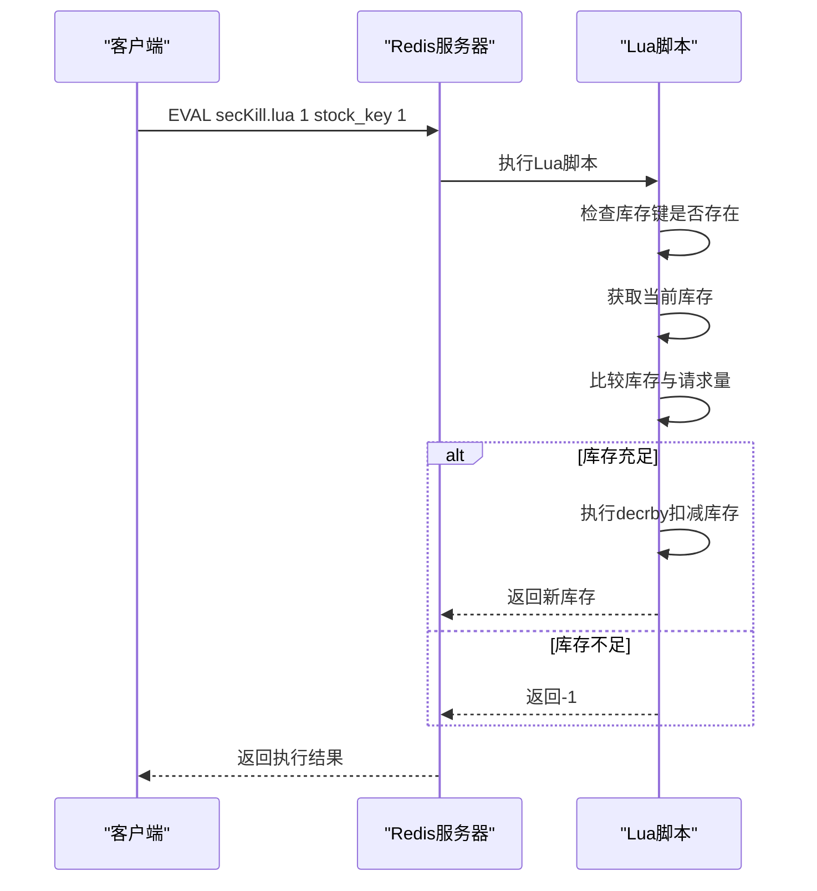
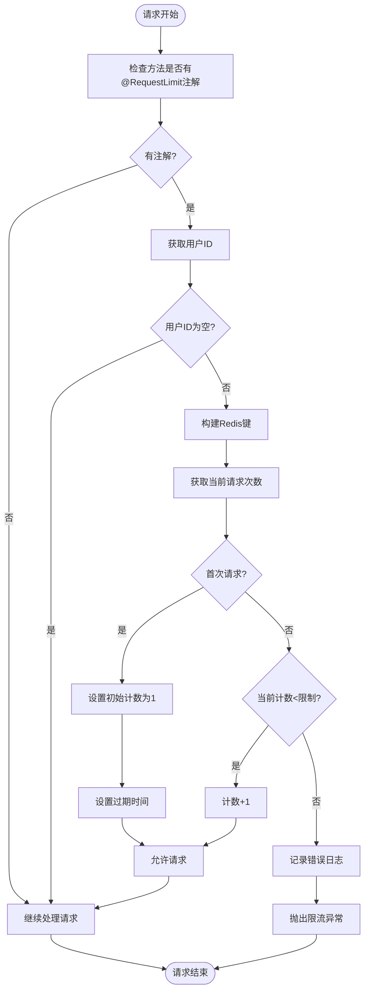
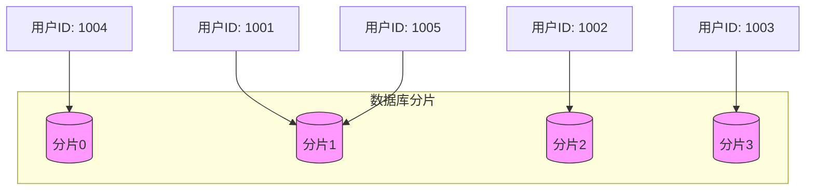

# 性能优化

<cite>
**本文档引用的文件**
- [RequestLimit.java](file://live-framework/live-framework-web-starter/src/main/java/com/logilong/live/web/starter/config/RequestLimit.java)
- [RequestLimitInterceptor.java](file://live-framework/live-framework-web-starter/src/main/java/com/logilong/live/web/starter/context/RequestLimitInterceptor.java)
- [WebConfig.java](file://live-framework/live-framework-web-starter/src/main/java/com/logilong/live/web/starter/config/WebConfig.java)
- [RedisConfig.java](file://live-framework/live-framework-redis-starter/src/main/java/com/logilong/live/framework/redis/starter/config/RedisConfig.java)
- [RedisKeyBuilder.java](file://live-framework/live-framework-redis-starter/src/main/java/com/logilong/live/framework/redis/starter/key/RedisKeyBuilder.java)
- [GiftProviderCacheKeyBuilder.java](file://live-framework/live-framework-redis-starter/src/main/java/com/logilong/live/framework/redis/starter/key/GiftProviderCacheKeyBuilder.java)
- [BankProviderCacheKeyBuilder.java](file://live-framework/live-framework-redis-starter/src/main/java/com/logilong/live/framework/redis/starter/key/BankProviderCacheKeyBuilder.java)
- [UserProviderCacheKeyBuilder.java](file://live-framework/live-framework-redis-starter/src/main/java/com/logilong/live/framework/redis/starter/key/UserProviderCacheKeyBuilder.java)
- [secKill.lua](file://live-gift-provider/src/main/resources/secKill.lua)
- [getPkNumAndSeqId.lua](file://live-gift-provider/src/main/resources/getPkNumAndSeqId.lua)
- [ShardingJdbcDatasourceAutoInitConnectionConfig.java](file://live-framework/live-framework-datasource-starter/src/main/java/com/logilong/live/framework/datasource/starter/config/ShardingJdbcDatasourceAutoInitConnectionConfig.java)
- [ThreadPoolManager.java](file://live-msg-provider/src/main/java/com/logilong/live/msg/provider/config/ThreadPoolManager.java)
- [UserServiceImpl.java](file://live-user-provider/src/main/java/com/logilong/live/user/provider/service/impl/UserServiceImpl.java)
- [UserPhoneServiceImpl.java](file://live-user-provider/src/main/java/com/logilong/live/user/provider/service/impl/UserPhoneServiceImpl.java)
</cite>

## 目录
1. [引言](#引言)
2. [缓存策略与Redis应用](#缓存策略与redis应用)
3. [Lua脚本在高并发场景下的应用](#lua脚本在高并发场景下的应用)
4. [限流组件实现原理](#限流组件实现原理)
5. [数据库读写分离与分库分表](#数据库读写分离与分库分表)
6. [JVM调优与线程池配置](#jvm调优与线程池配置)
7. [性能瓶颈诊断方法](#性能瓶颈诊断方法)
8. [结论](#结论)

## 引言
本项目是一个直播平台系统，包含用户管理、礼物系统、支付系统、IM通信等多个核心模块。面对高并发场景下的性能挑战，系统采用了多种性能优化策略，包括Redis缓存、Lua脚本原子操作、限流组件、数据库分库分表等技术。本文档将详细阐述这些性能优化策略的实现原理和最佳实践。

## 缓存策略与Redis应用

### 缓存设计原则
系统采用Redis作为分布式缓存解决方案，主要缓存热点数据如用户信息、礼物配置、支付产品等。通过合理的缓存设计，有效减轻了数据库压力，提升了系统响应速度。

### 缓存键设计规范
系统通过`RedisKeyBuilder`基类和各模块的`CacheKeyBuilder`实现类来统一管理Redis键的命名规范。所有缓存键都以应用名称为前缀，确保不同服务之间的缓存隔离。



**图示来源**
- [RedisKeyBuilder.java](file://live-framework/live-framework-redis-starter/src/main/java/com/logilong/live/framework/redis/starter/key/RedisKeyBuilder.java)
- [GiftProviderCacheKeyBuilder.java](file://live-framework/live-framework-redis-starter/src/main/java/com/logilong/live/framework/redis/starter/key/GiftProviderCacheKeyBuilder.java)
- [BankProviderCacheKeyBuilder.java](file://live-framework/live-framework-redis-starter/src/main/java/com/logilong/live/framework/redis/starter/key/BankProviderCacheKeyBuilder.java)
- [UserProviderCacheKeyBuilder.java](file://live-framework/live-framework-redis-starter/src/main/java/com/logilong/live/framework/redis/starter/key/UserProviderCacheKeyBuilder.java)

### 缓存失效策略
系统采用了多种缓存失效策略来保证数据一致性：

1. **TTL过期策略**：为缓存设置合理的过期时间，如用户信息缓存30分钟，支付产品缓存1小时。
2. **主动失效策略**：在数据更新时主动删除或更新缓存。
3. **空值缓存**：为防止缓存击穿，对查询结果为空的情况也进行缓存，但设置较短的过期时间。



**图示来源**
- [UserPhoneServiceImpl.java](file://live-user-provider/src/main/java/com/logilong/live/user/provider/service/impl/UserPhoneServiceImpl.java)
- [UserServiceImpl.java](file://live-user-provider/src/main/java/com/logilong/live/user/provider/service/impl/UserServiceImpl.java)

**本节来源**
- [RedisConfig.java](file://live-framework/live-framework-redis-starter/src/main/java/com/logilong/live/framework/redis/starter/config/RedisConfig.java)
- [GiftProviderCacheKeyBuilder.java](file://live-framework/live-framework-redis-starter/src/main/java/com/logilong/live/framework/redis/starter/key/GiftProviderCacheKeyBuilder.java)
- [UserPhoneServiceImpl.java](file://live-user-provider/src/main/java/com/logilong/live/user/provider/service/impl/UserPhoneServiceImpl.java)

## Lua脚本在高并发场景下的应用

### Lua脚本优势
在高并发场景下，使用Lua脚本可以保证操作的原子性，避免了多次网络往返带来的性能损耗和数据不一致问题。系统在关键业务场景中使用Lua脚本来实现原子操作。

### 秒杀库存扣减实现
`secKill.lua`脚本用于实现秒杀场景下的库存扣减，确保在高并发情况下库存不会出现超卖现象。

```lua
if (redis.call('exists', KEYS[1])) == 1 then
    local currentStock = redis.call('get', KEYS[1])
    if (tonumber(currentStock) >= tonumber(ARGV[1])) then
        return redis.call('decrby', KEYS[1], tonumber(ARGV[1]))
    else
        return -1
    end
    return -1
end
```

该脚本的工作流程如下：
1. 检查库存键是否存在
2. 获取当前库存数量
3. 比较请求扣减数量与当前库存
4. 如果库存充足，则执行decrby操作扣减库存
5. 如果库存不足，则返回-1表示扣减失败



**图示来源**
- [secKill.lua](file://live-gift-provider/src/main/resources/secKill.lua)

### PK序号生成实现
`getPkNumAndSeqId.lua`脚本用于生成PK模式下的序号，确保序号的连续性和唯一性。

```lua
--如果存在pkNum
if (redis.call('exists', KEYS[1])) == 1 then
    local currentNum = redis.call('get', KEYS[1])
    --当前pkNum在MAX到MIN之间，自增后直接返回
    if (tonumber(currentNum) <= tonumber(ARGV[2]) and tonumber(currentNum) >= tonumber(ARGV[3])) then
        return redis.call('incrby', KEYS[1], tonumber(ARGV[4]))
    --代表PK结束    
    else
        return currentNum
    end
else
    --如果不存在pkNum，则初始化pkNum
    redis.call('set', KEYS[1], tonumber(ARGV[1]))
    redis.call('EXPIRE', KEYS[1], 3600 * 12)
    --自增返回
    return redis.call('incrby', KEYS[1], tonumber(ARGV[4]))
end
```

**本节来源**
- [secKill.lua](file://live-gift-provider/src/main/resources/secKill.lua)
- [getPkNumAndSeqId.lua](file://live-gift-provider/src/main/resources/getPkNumAndSeqId.lua)

## 限流组件实现原理

### 限流注解设计
系统通过`@RequestLimit`注解实现接口级别的限流控制，开发者可以方便地在需要限流的方法上添加该注解。

```java
public @interface RequestLimit {
    int limit();    // 允许请求的量
    int second();   // 指定时间范围，单位秒
    String msg() default "请求过于频繁"; // 限流提示信息
}
```

### 限流拦截器实现
`RequestLimitInterceptor`拦截器负责处理限流逻辑，基于Redis实现分布式限流。



**图示来源**
- [RequestLimitInterceptor.java](file://live-framework/live-framework-web-starter/src/main/java/com/logilong/live/web/starter/context/RequestLimitInterceptor.java)

### 限流配置与应用
在`WebConfig`中注册限流拦截器，使其对所有请求生效。

```java
@Configuration
public class WebConfig implements WebMvcConfigurer {
    @Bean
    public RequestLimitInterceptor requestLimitInterceptor(){
        return new RequestLimitInterceptor();
    }

    @Override
    public void addInterceptors(InterceptorRegistry registry) {
        registry.addInterceptor(requestLimitInterceptor()).addPathPatterns("/**").excludePathPatterns("/error");
    }
}
```

**本节来源**
- [RequestLimit.java](file://live-framework/live-framework-web-starter/src/main/java/com/logilong/live/web/starter/config/RequestLimit.java)
- [RequestLimitInterceptor.java](file://live-framework/live-framework-web-starter/src/main/java/com/logilong/live/web/starter/context/RequestLimitInterceptor.java)
- [WebConfig.java](file://live-framework/live-framework-web-starter/src/main/java/com/logilong/live/web/starter/config/WebConfig.java)

## 数据库读写分离与分库分表

### ShardingSphere集成
系统使用ShardingSphere实现数据库的分库分表，通过`ShardingJdbcDatasourceAutoInitConnectionConfig`配置类确保数据源的正确初始化。

```java
@Configuration
public class ShardingJdbcDatasourceAutoInitConnectionConfig {
    @Bean
    public ApplicationRunner runner(DataSource dataSource){
        return args -> {
            // 手动触发连接池的连接创建
            Connection connection = dataSource.getConnection();
        };
    }
}
```

### 分片策略
系统采用用户ID取模的方式进行分片，避免了笛卡尔积路由问题，提高了查询效率。



**图示来源**
- [ShardingJdbcDatasourceAutoInitConnectionConfig.java](file://live-framework/live-framework-datasource-starter/src/main/java/com/logilong/live/framework/datasource/starter/config/ShardingJdbcDatasourceAutoInitConnectionConfig.java)
- [UserServiceImpl.java](file://live-user-provider/src/main/java/com/logilong/live/user/provider/service/impl/UserServiceImpl.java)

### 并行查询优化
对于批量查询场景，系统采用并行流的方式提高查询效率。

```java
// 为了避免sharding-jdbc笛卡尔积路由，使用分片规则对user_id进行分组
Map<Long, List<Long>> userIdMap = userIdNotInCacheList.stream().collect(Collectors.groupingBy(userId -> userId % 100));
List<UserDTO> dbQueryResult = new CopyOnWriteArrayList<>();
// 并行查询数据库，提高查询效率
userIdMap.values().parallelStream().forEach(queryUserIdList -> {
    List<UserPO> userPOList = userMapper.selectBatchIds(queryUserIdList);
    dbQueryResult.addAll(ConvertBeanUtils.convertList(userPOList, UserDTO.class));
});
```

**本节来源**
- [ShardingJdbcDatasourceAutoInitConnectionConfig.java](file://live-framework/live-framework-datasource-starter/src/main/java/com/logilong/live/framework/datasource/starter/config/ShardingJdbcDatasourceAutoInitConnectionConfig.java)
- [UserServiceImpl.java](file://live-user-provider/src/main/java/com/logilong/live/user/provider/service/impl/UserServiceImpl.java)

## JVM调优与线程池配置

### 线程池配置
系统在`ThreadPoolManager`中定义了通用的异步线程池，避免了线程创建的开销。

```java
public class ThreadPoolManager {
    public static ThreadPoolExecutor commonAsyncPool = new ThreadPoolExecutor(
        2, 8, 3, TimeUnit.SECONDS, 
        new ArrayBlockingQueue<>(1000),
        new ThreadFactory() {
            @Override
            public Thread newThread(Runnable r) {
                Thread newThread = new Thread(r);
                newThread.setName("commonAsyncPool - " + ThreadLocalRandom.current().nextInt(10000));
                return newThread;
            }
        }
    );
}
```

### 线程池参数说明
- 核心线程数：2
- 最大线程数：8
- 空闲线程存活时间：3秒
- 队列容量：1000
- 线程命名策略：包含池名称和随机数，便于监控和排查问题

### JVM调优建议
1. **堆内存设置**：根据应用实际内存需求设置合理的-Xms和-Xmx值，避免频繁的GC。
2. **GC策略选择**：对于低延迟要求的系统，建议使用G1GC或ZGC。
3. **元空间设置**：合理设置-XX:MetaspaceSize和-XX:MaxMetaspaceSize，避免元空间溢出。
4. **监控与分析**：启用GC日志，定期分析GC情况，及时发现内存问题。

**本节来源**
- [ThreadPoolManager.java](file://live-msg-provider/src/main/java/com/logilong/live/msg/provider/config/ThreadPoolManager.java)

## 性能瓶颈诊断方法

### 常见性能瓶颈
1. **数据库瓶颈**：慢查询、锁竞争、连接池耗尽
2. **缓存瓶颈**：缓存击穿、缓存雪崩、缓存穿透
3. **网络瓶颈**：高延迟、带宽不足、连接数限制
4. **CPU瓶颈**：计算密集型任务、频繁的GC
5. **内存瓶颈**：内存泄漏、大对象创建

### 诊断工具与方法
1. **APM监控**：使用链路追踪工具监控系统性能，定位慢请求。
2. **日志分析**：通过错误日志和性能日志分析系统运行状况。
3. **JVM监控**：使用jstat、jstack、jmap等工具分析JVM状态。
4. **数据库监控**：监控慢查询日志，分析执行计划。
5. **压力测试**：使用JMeter等工具进行压力测试，评估系统性能。

### 优化案例
**案例：批量用户信息查询优化**
- 问题：批量查询用户信息时响应时间较长
- 分析：未使用缓存，直接查询数据库，且存在笛卡尔积路由问题
- 优化：引入Redis缓存，使用分片规则分组查询，采用并行流提高效率
- 效果：响应时间从平均500ms降低到50ms

**本节来源**
- [UserServiceImpl.java](file://live-user-provider/src/main/java/com/logilong/live/user/provider/service/impl/UserServiceImpl.java)

## 结论
本系统通过综合运用Redis缓存、Lua脚本、限流组件、数据库分库分表、线程池优化等多种技术手段，有效提升了系统的性能和稳定性。在高并发场景下，这些优化策略能够确保系统稳定运行，为用户提供良好的使用体验。未来可以进一步优化缓存策略，引入更智能的限流算法，并加强系统的监控和预警能力。