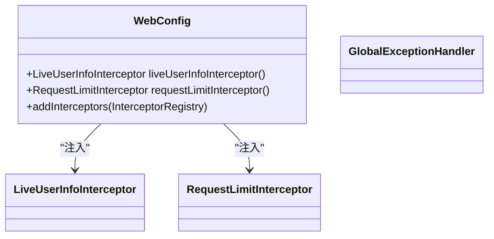
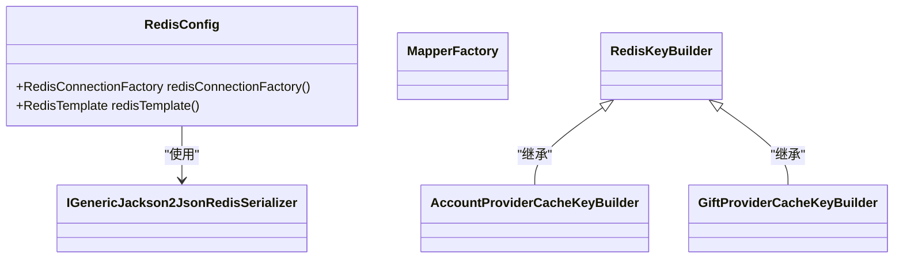
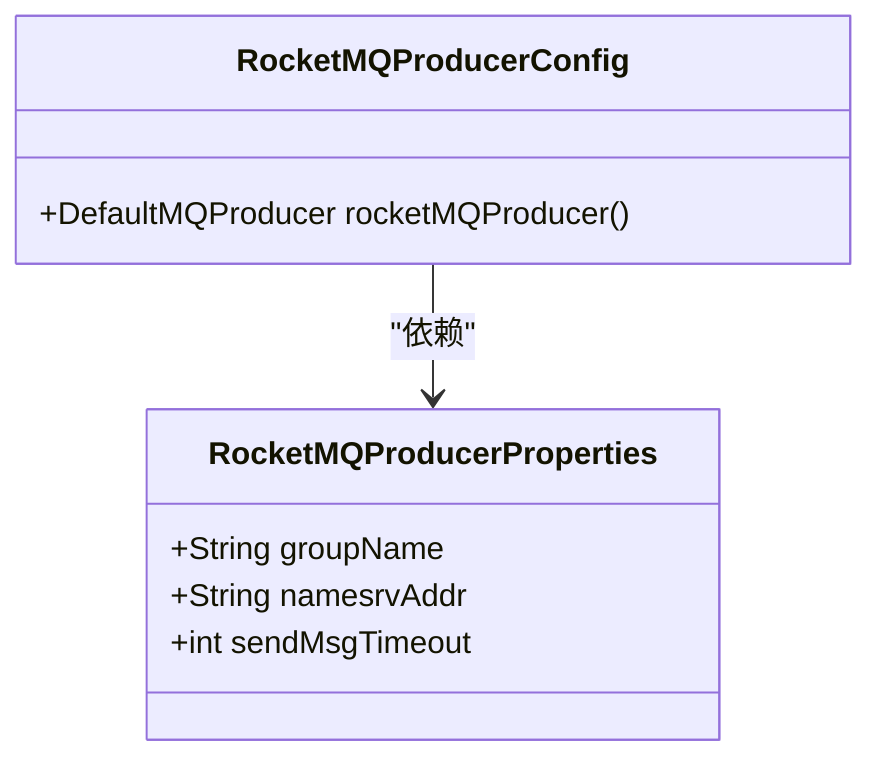
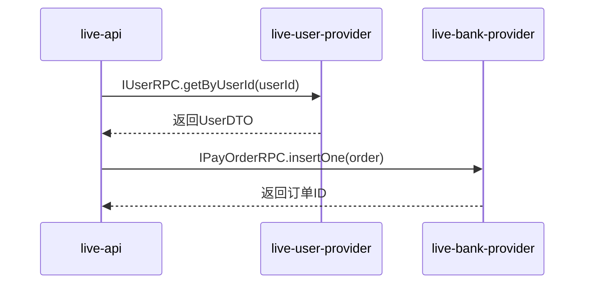
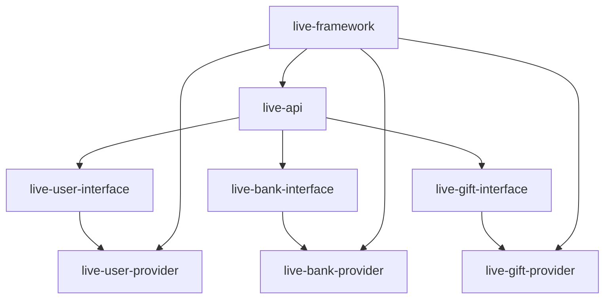

# 技术栈与依赖

<cite>
**本文档中引用的文件**  
- [pom.xml](file://pom.xml)
- [live-framework-web-starter/pom.xml](file://live-framework/live-framework-web-starter/pom.xml)
- [live-framework-redis-starter/pom.xml](file://live-framework/live-framework-redis-starter/pom.xml)
- [live-framework-mq-starter/pom.xml](file://live-framework/live-framework-mq-starter/pom.xml)
- [live-framework-datasource-starter/pom.xml](file://live-framework/live-framework-datasource-starter/pom.xml)
- [live-api/pom.xml](file://live-api/pom.xml)
- [live-user-provider/pom.xml](file://live-user-provider/pom.xml)
- [live-bank-provider/pom.xml](file://live-bank-provider/pom.xml)
- [live-gift-provider/pom.xml](file://live-gift-provider/pom.xml)
- [IAccountTokenRPC.java](file://live-account-interface/src/main/java/com/logilong/live/account/interfaces/IAccountTokenRPC.java)
- [IPayOrderRPC.java](file://live-bank-interface/src/main/java/com/logilong/live/bank/interfaces/IPayOrderRPC.java)
- [IGiftRecordRPC.java](file://live-gift-interface/src/main/java/com/logilong/live/gift/interfaces/IGiftRecordRPC.java)
- [IUserRPC.java](file://live-user-interface/src/main/java/com/logilong/live/user/interfaces/IUserRPC.java)
- [WebConfig.java](file://live-framework/live-framework-web-starter/src/main/java/com/logilong/live/web/starter/config/WebConfig.java)
- [RedisConfig.java](file://live-framework/live-framework-redis-starter/src/main/java/com/logilong/live/framework/redis/starter/config/RedisConfig.java)
- [RocketMQProducerConfig.java](file://live-framework/live-framework-mq-starter/src/main/java/com/logilong/live/framework/mq/starter/producer/RocketMQProducerConfig.java)
</cite>

## 目录
1. [技术栈概览](#技术栈概览)  
2. [核心依赖版本说明](#核心依赖版本说明)  
3. [Starter组件设计与封装](#starter组件设计与封装)  
4. [服务间通信：Dubbo RPC](#服务间通信dubbo-rpc)  
5. [服务注册与配置中心：Nacos](#服务注册与配置中心nacos)  
6. [异步消息处理：RocketMQ](#异步消息处理rocketmq)  
7. [分布式缓存：Redis](#分布式缓存redis)  
8. [数据库访问：MyBatis-Plus](#数据库访问mybatis-plus)  
9. [Maven多模块结构解析](#maven多模块结构解析)  
10. [依赖管理与升级指南](#依赖管理与升级指南)

## 技术栈概览

liveplatform项目采用现代化微服务架构，基于Spring Boot 3.0.4构建，通过Dubbo 3.3.2实现高性能服务间远程调用。系统使用Nacos作为服务注册与配置中心，实现服务发现与动态配置管理。为应对直播场景下的高并发、低延迟需求，系统引入RocketMQ 5.2.0处理异步消息通信，确保关键操作的最终一致性。Redis作为分布式缓存层，提升热点数据访问性能。数据库操作通过MyBatis-Plus简化开发，提升SQL编写效率。

整个技术栈围绕高可用、高并发、低延迟的核心目标设计，各组件协同工作，形成稳定可靠的技术底座。

**Section sources**  
- [pom.xml](file://pom.xml#L49-L59)

## 核心依赖版本说明

项目在`pom.xml`中明确定义了核心技术栈的版本，确保依赖一致性：

- **Spring Boot**: 3.0.4（基础框架）
- **Dubbo**: 3.3.2（RPC框架）
- **Nacos**: 通过Spring Cloud Alibaba集成（服务注册与配置）
- **RocketMQ**: 5.2.0（消息中间件）
- **MyBatis-Plus**: 3.5.3（持久层框架）
- **ShardingSphere-JDBC**: 5.3.2（数据库分片）
- **MySQL Connector**: 8.0.29（数据库驱动）

这些版本经过充分验证，具备良好的兼容性和稳定性，能够满足直播平台在高并发场景下的性能要求。

**Section sources**  
- [pom.xml](file://pom.xml#L48-L58)

## Starter组件设计与封装

项目通过自定义Starter组件封装通用能力，提升开发效率和代码一致性。所有Starter位于`live-framework`模块下，采用Spring Boot自动配置机制。

### live-framework-web-starter

封装Web层通用功能，包括：
- 全局异常处理
- 请求上下文拦截器
- 用户信息上下文管理
- 接口限流控制

该Starter依赖Spring Boot Web、Dubbo、Nacos等核心组件，为所有Web服务提供统一的入口配置。



**Diagram sources**  
- [WebConfig.java](file://live-framework/live-framework-web-starter/src/main/java/com/logilong/live/web/starter/config/WebConfig.java)

**Section sources**  
- [live-framework-web-starter/pom.xml](file://live-framework/live-framework-web-starter/pom.xml)
- [WebConfig.java](file://live-framework/live-framework-web-starter/src/main/java/com/logilong/live/web/starter/config/WebConfig.java)

### live-framework-redis-starter

封装Redis通用配置与序列化策略，提供：
- 自定义Jackson2Json序列化器
- 缓存Key生成器基类
- 各业务模块专用缓存Key构建器（如用户、礼物、账户等）

该Starter基于Spring Data Redis构建，确保缓存操作的统一性和可维护性。



**Diagram sources**  
- [RedisConfig.java](file://live-framework/live-framework-redis-starter/src/main/java/com/logilong/live/framework/redis/starter/config/RedisConfig.java)

**Section sources**  
- [live-framework-redis-starter/pom.xml](file://live-framework/live-framework-redis-starter/pom.xml)
- [RedisConfig.java](file://live-framework/live-framework-redis-starter/src/main/java/com/logilong/live/framework/redis/starter/config/RedisConfig.java)

### live-framework-mq-starter

封装RocketMQ生产者配置，提供：
- 生产者实例自动配置
- 消息发送属性统一管理
- 异常处理机制

该Starter简化了消息发送端的接入成本，开发者只需注入配置即可使用。



**Diagram sources**  
- [RocketMQProducerConfig.java](file://live-framework/live-framework-mq-starter/src/main/java/com/logilong/live/framework/mq/starter/producer/RocketMQProducerConfig.java)

**Section sources**  
- [live-framework-mq-starter/pom.xml](file://live-framework/live-framework-mq-starter/pom.xml)
- [RocketMQProducerConfig.java](file://live-framework/live-framework-mq-starter/src/main/java/com/logilong/live/framework/mq/starter/producer/RocketMQProducerConfig.java)

### live-framework-datasource-starter

封装数据源配置，集成ShardingSphere-JDBC实现分库分表，提供：
- Nacos动态数据源URL支持
- 分片规则自动初始化

**Section sources**  
- [live-framework-datasource-starter/pom.xml](file://live-framework/live-framework-datasource-starter/pom.xml)

## 服务间通信：Dubbo RPC

项目采用Dubbo 3.3.2实现服务间RPC调用，通过接口抽象实现服务解耦。

各服务提供标准RPC接口，如：
- `IAccountTokenRPC`: 账户登录Token管理
- `IPayOrderRPC`: 支付订单操作
- `IGiftRecordRPC`: 礼物记录写入
- `IUserRPC`: 用户信息查询与更新

服务提供方（Provider）实现接口，服务消费方（Consumer）通过Dubbo引用接口，实现远程调用透明化。



**Diagram sources**  
- [IAccountTokenRPC.java](file://live-account-interface/src/main/java/com/logilong/live/account/interfaces/IAccountTokenRPC.java)
- [IPayOrderRPC.java](file://live-bank-interface/src/main/java/com/logilong/live/bank/interfaces/IPayOrderRPC.java)

**Section sources**  
- [IAccountTokenRPC.java](file://live-account-interface/src/main/java/com/logilong/live/account/interfaces/IAccountTokenRPC.java)
- [IPayOrderRPC.java](file://live-bank-interface/src/main/java/com/logilong/live/bank/interfaces/IPayOrderRPC.java)
- [IGiftRecordRPC.java](file://live-gift-interface/src/main/java/com/logilong/live/gift/interfaces/IGiftRecordRPC.java)
- [IUserRPC.java](file://live-user-interface/src/main/java/com/logilong/live/user/interfaces/IUserRPC.java)

## 服务注册与配置中心：Nacos

Nacos作为服务注册与配置中心，被集成在各服务模块中。通过`spring-cloud-starter-alibaba-nacos-discovery`和`spring-cloud-starter-alibaba-nacos-config`实现服务自动注册与配置动态刷新。

服务启动时自动向Nacos注册，消费者通过服务名进行发现和调用，实现服务治理。配置文件存储在Nacos中，支持运行时动态更新，无需重启服务。

**Section sources**  
- [live-api/pom.xml](file://live-api/pom.xml#L33-L38)
- [live-user-provider/pom.xml](file://live-user-provider/pom.xml#L34-L40)

## 异步消息处理：RocketMQ

RocketMQ用于处理异步、解耦、削峰等场景，如：
- 礼物发送消息
- 订单状态变更通知
- 用户行为日志收集

通过`live-framework-mq-starter`封装生产者配置，各服务可快速接入消息发送能力。消费者在各服务中通过注解方式监听指定Topic。

**Section sources**  
- [live-framework-mq-starter/pom.xml](file://live-framework/live-framework-mq-starter/pom.xml)
- [RocketMQProducerConfig.java](file://live-framework/live-framework-mq-starter/src/main/java/com/logilong/live/framework/mq/starter/producer/RocketMQProducerConfig.java)

## 分布式缓存：Redis

Redis作为分布式缓存，用于存储：
- 用户登录Token
- 热点商品信息
- 直播间状态
- 频繁访问的配置数据

通过`live-framework-redis-starter`统一管理Redis连接与序列化，各业务模块使用专用缓存Key构建器，避免Key冲突，提升可维护性。

**Section sources**  
- [live-framework-redis-starter/pom.xml](file://live-framework/live-framework-redis-starter/pom.xml)
- [RedisConfig.java](file://live-framework/live-framework-redis-starter/src/main/java/com/logilong/live/framework/redis/starter/config/RedisConfig.java)

## 数据库访问：MyBatis-Plus

MyBatis-Plus作为ORM框架，简化数据库操作：
- 提供通用Mapper接口，减少XML编写
- 支持Lambda表达式构建查询条件
- 集成分页插件
- 支持自动填充字段（如创建时间、更新时间）

结合ShardingSphere-JDBC实现数据分片，支持水平扩展。

**Section sources**  
- [live-user-provider/pom.xml](file://live-user-provider/pom.xml#L84-L93)
- [live-bank-provider/pom.xml](file://live-bank-provider/pom.xml#L24-L27)

## Maven多模块结构解析

项目采用Maven多模块结构，主`pom.xml`定义全局依赖版本，各模块独立构建。

核心模块结构：
- `live-api`: API网关，聚合各服务接口
- `*-interface`: 定义RPC接口契约
- `*-provider`: 服务提供方，实现业务逻辑
- `live-framework`: 通用Starter组件
- `live-gateway`: 统一网关

模块间通过依赖`*-interface`模块实现服务调用，确保接口一致性。



**Diagram sources**  
- [pom.xml](file://pom.xml#L17-L45)

**Section sources**  
- [pom.xml](file://pom.xml)

## 依赖管理与升级指南

### 查看依赖版本

所有核心依赖版本在根`pom.xml`的`<properties>`中定义，如：
```xml
<springboot.version>3.0.4</springboot.version>
<dubbo.version>3.3.2</dubbo.version>
<rocketmq.version>5.2.0</rocketmq.version>
```

### 升级依赖步骤

1. 修改根`pom.xml`中对应属性版本号
2. 确保新版本兼容性（参考官方文档）
3. 执行`mvn clean compile`验证编译通过
4. 运行单元测试确保功能正常
5. 在测试环境部署验证

建议升级前充分评估版本变更带来的影响，尤其是Spring Boot、Dubbo等核心框架的主版本升级。

**Section sources**  
- [pom.xml](file://pom.xml#L47-L76)