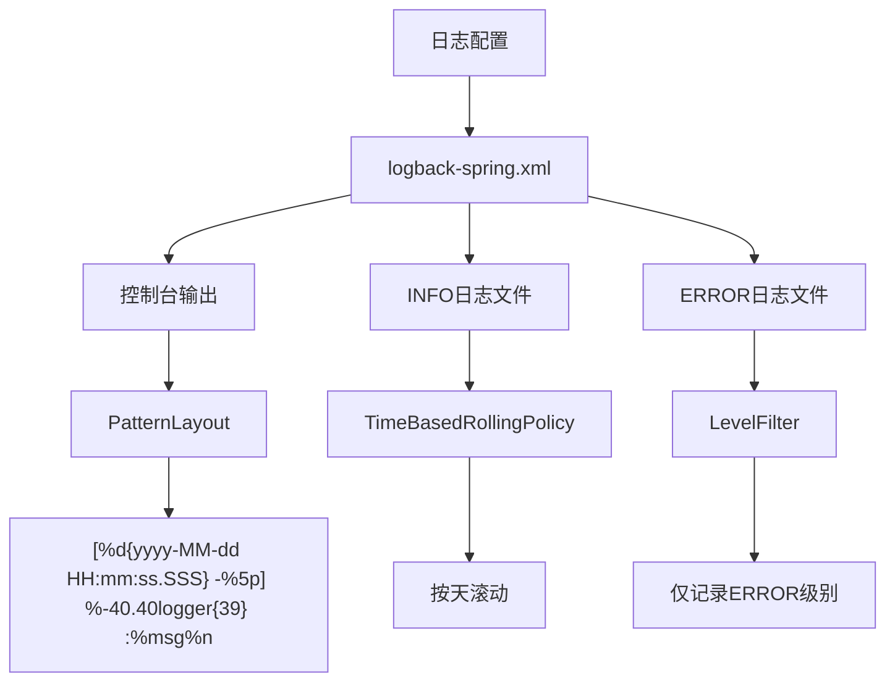
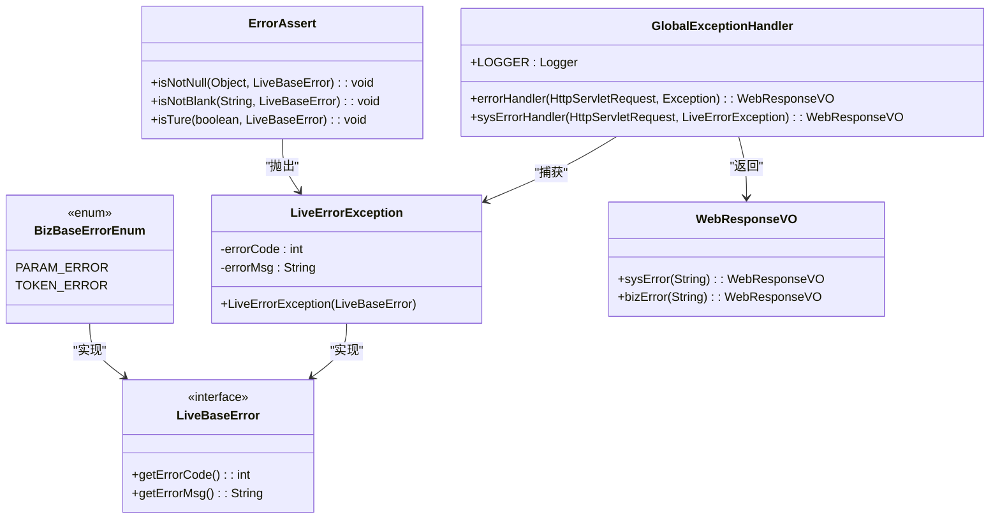
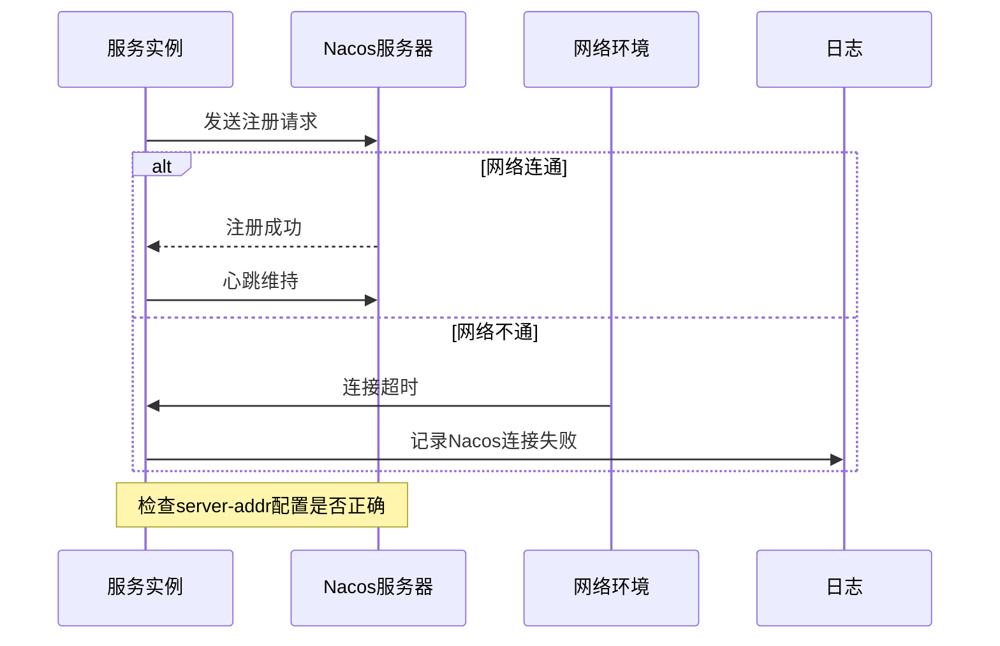
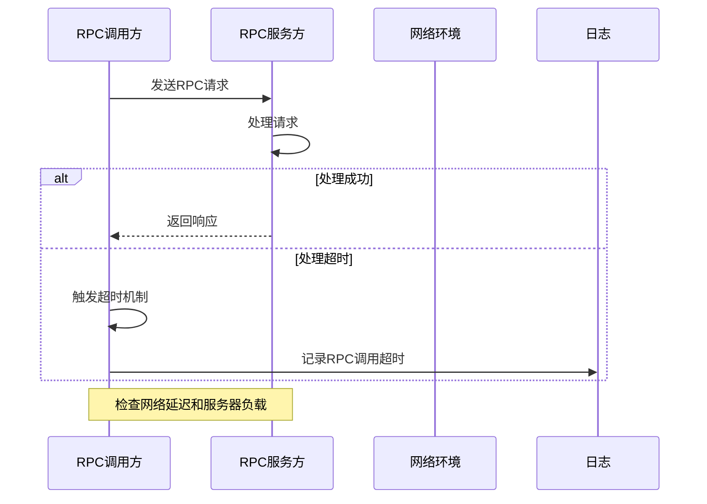
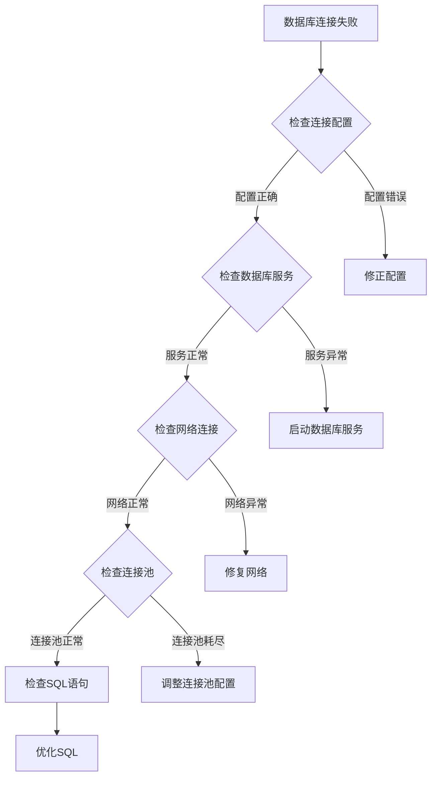
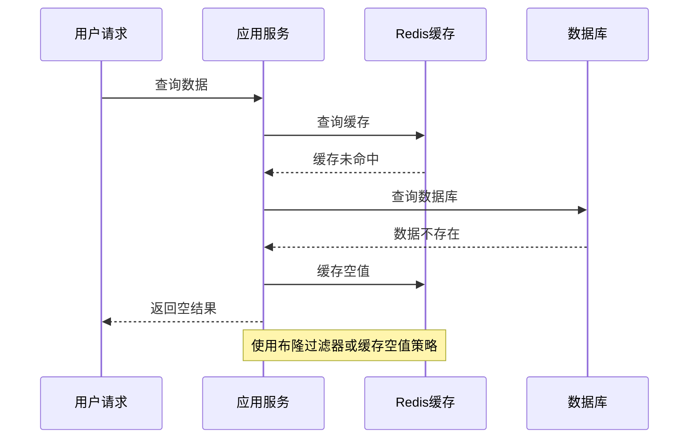
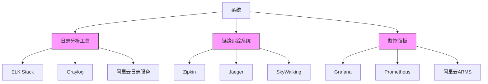

# 故障排查

<cite>
**本文档中引用的文件**  
- [GlobalExceptionHandler.java](file://live-framework/live-framework-web-starter/src/main/java/com/logilong/live/web/starter/error/GlobalExceptionHandler.java)
- [LiveErrorException.java](file://live-framework/live-framework-web-starter/src/main/java/com/logilong/live/web/starter/error/LiveErrorException.java)
- [LiveBaseError.java](file://live-framework/live-framework-web-starter/src/main/java/com/logilong/live/web/starter/error/LiveBaseError.java)
- [BizBaseErrorEnum.java](file://live-framework/live-framework-web-starter/src/main/java/com/logilong/live/web/starter/error/BizBaseErrorEnum.java)
- [ErrorAssert.java](file://live-framework/live-framework-web-starter/src/main/java/com/logilong/live/web/starter/error/ErrorAssert.java)
- [logback-spring.xml](file://live-account-provider/src/main/resources/logback-spring.xml)
- [bootstrap.yml](file://live-account-provider/src/main/resources/bootstrap.yml)
- [NacosDriverURLProvider.java](file://live-framework/live-framework-datasource-starter/src/main/java/com/logilong/live/framework/datasource/starter/config/NacosDriverURLProvider.java)
- [ImRouterCluster.java](file://live-im-router-provider/src/main/java/com/logilong/live/im/router/provider/cluster/ImRouterCluster.java)
- [ImRouterClusterInvoker.java](file://live-im-router-provider/src/main/java/com/logilong/live/im/router/provider/cluster/ImRouterClusterInvoker.java)
- [RouterHandlerRPCImpl.java](file://live-im-core-server/src/main/java/com/logilong/live/im/core/server/rpc/RouterHandlerRPCImpl.java)
- [ImRouterRPCImpl.java](file://live-im-router-provider/src/main/java/com/logilong/live/im/router/provider/rpc/ImRouterRPCImpl.java)
- [UserRPCImpl.java](file://live-user-provider/src/main/java/com/logilong/live/user/provider/rpc/UserRPCImpl.java)
</cite>

## 目录
1. [简介](#简介)
2. [日志配置与异常堆栈定位](#日志配置与异常堆栈定位)
3. [全局异常处理器](#全局异常处理器)
4. [典型问题场景排查](#典型问题场景排查)
5. [日志分析与监控工具推荐](#日志分析与监控工具推荐)
6. [关键日志关键字搜索建议](#关键日志关键字搜索建议)
7. [调试技巧](#调试技巧)
8. [结论](#结论)

## 简介
本手册旨在为开发者提供一套实用的故障排查指南，帮助快速定位和解决直播平台系统中的常见问题。文档重点介绍如何通过logback-spring.xml配置的日志输出定位异常堆栈，以及全局异常处理器如何标准化错误响应并记录关键上下文信息。同时，针对服务注册、RPC调用、数据库连接、缓存和消息队列等常见问题场景提供具体的排查步骤与解决方案。

## 日志配置与异常堆栈定位



**图源**  
- [logback-spring.xml](file://live-account-provider/src/main/resources/logback-spring.xml)

**本节来源**  
- [logback-spring.xml](file://live-account-provider/src/main/resources/logback-spring.xml)

### 日志配置详解
系统采用Logback作为日志框架，所有微服务模块均使用统一的`logback-spring.xml`配置文件。该配置定义了三个主要的日志输出通道：

1. **控制台输出(CONSOLE)**：将日志输出到控制台，便于开发和调试
2. **INFO日志文件(INFO_FILE)**：记录INFO级别及以上的日志到`${LOG_HOME}/${APP_NAME}.log`文件
3. **ERROR日志文件(ERROR_FILE)**：专门记录ERROR级别的日志到`${LOG_HOME}/${APP_NAME}_error.log`文件

日志格式采用统一的模式：`[%d{yyyy-MM-dd HH:mm:ss.SSS} -%5p] %-40.40logger{39} :%msg%n"`，包含时间戳、日志级别、类名和消息内容，便于快速定位问题。

日志文件采用基于时间的滚动策略，每天生成一个新的日志文件，并保留最近一个月的日志归档。

## 全局异常处理器



**图源**  
- [GlobalExceptionHandler.java](file://live-framework/live-framework-web-starter/src/main/java/com/logilong/live/web/starter/error/GlobalExceptionHandler.java)
- [LiveErrorException.java](file://live-framework/live-framework-web-starter/src/main/java/com/logilong/live/web/starter/error/LiveErrorException.java)
- [LiveBaseError.java](file://live-framework/live-framework-web-starter/src/main/java/com/logilong/live/web/starter/error/LiveBaseError.java)
- [BizBaseErrorEnum.java](file://live-framework/live-framework-web-starter/src/main/java/com/logilong/live/web/starter/error/BizBaseErrorEnum.java)
- [ErrorAssert.java](file://live-framework/live-framework-web-starter/src/main/java/com/logilong/live/web/starter/error/ErrorAssert.java)

**本节来源**  
- [GlobalExceptionHandler.java](file://live-framework/live-framework-web-starter/src/main/java/com/logilong/live/web/starter/error/GlobalExceptionHandler.java)
- [LiveErrorException.java](file://live-framework/live-framework-web-starter/src/main/java/com/logilong/live/web/starter/error/LiveErrorException.java)
- [LiveBaseError.java](file://live-framework/live-framework-web-starter/src/main/java/com/logilong/live/web/starter/error/LiveBaseError.java)
- [BizBaseErrorEnum.java](file://live-framework/live-framework-web-starter/src/main/java/com/logilong/live/web/starter/error/BizBaseErrorEnum.java)
- [ErrorAssert.java](file://live-framework/live-framework-web-starter/src/main/java/com/logilong/live/web/starter/error/ErrorAssert.java)

### 异常处理机制
系统通过`GlobalExceptionHandler`实现全局异常处理，采用@ControllerAdvice注解对所有控制器进行统一异常捕获。

#### 异常处理流程
1. **系统异常处理**：当发生未捕获的Exception时，`errorHandler`方法会被触发，记录完整的异常堆栈，并返回统一的系统异常响应。
2. **业务异常处理**：当发生`LiveErrorException`时，`sysErrorHandler`方法会被触发，记录异常码和消息，并返回标准化的业务异常响应。

#### 异常类型
- **系统异常**：未预期的运行时异常，如空指针、数组越界等
- **业务异常**：预期内的业务逻辑异常，如参数校验失败、权限不足等

#### 异常断言工具
`ErrorAssert`类提供了常用的异常断言方法，包括：
- `isNotNull`：检查对象不为空
- `isNotBlank`：检查字符串不为空
- `isTure`：检查条件为真

这些方法在参数校验时会抛出`LiveErrorException`，确保异常信息的一致性和可追溯性。

## 典型问题场景排查

### 服务无法注册到Nacos



**图源**  
- [bootstrap.yml](file://live-account-provider/src/main/resources/bootstrap.yml)

**本节来源**  
- [bootstrap.yml](file://live-account-provider/src/main/resources/bootstrap.yml)

#### 排查步骤
1. **检查Nacos配置**：确认`bootstrap.yml`中的`server-addr`配置是否正确，当前配置为`live-server:8848`
2. **验证网络连通性**：使用ping或telnet命令测试与Nacos服务器的网络连接
3. **检查命名空间**：确认`namespace`配置是否正确，当前为`live-test`
4. **查看日志**：在服务启动日志中搜索"Nacos"相关错误信息
5. **验证认证信息**：确认用户名和密码配置是否正确

#### 解决方案
- 确保Nacos服务器正常运行
- 检查防火墙设置，确保端口8848可访问
- 验证网络配置，确保服务实例能访问Nacos服务器
- 检查服务名称是否冲突

### RPC调用超时



**图源**  
- [UserRPCImpl.java](file://live-user-provider/src/main/java/com/logilong/live/user/provider/rpc/UserRPCImpl.java)
- [RouterHandlerRPCImpl.java](file://live-im-core-server/src/main/java/com/logilong/live/im/core/server/rpc/RouterHandlerRPCImpl.java)

**本节来源**  
- [UserRPCImpl.java](file://live-user-provider/src/main/java/com/logilong/live/user/provider/rpc/UserRPCImpl.java)
- [RouterHandlerRPCImpl.java](file://live-im-core-server/src/main/java/com/logilong/live/im/core/server/rpc/RouterHandlerRPCImpl.java)

#### 排查步骤
1. **检查调用链路**：确认RPC调用的完整链路，包括调用方、服务方和网络路径
2. **查看日志**：在调用方和服务方的日志中搜索RPC相关错误信息
3. **检查超时配置**：确认Dubbo的超时时间配置是否合理
4. **监控服务器负载**：检查服务方服务器的CPU、内存使用情况
5. **分析网络延迟**：测量调用方和服务方之间的网络延迟

#### 解决方案
- 优化服务方处理逻辑，减少响应时间
- 调整RPC超时配置，根据实际业务需求设置合理的超时时间
- 增加服务方实例，提高处理能力
- 优化网络环境，减少网络延迟

### 数据库连接失败



**图源**  
- [NacosDriverURLProvider.java](file://live-framework/live-framework-datasource-starter/src/main/java/com/logilong/live/framework/datasource/starter/config/NacosDriverURLProvider.java)

**本节来源**  
- [NacosDriverURLProvider.java](file://live-framework/live-framework-datasource-starter/src/main/java/com/logilong/live/framework/datasource/starter/config/NacosDriverURLProvider.java)

#### 排查步骤
1. **检查连接配置**：确认数据库连接URL、用户名、密码等配置是否正确
2. **验证数据库服务**：检查数据库服务器是否正常运行
3. **测试网络连接**：使用数据库客户端工具测试连接
4. **查看连接池状态**：检查连接池是否已耗尽
5. **分析慢查询**：检查是否存在执行时间过长的SQL语句

#### 解决方案
- 修正错误的数据库连接配置
- 启动或重启数据库服务
- 优化网络配置，确保连接稳定
- 调整连接池大小，避免连接耗尽
- 优化SQL语句，提高查询效率

### 缓存穿透



**图源**  
- [ImRouterRPCImpl.java](file://live-im-router-provider/src/main/java/com/logilong/live/im/router/provider/rpc/ImRouterRPCImpl.java)

**本节来源**  
- [ImRouterRPCImpl.java](file://live-im-router-provider/src/main/java/com/logilong/live/im/router/provider/rpc/ImRouterRPCImpl.java)

#### 排查步骤
1. **监控缓存命中率**：检查Redis缓存的命中率指标
2. **分析查询模式**：识别频繁查询但不存在的数据
3. **查看日志**：搜索缓存未命中的相关日志
4. **检查数据分布**：分析热点数据的分布情况

#### 解决方案
- 实现缓存空值策略，对不存在的数据也进行缓存
- 使用布隆过滤器预判数据是否存在
- 设置合理的缓存过期时间
- 实现热点数据预加载机制

### 消息积压

```mermaid
flowchart LR
A[消息生产者] --> B[消息队列]
B --> C[消息消费者]
subgraph 问题分析
D[消息积压] --> E{生产速度 > 消费速度}
E --> |生产过快| F[限流生产者]
E --> |消费过慢| G[优化消费者]
E --> |消费者异常| H[修复消费者]
end
Note: 监控消息队列长度和消费速率
```

**图源**  
- [ImRouterRPCImpl.java](file://live-im-router-provider/src/main/java/com/logilong/live/im/router/provider/rpc/ImRouterRPCImpl.java)

**本节来源**  
- [ImRouterRPCImpl.java](file://live-im-router-provider/src/main/java/com/logilong/live/im/router/provider/rpc/ImRouterRPCImpl.java)

#### 排查步骤
1. **监控队列长度**：实时监控消息队列的积压情况
2. **分析生产速率**：检查消息生产者的发送频率
3. **评估消费能力**：测量消费者的处理速度
4. **检查消费者状态**：确认消费者服务是否正常运行
5. **查看日志**：搜索消息处理失败的相关日志

#### 解决方案
- 增加消费者实例，提高消费能力
- 优化消费者处理逻辑，提高处理效率
- 实现消息生产限流，控制生产速率
- 设置消息过期策略，避免无限积压

## 日志分析与监控工具推荐



**图源**  
- [logback-spring.xml](file://live-account-provider/src/main/resources/logback-spring.xml)

**本节来源**  
- [logback-spring.xml](file://live-account-provider/src/main/resources/logback-spring.xml)

### 日志分析工具
1. **ELK Stack**：Elasticsearch、Logstash、Kibana组合，适用于大规模日志分析
2. **Graylog**：开源的日志管理平台，提供强大的搜索和分析功能
3. **阿里云日志服务**：云原生的日志解决方案，集成度高，易于使用

### 链路追踪系统
1. **Zipkin**：Twitter开源的分布式追踪系统，轻量级，易于集成
2. **Jaeger**：Uber开源的分布式追踪系统，功能丰富，性能优秀
3. **SkyWalking**：Apache开源的APM系统，支持多种语言和框架

### 监控面板
1. **Grafana**：开源的可视化监控平台，支持多种数据源
2. **Prometheus**：开源的监控系统，特别适合云原生环境
3. **阿里云ARMS**：云原生应用监控服务，提供端到端的监控能力

## 关键日志关键字搜索建议

| 日志类型 | 关键字 | 说明 |
|---------|-------|------|
| 系统异常 | "error is" | 全局异常处理器记录的系统异常 |
| 业务异常 | "error code is" | 全局异常处理器记录的业务异常码 |
| Nacos注册 | "nacos" | 与Nacos服务相关的日志 |
| RPC调用 | "Dubbo" | Dubbo RPC框架相关的日志 |
| 数据库连接 | "Connection" | 数据库连接相关的日志 |
| 缓存操作 | "Redis" | Redis缓存相关的日志 |
| 消息队列 | "MQ" | 消息队列相关的日志 |
| 请求处理 | "requestURI" | HTTP请求处理相关的日志 |

**本节来源**  
- [GlobalExceptionHandler.java](file://live-framework/live-framework-web-starter/src/main/java/com/logilong/live/web/starter/error/GlobalExceptionHandler.java)
- [logback-spring.xml](file://live-account-provider/src/main/resources/logback-spring.xml)

## 调试技巧

### 线程本地变量调试
系统使用`LiveRequestContext`实现线程本地变量存储，用于在请求处理过程中传递上下文信息。

```java
// 设置上下文
LiveRequestContext.set(RequestConstants.LIVE_USER_ID, userId);

// 获取上下文
Long userId = LiveRequestContext.getUserId();

// 清理上下文
LiveRequestContext.clear();
```

### 自定义RPC路由调试
系统实现了基于IP的自定义RPC路由策略，通过`ImRouterClusterInvoker`实现。

```java
// 在RPC调用上下文中传递IP
RpcContext.getContext().set("ip", targetIp);
```

### 日志级别调整
在调试过程中，可以通过调整日志级别来获取更详细的信息：

```yaml
# 在bootstrap.yml中调整日志级别
logging:
  level:
    org.springframework.cloud.gateway: DEBUG
    reactor.netty.http.client: DEBUG
```

**本节来源**  
- [LiveRequestContext.java](file://live-framework/live-framework-web-starter/src/main/java/com/logilong/live/web/starter/context/LiveRequestContext.java)
- [ImRouterClusterInvoker.java](file://live-im-router-provider/src/main/java/com/logilong/live/im/router/provider/cluster/ImRouterClusterInvoker.java)
- [bootstrap.yml](file://live-gateway/src/main/resources/bootstrap.yml)

## 结论
本故障排查手册提供了针对直播平台系统的全面故障诊断指南。通过理解系统的日志配置、异常处理机制和典型问题场景，开发者可以更快速地定位和解决生产环境中的问题。建议结合日志分析工具、链路追踪系统和监控面板，建立完整的可观测性体系，提高系统的稳定性和可维护性。