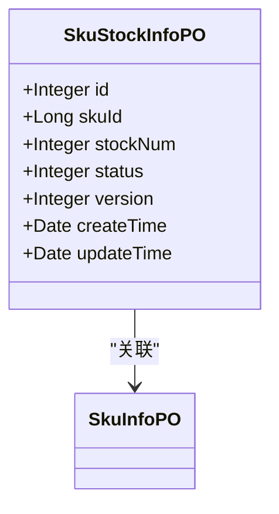
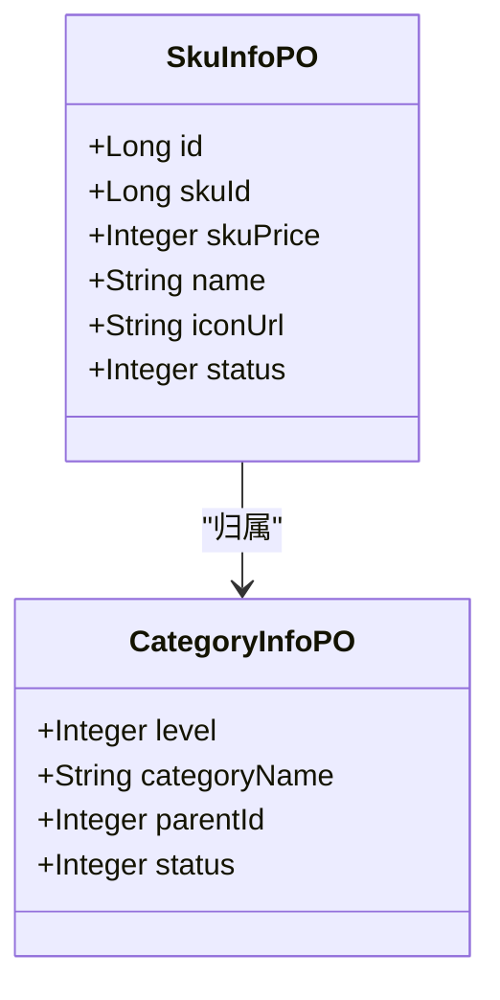
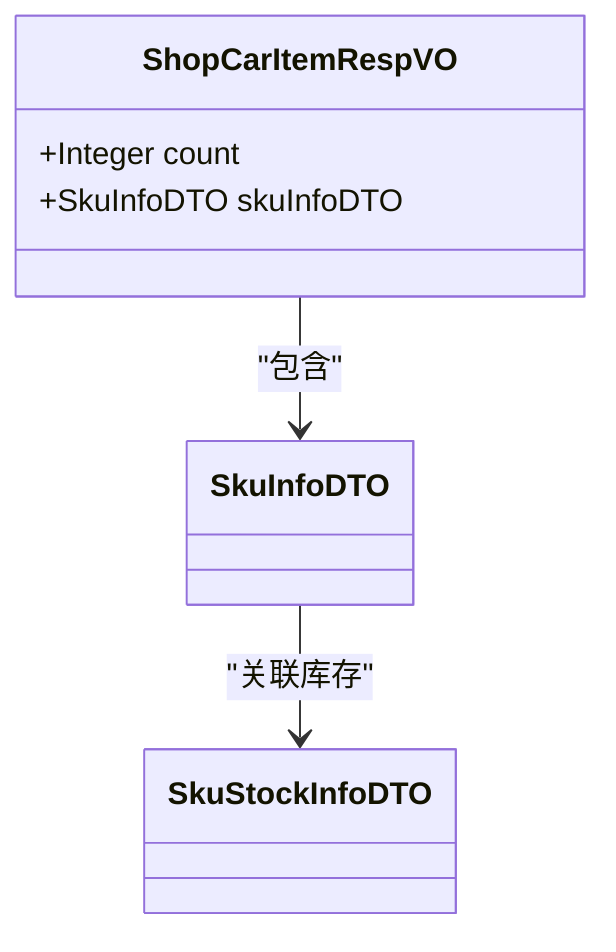
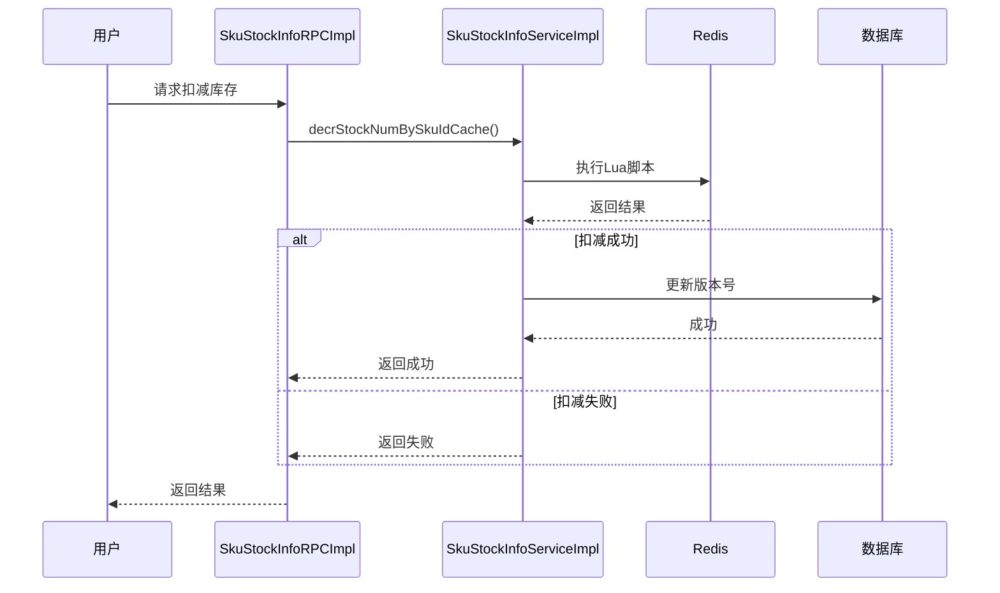
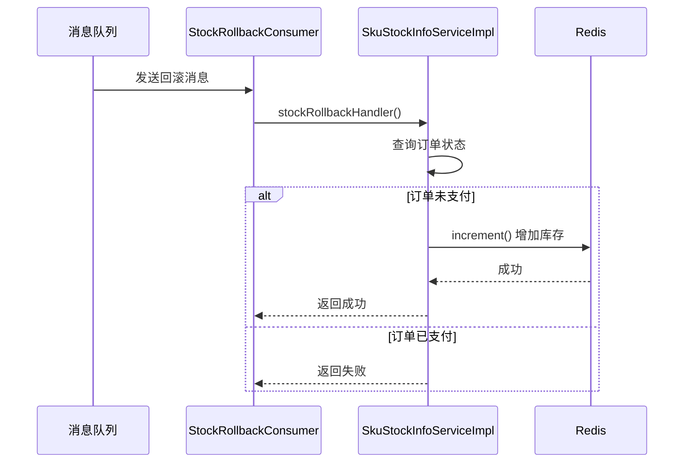
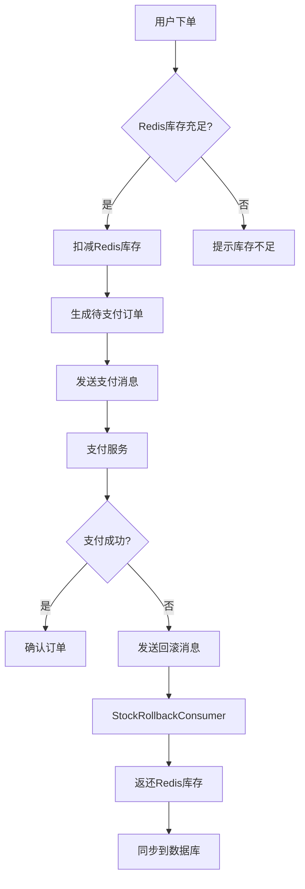
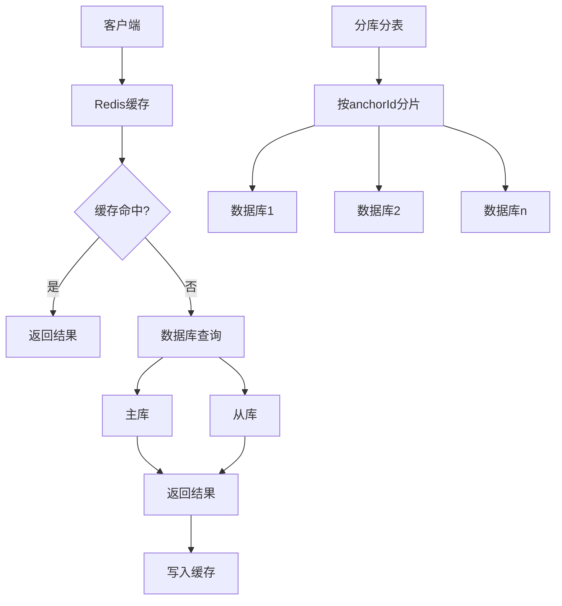

# 商品与库存数据模型

<cite>
**本文档引用的文件**  
- [SkuStockInfoPO.java](file://live-sku-provider/src/main/java/com/logilong/live/sku/provider/dao/po/SkuStockInfoPO.java)
- [SkuInfoPO.java](file://live-sku-provider/src/main/java/com/logilong/live/sku/provider/dao/po/SkuInfoPO.java)
- [CategoryInfoPO.java](file://live-sku-provider/src/main/java/com/logilong/live/sku/provider/dao/po/CategoryInfoPO.java)
- [ShopCarItemRespVO.java](file://live-api/src/main/java/com/logilong/live/api/vo/resp/ShopCarItemRespVO.java)
- [DecrStockNumBO.java](file://live-sku-provider/src/main/java/com/logilong/live/sku/provider/service/bo/DecrStockNumBO.java)
- [StockRollbackConsumer.java](file://live-sku-provider/src/main/java/com/logilong/live/sku/provider/consumer/StockRollbackConsumer.java)
- [getPkNumAndSeqId.lua](file://live-gift-provider/src/main/resources/getPkNumAndSeqId.lua)
- [SkuStockInfoDTO.java](file://live-sku-interface/src/main/java/com/logilong/live/sku/dto/SkuStockInfoDTO.java)
- [RollbackStockInfoDTO.java](file://live-sku-interface/src/main/java/com/logilong/live/sku/dto/RollbackStockInfoDTO.java)
- [SkuStockInfoServiceImpl.java](file://live-sku-provider/src/main/java/com/logilong/live/sku/provider/service/impl/SkuStockInfoServiceImpl.java)
- [SkuStockInfoRPCImpl.java](file://live-sku-provider/src/main/java/com/logilong/live/sku/provider/rpc/SkuStockInfoRPCImpl.java)
- [ISkuStockInfoMapper.java](file://live-sku-provider/src/main/java/com/logilong/live/sku/provider/dao/mapper/ISkuStockInfoMapper.java)
- [SkuOrderInfoEnum.java](file://live-sku-interface/src/main/java/com/logilong/live/sku/constants/SkuOrderInfoEnum.java)
</cite>

## 目录
1. [商品库存数据模型](#商品库存数据模型)
2. [商品信息与分类模型](#商品信息与分类模型)
3. [购物车与库存关联](#购物车与库存关联)
4. [库存扣减业务流程](#库存扣减业务流程)
5. [库存回滚机制](#库存回滚机制)
6. [Redis Lua脚本保证原子性](#redis-lua脚本保证原子性)
7. [分布式事务与消息队列解决方案](#分布式事务与消息队列解决方案)
8. [库存查询索引优化与分库分表策略](#库存查询索引优化与分库分表策略)

## 商品库存数据模型

商品库存数据模型 `SkuStockInfoPO` 是系统中管理商品库存的核心实体类，定义了SKU ID、库存数量、状态和版本号等关键字段，用于支持高并发场景下的库存管理。



**图示来源**  
- [SkuStockInfoPO.java](file://live-sku-provider/src/main/java/com/logilong/live/sku/provider/dao/po/SkuStockInfoPO.java#L1-L22)
- [SkuInfoPO.java](file://live-sku-provider/src/main/java/com/logilong/live/sku/provider/dao/po/SkuInfoPO.java#L1-L27)

**字段说明：**
- **skuId**: 商品唯一标识，与 `SkuInfoPO` 关联
- **stockNum**: 当前库存数量，支持扣减与回滚
- **status**: 库存状态，通过 `CommonStatusEnum` 管理有效/无效状态
- **version**: 乐观锁版本号，用于数据库更新时防止并发冲突

**本节来源**  
- [SkuStockInfoPO.java](file://live-sku-provider/src/main/java/com/logilong/live/sku/provider/dao/po/SkuStockInfoPO.java#L1-L22)
- [SkuStockInfoDTO.java](file://live-sku-interface/src/main/java/com/logilong/live/sku/dto/SkuStockInfoDTO.java#L1-L18)

## 商品信息与分类模型

商品信息 `SkuInfoPO` 和分类 `CategoryInfoPO` 构成了商品基础数据结构，支持商品展示、分类导航和库存联动。



**图示来源**  
- [SkuInfoPO.java](file://live-sku-provider/src/main/java/com/logilong/live/sku/provider/dao/po/SkuInfoPO.java#L1-L27)
- [CategoryInfoPO.java](file://live-sku-provider/src/main/java/com/logilong/live/sku/provider/dao/po/CategoryInfoPO.java#L1-L22)

**关联关系：**
- `SkuInfoPO` 通过 `skuId` 与 `SkuStockInfoPO` 关联，实现库存查询
- `CategoryInfoPO` 支持树形分类结构，`parentId` 指向上级分类

**本节来源**  
- [SkuInfoPO.java](file://live-sku-provider/src/main/java/com/logilong/live/sku/provider/dao/po/SkuInfoPO.java#L1-L27)
- [CategoryInfoPO.java](file://live-sku-provider/src/main/java/com/logilong/live/sku/provider/dao/po/CategoryInfoPO.java#L1-L22)

## 购物车与库存关联

购物车项 `ShopCarItemRespVO` 包含商品信息和数量，通过 `SkuInfoDTO` 与库存系统联动，实现下单前的库存校验。



**图示来源**  
- [ShopCarItemRespVO.java](file://live-api/src/main/java/com/logilong/live/api/vo/resp/ShopCarItemRespVO.java#L1-L23)
- [SkuStockInfoDTO.java](file://live-sku-interface/src/main/java/com/logilong/live/sku/dto/SkuStockInfoDTO.java#L1-L18)

**数据流：**
1. 用户添加商品到购物车
2. 系统通过 `skuId` 查询 `SkuInfoPO` 和 `SkuStockInfoPO`
3. 返回 `ShopCarItemRespVO` 包含商品信息和当前库存状态

**本节来源**  
- [ShopCarItemRespVO.java](file://live-api/src/main/java/com/logilong/live/api/vo/resp/ShopCarItemRespVO.java#L1-L23)
- [SkuInfoPO.java](file://live-sku-provider/src/main/java/com/logilong/live/sku/provider/dao/po/SkuInfoPO.java#L1-L27)

## 库存扣减业务流程

库存扣减通过 `DecrStockNumBO` 业务对象封装结果，支持数据库和Redis双层扣减，确保高并发下的数据一致性。



**图示来源**  
- [SkuStockInfoRPCImpl.java](file://live-sku-provider/src/main/java/com/logilong/live/sku/provider/rpc/SkuStockInfoRPCImpl.java#L1-L104)
- [SkuStockInfoServiceImpl.java](file://live-sku-provider/src/main/java/com/logilong/live/sku/provider/service/impl/SkuStockInfoServiceImpl.java#L1-L151)

**流程说明：**
1. 优先通过Redis Lua脚本扣减缓存库存，保证原子性
2. 扣减成功后异步更新数据库库存和版本号
3. 失败时返回 `DecrStockNumBO` 包含 `isSuccess` 和 `isEmptyStock` 状态

**本节来源**  
- [DecrStockNumBO.java](file://live-sku-provider/src/main/java/com/logilong/live/sku/provider/service/bo/DecrStockNumBO.java#L1-L17)
- [SkuStockInfoServiceImpl.java](file://live-sku-provider/src/main/java/com/logilong/live/sku/provider/service/impl/SkuStockInfoServiceImpl.java#L1-L151)

## 库存回滚机制

库存回滚通过消息队列实现，`StockRollbackConsumer` 监听订单关闭消息，将库存返还至Redis缓存。



**图示来源**  
- [StockRollbackConsumer.java](file://live-sku-provider/src/main/java/com/logilong/live/sku/provider/consumer/StockRollbackConsumer.java#L1-L52)
- [SkuStockInfoServiceImpl.java](file://live-sku-provider/src/main/java/com/logilong/live/sku/provider/service/impl/SkuStockInfoServiceImpl.java#L1-L151)

**关键逻辑：**
- 使用RocketMQ监听 `ROLL_BACK_STOCK` 主题
- 校验订单状态是否为 `PREPARE_PAY` 或 `END`
- 通过 `redisTemplate.opsForValue().increment()` 原子性增加库存

**本节来源**  
- [StockRollbackConsumer.java](file://live-sku-provider/src/main/java/com/logilong/live/sku/provider/consumer/StockRollbackConsumer.java#L1-L52)
- [RollbackStockInfoDTO.java](file://live-sku-interface/src/main/java/com/logilong/live/sku/dto/RollbackStockInfoDTO.java#L1-L17)
- [SkuOrderInfoEnum.java](file://live-sku-interface/src/main/java/com/logilong/live/sku/constants/SkuOrderInfoEnum.java#L1-L18)

## Redis Lua脚本保证原子性

系统使用Lua脚本确保库存扣减的原子性，避免高并发下的超卖问题。

```lua
-- Lua脚本逻辑
if (redis.call('exists',KEYS[1])) == 1 then 
    local currentStock=redis.call('get',KEYS[1])  
    if (tonumber(currentStock)>0 and tonumber(currentStock)-tonumber(ARGV[1])>=0) then 
        return redis.call('decrby',KEYS[1],tonumber(ARGV[1])) 
    else return -1 end 
else 
    return -1 end
```

**脚本说明：**
- 检查库存Key是否存在
- 验证当前库存是否足够
- 原子性执行 `decrby` 操作
- 返回-1表示扣减失败

**本节来源**  
- [getPkNumAndSeqId.lua](file://live-gift-provider/src/main/resources/getPkNumAndSeqId.lua#L1-L17)
- [SkuStockInfoServiceImpl.java](file://live-sku-provider/src/main/java/com/logilong/live/sku/provider/service/impl/SkuStockInfoServiceImpl.java#L38-L58)

## 分布式事务与消息队列解决方案

系统通过"缓存+数据库+消息队列"三级架构解决超卖问题：



**核心机制：**
1. **预扣库存**：下单时扣减Redis库存，速度快
2. **异步持久化**：定时任务将Redis库存同步到数据库
3. **消息补偿**：支付失败时通过MQ触发库存回滚
4. **最终一致性**：保证库存数据最终一致

**本节来源**  
- [StockRollbackConsumer.java](file://live-sku-provider/src/main/java/com/logilong/live/sku/provider/consumer/StockRollbackConsumer.java#L1-L52)
- [SkuStockInfoRPCImpl.java](file://live-sku-provider/src/main/java/com/logilong/live/sku/provider/rpc/SkuStockInfoRPCImpl.java#L1-L104)
- [SkuStockInfoServiceImpl.java](file://live-sku-provider/src/main/java/com/logilong/live/sku/provider/service/impl/SkuStockInfoServiceImpl.java#L1-L151)

## 库存查询索引优化与分库分表策略

系统通过多级缓存和分库分表策略优化库存查询性能：



**优化策略：**
- **索引优化**：在 `t_sku_stock_info` 表的 `skuId` 字段建立唯一索引
- **分库分表**：按主播ID（anchorId）进行分片，降低单表数据量
- **缓存预热**：直播开始前通过 `prepareStockInfo` 接口预加载库存到Redis
- **定时同步**：通过 `RefreshSkuStockNumJob` 定时将Redis库存同步到数据库

**本节来源**  
- [SkuStockInfoRPCImpl.java](file://live-sku-provider/src/main/java/com/logilong/live/sku/provider/rpc/SkuStockInfoRPCImpl.java#L60-L83)
- [ISkuStockInfoMapper.java](file://live-sku-provider/src/main/java/com/logilong/live/sku/provider/dao/mapper/ISkuStockInfoMapper.java#L1-L18)
- [SkuStockInfoServiceImpl.java](file://live-sku-provider/src/main/java/com/logilong/live/sku/provider/service/impl/SkuStockInfoServiceImpl.java#L1-L151)