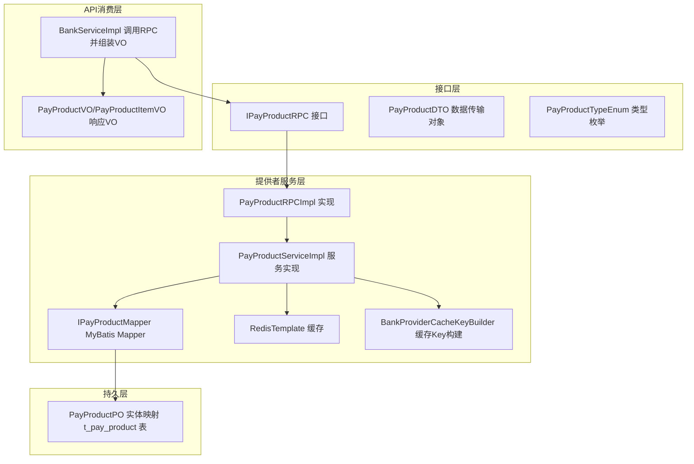
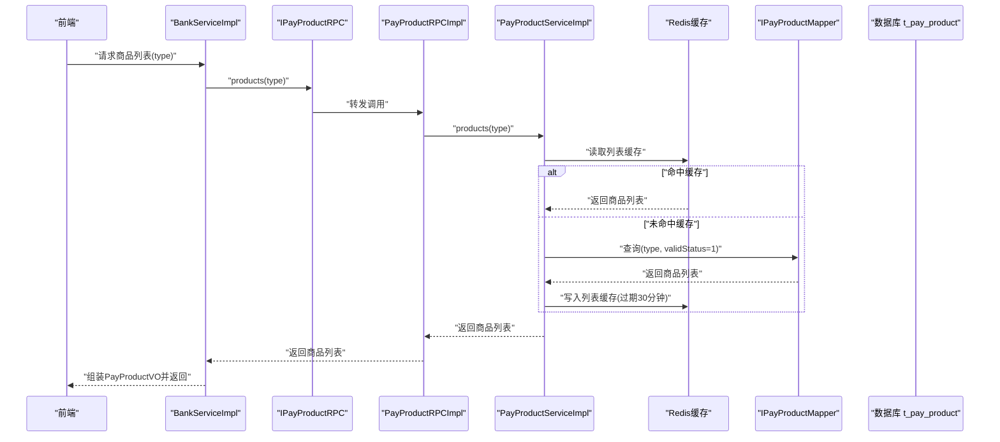
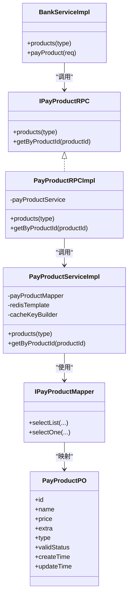

# 支付商品模型

<cite>
**本文引用的文件**
- [PayProductPO.java](file://live-bank-provider/src/main/java/com/logilong/live/bank/provider/dao/po/PayProductPO.java)
- [PayProductDTO.java](file://live-bank-interface/src/main/java/com/logilong/live/bank/dto/PayProductDTO.java)
- [IPayProductRPC.java](file://live-bank-interface/src/main/java/com/logilong/live/bank/interfaces/IPayProductRPC.java)
- [PayProductRPCImpl.java](file://live-bank-provider/src/main/java/com/logilong/live/bank/provider/rpc/PayProductRPCImpl.java)
- [PayProductServiceImpl.java](file://live-bank-provider/src/main/java/com/logilong/live/bank/provider/service/impl/PayProductServiceImpl.java)
- [IPayProductMapper.java](file://live-bank-provider/src/main/java/com/logilong/live/bank/provider/dao/mapper/IPayProductMapper.java)
- [PayProductTypeEnum.java](file://live-bank-interface/src/main/java/com/logilong/live/bank/constants/PayProductTypeEnum.java)
- [BankProviderCacheKeyBuilder.java](file://live-framework/live-framework-redis-starter/src/main/java/com/logilong/live/framework/redis/starter/key/BankProviderCacheKeyBuilder.java)
- [CommonStatusEnum.java](file://live-common-interface/src/main/java/com/logilong/live/common/interfaces/enums/CommonStatusEnum.java)
- [BankServiceImpl.java](file://live-api/src/main/java/com/logilong/live/api/service/impl/BankServiceImpl.java)
- [PayProductItemVO.java](file://live-api/src/main/java/com/logilong/live/api/vo/resp/PayProductItemVO.java)
- [PayProductVO.java](file://live-api/src/main/java/com/logilong/live/api/vo/resp/PayProductVO.java)
- [PayProductReqVO.java](file://live-api/src/main/java/com/logilong/live/api/vo/req/PayProductReqVO.java)
</cite>

## 目录
1. [简介](#简介)
2. [项目结构](#项目结构)
3. [核心组件](#核心组件)
4. [架构总览](#架构总览)
5. [详细组件分析](#详细组件分析)
6. [依赖关系分析](#依赖关系分析)
7. [性能考量](#性能考量)
8. [故障排查指南](#故障排查指南)
9. [结论](#结论)
10. [附录](#附录)

## 简介
本文件系统性地文档化支付商品实体（PayProductPO）的设计与用途，围绕以下目标展开：
- 字段定义与含义：id（主键）、name（商品名称）、price（价格，单位分）、extra（扩展信息，JSON格式存储业务参数）、type（商品类型，参考PayProductTypeEnum）、validStatus（有效状态）、createTime 和 updateTime。
- 虚拟商品体系支撑：重点说明LIVE_COIN类型商品在直播间充值场景中的应用。
- RPC 接口集成：IPayProductRPC 如何被 live-api 使用，以及数据流转过程。
- 商品状态管理：validStatus 对前端展示的控制逻辑。
- 缓存策略建议：基于 Redis 的热门商品列表缓存与失效机制。

## 项目结构
支付商品模型横跨“接口层”、“提供者服务层”、“持久层”和“API消费层”，形成清晰的分层职责：
- 接口层（live-bank-interface）：定义 RPC 接口、DTO、枚举常量。
- 提供者服务层（live-bank-provider）：实现 RPC 与服务逻辑，包含缓存策略。
- 持久层（live-bank-provider DAO）：MyBatis Mapper 映射数据库表。
- API消费层（live-api）：调用 RPC 获取商品列表，组装前端 VO 并参与下单流程。

图表来源
- [IPayProductRPC.java](file://live-bank-interface/src/main/java/com/logilong/live/bank/interfaces/IPayProductRPC.java#L1-L22)
- [PayProductRPCImpl.java](file://live-bank-provider/src/main/java/com/logilong/live/bank/provider/rpc/PayProductRPCImpl.java#L1-L27)
- [PayProductServiceImpl.java](file://live-bank-provider/src/main/java/com/logilong/live/bank/provider/service/impl/PayProductServiceImpl.java#L1-L81)
- [IPayProductMapper.java](file://live-bank-provider/src/main/java/com/logilong/live/bank/provider/dao/mapper/IPayProductMapper.java#L1-L10)
- [PayProductPO.java](file://live-bank-provider/src/main/java/com/logilong/live/bank/provider/dao/po/PayProductPO.java#L1-L27)
- [BankServiceImpl.java](file://live-api/src/main/java/com/logilong/live/api/service/impl/BankServiceImpl.java#L1-L93)
- [PayProductVO.java](file://live-api/src/main/java/com/logilong/live/api/vo/resp/PayProductVO.java#L1-L19)
- [PayProductItemVO.java](file://live-api/src/main/java/com/logilong/live/api/vo/resp/PayProductItemVO.java#L1-L12)

章节来源
- [IPayProductRPC.java](file://live-bank-interface/src/main/java/com/logilong/live/bank/interfaces/IPayProductRPC.java#L1-L22)
- [PayProductRPCImpl.java](file://live-bank-provider/src/main/java/com/logilong/live/bank/provider/rpc/PayProductRPCImpl.java#L1-L27)
- [PayProductServiceImpl.java](file://live-bank-provider/src/main/java/com/logilong/live/bank/provider/service/impl/PayProductServiceImpl.java#L1-L81)
- [IPayProductMapper.java](file://live-bank-provider/src/main/java/com/logilong/live/bank/provider/dao/mapper/IPayProductMapper.java#L1-L10)
- [PayProductPO.java](file://live-bank-provider/src/main/java/com/logilong/live/bank/provider/dao/po/PayProductPO.java#L1-L27)
- [BankServiceImpl.java](file://live-api/src/main/java/com/logilong/live/api/service/impl/BankServiceImpl.java#L1-L93)
- [PayProductVO.java](file://live-api/src/main/java/com/logilong/live/api/vo/resp/PayProductVO.java#L1-L19)
- [PayProductItemVO.java](file://live-api/src/main/java/com/logilong/live/api/vo/resp/PayProductItemVO.java#L1-L12)

## 核心组件
- PayProductPO：数据库实体，映射 t_pay_product 表，承载商品基础元信息与状态。
- PayProductDTO：跨进程传输对象，用于 RPC 传递商品数据。
- IPayProductRPC：商品查询 RPC 接口，提供按类型批量查询与按ID查询能力。
- PayProductRPCImpl：RPC 实现，转发到服务层。
- PayProductServiceImpl：核心业务实现，负责缓存策略、查询过滤与排序。
- IPayProductMapper：MyBatis Mapper，执行数据库读写。
- PayProductTypeEnum：商品类型枚举，当前包含 LIVE_COIN。
- BankProviderCacheKeyBuilder：Redis 缓存 Key 构建器，区分列表与单项缓存。
- BankServiceImpl：API 层消费 RPC，组装前端 VO，并参与下单流程。
- PayProductVO/PayProductItemVO：API 层响应 VO，向前端展示可用商品与余额。

章节来源
- [PayProductPO.java](file://live-bank-provider/src/main/java/com/logilong/live/bank/provider/dao/po/PayProductPO.java#L1-L27)
- [PayProductDTO.java](file://live-bank-interface/src/main/java/com/logilong/live/bank/dto/PayProductDTO.java#L1-L24)
- [IPayProductRPC.java](file://live-bank-interface/src/main/java/com/logilong/live/bank/interfaces/IPayProductRPC.java#L1-L22)
- [PayProductRPCImpl.java](file://live-bank-provider/src/main/java/com/logilong/live/bank/provider/rpc/PayProductRPCImpl.java#L1-L27)
- [PayProductServiceImpl.java](file://live-bank-provider/src/main/java/com/logilong/live/bank/provider/service/impl/PayProductServiceImpl.java#L1-L81)
- [IPayProductMapper.java](file://live-bank-provider/src/main/java/com/logilong/live/bank/provider/dao/mapper/IPayProductMapper.java#L1-L10)
- [PayProductTypeEnum.java](file://live-bank-interface/src/main/java/com/logilong/live/bank/constants/PayProductTypeEnum.java#L1-L17)
- [BankProviderCacheKeyBuilder.java](file://live-framework/live-framework-redis-starter/src/main/java/com/logilong/live/framework/redis/starter/key/BankProviderCacheKeyBuilder.java#L1-L37)
- [BankServiceImpl.java](file://live-api/src/main/java/com/logilong/live/api/service/impl/BankServiceImpl.java#L1-L93)
- [PayProductVO.java](file://live-api/src/main/java/com/logilong/live/api/vo/resp/PayProductVO.java#L1-L19)
- [PayProductItemVO.java](file://live-api/src/main/java/com/logilong/live/api/vo/resp/PayProductItemVO.java#L1-L12)

## 架构总览
下图展示了从 API 层发起商品查询，到提供者服务层通过 RPC 与缓存访问数据库，最终返回给前端的完整链路。

图表来源
- [BankServiceImpl.java](file://live-api/src/main/java/com/logilong/live/api/service/impl/BankServiceImpl.java#L1-L93)
- [IPayProductRPC.java](file://live-bank-interface/src/main/java/com/logilong/live/bank/interfaces/IPayProductRPC.java#L1-L22)
- [PayProductRPCImpl.java](file://live-bank-provider/src/main/java/com/logilong/live/bank/provider/rpc/PayProductRPCImpl.java#L1-L27)
- [PayProductServiceImpl.java](file://live-bank-provider/src/main/java/com/logilong/live/bank/provider/service/impl/PayProductServiceImpl.java#L1-L81)
- [IPayProductMapper.java](file://live-bank-provider/src/main/java/com/logilong/live/bank/provider/dao/mapper/IPayProductMapper.java#L1-L10)
- [PayProductPO.java](file://live-bank-provider/src/main/java/com/logilong/live/bank/provider/dao/po/PayProductPO.java#L1-L27)

## 详细组件分析

### PayProductPO 实体设计
- 字段说明
  - id：主键，自增。
  - name：商品名称。
  - price：价格，单位为分。
  - extra：扩展信息，JSON 字符串，用于存放业务参数（如 coin 字段表示虚拟币数量）。
  - type：商品类型，参考 PayProductTypeEnum。
  - validStatus：有效状态，配合 CommonStatusEnum 使用。
  - createTime/updateTime：创建与更新时间。
- 设计要点
  - 采用 MyBatis-Plus 注解映射表名与主键策略。
  - 与数据库表 t_pay_product 对应，字段一一对应。

章节来源
- [PayProductPO.java](file://live-bank-provider/src/main/java/com/logilong/live/bank/provider/dao/po/PayProductPO.java#L1-L27)

### 商品类型与虚拟币体系
- 类型枚举
  - LIVE_COIN：直播间充值-虚拟币产品，用于在直播场景中为用户充值虚拟币。
- 扩展参数
  - extra 中的 coin 字段用于标识充值后到账的虚拟币数量。
- 前端展示
  - API 层在组装 PayProductVO 时，解析 extra 中的 coin 字段填充到 PayProductItemVO.coinNum，用于前端展示“充值 X 金币”。

章节来源
- [PayProductTypeEnum.java](file://live-bank-interface/src/main/java/com/logilong/live/bank/constants/PayProductTypeEnum.java#L1-L17)
- [BankServiceImpl.java](file://live-api/src/main/java/com/logilong/live/api/service/impl/BankServiceImpl.java#L1-L93)
- [PayProductItemVO.java](file://live-api/src/main/java/com/logilong/live/api/vo/resp/PayProductItemVO.java#L1-L12)

### RPC 接口与调用链
- IPayProductRPC
  - products(type)：按类型批量返回商品列表。
  - getByProductId(productId)：按 ID 查询单个商品。
- PayProductRPCImpl
  - 将 RPC 请求转发至服务层实现。
- PayProductServiceImpl
  - products：按 type 与有效状态查询，按 price 降序返回；命中缓存直接返回，未命中则写入缓存。
  - getByProductId：按 id 与有效状态查询，命中缓存直接返回，未命中则写入缓存。
- API 层调用
  - BankServiceImpl 在 products(type) 中调用 RPC 获取商品列表，并解析 extra 中的 coin 字段，组装 PayProductVO 返回给前端。

章节来源
- [IPayProductRPC.java](file://live-bank-interface/src/main/java/com/logilong/live/bank/interfaces/IPayProductRPC.java#L1-L22)
- [PayProductRPCImpl.java](file://live-bank-provider/src/main/java/com/logilong/live/bank/provider/rpc/PayProductRPCImpl.java#L1-L27)
- [PayProductServiceImpl.java](file://live-bank-provider/src/main/java/com/logilong/live/bank/provider/service/impl/PayProductServiceImpl.java#L1-L81)
- [BankServiceImpl.java](file://live-api/src/main/java/com/logilong/live/api/service/impl/BankServiceImpl.java#L1-L93)

### 状态管理与前端展示控制
- 有效状态
  - 服务层在查询时统一过滤 validStatus=1 的记录，确保仅返回有效商品。
- 前端展示
  - API 层在组装 PayProductVO 时，会读取用户当前余额并一并返回，前端据此判断是否可进行充值操作。
- 异常兜底
  - 若缓存中无数据或查询为空，服务层会写入占位空对象并设置短期过期，避免缓存穿透导致的持续数据库压力。

章节来源
- [PayProductServiceImpl.java](file://live-bank-provider/src/main/java/com/logilong/live/bank/provider/service/impl/PayProductServiceImpl.java#L1-L81)
- [CommonStatusEnum.java](file://live-common-interface/src/main/java/com/logilong/live/common/interfaces/enums/CommonStatusEnum.java#L1-L17)
- [BankServiceImpl.java](file://live-api/src/main/java/com/logilong/live/api/service/impl/BankServiceImpl.java#L1-L93)

### 缓存策略与失效机制
- 缓存键构建
  - 列表缓存键：按 type 维度构建，避免不同业务场景混杂。
  - 单项缓存键：按 productId 维度构建，支持按 ID 精确缓存。
- 缓存读写
  - 列表缓存：命中直接返回；未命中查询数据库并写入列表缓存，过期时间较长（30 分钟）。
  - 单项缓存：命中直接返回；未命中查询数据库并写入单项缓存，过期时间适中（30 分钟），空结果写入短期缓存（1 分钟）。
- 失效机制
  - 通过过期时间自然失效。
  - 写入新值时先删除旧列表缓存再写入，保证一致性。
  - 可结合业务变更事件触发主动失效（建议在商品上下架或修改时刷新缓存）。

章节来源
- [BankProviderCacheKeyBuilder.java](file://live-framework/live-framework-redis-starter/src/main/java/com/logilong/live/framework/redis/starter/key/BankProviderCacheKeyBuilder.java#L1-L37)
- [PayProductServiceImpl.java](file://live-bank-provider/src/main/java/com/logilong/live/bank/provider/service/impl/PayProductServiceImpl.java#L1-L81)

### 下单流程中的商品使用
- API 层在发起支付时，会根据 productId 调用 RPC 获取商品详情，校验有效性后插入订单并进入支付流程。
- 订单状态流转由 IPayOrderRPC 完成，与商品查询解耦。

章节来源
- [BankServiceImpl.java](file://live-api/src/main/java/com/logilong/live/api/service/impl/BankServiceImpl.java#L1-L93)
- [PayProductReqVO.java](file://live-api/src/main/java/com/logilong/live/api/vo/req/PayProductReqVO.java#L1-L25)

## 依赖关系分析
- 组件耦合
  - API 层仅依赖接口层的 IPayProductRPC，不直接依赖提供者实现，降低耦合。
  - 提供者服务层通过 Mapper 访问数据库，缓存通过 RedisTemplate 统一管理。
- 关键依赖链
  - BankServiceImpl -> IPayProductRPC -> PayProductRPCImpl -> PayProductServiceImpl -> IPayProductMapper -> PayProductPO
- 循环依赖
  - 未发现循环依赖迹象，各层职责清晰。

图表来源
- [IPayProductRPC.java](file://live-bank-interface/src/main/java/com/logilong/live/bank/interfaces/IPayProductRPC.java#L1-L22)
- [PayProductRPCImpl.java](file://live-bank-provider/src/main/java/com/logilong/live/bank/provider/rpc/PayProductRPCImpl.java#L1-L27)
- [PayProductServiceImpl.java](file://live-bank-provider/src/main/java/com/logilong/live/bank/provider/service/impl/PayProductServiceImpl.java#L1-L81)
- [IPayProductMapper.java](file://live-bank-provider/src/main/java/com/logilong/live/bank/provider/dao/mapper/IPayProductMapper.java#L1-L10)
- [PayProductPO.java](file://live-bank-provider/src/main/java/com/logilong/live/bank/provider/dao/po/PayProductPO.java#L1-L27)
- [BankServiceImpl.java](file://live-api/src/main/java/com/logilong/live/api/service/impl/BankServiceImpl.java#L1-L93)

## 性能考量
- 缓存命中率
  - 列表缓存按 type 维度隔离，热点商品可长期驻留，显著降低数据库压力。
- 查询优化
  - 服务层按 type 与有效状态过滤，避免无效数据进入缓存。
  - 列表按 price 降序排序，便于前端展示高价值商品优先。
- 缓存写入策略
  - 使用列表缓存写入数组，规避某些版本的 putAll 兼容问题。
- 过期策略
  - 列表缓存较长过期时间，单项缓存中等过期时间，空结果短期过期，平衡一致性与性能。

章节来源
- [PayProductServiceImpl.java](file://live-bank-provider/src/main/java/com/logilong/live/bank/provider/service/impl/PayProductServiceImpl.java#L1-L81)

## 故障排查指南
- 商品未显示
  - 检查 validStatus 是否为有效状态。
  - 检查缓存是否命中，必要时清理对应 type 的列表缓存后重试。
- 价格排序异常
  - 确认数据库中 price 字段是否正确，服务层按 price 降序排序。
- extra 解析失败
  - 确认 extra 为合法 JSON，且包含 coin 字段。
- 缓存穿透
  - 若查询为空，服务层会写入短期占位对象，避免持续击穿数据库。

章节来源
- [PayProductServiceImpl.java](file://live-bank-provider/src/main/java/com/logilong/live/bank/provider/service/impl/PayProductServiceImpl.java#L1-L81)
- [CommonStatusEnum.java](file://live-common-interface/src/main/java/com/logilong/live/common/interfaces/enums/CommonStatusEnum.java#L1-L17)
- [BankServiceImpl.java](file://live-api/src/main/java/com/logilong/live/api/service/impl/BankServiceImpl.java#L1-L93)

## 结论
PayProductPO 作为支付商品的核心实体，通过清晰的字段设计与严格的类型/状态约束，支撑了虚拟商品体系，尤其在 LIVE_COIN 场景下的直播间充值。配合 IPayProductRPC 的 RPC 抽象与提供者侧的 Redis 缓存策略，实现了高性能、低延迟的商品查询与前端展示。通过有效的缓存失效与异常兜底机制，系统具备良好的稳定性与可维护性。

## 附录
- 字段定义一览
  - id：主键
  - name：商品名称
  - price：价格（分）
  - extra：扩展信息（JSON，含 coin 字段）
  - type：商品类型（参考 PayProductTypeEnum）
  - validStatus：有效状态（参考 CommonStatusEnum）
  - createTime/updateTime：创建与更新时间