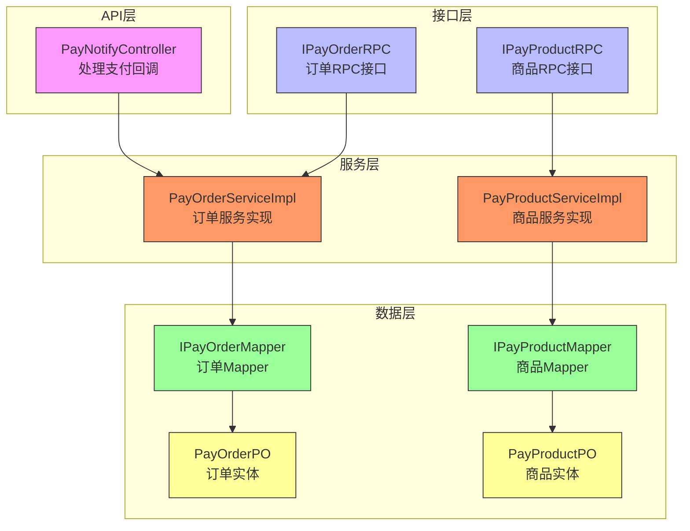
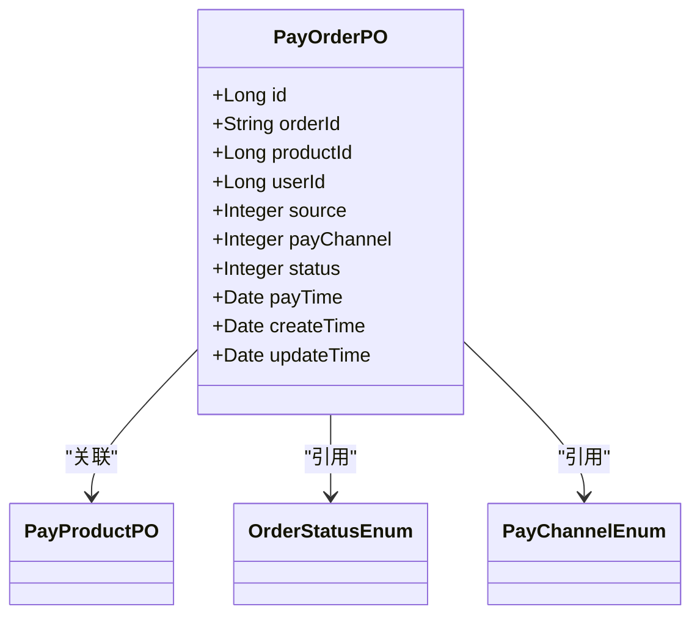
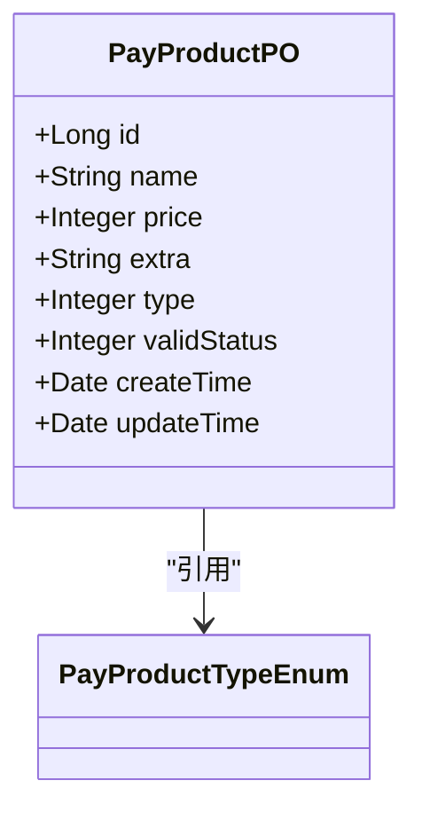
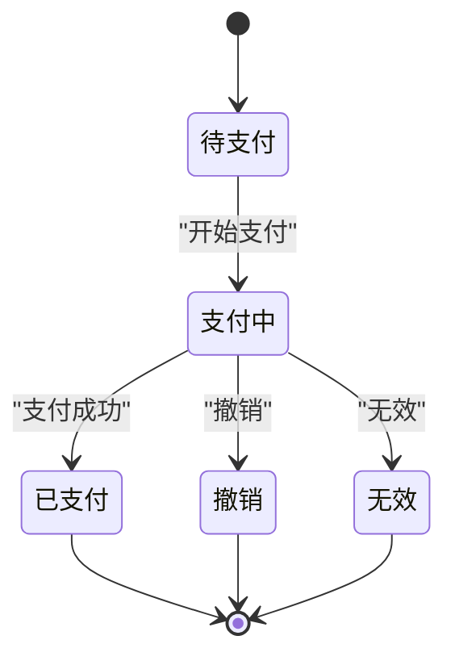
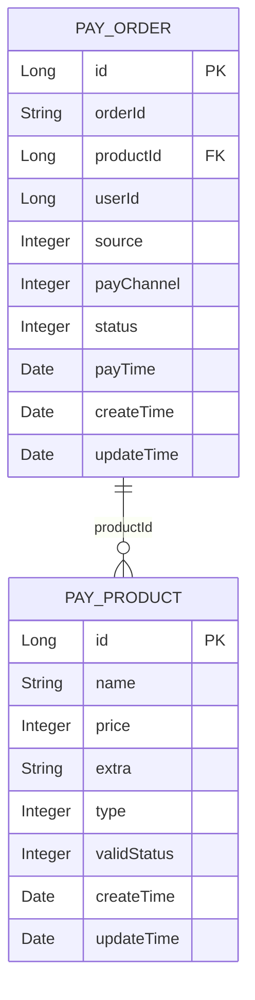
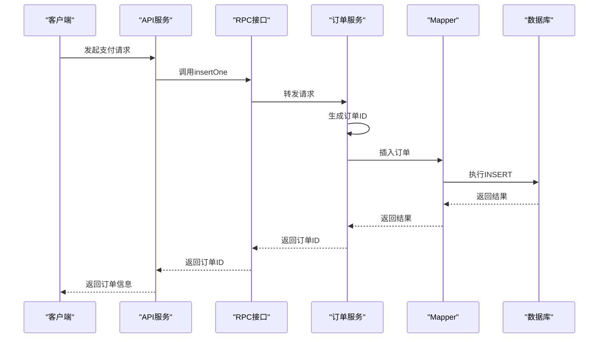
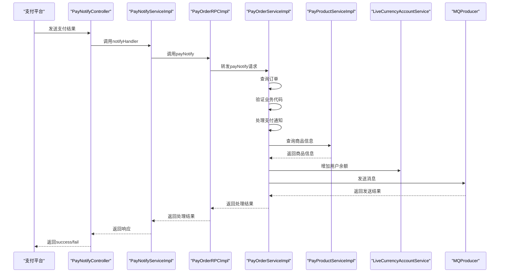
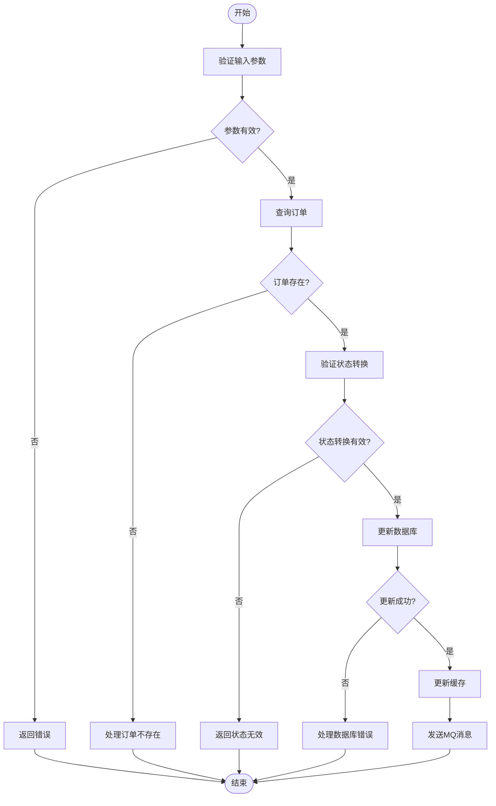
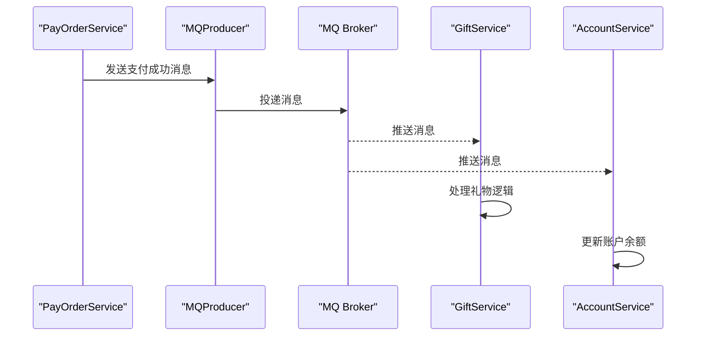

# 支付订单与商品模型

<cite>
**本文档引用的文件**   
- [PayOrderPO.java](file://live-bank-provider/src/main/java/com/logilong/live/bank/provider/dao/po/PayOrderPO.java)
- [PayProductPO.java](file://live-bank-provider/src/main/java/com/logilong/live/bank/provider/dao/po/PayProductPO.java)
- [OrderStatusEnum.java](file://live-bank-interface/src/main/java/com/logilong/live/bank/constants/OrderStatusEnum.java)
- [PayChannelEnum.java](file://live-bank-interface/src/main/java/com/logilong/live/bank/constants/PayChannelEnum.java)
- [TradeTypeEnum.java](file://live-bank-interface/src/main/java/com/logilong/live/bank/constants/TradeTypeEnum.java)
- [PayProductTypeEnum.java](file://live-bank-interface/src/main/java/com/logilong/live/bank/constants/PayProductTypeEnum.java)
- [PayOrderDTO.java](file://live-bank-interface/src/main/java/com/logilong/live/bank/dto/PayOrderDTO.java)
- [PayProductDTO.java](file://live-bank-interface/src/main/java/com/logilong/live/bank/dto/PayProductDTO.java)
- [PayNotifyController.java](file://live-bank-api/src/main/java/com/logilong/live/bank/api/controller/PayNotifyController.java)
- [PayNotifyServiceImpl.java](file://live-bank-api/src/main/java/com/logilong/live/bank/api/service/impl/PayNotifyServiceImpl.java)
- [PayOrderServiceImpl.java](file://live-bank-provider/src/main/java/com/logilong/live/bank/provider/service/impl/PayOrderServiceImpl.java)
- [PayOrderRPCImpl.java](file://live-bank-provider/src/main/java/com/logilong/live/bank/provider/rpc/PayOrderRPCImpl.java)
- [IPayOrderRPC.java](file://live-bank-interface/src/main/java/com/logilong/live/bank/interfaces/IPayOrderRPC.java)
- [IPayProductRPC.java](file://live-bank-interface/src/main/java/com/logilong/live/bank/interfaces/IPayProductRPC.java)
- [IPayOrderMapper.java](file://live-bank-provider/src/main/java/com/logilong/live/bank/provider/dao/mapper/IPayOrderMapper.java)
- [IPayProductMapper.java](file://live-bank-provider/src/main/java/com/logilong/live/bank/provider/dao/mapper/IPayProductMapper.java)
- [PayTopicPO.java](file://live-bank-provider/src/main/java/com/logilong/live/bank/provider/dao/po/PayTopicPO.java)
</cite>

## 目录
1. [项目结构](#项目结构)
2. [核心数据模型](#核心数据模型)
3. [枚举字段定义](#枚举字段定义)
4. [数据关系分析](#数据关系分析)
5. [订单流程分析](#订单流程分析)
6. [消息机制分析](#消息机制分析)
7. [数据库优化策略](#数据库优化策略)

## 项目结构

本支付系统采用微服务架构，核心支付功能分布在多个模块中。`live-bank-provider`模块包含支付订单和商品的核心数据模型和业务逻辑，`live-bank-interface`模块定义了对外的RPC接口，`live-bank-api`模块提供了HTTP API接口用于处理支付回调。

**图源**
- [PayNotifyController.java](file://live-bank-api/src/main/java/com/logilong/live/bank/api/controller/PayNotifyController.java)
- [IPayOrderRPC.java](file://live-bank-interface/src/main/java/com/logilong/live/bank/interfaces/IPayOrderRPC.java)
- [IPayProductRPC.java](file://live-bank-interface/src/main/java/com/logilong/live/bank/interfaces/IPayProductRPC.java)
- [PayOrderServiceImpl.java](file://live-bank-provider/src/main/java/com/logilong/live/bank/provider/service/impl/PayOrderServiceImpl.java)
- [PayProductServiceImpl.java](file://live-bank-provider/src/main/java/com/logilong/live/bank/provider/service/impl/PayProductServiceImpl.java)
- [IPayOrderMapper.java](file://live-bank-provider/src/main/java/com/logilong/live/bank/provider/dao/mapper/IPayOrderMapper.java)
- [IPayProductMapper.java](file://live-bank-provider/src/main/java/com/logilong/live/bank/provider/dao/mapper/IPayProductMapper.java)
- [PayOrderPO.java](file://live-bank-provider/src/main/java/com/logilong/live/bank/provider/dao/po/PayOrderPO.java)
- [PayProductPO.java](file://live-bank-provider/src/main/java/com/logilong/live/bank/provider/dao/po/PayProductPO.java)

**本节来源**
- [PayNotifyController.java](file://live-bank-api/src/main/java/com/logilong/live/bank/api/controller/PayNotifyController.java)
- [IPayOrderRPC.java](file://live-bank-interface/src/main/java/com/logilong/live/bank/interfaces/IPayOrderRPC.java)
- [IPayProductRPC.java](file://live-bank-interface/src/main/java/com/logilong/live/bank/interfaces/IPayProductRPC.java)

## 核心数据模型

### 支付订单模型 (PayOrderPO)

支付订单模型 `PayOrderPO` 是系统中最核心的实体之一，用于记录用户的支付交易信息。该模型映射到数据库表 `t_pay_order`，包含订单的基本信息、状态、支付渠道等关键字段。

**字段说明：**
- `id`: 订单主键，自增ID
- `orderId`: 订单编号，系统生成的唯一标识
- `productId`: 商品ID，关联支付商品表
- `userId`: 用户ID，标识下单用户
- `source`: 支付来源
- `payChannel`: 支付渠道，引用 `PayChannelEnum`
- `status`: 订单状态，引用 `OrderStatusEnum`
- `payTime`: 支付时间
- `createTime`: 创建时间
- `updateTime`: 更新时间

**图源**
- [PayOrderPO.java](file://live-bank-provider/src/main/java/com/logilong/live/bank/provider/dao/po/PayOrderPO.java)

**本节来源**
- [PayOrderPO.java](file://live-bank-provider/src/main/java/com/logilong/live/bank/provider/dao/po/PayOrderPO.java)

### 支付商品模型 (PayProductPO)

支付商品模型 `PayProductPO` 用于定义系统中可购买的虚拟商品，如虚拟币充值等。该模型映射到数据库表 `t_pay_product`，包含商品的名称、价格、类型等信息。

**字段说明：**
- `id`: 商品主键，自增ID
- `name`: 商品名称
- `price`: 商品价格（单位：分）
- `extra`: 额外信息，JSON格式，存储商品特定配置
- `type`: 商品类型，引用 `PayProductTypeEnum`
- `validStatus`: 有效状态
- `createTime`: 创建时间
- `updateTime`: 更新时间

**图源**
- [PayProductPO.java](file://live-bank-provider/src/main/java/com/logilong/live/bank/provider/dao/po/PayProductPO.java)

**本节来源**
- [PayProductPO.java](file://live-bank-provider/src/main/java/com/logilong/live/bank/provider/dao/po/PayProductPO.java)

## 枚举字段定义

### 订单状态机 (OrderStatusEnum)

订单状态机定义了支付订单的生命周期状态，从创建到完成或取消的整个流程。

**业务含义：**
- `WAITING_PAY(0)`: 待支付 - 订单已创建，等待用户完成支付
- `PAYING(1)`: 支付中 - 用户已发起支付，等待支付结果
- `PAYED(2)`: 已支付 - 支付成功，订单已完成
- `PAY_BACK(3)`: 撤销 - 订单被用户或系统撤销
- `IN_VALID(4)`: 无效 - 订单无效，可能由于超时或其他原因

**本节来源**
- [OrderStatusEnum.java](file://live-bank-interface/src/main/java/com/logilong/live/bank/constants/OrderStatusEnum.java)

### 支付渠道 (PayChannelEnum)

支付渠道枚举定义了系统支持的各种支付方式。

**业务含义：**
- `ZHI_FU_BAO(0)`: 支付宝 - 通过支付宝进行支付
- `WEI_XIN(1)`: 微信 - 通过微信支付进行支付
- `YIN_LIAN(2)`: 银联 - 通过银联支付进行支付
- `SHOU_YIN_TAI(3)`: 收银台 - 通过统一收银台进行支付

**本节来源**
- [PayChannelEnum.java](file://live-bank-interface/src/main/java/com/logilong/live/bank/constants/PayChannelEnum.java)

### 交易类型 (TradeTypeEnum)

交易类型枚举定义了系统中的不同交易场景。

**业务含义：**
- `SEND_GIFT_TRADE(0)`: 送礼物交易 - 用户购买礼物并赠送给主播
- `LIVING_RECHARGE(1)`: 直播间充值 - 用户为直播间账户充值虚拟币

**本节来源**
- [TradeTypeEnum.java](file://live-bank-interface/src/main/java/com/logilong/live/bank/constants/TradeTypeEnum.java)

### 支付产品类型 (PayProductTypeEnum)

支付产品类型枚举定义了系统中可购买的虚拟商品类型。

**业务含义：**
- `LIVE_COIN(0)`: 直播间充值-虚拟币产品 - 用户购买虚拟币用于在直播间消费

**本节来源**
- [PayProductTypeEnum.java](file://live-bank-interface/src/main/java/com/logilong/live/bank/constants/PayProductTypeEnum.java)

## 数据关系分析

### 订单与商品关系

支付订单与支付商品之间存在明确的关联关系。一个支付订单对应一个支付商品，而一个支付商品可以被多个订单购买。这种一对多的关系通过订单表中的 `productId` 字段与商品表的主键 `id` 建立外键关联。

**图源**
- [PayOrderPO.java](file://live-bank-provider/src/main/java/com/logilong/live/bank/provider/dao/po/PayOrderPO.java)
- [PayProductPO.java](file://live-bank-provider/src/main/java/com/logilong/live/bank/provider/dao/po/PayProductPO.java)

**本节来源**
- [PayOrderPO.java](file://live-bank-provider/src/main/java/com/logilong/live/bank/provider/dao/po/PayOrderPO.java)
- [PayProductPO.java](file://live-bank-provider/src/main/java/com/logilong/live/bank/provider/dao/po/PayProductPO.java)

### 订单与用户关系

支付订单与用户之间存在直接关联。每个订单都归属于一个特定用户，通过 `userId` 字段建立关联。系统通过用户ID可以查询该用户的所有支付订单，实现用户订单历史的管理。

### 订单与支付产品类型关系

订单通过商品的 `type` 字段间接关联到支付产品类型。当用户完成支付后，系统会根据商品类型执行相应的业务逻辑，如虚拟币充值等。

## 订单流程分析

### 订单创建流程

当用户发起支付请求时，系统会创建一个新的支付订单。订单创建流程如下：

**图源**
- [PayOrderRPCImpl.java](file://live-bank-provider/src/main/java/com/logilong/live/bank/provider/rpc/PayOrderRPCImpl.java)
- [PayOrderServiceImpl.java](file://live-bank-provider/src/main/java/com/logilong/live/bank/provider/service/impl/PayOrderServiceImpl.java)
- [IPayOrderMapper.java](file://live-bank-provider/src/main/java/com/logilong/live/bank/provider/dao/mapper/IPayOrderMapper.java)

**本节来源**
- [PayOrderRPCImpl.java](file://live-bank-provider/src/main/java/com/logilong/live/bank/provider/rpc/PayOrderRPCImpl.java)
- [PayOrderServiceImpl.java](file://live-bank-provider/src/main/java/com/logilong/live/bank/provider/service/impl/PayOrderServiceImpl.java)

### 支付回调流程

当第三方支付平台完成支付后，会通过回调通知系统支付结果。支付回调流程如下：

**图源**
- [PayNotifyController.java](file://live-bank-api/src/main/java/com/logilong/live/bank/api/controller/PayNotifyController.java)
- [PayNotifyServiceImpl.java](file://live-bank-api/src/main/java/com/logilong/live/bank/api/service/impl/PayNotifyServiceImpl.java)
- [PayOrderRPCImpl.java](file://live-bank-provider/src/main/java/com/logilong/live/bank/provider/rpc/PayOrderRPCImpl.java)
- [PayOrderServiceImpl.java](file://live-bank-provider/src/main/java/com/logilong/live/bank/provider/service/impl/PayOrderServiceImpl.java)

**本节来源**
- [PayNotifyController.java](file://live-bank-api/src/main/java/com/logilong/live/bank/api/controller/PayNotifyController.java)
- [PayNotifyServiceImpl.java](file://live-bank-api/src/main/java/com/logilong/live/bank/api/service/impl/PayNotifyServiceImpl.java)
- [PayOrderServiceImpl.java](file://live-bank-provider/src/main/java/com/logilong/live/bank/provider/service/impl/PayOrderServiceImpl.java)

### 状态更新流程

订单状态更新是支付系统中的关键操作，确保订单状态的准确性和一致性。

**本节来源**
- [PayOrderServiceImpl.java](file://live-bank-provider/src/main/java/com/logilong/live/bank/provider/service/impl/PayOrderServiceImpl.java)

## 消息机制分析

### RocketMQ消息驱动

系统使用RocketMQ作为消息中间件，实现订单状态变更后的业务解耦。当订单支付成功后，系统会发送消息通知相关服务进行后续处理。

**消息处理流程：**
1. 订单服务在支付成功后，构造消息体（包含订单信息）
2. 根据业务代码（bizCode）查询对应的MQ主题（topic）
3. 向指定主题发送消息
4. 相关服务订阅该主题，接收并处理消息
5. 执行后续业务逻辑，如发货、账户变更等

**本节来源**
- [PayOrderServiceImpl.java](file://live-bank-provider/src/main/java/com/logilong/live/bank/provider/service/impl/PayOrderServiceImpl.java)
- [PayTopicPO.java](file://live-bank-provider/src/main/java/com/logilong/live/bank/provider/dao/po/PayTopicPO.java)

## 数据库优化策略

### 分库分表设计

为应对高并发订单场景，系统采用了分库分表策略。通过ShardingSphere框架实现数据库的水平扩展，将订单数据分散到多个数据库实例和表中，提高系统的吞吐能力和可用性。

**分片策略：**
- **分库策略**: 基于用户ID进行分库，确保同一用户的所有订单数据位于同一数据库中
- **分表策略**: 基于订单ID进行分表，将订单数据均匀分布到多个表中

### 索引设计

合理的索引设计对于提高查询性能至关重要。系统在关键字段上建立了适当的索引：

**t_pay_order 表索引：**
- 主键索引：`id` (PRIMARY KEY)
- 唯一索引：`orderId` (UNIQUE)
- 普通索引：
  - `userId` (用于查询用户订单)
  - `productId` (用于查询商品订单)
  - `status` (用于查询特定状态的订单)
  - `createTime` (用于按时间范围查询订单)

**t_pay_product 表索引：**
- 主键索引：`id` (PRIMARY KEY)
- 普通索引：
  - `type` (用于按商品类型查询)
  - `validStatus` (用于查询有效商品)

### 性能优化建议

1. **读写分离**: 配置主从数据库，将查询请求路由到从库，减轻主库压力
2. **缓存策略**: 使用Redis缓存热点数据，如商品信息、用户订单概要等
3. **批量操作**: 对于批量查询和更新操作，使用批量接口减少数据库交互次数
4. **连接池优化**: 合理配置数据库连接池参数，避免连接资源耗尽
5. **慢查询监控**: 建立慢查询监控机制，及时发现和优化性能瓶颈

**本节来源**
- [IPayOrderMapper.java](file://live-bank-provider/src/main/java/com/logilong/live/bank/provider/dao/mapper/IPayOrderMapper.java)
- [PayOrderPO.java](file://live-bank-provider/src/main/java/com/logilong/live/bank/provider/dao/po/PayOrderPO.java)
- [PayProductPO.java](file://live-bank-provider/src/main/java/com/logilong/live/bank/provider/dao/po/PayProductPO.java)