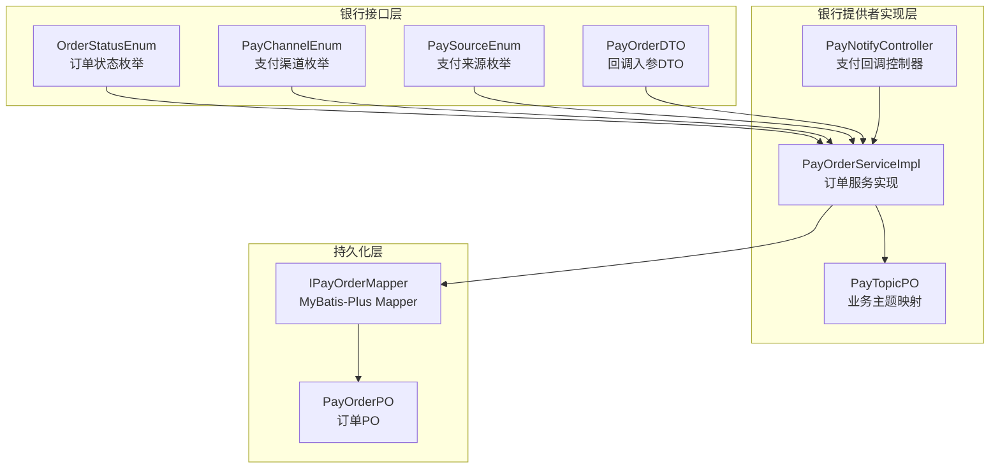
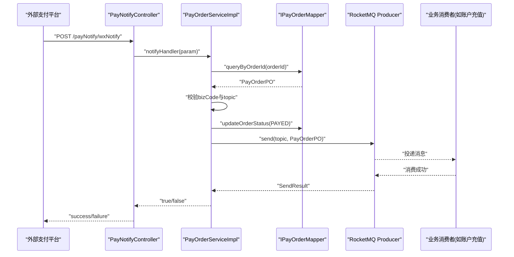
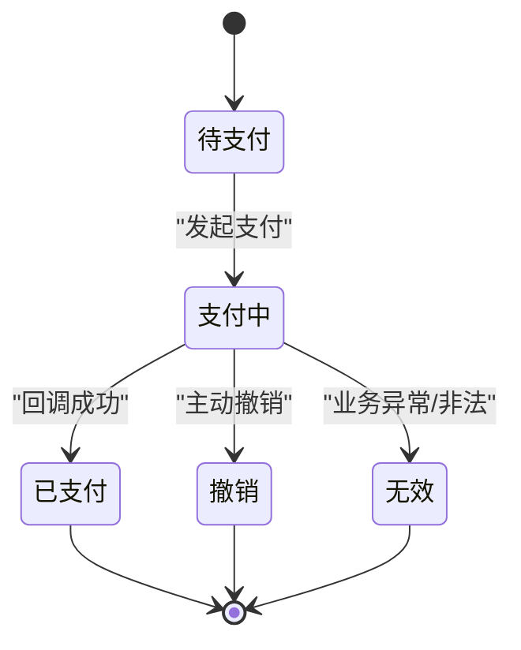
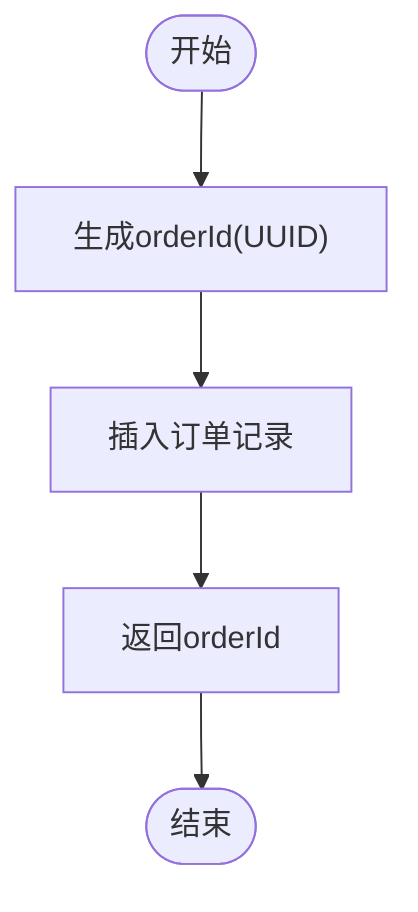
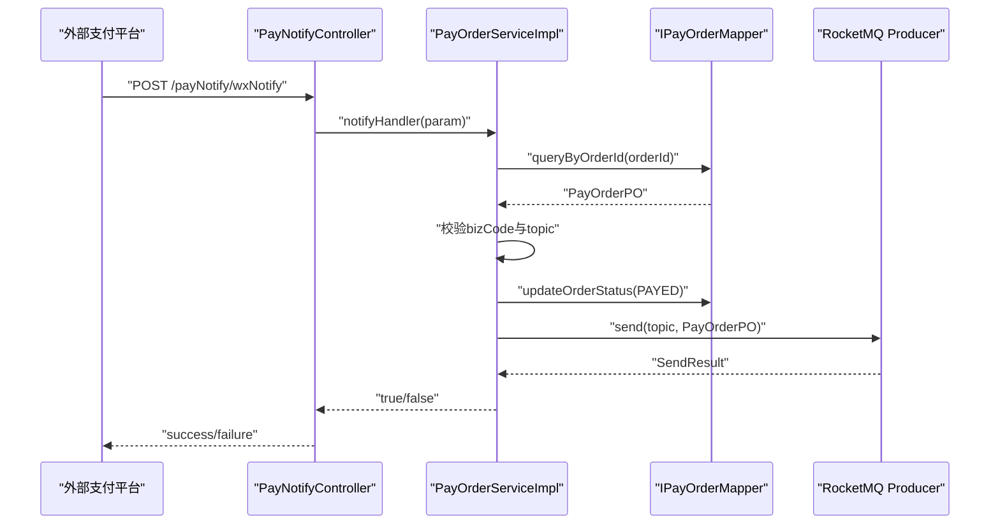
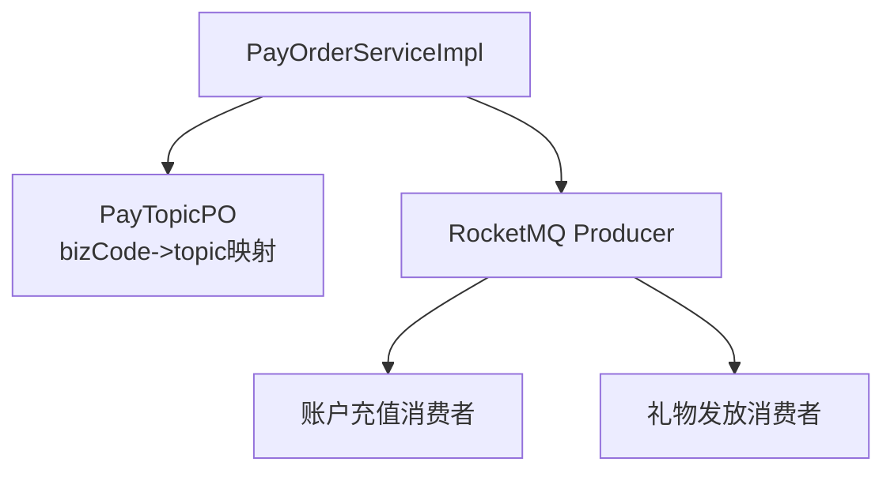
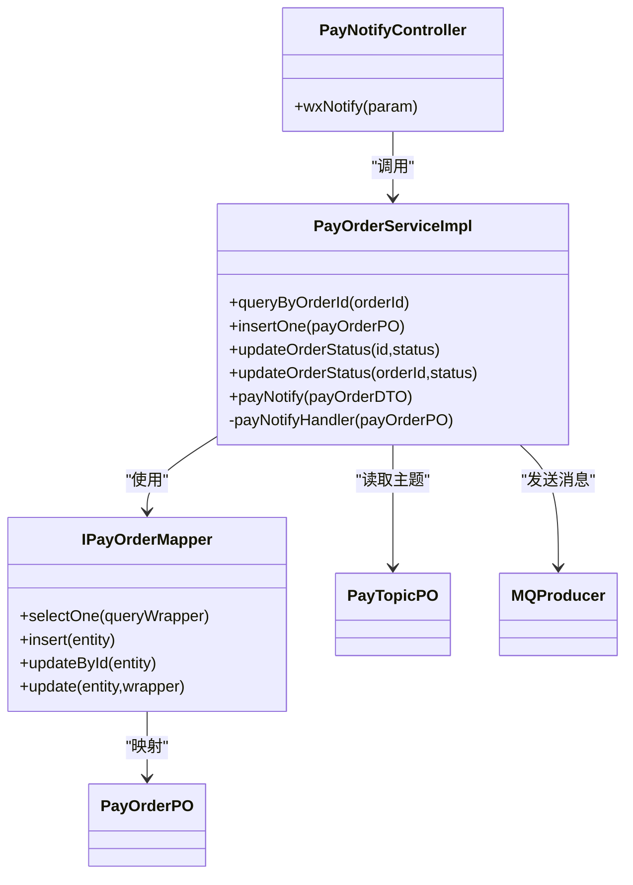

# 支付订单模型

<cite>
**本文引用的文件列表**
- [PayOrderPO.java](file://live-bank-provider/src/main/java/com/logilong/live/bank/provider/dao/po/PayOrderPO.java)
- [IPayOrderMapper.java](file://live-bank-provider/src/main/java/com/logilong/live/bank/provider/dao/mapper/IPayOrderMapper.java)
- [PayOrderServiceImpl.java](file://live-bank-provider/src/main/java/com/logilong/live/bank/provider/service/impl/PayOrderServiceImpl.java)
- [PayNotifyController.java](file://live-bank-api/src/main/java/com/logilong/live/bank/api/controller/PayNotifyController.java)
- [OrderStatusEnum.java](file://live-bank-interface/src/main/java/com/logilong/live/bank/constants/OrderStatusEnum.java)
- [PayChannelEnum.java](file://live-bank-interface/src/main/java/com/logilong/live/bank/constants/PayChannelEnum.java)
- [PaySourceEnum.java](file://live-bank-interface/src/main/java/com/logilong/live/bank/constants/PaySourceEnum.java)
- [PayOrderDTO.java](file://live-bank-interface/src/main/java/com/logilong/live/bank/dto/PayOrderDTO.java)
- [PayTopicPO.java](file://live-bank-provider/src/main/java/com/logilong/live/bank/provider/dao/po/PayTopicPO.java)
- [NacosDriverURLProvider.java](file://live-framework/live-framework-datasource-starter/src/main/java/com/logilong/live/framework/datasource/starter/config/NacosDriverURLProvider.java)
- [ShardingJdbcDatasourceAutoInitConnectionConfig.java](file://live-framework/live-framework-datasource-starter/src/main/java/com/logilong/live/framework/datasource/starter/config/ShardingJdbcDatasourceAutoInitConnectionConfig.java)
- [org.springframework.boot.autoconfigure.AutoConfiguration.imports](file://live-framework/live-framework-datasource-starter/src/main/resources/META-INF/spring/org.springframework.boot.autoconfigure.AutoConfiguration.imports)
- [ShardingSphereDriverURLProvider SPI](file://live-framework/live-framework-datasource-starter/src/main/resources/META-INF/services/org.apache.shardingsphere.driver.jdbc.core.driver.ShardingSphereDriverURLProvider)
- [UserServiceImpl.java](file://live-user-provider/src/main/java/com/logilong/live/user/provider/service/impl/UserServiceImpl.java)
</cite>

## 目录
1. [简介](#简介)
2. [项目结构](#项目结构)
3. [核心组件](#核心组件)
4. [架构总览](#架构总览)
5. [详细组件分析](#详细组件分析)
6. [依赖关系分析](#依赖关系分析)
7. [性能与并发优化](#性能与并发优化)
8. [故障排查指南](#故障排查指南)
9. [结论](#结论)

## 简介
本文件围绕支付订单实体 PayOrderPO 的结构与业务逻辑进行系统化文档化，涵盖字段语义、状态机流转、创建与回调处理流程、数据一致性保障机制，以及基于 RocketMQ 的异步业务触发。同时给出高并发场景下的数据库优化建议（分库分表与索引设计），帮助读者快速理解并安全地扩展该模块。

## 项目结构
支付订单模型位于银行域（live-bank）子系统，采用“接口-实现-持久化对象”的分层组织：
- 接口层：定义领域常量与 DTO（如 OrderStatusEnum、PayChannelEnum、PaySourceEnum、PayOrderDTO）
- 提供者实现层：服务实现（PayOrderServiceImpl）负责订单创建、状态更新、支付回调处理与消息投递
- 控制器层：对外暴露支付回调入口（PayNotifyController）
- 持久化层：MyBatis-Plus PO（PayOrderPO）与 Mapper（IPayOrderMapper）

图表来源
- [PayOrderPO.java](file://live-bank-provider/src/main/java/com/logilong/live/bank/provider/dao/po/PayOrderPO.java#L1-L26)
- [IPayOrderMapper.java](file://live-bank-provider/src/main/java/com/logilong/live/bank/provider/dao/mapper/IPayOrderMapper.java#L1-L10)
- [PayOrderServiceImpl.java](file://live-bank-provider/src/main/java/com/logilong/live/bank/provider/service/impl/PayOrderServiceImpl.java#L1-L126)
- [PayNotifyController.java](file://live-bank-api/src/main/java/com/logilong/live/bank/api/controller/PayNotifyController.java#L1-L26)
- [OrderStatusEnum.java](file://live-bank-interface/src/main/java/com/logilong/live/bank/constants/OrderStatusEnum.java#L1-L24)
- [PayChannelEnum.java](file://live-bank-interface/src/main/java/com/logilong/live/bank/constants/PayChannelEnum.java#L1-L23)
- [PaySourceEnum.java](file://live-bank-interface/src/main/java/com/logilong/live/bank/constants/PaySourceEnum.java#L1-L31)
- [PayOrderDTO.java](file://live-bank-interface/src/main/java/com/logilong/live/bank/dto/PayOrderDTO.java#L1-L24)
- [PayTopicPO.java](file://live-bank-provider/src/main/java/com/logilong/live/bank/provider/dao/po/PayTopicPO.java#L1-L22)

章节来源
- [PayOrderPO.java](file://live-bank-provider/src/main/java/com/logilong/live/bank/provider/dao/po/PayOrderPO.java#L1-L26)
- [IPayOrderMapper.java](file://live-bank-provider/src/main/java/com/logilong/live/bank/provider/dao/mapper/IPayOrderMapper.java#L1-L10)
- [PayOrderServiceImpl.java](file://live-bank-provider/src/main/java/com/logilong/live/bank/provider/service/impl/PayOrderServiceImpl.java#L1-L126)
- [PayNotifyController.java](file://live-bank-api/src/main/java/com/logilong/live/bank/api/controller/PayNotifyController.java#L1-L26)

## 核心组件
- PayOrderPO：订单持久化对象，承载订单核心字段与时间戳
- IPayOrderMapper：MyBatis-Plus Mapper，提供基础 CRUD
- PayOrderServiceImpl：订单服务实现，包含创建、状态更新、支付回调处理与消息投递
- PayNotifyController：外部支付回调入口，转发至服务层
- OrderStatusEnum、PayChannelEnum、PaySourceEnum：领域常量
- PayOrderDTO：回调入参 DTO
- PayTopicPO：业务主题映射（用于 RocketMQ 主题选择）

章节来源
- [PayOrderPO.java](file://live-bank-provider/src/main/java/com/logilong/live/bank/provider/dao/po/PayOrderPO.java#L1-L26)
- [IPayOrderMapper.java](file://live-bank-provider/src/main/java/com/logilong/live/bank/provider/dao/mapper/IPayOrderMapper.java#L1-L10)
- [PayOrderServiceImpl.java](file://live-bank-provider/src/main/java/com/logilong/live/bank/provider/service/impl/PayOrderServiceImpl.java#L1-L126)
- [PayNotifyController.java](file://live-bank-api/src/main/java/com/logilong/live/bank/api/controller/PayNotifyController.java#L1-L26)
- [OrderStatusEnum.java](file://live-bank-interface/src/main/java/com/logilong/live/bank/constants/OrderStatusEnum.java#L1-L24)
- [PayChannelEnum.java](file://live-bank-interface/src/main/java/com/logilong/live/bank/constants/PayChannelEnum.java#L1-L23)
- [PaySourceEnum.java](file://live-bank-interface/src/main/java/com/logilong/live/bank/constants/PaySourceEnum.java#L1-L31)
- [PayOrderDTO.java](file://live-bank-interface/src/main/java/com/logilong/live/bank/dto/PayOrderDTO.java#L1-L24)
- [PayTopicPO.java](file://live-bank-provider/src/main/java/com/logilong/live/bank/provider/dao/po/PayTopicPO.java#L1-L22)

## 架构总览
支付回调处理的关键链路如下：
- 外部支付平台回调至银行 API 层控制器
- 控制器调用服务层进行回调处理
- 服务层校验订单与业务主题，更新订单状态为已支付
- 根据业务码选择 RocketMQ 主题，投递订单消息
- 各业务消费者订阅主题并执行后续动作（如虚拟币充值）

图表来源
- [PayNotifyController.java](file://live-bank-api/src/main/java/com/logilong/live/bank/api/controller/PayNotifyController.java#L1-L26)
- [PayOrderServiceImpl.java](file://live-bank-provider/src/main/java/com/logilong/live/bank/provider/service/impl/PayOrderServiceImpl.java#L75-L125)
- [IPayOrderMapper.java](file://live-bank-provider/src/main/java/com/logilong/live/bank/provider/dao/mapper/IPayOrderMapper.java#L1-L10)

## 详细组件分析

### PayOrderPO 数据模型
- 表名：t_pay_order
- 字段说明
  - id：主键（自增）
  - orderId：业务订单号（由服务层生成并写入）
  - productId：关联商品ID
  - userId：用户ID
  - source：支付来源（参考 PaySourceEnum）
  - payChannel：支付渠道（参考 PayChannelEnum）
  - status：订单状态（参考 OrderStatusEnum）
  - payTime：支付完成时间
  - createTime：创建时间
  - updateTime：更新时间

字段与枚举的映射关系
- status 对应 OrderStatusEnum：0 待支付、1 支付中、2 已支付、3 撤销、4 无效
- payChannel 对应 PayChannelEnum：0 支付宝、1 微信、2 银联、3 收银台
- source 对应 PaySourceEnum：1 直播间内支付、2 用户中心

章节来源
- [PayOrderPO.java](file://live-bank-provider/src/main/java/com/logilong/live/bank/provider/dao/po/PayOrderPO.java#L1-L26)
- [OrderStatusEnum.java](file://live-bank-interface/src/main/java/com/logilong/live/bank/constants/OrderStatusEnum.java#L1-L24)
- [PayChannelEnum.java](file://live-bank-interface/src/main/java/com/logilong/live/bank/constants/PayChannelEnum.java#L1-L23)
- [PaySourceEnum.java](file://live-bank-interface/src/main/java/com/logilong/live/bank/constants/PaySourceEnum.java#L1-L31)

### 订单状态机与流转
- 正常流程
  - WAITING_PAY（0）→ PAYED（2）：支付成功回调后，服务层将订单状态更新为已支付
- 异常处理
  - PAY_BACK（3）：撤销
  - IN_VALID（4）：无效
- 其他状态
  - PAYING（1）：支付中（通常由上游系统或第三方平台推进）

图表来源
- [OrderStatusEnum.java](file://live-bank-interface/src/main/java/com/logilong/live/bank/constants/OrderStatusEnum.java#L1-L24)
- [PayOrderServiceImpl.java](file://live-bank-provider/src/main/java/com/logilong/live/bank/provider/service/impl/PayOrderServiceImpl.java#L112-L124)

章节来源
- [OrderStatusEnum.java](file://live-bank-interface/src/main/java/com/logilong/live/bank/constants/OrderStatusEnum.java#L1-L24)
- [PayOrderServiceImpl.java](file://live-bank-provider/src/main/java/com/logilong/live/bank/provider/service/impl/PayOrderServiceImpl.java#L112-L124)

### 创建流程与数据一致性
- 创建订单
  - 服务层生成 orderId（UUID），填充其他字段后插入数据库
  - 返回 orderId 给调用方
- 数据一致性保障
  - 插入与状态更新均通过 MyBatis-Plus 执行，保证单条记录的原子性
  - 回调处理时先查询订单再更新状态，避免并发下重复处理

图表来源
- [PayOrderServiceImpl.java](file://live-bank-provider/src/main/java/com/logilong/live/bank/provider/service/impl/PayOrderServiceImpl.java#L50-L56)

章节来源
- [PayOrderServiceImpl.java](file://live-bank-provider/src/main/java/com/logilong/live/bank/provider/service/impl/PayOrderServiceImpl.java#L50-L56)

### 支付回调处理（PayNotifyController）
- 入口
  - 控制器提供 /payNotify/wxNotify 接口，接收回调参数
  - 调用服务层 notifyHandler 进行处理
- 处理要点
  - 校验订单是否存在
  - 校验业务码与主题映射
  - 成功后更新订单状态为已支付
  - 投递 RocketMQ 消息，触发下游业务

图表来源
- [PayNotifyController.java](file://live-bank-api/src/main/java/com/logilong/live/bank/api/controller/PayNotifyController.java#L1-L26)
- [PayOrderServiceImpl.java](file://live-bank-provider/src/main/java/com/logilong/live/bank/provider/service/impl/PayOrderServiceImpl.java#L75-L125)
- [IPayOrderMapper.java](file://live-bank-provider/src/main/java/com/logilong/live/bank/provider/dao/mapper/IPayOrderMapper.java#L1-L10)

章节来源
- [PayNotifyController.java](file://live-bank-api/src/main/java/com/logilong/live/bank/api/controller/PayNotifyController.java#L1-L26)
- [PayOrderServiceImpl.java](file://live-bank-provider/src/main/java/com/logilong/live/bank/provider/service/impl/PayOrderServiceImpl.java#L75-L125)

### RocketMQ 消息驱动与后续业务
- 回调成功后，服务层根据业务码查询主题映射（PayTopicPO），将订单对象序列化后投递到对应主题
- 下游各业务消费者订阅主题并执行后续动作（如虚拟币充值、礼物发放等）
- 该模式实现“支付成功”与“业务处理”的解耦与异步化

图表来源
- [PayOrderServiceImpl.java](file://live-bank-provider/src/main/java/com/logilong/live/bank/provider/service/impl/PayOrderServiceImpl.java#L94-L106)
- [PayTopicPO.java](file://live-bank-provider/src/main/java/com/logilong/live/bank/provider/dao/po/PayTopicPO.java#L1-L22)

章节来源
- [PayOrderServiceImpl.java](file://live-bank-provider/src/main/java/com/logilong/live/bank/provider/service/impl/PayOrderServiceImpl.java#L94-L106)
- [PayTopicPO.java](file://live-bank-provider/src/main/java/com/logilong/live/bank/provider/dao/po/PayTopicPO.java#L1-L22)

## 依赖关系分析
- 组件耦合
  - PayOrderServiceImpl 依赖 IPayOrderMapper、IPayTopicService、IPayProductService、ILiveCurrencyAccountService、MQProducer
  - PayNotifyController 仅依赖 IPayNotifyService（回调处理入口）
- 关键依赖链
  - 回调入口 → 服务层 → Mapper → 数据库
  - 回调入口 → 服务层 → MQProducer → 业务消费者

图表来源
- [PayNotifyController.java](file://live-bank-api/src/main/java/com/logilong/live/bank/api/controller/PayNotifyController.java#L1-L26)
- [PayOrderServiceImpl.java](file://live-bank-provider/src/main/java/com/logilong/live/bank/provider/service/impl/PayOrderServiceImpl.java#L1-L126)
- [IPayOrderMapper.java](file://live-bank-provider/src/main/java/com/logilong/live/bank/provider/dao/mapper/IPayOrderMapper.java#L1-L10)
- [PayOrderPO.java](file://live-bank-provider/src/main/java/com/logilong/live/bank/provider/dao/po/PayOrderPO.java#L1-L26)
- [PayTopicPO.java](file://live-bank-provider/src/main/java/com/logilong/live/bank/provider/dao/po/PayTopicPO.java#L1-L22)

章节来源
- [PayOrderServiceImpl.java](file://live-bank-provider/src/main/java/com/logilong/live/bank/provider/service/impl/PayOrderServiceImpl.java#L1-L126)
- [IPayOrderMapper.java](file://live-bank-provider/src/main/java/com/logilong/live/bank/provider/dao/mapper/IPayOrderMapper.java#L1-L10)

## 性能与并发优化
- 分库分表策略（基于 orderId）
  - 建议以 orderId 作为分片键，结合 ShardingSphere JDBC 实现水平分片
  - 通过 Nacos 动态下发分片配置，便于扩容与运维
- 关键字段索引设计
  - 主键索引：PRIMARY (id)
  - 业务唯一索引：UNIQUE (orderId)
  - 查询热点索引：INDEX (userId), INDEX (productId), INDEX (status)
  - 时间范围索引：INDEX (payTime), INDEX (createTime)
- 高并发优化建议
  - 使用 UUID 生成 orderId，避免热点主键
  - 回调处理采用幂等校验（如按 orderId 去重），防止重复投递
  - RocketMQ 消费端批量拉取与异步处理，降低延迟
  - 结合 ShardingSphere 的读写分离与分片路由，提升吞吐

分片与配置加载
- ShardingSphere JDBC 通过 SPI 注册 NacosDriverURLProvider，从 Nacos 加载分片配置
- Spring Boot 自动装配加载 ShardingJdbcDatasourceAutoInitConnectionConfig

章节来源
- [NacosDriverURLProvider.java](file://live-framework/live-framework-datasource-starter/src/main/java/com/logilong/live/framework/datasource/starter/config/NacosDriverURLProvider.java#L1-L66)
- [org.springframework.boot.autoconfigure.AutoConfiguration.imports](file://live-framework/live-framework-datasource-starter/src/main/resources/META-INF/spring/org.springframework.boot.autoconfigure.AutoConfiguration.imports#L1-L1)
- [ShardingSphereDriverURLProvider SPI](file://live-framework/live-framework-datasource-starter/src/main/resources/META-INF/services/org.apache.shardingsphere.driver.jdbc.core.driver.ShardingSphereDriverURLProvider#L1-L1)
- [ShardingJdbcDatasourceAutoInitConnectionConfig.java](file://live-framework/live-framework-datasource-starter/src/main/java/com/logilong/live/framework/datasource/starter/config/ShardingJdbcDatasourceAutoInitConnectionConfig.java#L1-L200)

## 故障排查指南
- 回调失败
  - 检查 PayNotifyController 是否正确接收参数并调用服务层
  - 查看服务层日志，确认订单是否存在、业务码是否有效
- 订单状态未更新
  - 确认 updateOrderStatus 调用是否成功（返回受影响行数）
  - 核对状态码是否符合 OrderStatusEnum
- RocketMQ 消息未到达
  - 检查主题映射（PayTopicPO）是否正确
  - 核对 MQProducer 发送结果与消费者订阅情况
- 并发问题
  - 回调处理需保证幂等；若出现重复回调，应以 orderId 为维度去重
  - 若存在热点用户或商品，建议引入缓存与限流

章节来源
- [PayOrderServiceImpl.java](file://live-bank-provider/src/main/java/com/logilong/live/bank/provider/service/impl/PayOrderServiceImpl.java#L75-L125)
- [PayNotifyController.java](file://live-bank-api/src/main/java/com/logilong/live/bank/api/controller/PayNotifyController.java#L1-L26)

## 结论
本文系统梳理了支付订单实体 PayOrderPO 的结构与业务逻辑，明确了状态机流转、创建与回调处理流程、数据一致性保障机制，以及基于 RocketMQ 的异步业务触发。结合 ShardingSphere 的分库分表与合理的索引设计，可在高并发场景下获得稳定与高效的运行表现。建议在生产环境中进一步完善幂等控制、监控告警与容量规划，确保系统的可靠性与可扩展性。