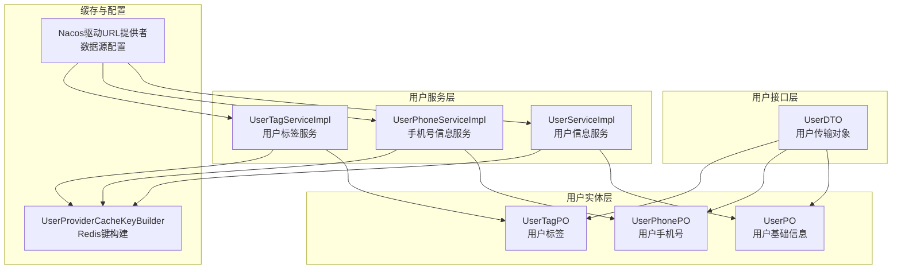
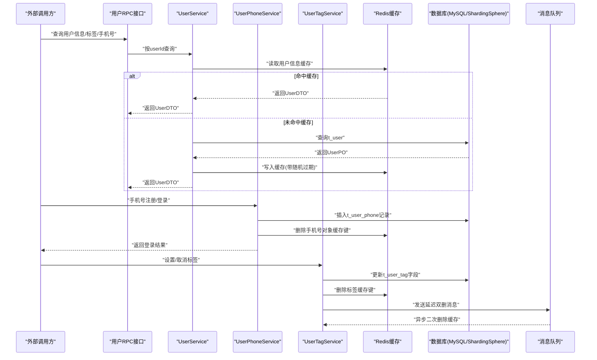
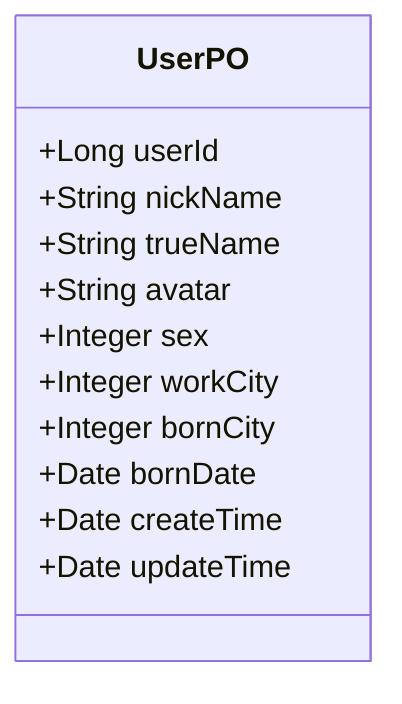
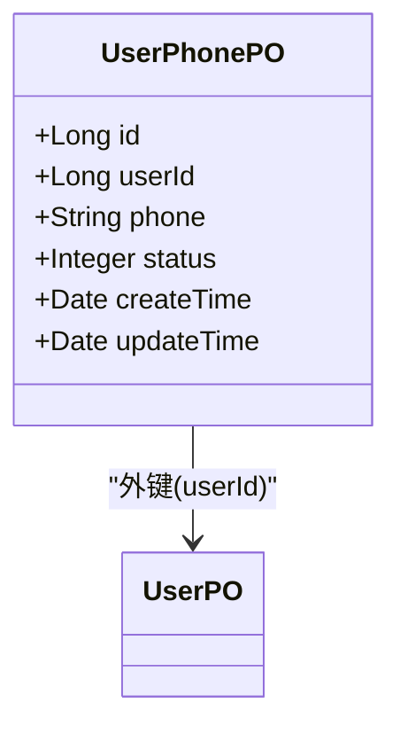
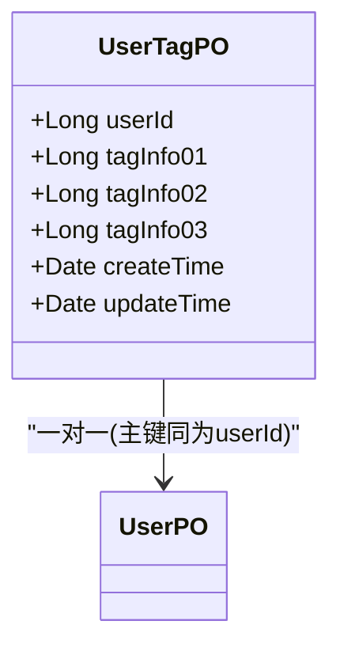
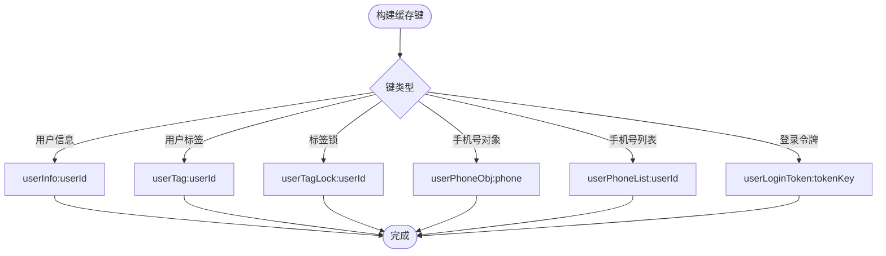
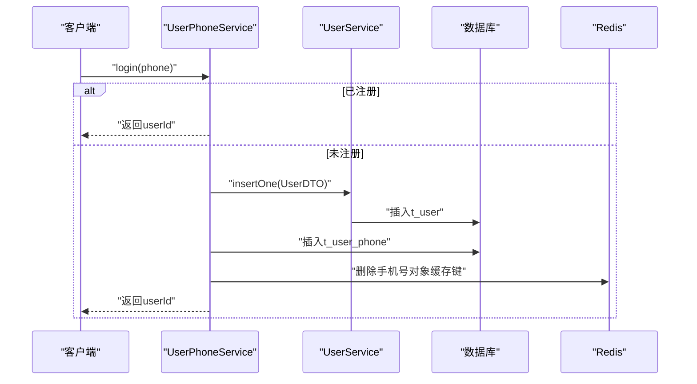
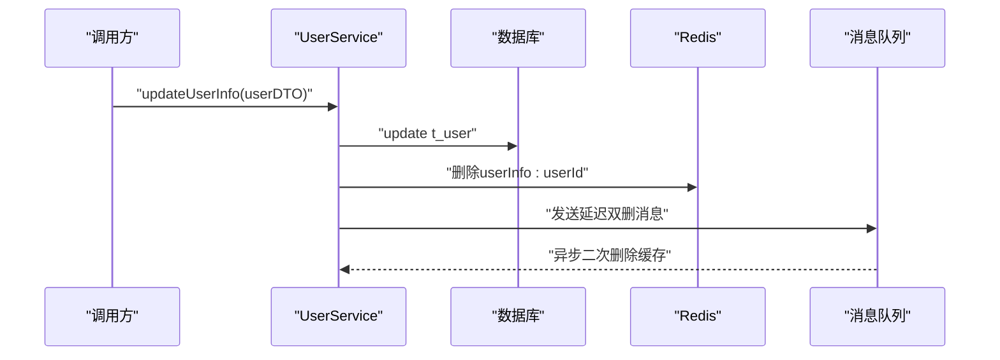
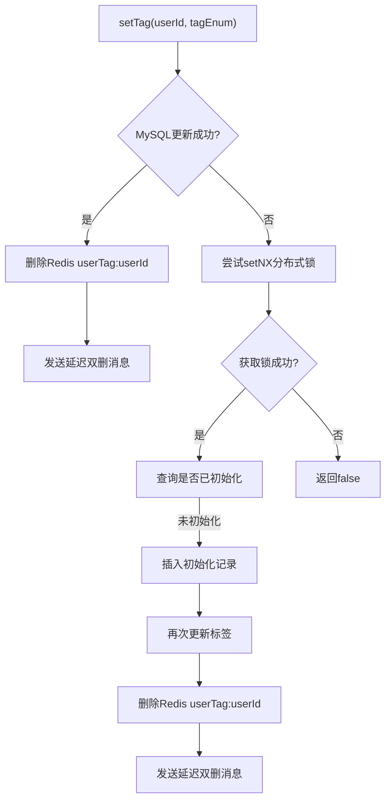
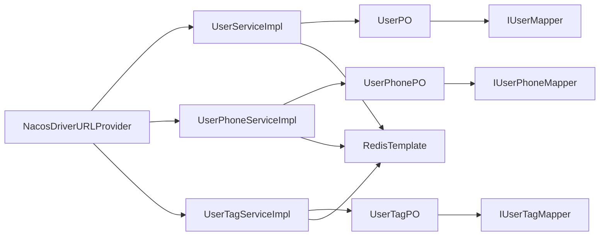

# 用户数据模型

<cite>
**本文引用的文件列表**
- [UserPO.java](file://live-user-provider/src/main/java/com/logilong/live/user/provider/dao/po/UserPO.java)
- [UserPhonePO.java](file://live-user-provider/src/main/java/com/logilong/live/user/provider/dao/po/UserPhonePO.java)
- [UserTagPO.java](file://live-user-provider/src/main/java/com/logilong/live/user/provider/dao/po/UserTagPO.java)
- [UserDTO.java](file://live-user-interface/src/main/java/com/logilong/live/user/dto/UserDTO.java)
- [UserProviderCacheKeyBuilder.java](file://live-framework/live-framework-redis-starter/src/main/java/com/logilong/live/framework/redis/starter/key/UserProviderCacheKeyBuilder.java)
- [UserServiceImpl.java](file://live-user-provider/src/main/java/com/logilong/live/user/provider/service/impl/UserServiceImpl.java)
- [UserTagServiceImpl.java](file://live-user-provider/src/main/java/com/logilong/live/user/provider/service/impl/UserTagServiceImpl.java)
- [UserPhoneServiceImpl.java](file://live-user-provider/src/main/java/com/logilong/live/user/provider/service/impl/UserPhoneServiceImpl.java)
- [IUserMapper.java](file://live-user-provider/src/main/java/com/logilong/live/user/provider/dao/mapper/IUserMapper.java)
- [IUserPhoneMapper.java](file://live-user-provider/src/main/java/com/logilong/live/user/provider/dao/mapper/IUserPhoneMapper.java)
- [UserTagFieldNameConstants.java](file://live-user-interface/src/main/java/com/logilong/live/user/constants/UserTagFieldNameConstants.java)
- [NacosDriverURLProvider.java](file://live-framework/live-framework-datasource-starter/src/main/java/com/logilong/live/framework/datasource/starter/config/NacosDriverURLProvider.java)
</cite>

## 目录
1. [简介](#简介)
2. [项目结构](#项目结构)
3. [核心组件](#核心组件)
4. [架构总览](#架构总览)
5. [详细组件分析](#详细组件分析)
6. [依赖关系分析](#依赖关系分析)
7. [性能与缓存策略](#性能与缓存策略)
8. [故障排查指南](#故障排查指南)
9. [结论](#结论)
10. [附录](#附录)

## 简介
本文件围绕用户数据模型展开，系统化梳理 UserPO 实体的字段定义、数据类型、主键设计及业务含义；阐明用户信息与手机号（UserPhonePO）、用户标签（UserTagPO）之间的关联关系与一致性保障机制；解释该模型在注册、登录、信息更新等核心流程中的使用方式；结合 Nacos 配置与 Redis 缓存策略（UserProviderCacheKeyBuilder），阐述缓存与数据库的同步机制；最后提供典型查询场景的 SQL 示例与索引优化建议，帮助读者快速理解并正确使用该模型。

## 项目结构
用户数据模型位于用户提供者模块，采用“接口-实现-持久层”的分层组织：
- 接口层：UserDTO 定义对外传输对象，包含用户基本信息。
- 实体层：UserPO、UserPhonePO、UserTagPO 映射数据库表结构。
- 服务层：UserServiceImpl、UserPhoneServiceImpl、UserTagServiceImpl 提供业务逻辑与缓存策略。
- 缓存键构建：UserProviderCacheKeyBuilder 统一生成 Redis 键前缀与命名规范。
- 数据源配置：通过 Nacos 驱动 URL 提供者与 ShardingSphere 进行数据源初始化。

图表来源
- [UserDTO.java](file://live-user-interface/src/main/java/com/logilong/live/user/dto/UserDTO.java#L1-L26)
- [UserPO.java](file://live-user-provider/src/main/java/com/logilong/live/user/provider/dao/po/UserPO.java#L1-L26)
- [UserPhonePO.java](file://live-user-provider/src/main/java/com/logilong/live/user/provider/dao/po/UserPhonePO.java#L1-L23)
- [UserTagPO.java](file://live-user-provider/src/main/java/com/logilong/live/user/provider/dao/po/UserTagPO.java#L1-L25)
- [UserServiceImpl.java](file://live-user-provider/src/main/java/com/logilong/live/user/provider/service/impl/UserServiceImpl.java#L1-L157)
- [UserPhoneServiceImpl.java](file://live-user-provider/src/main/java/com/logilong/live/user/provider/service/impl/UserPhoneServiceImpl.java#L1-L182)
- [UserTagServiceImpl.java](file://live-user-provider/src/main/java/com/logilong/live/user/provider/service/impl/UserTagServiceImpl.java#L1-L213)
- [UserProviderCacheKeyBuilder.java](file://live-framework/live-framework-redis-starter/src/main/java/com/logilong/live/framework/redis/starter/key/UserProviderCacheKeyBuilder.java#L1-L46)
- [NacosDriverURLProvider.java](file://live-framework/live-framework-datasource-starter/src/main/java/com/logilong/live/framework/datasource/starter/config/NacosDriverURLProvider.java)

章节来源
- [UserDTO.java](file://live-user-interface/src/main/java/com/logilong/live/user/dto/UserDTO.java#L1-L26)
- [UserPO.java](file://live-user-provider/src/main/java/com/logilong/live/user/provider/dao/po/UserPO.java#L1-L26)
- [UserPhonePO.java](file://live-user-provider/src/main/java/com/logilong/live/user/provider/dao/po/UserPhonePO.java#L1-L23)
- [UserTagPO.java](file://live-user-provider/src/main/java/com/logilong/live/user/provider/dao/po/UserTagPO.java#L1-L25)
- [UserProviderCacheKeyBuilder.java](file://live-framework/live-framework-redis-starter/src/main/java/com/logilong/live/framework/redis/starter/key/UserProviderCacheKeyBuilder.java#L1-L46)
- [NacosDriverURLProvider.java](file://live-framework/live-framework-datasource-starter/src/main/java/com/logilong/live/framework/datasource/starter/config/NacosDriverURLProvider.java)

## 核心组件
- UserPO：用户基础信息实体，映射 t_user 表，主键为 userId，采用输入型主键策略。
- UserPhonePO：用户手机号实体，映射 t_user_phone 表，主键为自增 id，外键指向 t_user(userId)。
- UserTagPO：用户标签实体，映射 t_user_tag 表，主键为 userId，按字段 tag_info_01/02/03 存储位掩码标签。
- UserDTO：对外传输对象，与 UserPO 字段一一对应，用于 RPC/HTTP 层交互。
- UserProviderCacheKeyBuilder：统一构建用户模块 Redis 键，涵盖用户信息、标签、手机号、登录令牌等键空间。
- UserServiceImpl：提供按 userId 查询、批量查询、更新后的异步删除缓存等能力。
- UserPhoneServiceImpl：提供手机号注册/登录、手机号与用户绑定、缓存穿透/击穿处理。
- UserTagServiceImpl：提供标签设置/取消、标签包含判断、分布式锁与延迟双删保障一致性。

章节来源
- [UserPO.java](file://live-user-provider/src/main/java/com/logilong/live/user/provider/dao/po/UserPO.java#L1-L26)
- [UserPhonePO.java](file://live-user-provider/src/main/java/com/logilong/live/user/provider/dao/po/UserPhonePO.java#L1-L23)
- [UserTagPO.java](file://live-user-provider/src/main/java/com/logilong/live/user/provider/dao/po/UserTagPO.java#L1-L25)
- [UserDTO.java](file://live-user-interface/src/main/java/com/logilong/live/user/dto/UserDTO.java#L1-L26)
- [UserProviderCacheKeyBuilder.java](file://live-framework/live-framework-redis-starter/src/main/java/com/logilong/live/framework/redis/starter/key/UserProviderCacheKeyBuilder.java#L1-L46)
- [UserServiceImpl.java](file://live-user-provider/src/main/java/com/logilong/live/user/provider/service/impl/UserServiceImpl.java#L1-L157)
- [UserPhoneServiceImpl.java](file://live-user-provider/src/main/java/com/logilong/live/user/provider/service/impl/UserPhoneServiceImpl.java#L1-L182)
- [UserTagServiceImpl.java](file://live-user-provider/src/main/java/com/logilong/live/user/provider/service/impl/UserTagServiceImpl.java#L1-L213)

## 架构总览
用户数据模型在系统中的位置与交互如下：

图表来源
- [UserServiceImpl.java](file://live-user-provider/src/main/java/com/logilong/live/user/provider/service/impl/UserServiceImpl.java#L43-L86)
- [UserPhoneServiceImpl.java](file://live-user-provider/src/main/java/com/logilong/live/user/provider/service/impl/UserPhoneServiceImpl.java#L50-L88)
- [UserTagServiceImpl.java](file://live-user-provider/src/main/java/com/logilong/live/user/provider/service/impl/UserTagServiceImpl.java#L51-L93)
- [UserProviderCacheKeyBuilder.java](file://live-framework/live-framework-redis-starter/src/main/java/com/logilong/live/framework/redis/starter/key/UserProviderCacheKeyBuilder.java#L21-L45)

## 详细组件分析

### UserPO 实体详解
- 表名：t_user
- 主键：userId（Long），输入型主键策略，由分布式 ID 生成器提供。
- 字段与业务含义：
  - userId：用户唯一标识，业务主键。
  - nickName：昵称。
  - trueName：真实姓名。
  - avatar：头像地址。
  - sex：性别。
  - workCity/bornCity：工作地/出生地（整数编码）。
  - bornDate：出生日期。
  - createTime/updateTime：创建与更新时间。
- 数据类型：Long/Integer/String/Date，符合 MyBatis-Plus 注解映射。
- 复杂度与性能：单条查询走主键，复杂度 O(log n)；批量查询通过分片键分组并行查询，提升吞吐。

图表来源
- [UserPO.java](file://live-user-provider/src/main/java/com/logilong/live/user/provider/dao/po/UserPO.java#L10-L25)

章节来源
- [UserPO.java](file://live-user-provider/src/main/java/com/logilong/live/user/provider/dao/po/UserPO.java#L1-L26)
- [IUserMapper.java](file://live-user-provider/src/main/java/com/logilong/live/user/provider/dao/mapper/IUserMapper.java#L1-L10)

### UserPhonePO 实体详解
- 表名：t_user_phone
- 主键：id（Long），自增主键。
- 外键：userId 关联 t_user(userId)，一对一或一对多（视业务语义）。
- 字段与业务含义：
  - id：手机号记录自增主键。
  - userId：用户ID。
  - phone：加密存储的手机号。
  - status：状态（有效/无效）。
  - createTime/updateTime：创建与更新时间。
- 加密与安全：手机号在入库前进行加密，查询时解密展示。
- 缓存策略：按手机号对象与用户手机号列表分别缓存，支持空值缓存与过期控制。

图表来源
- [UserPhonePO.java](file://live-user-provider/src/main/java/com/logilong/live/user/provider/dao/po/UserPhonePO.java#L11-L22)
- [UserPO.java](file://live-user-provider/src/main/java/com/logilong/live/user/provider/dao/po/UserPO.java#L10-L16)

章节来源
- [UserPhonePO.java](file://live-user-provider/src/main/java/com/logilong/live/user/provider/dao/po/UserPhonePO.java#L1-L23)
- [IUserPhoneMapper.java](file://live-user-provider/src/main/java/com/logilong/live/user/provider/dao/mapper/IUserPhoneMapper.java#L1-L10)
- [UserPhoneServiceImpl.java](file://live-user-provider/src/main/java/com/logilong/live/user/provider/service/impl/UserPhoneServiceImpl.java#L108-L181)

### UserTagPO 实体详解
- 表名：t_user_tag
- 主键：userId（Long），与 UserPO 主键一致，形成一对一关系。
- 字段映射：tag_info_01/02/03 对应不同标签域，采用位掩码存储，便于高效判断包含关系。
- 业务含义：用于用户画像、权限、营销等场景的标签集合。
- 一致性保障：通过分布式锁与延迟双删消息队列，避免缓存与数据库不一致。

图表来源
- [UserTagPO.java](file://live-user-provider/src/main/java/com/logilong/live/user/provider/dao/po/UserTagPO.java#L11-L25)
- [UserPO.java](file://live-user-provider/src/main/java/com/logilong/live/user/provider/dao/po/UserPO.java#L10-L16)

章节来源
- [UserTagPO.java](file://live-user-provider/src/main/java/com/logilong/live/user/provider/dao/po/UserTagPO.java#L1-L25)
- [UserTagFieldNameConstants.java](file://live-user-interface/src/main/java/com/logilong/live/user/constants/UserTagFieldNameConstants.java#L1-L9)
- [UserTagServiceImpl.java](file://live-user-provider/src/main/java/com/logilong/live/user/provider/service/impl/UserTagServiceImpl.java#L107-L124)

### 缓存键与命名规范（UserProviderCacheKeyBuilder）
- 用户信息键：userInfo:userId
- 用户标签键：userTag:userId
- 标签分布式锁键：userTagLock:userId
- 用户手机号对象键：userPhoneObj:phone
- 用户手机号列表键：userPhoneList:userId
- 登录令牌键：userLoginToken:tokenKey
- 前缀与分隔符：继承基类，统一前缀与分隔符，便于运维与清理。

图表来源
- [UserProviderCacheKeyBuilder.java](file://live-framework/live-framework-redis-starter/src/main/java/com/logilong/live/framework/redis/starter/key/UserProviderCacheKeyBuilder.java#L21-L45)

章节来源
- [UserProviderCacheKeyBuilder.java](file://live-framework/live-framework-redis-starter/src/main/java/com/logilong/live/framework/redis/starter/key/UserProviderCacheKeyBuilder.java#L1-L46)

### 核心流程使用方式

#### 注册与登录流程
- 登录：若手机号已存在则直接返回用户ID；否则通过分布式 ID 生成 userId，创建 UserPO，插入 UserPhonePO，并清理手机号对象缓存键。
- 注册：与登录流程合并，统一走 registerAndLogin，保证幂等与一致性。

图表来源
- [UserPhoneServiceImpl.java](file://live-user-provider/src/main/java/com/logilong/live/user/provider/service/impl/UserPhoneServiceImpl.java#L50-L88)
- [UserServiceImpl.java](file://live-user-provider/src/main/java/com/logilong/live/user/provider/service/impl/UserServiceImpl.java#L96-L95)

章节来源
- [UserPhoneServiceImpl.java](file://live-user-provider/src/main/java/com/logilong/live/user/provider/service/impl/UserPhoneServiceImpl.java#L50-L88)

#### 信息更新流程
- 更新用户信息后，立即删除 Redis 中的用户信息缓存键，并发送延迟双删消息，确保最终一致性。

图表来源
- [UserServiceImpl.java](file://live-user-provider/src/main/java/com/logilong/live/user/provider/service/impl/UserServiceImpl.java#L61-L86)

章节来源
- [UserServiceImpl.java](file://live-user-provider/src/main/java/com/logilong/live/user/provider/service/impl/UserServiceImpl.java#L61-L86)

#### 标签设置/取消与一致性
- setTag：若用户标签未初始化，使用分布式锁原子创建初始化记录后再更新；更新成功后删除 Redis 标签缓存并发送延迟双删消息。
- containTag：先查 Redis，未命中则加分布式锁查询数据库，命中后缓存并返回；支持空值缓存与过期控制。

图表来源
- [UserTagServiceImpl.java](file://live-user-provider/src/main/java/com/logilong/live/user/provider/service/impl/UserTagServiceImpl.java#L51-L93)

章节来源
- [UserTagServiceImpl.java](file://live-user-provider/src/main/java/com/logilong/live/user/provider/service/impl/UserTagServiceImpl.java#L51-L155)

## 依赖关系分析
- 实体与映射：
  - UserPO 与 IUserMapper 对应 t_user 表。
  - UserPhonePO 与 IUserPhoneMapper 对应 t_user_phone 表。
  - UserTagPO 与 IUserTagMapper 对应 t_user_tag 表。
- 服务与缓存：
  - UserServiceImpl、UserPhoneServiceImpl、UserTagServiceImpl 分别依赖 RedisTemplate 与 UserProviderCacheKeyBuilder 构建键。
- 数据源配置：
  - Nacos 驱动 URL 提供者与 ShardingSphere 自动初始化连接配置，统一数据源管理。

图表来源
- [IUserMapper.java](file://live-user-provider/src/main/java/com/logilong/live/user/provider/dao/mapper/IUserMapper.java#L1-L10)
- [IUserPhoneMapper.java](file://live-user-provider/src/main/java/com/logilong/live/user/provider/dao/mapper/IUserPhoneMapper.java#L1-L10)
- [UserServiceImpl.java](file://live-user-provider/src/main/java/com/logilong/live/user/provider/service/impl/UserServiceImpl.java#L31-L42)
- [UserPhoneServiceImpl.java](file://live-user-provider/src/main/java/com/logilong/live/user/provider/service/impl/UserPhoneServiceImpl.java#L33-L49)
- [UserTagServiceImpl.java](file://live-user-provider/src/main/java/com/logilong/live/user/provider/service/impl/UserTagServiceImpl.java#L37-L49)
- [NacosDriverURLProvider.java](file://live-framework/live-framework-datasource-starter/src/main/java/com/logilong/live/framework/datasource/starter/config/NacosDriverURLProvider.java)

章节来源
- [IUserMapper.java](file://live-user-provider/src/main/java/com/logilong/live/user/provider/dao/mapper/IUserMapper.java#L1-L10)
- [IUserPhoneMapper.java](file://live-user-provider/src/main/java/com/logilong/live/user/provider/dao/mapper/IUserPhoneMapper.java#L1-L10)
- [UserServiceImpl.java](file://live-user-provider/src/main/java/com/logilong/live/user/provider/service/impl/UserServiceImpl.java#L31-L42)
- [UserPhoneServiceImpl.java](file://live-user-provider/src/main/java/com/logilong/live/user/provider/service/impl/UserPhoneServiceImpl.java#L33-L49)
- [UserTagServiceImpl.java](file://live-user-provider/src/main/java/com/logilong/live/user/provider/service/impl/UserTagServiceImpl.java#L37-L49)
- [NacosDriverURLProvider.java](file://live-framework/live-framework-datasource-starter/src/main/java/com/logilong/live/framework/datasource/starter/config/NacosDriverURLProvider.java)

## 性能与缓存策略
- 缓存命中优先：按 userId 查询用户信息时，优先命中 Redis；未命中再查库并回填缓存。
- 批量查询优化：批量生成 Redis 键，使用 multiGet 减少网络往返；对未命中的子集按分片键分组并行查询数据库，再批量写回 Redis 并设置随机过期时间，避免缓存雪崩。
- 标签缓存：使用分布式锁避免缓存击穿；命中后设置较长过期时间；未命中时写入空对象并设置短期过期，缓解穿透。
- 登录令牌：使用长有效期 Redis 键存储 token->userId 映射，便于鉴权与会话管理。
- 异步删除：更新用户信息与标签后，删除缓存并发送延迟双删消息，确保最终一致性。

章节来源
- [UserServiceImpl.java](file://live-user-provider/src/main/java/com/logilong/live/user/provider/service/impl/UserServiceImpl.java#L43-L156)
- [UserTagServiceImpl.java](file://live-user-provider/src/main/java/com/logilong/live/user/provider/service/impl/UserTagServiceImpl.java#L126-L211)
- [UserPhoneServiceImpl.java](file://live-user-provider/src/main/java/com/logilong/live/user/provider/service/impl/UserPhoneServiceImpl.java#L108-L181)

## 故障排查指南
- 缓存穿透：手机号对象与手机号列表均采用空值缓存策略，若出现大量空命中，检查 Redis 键过期时间与空值缓存策略是否生效。
- 缓存击穿：标签查询使用分布式锁保护，若锁未释放或过期时间过短，可能导致热点击穿，需检查锁的获取与释放逻辑。
- 数据不一致：标签更新后通过延迟双删消息二次删除缓存，若仍出现脏读，检查消息队列投递与消费是否正常。
- 登录异常：手机号注册/登录流程涉及分布式 ID 生成与事务，若失败需检查 ID 生成服务与事务回滚日志。

章节来源
- [UserTagServiceImpl.java](file://live-user-provider/src/main/java/com/logilong/live/user/provider/service/impl/UserTagServiceImpl.java#L126-L211)
- [UserPhoneServiceImpl.java](file://live-user-provider/src/main/java/com/logilong/live/user/provider/service/impl/UserPhoneServiceImpl.java#L50-L88)

## 结论
用户数据模型通过清晰的实体设计、严格的缓存策略与完善的异步一致性机制，实现了高并发场景下的稳定与高效。UserPO 作为业务主键，配合 UserPhonePO 与 UserTagPO 形成完整的用户画像与身份体系；Redis 缓存与 RocketMQ 延迟双删共同保障了数据一致性与用户体验。

## 附录

### 典型查询场景与 SQL 示例
以下 SQL 示例基于实体映射关系与常见查询需求整理，便于数据库层面的验证与优化。

- 按用户ID查询用户信息
  - SELECT * FROM t_user WHERE user_id = ?
- 按手机号查询用户手机号记录（注意：phone 字段为加密存储）
  - SELECT * FROM t_user_phone WHERE phone = AES_ENCRYPT(?,'密钥') AND status = 1 ORDER BY create_time DESC LIMIT 1
- 查询用户手机号列表（注意：phone 字段为加密存储）
  - SELECT phone FROM t_user_phone WHERE user_id = ? AND status = 1 ORDER BY create_time DESC
- 按用户ID查询用户标签
  - SELECT user_id, tag_info_01, tag_info_02, tag_info_03 FROM t_user_tag WHERE user_id = ?
- 标签设置（按字段位掩码更新）
  - UPDATE t_user_tag SET tag_info_01 = tag_info_01 | ? WHERE user_id = ?
- 标签取消（按位掩码清除）
  - UPDATE t_user_tag SET tag_info_01 = tag_info_01 & ~? WHERE user_id = ?

章节来源
- [UserPO.java](file://live-user-provider/src/main/java/com/logilong/live/user/provider/dao/po/UserPO.java#L10-L25)
- [UserPhonePO.java](file://live-user-provider/src/main/java/com/logilong/live/user/provider/dao/po/UserPhonePO.java#L11-L22)
- [UserTagPO.java](file://live-user-provider/src/main/java/com/logilong/live/user/provider/dao/po/UserTagPO.java#L11-L25)
- [UserPhoneServiceImpl.java](file://live-user-provider/src/main/java/com/logilong/live/user/provider/service/impl/UserPhoneServiceImpl.java#L163-L181)

### 索引优化建议
- t_user
  - 主键：user_id（已存在）
  - 建议索引：nick_name、true_name（如存在高频模糊/精确查询）
- t_user_phone
  - 主键：id（已存在）
  - 建议索引：
    - idx_user_id_status：user_id + status（常用按用户查询）
    - idx_phone_status：phone + status（常用按手机号查询）
- t_user_tag
  - 主键：user_id（已存在）
  - 建议索引：无额外索引（按主键查询）

章节来源
- [UserPO.java](file://live-user-provider/src/main/java/com/logilong/live/user/provider/dao/po/UserPO.java#L10-L25)
- [UserPhonePO.java](file://live-user-provider/src/main/java/com/logilong/live/user/provider/dao/po/UserPhonePO.java#L11-L22)
- [UserTagPO.java](file://live-user-provider/src/main/java/com/logilong/live/user/provider/dao/po/UserTagPO.java#L11-L25)