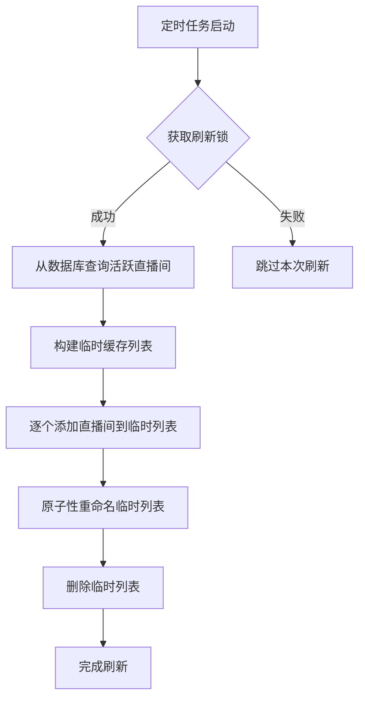
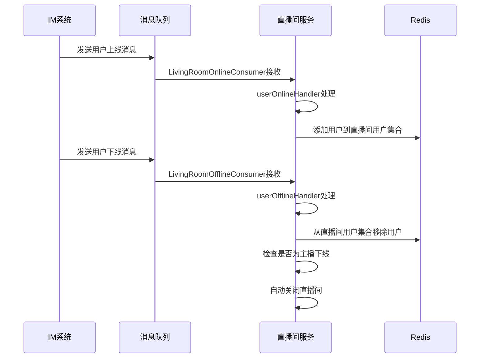
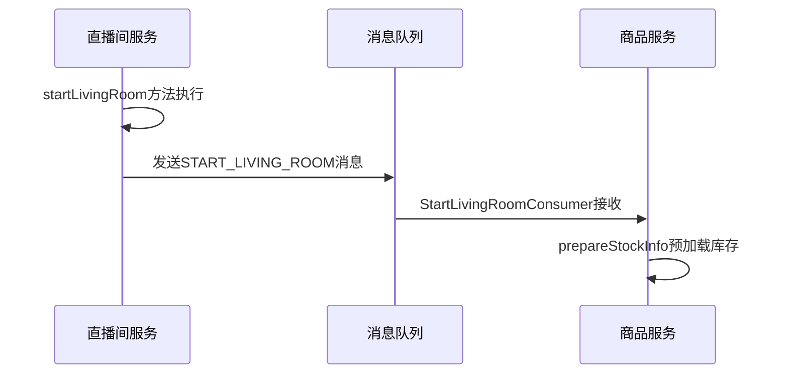

# 直播间数据模型

<cite>
**本文档引用的文件**
- [LivingRoomPO.java](file://live-living-provider\src\main\java\com\logilong\live\living\provider\dao\po\LivingRoomPO.java)
- [LivingRoomRecordPO.java](file://live-living-provider\src\main\java\com\logilong\live\living\provider\dao\po\LivingRoomRecordPO.java)
- [LivingRoomTypeEnum.java](file://live-living-interface\src\main\java\com\logilong\live\living\interfaces\constants\LivingRoomTypeEnum.java)
- [RefreshLivingRoomListJob.java](file://live-living-provider\src\main\java\com\logilong\live\living\provider\config\RefreshLivingRoomListJob.java)
- [LivingProviderTopicNames.java](file://live-common-interface\src\main\java\com\logilong\live\common\interfaces\topic\LivingProviderTopicNames.java)
- [LivingRoomServiceImpl.java](file://live-living-provider\src\main\java\com\logilong\live\living\provider\service\impl\LivingRoomServiceImpl.java)
- [StartLivingRoomConsumer.java](file://live-living-provider\src\main\java\com\logilong\live\living\provider\consumer\StartLivingRoomConsumer.java)
- [LivingRoomOnlineConsumer.java](file://live-living-provider\src\main\java\com\logilong\live\living\provider\consumer\LivingRoomOnlineConsumer.java)
- [LivingRoomOfflineConsumer.java](file://live-living-provider\src\main\java\com\logilong\live\living\provider\consumer\LivingRoomOfflineConsumer.java)
</cite>

## 目录
1. [直播间核心数据模型](#直播间核心数据模型)
2. [直播间与主播的归属关系](#直播间与主播的归属关系)
3. [直播间记录存档机制](#直播间记录存档机制)
4. [直播间列表刷新机制](#直播间列表刷新机制)
5. [在线状态管理](#在线状态管理)
6. [IM系统集成与消息通知](#im系统集成与消息通知)
7. [高并发访问缓存方案](#高并发访问缓存方案)
8. [数据库查询优化建议](#数据库查询优化建议)

## 直播间核心数据模型

直播间数据模型（LivingRoomPO）是直播平台的核心实体，用于存储直播间的基本信息和状态。该模型包含以下核心字段：

- **直播间ID** (`id`): 主键，自增整数类型，标识唯一直播间
- **主播ID** (`anchorId`): 长整型，标识创建该直播间的主播用户
- **房间类型** (`type`): 整数类型，对应LivingRoomTypeEnum枚举，区分普通直播间和PK直播间
- **状态** (`status`): 整数类型，表示直播间当前状态（有效/无效）
- **封面** (`covertImg`): 字符串类型，存储直播间封面图片的URL
- **标题** (`roomName`): 字符串类型，存储直播间标题
- **观看人数** (`watchNum`): 整数类型，实时记录当前观看人数
- **点赞数** (`goodNum`): 整数类型，累计直播间获得的点赞数量
- **开始时间** (`startTime`): 日期时间类型，记录直播间开启的时间戳
- **更新时间** (`updateTime`): 日期时间类型，记录最后更新时间

该数据模型通过MyBatis Plus的@TableName注解映射到数据库表`t_living_room`，采用自动增长的主键策略。

**Section sources**
- [LivingRoomPO.java](file://live-living-provider\src\main\java\com\logilong\live\living\provider\dao\po\LivingRoomPO.java#L1-L27)

## 直播间与主播的归属关系

直播间与主播之间存在明确的归属关系。每个直播间通过`anchorId`字段与特定主播建立关联，表示该直播间由该主播创建和管理。这种一对一的关系确保了直播间的所有权清晰明确。

在业务逻辑层面，系统通过`LivingRoomServiceImpl`类的`queryByAnchorId`方法实现根据主播ID查询其直播间功能。该方法使用LambdaQueryWrapper构建查询条件，查找指定主播ID且状态为有效的直播间记录，并按ID降序排列，确保获取到最新的直播间信息。

这种设计模式保证了主播与直播间之间的强关联性，同时支持快速查询主播的直播状态，为直播管理功能提供了基础支持。

**Section sources**
- [LivingRoomPO.java](file://live-living-provider\src\main\java\com\logilong\live\living\provider\dao\po\LivingRoomPO.java#L17)
- [LivingRoomServiceImpl.java](file://live-living-provider\src\main\java\com\logilong\live\living\provider\service\impl\LivingRoomServiceImpl.java#L140-L147)

## 直播间记录存档机制

系统采用双表结构来管理直播间数据：`LivingRoomPO`用于存储当前活跃的直播间，而`LivingRoomRecordPO`则用于存档已结束的直播间记录。

当主播关闭直播间时，系统执行以下存档流程：
1. 从`t_living_room`表中查询当前直播间信息
2. 将查询到的`LivingRoomPO`对象复制到`LivingRoomRecordPO`对象
3. 设置结束时间(`endTime`)和无效状态
4. 将记录插入`t_living_room_record`表
5. 从`t_living_room`表中删除原记录

这种设计实现了活跃数据与历史数据的分离，既保证了活跃直播间查询的高效性，又完整保留了历史直播数据供后续分析使用。`LivingRoomRecordPO`与`LivingRoomPO`具有相同的字段结构，但额外包含`endTime`字段用于记录直播结束时间。

**Section sources**
- [LivingRoomRecordPO.java](file://live-living-provider\src\main\java\com\logilong\live\living\provider\dao\po\LivingRoomRecordPO.java#L1-L28)
- [LivingRoomServiceImpl.java](file://live-living-provider\src\main\java\com\logilong\live\living\provider\service\impl\LivingRoomServiceImpl.java#L91-L108)

## 直播间列表刷新机制

系统通过`RefreshLivingRoomListJob`定时任务实现直播间列表的自动刷新。该机制采用Redis缓存来提升列表查询性能，具体流程如下：

**Diagram sources**
- [RefreshLivingRoomListJob.java](file://live-living-provider\src\main\java\com\logilong\live\living\provider\config\RefreshLivingRoomListJob.java#L23-L76)

该任务在应用启动后立即执行，并以1秒的固定延迟周期性运行。为避免并发问题，任务首先尝试获取分布式锁（基于Redis的setIfAbsent操作）。获取锁后，系统从数据库查询所有类型的有效直播间，并将其写入Redis的List结构中。采用"临时列表+原子重命名"的策略确保缓存更新的原子性，避免了直接修改生产列表可能造成的短暂数据不一致。

**Section sources**
- [RefreshLivingRoomListJob.java](file://live-living-provider\src\main\java\com\logilong\live\living\provider\config\RefreshLivingRoomListJob.java#L23-L76)
- [LivingRoomServiceImpl.java](file://live-living-provider\src\main\java\com\logilong\live\living\provider\service\impl\LivingRoomServiceImpl.java#L169-L179)

## 在线状态管理

系统通过IM（即时通讯）系统与直播间服务的深度集成来实现实时在线状态管理。当用户进入或离开直播间时，IM系统会发送相应的消息事件，直播间服务通过消息队列消费者进行处理。

**Diagram sources**
- [LivingRoomOnlineConsumer.java](file://live-living-provider\src\main\java\com\logilong\live\living\provider\consumer\LivingRoomOnlineConsumer.java#L21-L51)
- [LivingRoomOfflineConsumer.java](file://live-living-provider\src\main\java\com\logilong\live\living\provider\consumer\LivingRoomOfflineConsumer.java#L21-L51)
- [LivingRoomServiceImpl.java](file://live-living-provider\src\main\java\com\logilong\live\living\provider\service\impl\LivingRoomServiceImpl.java#L182-L207)

特别地，当主播断开IM连接时，系统会自动触发直播间关闭流程，确保直播状态的准确性。这种设计避免了因网络问题导致的"僵尸直播间"现象。

**Section sources**
- [LivingRoomOnlineConsumer.java](file://live-living-provider\src\main\java\com\logilong\live\living\provider\consumer\LivingRoomOnlineConsumer.java#L21-L51)
- [LivingRoomOfflineConsumer.java](file://live-living-provider\src\main\java\com\logilong\live\living\provider\consumer\LivingRoomOfflineConsumer.java#L21-L51)
- [LivingRoomServiceImpl.java](file://live-living-provider\src\main\java\com\logilong\live\living\provider\service\impl\LivingRoomServiceImpl.java#L182-L207)

## IM系统集成与消息通知

直播间服务与IM系统通过消息队列进行松耦合集成，实现关键事件的通知机制。系统定义了专门的消息主题`LivingProviderTopicNames.START_LIVING_ROOM`用于通知直播间开启事件。

**Diagram sources**
- [LivingProviderTopicNames.java](file://live-common-interface\src\main\java\com\logilong\live\common\interfaces\topic\LivingProviderTopicNames.java#L1-L11)
- [LivingRoomServiceImpl.java](file://live-living-provider\src\main\java\com\logilong\live\living\provider\service\impl\LivingRoomServiceImpl.java#L68-L87)
- [StartLivingRoomConsumer.java](file://live-living-provider\src\main\java\com\logilong\live\living\provider\consumer\StartLivingRoomConsumer.java#L22-L51)

当主播开启直播间时，`LivingRoomServiceImpl.startLivingRoom`方法会向消息队列发送`START_LIVING_ROOM`主题的消息。商品服务（sku-provider）的`StartLivingRoomConsumer`监听该主题，接收到消息后预加载主播相关商品的库存信息，为直播带货做好准备。这种异步通知机制解耦了直播间服务与商品服务，提高了系统的可扩展性和响应速度。

**Section sources**
- [LivingProviderTopicNames.java](file://live-common-interface\src\main\java\com\logilong\live\common\interfaces\topic\LivingProviderTopicNames.java#L1-L11)
- [LivingRoomServiceImpl.java](file://live-living-provider\src\main\java\com\logilong\live\living\provider\service\impl\LivingRoomServiceImpl.java#L68-L87)
- [StartLivingRoomConsumer.java](file://live-living-provider\src\main\java\com\logilong\live\living\provider\consumer\StartLivingRoomConsumer.java#L22-L51)

## 高并发访问缓存方案

系统采用多层次的Redis缓存策略来应对直播间高并发访问场景，主要包含以下几种缓存模式：

1. **直播间对象缓存**：使用`buildLivingRoomObj`方法构建缓存键，缓存单个直播间详情，有效期30分钟
2. **直播间列表缓存**：使用`buildLivingRoomList`方法构建缓存键，以List结构存储直播间列表
3. **用户在线状态缓存**：使用`buildLivingRoomUserSet`方法构建缓存键，以Set结构存储直播间在线用户集合
4. **PK状态缓存**：使用`buildLivingOnlinePk`方法构建缓存键，缓存PK连麦用户的ID

缓存键的构建遵循统一的命名规范，便于管理和监控。对于大规模的在线用户集合，系统采用Redis的SCAN命令进行分批查询，避免一次性加载大量数据导致网络阻塞。

**Section sources**
- [LivingRoomServiceImpl.java](file://live-living-provider\src\main\java\com\logilong\live\living\provider\service\impl\LivingRoomServiceImpl.java#L113-L137)
- [LivingRoomServiceImpl.java](file://live-living-provider\src\main\java\com\logilong\live\living\provider\service\impl\LivingRoomServiceImpl.java#L210-L221)

## 数据库查询优化建议

基于现有代码分析，提出以下数据库查询优化建议：

1. **索引优化**：确保`t_living_room`表在`anchorId`、`type`、`status`和`startTime`字段上建立适当的复合索引，以加速常见查询
2. **分页查询**：对于列表查询，采用基于游标的分页而非传统的offset/limit，避免大数据量下的性能问题
3. **读写分离**：将直播间列表查询路由到只读副本，减轻主库压力
4. **批量操作**：在处理批量用户状态变更时，使用Redis管道（pipeline）减少网络往返次数
5. **缓存穿透防护**：对查询结果为空的情况设置短时缓存，防止恶意请求直接冲击数据库

当前系统已实现部分优化措施，如在查询主播直播间时使用`last("limit 1")`限制结果数量，在查询活跃直播间时限制最多返回1000条记录，这些措施有效控制了查询范围，保障了系统性能。

**Section sources**
- [LivingRoomServiceImpl.java](file://live-living-provider\src\main\java\com\logilong\live\living\provider\service\impl\LivingRoomServiceImpl.java#L123-L127)
- [LivingRoomServiceImpl.java](file://live-living-provider\src\main\java\com\logilong\live\living\provider\service\impl\LivingRoomServiceImpl.java#L171-L178)