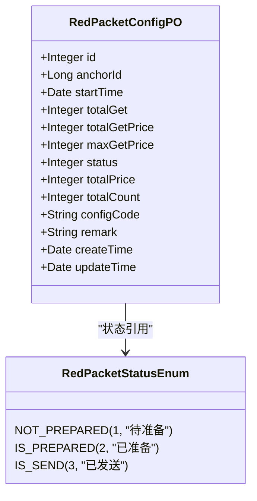
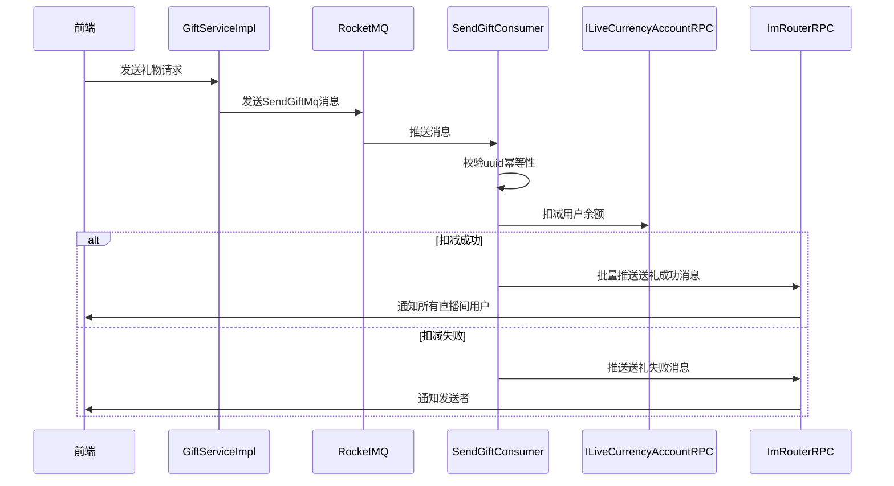
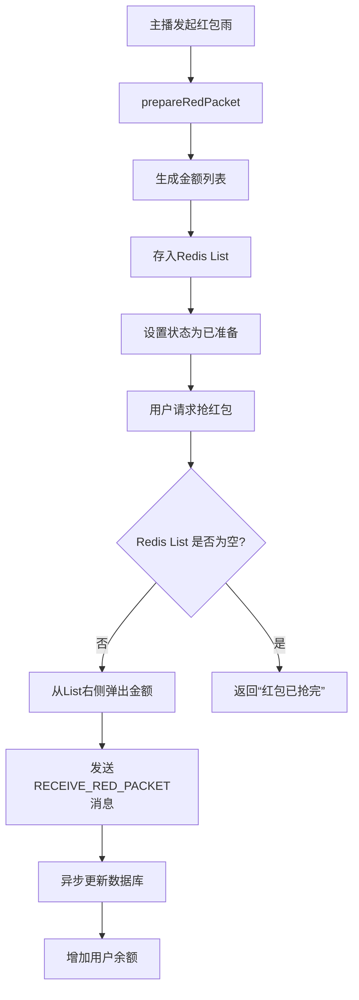

# 礼物与红包数据模型

<cite>
**本文档引用文件**  
- [GiftRecordPO.java](file://live-gift-provider/src/main/java/com/logilong/live/gift/provider/dao/po/GiftRecordPO.java)
- [RedPacketConfigPO.java](file://live-gift-provider/src/main/java/com/logilong/live/gift/provider/dao/po/RedPacketConfigPO.java)
- [SendGiftMq.java](file://live-common-interface/src/main/java/com/logilong/live/common/interfaces/dto/SendGiftMq.java)
- [secKill.lua](file://live-gift-provider/src/main/resources/secKill.lua)
- [SendGiftConsumer.java](file://live-gift-provider/src/main/java/com/logilong/live/gift/provider/consumer/SendGiftConsumer.java)
- [RedPacketConfigServiceImpl.java](file://live-gift-provider/src/main/java/com/logilong/live/gift/provider/service/impl/RedPacketConfigServiceImpl.java)
- [GiftRecordServiceImpl.java](file://live-gift-provider/src/main/java/com/logilong/live/gift/provider/service/impl/GiftRecordServiceImpl.java)
- [IRedPacketConfigMapper.java](file://live-gift-provider/src/main/java/com/logilong/live/gift/provider/dao/mapper/IRedPacketConfigMapper.java)
- [GiftProviderTopicNames.java](file://live-common-interface/src/main/java/com/logilong/live/common/interfaces/topic/GiftProviderTopicNames.java)
- [RedPacketStatusEnum.java](file://live-gift-interface/src/main/java/com/logilong/live/gift/constants/RedPacketStatusEnum.java)
- [SendGiftTypeEnum.java](file://live-gift-interface/src/main/java/com/logilong/live/gift/constants/SendGiftTypeEnum.java)
</cite>

## 目录
1. [引言](#引言)
2. [礼物记录数据模型](#礼物记录数据模型)
3. [红包配置数据模型](#红包配置数据模型)
4. [异步消息处理机制](#异步消息处理机制)
5. [高并发送礼场景设计](#高并发送礼场景设计)
6. [索引策略与查询优化](#索引策略与查询优化)
7. [总结](#总结)

## 引言
本文档详细阐述直播平台中礼物系统的核心数据模型，重点分析礼物记录（GiftRecordPO）和红包配置（RedPacketConfigPO）的存储设计。文档涵盖字段定义、业务逻辑、异步处理机制以及高并发场景下的防刷与库存控制策略，为系统维护和性能优化提供全面的技术参考。

## 礼物记录数据模型

礼物记录实体 `GiftRecordPO` 用于持久化用户送礼行为，存储关键交易信息。该实体映射到数据库表 `t_gift_record`，其核心字段包括：

- **id**: 主键，自增
- **userId**: 发送者用户ID
- **objectId**: 接收对象ID（如主播ID）
- **source**: 来源标识
- **price**: 礼物价值（以平台币为单位）
- **priceUnit**: 价格单位
- **giftId**: 礼物类型ID
- **sendTime**: 发送时间

礼物记录通过服务层 `GiftRecordServiceImpl` 进行管理，该服务接收 `GiftRecordDTO` 数据传输对象，将其转换为持久化对象并插入数据库。整个过程由 MyBatis-Plus 框架支持，确保数据操作的高效与安全。

**Section sources**
- [GiftRecordPO.java](file://live-gift-provider/src/main/java/com/logilong/live/gift/provider/dao/po/GiftRecordPO.java)
- [GiftRecordServiceImpl.java](file://live-gift-provider/src/main/java/com/logilong/live/gift/provider/service/impl/GiftRecordServiceImpl.java)
- [GiftRecordDTO.java](file://live-gift-interface/src/main/java/com/logilong/live/gift/dto/GiftRecordDTO.java)

## 红包配置数据模型

红包配置实体 `RedPacketConfigPO` 用于管理“红包雨”等营销活动的参数设置，存储在 `t_red_packet_config` 表中。其核心字段如下：

- **id**: 主键
- **anchorId**: 主播ID（活动发起者）
- **startTime**: 活动开始时间
- **totalGet**: 已领取红包数量
- **totalGetPrice**: 已领取总金额
- **maxGetPrice**: 单个红包最大金额
- **status**: 活动状态（参考 `RedPacketStatusEnum`）
- **totalPrice**: 红包总金额
- **totalCount**: 红包总数量
- **configCode**: 配置唯一编码
- **remark**: 备注信息
- **createTime/updateTime**: 创建/更新时间

红包状态由 `RedPacketStatusEnum` 枚举定义，包含：
- `NOT_PREPARED` (1): 待准备
- `IS_PREPARED` (2): 已准备
- `IS_SEND` (3): 已发送

红包配置服务 `RedPacketConfigServiceImpl` 提供了完整的生命周期管理，包括创建、准备、启动和领取功能。红包金额采用“二倍均值法”随机分配，确保公平性和趣味性。



**Diagram sources**
- [RedPacketConfigPO.java](file://live-gift-provider/src/main/java/com/logilong/live/gift/provider/dao/po/RedPacketConfigPO.java)
- [RedPacketStatusEnum.java](file://live-gift-interface/src/main/java/com/logilong/live/gift/constants/RedPacketStatusEnum.java)

**Section sources**
- [RedPacketConfigPO.java](file://live-gift-provider/src/main/java/com/logilong/live/gift/provider/dao/po/RedPacketConfigPO.java)
- [RedPacketConfigServiceImpl.java](file://live-gift-provider/src/main/java/com/logilong/live/gift/provider/service/impl/RedPacketConfigServiceImpl.java)
- [RedPacketStatusEnum.java](file://live-gift-interface/src/main/java/com/logilong/live/gift/constants/RedPacketStatusEnum.java)

## 异步消息处理机制

系统采用 RocketMQ 实现异步解耦，核心消息体为 `SendGiftMq`，用于在送礼成功后更新用户账户和直播间统计。

### 消息结构
`SendGiftMq` 包含以下关键字段：
- **userId**: 发送者ID
- **giftId**: 礼物ID
- **price**: 价格
- **receiverId**: 接收者ID
- **roomId**: 直播间ID
- **url**: 礼物特效资源路径
- **uuid**: 唯一标识（用于幂等性控制）
- **type**: 发送类型（参考 `SendGiftTypeEnum`）

### 消费流程
`SendGiftConsumer` 作为消息消费者，处理流程如下：

1. **幂等性校验**: 使用 Redis 分布式锁（基于 `uuid`）防止消息重复消费。
2. **账户扣减**: 调用 `ILiveCurrencyAccountRPC` 扣减用户余额。
3. **消息通知**: 若扣减成功，根据 `type` 字段（`DEFAULT_SEND_GIFT` 或 `PK_SEND_GIFT`）向直播间所有用户推送送礼成功消息。
4. **失败处理**: 若余额不足，则向发送者推送失败通知。



**Diagram sources**
- [SendGiftMq.java](file://live-common-interface/src/main/java/com/logilong/live/common/interfaces/dto/SendGiftMq.java)
- [SendGiftConsumer.java](file://live-gift-provider/src/main/java/com/logilong/live/gift/provider/consumer/SendGiftConsumer.java)
- [GiftProviderTopicNames.java](file://live-common-interface/src/main/java/com/logilong/live/common/interfaces/topic/GiftProviderTopicNames.java)

**Section sources**
- [SendGiftMq.java](file://live-common-interface/src/main/java/com/logilong/live/common/interfaces/dto/SendGiftMq.java)
- [SendGiftConsumer.java](file://live-gift-provider/src/main/java/com/logilong/live/gift/provider/consumer/SendGiftConsumer.java)
- [SendGiftTypeEnum.java](file://live-gift-interface/src/main/java/com/logilong/live/gift/constants/SendGiftTypeEnum.java)

## 高并发送礼场景设计

针对“红包雨”等高并发场景，系统采用 Redis + Lua 脚本实现高性能、原子性的库存扣减与防刷机制。

### Redis Lua 脚本
`secKill.lua` 脚本用于原子化地检查库存并扣减数量：

```lua
if (redis.call('exists', KEYS[1])) == 1 then
    local currentStock = redis.call('get', KEYS[1])
    if (tonumber(currentStock) >= tonumber(ARGV[1])) then
        return redis.call('decrby', KEYS[1], tonumber(ARGV[1]))
    else
        return -1
    end
    return -1
end
```

该脚本确保在高并发下，库存扣减操作的原子性，避免超卖。

### 红包雨流程
1. **准备阶段**: `prepareRedPacket` 方法将红包金额列表拆分后存入 Redis List 结构，并设置过期时间。
2. **开始阶段**: `startRedPacket` 方法通过 IM 消息广播通知所有用户可以抢红包。
3. **领取阶段**: 用户调用 `receiveRedPacket`，从 Redis List 的右侧弹出一个金额（`rightPop`），实现公平的领取顺序。
4. **异步处理**: 领取成功后，发送 `RECEIVE_RED_PACKET` 消息，由消费者异步更新数据库统计和用户余额。

此设计将核心的高并发操作（抢红包）下沉到 Redis，极大减轻了数据库压力。



**Diagram sources**
- [secKill.lua](file://live-gift-provider/src/main/resources/secKill.lua)
- [RedPacketConfigServiceImpl.java](file://live-gift-provider/src/main/java/com/logilong/live/gift/provider/service/impl/RedPacketConfigServiceImpl.java)
- [IRedPacketConfigMapper.java](file://live-gift-provider/src/main/java/com/logilong/live/gift/provider/dao/mapper/IRedPacketConfigMapper.java)

**Section sources**
- [secKill.lua](file://live-gift-provider/src/main/resources/secKill.lua)
- [RedPacketConfigServiceImpl.java](file://live-gift-provider/src/main/java/com/logilong/live/gift/provider/service/impl/RedPacketConfigServiceImpl.java)

## 索引策略与查询优化

### 数据库索引
- **t_gift_record**:
  - 主键索引: `id`
  - 普通索引: `userId`, `objectId`, `giftId`, `sendTime` (支持按用户、主播、礼物类型和时间范围查询)
- **t_red_packet_config**:
  - 主键索引: `id`
  - 唯一索引: `configCode` (确保配置码唯一)
  - 普通索引: `anchorId`, `status`, `createTime` (支持按主播ID和状态快速查询活动)

### 查询优化建议
1. **分页查询**: 对于礼物记录的历史查询，使用 `sendTime` 和 `id` 进行分页，避免全表扫描。
2. **缓存热点数据**: 将正在进行的红包活动配置（`status=2`）缓存到 Redis，减少数据库查询。
3. **批量操作**: 在统计类操作中，优先使用 Redis 的原子操作（如 `incrby`, `hincrby`）进行实时统计，定时同步到数据库。
4. **避免 N+1 查询**: 在服务层合理使用 MyBatis 的关联查询或批量查询，减少数据库交互次数。

**Section sources**
- [GiftRecordPO.java](file://live-gift-provider/src/main/java/com/logilong/live/gift/provider/dao/po/GiftRecordPO.java)
- [RedPacketConfigPO.java](file://live-gift-provider/src/main/java/com/logilong/live/gift/provider/dao/po/RedPacketConfigPO.java)
- [IRedPacketConfigMapper.java](file://live-gift-provider/src/main/java/com/logilong/live/gift/provider/dao/mapper/IRedPacketConfigMapper.java)

## 总结
本系统通过精心设计的 `GiftRecordPO` 和 `RedPacketConfigPO` 数据模型，结合 RocketMQ 异步消息和 Redis Lua 脚本，构建了一个高性能、高可靠的礼物与红包系统。核心优势在于：
- **数据模型清晰**: 字段定义完整，覆盖业务全场景。
- **异步解耦**: 通过消息队列分离核心交易与后续处理，提升响应速度。
- **高并发支持**: 利用 Redis 实现原子操作，有效应对“红包雨”等瞬时高并发场景。
- **可扩展性强**: 模块化设计便于功能扩展和维护。

该设计为直播平台的互动功能提供了坚实的技术基础。