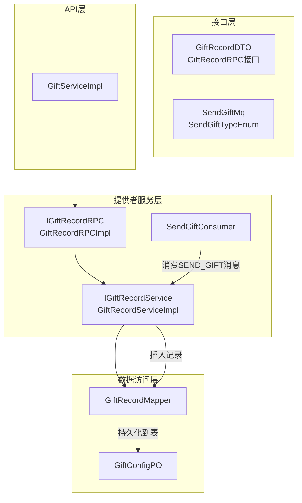
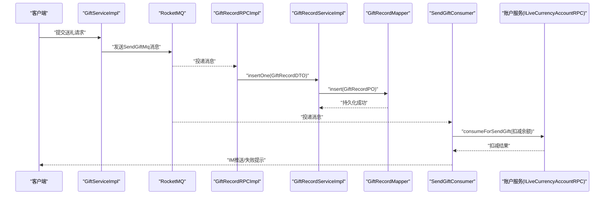
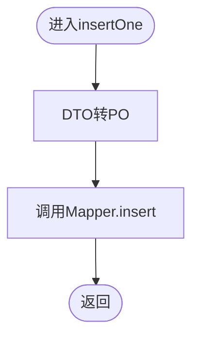
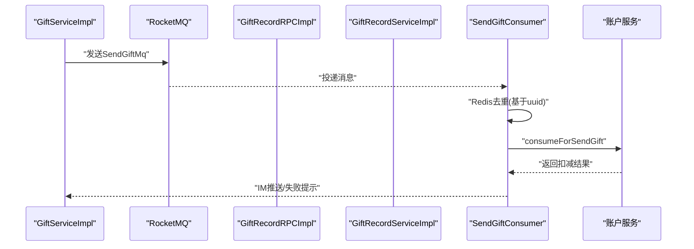
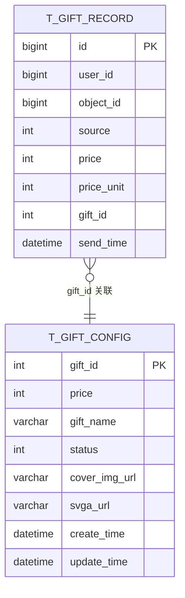
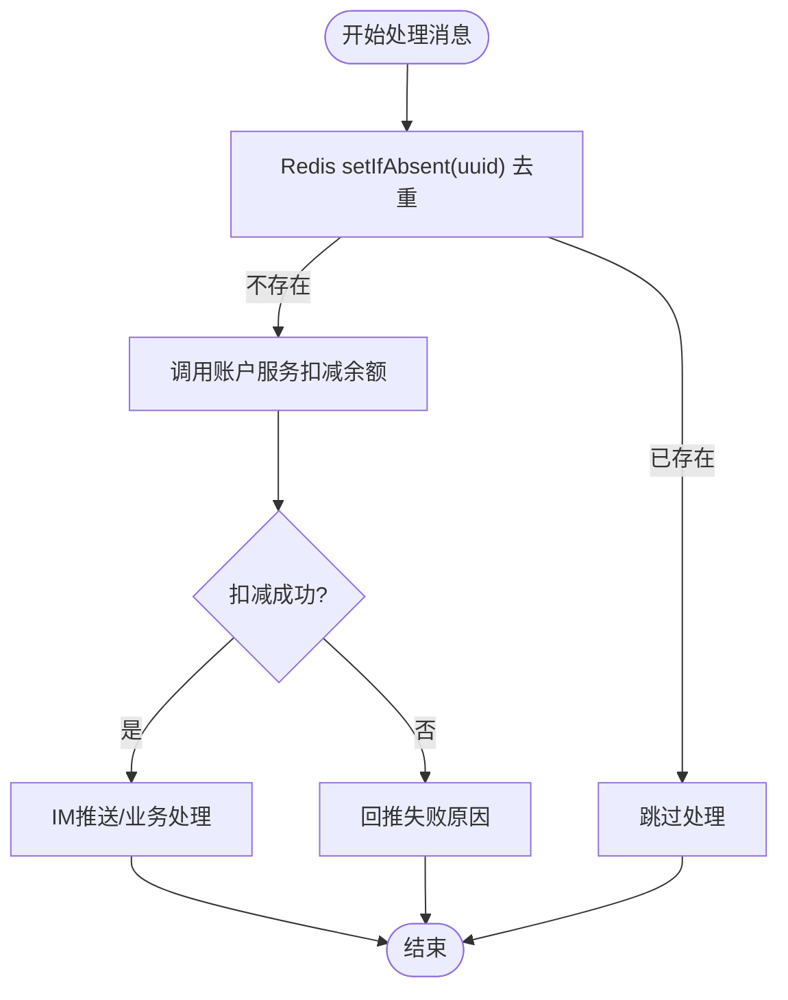
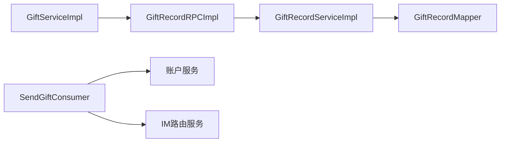

# 礼物记录数据模型

<cite>
**本文引用的文件**
- [GiftRecordPO.java](file://live-gift-provider/src/main/java/com/logilong/live/gift/provider/dao/po/GiftRecordPO.java)
- [GiftRecordDTO.java](file://live-gift-interface/src/main/java/com/logilong/live/gift/dto/GiftRecordDTO.java)
- [IGiftRecordService.java](file://live-gift-provider/src/main/java/com/logilong/live/gift/provider/service/IGiftRecordService.java)
- [GiftRecordServiceImpl.java](file://live-gift-provider/src/main/java/com/logilong/live/gift/provider/service/impl/GiftRecordServiceImpl.java)
- [IGiftRecordRPC.java](file://live-gift-interface/src/main/java/com/logilong/live/gift/interfaces/IGiftRecordRPC.java)
- [GiftRecordRPCImpl.java](file://live-gift-provider/src/main/java/com/logilong/live/gift/provider/rpc/GiftRecordRPCImpl.java)
- [GiftRecordMapper.java](file://live-gift-provider/src/main/java/com/logilong/live/gift/provider/dao/mapper/GiftRecordMapper.java)
- [GiftConfigPO.java](file://live-gift-provider/src/main/java/com/logilong/live/gift/provider/dao/po/GiftConfigPO.java)
- [SendGiftMq.java](file://live-common-interface/src/main/java/com/logilong/live/common/interfaces/dto/SendGiftMq.java)
- [SendGiftConsumer.java](file://live-gift-provider/src/main/java/com/logilong/live/gift/provider/consumer/SendGiftConsumer.java)
- [GiftServiceImpl.java](file://live-api/src/main/java/com/logilong/live/api/service/impl/GiftServiceImpl.java)
- [secKill.lua](file://live-gift-provider/src/main/resources/secKill.lua)
- [SendGiftTypeEnum.java](file://live-gift-interface/src/main/java/com/logilong/live/gift/constants/SendGiftTypeEnum.java)
</cite>

## 目录
1. [简介](#简介)
2. [项目结构](#项目结构)
3. [核心组件](#核心组件)
4. [架构总览](#架构总览)
5. [详细组件分析](#详细组件分析)
6. [依赖分析](#依赖分析)
7. [性能考虑](#性能考虑)
8. [故障排查指南](#故障排查指南)
9. [结论](#结论)

## 简介
本文件围绕礼物记录数据模型（GiftRecordPO）进行系统化说明，重点阐述字段语义、在送礼业务流程中的作用、持久化路径、与礼物配置（GiftConfigPO）的关联关系，以及在高并发场景下如何结合Redis与Lua脚本保障一致性。同时给出数据库索引设计建议，帮助优化查询性能。

## 项目结构
与礼物记录相关的模块分布如下：
- 接口层：定义DTO与RPC接口，负责对外暴露能力
- 提供者服务层：实现业务逻辑，包含持久化与消息处理
- 数据访问层：MyBatis映射GiftRecordPO与GiftConfigPO
- 公共组件：消息体定义与枚举常量

图表来源
- [GiftRecordDTO.java](file://live-gift-interface/src/main/java/com/logilong/live/gift/dto/GiftRecordDTO.java#L1-L23)
- [IGiftRecordRPC.java](file://live-gift-interface/src/main/java/com/logilong/live/gift/interfaces/IGiftRecordRPC.java#L1-L11)
- [GiftRecordRPCImpl.java](file://live-gift-provider/src/main/java/com/logilong/live/gift/provider/rpc/GiftRecordRPCImpl.java#L1-L20)
- [IGiftRecordService.java](file://live-gift-provider/src/main/java/com/logilong/live/gift/provider/service/IGiftRecordService.java#L1-L15)
- [GiftRecordServiceImpl.java](file://live-gift-provider/src/main/java/com/logilong/live/gift/provider/service/impl/GiftRecordServiceImpl.java#L1-L23)
- [GiftRecordMapper.java](file://live-gift-provider/src/main/java/com/logilong/live/gift/provider/dao/mapper/GiftRecordMapper.java#L1-L10)
- [SendGiftConsumer.java](file://live-gift-provider/src/main/java/com/logilong/live/gift/provider/consumer/SendGiftConsumer.java#L1-L212)
- [GiftServiceImpl.java](file://live-api/src/main/java/com/logilong/live/api/service/impl/GiftServiceImpl.java#L1-L78)
- [GiftConfigPO.java](file://live-gift-provider/src/main/java/com/logilong/live/gift/provider/dao/po/GiftConfigPO.java#L1-L24)

章节来源
- [GiftRecordPO.java](file://live-gift-provider/src/main/java/com/logilong/live/gift/provider/dao/po/GiftRecordPO.java#L1-L24)
- [GiftRecordDTO.java](file://live-gift-interface/src/main/java/com/logilong/live/gift/dto/GiftRecordDTO.java#L1-L23)
- [IGiftRecordService.java](file://live-gift-provider/src/main/java/com/logilong/live/gift/provider/service/IGiftRecordService.java#L1-L15)
- [GiftRecordServiceImpl.java](file://live-gift-provider/src/main/java/com/logilong/live/gift/provider/service/impl/GiftRecordServiceImpl.java#L1-L23)
- [IGiftRecordRPC.java](file://live-gift-interface/src/main/java/com/logilong/live/gift/interfaces/IGiftRecordRPC.java#L1-L11)
- [GiftRecordRPCImpl.java](file://live-gift-provider/src/main/java/com/logilong/live/gift/provider/rpc/GiftRecordRPCImpl.java#L1-L20)
- [GiftRecordMapper.java](file://live-gift-provider/src/main/java/com/logilong/live/gift/provider/dao/mapper/GiftRecordMapper.java#L1-L10)
- [SendGiftConsumer.java](file://live-gift-provider/src/main/java/com/logilong/live/gift/provider/consumer/SendGiftConsumer.java#L1-L212)
- [GiftServiceImpl.java](file://live-api/src/main/java/com/logilong/live/api/service/impl/GiftServiceImpl.java#L1-L78)
- [GiftConfigPO.java](file://live-gift-provider/src/main/java/com/logilong/live/gift/provider/dao/po/GiftConfigPO.java#L1-L24)
- [SendGiftTypeEnum.java](file://live-gift-interface/src/main/java/com/logilong/live/gift/constants/SendGiftTypeEnum.java#L1-L18)

## 核心组件
- 数据模型：GiftRecordPO（数据库表t_gift_record对应实体）
- DTO：GiftRecordDTO（跨进程传输载体）
- 服务接口与实现：IGiftRecordService、GiftRecordServiceImpl
- RPC接口与实现：IGiftRecordRPC、GiftRecordRPCImpl
- 数据访问：GiftRecordMapper
- 消息体：SendGiftMq（用于异步扣款与推送）
- 高并发支持：Redis + Lua脚本（secKill.lua）

章节来源
- [GiftRecordPO.java](file://live-gift-provider/src/main/java/com/logilong/live/gift/provider/dao/po/GiftRecordPO.java#L1-L24)
- [GiftRecordDTO.java](file://live-gift-interface/src/main/java/com/logilong/live/gift/dto/GiftRecordDTO.java#L1-L23)
- [IGiftRecordService.java](file://live-gift-provider/src/main/java/com/logilong/live/gift/provider/service/IGiftRecordService.java#L1-L15)
- [GiftRecordServiceImpl.java](file://live-gift-provider/src/main/java/com/logilong/live/gift/provider/service/impl/GiftRecordServiceImpl.java#L1-L23)
- [IGiftRecordRPC.java](file://live-gift-interface/src/main/java/com/logilong/live/gift/interfaces/IGiftRecordRPC.java#L1-L11)
- [GiftRecordRPCImpl.java](file://live-gift-provider/src/main/java/com/logilong/live/gift/provider/rpc/GiftRecordRPCImpl.java#L1-L20)
- [GiftRecordMapper.java](file://live-gift-provider/src/main/java/com/logilong/live/gift/provider/dao/mapper/GiftRecordMapper.java#L1-L10)
- [SendGiftMq.java](file://live-common-interface/src/main/java/com/logilong/live/common/interfaces/dto/SendGiftMq.java#L1-L17)
- [secKill.lua](file://live-gift-provider/src/main/resources/secKill.lua#L1-L9)

## 架构总览
送礼流程的关键路径：
- API层接收请求，构造SendGiftMq并通过RocketMQ发送
- GiftRecordServiceImpl.insertOne持久化送礼记录
- SendGiftConsumer消费消息，调用账户服务扣减余额，成功后进行IM推送

图表来源
- [GiftServiceImpl.java](file://live-api/src/main/java/com/logilong/live/api/service/impl/GiftServiceImpl.java#L1-L78)
- [IGiftRecordRPC.java](file://live-gift-interface/src/main/java/com/logilong/live/gift/interfaces/IGiftRecordRPC.java#L1-L11)
- [GiftRecordRPCImpl.java](file://live-gift-provider/src/main/java/com/logilong/live/gift/provider/rpc/GiftRecordRPCImpl.java#L1-L20)
- [IGiftRecordService.java](file://live-gift-provider/src/main/java/com/logilong/live/gift/provider/service/IGiftRecordService.java#L1-L15)
- [GiftRecordServiceImpl.java](file://live-gift-provider/src/main/java/com/logilong/live/gift/provider/service/impl/GiftRecordServiceImpl.java#L1-L23)
- [GiftRecordMapper.java](file://live-gift-provider/src/main/java/com/logilong/live/gift/provider/dao/mapper/GiftRecordMapper.java#L1-L10)
- [SendGiftConsumer.java](file://live-gift-provider/src/main/java/com/logilong/live/gift/provider/consumer/SendGiftConsumer.java#L1-L212)

## 详细组件分析

### 数据模型：GiftRecordPO 字段说明
- id：自增主键，唯一标识每条送礼记录
- userId：发送者用户ID
- objectId：接收者ID或直播间ID（根据source类型决定）
- source：来源类型（例如：房间内送礼、PK送礼等）
- price：礼物价格（单位见priceUnit）
- priceUnit：价格单位（如分、角、元等）
- giftId：礼物配置ID，关联GiftConfigPO
- sendTime：发送时间

这些字段共同构成送礼事件的完整画像，便于后续统计、对账与风控分析。

章节来源
- [GiftRecordPO.java](file://live-gift-provider/src/main/java/com/logilong/live/gift/provider/dao/po/GiftRecordPO.java#L1-L24)
- [GiftRecordDTO.java](file://live-gift-interface/src/main/java/com/logilong/live/gift/dto/GiftRecordDTO.java#L1-L23)

### 持久化流程：GiftRecordServiceImpl.insertOne
- 接收GiftRecordDTO，转换为GiftRecordPO
- 调用GiftRecordMapper.insert持久化
- 该过程无额外事务控制，由上层调用方确保幂等与一致性

图表来源
- [GiftRecordServiceImpl.java](file://live-gift-provider/src/main/java/com/logilong/live/gift/provider/service/impl/GiftRecordServiceImpl.java#L1-L23)
- [GiftRecordMapper.java](file://live-gift-provider/src/main/java/com/logilong/live/gift/provider/dao/mapper/GiftRecordMapper.java#L1-L10)

章节来源
- [GiftRecordServiceImpl.java](file://live-gift-provider/src/main/java/com/logilong/live/gift/provider/service/impl/GiftRecordServiceImpl.java#L1-L23)
- [IGiftRecordService.java](file://live-gift-provider/src/main/java/com/logilong/live/gift/provider/service/IGiftRecordService.java#L1-L15)

### 业务流程：从送礼到消息通知
- API层构造SendGiftMq并发送至RocketMQ
- 提供者侧RPC接口转发至服务层insertOne
- 消费者监听SEND_GIFT主题，先做去重（基于uuid+Redis锁），再调用账户服务扣减余额
- 成功后进行IM推送；失败则回推失败原因

图表来源
- [GiftServiceImpl.java](file://live-api/src/main/java/com/logilong/live/api/service/impl/GiftServiceImpl.java#L1-L78)
- [SendGiftConsumer.java](file://live-gift-provider/src/main/java/com/logilong/live/gift/provider/consumer/SendGiftConsumer.java#L1-L212)
- [SendGiftMq.java](file://live-common-interface/src/main/java/com/logilong/live/common/interfaces/dto/SendGiftMq.java#L1-L17)

章节来源
- [GiftServiceImpl.java](file://live-api/src/main/java/com/logilong/live/api/service/impl/GiftServiceImpl.java#L1-L78)
- [SendGiftConsumer.java](file://live-gift-provider/src/main/java/com/logilong/live/gift/provider/consumer/SendGiftConsumer.java#L1-L212)

### 与GiftConfigPO的关联关系
- GiftRecordPO.giftId关联GiftConfigPO.giftId
- 在送礼时，API层通过IGiftConfigRPC获取礼物配置（含价格、特效URL等），随后将价格写入SendGiftMq与GiftRecordPO.price
- 这种设计使送礼记录与配置解耦，便于配置变更不影响历史记录

图表来源
- [GiftRecordPO.java](file://live-gift-provider/src/main/java/com/logilong/live/gift/provider/dao/po/GiftRecordPO.java#L1-L24)
- [GiftConfigPO.java](file://live-gift-provider/src/main/java/com/logilong/live/gift/provider/dao/po/GiftConfigPO.java#L1-L24)

章节来源
- [GiftRecordPO.java](file://live-gift-provider/src/main/java/com/logilong/live/gift/provider/dao/po/GiftRecordPO.java#L1-L24)
- [GiftConfigPO.java](file://live-gift-provider/src/main/java/com/logilong/live/gift/provider/dao/po/GiftConfigPO.java#L1-L24)
- [GiftServiceImpl.java](file://live-api/src/main/java/com/logilong/live/api/service/impl/GiftServiceImpl.java#L1-L78)

### 高并发一致性保障：Redis + Lua
- 去重：SendGiftConsumer使用Redis基于uuid的setIfAbsent实现消息去重，避免重复消费导致的重复扣款与重复推送
- 安全扣款：账户服务在MQ消费线程中执行二次校验与扣款，结合Redis锁与幂等键，保证余额扣减原子性
- 秒杀库存示例：提供secKill.lua用于库存扣减的原子性控制，可作为高并发场景下原子操作的参考模板

图表来源
- [SendGiftConsumer.java](file://live-gift-provider/src/main/java/com/logilong/live/gift/provider/consumer/SendGiftConsumer.java#L1-L212)
- [secKill.lua](file://live-gift-provider/src/main/resources/secKill.lua#L1-L9)

章节来源
- [SendGiftConsumer.java](file://live-gift-provider/src/main/java/com/logilong/live/gift/provider/consumer/SendGiftConsumer.java#L1-L212)
- [secKill.lua](file://live-gift-provider/src/main/resources/secKill.lua#L1-L9)

### 数据库表索引设计建议
- 用户维度统计：在t_gift_record上建立(userId, sendTime)复合索引，便于按用户查询送礼明细与趋势分析
- 房间维度统计：在t_gift_record上建立(objectId, source, sendTime)复合索引，便于房间内送礼统计与PK进度计算
- 配置关联：giftId建立索引，加速与GiftConfigPO的关联查询
- 性能权衡：复合索引顺序应优先考虑最常用过滤条件；同时关注写入成本与维护开销

章节来源
- [GiftRecordPO.java](file://live-gift-provider/src/main/java/com/logilong/live/gift/provider/dao/po/GiftRecordPO.java#L1-L24)
- [SendGiftTypeEnum.java](file://live-gift-interface/src/main/java/com/logilong/live/gift/constants/SendGiftTypeEnum.java#L1-L18)

## 依赖分析
- GiftRecordServiceImpl依赖GiftRecordMapper进行持久化
- GiftRecordRPCImpl依赖IGiftRecordService
- API层通过IGiftRecordRPC调用提供者服务
- SendGiftConsumer依赖账户服务与IM路由服务，消费RocketMQ消息

图表来源
- [GiftServiceImpl.java](file://live-api/src/main/java/com/logilong/live/api/service/impl/GiftServiceImpl.java#L1-L78)
- [GiftRecordRPCImpl.java](file://live-gift-provider/src/main/java/com/logilong/live/gift/provider/rpc/GiftRecordRPCImpl.java#L1-L20)
- [GiftRecordServiceImpl.java](file://live-gift-provider/src/main/java/com/logilong/live/gift/provider/service/impl/GiftRecordServiceImpl.java#L1-L23)
- [GiftRecordMapper.java](file://live-gift-provider/src/main/java/com/logilong/live/gift/provider/dao/mapper/GiftRecordMapper.java#L1-L10)
- [SendGiftConsumer.java](file://live-gift-provider/src/main/java/com/logilong/live/gift/provider/consumer/SendGiftConsumer.java#L1-L212)

章节来源
- [GiftServiceImpl.java](file://live-api/src/main/java/com/logilong/live/api/service/impl/GiftServiceImpl.java#L1-L78)
- [GiftRecordRPCImpl.java](file://live-gift-provider/src/main/java/com/logilong/live/gift/provider/rpc/GiftRecordRPCImpl.java#L1-L20)
- [GiftRecordServiceImpl.java](file://live-gift-provider/src/main/java/com/logilong/live/gift/provider/service/impl/GiftRecordServiceImpl.java#L1-L23)
- [GiftRecordMapper.java](file://live-gift-provider/src/main/java/com/logilong/live/gift/provider/dao/mapper/GiftRecordMapper.java#L1-L10)
- [SendGiftConsumer.java](file://live-gift-provider/src/main/java/com/logilong/live/gift/provider/consumer/SendGiftConsumer.java#L1-L212)

## 性能考虑
- 写入路径：insertOne为轻量级写入，建议在上层做好幂等与去重，避免重复写入
- 消费路径：SendGiftConsumer采用批量拉取消费与Redis去重，降低重复处理概率
- 缓存策略：API层对礼物配置使用本地缓存，减少RPC调用次数
- 索引优化：按查询模式建立复合索引，平衡读写性能

## 故障排查指南
- 消息重复：检查Redis去重键是否正确设置与过期；确认uuid生成与使用
- 扣款失败：核对账户服务返回状态与错误码；检查MQ消费线程是否正确处理失败回推
- 记录缺失：确认insertOne是否被调用；检查Mapper执行日志与异常栈
- IM推送失败：检查IM路由服务可用性与消息体格式

章节来源
- [SendGiftConsumer.java](file://live-gift-provider/src/main/java/com/logilong/live/gift/provider/consumer/SendGiftConsumer.java#L1-L212)
- [GiftRecordServiceImpl.java](file://live-gift-provider/src/main/java/com/logilong/live/gift/provider/service/impl/GiftRecordServiceImpl.java#L1-L23)

## 结论
GiftRecordPO作为送礼业务的核心数据载体，承载了送礼事件的完整信息。通过RPC与Mapper实现轻量持久化，配合RocketMQ与Redis实现高并发下的可靠与一致。与GiftConfigPO的关联设计使得配置变更不影响历史记录。建议在t_gift_record上按查询需求建立复合索引，进一步提升统计与分析效率。