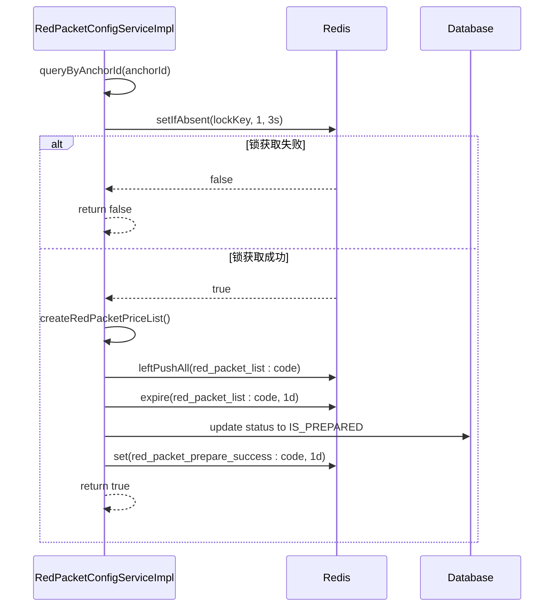
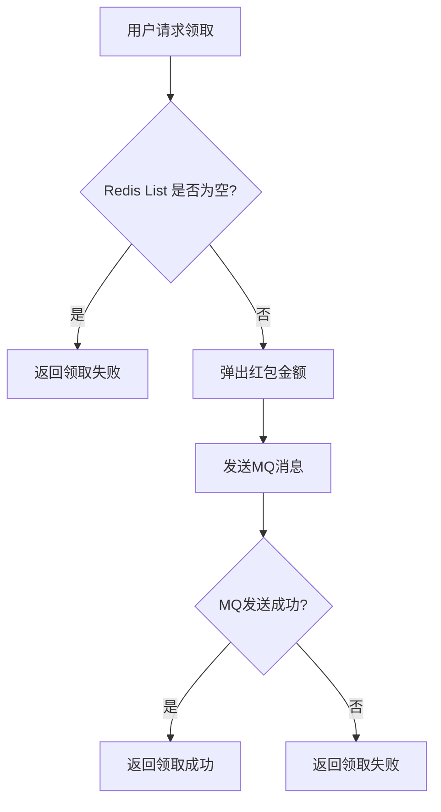

# 红包配置数据模型

<cite>
**本文档引用文件**  
- [RedPacketConfigPO.java](file://live-gift-provider/src/main/java/com/logilong/live/gift/provider/dao/po/RedPacketConfigPO.java)
- [RedPacketConfigServiceImpl.java](file://live-gift-provider/src/main/java/com/logilong/live/gift/provider/service/impl/RedPacketConfigServiceImpl.java)
- [secKill.lua](file://live-gift-provider/src/main/resources/secKill.lua)
- [IRedPacketConfigMapper.java](file://live-gift-provider/src/main/java/com/logilong/live/gift/provider/dao/mapper/IRedPacketConfigMapper.java)
- [GiftProviderCacheKeyBuilder.java](file://live-framework/live-framework-redis-starter/src/main/java/com/logilong/live/framework/redis/starter/key/GiftProviderCacheKeyBuilder.java)
- [RedPacketStatusEnum.java](file://live-gift-interface/src/main/java/com/logilong/live/gift/constants/RedPacketStatusEnum.java)
- [IRedPacketConfigRPC.java](file://live-gift-interface/src/main/java/com/logilong/live/gift/interfaces/IRedPacketConfigRPC.java)
</cite>

## 目录
1. [简介](#简介)
2. [数据模型设计](#数据模型设计)
3. [核心业务逻辑](#核心业务逻辑)
4. [高并发领取机制](#高并发领取机制)
5. [数据库优化建议](#数据库优化建议)
6. [总结](#总结)

## 简介
红包配置数据模型（RedPacketConfigPO）是直播平台“红包雨”营销活动的核心数据结构。该模型用于管理主播发起的红包雨活动的完整生命周期，包括配置、准备、发放和领取等阶段。通过合理的字段设计和分布式架构支持，系统能够高效处理高并发场景下的红包领取请求。

## 数据模型设计

### 字段说明
红包配置模型包含以下核心字段，每个字段都有明确的业务含义：

| 字段名 | 类型 | 业务意义 |
|--------|------|----------|
| id | Integer | 主键，自增标识 |
| anchorId | Long | 主播ID，标识发起红包雨的主播 |
| startTime | Date | 红包雨开始时间 |
| totalGet | Integer | 已领取数量，记录当前已领取的红包个数 |
| totalGetPrice | Integer | 已领取总金额，累计已发放的金额（单位：分） |
| maxGetPrice | Integer | 单次最大领取额，用于前端展示激励用户 |
| status | Integer | 状态，标识红包雨当前所处阶段 |
| totalPrice | Integer | 红包总金额，主播设定的总预算 |
| totalCount | Integer | 红包总数量，拆分的红包个数 |
| configCode | String | 唯一配置码，作为分布式操作的唯一标识 |
| remark | String | 备注信息，用于内部说明 |
| createTime | Date | 创建时间 |
| updateTime | Date | 更新时间 |

**Section sources**
- [RedPacketConfigPO.java](file://live-gift-provider/src/main/java/com/logilong/live/gift/provider/dao/po/RedPacketConfigPO.java)

### 状态枚举设计
系统通过`RedPacketStatusEnum`枚举定义了红包雨的三种状态：
- **NOT_PREPARED(1)**：待准备状态
- **IS_PREPARED(2)**：已准备状态
- **IS_SEND(3)**：已发送状态

该状态机设计确保了红包雨活动的有序流转，防止重复操作。

**Section sources**
- [RedPacketStatusEnum.java](file://live-gift-interface/src/main/java/com/logilong/live/gift/constants/RedPacketStatusEnum.java)

## 核心业务逻辑

### 配置初始化与准备流程
红包雨的初始化由`RedPacketConfigServiceImpl.prepareRedPacket`方法实现，其核心流程如下：

1. **查询配置**：根据主播ID查询待准备的红包配置
2. **分布式锁控制**：使用`configCode`作为Redis分布式锁的键，确保同一红包配置不会被重复准备
3. **金额拆分**：采用“二倍均值法”算法将总金额拆分为多个红包金额
4. **Redis预加载**：将拆分后的红包金额列表存入Redis List结构
5. **状态更新**：将配置状态更新为“已准备”，并设置Redis标记



**Diagram sources**
- [RedPacketConfigServiceImpl.java](file://live-gift-provider/src/main/java/com/logilong/live/gift/provider/service/impl/RedPacketConfigServiceImpl.java#L95-L122)
- [GiftProviderCacheKeyBuilder.java](file://live-framework/live-framework-redis-starter/src/main/java/com/logilong/live/framework/redis/starter/key/GiftProviderCacheKeyBuilder.java)

## 高并发领取机制

### 原子性扣减逻辑
在高并发领取场景下，系统采用Redis+Lua脚本的方式保证操作的原子性。`secKill.lua`脚本实现了库存扣减的核心逻辑：

```lua
if (redis.call('exists', KEYS[1])) == 1 then
    local currentStock = redis.call('get', KEYS[1])
    if (tonumber(currentStock) >= tonumber(ARGV[1])) then
        return redis.call('decrby', KEYS[1], tonumber(ARGV[1]))
    else
        return -1
    end
    return -1
end
```

该脚本确保了在分布式环境下对库存的扣减是原子操作，避免了超卖问题。

### 防超领机制
系统通过多层机制防止红包超领：
1. **Redis List弹出**：使用`rightPop`从Redis List中弹出红包金额，List为空时返回null
2. **状态检查**：领取前检查红包是否已准备完成
3. **异步持久化**：领取成功后通过MQ异步更新数据库统计字段



**Diagram sources**
- [secKill.lua](file://live-gift-provider/src/main/resources/secKill.lua)
- [RedPacketConfigServiceImpl.java](file://live-gift-provider/src/main/java/com/logilong/live/gift/provider/service/impl/RedPacketConfigServiceImpl.java#L172-L199)

## 数据库优化建议

### 索引优化
为提升查询性能，建议在数据库表`t_red_packet_config`上创建以下索引：

#### 唯一索引
```sql
ALTER TABLE t_red_packet_config ADD UNIQUE INDEX idx_config_code (config_code);
```
- **作用**：确保`configCode`的唯一性，防止重复配置
- **场景**：基于`configCode`的精确查询

#### 复合索引
```sql
ALTER TABLE t_red_packet_config ADD INDEX idx_anchor_status (anchorId, status);
```
- **作用**：优化根据主播ID和状态的联合查询
- **场景**：查询特定主播的红包配置状态

#### 其他建议索引
```sql
-- 按创建时间排序的查询
ALTER TABLE t_red_packet_config ADD INDEX idx_create_time (createTime DESC);

-- 按开始时间查询
ALTER TABLE t_red_packet_config ADD INDEX idx_start_time (startTime);
```

**Section sources**
- [IRedPacketConfigMapper.java](file://live-gift-provider/src/main/java/com/logilong/live/gift/provider/dao/mapper/IRedPacketConfigMapper.java)
- [RedPacketConfigPO.java](file://live-gift-provider/src/main/java/com/logilong/live/gift/provider/dao/po/RedPacketConfigPO.java)

## 总结
红包配置数据模型（RedPacketConfigPO）是“红包雨”功能的核心，通过合理的字段设计和状态管理，支持了完整的业务流程。系统采用Redis预加载、分布式锁、Lua脚本等技术手段，有效应对高并发场景下的性能挑战。通过合理的数据库索引优化，确保了关键查询的高效执行。该模型的设计体现了分布式系统中数据一致性、性能和可扩展性的平衡。