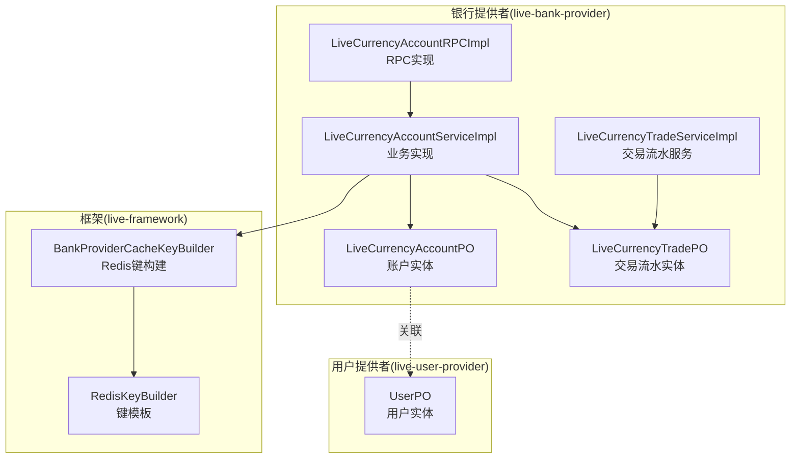
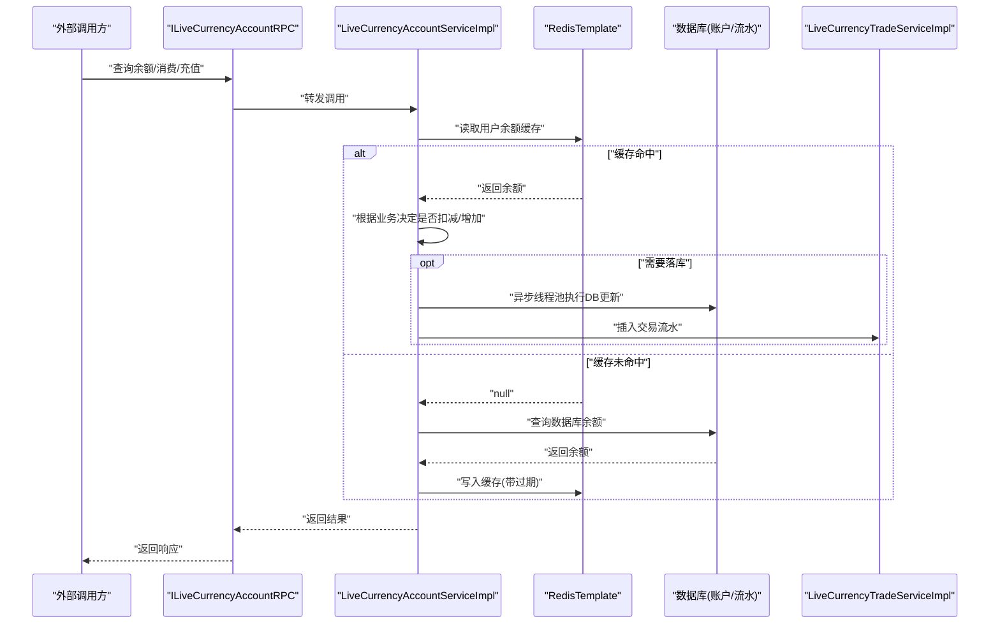
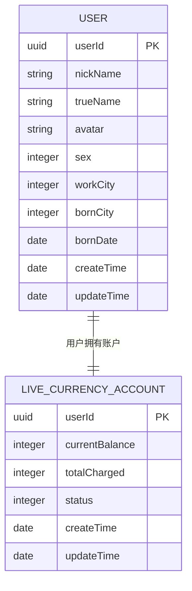
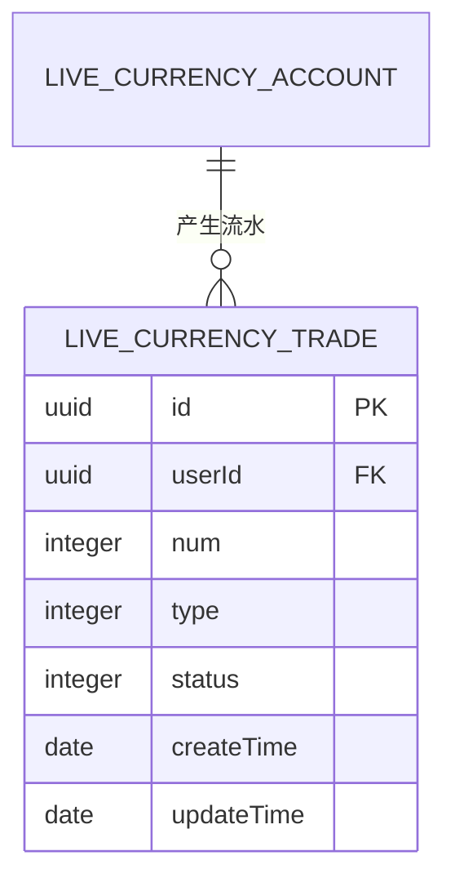
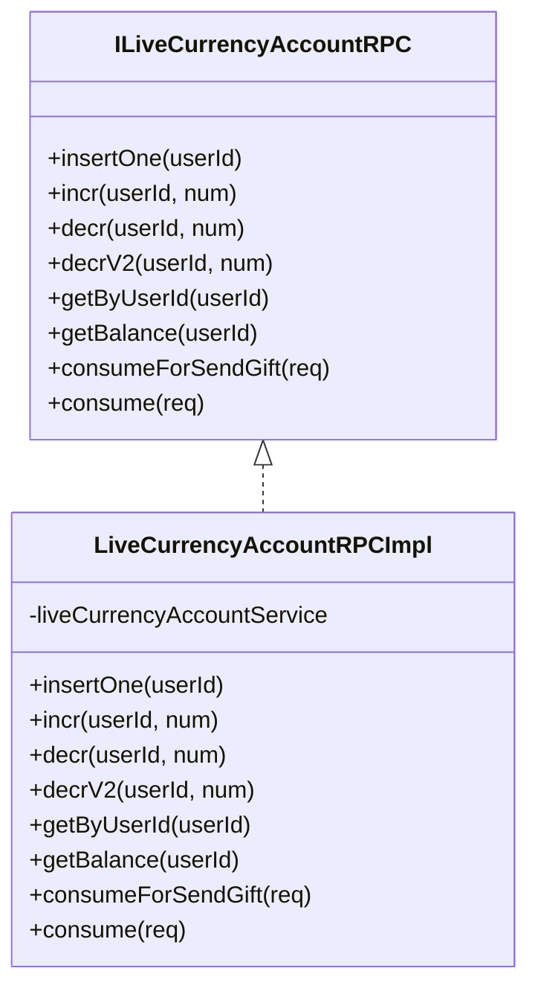
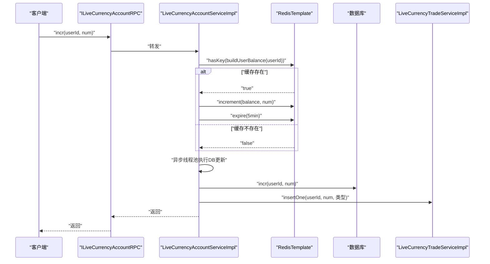
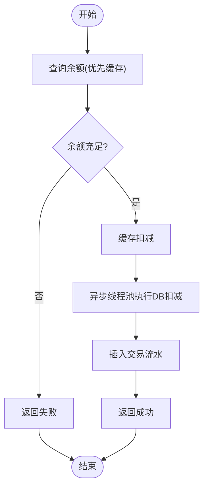
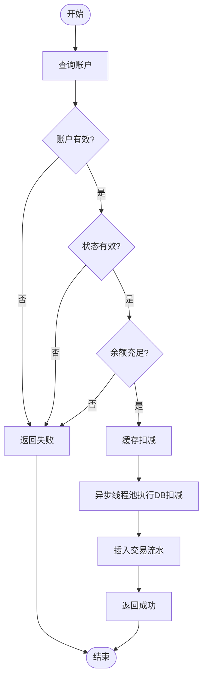
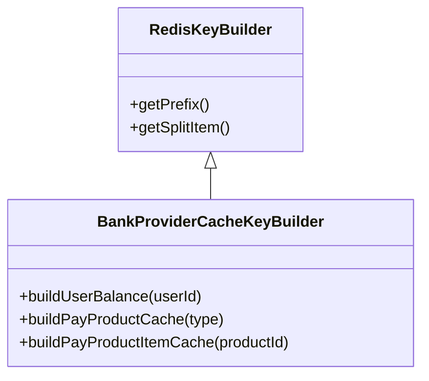
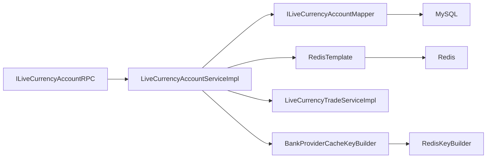

# 账户与虚拟货币模型

<cite>
**本文引用的文件列表**
- [LiveCurrencyAccountPO.java](file://live-bank-provider/src/main/java/com/logilong/live/bank/provider/dao/po/LiveCurrencyAccountPO.java)
- [LiveCurrencyTradePO.java](file://live-bank-provider/src/main/java/com/logilong/live/bank/provider/dao/po/LiveCurrencyTradePO.java)
- [UserPO.java](file://live-user-provider/src/main/java/com/logilong/live/user/provider/dao/po/UserPO.java)
- [ILiveCurrencyAccountRPC.java](file://live-bank-interface/src/main/java/com/logilong/live/bank/interfaces/ILiveCurrencyAccountRPC.java)
- [LiveCurrencyAccountRPCImpl.java](file://live-bank-provider/src/main/java/com/logilong/live/bank/provider/rpc/LiveCurrencyAccountRPCImpl.java)
- [LiveCurrencyAccountServiceImpl.java](file://live-bank-provider/src/main/java/com/logilong/live/bank/provider/service/impl/LiveCurrencyAccountServiceImpl.java)
- [LiveCurrencyTradeServiceImpl.java](file://live-bank-provider/src/main/java/com/logilong/live/bank/provider/service/impl/LiveCurrencyTradeServiceImpl.java)
- [BankProviderCacheKeyBuilder.java](file://live-framework/live-framework-redis-starter/src/main/java/com/logilong/live/framework/redis/starter/key/BankProviderCacheKeyBuilder.java)
- [RedisKeyBuilder.java](file://live-framework/live-framework-redis-starter/src/main/java/com/logilong/live/framework/redis/starter/key/RedisKeyBuilder.java)
- [TradeTypeEnum.java](file://live-bank-interface/src/main/java/com/logilong/live/bank/constants/TradeTypeEnum.java)
- [CommonStatusEnum.java](file://live-common-interface/src/main/java/com/logilong/live/common/interfaces/enums/CommonStatusEnum.java)
- [bootstrap.yml](file://live-bank-provider/src/main/resources/bootstrap.yml)
</cite>

## 目录
1. [简介](#简介)
2. [项目结构](#项目结构)
3. [核心组件](#核心组件)
4. [架构总览](#架构总览)
5. [详细组件分析](#详细组件分析)
6. [依赖关系分析](#依赖关系分析)
7. [性能考量](#性能考量)
8. [故障排查指南](#故障排查指南)
9. [结论](#结论)
10. [附录](#附录)

## 简介
本文件围绕直播平台的虚拟货币账户模型进行深入解析，重点说明：
- 账户实体 LiveCurrencyAccountPO 的字段语义与约束（余额、充值总额、状态等）
- 账户与用户 UserPO 的映射关系
- 交易流水 LiveCurrencyTradePO 的生成与关联机制
- 银行服务模块（live-bank-provider）在支付、充值、提现等场景下的数据流转
- 基于 Redis 的缓存策略（BankProviderCacheKeyBuilder）如何提升高并发读取性能并保障最终一致性

## 项目结构
该模块位于 live-bank-provider 中，采用分层架构：
- DAO 层：PO 实体与 Mapper 映射
- Service 层：业务逻辑与缓存策略
- RPC 层：对外暴露 ILiveCurrencyAccountRPC 接口
- Redis Starter：统一的缓存键构建工具

图表来源
- [LiveCurrencyAccountRPCImpl.java](file://live-bank-provider/src/main/java/com/logilong/live/bank/provider/rpc/LiveCurrencyAccountRPCImpl.java#L1-L61)
- [LiveCurrencyAccountServiceImpl.java](file://live-bank-provider/src/main/java/com/logilong/live/bank/provider/service/impl/LiveCurrencyAccountServiceImpl.java#L1-L209)
- [LiveCurrencyTradeServiceImpl.java](file://live-bank-provider/src/main/java/com/logilong/live/bank/provider/service/impl/LiveCurrencyTradeServiceImpl.java#L1-L35)
- [LiveCurrencyAccountPO.java](file://live-bank-provider/src/main/java/com/logilong/live/bank/provider/dao/po/LiveCurrencyAccountPO.java#L1-L24)
- [LiveCurrencyTradePO.java](file://live-bank-provider/src/main/java/com/logilong/live/bank/provider/dao/po/LiveCurrencyTradePO.java#L1-L22)
- [BankProviderCacheKeyBuilder.java](file://live-framework/live-framework-redis-starter/src/main/java/com/logilong/live/framework/redis/starter/key/BankProviderCacheKeyBuilder.java#L1-L37)
- [RedisKeyBuilder.java](file://live-framework/live-framework-redis-starter/src/main/java/com/logilong/live/framework/redis/starter/key/RedisKeyBuilder.java#L1-L22)
- [UserPO.java](file://live-user-provider/src/main/java/com/logilong/live/user/provider/dao/po/UserPO.java#L1-L26)

章节来源
- [LiveCurrencyAccountPO.java](file://live-bank-provider/src/main/java/com/logilong/live/bank/provider/dao/po/LiveCurrencyAccountPO.java#L1-L24)
- [LiveCurrencyTradePO.java](file://live-bank-provider/src/main/java/com/logilong/live/bank/provider/dao/po/LiveCurrencyTradePO.java#L1-L22)
- [UserPO.java](file://live-user-provider/src/main/java/com/logilong/live/user/provider/dao/po/UserPO.java#L1-L26)
- [ILiveCurrencyAccountRPC.java](file://live-bank-interface/src/main/java/com/logilong/live/bank/interfaces/ILiveCurrencyAccountRPC.java#L1-L54)
- [LiveCurrencyAccountRPCImpl.java](file://live-bank-provider/src/main/java/com/logilong/live/bank/provider/rpc/LiveCurrencyAccountRPCImpl.java#L1-L61)
- [LiveCurrencyAccountServiceImpl.java](file://live-bank-provider/src/main/java/com/logilong/live/bank/provider/service/impl/LiveCurrencyAccountServiceImpl.java#L1-L209)
- [LiveCurrencyTradeServiceImpl.java](file://live-bank-provider/src/main/java/com/logilong/live/bank/provider/service/impl/LiveCurrencyTradeServiceImpl.java#L1-L35)
- [BankProviderCacheKeyBuilder.java](file://live-framework/live-framework-redis-starter/src/main/java/com/logilong/live/framework/redis/starter/key/BankProviderCacheKeyBuilder.java#L1-L37)
- [RedisKeyBuilder.java](file://live-framework/live-framework-redis-starter/src/main/java/com/logilong/live/framework/redis/starter/key/RedisKeyBuilder.java#L1-L22)
- [bootstrap.yml](file://live-bank-provider/src/main/resources/bootstrap.yml#L1-L22)

## 核心组件
- 账户实体 LiveCurrencyAccountPO：包含用户标识、当前余额、累计充值、状态、创建/更新时间等字段
- 交易流水实体 LiveCurrencyTradePO：记录每次交易的用户、数量、类型、状态、创建/更新时间
- 用户实体 UserPO：用户基本信息，与账户通过 userId 建立一对一映射
- RPC 接口 ILiveCurrencyAccountRPC：对外暴露账户新增、余额增减、余额查询、消费等能力
- 业务实现 LiveCurrencyAccountServiceImpl：负责缓存读写、异步落库、流水记录、并发控制
- 交易流水服务 LiveCurrencyTradeServiceImpl：负责交易流水持久化
- Redis 键构建 BankProviderCacheKeyBuilder：统一构建用户余额缓存键，继承 RedisKeyBuilder

章节来源
- [LiveCurrencyAccountPO.java](file://live-bank-provider/src/main/java/com/logilong/live/bank/provider/dao/po/LiveCurrencyAccountPO.java#L1-L24)
- [LiveCurrencyTradePO.java](file://live-bank-provider/src/main/java/com/logilong/live/bank/provider/dao/po/LiveCurrencyTradePO.java#L1-L22)
- [UserPO.java](file://live-user-provider/src/main/java/com/logilong/live/user/provider/dao/po/UserPO.java#L1-L26)
- [ILiveCurrencyAccountRPC.java](file://live-bank-interface/src/main/java/com/logilong/live/bank/interfaces/ILiveCurrencyAccountRPC.java#L1-L54)
- [LiveCurrencyAccountRPCImpl.java](file://live-bank-provider/src/main/java/com/logilong/live/bank/provider/rpc/LiveCurrencyAccountRPCImpl.java#L1-L61)
- [LiveCurrencyAccountServiceImpl.java](file://live-bank-provider/src/main/java/com/logilong/live/bank/provider/service/impl/LiveCurrencyAccountServiceImpl.java#L1-L209)
- [LiveCurrencyTradeServiceImpl.java](file://live-bank-provider/src/main/java/com/logilong/live/bank/provider/service/impl/LiveCurrencyTradeServiceImpl.java#L1-L35)
- [BankProviderCacheKeyBuilder.java](file://live-framework/live-framework-redis-starter/src/main/java/com/logilong/live/framework/redis/starter/key/BankProviderCacheKeyBuilder.java#L1-L37)
- [RedisKeyBuilder.java](file://live-framework/live-framework-redis-starter/src/main/java/com/logilong/live/framework/redis/starter/key/RedisKeyBuilder.java#L1-L22)

## 架构总览
银行服务模块通过 Dubbo RPC 对外提供账户能力，内部使用 Redis 缓存热点余额，采用异步线程池落库并记录交易流水，遵循最终一致性的 CAP 理论折中。

图表来源
- [LiveCurrencyAccountRPCImpl.java](file://live-bank-provider/src/main/java/com/logilong/live/bank/provider/rpc/LiveCurrencyAccountRPCImpl.java#L1-L61)
- [LiveCurrencyAccountServiceImpl.java](file://live-bank-provider/src/main/java/com/logilong/live/bank/provider/service/impl/LiveCurrencyAccountServiceImpl.java#L1-L209)
- [LiveCurrencyTradeServiceImpl.java](file://live-bank-provider/src/main/java/com/logilong/live/bank/provider/service/impl/LiveCurrencyTradeServiceImpl.java#L1-L35)
- [BankProviderCacheKeyBuilder.java](file://live-framework/live-framework-redis-starter/src/main/java/com/logilong/live/framework/redis/starter/key/BankProviderCacheKeyBuilder.java#L1-L37)

## 详细组件分析

### 账户模型与字段语义
- 字段与含义
  - userId：主键，唯一标识用户
  - currentBalance：当前可用余额（整型，单位通常为“分”或“最小货币单位”，具体以业务为准）
  - totalCharged：累计充值金额（整型，单位同上）
  - status：账户状态（有效/无效），配合通用状态枚举使用
  - createTime/updateTime：记录创建与更新时间
- 数据约束
  - 主键由用户ID承担，避免重复账户
  - 余额字段应为非负数；业务侧在消费时需校验余额充足
  - 状态字段应与通用状态枚举保持一致

图表来源
- [UserPO.java](file://live-user-provider/src/main/java/com/logilong/live/user/provider/dao/po/UserPO.java#L1-L26)
- [LiveCurrencyAccountPO.java](file://live-bank-provider/src/main/java/com/logilong/live/bank/provider/dao/po/LiveCurrencyAccountPO.java#L1-L24)

章节来源
- [LiveCurrencyAccountPO.java](file://live-bank-provider/src/main/java/com/logilong/live/bank/provider/dao/po/LiveCurrencyAccountPO.java#L1-L24)
- [UserPO.java](file://live-user-provider/src/main/java/com/logilong/live/user/provider/dao/po/UserPO.java#L1-L26)
- [CommonStatusEnum.java](file://live-common-interface/src/main/java/com/logilong/live/common/interfaces/enums/CommonStatusEnum.java#L1-L17)

### 交易流水模型与关联机制
- 字段与含义
  - id：流水主键
  - userId：关联账户
  - num：变动数量（正数表示收入，负数表示支出）
  - type：交易类型（如送礼、直播间充值等）
  - status：流水状态（有效/无效）
  - createTime/updateTime：记录创建与更新时间
- 关联机制
  - 每次充值/消费都会产生一条流水记录，num 为正值或负值，type 标识业务类型
  - 流水与账户通过 userId 关联，便于对账与审计

图表来源
- [LiveCurrencyAccountPO.java](file://live-bank-provider/src/main/java/com/logilong/live/bank/provider/dao/po/LiveCurrencyAccountPO.java#L1-L24)
- [LiveCurrencyTradePO.java](file://live-bank-provider/src/main/java/com/logilong/live/bank/provider/dao/po/LiveCurrencyTradePO.java#L1-L22)
- [TradeTypeEnum.java](file://live-bank-interface/src/main/java/com/logilong/live/bank/constants/TradeTypeEnum.java#L1-L18)

章节来源
- [LiveCurrencyTradePO.java](file://live-bank-provider/src/main/java/com/logilong/live/bank/provider/dao/po/LiveCurrencyTradePO.java#L1-L22)
- [TradeTypeEnum.java](file://live-bank-interface/src/main/java/com/logilong/live/bank/constants/TradeTypeEnum.java#L1-L18)
- [LiveCurrencyTradeServiceImpl.java](file://live-bank-provider/src/main/java/com/logilong/live/bank/provider/service/impl/LiveCurrencyTradeServiceImpl.java#L1-L35)

### RPC 接口与业务能力
- 主要方法
  - insertOne(userId)：初始化账户
  - incr(userId, num)：增加虚拟币（异步落库）
  - decr(userId, num)：扣减虚拟币（异步落库）
  - decrV2(userId, num)：带余额校验的扣减
  - getByUserId(userId)：查询账户
  - getBalance(userId)：查询余额（优先缓存）
  - consumeForSendGift(req)：送礼专用消费（高并发优化）
  - consume(req)：通用消费（余额充足才扣减）

图表来源
- [ILiveCurrencyAccountRPC.java](file://live-bank-interface/src/main/java/com/logilong/live/bank/interfaces/ILiveCurrencyAccountRPC.java#L1-L54)
- [LiveCurrencyAccountRPCImpl.java](file://live-bank-provider/src/main/java/com/logilong/live/bank/provider/rpc/LiveCurrencyAccountRPCImpl.java#L1-L61)

章节来源
- [ILiveCurrencyAccountRPC.java](file://live-bank-interface/src/main/java/com/logilong/live/bank/interfaces/ILiveCurrencyAccountRPC.java#L1-L54)
- [LiveCurrencyAccountRPCImpl.java](file://live-bank-provider/src/main/java/com/logilong/live/bank/provider/rpc/LiveCurrencyAccountRPCImpl.java#L1-L61)

### 业务流程与数据流转

#### 充值流程
- 外部调用 getBalance 或直接充值接口
- 若缓存命中则直接返回余额；若未命中则查询数据库并写入缓存
- 充值完成后异步线程池执行数据库更新与流水记录

图表来源
- [LiveCurrencyAccountServiceImpl.java](file://live-bank-provider/src/main/java/com/logilong/live/bank/provider/service/impl/LiveCurrencyAccountServiceImpl.java#L54-L80)
- [LiveCurrencyTradeServiceImpl.java](file://live-bank-provider/src/main/java/com/logilong/live/bank/provider/service/impl/LiveCurrencyTradeServiceImpl.java#L1-L35)
- [BankProviderCacheKeyBuilder.java](file://live-framework/live-framework-redis-starter/src/main/java/com/logilong/live/framework/redis/starter/key/BankProviderCacheKeyBuilder.java#L1-L37)

#### 送礼消费流程（高并发优化）
- 先查询余额（优先缓存），若不足直接失败
- 若充足，先在缓存中扣减，再异步落库与记流水
- 该流程显著降低数据库压力，满足高并发场景

图表来源
- [LiveCurrencyAccountServiceImpl.java](file://live-bank-provider/src/main/java/com/logilong/live/bank/provider/service/impl/LiveCurrencyAccountServiceImpl.java#L176-L208)
- [LiveCurrencyTradeServiceImpl.java](file://live-bank-provider/src/main/java/com/logilong/live/bank/provider/service/impl/LiveCurrencyTradeServiceImpl.java#L1-L35)

#### 通用消费流程
- 校验账户存在、状态有效、余额充足
- 成功后执行缓存扣减与异步落库

图表来源
- [LiveCurrencyAccountServiceImpl.java](file://live-bank-provider/src/main/java/com/logilong/live/bank/provider/service/impl/LiveCurrencyAccountServiceImpl.java#L190-L208)
- [LiveCurrencyTradeServiceImpl.java](file://live-bank-provider/src/main/java/com/logilong/live/bank/provider/service/impl/LiveCurrencyTradeServiceImpl.java#L1-L35)
- [CommonStatusEnum.java](file://live-common-interface/src/main/java/com/logilong/live/common/interfaces/enums/CommonStatusEnum.java#L1-L17)

章节来源
- [LiveCurrencyAccountServiceImpl.java](file://live-bank-provider/src/main/java/com/logilong/live/bank/provider/service/impl/LiveCurrencyAccountServiceImpl.java#L54-L208)
- [LiveCurrencyTradeServiceImpl.java](file://live-bank-provider/src/main/java/com/logilong/live/bank/provider/service/impl/LiveCurrencyTradeServiceImpl.java#L1-L35)
- [CommonStatusEnum.java](file://live-common-interface/src/main/java/com/logilong/live/common/interfaces/enums/CommonStatusEnum.java#L1-L17)

### Redis 缓存策略与一致性
- 键构建
  - 统一前缀：应用名 + 冒号
  - 分隔符：冒号
  - 用户余额键：应用名:balance_cache:userId
- 读策略
  - 优先从 Redis 读取余额；未命中则查询数据库并写入缓存（带过期时间）
  - 对不存在的用户，写入特殊占位值以避免缓存穿透
- 写策略
  - 充值/扣减均先尝试缓存操作，再异步线程池执行数据库更新与流水记录
- 一致性
  - 采用最终一致性（BASE 理论），在高并发下牺牲强一致性换取性能与可用性
  - 通过异步落库与幂等设计（如账户初始化、流水插入）保障数据最终一致

图表来源
- [RedisKeyBuilder.java](file://live-framework/live-framework-redis-starter/src/main/java/com/logilong/live/framework/redis/starter/key/RedisKeyBuilder.java#L1-L22)
- [BankProviderCacheKeyBuilder.java](file://live-framework/live-framework-redis-starter/src/main/java/com/logilong/live/framework/redis/starter/key/BankProviderCacheKeyBuilder.java#L1-L37)

章节来源
- [BankProviderCacheKeyBuilder.java](file://live-framework/live-framework-redis-starter/src/main/java/com/logilong/live/framework/redis/starter/key/BankProviderCacheKeyBuilder.java#L1-L37)
- [RedisKeyBuilder.java](file://live-framework/live-framework-redis-starter/src/main/java/com/logilong/live/framework/redis/starter/key/RedisKeyBuilder.java#L1-L22)
- [LiveCurrencyAccountServiceImpl.java](file://live-bank-provider/src/main/java/com/logilong/live/bank/provider/service/impl/LiveCurrencyAccountServiceImpl.java#L118-L134)

## 依赖关系分析
- 组件耦合
  - RPC 层仅依赖 Service 接口，解耦实现细节
  - Service 层依赖 Mapper、RedisTemplate、交易流水服务与缓存键构建器
  - 实体 PO 与 MyBatis-Plus 注解绑定表结构
- 外部依赖
  - Redis：缓存与键管理
  - MySQL：账户与流水持久化
  - Dubbo：RPC 暴露与调用

图表来源
- [LiveCurrencyAccountRPCImpl.java](file://live-bank-provider/src/main/java/com/logilong/live/bank/provider/rpc/LiveCurrencyAccountRPCImpl.java#L1-L61)
- [LiveCurrencyAccountServiceImpl.java](file://live-bank-provider/src/main/java/com/logilong/live/bank/provider/service/impl/LiveCurrencyAccountServiceImpl.java#L1-L209)
- [LiveCurrencyTradeServiceImpl.java](file://live-bank-provider/src/main/java/com/logilong/live/bank/provider/service/impl/LiveCurrencyTradeServiceImpl.java#L1-L35)
- [BankProviderCacheKeyBuilder.java](file://live-framework/live-framework-redis-starter/src/main/java/com/logilong/live/framework/redis/starter/key/BankProviderCacheKeyBuilder.java#L1-L37)
- [RedisKeyBuilder.java](file://live-framework/live-framework-redis-starter/src/main/java/com/logilong/live/framework/redis/starter/key/RedisKeyBuilder.java#L1-L22)

章节来源
- [bootstrap.yml](file://live-bank-provider/src/main/resources/bootstrap.yml#L1-L22)

## 性能考量
- 读路径优化
  - 余额查询优先走 Redis，未命中回源数据库并写入缓存
  - 对不存在用户写入占位值，避免缓存穿透
- 写路径优化
  - 充值/扣减先缓存后异步落库，显著降低数据库写压力
  - 使用线程池异步执行，避免阻塞主流程
- 并发控制
  - 送礼场景提供高并发优化的消费接口，减少数据库竞争
  - 对极端情况可引入分布式锁（代码中预留思路注释）

章节来源
- [LiveCurrencyAccountServiceImpl.java](file://live-bank-provider/src/main/java/com/logilong/live/bank/provider/service/impl/LiveCurrencyAccountServiceImpl.java#L54-L134)
- [LiveCurrencyAccountServiceImpl.java](file://live-bank-provider/src/main/java/com/logilong/live/bank/provider/service/impl/LiveCurrencyAccountServiceImpl.java#L176-L208)

## 故障排查指南
- 余额查询为空
  - 检查 Redis 是否存在对应键，确认过期时间是否过短
  - 若缓存未命中，确认数据库中是否存在账户记录
- 充值/扣减未生效
  - 检查异步线程池是否正常执行
  - 查看交易流水是否插入成功
- 账户状态异常
  - 校验账户状态是否为有效
  - 核对业务侧对状态的使用逻辑

章节来源
- [LiveCurrencyAccountServiceImpl.java](file://live-bank-provider/src/main/java/com/logilong/live/bank/provider/service/impl/LiveCurrencyAccountServiceImpl.java#L118-L134)
- [LiveCurrencyTradeServiceImpl.java](file://live-bank-provider/src/main/java/com/logilong/live/bank/provider/service/impl/LiveCurrencyTradeServiceImpl.java#L1-L35)
- [CommonStatusEnum.java](file://live-common-interface/src/main/java/com/logilong/live/common/interfaces/enums/CommonStatusEnum.java#L1-L17)

## 结论
该虚拟货币账户模型通过 Redis 缓存与异步落库实现了高并发下的高效读写，结合交易流水与明确的状态约束，满足直播场景下的充值、消费与对账需求。在 CAP 理论下，系统选择了 AP 路径，通过最终一致性保障数据正确性，同时通过工程化手段（缓存键规范、异步线程池、幂等设计）提升稳定性与性能。

## 附录
- 应用名称与命名空间
  - 应用名：live-bank-provider
  - 命名空间：live-test
  - 配置来源：Nacos

章节来源
- [bootstrap.yml](file://live-bank-provider/src/main/resources/bootstrap.yml#L1-L22)