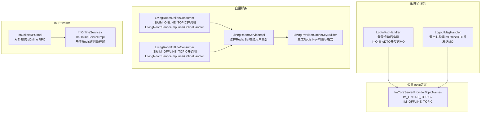
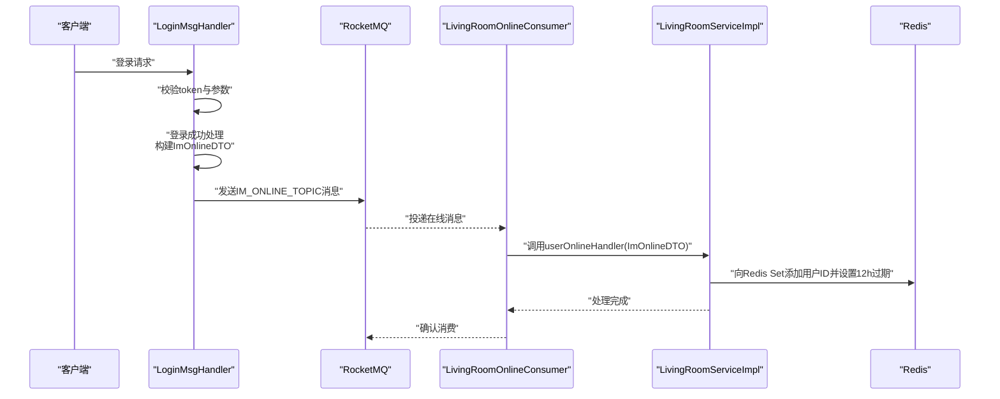
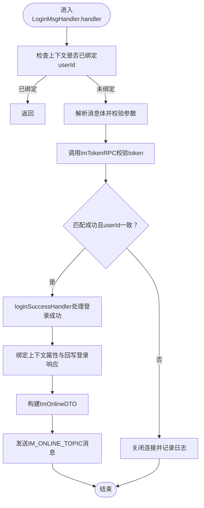
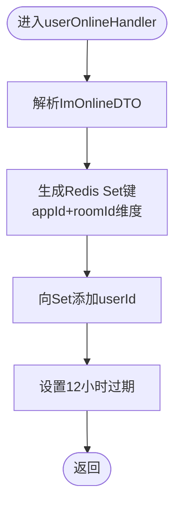
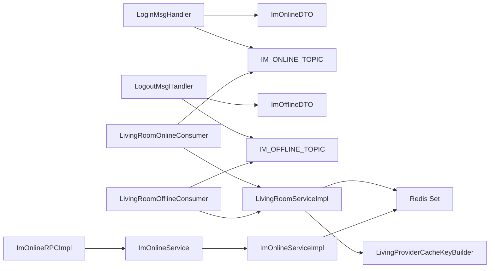

# IM在线状态

<cite>
**本文引用的文件**
- [ImOnlineDTO.java](file://live-im-core-server-interfaces/src/main/java/com/logilong/live/im/core/server/interfaces/dto/ImOnlineDTO.java)
- [ImOfflineDTO.java](file://live-im-core-server-interfaces/src/main/java/com/logilong/live/im/core/server/interfaces/dto/ImOfflineDTO.java)
- [LoginMsgHandler.java](file://live-im-core-server/src/main/java/com/logilong/live/im/core/server/handler/impl/LoginMsgHandler.java)
- [LogoutMsgHandler.java](file://live-im-core-server/src/main/java/com/logilong/live/im/core/server/handler/impl/LogoutMsgHandler.java)
- [ImCoreServerProviderTopicNames.java](file://live-common-interface/src/main/java/com/logilong/live/common/interfaces/topic/ImCoreServerProviderTopicNames.java)
- [LivingRoomOnlineConsumer.java](file://live-living-provider/src/main/java/com/logilong/live/living/provider/consumer/LivingRoomOnlineConsumer.java)
- [LivingRoomOfflineConsumer.java](file://live-living-provider/src/main/java/com/logilong/live/living/provider/consumer/LivingRoomOfflineConsumer.java)
- [LivingRoomServiceImpl.java](file://live-living-provider/src/main/java/com/logilong/live/living/provider/service/impl/LivingRoomServiceImpl.java)
- [LivingProviderCacheKeyBuilder.java](file://live-framework/live-framework-redis-starter/src/main/java/com/logilong/live/framework/redis/starter/key/LivingProviderCacheKeyBuilder.java)
- [ImOnlineRPCImpl.java](file://live-im-provider/src/main/java/com/logilong/live/im/provider/rpc/ImOnlineRPCImpl.java)
- [ImOnlineService.java](file://live-im-provider/src/main/java/com/logilong/live/im/provider/service/ImOnlineService.java)
- [ImOnlineServiceImpl.java](file://live-im-provider/src/main/java/com/logilong/live/im/provider/service/impl/ImOnlineServiceImpl.java)
</cite>

## 目录
1. [引言](#引言)
2. [项目结构](#项目结构)
3. [核心组件](#核心组件)
4. [架构总览](#架构总览)
5. [详细组件分析](#详细组件分析)
6. [依赖关系分析](#依赖关系分析)
7. [性能考量](#性能考量)
8. [故障排查指南](#故障排查指南)
9. [结论](#结论)

## 引言
本文件系统化说明IM在线状态的维护与同步机制，围绕ImOnlineDTO为核心数据模型，解释其字段的业务含义；描述LoginMsgHandler在用户登录成功后如何构建ImOnlineDTO并通过MQProducer发送到IM_ONLINE_TOPIC主题；阐述消息队列如何实现状态变更的广播，以live-living-provider中的LivingRoomServiceImpl为例，说明其userOnlineHandler方法如何消费该消息，将用户ID添加到直播间在线用户集合（Redis Set）中，并设置12小时过期时间；最后分析该机制如何支持实时在线人数统计和用户在线状态查询。

## 项目结构
- IM核心服务（im-core-server）负责IM连接层的登录、登出、心跳等处理，并在登录成功后向MQ发送在线事件。
- 公共常量与Topic定义位于common-interface，提供IM_ONLINE_TOPIC、IM_OFFLINE_TOPIC等命名。
- 直播服务（living-provider）订阅IM在线/离线事件，维护Redis中的在线用户集合，支撑实时在线人数统计与查询。
- IM Provider提供RPC接口与服务实现，用于判断用户是否在线（基于Redis键存在性）。

图表来源
- [LoginMsgHandler.java](file://live-im-core-server/src/main/java/com/logilong/live/im/core/server/handler/impl/LoginMsgHandler.java#L1-L121)
- [LogoutMsgHandler.java](file://live-im-core-server/src/main/java/com/logilong/live/im/core/server/handler/impl/LogoutMsgHandler.java#L1-L97)
- [ImCoreServerProviderTopicNames.java](file://live-common-interface/src/main/java/com/logilong/live/common/interfaces/topic/ImCoreServerProviderTopicNames.java#L1-L25)
- [LivingRoomOnlineConsumer.java](file://live-living-provider/src/main/java/com/logilong/live/living/provider/consumer/LivingRoomOnlineConsumer.java#L1-L51)
- [LivingRoomOfflineConsumer.java](file://live-living-provider/src/main/java/com/logilong/live/living/provider/consumer/LivingRoomOfflineConsumer.java#L1-L51)
- [LivingRoomServiceImpl.java](file://live-living-provider/src/main/java/com/logilong/live/living/provider/service/impl/LivingRoomServiceImpl.java#L1-L294)
- [LivingProviderCacheKeyBuilder.java](file://live-framework/live-framework-redis-starter/src/main/java/com/logilong/live/framework/redis/starter/key/LivingProviderCacheKeyBuilder.java#L1-L40)
- [ImOnlineRPCImpl.java](file://live-im-provider/src/main/java/com/logilong/live/im/provider/rpc/ImOnlineRPCImpl.java#L1-L20)
- [ImOnlineService.java](file://live-im-provider/src/main/java/com/logilong/live/im/provider/service/ImOnlineService.java#L1-L13)
- [ImOnlineServiceImpl.java](file://live-im-provider/src/main/java/com/logilong/live/im/provider/service/impl/ImOnlineServiceImpl.java#L1-L22)

章节来源
- [LoginMsgHandler.java](file://live-im-core-server/src/main/java/com/logilong/live/im/core/server/handler/impl/LoginMsgHandler.java#L1-L121)
- [LogoutMsgHandler.java](file://live-im-core-server/src/main/java/com/logilong/live/im/core/server/handler/impl/LogoutMsgHandler.java#L1-L97)
- [ImCoreServerProviderTopicNames.java](file://live-common-interface/src/main/java/com/logilong/live/common/interfaces/topic/ImCoreServerProviderTopicNames.java#L1-L25)
- [LivingRoomOnlineConsumer.java](file://live-living-provider/src/main/java/com/logilong/live/living/provider/consumer/LivingRoomOnlineConsumer.java#L1-L51)
- [LivingRoomOfflineConsumer.java](file://live-living-provider/src/main/java/com/logilong/live/living/provider/consumer/LivingRoomOfflineConsumer.java#L1-L51)
- [LivingRoomServiceImpl.java](file://live-living-provider/src/main/java/com/logilong/live/living/provider/service/impl/LivingRoomServiceImpl.java#L1-L294)
- [LivingProviderCacheKeyBuilder.java](file://live-framework/live-framework-redis-starter/src/main/java/com/logilong/live/framework/redis/starter/key/LivingProviderCacheKeyBuilder.java#L1-L40)
- [ImOnlineRPCImpl.java](file://live-im-provider/src/main/java/com/logilong/live/im/provider/rpc/ImOnlineRPCImpl.java#L1-L20)
- [ImOnlineService.java](file://live-im-provider/src/main/java/com/logilong/live/im/provider/service/ImOnlineService.java#L1-L13)
- [ImOnlineServiceImpl.java](file://live-im-provider/src/main/java/com/logilong/live/im/provider/service/impl/ImOnlineServiceImpl.java#L1-L22)

## 核心组件
- ImOnlineDTO：IM在线事件的数据载体，包含用户标识、应用标识、房间标识与登录时间。
- LoginMsgHandler：登录成功后构建ImOnlineDTO并通过MQProducer发送到IM_ONLINE_TOPIC。
- ImCoreServerProviderTopicNames：定义IM_ONLINE_TOPIC、IM_OFFLINE_TOPIC等主题名。
- LivingRoomOnlineConsumer：订阅IM_ONLINE_TOPIC，解析消息并调用LivingRoomServiceImpl.userOnlineHandler。
- LivingRoomServiceImpl.userOnlineHandler：将用户ID加入Redis Set（按appId+roomId维度），设置12小时过期。
- LivingRoomOfflineConsumer：订阅IM_OFFLINE_TOPIC，解析消息并调用LivingRoomServiceImpl.userOfflineHandler。
- LivingRoomServiceImpl.userOfflineHandler：从Redis Set移除用户ID，并在PK场景下触发下线逻辑与直播关闭。
- ImOnlineRPCImpl与ImOnlineServiceImpl：提供isOnline RPC，基于Redis键存在性判断用户在线。
- LivingProviderCacheKeyBuilder：生成Redis Key，确保在线用户集合按房间维度隔离。

章节来源
- [ImOnlineDTO.java](file://live-im-core-server-interfaces/src/main/java/com/logilong/live/im/core/server/interfaces/dto/ImOnlineDTO.java#L1-L18)
- [LoginMsgHandler.java](file://live-im-core-server/src/main/java/com/logilong/live/im/core/server/handler/impl/LoginMsgHandler.java#L1-L121)
- [ImCoreServerProviderTopicNames.java](file://live-common-interface/src/main/java/com/logilong/live/common/interfaces/topic/ImCoreServerProviderTopicNames.java#L1-L25)
- [LivingRoomOnlineConsumer.java](file://live-living-provider/src/main/java/com/logilong/live/living/provider/consumer/LivingRoomOnlineConsumer.java#L1-L51)
- [LivingRoomServiceImpl.java](file://live-living-provider/src/main/java/com/logilong/live/living/provider/service/impl/LivingRoomServiceImpl.java#L180-L207)
- [LivingRoomOfflineConsumer.java](file://live-living-provider/src/main/java/com/logilong/live/living/provider/consumer/LivingRoomOfflineConsumer.java#L1-L51)
- [ImOnlineRPCImpl.java](file://live-im-provider/src/main/java/com/logilong/live/im/provider/rpc/ImOnlineRPCImpl.java#L1-L20)
- [ImOnlineServiceImpl.java](file://live-im-provider/src/main/java/com/logilong/live/im/provider/service/impl/ImOnlineServiceImpl.java#L1-L22)
- [LivingProviderCacheKeyBuilder.java](file://live-framework/live-framework-redis-starter/src/main/java/com/logilong/live/framework/redis/starter/key/LivingProviderCacheKeyBuilder.java#L1-L40)

## 架构总览
IM在线状态同步采用“事件驱动”的消息广播模式：
- 登录事件：IM核心服务在登录成功后，将ImOnlineDTO发布到IM_ONLINE_TOPIC。
- 广播订阅：直播服务的LivingRoomOnlineConsumer订阅IM_ONLINE_TOPIC，消费消息并调用LivingRoomServiceImpl.userOnlineHandler。
- 在线集合：LivingRoomServiceImpl将用户ID写入Redis Set（键由LivingProviderCacheKeyBuilder生成），并设置12小时过期。
- 离线事件：IM核心服务在登出或异常断线时，将ImOfflineDTO发布到IM_OFFLINE_TOPIC。
- 离线处理：直播服务的LivingRoomOfflineConsumer订阅IM_OFFLINE_TOPIC，消费消息并调用LivingRoomServiceImpl.userOfflineHandler，从Redis Set移除用户ID，并在PK场景下触发下线逻辑与直播关闭。
- 在线查询：IM Provider通过Redis键存在性判断用户是否在线，供上层业务查询。

图表来源
- [LoginMsgHandler.java](file://live-im-core-server/src/main/java/com/logilong/live/im/core/server/handler/impl/LoginMsgHandler.java#L76-L121)
- [ImCoreServerProviderTopicNames.java](file://live-common-interface/src/main/java/com/logilong/live/common/interfaces/topic/ImCoreServerProviderTopicNames.java#L1-L25)
- [LivingRoomOnlineConsumer.java](file://live-living-provider/src/main/java/com/logilong/live/living/provider/consumer/LivingRoomOnlineConsumer.java#L1-L51)
- [LivingRoomServiceImpl.java](file://live-living-provider/src/main/java/com/logilong/live/living/provider/service/impl/LivingRoomServiceImpl.java#L180-L190)

## 详细组件分析

### ImOnlineDTO数据模型与字段语义
- 字段说明
  - userId：用户唯一标识，用于区分不同用户。
  - appId：应用标识，用于区分不同业务域或租户。
  - roomId：房间标识，用于区分不同直播间或聊天室。
  - loginTime：登录时间戳，可用于后续审计或排序。
- 设计要点
  - 作为跨模块传输的对象，序列化兼容性良好。
  - 与Redis键空间设计配合，便于按房间维度维护在线集合。

章节来源
- [ImOnlineDTO.java](file://live-im-core-server-interfaces/src/main/java/com/logilong/live/im/core/server/interfaces/dto/ImOnlineDTO.java#L1-L18)

### LoginMsgHandler：登录成功后的在线事件构建与发送
- 关键流程
  - 参数校验与token验证通过后，调用loginSuccessHandler。
  - 设置上下文属性（userId、appId、roomId），回写登录响应。
  - 构建ImOnlineDTO并调用sendLoginMQ发送到IM_ONLINE_TOPIC。
- MQ发送细节
  - 使用ImCoreServerProviderTopicNames.IM_ONLINE_TOPIC作为主题。
  - 将ImOnlineDTO序列化为字节数组后发送。

图表来源
- [LoginMsgHandler.java](file://live-im-core-server/src/main/java/com/logilong/live/im/core/server/handler/impl/LoginMsgHandler.java#L45-L121)

章节来源
- [LoginMsgHandler.java](file://live-im-core-server/src/main/java/com/logilong/live/im/core/server/handler/impl/LoginMsgHandler.java#L45-L121)

### ImCoreServerProviderTopicNames：在线/离线主题命名
- IM_ONLINE_TOPIC：IM在线事件主题。
- IM_OFFLINE_TOPIC：IM离线事件主题。
- 作用：统一命名，确保生产者与消费者一致。

章节来源
- [ImCoreServerProviderTopicNames.java](file://live-common-interface/src/main/java/com/logilong/live/common/interfaces/topic/ImCoreServerProviderTopicNames.java#L1-L25)

### LivingRoomOnlineConsumer：在线事件消费与转发
- 订阅主题：IM_ONLINE_TOPIC。
- 消费策略：批量拉取（默认每次10条），逐条解析ImOnlineDTO并调用LivingRoomServiceImpl.userOnlineHandler。
- 启动配置：从NameServer地址、消费者组、偏移量策略等初始化。

章节来源
- [LivingRoomOnlineConsumer.java](file://live-living-provider/src/main/java/com/logilong/live/living/provider/consumer/LivingRoomOnlineConsumer.java#L1-L51)

### LivingRoomServiceImpl.userOnlineHandler：在线集合维护与过期策略
- 维护逻辑
  - 通过LivingProviderCacheKeyBuilder生成Redis Set键（按appId+roomId维度）。
  - 将userId加入Redis Set，并设置12小时过期。
- 价值
  - 支持实时在线人数统计（Set大小即在线人数）。
  - 支持用户在线状态查询（结合ImOnlineRPCImpl.isOnline）。

图表来源
- [LivingRoomServiceImpl.java](file://live-living-provider/src/main/java/com/logilong/live/living/provider/service/impl/LivingRoomServiceImpl.java#L180-L190)
- [LivingProviderCacheKeyBuilder.java](file://live-framework/live-framework-redis-starter/src/main/java/com/logilong/live/framework/redis/starter/key/LivingProviderCacheKeyBuilder.java#L1-L40)

章节来源
- [LivingRoomServiceImpl.java](file://live-living-provider/src/main/java/com/logilong/live/living/provider/service/impl/LivingRoomServiceImpl.java#L180-L190)
- [LivingProviderCacheKeyBuilder.java](file://live-framework/live-framework-redis-starter/src/main/java/com/logilong/live/framework/redis/starter/key/LivingProviderCacheKeyBuilder.java#L1-L40)

### LogoutMsgHandler：离线事件构建与发送
- 关键流程
  - 登出时回写登出响应并关闭连接。
  - 清理上下文与绑定键，构建ImOfflineDTO并发送到IM_OFFLINE_TOPIC。
- 作用：为离线场景提供统一入口，确保后续直播侧能正确移除在线用户。

章节来源
- [LogoutMsgHandler.java](file://live-im-core-server/src/main/java/com/logilong/live/im/core/server/handler/impl/LogoutMsgHandler.java#L36-L97)

### LivingRoomOfflineConsumer与userOfflineHandler：离线集合维护
- 订阅主题：IM_OFFLINE_TOPIC。
- 处理逻辑：从Redis Set移除userId；在PK场景下触发下线逻辑与直播关闭。
- 价值：保证在线集合的准确性与时效性。

章节来源
- [LivingRoomOfflineConsumer.java](file://live-living-provider/src/main/java/com/logilong/live/living/provider/consumer/LivingRoomOfflineConsumer.java#L1-L51)
- [LivingRoomServiceImpl.java](file://live-living-provider/src/main/java/com/logilong/live/living/provider/service/impl/LivingRoomServiceImpl.java#L192-L207)

### ImOnlineRPCImpl与ImOnlineServiceImpl：在线状态查询
- ImOnlineRPCImpl：对外暴露isOnline RPC，委托给ImOnlineService。
- ImOnlineService/Impl：基于Redis键存在性判断用户是否在线（键格式为IM_BIND_IP_KEY + appId + ":" + userId）。
- 价值：为上层业务提供快速、低成本的在线状态查询能力。

章节来源
- [ImOnlineRPCImpl.java](file://live-im-provider/src/main/java/com/logilong/live/im/provider/rpc/ImOnlineRPCImpl.java#L1-L20)
- [ImOnlineService.java](file://live-im-provider/src/main/java/com/logilong/live/im/provider/service/ImOnlineService.java#L1-L13)
- [ImOnlineServiceImpl.java](file://live-im-provider/src/main/java/com/logilong/live/im/provider/service/impl/ImOnlineServiceImpl.java#L1-L22)

## 依赖关系分析
- 组件耦合
  - LoginMsgHandler与LogoutMsgHandler分别负责在线/离线事件的生产端，依赖MQProducer与ImOnlineDTO/ImOfflineDTO。
  - LivingRoomOnlineConsumer与LivingRoomOfflineConsumer分别负责在线/离线事件的消费端，依赖RocketMQ消费者配置与LivingRoomServiceImpl。
  - LivingRoomServiceImpl依赖RedisTemplate与LivingProviderCacheKeyBuilder维护在线集合。
  - ImOnlineRPCImpl依赖ImOnlineService/Impl提供在线查询能力。
- 外部依赖
  - RocketMQ：作为事件总线，承载IM在线/离线事件的可靠投递。
  - Redis：作为在线集合存储介质，支持Set与过期策略。
- 可能的循环依赖
  - 当前结构清晰，无明显循环依赖迹象。

图表来源
- [LoginMsgHandler.java](file://live-im-core-server/src/main/java/com/logilong/live/im/core/server/handler/impl/LoginMsgHandler.java#L101-L121)
- [LogoutMsgHandler.java](file://live-im-core-server/src/main/java/com/logilong/live/im/core/server/handler/impl/LogoutMsgHandler.java#L80-L97)
- [ImCoreServerProviderTopicNames.java](file://live-common-interface/src/main/java/com/logilong/live/common/interfaces/topic/ImCoreServerProviderTopicNames.java#L1-L25)
- [LivingRoomOnlineConsumer.java](file://live-living-provider/src/main/java/com/logilong/live/living/provider/consumer/LivingRoomOnlineConsumer.java#L1-L51)
- [LivingRoomOfflineConsumer.java](file://live-living-provider/src/main/java/com/logilong/live/living/provider/consumer/LivingRoomOfflineConsumer.java#L1-L51)
- [LivingRoomServiceImpl.java](file://live-living-provider/src/main/java/com/logilong/live/living/provider/service/impl/LivingRoomServiceImpl.java#L180-L207)
- [LivingProviderCacheKeyBuilder.java](file://live-framework/live-framework-redis-starter/src/main/java/com/logilong/live/framework/redis/starter/key/LivingProviderCacheKeyBuilder.java#L1-L40)
- [ImOnlineRPCImpl.java](file://live-im-provider/src/main/java/com/logilong/live/im/provider/rpc/ImOnlineRPCImpl.java#L1-L20)
- [ImOnlineService.java](file://live-im-provider/src/main/java/com/logilong/live/im/provider/service/ImOnlineService.java#L1-L13)
- [ImOnlineServiceImpl.java](file://live-im-provider/src/main/java/com/logilong/live/im/provider/service/impl/ImOnlineServiceImpl.java#L1-L22)

## 性能考量
- Redis Set规模控制
  - 使用Redis Set存储在线用户，支持O(1)添加/删除与基数计算，适合高并发场景。
  - 通过12小时过期避免长期膨胀，结合离线事件及时清理。
- 分布式扫描优化
  - 查询在线用户列表时使用SCAN分批迭代，避免一次性阻塞网络与Redis。
- MQ消费批量化
  - 默认批量拉取10条消息，降低网络往返与CPU开销。
- 键空间设计
  - 以appId+roomId维度构建Redis键，避免跨房间冲突，提升查询与过期粒度。

章节来源
- [LivingRoomServiceImpl.java](file://live-living-provider/src/main/java/com/logilong/live/living/provider/service/impl/LivingRoomServiceImpl.java#L210-L221)
- [LivingRoomOnlineConsumer.java](file://live-living-provider/src/main/java/com/logilong/live/living/provider/consumer/LivingRoomOnlineConsumer.java#L30-L49)
- [LivingProviderCacheKeyBuilder.java](file://live-framework/live-framework-redis-starter/src/main/java/com/logilong/live/framework/redis/starter/key/LivingProviderCacheKeyBuilder.java#L1-L40)

## 故障排查指南
- 登录事件未到达直播侧
  - 检查IM_ONLINE_TOPIC主题是否正确配置，消费者组是否一致。
  - 查看LivingRoomOnlineConsumer启动日志与RocketMQ Namesrv配置。
  - 核对消息体是否为合法JSON，以及ImOnlineDTO字段是否完整。
- 在线集合未更新或过期异常
  - 检查LivingProviderCacheKeyBuilder生成的Redis键格式是否与查询一致。
  - 确认Redis连接与过期策略生效。
- 离线事件未触发
  - 确认LogoutMsgHandler是否成功发送IM_OFFLINE_TOPIC消息。
  - 检查LivingRoomOfflineConsumer订阅与启动状态。
- 在线查询结果异常
  - 确认ImOnlineServiceImpl使用的键格式与LoginMsgHandler绑定键一致。
  - 检查Redis键是否存在与过期时间。

章节来源
- [LivingRoomOnlineConsumer.java](file://live-living-provider/src/main/java/com/logilong/live/living/provider/consumer/LivingRoomOnlineConsumer.java#L1-L51)
- [LivingRoomOfflineConsumer.java](file://live-living-provider/src/main/java/com/logilong/live/living/provider/consumer/LivingRoomOfflineConsumer.java#L1-L51)
- [ImOnlineServiceImpl.java](file://live-im-provider/src/main/java/com/logilong/live/im/provider/service/impl/ImOnlineServiceImpl.java#L1-L22)

## 结论
本机制通过IM核心服务与直播服务之间的事件驱动协作，实现了IM在线状态的可靠同步与高效维护。ImOnlineDTO作为统一的数据契约，承载了用户、应用与房间的关键信息；MQ作为事件总线，确保在线/离线事件的可靠传播；Redis作为在线集合的存储介质，提供了高性能的在线人数统计与状态查询能力。该方案具备良好的扩展性与可运维性，能够满足直播场景下的实时在线需求。