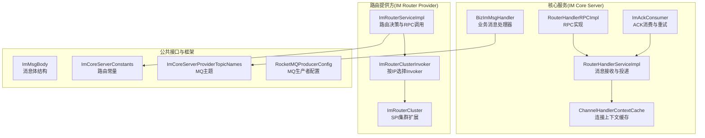
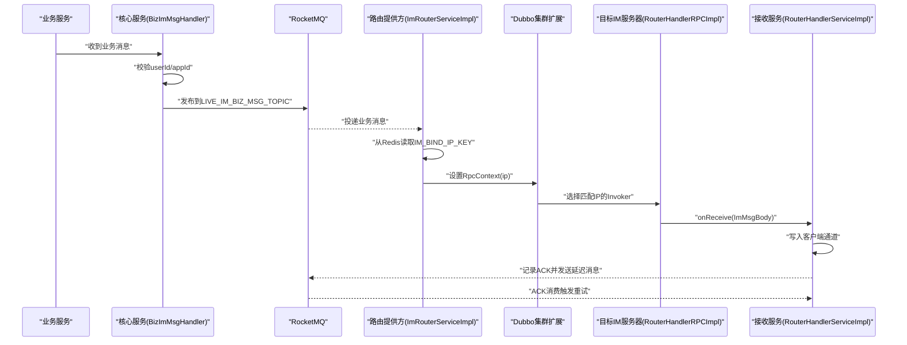
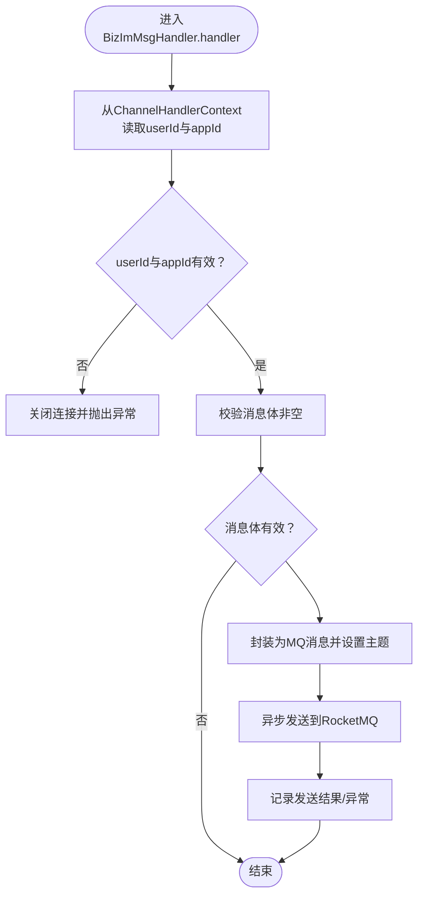
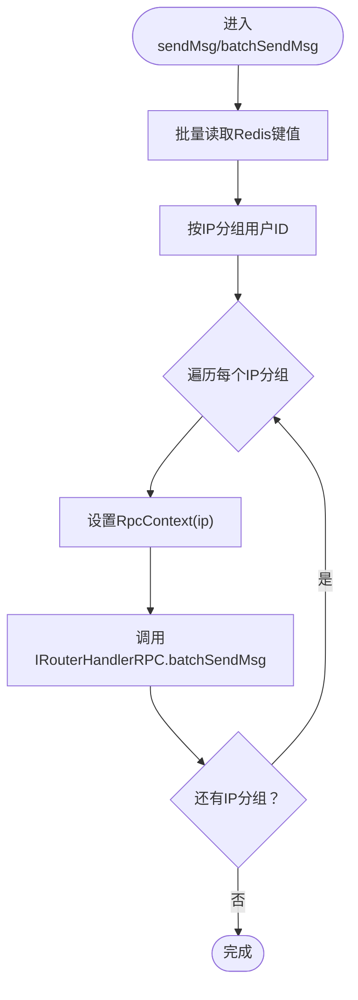
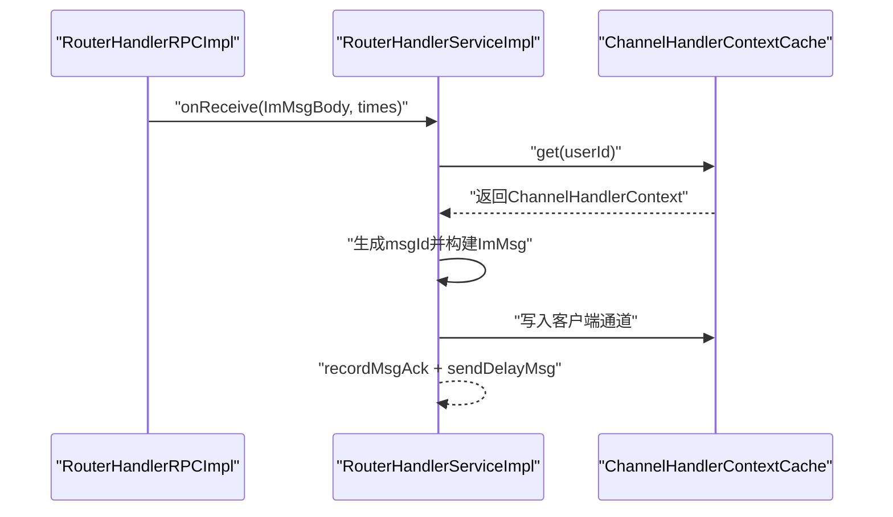
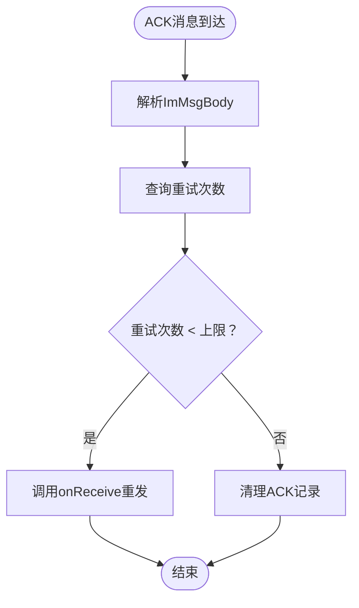
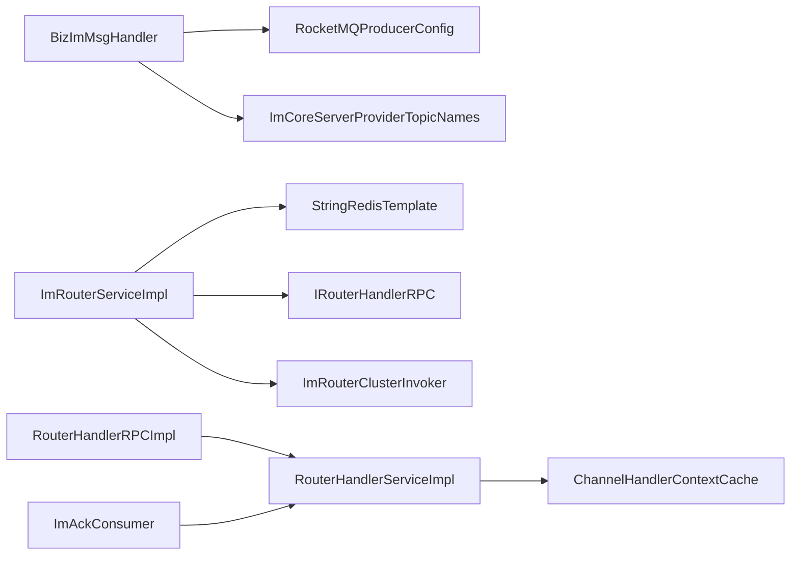

# IM消息路由

<cite>
**本文引用的文件列表**
- [BizImMsgHandler.java](file://live-im-core-server/src/main/java/com/logilong/live/im/core/server/handler/impl/BizImMsgHandler.java)
- [ImRouterServiceImpl.java](file://live-im-router-provider/src/main/java/com/logilong/live/im/router/provider/service/impl/ImRouterServiceImpl.java)
- [ImMsgBody.java](file://live-im-interface/src/main/java/com/logilong/live/im/dto/ImMsgBody.java)
- [RouterHandlerRPCImpl.java](file://live-im-core-server/src/main/java/com/logilong/live/im/core/server/rpc/RouterHandlerRPCImpl.java)
- [IRouterHandlerRPC.java](file://live-im-core-server-interfaces/src/main/java/com/logilong/live/im/core/server/interfaces/rpc/IRouterHandlerRPC.java)
- [RouterHandlerServiceImpl.java](file://live-im-core-server/src/main/java/com/logilong/live/im/core/server/service/impl/RouterHandlerServiceImpl.java)
- [ImCoreServerConstants.java](file://live-im-core-server-interfaces/src/main/java/com/logilong/live/im/core/server/interfaces/constants/ImCoreServerConstants.java)
- [ImCoreServerProviderTopicNames.java](file://live-common-interface/src/main/java/com/logilong/live/common/interfaces/topic/ImCoreServerProviderTopicNames.java)
- [RocketMQProducerConfig.java](file://live-framework/live-framework-mq-starter/src/main/java/com/logilong/live/framework/mq/starter/producer/RocketMQProducerConfig.java)
- [ImAckConsumer.java](file://live-im-core-server/src/main/java/com/logilong/live/im/core/server/consumer/ImAckConsumer.java)
- [ChannelHandlerContextCache.java](file://live-im-core-server/src/main/java/com/logilong/live/im/core/server/common/ChannelHandlerContextCache.java)
- [ImRouterCluster.java](file://live-im-router-provider/src/main/java/com/logilong/live/im/router/provider/cluster/ImRouterCluster.java)
- [ImRouterClusterInvoker.java](file://live-im-router-provider/src/main/java/com/logilong/live/im/router/provider/cluster/ImRouterClusterInvoker.java)
- [ImContextUtils.java](file://live-im-core-server/src/main/java/com/logilong/live/im/core/server/common/ImContextUtils.java)
- [ImContextAttr.java](file://live-im-core-server/src/main/java/com/logilong/live/im/core/server/common/ImContextAttr.java)
</cite>

## 目录
1. [引言](#引言)
2. [项目结构](#项目结构)
3. [核心组件](#核心组件)
4. [架构总览](#架构总览)
5. [详细组件分析](#详细组件分析)
6. [依赖关系分析](#依赖关系分析)
7. [性能考量](#性能考量)
8. [故障排查指南](#故障排查指南)
9. [结论](#结论)

## 引言
本文件深入解析IM消息路由机制，覆盖从消息接收、转发到投递的完整链路。重点包括：
- 业务消息处理器如何校验上下文并把消息体通过RocketMQ发布到指定主题；
- 路由服务如何基于Redis中的用户-服务器绑定信息，利用Dubbo的RpcContext动态设置目标IP，并通过IRouterHandlerRPC进行精准投递；
- 批量发送时的IP分组优化策略，以减少RPC调用次数；
- 消息体的数据结构与序列化/传输方式；
- ACK重试与延迟消息机制，保障消息可靠投递。

## 项目结构
IM消息路由涉及多个模块协作：
- 核心服务（IM Core Server）：负责消息接收、ACK消费、消息投递到客户端；
- 路由提供方（IM Router Provider）：负责消息路由决策与RPC调用；
- 公共接口与常量：定义消息体结构、路由常量、RocketMQ主题名等；
- 框架组件：RocketMQ生产者配置、Redis模板、Dubbo集群扩展。

图表来源
- [BizImMsgHandler.java](file://live-im-core-server/src/main/java/com/logilong/live/im/core/server/handler/impl/BizImMsgHandler.java#L1-L55)
- [RouterHandlerRPCImpl.java](file://live-im-core-server/src/main/java/com/logilong/live/im/core/server/rpc/RouterHandlerRPCImpl.java#L1-L29)
- [RouterHandlerServiceImpl.java](file://live-im-core-server/src/main/java/com/logilong/live/im/core/server/service/impl/RouterHandlerServiceImpl.java#L1-L46)
- [ImAckConsumer.java](file://live-im-core-server/src/main/java/com/logilong/live/im/core/server/consumer/ImAckConsumer.java#L1-L72)
- [ImRouterServiceImpl.java](file://live-im-router-provider/src/main/java/com/logilong/live/im/router/provider/service/impl/ImRouterServiceImpl.java#L1-L78)
- [ImRouterCluster.java](file://live-im-router-provider/src/main/java/com/logilong/live/im/router/provider/cluster/ImRouterCluster.java#L1-L17)
- [ImRouterClusterInvoker.java](file://live-im-router-provider/src/main/java/com/logilong/live/im/router/provider/cluster/ImRouterClusterInvoker.java#L1-L36)
- [ImMsgBody.java](file://live-im-interface/src/main/java/com/logilong/live/im/dto/ImMsgBody.java#L1-L41)
- [ImCoreServerConstants.java](file://live-im-core-server-interfaces/src/main/java/com/logilong/live/im/core/server/interfaces/constants/ImCoreServerConstants.java#L1-L8)
- [ImCoreServerProviderTopicNames.java](file://live-common-interface/src/main/java/com/logilong/live/common/interfaces/topic/ImCoreServerProviderTopicNames.java#L1-L25)
- [RocketMQProducerConfig.java](file://live-framework/live-framework-mq-starter/src/main/java/com/logilong/live/framework/mq/starter/producer/RocketMQProducerConfig.java#L1-L53)

章节来源
- [BizImMsgHandler.java](file://live-im-core-server/src/main/java/com/logilong/live/im/core/server/handler/impl/BizImMsgHandler.java#L1-L55)
- [ImRouterServiceImpl.java](file://live-im-router-provider/src/main/java/com/logilong/live/im/router/provider/service/impl/ImRouterServiceImpl.java#L1-L78)
- [ImMsgBody.java](file://live-im-interface/src/main/java/com/logilong/live/im/dto/ImMsgBody.java#L1-L41)
- [ImCoreServerConstants.java](file://live-im-core-server-interfaces/src/main/java/com/logilong/live/im/core/server/interfaces/constants/ImCoreServerConstants.java#L1-L8)
- [ImCoreServerProviderTopicNames.java](file://live-common-interface/src/main/java/com/logilong/live/common/interfaces/topic/ImCoreServerProviderTopicNames.java#L1-L25)
- [RocketMQProducerConfig.java](file://live-framework/live-framework-mq-starter/src/main/java/com/logilong/live/framework/mq/starter/producer/RocketMQProducerConfig.java#L1-L53)

## 核心组件
- 业务消息处理器：校验上下文（userId、appId），将消息体封装为MQ消息并发布到业务消息主题。
- 路由服务实现：从Redis读取用户绑定的IM服务器IP，设置Dubbo RpcContext的“ip”上下文，调用IRouterHandlerRPC进行投递；批量发送时按IP分组减少RPC调用。
- RPC实现与服务：将消息转发至核心服务的接收逻辑，最终写入客户端通道。
- 消息体结构：包含appId、userId、token、bizCode、msgId、data等字段，作为序列化后的字节流传输。
- ACK消费与重试：监听ACK主题，根据重试次数决定是否重发或清理ACK记录。

章节来源
- [BizImMsgHandler.java](file://live-im-core-server/src/main/java/com/logilong/live/im/core/server/handler/impl/BizImMsgHandler.java#L1-L55)
- [ImRouterServiceImpl.java](file://live-im-router-provider/src/main/java/com/logilong/live/im/router/provider/service/impl/ImRouterServiceImpl.java#L1-L78)
- [RouterHandlerRPCImpl.java](file://live-im-core-server/src/main/java/com/logilong/live/im/core/server/rpc/RouterHandlerRPCImpl.java#L1-L29)
- [RouterHandlerServiceImpl.java](file://live-im-core-server/src/main/java/com/logilong/live/im/core/server/service/impl/RouterHandlerServiceImpl.java#L1-L46)
- [ImMsgBody.java](file://live-im-interface/src/main/java/com/logilong/live/im/dto/ImMsgBody.java#L1-L41)
- [ImAckConsumer.java](file://live-im-core-server/src/main/java/com/logilong/live/im/core/server/consumer/ImAckConsumer.java#L1-L72)

## 架构总览
IM消息路由采用“业务消息经MQ中转，路由层按用户定位到具体IM服务器”的设计。核心链路如下：
- 业务侧消息进入核心服务后，由业务消息处理器校验上下文并发布到业务消息主题；
- 路由提供方从Redis读取用户绑定的IM服务器IP，设置RpcContext的“ip”，通过Dubbo SPI扩展的集群选择器精确路由到目标IM服务器；
- 目标IM服务器的RPC实现将消息交给接收服务，最终写入客户端通道；
- 客户端ACK回传后，ACK消费者根据重试策略决定是否重发或清理ACK记录。

图表来源
- [BizImMsgHandler.java](file://live-im-core-server/src/main/java/com/logilong/live/im/core/server/handler/impl/BizImMsgHandler.java#L1-L55)
- [ImRouterServiceImpl.java](file://live-im-router-provider/src/main/java/com/logilong/live/im/router/provider/service/impl/ImRouterServiceImpl.java#L1-L78)
- [ImRouterCluster.java](file://live-im-router-provider/src/main/java/com/logilong/live/im/router/provider/cluster/ImRouterCluster.java#L1-L17)
- [ImRouterClusterInvoker.java](file://live-im-router-provider/src/main/java/com/logilong/live/im/router/provider/cluster/ImRouterClusterInvoker.java#L1-L36)
- [RouterHandlerRPCImpl.java](file://live-im-core-server/src/main/java/com/logilong/live/im/core/server/rpc/RouterHandlerRPCImpl.java#L1-L29)
- [RouterHandlerServiceImpl.java](file://live-im-core-server/src/main/java/com/logilong/live/im/core/server/service/impl/RouterHandlerServiceImpl.java#L1-L46)
- [ImAckConsumer.java](file://live-im-core-server/src/main/java/com/logilong/live/im/core/server/consumer/ImAckConsumer.java#L1-L72)

## 详细组件分析

### 业务消息处理器（BizImMsgHandler）
职责与流程：
- 从通道上下文中提取userId与appId，若缺失则关闭连接并抛出异常；
- 校验消息体非空；
- 将消息体封装为MQ消息，设置主题为业务消息主题；
- 使用RocketMQ生产者异步发送，记录结果或异常。

关键点：
- 上下文校验通过工具类从通道属性中读取userId与appId；
- RocketMQ生产者配置支持异步发送与重试策略；
- 主题名来自公共接口常量。

图表来源
- [BizImMsgHandler.java](file://live-im-core-server/src/main/java/com/logilong/live/im/core/server/handler/impl/BizImMsgHandler.java#L1-L55)
- [ImContextUtils.java](file://live-im-core-server/src/main/java/com/logilong/live/im/core/server/common/ImContextUtils.java#L1-L42)
- [ImContextAttr.java](file://live-im-core-server/src/main/java/com/logilong/live/im/core/server/common/ImContextAttr.java#L1-L21)
- [RocketMQProducerConfig.java](file://live-framework/live-framework-mq-starter/src/main/java/com/logilong/live/framework/mq/starter/producer/RocketMQProducerConfig.java#L1-L53)
- [ImCoreServerProviderTopicNames.java](file://live-common-interface/src/main/java/com/logilong/live/common/interfaces/topic/ImCoreServerProviderTopicNames.java#L1-L25)

章节来源
- [BizImMsgHandler.java](file://live-im-core-server/src/main/java/com/logilong/live/im/core/server/handler/impl/BizImMsgHandler.java#L1-L55)
- [ImContextUtils.java](file://live-im-core-server/src/main/java/com/logilong/live/im/core/server/common/ImContextUtils.java#L1-L42)
- [ImContextAttr.java](file://live-im-core-server/src/main/java/com/logilong/live/im/core/server/common/ImContextAttr.java#L1-L21)
- [RocketMQProducerConfig.java](file://live-framework/live-framework-mq-starter/src/main/java/com/logilong/live/framework/mq/starter/producer/RocketMQProducerConfig.java#L1-L53)
- [ImCoreServerProviderTopicNames.java](file://live-common-interface/src/main/java/com/logilong/live/common/interfaces/topic/ImCoreServerProviderTopicNames.java#L1-L25)

### 路由服务实现（ImRouterServiceImpl）
职责与流程：
- 单条发送：从Redis读取用户绑定的IM服务器IP，截取IP部分并通过RpcContext设置“ip”，调用IRouterHandlerRPC.sendMsg；
- 批量发送：先收集所有userId，构造Redis键列表，批量读取IP；按IP分组用户ID，每组仅一次RPC调用，调用IRouterHandlerRPC.batchSendMsg；
- 保证同一批次内appId一致，避免跨应用路由错误。

IP分组优化策略：
- 通过一次批量读取Redis，减少网络往返；
- 将相同IP绑定的用户聚合，降低RPC调用次数；
- 避免重复设置RpcContext，提高吞吐。

图表来源
- [ImRouterServiceImpl.java](file://live-im-router-provider/src/main/java/com/logilong/live/im/router/provider/service/impl/ImRouterServiceImpl.java#L1-L78)
- [ImCoreServerConstants.java](file://live-im-core-server-interfaces/src/main/java/com/logilong/live/im/core/server/interfaces/constants/ImCoreServerConstants.java#L1-L8)
- [IRouterHandlerRPC.java](file://live-im-core-server-interfaces/src/main/java/com/logilong/live/im/core/server/interfaces/rpc/IRouterHandlerRPC.java#L1-L23)

章节来源
- [ImRouterServiceImpl.java](file://live-im-router-provider/src/main/java/com/logilong/live/im/router/provider/service/impl/ImRouterServiceImpl.java#L1-L78)
- [ImCoreServerConstants.java](file://live-im-core-server-interfaces/src/main/java/com/logilong/live/im/core/server/interfaces/constants/ImCoreServerConstants.java#L1-L8)
- [IRouterHandlerRPC.java](file://live-im-core-server-interfaces/src/main/java/com/logilong/live/im/core/server/interfaces/rpc/IRouterHandlerRPC.java#L1-L23)

### RPC实现与接收服务（RouterHandlerRPCImpl / RouterHandlerServiceImpl）
职责与流程：
- RouterHandlerRPCImpl将RPC调用委托给IRouterHandlerService；
- RouterHandlerServiceImpl在onReceive中尝试向客户端写入消息，若成功则记录ACK并发送延迟消息；sendMsgToClient通过ChannelHandlerContextCache按userId查找连接并写入。

图表来源
- [RouterHandlerRPCImpl.java](file://live-im-core-server/src/main/java/com/logilong/live/im/core/server/rpc/RouterHandlerRPCImpl.java#L1-L29)
- [RouterHandlerServiceImpl.java](file://live-im-core-server/src/main/java/com/logilong/live/im/core/server/service/impl/RouterHandlerServiceImpl.java#L1-L46)
- [ChannelHandlerContextCache.java](file://live-im-core-server/src/main/java/com/logilong/live/im/core/server/common/ChannelHandlerContextCache.java#L1-L36)

章节来源
- [RouterHandlerRPCImpl.java](file://live-im-core-server/src/main/java/com/logilong/live/im/core/server/rpc/RouterHandlerRPCImpl.java#L1-L29)
- [RouterHandlerServiceImpl.java](file://live-im-core-server/src/main/java/com/logilong/live/im/core/server/service/impl/RouterHandlerServiceImpl.java#L1-L46)
- [ChannelHandlerContextCache.java](file://live-im-core-server/src/main/java/com/logilong/live/im/core/server/common/ChannelHandlerContextCache.java#L1-L36)

### ACK消费与重试（ImAckConsumer）
职责与流程：
- 订阅ACK主题，解析消息体；
- 查询该消息的重试次数；
- 若未达到上限，则重新调用接收服务进行重发；否则清理ACK记录。

图表来源
- [ImAckConsumer.java](file://live-im-core-server/src/main/java/com/logilong/live/im/core/server/consumer/ImAckConsumer.java#L1-L72)

章节来源
- [ImAckConsumer.java](file://live-im-core-server/src/main/java/com/logilong/live/im/core/server/consumer/ImAckConsumer.java#L1-L72)

### 消息体数据结构（ImMsgBody）
- 字段：appId、userId、token、bizCode、msgId、data；
- 序列化：实现Serializable，便于在网络间传输；
- 用途：承载业务消息的元数据与负载，供路由与接收服务使用。

章节来源
- [ImMsgBody.java](file://live-im-interface/src/main/java/com/logilong/live/im/dto/ImMsgBody.java#L1-L41)

## 依赖关系分析
- 组件耦合：
  - BizImMsgHandler依赖MQ生产者与主题常量；
  - ImRouterServiceImpl依赖Redis模板、IRouterHandlerRPC、Dubbo RpcContext；
  - RouterHandlerRPCImpl依赖IRouterHandlerService；
  - RouterHandlerServiceImpl依赖ChannelHandlerContextCache与ACK服务；
  - ImAckConsumer依赖RocketMQ消费者配置与ACK服务。
- 外部依赖：
  - RocketMQ生产者/消费者配置；
  - Redis字符串模板；
  - Dubbo SPI集群扩展（按IP选择Invoker）。

图表来源
- [BizImMsgHandler.java](file://live-im-core-server/src/main/java/com/logilong/live/im/core/server/handler/impl/BizImMsgHandler.java#L1-L55)
- [RocketMQProducerConfig.java](file://live-framework/live-framework-mq-starter/src/main/java/com/logilong/live/framework/mq/starter/producer/RocketMQProducerConfig.java#L1-L53)
- [ImCoreServerProviderTopicNames.java](file://live-common-interface/src/main/java/com/logilong/live/common/interfaces/topic/ImCoreServerProviderTopicNames.java#L1-L25)
- [ImRouterServiceImpl.java](file://live-im-router-provider/src/main/java/com/logilong/live/im/router/provider/service/impl/ImRouterServiceImpl.java#L1-L78)
- [ImRouterClusterInvoker.java](file://live-im-router-provider/src/main/java/com/logilong/live/im/router/provider/cluster/ImRouterClusterInvoker.java#L1-L36)
- [RouterHandlerRPCImpl.java](file://live-im-core-server/src/main/java/com/logilong/live/im/core/server/rpc/RouterHandlerRPCImpl.java#L1-L29)
- [RouterHandlerServiceImpl.java](file://live-im-core-server/src/main/java/com/logilong/live/im/core/server/service/impl/RouterHandlerServiceImpl.java#L1-L46)
- [ChannelHandlerContextCache.java](file://live-im-core-server/src/main/java/com/logilong/live/im/core/server/common/ChannelHandlerContextCache.java#L1-L36)
- [ImAckConsumer.java](file://live-im-core-server/src/main/java/com/logilong/live/im/core/server/consumer/ImAckConsumer.java#L1-L72)

章节来源
- [ImRouterServiceImpl.java](file://live-im-router-provider/src/main/java/com/logilong/live/im/router/provider/service/impl/ImRouterServiceImpl.java#L1-L78)
- [ImRouterClusterInvoker.java](file://live-im-router-provider/src/main/java/com/logilong/live/im/router/provider/cluster/ImRouterClusterInvoker.java#L1-L36)
- [RouterHandlerRPCImpl.java](file://live-im-core-server/src/main/java/com/logilong/live/im/core/server/rpc/RouterHandlerRPCImpl.java#L1-L29)
- [RouterHandlerServiceImpl.java](file://live-im-core-server/src/main/java/com/logilong/live/im/core/server/service/impl/RouterHandlerServiceImpl.java#L1-L46)
- [ChannelHandlerContextCache.java](file://live-im-core-server/src/main/java/com/logilong/live/im/core/server/common/ChannelHandlerContextCache.java#L1-L36)
- [ImAckConsumer.java](file://live-im-core-server/src/main/java/com/logilong/live/im/core/server/consumer/ImAckConsumer.java#L1-L72)

## 性能考量
- Redis批量读取：批量获取用户绑定IP，减少网络往返；
- IP分组聚合：按IP分组用户，降低RPC调用次数；
- RocketMQ异步发送：生产者配置异步线程池，提升吞吐；
- Dubbo按IP选择Invoker：避免广播式调用，直接命中目标节点；
- ACK重试与延迟消息：通过延迟消息控制重试节奏，避免过载。

[本节为通用性能建议，不直接分析具体文件]

## 故障排查指南
- 上下文缺失导致关闭连接：检查通道上下文是否正确设置userId与appId；
- Redis键格式不匹配：确认IM_BIND_IP_KEY前缀与appId、userId拼接格式；
- RpcContext未设置IP：确保在调用RPC前已设置“ip”上下文；
- RPC选择失败：确认目标IP与服务提供者暴露地址一致；
- MQ发送异常：检查RocketMQ生产者配置与NameServer地址；
- ACK重试无响应：检查ACK主题订阅与延迟消息配置。

章节来源
- [BizImMsgHandler.java](file://live-im-core-server/src/main/java/com/logilong/live/im/core/server/handler/impl/BizImMsgHandler.java#L1-L55)
- [ImRouterServiceImpl.java](file://live-im-router-provider/src/main/java/com/logilong/live/im/router/provider/service/impl/ImRouterServiceImpl.java#L1-L78)
- [ImRouterClusterInvoker.java](file://live-im-router-provider/src/main/java/com/logilong/live/im/router/provider/cluster/ImRouterClusterInvoker.java#L1-L36)
- [RocketMQProducerConfig.java](file://live-framework/live-framework-mq-starter/src/main/java/com/logilong/live/framework/mq/starter/producer/RocketMQProducerConfig.java#L1-L53)
- [ImAckConsumer.java](file://live-im-core-server/src/main/java/com/logilong/live/im/core/server/consumer/ImAckConsumer.java#L1-L72)

## 结论
本IM消息路由机制通过MQ解耦与Redis路由，结合Dubbo按IP直连，实现了高可靠、低延迟的消息投递。单条与批量发送均具备明确的优化策略，ACK重试与延迟消息进一步提升了系统的健壮性。整体设计清晰、职责分离明确，适合在多业务线、多IM服务器场景下扩展与演进。