# IM系统

<cite>
**本文档引用的文件**  
- [ImCoreServerApplication.java](file://live-im-core-server/src/main/java/com/logilong/live/im/core/server/ImCoreServerApplication.java)
- [TcpImMsgDecoder.java](file://live-im-core-server/src/main/java/com/logilong/live/im/core/server/common/TcpImMsgDecoder.java)
- [TcpImMsgEncoder.java](file://live-im-core-server/src/main/java/com/logilong/live/im/core/server/common/TcpImMsgEncoder.java)
- [ImMsg.java](file://live-im-core-server/src/main/java/com/logilong/live/im/core/server/common/ImMsg.java)
- [ImHandlerFactory.java](file://live-im-core-server/src/main/java/com/logilong/live/im/core/server/handler/ImHandlerFactory.java)
- [ImHandlerFactoryImpl.java](file://live-im-core-server/src/main/java/com/logilong/live/im/core/server/handler/impl/ImHandlerFactoryImpl.java)
- [TcpImServerCoreHandler.java](file://live-im-core-server/src/main/java/com/logilong/live/im/core/server/handler/tcp/TcpImServerCoreHandler.java)
- [TcpNettyImServerStarter.java](file://live-im-core-server/src/main/java/com/logilong/live/im/core/server/starter/TcpNettyImServerStarter.java)
- [IRouterHandlerService.java](file://live-im-core-server/src/main/java/com/logilong/live/im/core/server/service/IRouterHandlerService.java)
- [RouterHandlerRPCImpl.java](file://live-im-core-server/src/main/java/com/logilong/live/im/core/server/rpc/RouterHandlerRPCImpl.java)
- [ImRouterCluster.java](file://live-im-router-provider/src/main/java/com/logilong/live/im/router/provider/cluster/ImRouterCluster.java)
- [ImRouterClusterInvoker.java](file://live-im-router-provider/src/main/java/com/logilong/live/im/router/provider/cluster/ImRouterClusterInvoker.java)
- [ImOnlineDTO.java](file://live-im-core-server-interfaces/src/main/java/com/logilong/live/im/core/server/interfaces/dto/ImOnlineDTO.java)
- [ImOnlineServiceImpl.java](file://live-im-provider/src/main/java/com/logilong/live/im/provider/service/impl/ImOnlineServiceImpl.java)
- [ImTokenServiceImpl.java](file://live-im-provider/src/main/java/com/logilong/live/im/provider/service/impl/ImTokenServiceImpl.java)
- [ImContextUtils.java](file://live-im-core-server/src/main/java/com/logilong/live/im/core/server/common/ImContextUtils.java)
- [ChannelHandlerContextCache.java](file://live-im-core-server/src/main/java/com/logilong/live/im/core/server/common/ChannelHandlerContextCache.java)
</cite>

## 目录
1. [引言](#引言)
2. [项目结构](#项目结构)
3. [核心组件](#核心组件)
4. [架构概述](#架构概述)
5. [详细组件分析](#详细组件分析)
6. [依赖分析](#依赖分析)
7. [性能考虑](#性能考虑)
8. [故障排除指南](#故障排除指南)
9. [结论](#结论)

## 引言

本系统为直播平台中的即时通信（IM）子系统，负责处理客户端连接、消息路由、在线状态同步等核心功能。系统采用微服务架构，通过Dubbo进行服务调用，使用Netty实现高性能网络通信，并通过Redis维护用户在线状态。IM系统包含核心服务器（ImCoreServer）、路由器（ImRouter）和提供者服务（ImProvider），各组件协同工作以实现稳定可靠的消息传递。

## 项目结构

IM系统由多个模块组成，主要包括核心服务器、接口定义、路由器和提供者服务。核心服务器负责处理客户端连接和消息分发，提供者服务提供业务逻辑支持，如Token生成和在线状态查询，路由器负责跨节点消息路由。

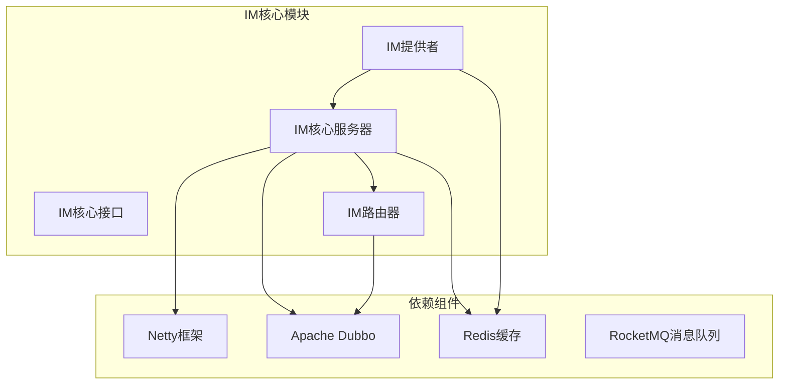

**图源**  
- [ImCoreServerApplication.java](file://live-im-core-server/src/main/java/com/logilong/live/im/core/server/ImCoreServerApplication.java)
- [ImRouterCluster.java](file://live-im-router-provider/src/main/java/com/logilong/live/im/router/provider/cluster/ImRouterCluster.java)

**本节来源**  
- [ImCoreServerApplication.java](file://live-im-core-server/src/main/java/com/logilong/live/im/core/server/ImCoreServerApplication.java)

## 核心组件

IM系统的核心组件包括连接管理、消息路由、在线状态同步和认证机制。连接管理通过Netty实现TCP/WS长连接；消息路由通过ImRouter实现跨节点消息分发；在线状态通过Redis维护；认证机制通过IM Token实现客户端身份验证。

**本节来源**  
- [TcpNettyImServerStarter.java](file://live-im-core-server/src/main/java/com/logilong/live/im/core/server/starter/TcpNettyImServerStarter.java)
- [ImTokenServiceImpl.java](file://live-im-provider/src/main/java/com/logilong/live/im/provider/service/impl/ImTokenServiceImpl.java)
- [ImOnlineServiceImpl.java](file://live-im-provider/src/main/java/com/logilong/live/im/provider/service/impl/ImOnlineServiceImpl.java)

## 架构概述

IM系统采用分层架构设计，包括网络层、协议层、路由层和业务层。网络层基于Netty实现高性能IO；协议层定义统一的消息格式；路由层负责消息分发；业务层处理具体业务逻辑。

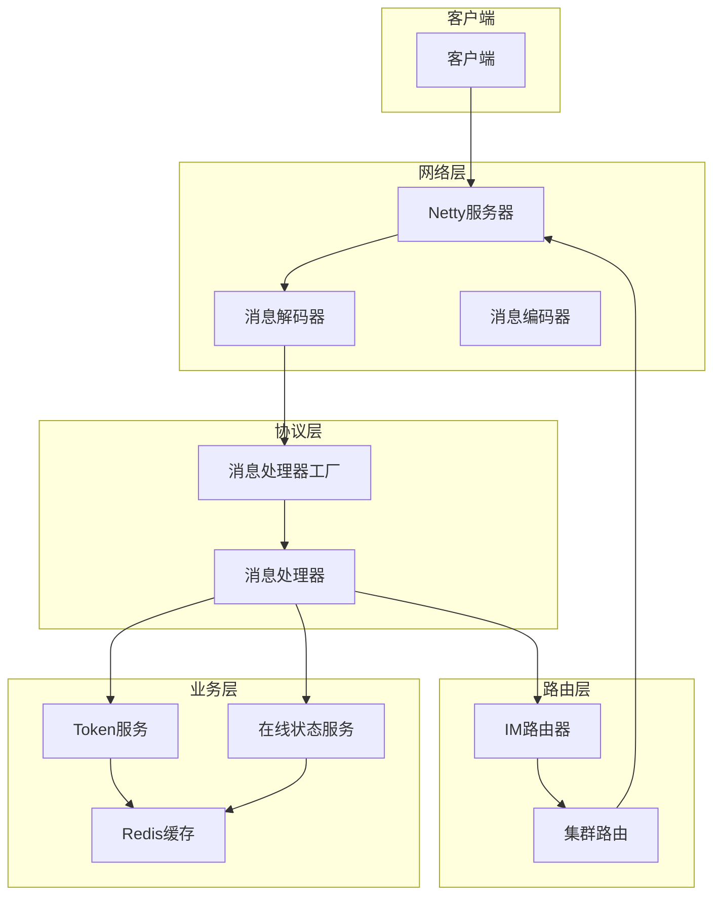

**图源**  
- [TcpImMsgDecoder.java](file://live-im-core-server/src/main/java/com/logilong/live/im/core/server/common/TcpImMsgDecoder.java)
- [TcpImMsgEncoder.java](file://live-im-core-server/src/main/java/com/logilong/live/im/core/server/common/TcpImMsgEncoder.java)
- [ImHandlerFactoryImpl.java](file://live-im-core-server/src/main/java/com/logilong/live/im/core/server/handler/impl/ImHandlerFactoryImpl.java)

## 详细组件分析

### 连接管理与Netty实现

IM核心服务器基于Netty框架实现高性能网络通信，通过自定义编解码器处理消息的序列化与反序列化。

#### 消息编解码器设计

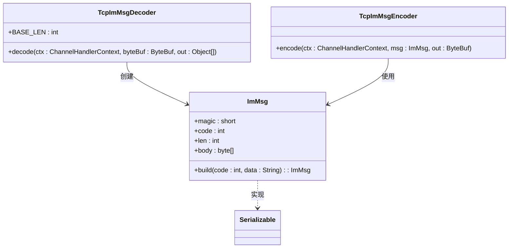

**图源**  
- [TcpImMsgDecoder.java](file://live-im-core-server/src/main/java/com/logilong/live/im/core/server/common/TcpImMsgDecoder.java#L13-L43)
- [TcpImMsgEncoder.java](file://live-im-core-server/src/main/java/com/logilong/live/im/core/server/common/TcpImMsgEncoder.java#L10-L18)
- [ImMsg.java](file://live-im-core-server/src/main/java/com/logilong/live/im/core/server/common/ImMsg.java#L11-L35)

#### 消息处理器工厂

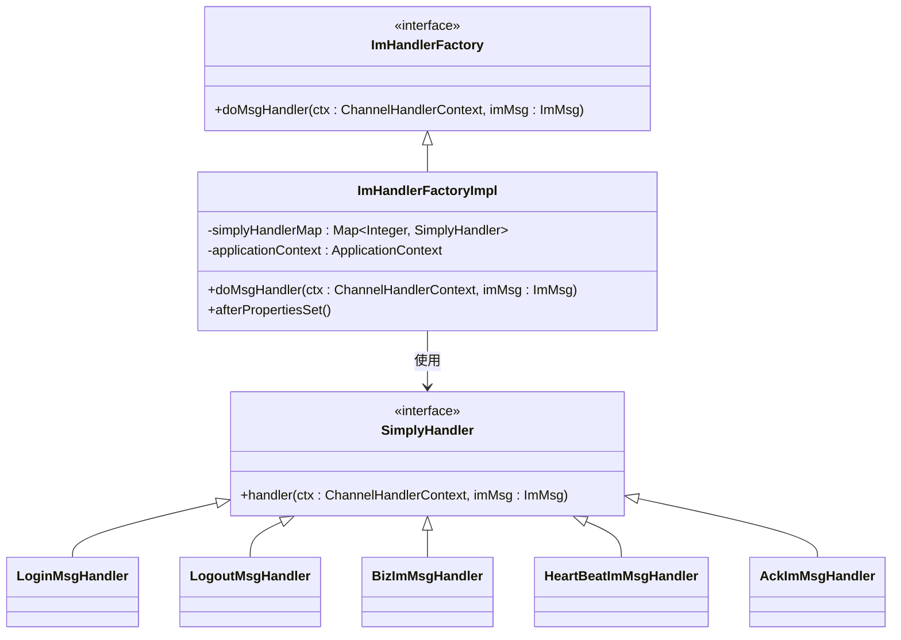

**图源**  
- [ImHandlerFactory.java](file://live-im-core-server/src/main/java/com/logilong/live/im/core/server/handler/ImHandlerFactory.java#L7-L13)
- [ImHandlerFactoryImpl.java](file://live-im-core-server/src/main/java/com/logilong/live/im/core/server/handler/impl/ImHandlerFactoryImpl.java#L17-L44)

#### Netty服务器启动流程

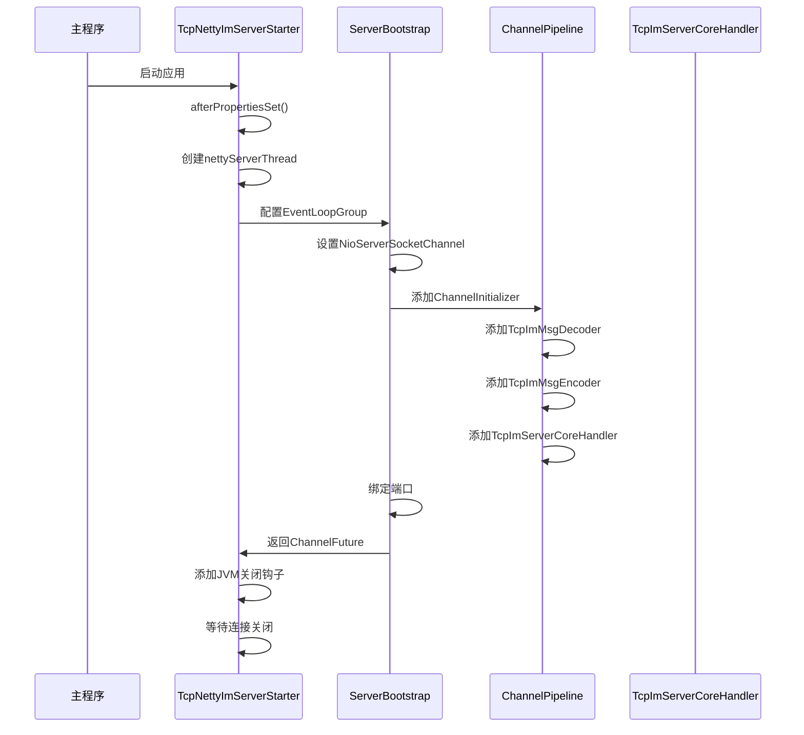

**图源**  
- [TcpNettyImServerStarter.java](file://live-im-core-server/src/main/java/com/logilong/live/im/core/server/starter/TcpNettyImServerStarter.java#L23-L87)
- [TcpImServerCoreHandler.java](file://live-im-core-server/src/main/java/com/logilong/live/im/core/server/handler/tcp/TcpImServerCoreHandler.java#L18-L41)

### IM Token生成与验证机制

IM系统通过Token机制实现客户端连接认证，Token在Redis中存储并设置有效期。

#### Token服务实现

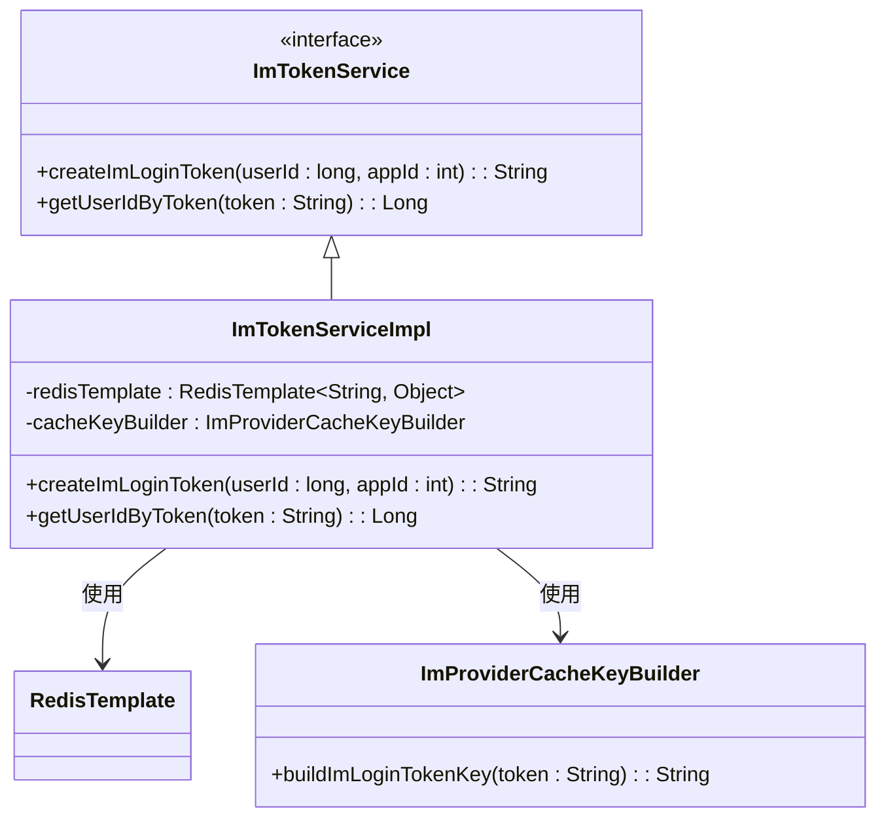

**图源**  
- [ImTokenServiceImpl.java](file://live-im-provider/src/main/java/com/logilong/live/im/provider/service/impl/ImTokenServiceImpl.java#L14-L34)

#### 客户端连接认证流程

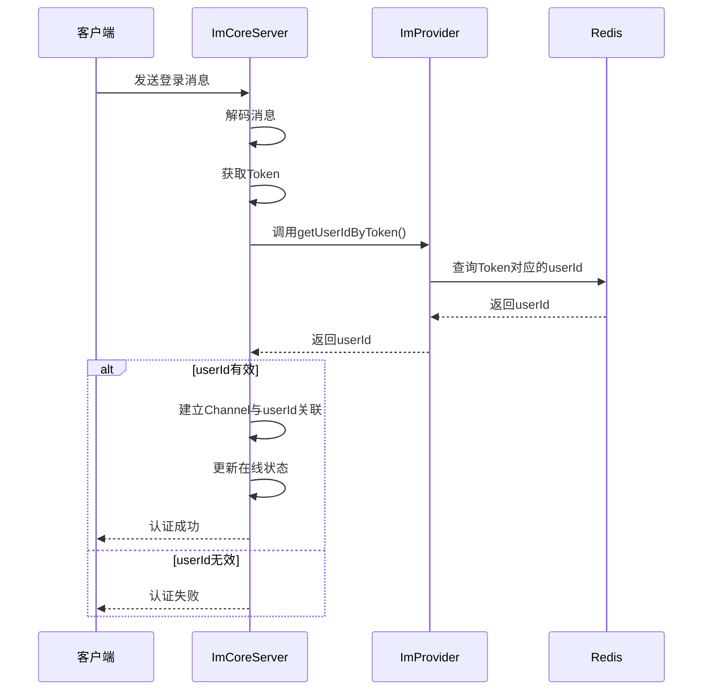

**图源**  
- [ImTokenServiceImpl.java](file://live-im-provider/src/main/java/com/logilong/live/im/provider/service/impl/ImTokenServiceImpl.java#L22-L31)
- [ImHandlerFactoryImpl.java](file://live-im-core-server/src/main/java/com/logilong/live/im/core/server/handler/impl/ImHandlerFactoryImpl.java#L38-L42)

### IM路由器集群部署与负载均衡

IM路由器通过Dubbo集群策略实现基于IP的路由选择，确保消息准确投递到目标节点。

#### 集群路由实现

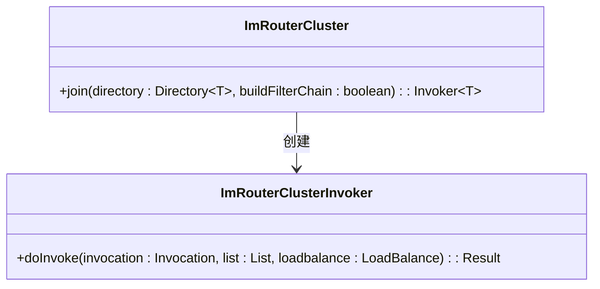

**图源**  
- [ImRouterCluster.java](file://live-im-router-provider/src/main/java/com/logilong/live/im/router/provider/cluster/ImRouterCluster.java#L11-L17)
- [ImRouterClusterInvoker.java](file://live-im-router-provider/src/main/java/com/logilong/live/im/router/provider/cluster/ImRouterClusterInvoker.java#L11-L36)

#### 路由消息处理流程

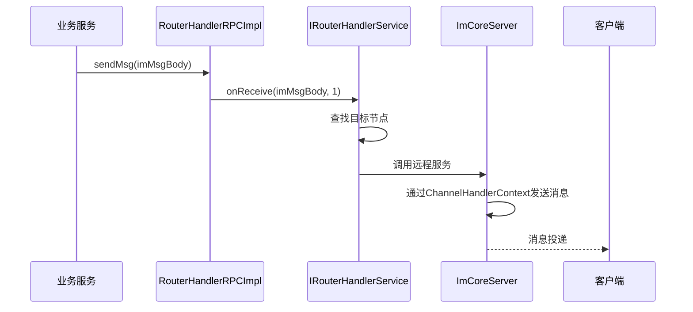

**图源**  
- [RouterHandlerRPCImpl.java](file://live-im-core-server/src/main/java/com/logilong/live/im/core/server/rpc/RouterHandlerRPCImpl.java#L12-L28)
- [IRouterHandlerService.java](file://live-im-core-server/src/main/java/com/logilong/live/im/core/server/service/IRouterHandlerService.java#L6-L18)

### 在线状态维护机制

系统通过Redis维护用户在线状态，并通过RocketMQ实现跨服务的状态同步。

#### 在线状态数据结构

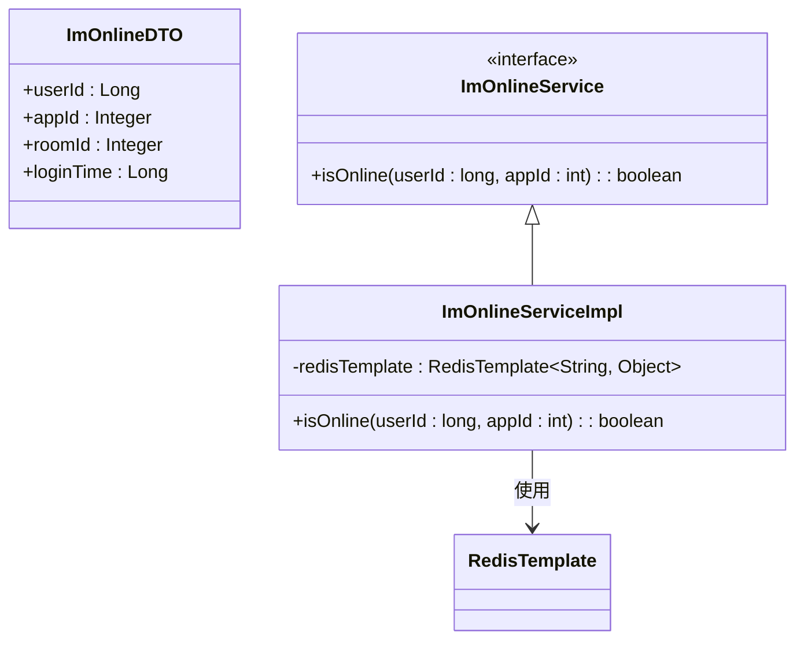

**图源**  
- [ImOnlineDTO.java](file://live-im-core-server-interfaces/src/main/java/com/logilong/live/im/core/server/interfaces/dto/ImOnlineDTO.java#L9-L17)
- [ImOnlineServiceImpl.java](file://live-im-provider/src/main/java/com/logilong/live/im/provider/service/impl/ImOnlineServiceImpl.java#L11-L21)

#### 在线状态同步流程

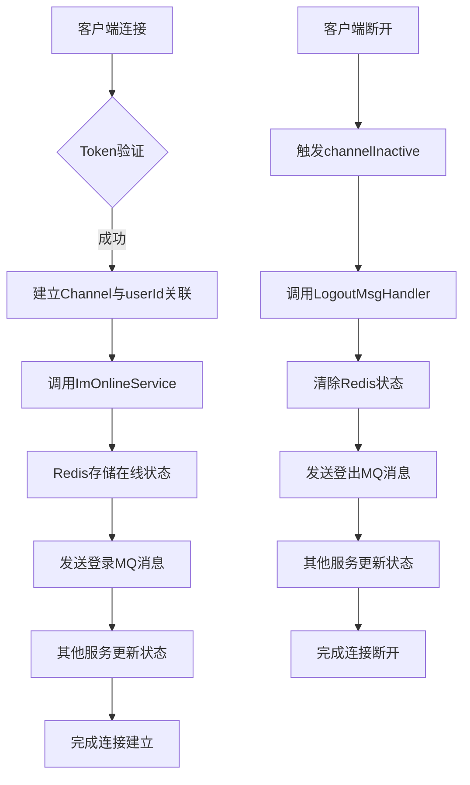

**图源**  
- [TcpImServerCoreHandler.java](file://live-im-core-server/src/main/java/com/logilong/live/im/core/server/handler/tcp/TcpImServerCoreHandler.java#L34-L41)
- [ImOnlineServiceImpl.java](file://live-im-provider/src/main/java/com/logilong/live/im/provider/service/impl/ImOnlineServiceImpl.java#L17-L19)

**本节来源**  
- [ImHandlerFactoryImpl.java](file://live-im-core-server/src/main/java/com/logilong/live/im/core/server/handler/impl/ImHandlerFactoryImpl.java)
- [ImTokenServiceImpl.java](file://live-im-provider/src/main/java/com/logilong/live/im/provider/service/impl/ImTokenServiceImpl.java)
- [ImRouterClusterInvoker.java](file://live-im-router-provider/src/main/java/com/logilong/live/im/router/provider/cluster/ImRouterClusterInvoker.java)

## 依赖分析

IM系统依赖多个外部组件和服务，形成完整的通信生态系统。

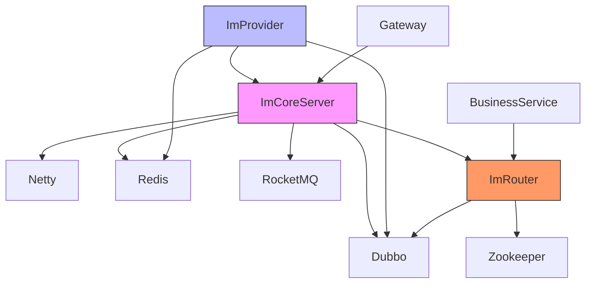

**图源**  
- [pom.xml](file://live-im-core-server/pom.xml)
- [pom.xml](file://live-im-provider/pom.xml)
- [pom.xml](file://live-im-router-provider/pom.xml)

**本节来源**  
- [pom.xml](file://live-im-core-server/pom.xml)
- [pom.xml](file://live-im-provider/pom.xml)
- [pom.xml](file://live-im-router-provider/pom.xml)

## 性能考虑

IM系统在设计时充分考虑了性能因素，通过多种机制确保高并发下的稳定运行。

- **Netty事件循环**：使用NIO EventLoopGroup处理IO事件，避免阻塞
- **对象池化**：消息对象复用减少GC压力
- **异步处理**：非关键操作异步执行
- **连接复用**：长连接减少握手开销
- **批量处理**：支持消息批量发送
- **缓存优化**：Redis缓存频繁访问数据

## 故障排除指南

### 常见问题及解决方案

| 问题现象 | 可能原因 | 解决方案 |
|---------|---------|---------|
| 客户端无法连接 | 端口未开放或防火墙阻止 | 检查服务器端口配置和防火墙设置 |
| 消息投递失败 | 目标用户不在线 | 检查Redis在线状态或用户Token有效性 |
| 连接频繁断开 | 心跳机制异常 | 检查客户端心跳发送频率和服务器配置 |
| 消息延迟高 | 网络拥塞或服务器负载高 | 监控网络状况和服务器资源使用 |
| Token验证失败 | Redis中Token过期 | 检查Token有效期和生成逻辑 |

**本节来源**  
- [TcpNettyImServerStarter.java](file://live-im-core-server/src/main/java/com/logilong/live/im/core/server/starter/TcpNettyImServerStarter.java)
- [ImTokenServiceImpl.java](file://live-im-provider/src/main/java/com/logilong/live/im/provider/service/impl/ImTokenServiceImpl.java)

## 结论

IM系统通过分层架构设计实现了高性能、高可用的即时通信功能。系统基于Netty构建了稳定的网络通信基础，通过Dubbo实现了服务间的高效调用，利用Redis维护用户状态，通过RocketMQ实现跨服务消息同步。IM Token机制确保了连接的安全性，在线状态管理保证了消息的准确投递。整个系统设计合理，具备良好的扩展性和稳定性，能够满足直播平台的实时通信需求。