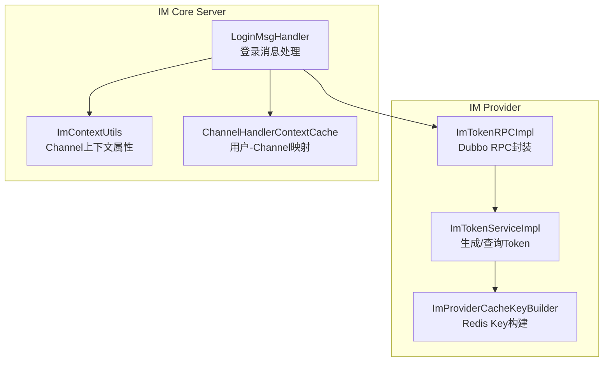
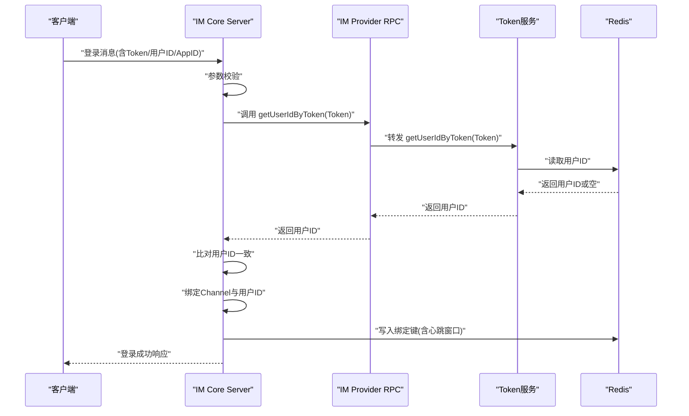
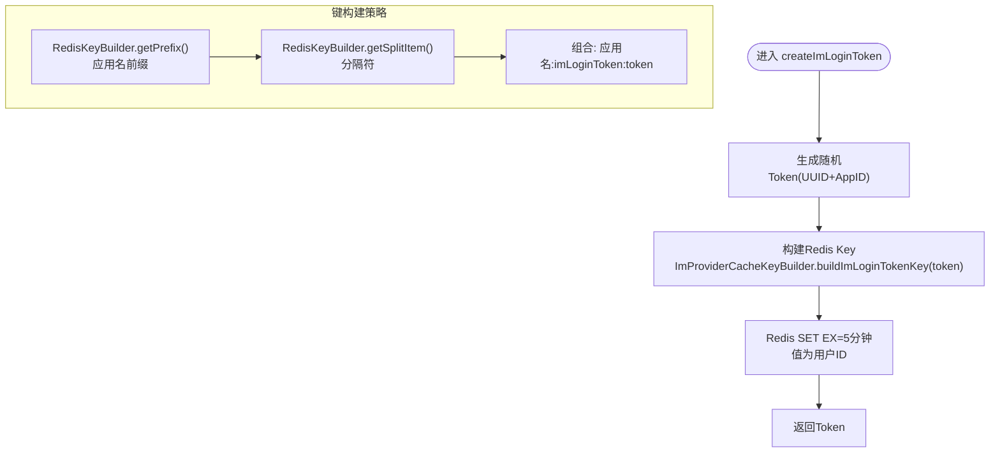
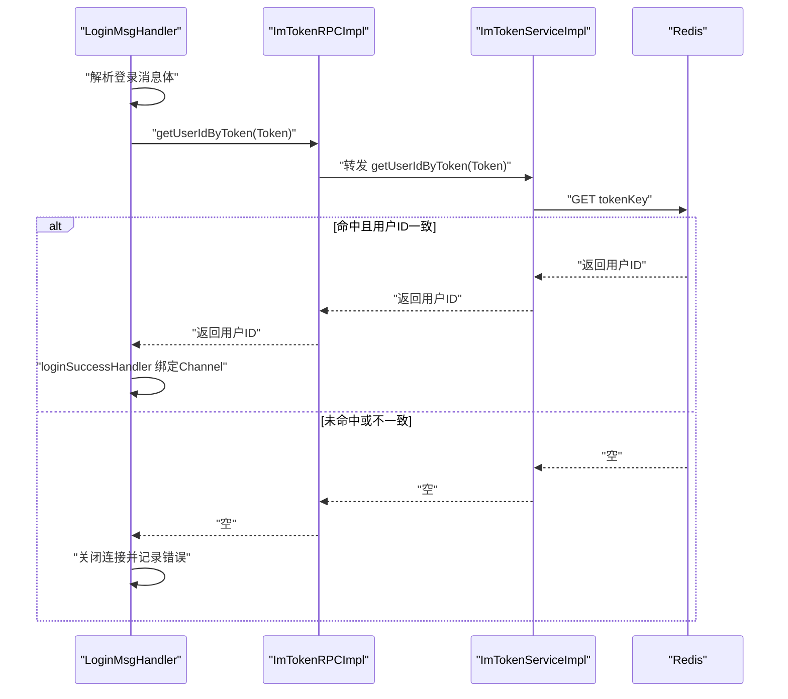
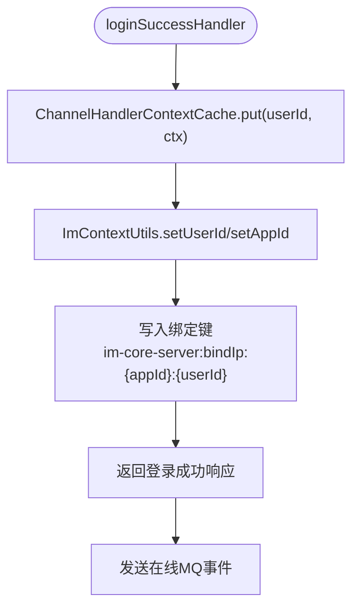
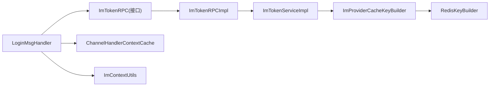

# IM连接管理

<cite>
**本文引用的文件列表**
- [ImTokenServiceImpl.java](file://live-im-provider/src/main/java/com/logilong/live/im/provider/service/impl/ImTokenServiceImpl.java)
- [ImTokenService.java](file://live-im-provider/src/main/java/com/logilong/live/im/provider/service/ImTokenService.java)
- [ImTokenRPCImpl.java](file://live-im-provider/src/main/java/com/logilong/live/im/provider/rpc/ImTokenRPCImpl.java)
- [ImTokenRPC.java](file://live-im-interface/src/main/java/com/logilong/live/im/interfaces/ImTokenRPC.java)
- [ImProviderCacheKeyBuilder.java](file://live-framework/live-framework-redis-starter/src/main/java/com/logilong/live/framework/redis/starter/key/ImProviderCacheKeyBuilder.java)
- [RedisKeyBuilder.java](file://live-framework/live-framework-redis-starter/src/main/java/com/logilong/live/framework/redis/starter/key/RedisKeyBuilder.java)
- [LoginMsgHandler.java](file://live-im-core-server/src/main/java/com/logilong/live/im/core/server/handler/impl/LoginMsgHandler.java)
- [ImContextUtils.java](file://live-im-core-server/src/main/java/com/logilong/live/im/core/server/common/ImContextUtils.java)
- [ChannelHandlerContextCache.java](file://live-im-core-server/src/main/java/com/logilong/live/im/core/server/common/ChannelHandlerContextCache.java)
- [ImCoreServerConstants.java](file://live-im-core-server-interfaces/src/main/java/com/logilong/live/im/core/server/interfaces/constants/ImCoreServerConstants.java)
- [ImConstants.java](file://live-im-interface/src/main/java/com/logilong/live/im/constants/ImConstants.java)
</cite>

## 目录
1. [简介](#简介)
2. [项目结构](#项目结构)
3. [核心组件](#核心组件)
4. [架构总览](#架构总览)
5. [详细组件分析](#详细组件分析)
6. [依赖关系分析](#依赖关系分析)
7. [性能考量](#性能考量)
8. [故障排查指南](#故障排查指南)
9. [结论](#结论)
10. [附录](#附录)

## 简介
本文件围绕IM连接认证机制进行深入解析，重点覆盖以下内容：
- 基于ImTokenServiceImpl实现的IM Token生成与验证流程
- createImLoginToken如何生成包含用户ID与AppID的唯一Token，并将其存储至Redis缓存（使用ImProviderCacheKeyBuilder构建key），设置5分钟有效期
- getUserIdByToken如何通过Token查询Redis获取用户ID，实现无状态认证
- 客户端连接时LoginMsgHandler如何验证Token并建立Channel与用户身份的绑定关系
- Redis缓存键的设计策略及过期机制对系统性能的影响
- Token安全传输建议与防重放攻击措施

## 项目结构
IM连接认证涉及两个子系统：
- IM Provider：负责Token生成、校验与持久化
- IM Core Server：负责接收客户端登录消息，调用Token RPC完成校验，并在成功后绑定Channel与用户身份

图表来源
- [ImTokenServiceImpl.java](file://live-im-provider/src/main/java/com/logilong/live/im/provider/service/impl/ImTokenServiceImpl.java#L1-L35)
- [ImTokenRPCImpl.java](file://live-im-provider/src/main/java/com/logilong/live/im/provider/rpc/ImTokenRPCImpl.java#L1-L27)
- [ImProviderCacheKeyBuilder.java](file://live-framework/live-framework-redis-starter/src/main/java/com/logilong/live/framework/redis/starter/key/ImProviderCacheKeyBuilder.java#L1-L20)
- [LoginMsgHandler.java](file://live-im-core-server/src/main/java/com/logilong/live/im/core/server/handler/impl/LoginMsgHandler.java#L1-L121)
- [ImContextUtils.java](file://live-im-core-server/src/main/java/com/logilong/live/im/core/server/common/ImContextUtils.java#L1-L43)
- [ChannelHandlerContextCache.java](file://live-im-core-server/src/main/java/com/logilong/live/im/core/server/common/ChannelHandlerContextCache.java#L1-L37)

章节来源
- [ImTokenServiceImpl.java](file://live-im-provider/src/main/java/com/logilong/live/im/provider/service/impl/ImTokenServiceImpl.java#L1-L35)
- [LoginMsgHandler.java](file://live-im-core-server/src/main/java/com/logilong/live/im/core/server/handler/impl/LoginMsgHandler.java#L1-L121)

## 核心组件
- Token生成与查询服务：ImTokenService/ImTokenServiceImpl
- Token RPC封装：ImTokenRPCImpl
- Redis Key构建：ImProviderCacheKeyBuilder（继承RedisKeyBuilder）
- 登录消息处理器：LoginMsgHandler
- Channel上下文工具：ImContextUtils
- 用户-Channel映射缓存：ChannelHandlerContextCache
- 常量定义：ImCoreServerConstants、ImConstants

章节来源
- [ImTokenService.java](file://live-im-provider/src/main/java/com/logilong/live/im/provider/service/ImTokenService.java#L1-L18)
- [ImTokenServiceImpl.java](file://live-im-provider/src/main/java/com/logilong/live/im/provider/service/impl/ImTokenServiceImpl.java#L1-L35)
- [ImTokenRPCImpl.java](file://live-im-provider/src/main/java/com/logilong/live/im/provider/rpc/ImTokenRPCImpl.java#L1-L27)
- [ImProviderCacheKeyBuilder.java](file://live-framework/live-framework-redis-starter/src/main/java/com/logilong/live/framework/redis/starter/key/ImProviderCacheKeyBuilder.java#L1-L20)
- [RedisKeyBuilder.java](file://live-framework/live-framework-redis-starter/src/main/java/com/logilong/live/framework/redis/starter/key/RedisKeyBuilder.java#L1-L22)
- [LoginMsgHandler.java](file://live-im-core-server/src/main/java/com/logilong/live/im/core/server/handler/impl/LoginMsgHandler.java#L1-L121)
- [ImContextUtils.java](file://live-im-core-server/src/main/java/com/logilong/live/im/core/server/common/ImContextUtils.java#L1-L43)
- [ChannelHandlerContextCache.java](file://live-im-core-server/src/main/java/com/logilong/live/im/core/server/common/ChannelHandlerContextCache.java#L1-L37)
- [ImCoreServerConstants.java](file://live-im-core-server-interfaces/src/main/java/com/logilong/live/im/core/server/interfaces/constants/ImCoreServerConstants.java#L1-L8)
- [ImConstants.java](file://live-im-interface/src/main/java/com/logilong/live/im/constants/ImConstants.java#L1-L13)

## 架构总览
IM连接认证采用“无状态+轻量绑定”的设计：
- 客户端发起登录请求携带Token、用户ID与AppID
- IM Core Server调用IM Provider的Token RPC进行校验
- 校验通过后，LoginMsgHandler将Channel与用户ID绑定，并写入Redis用于后续路由与心跳绑定
- Token在IM Provider侧以Redis键值形式存储，带5分钟过期

图表来源
- [LoginMsgHandler.java](file://live-im-core-server/src/main/java/com/logilong/live/im/core/server/handler/impl/LoginMsgHandler.java#L45-L99)
- [ImTokenRPCImpl.java](file://live-im-provider/src/main/java/com/logilong/live/im/provider/rpc/ImTokenRPCImpl.java#L17-L26)
- [ImTokenServiceImpl.java](file://live-im-provider/src/main/java/com/logilong/live/im/provider/service/impl/ImTokenServiceImpl.java#L21-L32)
- [ImCoreServerConstants.java](file://live-im-core-server-interfaces/src/main/java/com/logilong/live/im/core/server/interfaces/constants/ImCoreServerConstants.java#L6-L7)
- [ImConstants.java](file://live-im-interface/src/main/java/com/logilong/live/im/constants/ImConstants.java#L8-L12)

## 详细组件分析

### Token生成与存储：ImTokenServiceImpl
- 生成策略
  - 使用UUID与AppID拼接形成Token，确保Token全局唯一性
  - 将Token作为Redis键，用户ID作为值，设置5分钟TTL
- 键构建
  - 通过ImProviderCacheKeyBuilder.buildImLoginTokenKey(token)生成完整Redis Key
  - RedisKeyBuilder提供应用名前缀与分隔符，保证命名空间隔离
- 查询策略
  - 通过RedisTemplate读取用户ID；若不存在返回空，实现无状态校验

图表来源
- [ImTokenServiceImpl.java](file://live-im-provider/src/main/java/com/logilong/live/im/provider/service/impl/ImTokenServiceImpl.java#L21-L26)
- [ImProviderCacheKeyBuilder.java](file://live-framework/live-framework-redis-starter/src/main/java/com/logilong/live/framework/redis/starter/key/ImProviderCacheKeyBuilder.java#L13-L17)
- [RedisKeyBuilder.java](file://live-framework/live-framework-redis-starter/src/main/java/com/logilong/live/framework/redis/starter/key/RedisKeyBuilder.java#L10-L21)

章节来源
- [ImTokenServiceImpl.java](file://live-im-provider/src/main/java/com/logilong/live/im/provider/service/impl/ImTokenServiceImpl.java#L21-L32)
- [ImProviderCacheKeyBuilder.java](file://live-framework/live-framework-redis-starter/src/main/java/com/logilong/live/framework/redis/starter/key/ImProviderCacheKeyBuilder.java#L13-L17)
- [RedisKeyBuilder.java](file://live-framework/live-framework-redis-starter/src/main/java/com/logilong/live/framework/redis/starter/key/RedisKeyBuilder.java#L10-L21)

### Token查询与无状态认证：ImTokenServiceImpl与LoginMsgHandler
- 查询流程
  - LoginMsgHandler从登录消息体提取Token与期望用户ID
  - 调用ImTokenRPC.getUserIdByToken(Token)，由ImTokenRPCImpl转发至ImTokenServiceImpl
  - ImTokenServiceImpl通过Redis读取用户ID并返回
- 无状态校验
  - 若Redis未命中或用户ID不匹配，直接关闭连接并抛出异常
  - 成功后执行loginSuccessHandler，完成Channel与用户ID绑定

图表来源
- [LoginMsgHandler.java](file://live-im-core-server/src/main/java/com/logilong/live/im/core/server/handler/impl/LoginMsgHandler.java#L45-L74)
- [ImTokenRPCImpl.java](file://live-im-provider/src/main/java/com/logilong/live/im/provider/rpc/ImTokenRPCImpl.java#L17-L26)
- [ImTokenServiceImpl.java](file://live-im-provider/src/main/java/com/logilong/live/im/provider/service/impl/ImTokenServiceImpl.java#L28-L32)

章节来源
- [LoginMsgHandler.java](file://live-im-core-server/src/main/java/com/logilong/live/im/core/server/handler/impl/LoginMsgHandler.java#L45-L99)
- [ImTokenRPCImpl.java](file://live-im-provider/src/main/java/com/logilong/live/im/provider/rpc/ImTokenRPCImpl.java#L17-L26)
- [ImTokenServiceImpl.java](file://live-im-provider/src/main/java/com/logilong/live/im/provider/service/impl/ImTokenServiceImpl.java#L28-L32)

### 登录成功绑定：LoginMsgHandler与上下文工具
- 绑定流程
  - loginSuccessHandler将ChannelHandlerContext按用户ID放入ChannelHandlerContextCache
  - 使用ImContextUtils在Channel上设置用户ID、AppID等属性
  - 写入Redis绑定键，键名包含AppID与用户ID，TTL为心跳间隔的两倍
- 心跳窗口
  - 绑定键TTL使用默认心跳间隔的两倍，确保在心跳周期内保持绑定有效

图表来源
- [LoginMsgHandler.java](file://live-im-core-server/src/main/java/com/logilong/live/im/core/server/handler/impl/LoginMsgHandler.java#L79-L99)
- [ImContextUtils.java](file://live-im-core-server/src/main/java/com/logilong/live/im/core/server/common/ImContextUtils.java#L18-L31)
- [ChannelHandlerContextCache.java](file://live-im-core-server/src/main/java/com/logilong/live/im/core/server/common/ChannelHandlerContextCache.java#L25-L31)
- [ImCoreServerConstants.java](file://live-im-core-server-interfaces/src/main/java/com/logilong/live/im/core/server/interfaces/constants/ImCoreServerConstants.java#L6-L7)
- [ImConstants.java](file://live-im-interface/src/main/java/com/logilong/live/im/constants/ImConstants.java#L8-L12)

章节来源
- [LoginMsgHandler.java](file://live-im-core-server/src/main/java/com/logilong/live/im/core/server/handler/impl/LoginMsgHandler.java#L79-L99)
- [ImContextUtils.java](file://live-im-core-server/src/main/java/com/logilong/live/im/core/server/common/ImContextUtils.java#L18-L31)
- [ChannelHandlerContextCache.java](file://live-im-core-server/src/main/java/com/logilong/live/im/core/server/common/ChannelHandlerContextCache.java#L25-L31)
- [ImCoreServerConstants.java](file://live-im-core-server-interfaces/src/main/java/com/logilong/live/im/core/server/interfaces/constants/ImCoreServerConstants.java#L6-L7)
- [ImConstants.java](file://live-im-interface/src/main/java/com/logilong/live/im/constants/ImConstants.java#L8-L12)

### Redis键设计策略与过期机制
- 键命名策略
  - 前缀：应用名前缀（来自RedisKeyBuilder）
  - 分隔符：冒号
  - 名称：imLoginToken
  - 后缀：Token字符串
- 过期策略
  - Token键：5分钟TTL，降低长期占用与泄露风险
  - 绑定键：心跳间隔的两倍，保障连接活跃期内的路由可用
- 性能影响
  - 高频读写：Token校验与绑定键写入均为O(1)操作
  - 内存占用：Token键短生命周期，绑定键按用户数线性增长
  - 命中率：Token键命中率高，绑定键命中率取决于用户活跃度

章节来源
- [ImProviderCacheKeyBuilder.java](file://live-framework/live-framework-redis-starter/src/main/java/com/logilong/live/framework/redis/starter/key/ImProviderCacheKeyBuilder.java#L13-L17)
- [RedisKeyBuilder.java](file://live-framework/live-framework-redis-starter/src/main/java/com/logilong/live/framework/redis/starter/key/RedisKeyBuilder.java#L10-L21)
- [ImTokenServiceImpl.java](file://live-im-provider/src/main/java/com/logilong/live/im/provider/service/impl/ImTokenServiceImpl.java#L21-L26)
- [LoginMsgHandler.java](file://live-im-core-server/src/main/java/com/logilong/live/im/core/server/handler/impl/LoginMsgHandler.java#L93-L95)
- [ImConstants.java](file://live-im-interface/src/main/java/com/logilong/live/im/constants/ImConstants.java#L8-L12)

## 依赖关系分析
- 组件耦合
  - LoginMsgHandler依赖ImTokenRPC接口，通过Dubbo远程调用实现解耦
  - ImTokenRPCImpl聚合ImTokenService，避免直接依赖具体实现
  - ImTokenServiceImpl依赖RedisTemplate与ImProviderCacheKeyBuilder
- 关键依赖链
  - LoginMsgHandler -> ImTokenRPC -> ImTokenServiceImpl -> Redis
  - LoginMsgHandler -> ChannelHandlerContextCache/ImContextUtils -> Netty Channel

图表来源
- [LoginMsgHandler.java](file://live-im-core-server/src/main/java/com/logilong/live/im/core/server/handler/impl/LoginMsgHandler.java#L35-L43)
- [ImTokenRPCImpl.java](file://live-im-provider/src/main/java/com/logilong/live/im/provider/rpc/ImTokenRPCImpl.java#L11-L26)
- [ImTokenServiceImpl.java](file://live-im-provider/src/main/java/com/logilong/live/im/provider/service/impl/ImTokenServiceImpl.java#L16-L20)
- [ImProviderCacheKeyBuilder.java](file://live-framework/live-framework-redis-starter/src/main/java/com/logilong/live/framework/redis/starter/key/ImProviderCacheKeyBuilder.java#L11-L17)
- [RedisKeyBuilder.java](file://live-framework/live-framework-redis-starter/src/main/java/com/logilong/live/framework/redis/starter/key/RedisKeyBuilder.java#L8-L21)
- [ChannelHandlerContextCache.java](file://live-im-core-server/src/main/java/com/logilong/live/im/core/server/common/ChannelHandlerContextCache.java#L25-L31)
- [ImContextUtils.java](file://live-im-core-server/src/main/java/com/logilong/live/im/core/server/common/ImContextUtils.java#L18-L31)

章节来源
- [LoginMsgHandler.java](file://live-im-core-server/src/main/java/com/logilong/live/im/core/server/handler/impl/LoginMsgHandler.java#L35-L43)
- [ImTokenRPCImpl.java](file://live-im-provider/src/main/java/com/logilong/live/im/provider/rpc/ImTokenRPCImpl.java#L11-L26)
- [ImTokenServiceImpl.java](file://live-im-provider/src/main/java/com/logilong/live/im/provider/service/impl/ImTokenServiceImpl.java#L16-L20)
- [ImProviderCacheKeyBuilder.java](file://live-framework/live-framework-redis-starter/src/main/java/com/logilong/live/framework/redis/starter/key/ImProviderCacheKeyBuilder.java#L11-L17)
- [RedisKeyBuilder.java](file://live-framework/live-framework-redis-starter/src/main/java/com/logilong/live/framework/redis/starter/key/RedisKeyBuilder.java#L8-L21)
- [ChannelHandlerContextCache.java](file://live-im-core-server/src/main/java/com/logilong/live/im/core/server/common/ChannelHandlerContextCache.java#L25-L31)
- [ImContextUtils.java](file://live-im-core-server/src/main/java/com/logilong/live/im/core/server/common/ImContextUtils.java#L18-L31)

## 性能考量
- Token生成成本极低，主要开销在Redis SET/GET
- 5分钟TTL降低长期内存占用，适合高并发场景
- 绑定键TTL与心跳周期关联，避免频繁重建绑定
- 建议
  - 在高并发登录场景下，确保Redis实例具备足够容量与延迟控制
  - 对Token生成与查询路径进行监控，关注Redis命中率与延迟

[本节为通用性能讨论，无需列出章节来源]

## 故障排查指南
- 参数校验失败
  - 现象：连接被关闭并记录错误日志
  - 排查：确认登录消息体是否包含Token、用户ID与AppID，且均符合最小阈值
- Token校验失败
  - 现象：Token无效或与消息中的用户ID不一致
  - 排查：检查Redis中是否存在对应键，确认TTL是否已过期；核对AppID与Token生成逻辑
- 绑定失败
  - 现象：登录成功响应发出但后续消息无法路由
  - 排查：确认ChannelHandlerContextCache与Redis绑定键是否正确写入；检查心跳窗口是否过短

章节来源
- [LoginMsgHandler.java](file://live-im-core-server/src/main/java/com/logilong/live/im/core/server/handler/impl/LoginMsgHandler.java#L45-L74)
- [LoginMsgHandler.java](file://live-im-core-server/src/main/java/com/logilong/live/im/core/server/handler/impl/LoginMsgHandler.java#L79-L99)

## 结论
该IM连接认证机制通过“Token+Redis”的无状态设计，实现了高效、可扩展的登录校验与绑定流程。Token生成简单可靠，Redis键命名规范且TTL合理，结合LoginMsgHandler的严格参数校验与绑定策略，既保证了安全性，也兼顾了性能与可维护性。建议在生产环境中配合完善的监控与告警体系，持续优化Redis性能与网络延迟。

[本节为总结性内容，无需列出章节来源]

## 附录

### Token安全传输与防重放建议
- 传输层安全
  - 强制启用TLS/SSL，避免明文传输Token
  - 使用双向认证或证书固定，降低中间人攻击风险
- Token强度
  - 使用足够熵的随机源生成Token，避免可预测性
  - 定期轮换AppID与密钥，限制Token生命周期
- 防重放
  - 引入一次性nonce与时间戳，服务端校验时间窗口与nonce唯一性
  - 对高频登录场景增加限流与滑动窗口控制
- 审计与监控
  - 记录Token生成与校验日志，设置异常告警
  - 对异常关闭与失败登录进行统计与溯源

[本节为通用安全建议，无需列出章节来源]