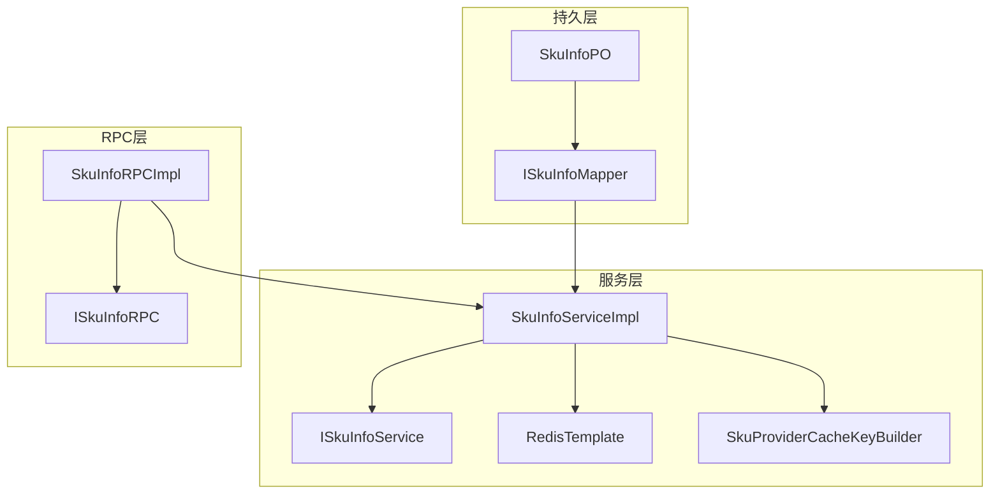
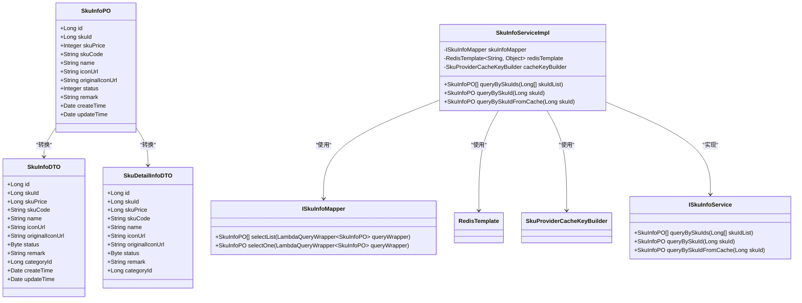
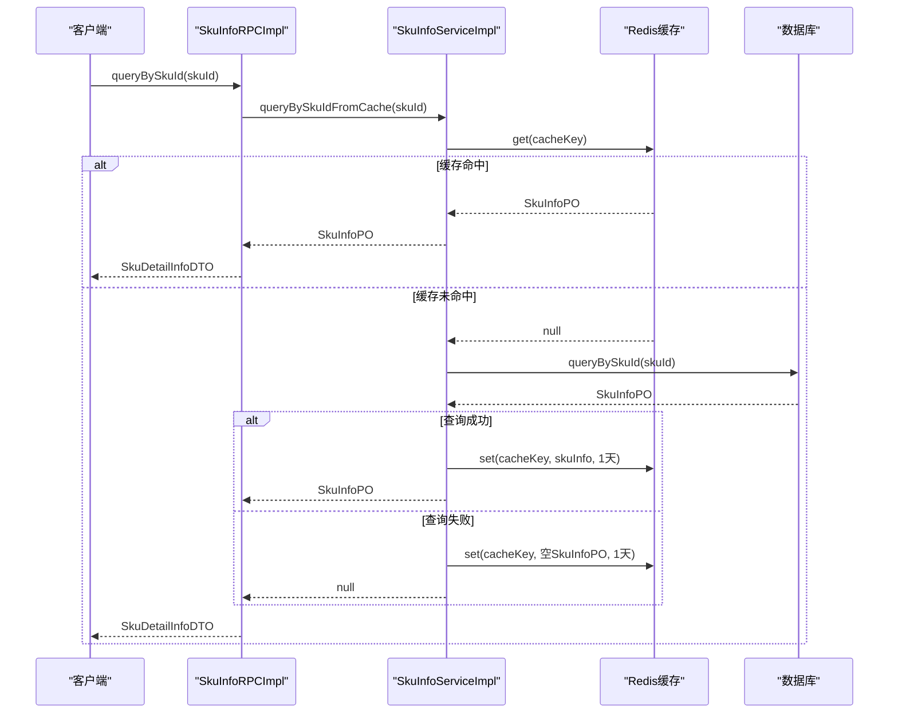
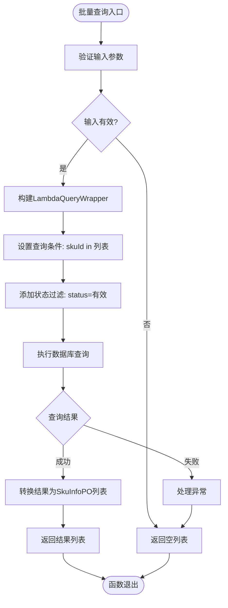
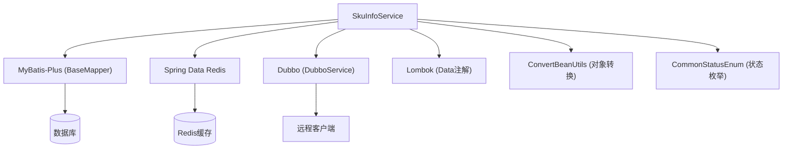

# 商品信息管理

<cite>
**本文档引用的文件**
- [ISkuInfoRPC.java](file://live-sku-interface\src\main\java\com\logilong\live\sku\interfaces\ISkuInfoRPC.java)
- [SkuInfoDTO.java](file://live-sku-interface\src\main\java\com\logilong\live\sku\dto\SkuInfoDTO.java)
- [SkuDetailInfoDTO.java](file://live-sku-interface\src\main\java\com\logilong\live\sku\dto\SkuDetailInfoDTO.java)
- [SkuInfoPO.java](file://live-sku-provider\src\main\java\com\logilong\live\sku\provider\dao\po\SkuInfoPO.java)
- [SkuInfoServiceImpl.java](file://live-sku-provider\src\main\java\com\logilong\live\sku\provider\service\impl\SkuInfoServiceImpl.java)
- [SkuInfoRPCImpl.java](file://live-sku-provider\src\main\java\com\logilong\live\sku\provider\rpc\SkuInfoRPCImpl.java)
- [SkuProviderCacheKeyBuilder.java](file://live-framework\live-framework-redis-starter\src\main\java\com\logilong\live\framework\redis\starter\key\SkuProviderCacheKeyBuilder.java)
- [ISkuInfoService.java](file://live-sku-provider\src\main\java\com\logilong\live\sku\provider\service\ISkuInfoService.java)
- [ISkuInfoMapper.java](file://live-sku-provider\src\main\java\com\logilong\live\sku\provider\dao\mapper\ISkuInfoMapper.java)
- [ShopInfoController.java](file://live-api\src\main\java\com\logilong\live\api\controller\ShopInfoController.java)
- [IShopInfoService.java](file://live-api\src\main\java\com\logilong\live\api\service\IShopInfoService.java)
- [IShopCarRPC.java](file://live-sku-interface\src\main\java\com\logilong\live\sku\interfaces\IShopCarRPC.java)
- [IShopCarService.java](file://live-sku-provider\src\main\java\com\logilong\live\sku\provider\service\IShopCarService.java)
</cite>

## 目录
1. [简介](#简介)
2. [核心组件](#核心组件)
3. [架构概览](#架构概览)
4. [详细组件分析](#详细组件分析)
5. [依赖分析](#依赖分析)
6. [性能考虑](#性能考虑)
7. [故障排除指南](#故障排除指南)
8. [结论](#结论)

## 简介
本文档全面介绍商品信息管理服务（SkuInfoService）的设计与实现，涵盖商品基本信息（SkuInfoPO）的查询、缓存策略及RPC接口定义。重点分析通过SkuInfoRPC接口提供的商品详情查询功能，说明如何将SkuInfo作为SkuDetailInfo使用，并实现基于Redis的缓存查询（queryBySkuIdFromCache）。详细阐述商品数据的缓存键构建机制，使用SkuProviderCacheKeyBuilder生成sku_detail缓存键。提供商品信息批量查询（queryBySkuIds）的实现细节与性能优化建议，包括MyBatis-Plus的LambdaQueryWrapper应用。说明该服务与其他模块（如购物车、订单）的数据交互模式。

## 核心组件

商品信息管理服务的核心组件包括商品信息持久化对象（SkuInfoPO）、数据传输对象（SkuInfoDTO和SkuDetailInfoDTO）、服务接口（ISkuInfoService）、服务实现（SkuInfoServiceImpl）、RPC接口（ISkuInfoRPC）以及缓存键构建器（SkuProviderCacheKeyBuilder）。这些组件共同构成了商品信息的查询、缓存和远程调用体系。

**组件来源**
- [SkuInfoDTO.java](file://live-sku-interface\src\main\java\com\logilong\live\sku\dto\SkuInfoDTO.java#L1-L39)
- [SkuDetailInfoDTO.java](file://live-sku-interface\src\main\java\com\logilong\live\sku\dto\SkuDetailInfoDTO.java#L1-L33)
- [SkuInfoPO.java](file://live-sku-provider\src\main\java\com\logilong\live\sku\provider\dao\po\SkuInfoPO.java#L1-L27)
- [ISkuInfoService.java](file://live-sku-provider\src\main\java\com\logilong\live\sku\provider\service\ISkuInfoService.java#L1-L21)

## 架构概览

商品信息管理服务采用分层架构设计，包括持久层、服务层和RPC层。持久层通过MyBatis-Plus的BaseMapper实现数据库操作，服务层封装业务逻辑并集成Redis缓存，RPC层提供远程服务接口供其他模块调用。缓存策略采用Redis作为缓存存储，通过SkuProviderCacheKeyBuilder构建缓存键，实现商品信息的高效查询。

**图表来源**
- [ISkuInfoMapper.java](file://live-sku-provider\src\main\java\com\logilong\live\sku\provider\dao\mapper\ISkuInfoMapper.java#L1-L10)
- [SkuInfoPO.java](file://live-sku-provider\src\main\java\com\logilong\live\sku\provider\dao\po\SkuInfoPO.java#L1-L27)
- [SkuInfoServiceImpl.java](file://live-sku-provider\src\main\java\com\logilong\live\sku\provider\service\impl\SkuInfoServiceImpl.java#L1-L67)
- [SkuProviderCacheKeyBuilder.java](file://live-framework\live-framework-redis-starter\src\main\java\com\logilong\live\framework\redis\starter\key\SkuProviderCacheKeyBuilder.java#L1-L41)
- [ISkuInfoRPC.java](file://live-sku-interface\src\main\java\com\logilong\live\sku\interfaces\ISkuInfoRPC.java#L1-L22)

## 详细组件分析

### 商品信息服务分析

商品信息服务（SkuInfoService）是商品信息管理的核心，提供商品信息的查询和缓存功能。服务实现类SkuInfoServiceImpl通过依赖注入获取ISkuInfoMapper、RedisTemplate和SkuProviderCacheKeyBuilder，实现商品信息的数据库查询和缓存操作。

#### 对象关系分析

**图表来源**
- [SkuInfoPO.java](file://live-sku-provider\src\main\java\com\logilong\live\sku\provider\dao\po\SkuInfoPO.java#L1-L27)
- [SkuInfoDTO.java](file://live-sku-interface\src\main\java\com\logilong\live\sku\dto\SkuInfoDTO.java#L1-L39)
- [SkuDetailInfoDTO.java](file://live-sku-interface\src\main\java\com\logilong\live\sku\dto\SkuDetailInfoDTO.java#L1-L33)
- [ISkuInfoService.java](file://live-sku-provider\src\main\java\com\logilong\live\sku\provider\service\ISkuInfoService.java#L1-L21)
- [SkuInfoServiceImpl.java](file://live-sku-provider\src\main\java\com\logilong\live\sku\provider\service\impl\SkuInfoServiceImpl.java#L1-L67)
- [ISkuInfoMapper.java](file://live-sku-provider\src\main\java\com\logilong\live\sku\provider\dao\mapper\ISkuInfoMapper.java#L1-L10)

#### RPC调用流程分析

**图表来源**
- [SkuInfoRPCImpl.java](file://live-sku-provider\src\main\java\com\logilong\live\sku\provider\rpc\SkuInfoRPCImpl.java#L1-L34)
- [SkuInfoServiceImpl.java](file://live-sku-provider\src\main\java\com\logilong\live\sku\provider\service\impl\SkuInfoServiceImpl.java#L1-L67)
- [SkuProviderCacheKeyBuilder.java](file://live-framework\live-framework-redis-starter\src\main\java\com\logilong\live\framework\redis\starter\key\SkuProviderCacheKeyBuilder.java#L1-L41)

#### 批量查询逻辑分析

**图表来源**
- [SkuInfoServiceImpl.java](file://live-sku-provider\src\main\java\com\logilong\live\sku\provider\service\impl\SkuInfoServiceImpl.java#L28-L34)
- [ISkuInfoMapper.java](file://live-sku-provider\src\main\java\com\logilong\live\sku\provider\dao\mapper\ISkuInfoMapper.java#L1-L10)

**组件来源**
- [SkuInfoServiceImpl.java](file://live-sku-provider\src\main\java\com\logilong\live\sku\provider\service\impl\SkuInfoServiceImpl.java#L1-L67)
- [SkuInfoRPCImpl.java](file://live-sku-provider\src\main\java\com\logilong\live\sku\provider\rpc\SkuInfoRPCImpl.java#L1-L34)
- [SkuProviderCacheKeyBuilder.java](file://live-framework\live-framework-redis-starter\src\main\java\com\logilong\live\framework\redis\starter\key\SkuProviderCacheKeyBuilder.java#L1-L41)

## 依赖分析

商品信息管理服务依赖于多个外部组件和模块，包括MyBatis-Plus用于数据库操作，Spring Data Redis用于缓存管理，以及Dubbo用于远程服务调用。服务通过ConvertBeanUtils工具类实现PO、DTO和VO之间的对象转换，确保数据在不同层之间的正确传递。

**图表来源**
- [SkuInfoServiceImpl.java](file://live-sku-provider\src\main\java\com\logilong\live\sku\provider\service\impl\SkuInfoServiceImpl.java#L1-L67)
- [SkuInfoRPCImpl.java](file://live-sku-provider\src\main\java\com\logilong\live\sku\provider\rpc\SkuInfoRPCImpl.java#L1-L34)
- [SkuInfoPO.java](file://live-sku-provider\src\main\java\com\logilong\live\sku\provider\dao\po\SkuInfoPO.java#L1-L27)

**组件来源**
- [SkuInfoServiceImpl.java](file://live-sku-provider\src\main\java\com\logilong\live\sku\provider\service\impl\SkuInfoServiceImpl.java#L1-L67)
- [SkuInfoRPCImpl.java](file://live-sku-provider\src\main\java\com\logilong\live\sku\provider\rpc\SkuInfoRPCImpl.java#L1-L34)
- [SkuInfoPO.java](file://live-sku-provider\src\main\java\com\logilong\live\sku\provider\dao\po\SkuInfoPO.java#L1-L27)

## 性能考虑

商品信息管理服务在性能方面进行了多项优化。首先，通过Redis缓存机制减少数据库查询压力，提高查询响应速度。其次，使用MyBatis-Plus的LambdaQueryWrapper构建类型安全的查询条件，避免SQL注入风险并提高查询效率。此外，服务实现了空值缓存策略，防止缓存穿透问题。批量查询功能通过in操作符一次性获取多个商品信息，减少数据库交互次数。

在缓存策略方面，服务采用1天的缓存过期时间，平衡了数据新鲜度和缓存效率。缓存键通过SkuProviderCacheKeyBuilder统一构建，确保键名的一致性和可维护性。对于高并发场景，建议结合本地缓存（如Caffeine）实现多级缓存架构，进一步提升性能。

## 故障排除指南

当商品信息查询服务出现问题时，可按照以下步骤进行排查：

1. **检查缓存连接**：确认Redis服务是否正常运行，检查RedisTemplate配置是否正确。
2. **验证数据库连接**：确认数据库连接是否正常，检查ISkuInfoMapper是否能正确执行查询。
3. **检查缓存键构建**：确认SkuProviderCacheKeyBuilder生成的缓存键是否符合预期格式。
4. **查看日志信息**：检查服务日志，定位具体异常信息和堆栈跟踪。
5. **验证对象转换**：确认ConvertBeanUtils在PO、DTO和VO之间的转换是否正确。

常见问题包括缓存键冲突、数据库查询超时、对象转换失败等。对于缓存相关问题，可通过清除特定缓存键或重启缓存服务来解决。对于数据库问题，需检查SQL语句和索引优化。

**组件来源**
- [SkuInfoServiceImpl.java](file://live-sku-provider\src\main\java\com\logilong\live\sku\provider\service\impl\SkuInfoServiceImpl.java#L1-L67)
- [SkuInfoRPCImpl.java](file://live-sku-provider\src\main\java\com\logilong\live\sku\provider\rpc\SkuInfoRPCImpl.java#L1-L34)
- [SkuProviderCacheKeyBuilder.java](file://live-framework\live-framework-redis-starter\src\main\java\com\logilong\live\framework\redis\starter\key\SkuProviderCacheKeyBuilder.java#L1-L41)

## 结论

商品信息管理服务（SkuInfoService）通过分层架构设计，实现了商品信息的高效查询和缓存管理。服务通过RPC接口为其他模块提供商品详情查询功能，采用Redis缓存策略提升系统性能。批量查询功能利用MyBatis-Plus的LambdaQueryWrapper实现类型安全的数据库操作，确保查询效率和安全性。缓存键构建机制通过SkuProviderCacheKeyBuilder统一管理，保证了缓存键的一致性和可维护性。该服务与购物车、订单等模块通过定义良好的接口进行数据交互，支持直播电商场景下的商品信息管理需求。