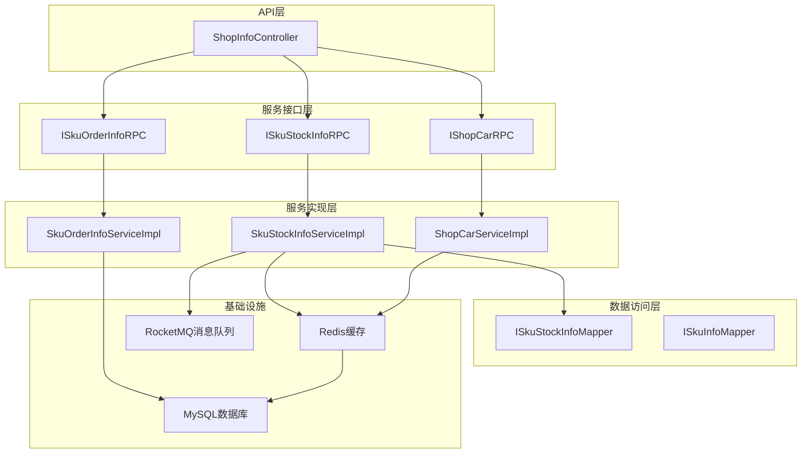
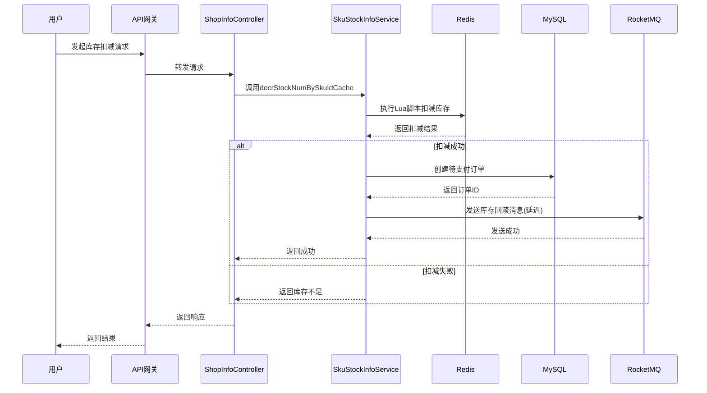
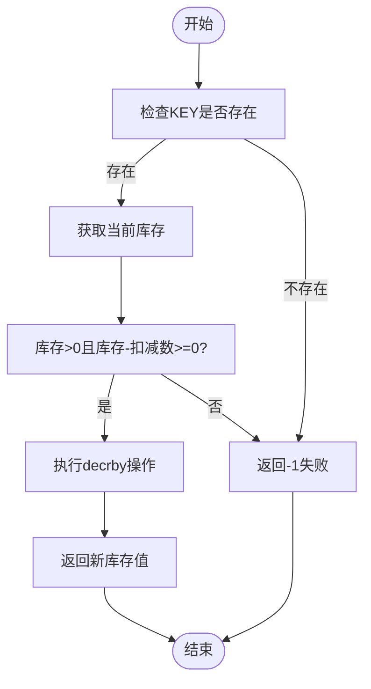
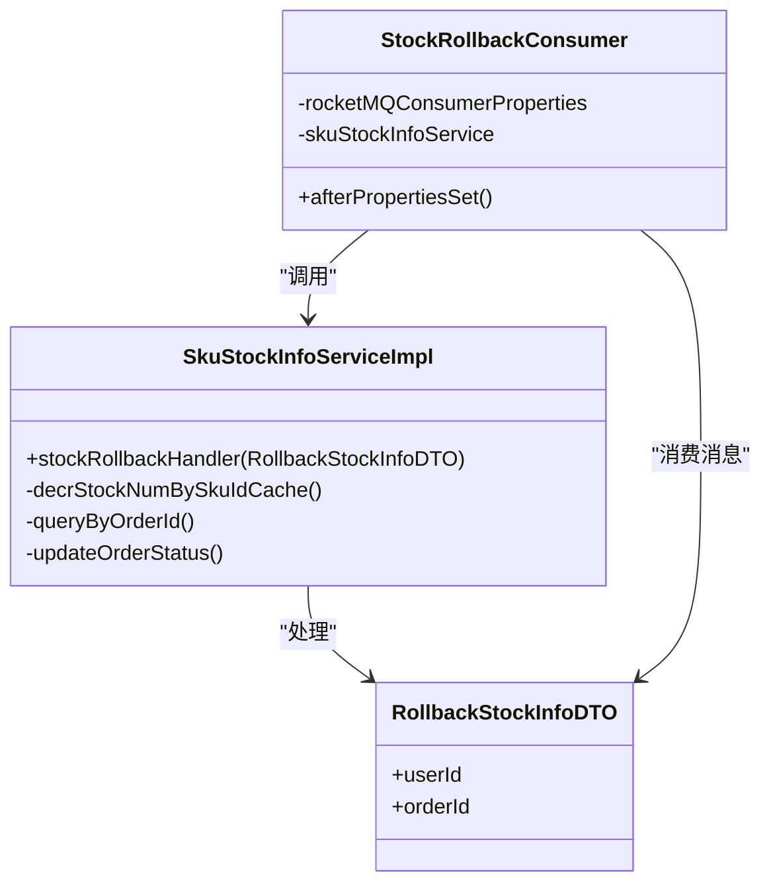
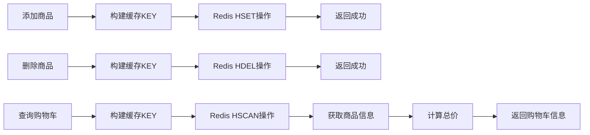
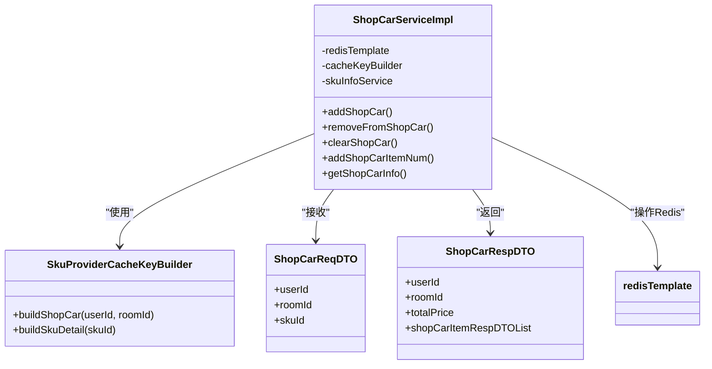
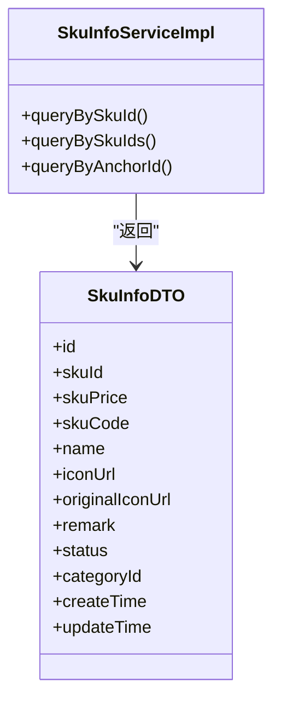
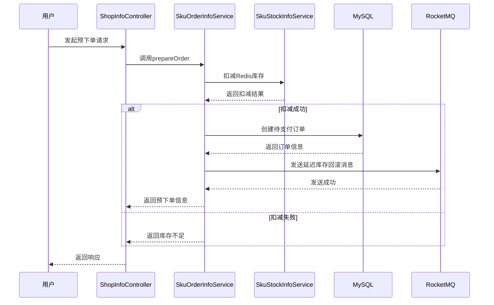

# 商品系统

<cite>
**本文档引用文件**  
- [ISkuStockInfoRPC.java](file://live-sku-interface/src/main/java/com/logilong/live/sku/interfaces/ISkuStockInfoRPC.java)
- [IShopCarRPC.java](file://live-sku-interface/src/main/java/com/logilong/live/sku/interfaces/IShopCarRPC.java)
- [SkuStockInfoDTO.java](file://live-sku-interface/src/main/java/com/logilong/live/sku/dto/SkuStockInfoDTO.java)
- [ShopCarReqDTO.java](file://live-sku-interface/src/main/java/com/logilong/live/sku/dto/ShopCarReqDTO.java)
- [StockRollbackConsumer.java](file://live-sku-provider/src/main/java/com/logilong/live/sku/provider/consumer/StockRollbackConsumer.java)
- [SkuStockInfoServiceImpl.java](file://live-sku-provider/src/main/java/com/logilong/live/sku/provider/service/impl/SkuStockInfoServiceImpl.java)
- [ShopCarServiceImpl.java](file://live-sku-provider/src/main/java/com/logilong/live/sku/provider/service/impl/ShopCarServiceImpl.java)
- [RollbackStockInfoDTO.java](file://live-sku-interface/src/main/java/com/logilong/live/sku/dto/RollbackStockInfoDTO.java)
- [ShopCarRespDTO.java](file://live-sku-interface/src/main/java/com/logilong/live/sku/dto/ShopCarRespDTO.java)
- [SkuInfoDTO.java](file://live-sku-interface/src/main/java/com/logilong/live/sku/dto/SkuInfoDTO.java)
- [ISkuOrderInfoRPC.java](file://live-sku-interface/src/main/java/com/logilong/live/sku/interfaces/ISkuOrderInfoRPC.java)
- [PayNowReqDTO.java](file://live-sku-interface/src/main/java/com/logilong/live/sku/dto/PayNowReqDTO.java)
- [ShopInfoController.java](file://live-api/src/main/java/com/logilong/live/api/controller/ShopInfoController.java)
- [SkuOrderInfoEnum.java](file://live-sku-interface/src/main/java/com/logilong/live/sku/constants/SkuOrderInfoEnum.java)
- [SkuProviderCacheKeyBuilder.java](file://live-framework/live-framework-redis-starter/src/main/java/com/logilong/live/framework/redis/starter/key/SkuProviderCacheKeyBuilder.java)
</cite>

## 目录
1. [简介](#简介)
2. [项目结构](#项目结构)
3. [核心组件](#核心组件)
4. [架构概览](#架构概览)
5. [详细组件分析](#详细组件分析)
6. [依赖分析](#依赖分析)
7. [性能考量](#性能考量)
8. [故障排除指南](#故障排除指南)
9. [结论](#结论)

## 简介
本系统为直播平台的商品服务模块，提供完整的商品信息管理、购物车操作、库存控制及订单处理功能。系统采用微服务架构，通过RPC接口对外提供服务，核心功能包括商品SKU管理、购物车增删改查、库存预扣与回滚、秒杀场景优化等。特别针对高并发场景设计了基于Redis Lua脚本的分布式库存控制机制，并通过RocketMQ实现异步库存回滚，确保系统在高并发下的数据一致性与高性能。

## 项目结构
商品服务主要由接口层（live-sku-interface）和实现层（live-sku-provider）构成，通过Dubbo RPC进行服务调用。系统采用分层架构，包括控制器层、服务层、数据访问层，并集成Redis缓存和RocketMQ消息队列。



**图示来源**
- [ISkuStockInfoRPC.java](file://live-sku-interface/src/main/java/com/logilong/live/sku/interfaces/ISkuStockInfoRPC.java)
- [IShopCarRPC.java](file://live-sku-interface/src/main/java/com/logilong/live/sku/interfaces/IShopCarRPC.java)
- [ISkuOrderInfoRPC.java](file://live-sku-interface/src/main/java/com/logilong/live/sku/interfaces/ISkuOrderInfoRPC.java)
- [SkuStockInfoServiceImpl.java](file://live-sku-provider/src/main/java/com/logilong/live/sku/provider/service/impl/SkuStockInfoServiceImpl.java)
- [ShopCarServiceImpl.java](file://live-sku-provider/src/main/java/com/logilong/live/sku/provider/service/impl/ShopCarServiceImpl.java)

**本节来源**
- [ISkuStockInfoRPC.java](file://live-sku-interface/src/main/java/com/logilong/live/sku/interfaces/ISkuStockInfoRPC.java)
- [IShopCarRPC.java](file://live-sku-interface/src/main/java/com/logilong/live/sku/interfaces/IShopCarRPC.java)
- [ISkuOrderInfoRPC.java](file://live-sku-interface/src/main/java/com/logilong/live/sku/interfaces/ISkuOrderInfoRPC.java)

## 核心组件
系统核心组件包括库存服务（SkuStockInfoService）、购物车服务（ShopCarService）和订单服务（SkuOrderInfoService）。库存服务采用Redis+MySQL双层存储，通过Lua脚本保证原子性操作；购物车服务完全基于Redis哈希结构实现，以直播间为维度进行数据隔离；订单服务管理预下单、支付等状态流转，并与库存服务协同工作。

**本节来源**
- [SkuStockInfoServiceImpl.java](file://live-sku-provider/src/main/java/com/logilong/live/sku/provider/service/impl/SkuStockInfoServiceImpl.java)
- [ShopCarServiceImpl.java](file://live-sku-provider/src/main/java/com/logilong/live/sku/provider/service/impl/ShopCarServiceImpl.java)
- [ISkuOrderInfoRPC.java](file://live-sku-interface/src/main/java/com/logilong/live/sku/interfaces/ISkuOrderInfoRPC.java)

## 架构概览
系统采用典型的微服务分层架构，前端通过API网关访问商品服务，服务内部通过RPC接口进行模块间通信。库存管理采用缓存先行策略，读操作优先从Redis获取，写操作通过Lua脚本保证原子性。订单状态变更通过消息队列异步处理库存回滚，实现业务解耦。



**图示来源**
- [SkuStockInfoServiceImpl.java](file://live-sku-provider/src/main/java/com/logilong/live/sku/provider/service/impl/SkuStockInfoServiceImpl.java)
- [StockRollbackConsumer.java](file://live-sku-provider/src/main/java/com/logilong/live/sku/provider/consumer/StockRollbackConsumer.java)
- [ShopInfoController.java](file://live-api/src/main/java/com/logilong/live/api/controller/ShopInfoController.java)

## 详细组件分析

### 库存服务分析
库存服务（SkuStockInfoService）是系统的核心，负责管理商品库存的扣减、查询和同步。服务采用Redis作为主要库存计数器，MySQL作为持久化存储，通过定时任务保持两者数据一致性。

#### 分布式锁与超卖控制
系统通过Redis Lua脚本实现原子性库存扣减，避免了传统分布式锁的性能开销。Lua脚本在Redis服务器端执行，确保"检查-扣减"操作的原子性，从根本上防止超卖问题。



**图示来源**
- [SkuStockInfoServiceImpl.java](file://live-sku-provider/src/main/java/com/logilong/live/sku/provider/service/impl/SkuStockInfoServiceImpl.java)

#### 库存回滚方案
系统通过RocketMQ实现库存回滚机制。当用户下单后未在规定时间内支付，系统会自动触发库存回滚流程，将预扣的库存返还。



**图示来源**
- [StockRollbackConsumer.java](file://live-sku-provider/src/main/java/com/logilong/live/sku/provider/consumer/StockRollbackConsumer.java)
- [SkuStockInfoServiceImpl.java](file://live-sku-provider/src/main/java/com/logilong/live/sku/provider/service/impl/SkuStockInfoServiceImpl.java)
- [RollbackStockInfoDTO.java](file://live-sku-interface/src/main/java/com/logilong/live/sku/dto/RollbackStockInfoDTO.java)

**本节来源**
- [SkuStockInfoServiceImpl.java](file://live-sku-provider/src/main/java/com/logilong/live/sku/provider/service/impl/SkuStockInfoServiceImpl.java)
- [StockRollbackConsumer.java](file://live-sku-provider/src/main/java/com/logilong/live/sku/provider/consumer/StockRollbackConsumer.java)
- [RollbackStockInfoDTO.java](file://live-sku-interface/src/main/java/com/logilong/live/sku/dto/RollbackStockInfoDTO.java)

### 购物车服务分析
购物车服务（ShopCarService）基于Redis哈希结构实现，以用户ID和直播间ID为维度进行数据隔离，确保不同直播间的购物车数据独立。

#### 增删改查操作
购物车提供完整的CRUD操作接口，所有操作均直接作用于Redis，保证高性能。



#### 缓存策略
系统采用纯内存缓存策略，购物车数据不持久化到数据库，以直播间为维度进行存储，避免数据跨直播间污染。



**图示来源**
- [ShopCarServiceImpl.java](file://live-sku-provider/src/main/java/com/logilong/live/sku/provider/service/impl/ShopCarServiceImpl.java)
- [SkuProviderCacheKeyBuilder.java](file://live-framework/live-framework-redis-starter/src/main/java/com/logilong/live/framework/redis/starter/key/SkuProviderCacheKeyBuilder.java)
- [ShopCarReqDTO.java](file://live-sku-interface/src/main/java/com/logilong/live/sku/dto/ShopCarReqDTO.java)
- [ShopCarRespDTO.java](file://live-sku-interface/src/main/java/com/logilong/live/sku/dto/ShopCarRespDTO.java)

**本节来源**
- [ShopCarServiceImpl.java](file://live-sku-provider/src/main/java/com/logilong/live/sku/provider/service/impl/ShopCarServiceImpl.java)
- [SkuProviderCacheKeyBuilder.java](file://live-framework/live-framework-redis-starter/src/main/java/com/logilong/live/framework/redis/starter/key/SkuProviderCacheKeyBuilder.java)
- [ShopCarReqDTO.java](file://live-sku-interface/src/main/java/com/logilong/live/sku/dto/ShopCarReqDTO.java)
- [ShopCarRespDTO.java](file://live-sku-interface/src/main/java/com/logilong/live/sku/dto/ShopCarRespDTO.java)

### 商品SKU管理
商品SKU服务管理商品的基本信息、规格和价格体系。

#### 规格管理
系统通过SkuInfoDTO类管理商品的完整信息，包括SKU ID、价格、编码、名称、图片等。



#### 价格体系
商品价格存储在skuPrice字段中，单位为分，避免浮点数精度问题。系统支持通过直播间维度查询商品列表。

**本节来源**
- [SkuInfoDTO.java](file://live-sku-interface/src/main/java/com/logilong/live/sku/dto/SkuInfoDTO.java)
- [SkuInfoServiceImpl.java](file://live-sku-provider/src/main/java/com/logilong/live/sku/provider/service/impl/SkuInfoServiceImpl.java)

### 支付系统对接
系统通过预下单和立即支付接口与支付系统对接，实现完整的交易流程。

#### 预下单流程


#### 支付完成流程
当用户完成支付后，系统更新订单状态为已支付，防止库存回滚。

**本节来源**
- [ISkuOrderInfoRPC.java](file://live-sku-interface/src/main/java/com/logilong/live/sku/interfaces/ISkuOrderInfoRPC.java)
- [SkuOrderInfoEnum.java](file://live-sku-interface/src/main/java/com/logilong/live/sku/constants/SkuOrderInfoEnum.java)
- [ShopInfoController.java](file://live-api/src/main/java/com/logilong/live/api/controller/ShopInfoController.java)

## 依赖分析
系统依赖于多个基础设施组件，包括Redis、MySQL、RocketMQ和Dubbo RPC框架。各组件间通过清晰的接口定义进行通信，确保松耦合。

```mermaid
graph TD
ShopInfoController --> ISkuStockInfoRPC
ShopInfoController --> IShopCarRPC
ShopInfoController --> ISkuOrderInfoRPC
ISkuStockInfoRPC --> SkuStockInfoServiceImpl
IShopCarRPC --> ShopCarServiceImpl
ISkuOrderInfoRPC --> SkuOrderInfoServiceImpl
SkuStockInfoServiceImpl --> Redis
SkuStockInfoServiceImpl --> MySQL
SkuStockInfoServiceImpl --> RocketMQ
ShopCarServiceImpl --> Redis
SkuOrderInfoServiceImpl --> MySQL
SkuOrderInfoServiceImpl --> Redis
Redis -.-> MySQL : 定时同步
RocketMQ -.-> SkuStockInfoServiceImpl : 消费库存回滚消息
```

**图示来源**
- [SkuStockInfoServiceImpl.java](file://live-sku-provider/src/main/java/com/logilong/live/sku/provider/service/impl/SkuStockInfoServiceImpl.java)
- [ShopCarServiceImpl.java](file://live-sku-provider/src/main/java/com/logilong/live/sku/provider/service/impl/ShopCarServiceImpl.java)
- [SkuOrderInfoServiceImpl.java](file://live-sku-provider/src/main/java/com/logilong/live/sku/provider/service/impl/SkuOrderInfoServiceImpl.java)

**本节来源**
- [SkuStockInfoServiceImpl.java](file://live-sku-provider/src/main/java/com/logilong/live/sku/provider/service/impl/SkuStockInfoServiceImpl.java)
- [ShopCarServiceImpl.java](file://live-sku-provider/src/main/java/com/logilong/live/sku/provider/service/impl/ShopCarServiceImpl.java)
- [SkuOrderInfoServiceImpl.java](file://live-sku-provider/src/main/java/com/logilong/live/sku/provider/service/impl/SkuOrderInfoServiceImpl.java)

## 性能考量
系统针对高并发场景进行了多项性能优化，特别是在秒杀场景下。

### 秒杀场景优化
#### 预扣库存
系统采用预扣库存策略，在用户发起购买请求时立即扣减Redis库存，避免数据库成为瓶颈。

#### 异步结算
库存扣减与订单创建异步进行，通过消息队列解耦，提高系统吞吐量。

#### 缓存穿透防护
系统通过布隆过滤器或缓存空值的方式防止缓存穿透，保护后端数据库。

#### 限流降级
通过网关层和应用层的限流机制，防止突发流量压垮系统。

**本节来源**
- [SkuStockInfoServiceImpl.java](file://live-sku-provider/src/main/java/com/logilong/live/sku/provider/service/impl/SkuStockInfoServiceImpl.java)
- [StockRollbackConsumer.java](file://live-sku-provider/src/main/java/com/logilong/live/sku/provider/consumer/StockRollbackConsumer.java)

## 故障排除指南
### 常见问题
1. **库存不一致**：检查Redis与MySQL的同步任务是否正常运行
2. **超卖问题**：确认Lua脚本是否正确执行，检查Redis原子性操作
3. **消息积压**：检查RocketMQ消费者是否正常运行，消费速度是否匹配生产速度
4. **缓存KEY冲突**：检查缓存KEY生成逻辑，确保用户和直播间维度的隔离

### 监控指标
- Redis内存使用率
- 库存扣减成功率
- 消息队列积压情况
- 接口响应时间

**本节来源**
- [SkuStockInfoServiceImpl.java](file://live-sku-provider/src/main/java/com/logilong/live/sku/provider/service/impl/SkuStockInfoServiceImpl.java)
- [StockRollbackConsumer.java](file://live-sku-provider/src/main/java/com/logilong/live/sku/provider/consumer/StockRollbackConsumer.java)

## 结论
本商品系统通过Redis Lua脚本实现了高性能的分布式库存控制，结合RocketMQ消息队列实现了可靠的库存回滚机制。购物车服务采用纯内存方案，保证了高并发下的响应速度。系统架构清晰，组件职责明确，通过合理的缓存策略和异步处理机制，能够有效支撑直播带货场景下的高并发需求。未来可进一步优化库存同步策略，引入分段库存等更高级的并发控制机制。