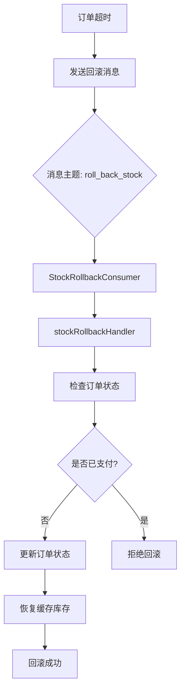
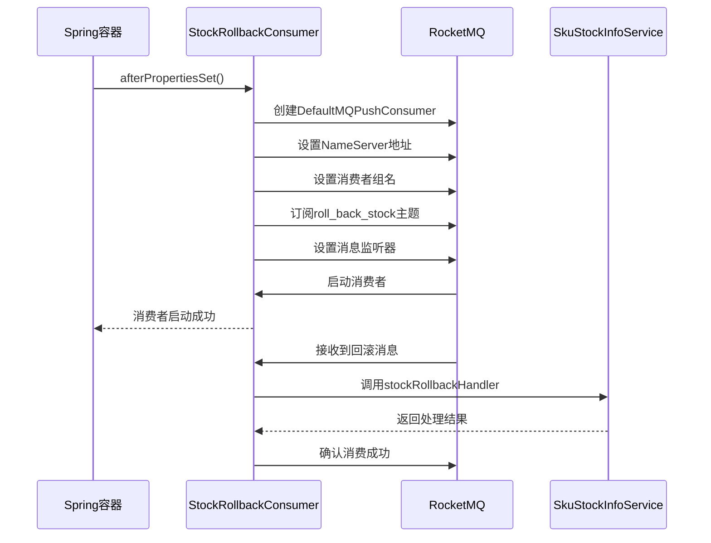
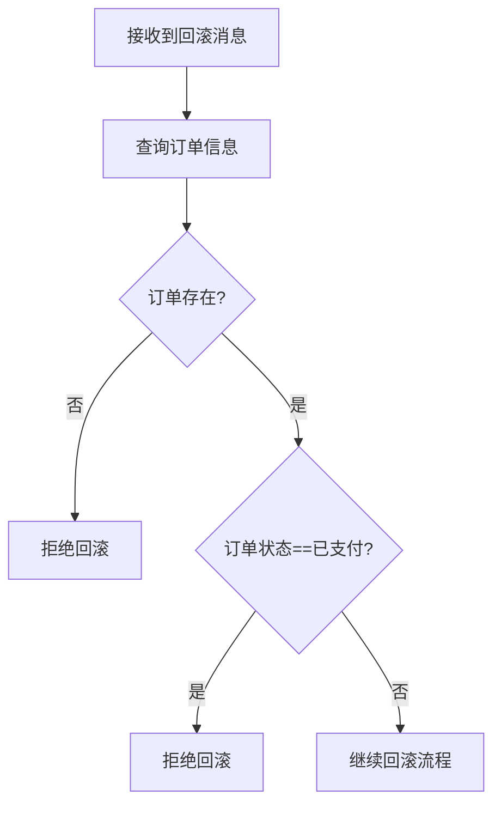
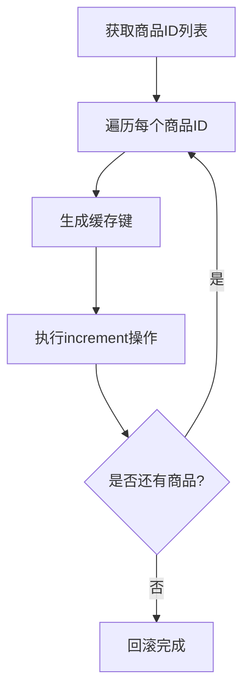
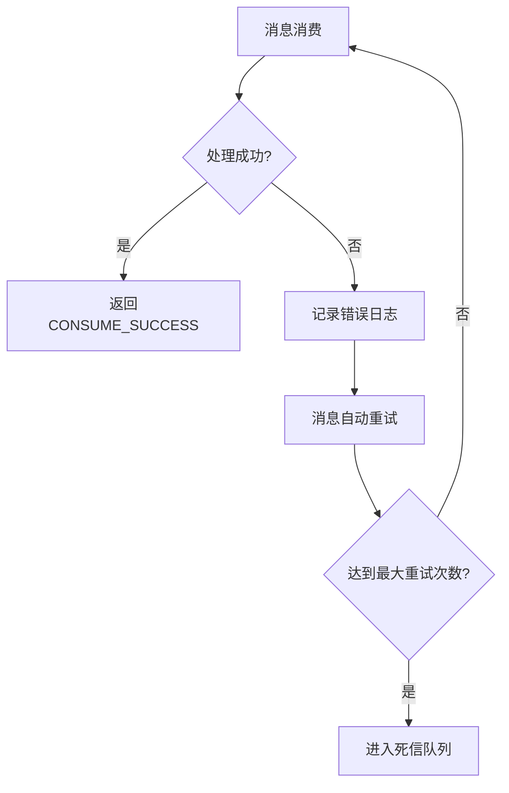

# 库存回滚流程

<cite>
**本文档引用的文件**  
- [StockRollbackConsumer.java](file://live-sku-provider/src/main/java/com/logilong/live/sku/provider/consumer/StockRollbackConsumer.java)
- [SkuStockInfoServiceImpl.java](file://live-sku-provider/src/main/java/com/logilong/live/sku/provider/service/impl/SkuStockInfoServiceImpl.java)
- [SkuProviderTopicNames.java](file://live-common-interface/src/main/java/com/logilong/live/common/interfaces/topic/SkuProviderTopicNames.java)
- [RollbackStockInfoDTO.java](file://live-sku-interface/src/main/java/com/logilong/live/sku/dto/RollbackStockInfoDTO.java)
- [SkuOrderInfoEnum.java](file://live-sku-interface/src/main/java/com/logilong/live/sku/constants/SkuOrderInfoEnum.java)
- [SkuOrderInfoServiceImpl.java](file://live-sku-provider/src/main/java/com/logilong/live/sku/provider/service/impl/SkuOrderInfoServiceImpl.java)
- [RocketMQConsumerProperties.java](file://live-framework/live-framework-mq-starter/src/main/java/com/logilong/live/framework/mq/starter/properties/RocketMQConsumerProperties.java)
- [RedisConfig.java](file://live-framework/live-framework-redis-starter/src/main/java/com/logilong/live/framework/redis/starter/config/RedisConfig.java)
- [SkuProviderCacheKeyBuilder.java](file://live-framework/live-framework-redis-starter/src/main/java/com/logilong/live/framework/redis/starter/key/SkuProviderCacheKeyBuilder.java)
</cite>

## 目录
1. [简介](#简介)
2. [库存回滚机制概述](#库存回滚机制概述)
3. [消息触发与消费者初始化](#消息触发与消费者初始化)
4. [回滚前订单状态检查逻辑](#回滚前订单状态检查逻辑)
5. [库存恢复流程](#库存恢复流程)
6. [可靠性保障与异常处理](#可靠性保障与异常处理)

## 简介
本文档全面介绍直播带货平台中库存回滚机制的完整流程。重点说明如何通过RocketMQ消息触发库存回滚、消费者初始化机制、订单状态检查逻辑、缓存库存恢复方式以及消息消费的可靠性保障策略。

## 库存回滚机制概述

库存回滚机制用于处理订单超时未支付场景下的库存恢复。当用户下单但未在规定时间内完成支付时，系统通过消息队列触发库存回滚操作，将已锁定的商品库存重新释放，避免库存长时间被占用。

该机制的核心组件包括：
- 消息生产者：在订单超时后发送回滚消息
- RocketMQ消息主题：`roll_back_stock`
- 消费者：`StockRollbackConsumer`监听并处理回滚消息
- 服务处理器：`stockRollbackHandler`执行具体的回滚逻辑



**Diagram sources**
- [SkuProviderTopicNames.java](file://live-common-interface/src/main/java/com/logilong/live/common/interfaces/topic/SkuProviderTopicNames.java#L9-L10)
- [StockRollbackConsumer.java](file://live-sku-provider/src/main/java/com/logilong/live/sku/provider/consumer/StockRollbackConsumer.java#L22-L52)

**Section sources**
- [SkuProviderTopicNames.java](file://live-common-interface/src/main/java/com/logilong/live/common/interfaces/topic/SkuProviderTopicNames.java#L9-L10)
- [StockRollbackConsumer.java](file://live-sku-provider/src/main/java/com/logilong/live/sku/provider/consumer/StockRollbackConsumer.java#L22-L52)

## 消息触发与消费者初始化

### 消息主题定义
库存回滚消息的主题名称定义在`SkuProviderTopicNames`类中：

```java
public static final String ROLL_BACK_STOCK = "roll_back_stock";
```

### 消费者初始化机制
`StockRollbackConsumer`类实现了`InitializingBean`接口，在Spring容器初始化完成后自动启动RocketMQ消费者。

关键配置参数：
- **NameServer地址**：从`RocketMQConsumerProperties`配置类获取
- **消费者组名**：基于配置的组名加上类名构成唯一标识
- **消费模式**：从最早偏移量开始消费（CONSUME_FROM_FIRST_OFFSET）
- **批量消费大小**：每次从Broker拉取10条消息

消费者通过订阅`ROLL_BACK_STOCK`主题来监听库存回滚消息，并设置并发消息监听器处理消息。



**Diagram sources**
- [StockRollbackConsumer.java](file://live-sku-provider/src/main/java/com/logilong/live/sku/provider/consumer/StockRollbackConsumer.java#L32-L48)
- [RocketMQConsumerProperties.java](file://live-framework/live-framework-mq-starter/src/main/java/com/logilong/live/framework/mq/starter/properties/RocketMQConsumerProperties.java#L13-L15)

**Section sources**
- [StockRollbackConsumer.java](file://live-sku-provider/src/main/java/com/logilong/live/sku/provider/consumer/StockRollbackConsumer.java#L22-L52)
- [RocketMQConsumerProperties.java](file://live-framework/live-framework-mq-starter/src/main/java/com/logilong/live/framework/mq/starter/properties/RocketMQConsumerProperties.java#L13-L15)

## 回滚前订单状态检查逻辑

为防止已支付订单被错误回滚，系统在执行库存恢复前会进行严格的订单状态检查。

### 订单状态枚举
系统定义了三种订单状态：

| 状态码 | 状态名称 | 描述 |
|--------|----------|------|
| 0 | PREPARE_PAY | 待支付状态 |
| 1 | PAYED | 已支付状态 |
| 2 | END | 订单已关闭 |

### 状态检查流程
1. 接收到`RollbackStockInfoDTO`消息，包含`userId`和`orderId`
2. 调用`skuOrderInfoService.queryByOrderId(orderId)`查询订单详情
3. 如果订单不存在或订单状态为`PAYED`（已支付），则拒绝回滚
4. 只有订单处于`PREPARE_PAY`（待支付）状态时才允许回滚



**Diagram sources**
- [SkuOrderInfoEnum.java](file://live-sku-interface/src/main/java/com/logilong/live/sku/constants/SkuOrderInfoEnum.java#L11-L13)
- [SkuOrderInfoServiceImpl.java](file://live-sku-provider/src/main/java/com/logilong/live/sku/provider/service/impl/SkuOrderInfoServiceImpl.java#L53-L67)

**Section sources**
- [SkuOrderInfoEnum.java](file://live-sku-interface/src/main/java/com/logilong/live/sku/constants/SkuOrderInfoEnum.java#L11-L13)
- [SkuStockInfoServiceImpl.java](file://live-sku-provider/src/main/java/com/logilong/live/sku/provider/service/impl/SkuStockInfoServiceImpl.java#L134-L137)
- [SkuOrderInfoServiceImpl.java](file://live-sku-provider/src/main/java/com/logilong/live/sku/provider/service/impl/SkuOrderInfoServiceImpl.java#L53-L67)

## 库存恢复流程

### 商品ID列表提取
系统从订单信息中提取需要恢复库存的商品ID列表。订单中的商品ID以逗号分隔的字符串形式存储，系统将其转换为Long类型的列表：

```java
List<Long> skuIdList = Arrays.stream(skuOrderInfoRespDTO.getSkuIdList().split(","))
    .toList()
    .stream()
    .map(Long::valueOf)
    .toList();
```

### 缓存库存恢复
使用`RedisTemplate.increment`方法对每个商品的缓存库存进行递增操作：

1. 通过`SkuProviderCacheKeyBuilder.buildSkuStock(skuId)`生成缓存键
2. 使用`redisTemplate.opsForValue().increment(cacheKey, 1)`恢复库存
3. 采用并行流处理提高批量恢复效率

缓存键的生成规则为：`{前缀}sku_stock{分隔符}{skuId}`



**Diagram sources**
- [SkuStockInfoServiceImpl.java](file://live-sku-provider/src/main/java/com/logilong/live/sku/provider/service/impl/SkuStockInfoServiceImpl.java#L143-L147)
- [SkuProviderCacheKeyBuilder.java](file://live-framework/live-framework-redis-starter/src/main/java/com/logilong/live/framework/redis/starter/key/SkuProviderCacheKeyBuilder.java#L29-L31)

**Section sources**
- [SkuStockInfoServiceImpl.java](file://live-sku-provider/src/main/java/com/logilong/live/sku/provider/service/impl/SkuStockInfoServiceImpl.java#L133-L148)
- [SkuProviderCacheKeyBuilder.java](file://live-framework/live-framework-redis-starter/src/main/java/com/logilong/live/framework/redis/starter/key/SkuProviderCacheKeyBuilder.java#L29-L31)

## 可靠性保障与异常处理

### 消息消费可靠性
1. **自动重试机制**：RocketMQ客户端配置了发送失败重试次数
2. **异步线程池**：使用专用线程池处理异步发送任务
3. **生产者配置**：设置了`retryAnotherBrokerWhenNotStoreOK`确保消息可靠存储

### 异常处理策略
1. **幂等性保证**：通过订单状态检查防止重复回滚
2. **事务一致性**：先更新订单状态为"已关闭"，再恢复库存
3. **缓存更新**：订单状态变更后删除相关缓存，确保数据一致性

### 配置参数
- **NameServer地址**：从配置中心获取
- **消费者组名**：确保消费者组的唯一性
- **重试次数**：配置消息发送失败时的重试次数



**Diagram sources**
- [RocketMQProducerConfig.java](file://live-framework/live-framework-mq-starter/src/main/java/com/logilong/live/framework/mq/starter/producer/RocketMQProducerConfig.java#L26-L38)
- [StockRollbackConsumer.java](file://live-sku-provider/src/main/java/com/logilong/live/sku/provider/consumer/StockRollbackConsumer.java#L46-L47)

**Section sources**
- [RocketMQProducerConfig.java](file://live-framework/live-framework-mq-starter/src/main/java/com/logilong/live/framework/mq/starter/producer/RocketMQProducerConfig.java#L26-L38)
- [StockRollbackConsumer.java](file://live-sku-provider/src/main/java/com/logilong/live/sku/provider/consumer/StockRollbackConsumer.java#L46-L47)
- [RedisConfig.java](file://live-framework/live-framework-redis-starter/src/main/java/com/logilong/live/framework/redis/starter/config/RedisConfig.java#L15-L27)