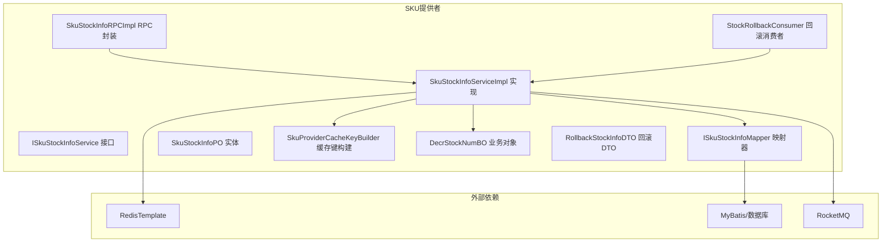
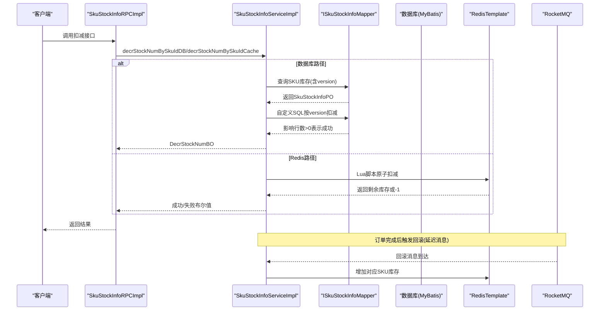
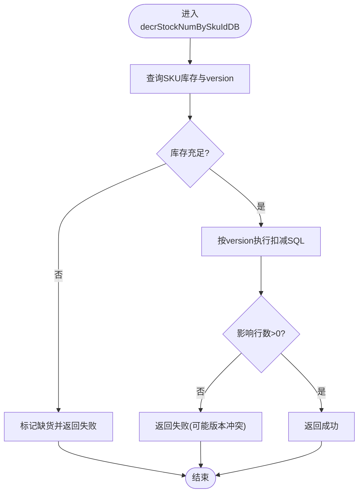
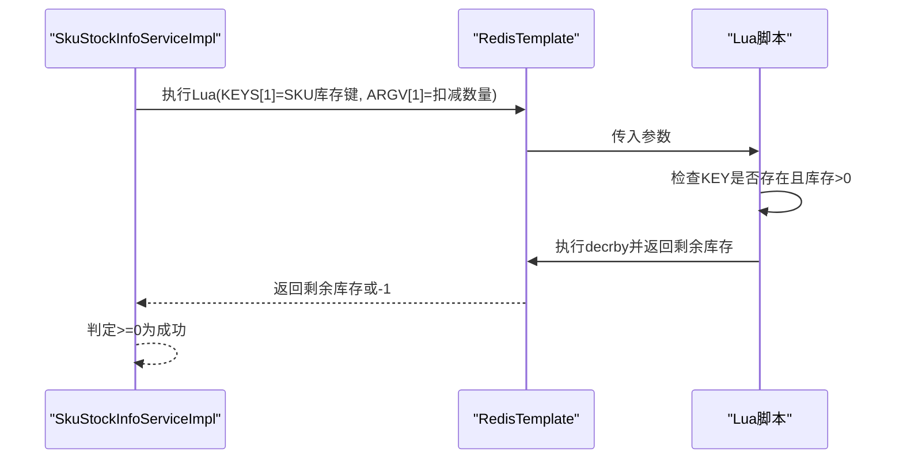
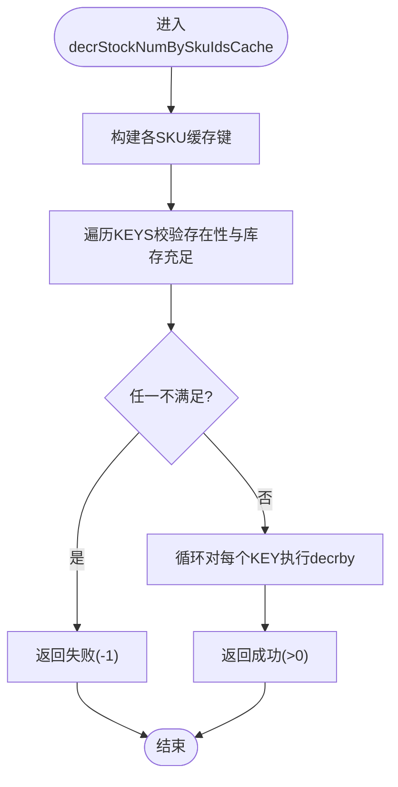
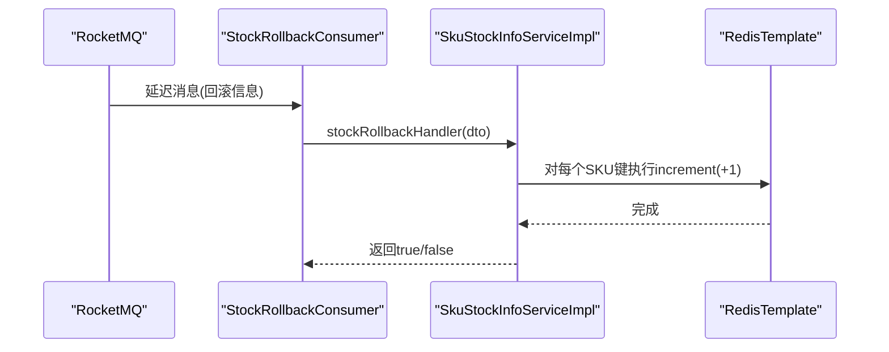
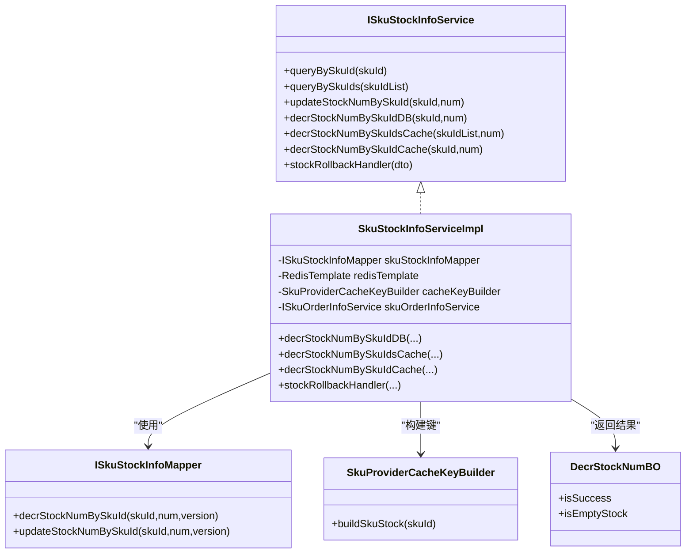

# 库存扣减机制

<cite>
**本文引用的文件列表**
- [ISkuStockInfoMapper.java](file://live-sku-provider/src/main/java/com/logilong/live/sku/provider/dao/mapper/ISkuStockInfoMapper.java)
- [SkuStockInfoPO.java](file://live-sku-provider/src/main/java/com/logilong/live/sku/provider/dao/po/SkuStockInfoPO.java)
- [ISkuStockInfoService.java](file://live-sku-provider/src/main/java/com/logilong/live/sku/provider/service/ISkuStockInfoService.java)
- [SkuStockInfoServiceImpl.java](file://live-sku-provider/src/main/java/com/logilong/live/sku/provider/service/impl/SkuStockInfoServiceImpl.java)
- [SkuProviderCacheKeyBuilder.java](file://live-framework/live-framework-redis-starter/src/main/java/com/logilong/live/framework/redis/starter/key/SkuProviderCacheKeyBuilder.java)
- [DecrStockNumBO.java](file://live-sku-provider/src/main/java/com/logilong/live/sku/provider/service/bo/DecrStockNumBO.java)
- [SkuStockInfoRPCImpl.java](file://live-sku-provider/src/main/java/com/logilong/live/sku/provider/rpc/SkuStockInfoRPCImpl.java)
- [StockRollbackConsumer.java](file://live-sku-provider/src/main/java/com/logilong/live/sku/provider/consumer/StockRollbackConsumer.java)
- [RollbackStockInfoDTO.java](file://live-sku-interface/src/main/java/com/logilong/live/sku/dto/RollbackStockInfoDTO.java)
</cite>

## 目录
1. [引言](#引言)
2. [项目结构](#项目结构)
3. [核心组件](#核心组件)
4. [架构总览](#架构总览)
5. [详细组件分析](#详细组件分析)
6. [依赖关系分析](#依赖关系分析)
7. [性能考量](#性能考量)
8. [故障排查指南](#故障排查指南)
9. [结论](#结论)

## 引言
本文件系统性阐述库存管理系统的双重扣减机制，覆盖数据库与Redis两种路径：
- 基于数据库的扣减实现（decrStockNumBySkuIdDB）：采用乐观锁（version字段）与MyBatis自定义SQL更新，确保并发安全与数据一致性。
- 基于Redis的高性能扣减方案（decrStockNumBySkuIdCache、decrStockNumBySkuIdsCache）：通过Lua脚本保证原子性，有效防止高并发下的超卖问题。
同时解释业务对象DecrStockNumBO在扣减结果传递中的作用，以及库存缓存键设计（SkuProviderCacheKeyBuilder.buildSkuStock）对整体流程的影响。

## 项目结构
围绕库存扣减的核心代码位于以下模块与文件：
- 接口与实现：ISkuStockInfoService、SkuStockInfoServiceImpl
- 数据访问：ISkuStockInfoMapper、SkuStockInfoPO
- 缓存键构建：SkuProviderCacheKeyBuilder
- RPC封装：SkuStockInfoRPCImpl
- 回滚消费者：StockRollbackConsumer
- 业务对象：DecrStockNumBO
- DTO：RollbackStockInfoDTO

图表来源
- [ISkuStockInfoService.java](file://live-sku-provider/src/main/java/com/logilong/live/sku/provider/service/ISkuStockInfoService.java#L1-L48)
- [SkuStockInfoServiceImpl.java](file://live-sku-provider/src/main/java/com/logilong/live/sku/provider/service/impl/SkuStockInfoServiceImpl.java#L1-L151)
- [ISkuStockInfoMapper.java](file://live-sku-provider/src/main/java/com/logilong/live/sku/provider/dao/mapper/ISkuStockInfoMapper.java#L1-L17)
- [SkuProviderCacheKeyBuilder.java](file://live-framework/live-framework-redis-starter/src/main/java/com/logilong/live/framework/redis/starter/key/SkuProviderCacheKeyBuilder.java#L1-L41)
- [DecrStockNumBO.java](file://live-sku-provider/src/main/java/com/logilong/live/sku/provider/service/bo/DecrStockNumBO.java#L1-L16)
- [SkuStockInfoRPCImpl.java](file://live-sku-provider/src/main/java/com/logilong/live/sku/provider/rpc/SkuStockInfoRPCImpl.java#L31-L63)
- [StockRollbackConsumer.java](file://live-sku-provider/src/main/java/com/logilong/live/sku/provider/consumer/StockRollbackConsumer.java#L1-L51)
- [RollbackStockInfoDTO.java](file://live-sku-interface/src/main/java/com/logilong/live/sku/dto/RollbackStockInfoDTO.java#L1-L16)

章节来源
- [ISkuStockInfoService.java](file://live-sku-provider/src/main/java/com/logilong/live/sku/provider/service/ISkuStockInfoService.java#L1-L48)
- [SkuStockInfoServiceImpl.java](file://live-sku-provider/src/main/java/com/logilong/live/sku/provider/service/impl/SkuStockInfoServiceImpl.java#L1-L151)
- [ISkuStockInfoMapper.java](file://live-sku-provider/src/main/java/com/logilong/live/sku/provider/dao/mapper/ISkuStockInfoMapper.java#L1-L17)
- [SkuProviderCacheKeyBuilder.java](file://live-framework/live-framework-redis-starter/src/main/java/com/logilong/live/framework/redis/starter/key/SkuProviderCacheKeyBuilder.java#L1-L41)
- [DecrStockNumBO.java](file://live-sku-provider/src/main/java/com/logilong/live/sku/provider/service/bo/DecrStockNumBO.java#L1-L16)
- [SkuStockInfoRPCImpl.java](file://live-sku-provider/src/main/java/com/logilong/live/sku/provider/rpc/SkuStockInfoRPCImpl.java#L31-L63)
- [StockRollbackConsumer.java](file://live-sku-provider/src/main/java/com/logilong/live/sku/provider/consumer/StockRollbackConsumer.java#L1-L51)
- [RollbackStockInfoDTO.java](file://live-sku-interface/src/main/java/com/logilong/live/sku/dto/RollbackStockInfoDTO.java#L1-L16)

## 核心组件
- 数据库路径（乐观锁+自定义SQL）
  - 使用实体类SkuStockInfoPO中的version字段作为乐观锁标识，配合MyBatis映射器ISkuStockInfoMapper提供的自定义SQL更新，实现“仅当版本匹配时才扣减”的原子性保障。
  - 返回DecrStockNumBO，用于向调用方传递扣减是否成功、是否缺货等状态，便于上层决策（如重试或降级）。
- Redis路径（Lua原子性）
  - 通过SkuProviderCacheKeyBuilder为每个SKU生成统一的缓存键前缀，确保扣减操作在Redis侧具备唯一性与可定位性。
  - 使用Lua脚本在单个KEY上进行条件判断与扣减，保证“存在性检查+扣减”在Redis内部原子执行，避免竞态导致的超卖。
  - 支持单SKU与多SKU批量扣减，批量版本通过循环遍历KEY并统一扣减，提升吞吐。

章节来源
- [ISkuStockInfoMapper.java](file://live-sku-provider/src/main/java/com/logilong/live/sku/provider/dao/mapper/ISkuStockInfoMapper.java#L1-L17)
- [SkuStockInfoPO.java](file://live-sku-provider/src/main/java/com/logilong/live/sku/provider/dao/po/SkuStockInfoPO.java#L1-L22)
- [DecrStockNumBO.java](file://live-sku-provider/src/main/java/com/logilong/live/sku/provider/service/bo/DecrStockNumBO.java#L1-L16)
- [SkuProviderCacheKeyBuilder.java](file://live-framework/live-framework-redis-starter/src/main/java/com/logilong/live/framework/redis/starter/key/SkuProviderCacheKeyBuilder.java#L1-L41)
- [SkuStockInfoServiceImpl.java](file://live-sku-provider/src/main/java/com/logilong/live/sku/provider/service/impl/SkuStockInfoServiceImpl.java#L1-L151)

## 架构总览
下图展示从RPC入口到服务实现、再到数据库与Redis的交互路径，以及回滚流程。

图表来源
- [SkuStockInfoRPCImpl.java](file://live-sku-provider/src/main/java/com/logilong/live/sku/provider/rpc/SkuStockInfoRPCImpl.java#L31-L63)
- [SkuStockInfoServiceImpl.java](file://live-sku-provider/src/main/java/com/logilong/live/sku/provider/service/impl/SkuStockInfoServiceImpl.java#L86-L130)
- [ISkuStockInfoMapper.java](file://live-sku-provider/src/main/java/com/logilong/live/sku/provider/dao/mapper/ISkuStockInfoMapper.java#L1-L17)
- [StockRollbackConsumer.java](file://live-sku-provider/src/main/java/com/logilong/live/sku/provider/consumer/StockRollbackConsumer.java#L1-L51)

## 详细组件分析

### 基于数据库的扣减实现（decrStockNumBySkuIdDB）
- 流程要点
  - 先查询SKU库存与version，若库存为0或不足则直接标记缺货并返回。
  - 若满足扣减条件，调用自定义SQL按“skuId + version”进行扣减，仅当version未被其他并发写入修改时才成功。
  - 返回DecrStockNumBO，包含isSuccess与isEmptyStock两个关键状态，供上层做重试或降级策略。
- 复杂度与性能
  - 时间复杂度：O(1)（单条记录更新），空间复杂度：O(1)。
  - 乐观锁避免了额外的锁等待，但可能因版本冲突导致重试。
- 错误处理
  - 当库存不足或版本不匹配时，返回失败；调用方可据此决定是否重试或提示用户。

图表来源
- [SkuStockInfoServiceImpl.java](file://live-sku-provider/src/main/java/com/logilong/live/sku/provider/service/impl/SkuStockInfoServiceImpl.java#L88-L100)
- [ISkuStockInfoMapper.java](file://live-sku-provider/src/main/java/com/logilong/live/sku/provider/dao/mapper/ISkuStockInfoMapper.java#L12-L16)
- [SkuStockInfoPO.java](file://live-sku-provider/src/main/java/com/logilong/live/sku/provider/dao/po/SkuStockInfoPO.java#L1-L22)

章节来源
- [SkuStockInfoServiceImpl.java](file://live-sku-provider/src/main/java/com/logilong/live/sku/provider/service/impl/SkuStockInfoServiceImpl.java#L88-L100)
- [ISkuStockInfoMapper.java](file://live-sku-provider/src/main/java/com/logilong/live/sku/provider/dao/mapper/ISkuStockInfoMapper.java#L12-L16)
- [SkuStockInfoPO.java](file://live-sku-provider/src/main/java/com/logilong/live/sku/provider/dao/po/SkuStockInfoPO.java#L1-L22)
- [DecrStockNumBO.java](file://live-sku-provider/src/main/java/com/logilong/live/sku/provider/service/bo/DecrStockNumBO.java#L1-L16)

### 基于Redis的高性能扣减方案（decrStockNumBySkuIdCache）
- 原理与优势
  - 使用Lua脚本在Redis端执行“存在性检查+扣减”，保证原子性，避免多请求往返导致的竞态与超卖。
  - 通过SkuProviderCacheKeyBuilder统一构建SKU库存键，便于后续回滚与一致性维护。
- 关键点
  - 单SKU扣减：传入单个KEY与扣减数量，Lua脚本先判断KEY是否存在且当前库存大于0，再执行decrby。
  - 返回值约定：脚本返回剩余库存或-1（表示失败，如库存不足或KEY不存在），服务层以>=0判定成功。
- 并发与一致性
  - Lua在Redis内原子执行，天然避免竞态；结合Redis的单线程模型，确保同一KEY上的操作串行化。

图表来源
- [SkuStockInfoServiceImpl.java](file://live-sku-provider/src/main/java/com/logilong/live/sku/provider/service/impl/SkuStockInfoServiceImpl.java#L102-L113)
- [SkuProviderCacheKeyBuilder.java](file://live-framework/live-framework-redis-starter/src/main/java/com/logilong/live/framework/redis/starter/key/SkuProviderCacheKeyBuilder.java#L29-L31)

章节来源
- [SkuStockInfoServiceImpl.java](file://live-sku-provider/src/main/java/com/logilong/live/sku/provider/service/impl/SkuStockInfoServiceImpl.java#L102-L113)
- [SkuProviderCacheKeyBuilder.java](file://live-framework/live-framework-redis-starter/src/main/java/com/logilong/live/framework/redis/starter/key/SkuProviderCacheKeyBuilder.java#L29-L31)

### 批量扣减库存（decrStockNumBySkuIdsCache）
- 设计目标
  - 在高并发场景下，减少多次网络往返，提升整体吞吐。
- 实现思路
  - 预先校验所有SKU键是否存在且库存充足，若任一SKU不满足则整批回滚。
  - 通过循环对所有KEY执行decrby，确保批量原子性。
- 参数与返回
  - 参数：SKU键列表与统一扣减数量；返回：批量操作是否全部成功（>=0视为成功）。

图表来源
- [SkuStockInfoServiceImpl.java](file://live-sku-provider/src/main/java/com/logilong/live/sku/provider/service/impl/SkuStockInfoServiceImpl.java#L115-L129)

章节来源
- [SkuStockInfoServiceImpl.java](file://live-sku-provider/src/main/java/com/logilong/live/sku/provider/service/impl/SkuStockInfoServiceImpl.java#L115-L129)

### DecrStockNumBO业务对象的作用
- 作用
  - 将数据库路径的扣减结果抽象为两个维度：是否扣减成功（isSuccess）、是否缺货（isEmptyStock）。
  - 使上层（如RPC层）能够根据这两个状态决定是否重试或终止流程。
- 使用位置
  - 在decrStockNumBySkuIdDB中构造并返回，供调用方判断后续行为。

章节来源
- [DecrStockNumBO.java](file://live-sku-provider/src/main/java/com/logilong/live/sku/provider/service/bo/DecrStockNumBO.java#L1-L16)
- [SkuStockInfoServiceImpl.java](file://live-sku-provider/src/main/java/com/logilong/live/sku/provider/service/impl/SkuStockInfoServiceImpl.java#L88-L100)

### 库存缓存键设计（SkuProviderCacheKeyBuilder.buildSkuStock）
- 设计原则
  - 统一前缀与分隔符，确保键名可读、可维护、可定位。
  - 为SKU库存提供独立键空间，便于后续回滚与监控。
- 使用方式
  - 在Redis路径扣减与回滚时，均通过buildSkuStock(skuId)生成唯一键，保证幂等与一致性。

章节来源
- [SkuProviderCacheKeyBuilder.java](file://live-framework/live-framework-redis-starter/src/main/java/com/logilong/live/framework/redis/starter/key/SkuProviderCacheKeyBuilder.java#L1-L41)
- [SkuStockInfoServiceImpl.java](file://live-sku-provider/src/main/java/com/logilong/live/sku/provider/service/impl/SkuStockInfoServiceImpl.java#L102-L113)

### 回滚机制与最终一致性
- 触发时机
  - 订单完成后，通过延迟消息触发库存回滚，避免支付异常或取消导致的超卖。
- 处理流程
  - 消费者接收RollbackStockInfoDTO，查询订单状态，若未支付则将对应SKU库存键的值+1。
  - 该过程在Redis侧完成，保证低延迟与高可用。

图表来源
- [StockRollbackConsumer.java](file://live-sku-provider/src/main/java/com/logilong/live/sku/provider/consumer/StockRollbackConsumer.java#L1-L51)
- [SkuStockInfoServiceImpl.java](file://live-sku-provider/src/main/java/com/logilong/live/sku/provider/service/impl/SkuStockInfoServiceImpl.java#L132-L149)
- [RollbackStockInfoDTO.java](file://live-sku-interface/src/main/java/com/logilong/live/sku/dto/RollbackStockInfoDTO.java#L1-L16)

章节来源
- [StockRollbackConsumer.java](file://live-sku-provider/src/main/java/com/logilong/live/sku/provider/consumer/StockRollbackConsumer.java#L1-L51)
- [SkuStockInfoServiceImpl.java](file://live-sku-provider/src/main/java/com/logilong/live/sku/provider/service/impl/SkuStockInfoServiceImpl.java#L132-L149)
- [RollbackStockInfoDTO.java](file://live-sku-interface/src/main/java/com/logilong/live/sku/dto/RollbackStockInfoDTO.java#L1-L16)

## 依赖关系分析
- 组件耦合
  - SkuStockInfoServiceImpl依赖ISkuStockInfoMapper、RedisTemplate、SkuProviderCacheKeyBuilder与订单服务接口，承担主要业务逻辑。
  - RPC层SkuStockInfoRPCImpl仅负责调用与重试策略，降低业务侵入。
- 外部依赖
  - 数据库：MyBatis映射器与乐观锁version字段。
  - Redis：Lua脚本与键空间设计。
  - RocketMQ：延迟消息驱动的回滚。

图表来源
- [ISkuStockInfoService.java](file://live-sku-provider/src/main/java/com/logilong/live/sku/provider/service/ISkuStockInfoService.java#L1-L48)
- [SkuStockInfoServiceImpl.java](file://live-sku-provider/src/main/java/com/logilong/live/sku/provider/service/impl/SkuStockInfoServiceImpl.java#L1-L151)
- [ISkuStockInfoMapper.java](file://live-sku-provider/src/main/java/com/logilong/live/sku/provider/dao/mapper/ISkuStockInfoMapper.java#L1-L17)
- [SkuProviderCacheKeyBuilder.java](file://live-framework/live-framework-redis-starter/src/main/java/com/logilong/live/framework/redis/starter/key/SkuProviderCacheKeyBuilder.java#L1-L41)
- [DecrStockNumBO.java](file://live-sku-provider/src/main/java/com/logilong/live/sku/provider/service/bo/DecrStockNumBO.java#L1-L16)

章节来源
- [ISkuStockInfoService.java](file://live-sku-provider/src/main/java/com/logilong/live/sku/provider/service/ISkuStockInfoService.java#L1-L48)
- [SkuStockInfoServiceImpl.java](file://live-sku-provider/src/main/java/com/logilong/live/sku/provider/service/impl/SkuStockInfoServiceImpl.java#L1-L151)
- [ISkuStockInfoMapper.java](file://live-sku-provider/src/main/java/com/logilong/live/sku/provider/dao/mapper/ISkuStockInfoMapper.java#L1-L17)
- [SkuProviderCacheKeyBuilder.java](file://live-framework/live-framework-redis-starter/src/main/java/com/logilong/live/framework/redis/starter/key/SkuProviderCacheKeyBuilder.java#L1-L41)
- [DecrStockNumBO.java](file://live-sku-provider/src/main/java/com/logilong/live/sku/provider/service/bo/DecrStockNumBO.java#L1-L16)

## 性能考量
- 数据库路径
  - 乐观锁version避免全局锁，但可能产生重试；建议在热点SKU上做好预热与限流。
- Redis路径
  - Lua原子脚本减少网络往返，适合高并发场景；批量扣减进一步提升吞吐。
  - 建议合理设置Redis过期时间与内存淘汰策略，避免键空间膨胀。
- 回滚
  - 延迟消息回滚避免即时一致性带来的压力，结合幂等设计保证最终一致。

## 故障排查指南
- 数据库扣减失败
  - 检查version是否被并发修改；确认库存充足；查看SQL影响行数。
- Redis扣减失败
  - 检查SKU键是否存在；核对Lua脚本返回值；确认扣减数量是否超过当前库存。
- 回滚未生效
  - 检查延迟消息是否正确发送与消费；确认订单状态与SKU键值是否匹配。

章节来源
- [SkuStockInfoServiceImpl.java](file://live-sku-provider/src/main/java/com/logilong/live/sku/provider/service/impl/SkuStockInfoServiceImpl.java#L88-L149)
- [StockRollbackConsumer.java](file://live-sku-provider/src/main/java/com/logilong/live/sku/provider/consumer/StockRollbackConsumer.java#L1-L51)

## 结论
本系统通过“数据库+Redis”的双重扣减路径，兼顾一致性与性能：
- 数据库路径以乐观锁确保强一致，适合对一致性要求极高的场景。
- Redis路径以Lua脚本实现原子扣减，适合高并发、低延迟的场景。
- DecrStockNumBO与统一缓存键设计提升了结果传递与可维护性。
- 延迟回滚机制保障最终一致性，有效规避超卖风险。