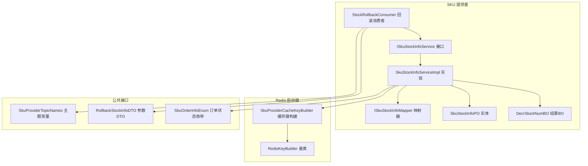
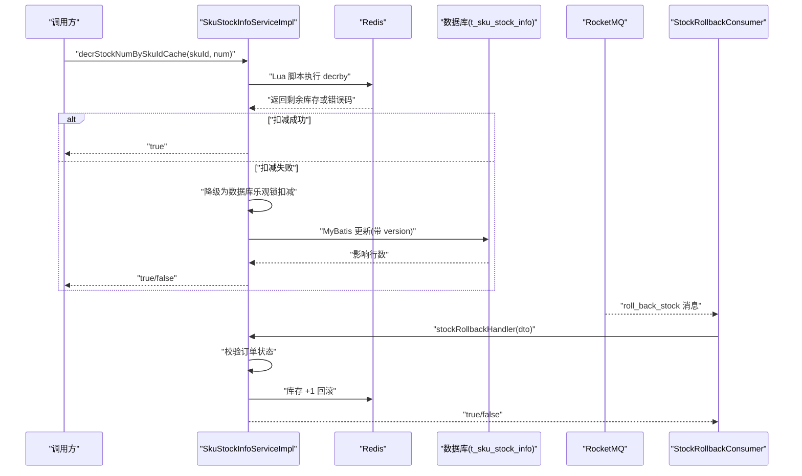
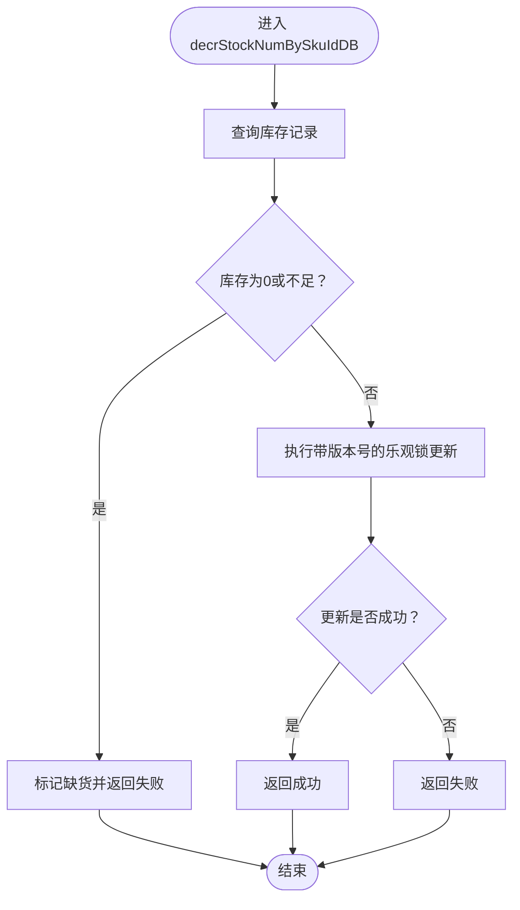
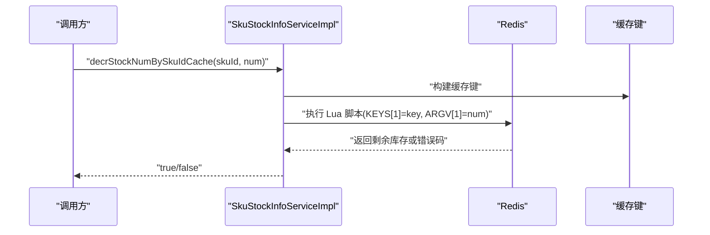
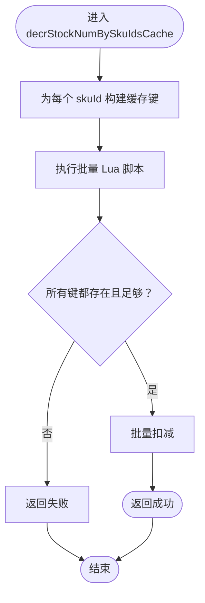
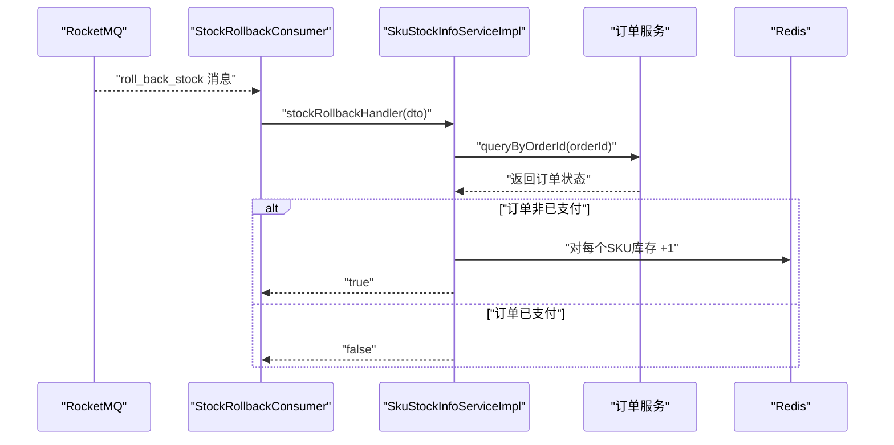
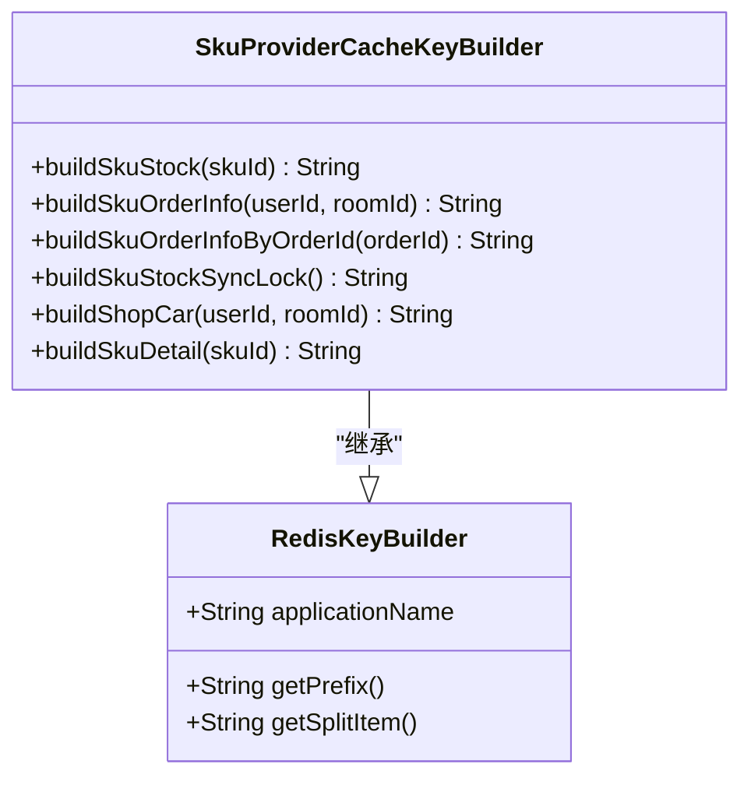
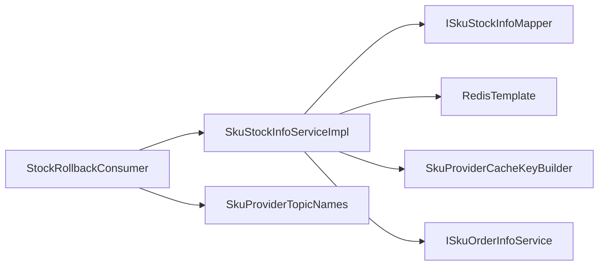

# 库存管理系统

<cite>
**本文引用的文件**
- [SkuStockInfoServiceImpl.java](file://live-sku-provider/src/main/java/com/logilong/live/sku/provider/service/impl/SkuStockInfoServiceImpl.java)
- [ISkuStockInfoService.java](file://live-sku-provider/src/main/java/com/logilong/live/sku/provider/service/ISkuStockInfoService.java)
- [ISkuStockInfoMapper.java](file://live-sku-provider/src/main/java/com/logilong/live/sku/provider/dao/mapper/ISkuStockInfoMapper.java)
- [SkuStockInfoPO.java](file://live-sku-provider/src/main/java/com/logilong/live/sku/provider/dao/po/SkuStockInfoPO.java)
- [DecrStockNumBO.java](file://live-sku-provider/src/main/java/com/logilong/live/sku/provider/service/bo/DecrStockNumBO.java)
- [SkuProviderCacheKeyBuilder.java](file://live-framework/live-framework-redis-starter/src/main/java/com/logilong/live/framework/redis/starter/key/SkuProviderCacheKeyBuilder.java)
- [RedisKeyBuilder.java](file://live-framework/live-framework-redis-starter/src/main/java/com/logilong/live/framework/redis/starter/key/RedisKeyBuilder.java)
- [StockRollbackConsumer.java](file://live-sku-provider/src/main/java/com/logilong/live/sku/provider/consumer/StockRollbackConsumer.java)
- [SkuProviderTopicNames.java](file://live-common-interface/src/main/java/com/logilong/live/common/interfaces/topic/SkuProviderTopicNames.java)
- [RollbackStockInfoDTO.java](file://live-sku-interface/src/main/java/com/logilong/live/sku/dto/RollbackStockInfoDTO.java)
- [SkuOrderInfoEnum.java](file://live-sku-interface/src/main/java/com/logilong/live/sku/constants/SkuOrderInfoEnum.java)
</cite>

## 目录
1. [简介](#简介)
2. [项目结构](#项目结构)
3. [核心组件](#核心组件)
4. [架构总览](#架构总览)
5. [详细组件分析](#详细组件分析)
6. [依赖关系分析](#依赖关系分析)
7. [性能考量](#性能考量)
8. [故障排查指南](#故障排查指南)
9. [结论](#结论)
10. [附录](#附录)

## 简介
本文件系统性阐述库存管理服务（SkuStockInfoService）的双重扣减机制与超卖防控策略，覆盖：
- 基于数据库的扣减实现（decrStockNumBySkuIdDB），包含乐观锁（version 字段）与 MyBatis 自定义 SQL 更新。
- 基于 Redis 的高性能扣减方案（decrStockNumBySkuIdCache、decrStockNumBySkuIdsCache），深入说明使用 Lua 脚本保证原子性的原理，防止高并发下的超卖问题。
- 库存回滚机制（stockRollbackHandler），通过 RocketMQ 消息触发，检查订单状态后回滚 Redis 库存。
- DecrStockNumBO 业务对象在扣减结果传递中的作用。
- 库存缓存键（SkuProviderCacheKeyBuilder.buildSkuStock）的设计。

## 项目结构
围绕库存管理的关键模块与文件如下：
- 接口层：ISkuStockInfoService 定义库存扣减、查询、回滚等能力。
- 实现层：SkuStockInfoServiceImpl 提供具体实现，含数据库与 Redis 双重扣减、Lua 原子脚本、回滚处理。
- 数据访问层：ISkuStockInfoMapper 定义基于 MyBatis 的乐观锁更新 SQL。
- 数据模型：SkuStockInfoPO 包含库存与版本号字段。
- 缓存键构建：SkuProviderCacheKeyBuilder 生成 Redis 键前缀与 SKU 库存键。
- 回滚消费者：StockRollbackConsumer 订阅 RocketMQ 主题，触发回滚处理。
- DTO/枚举：RollbackStockInfoDTO、SkuOrderInfoEnum 用于回滚参数与订单状态判断。

图表来源
- [ISkuStockInfoService.java](file://live-sku-provider/src/main/java/com/logilong/live/sku/provider/service/ISkuStockInfoService.java#L1-L49)
- [SkuStockInfoServiceImpl.java](file://live-sku-provider/src/main/java/com/logilong/live/sku/provider/service/impl/SkuStockInfoServiceImpl.java#L1-L151)
- [ISkuStockInfoMapper.java](file://live-sku-provider/src/main/java/com/logilong/live/sku/provider/dao/mapper/ISkuStockInfoMapper.java#L1-L18)
- [SkuStockInfoPO.java](file://live-sku-provider/src/main/java/com/logilong/live/sku/provider/dao/po/SkuStockInfoPO.java#L1-L22)
- [DecrStockNumBO.java](file://live-sku-provider/src/main/java/com/logilong/live/sku/provider/service/bo/DecrStockNumBO.java#L1-L17)
- [SkuProviderCacheKeyBuilder.java](file://live-framework/live-framework-redis-starter/src/main/java/com/logilong/live/framework/redis/starter/key/SkuProviderCacheKeyBuilder.java#L1-L41)
- [RedisKeyBuilder.java](file://live-framework/live-framework-redis-starter/src/main/java/com/logilong/live/framework/redis/starter/key/RedisKeyBuilder.java#L1-L22)
- [StockRollbackConsumer.java](file://live-sku-provider/src/main/java/com/logilong/live/sku/provider/consumer/StockRollbackConsumer.java#L1-L51)
- [SkuProviderTopicNames.java](file://live-common-interface/src/main/java/com/logilong/live/common/interfaces/topic/SkuProviderTopicNames.java#L1-L11)
- [RollbackStockInfoDTO.java](file://live-sku-interface/src/main/java/com/logilong/live/sku/dto/RollbackStockInfoDTO.java#L1-L17)
- [SkuOrderInfoEnum.java](file://live-sku-interface/src/main/java/com/logilong/live/sku/constants/SkuOrderInfoEnum.java#L1-L18)

章节来源
- [ISkuStockInfoService.java](file://live-sku-provider/src/main/java/com/logilong/live/sku/provider/service/ISkuStockInfoService.java#L1-L49)
- [SkuStockInfoServiceImpl.java](file://live-sku-provider/src/main/java/com/logilong/live/sku/provider/service/impl/SkuStockInfoServiceImpl.java#L1-L151)
- [ISkuStockInfoMapper.java](file://live-sku-provider/src/main/java/com/logilong/live/sku/provider/dao/mapper/ISkuStockInfoMapper.java#L1-L18)
- [SkuStockInfoPO.java](file://live-sku-provider/src/main/java/com/logilong/live/sku/provider/dao/po/SkuStockInfoPO.java#L1-L22)
- [SkuProviderCacheKeyBuilder.java](file://live-framework/live-framework-redis-starter/src/main/java/com/logilong/live/framework/redis/starter/key/SkuProviderCacheKeyBuilder.java#L1-L41)
- [RedisKeyBuilder.java](file://live-framework/live-framework-redis-starter/src/main/java/com/logilong/live/framework/redis/starter/key/RedisKeyBuilder.java#L1-L22)
- [StockRollbackConsumer.java](file://live-sku-provider/src/main/java/com/logilong/live/sku/provider/consumer/StockRollbackConsumer.java#L1-L51)
- [SkuProviderTopicNames.java](file://live-common-interface/src/main/java/com/logilong/live/common/interfaces/topic/SkuProviderTopicNames.java#L1-L11)
- [RollbackStockInfoDTO.java](file://live-sku-interface/src/main/java/com/logilong/live/sku/dto/RollbackStockInfoDTO.java#L1-L17)
- [SkuOrderInfoEnum.java](file://live-sku-interface/src/main/java/com/logilong/live/sku/constants/SkuOrderInfoEnum.java#L1-L18)

## 核心组件
- ISkuStockInfoService：定义库存查询、更新、双通道扣减与回滚处理的契约。
- SkuStockInfoServiceImpl：实现接口，提供数据库与 Redis 双重扣减、Lua 原子脚本执行、回滚处理。
- ISkuStockInfoMapper：基于 MyBatis 的乐观锁更新 SQL，确保并发安全。
- SkuStockInfoPO：库存实体，包含版本号字段以支持乐观锁。
- DecrStockNumBO：封装数据库扣减结果（是否成功、是否缺货）。
- SkuProviderCacheKeyBuilder：统一构建 Redis 缓存键，避免硬编码。
- StockRollbackConsumer：订阅 RocketMQ 回滚主题，触发回滚处理。
- RollbackStockInfoDTO：回滚参数载体。
- SkuOrderInfoEnum：订单状态枚举，用于回滚前置条件判断。

章节来源
- [ISkuStockInfoService.java](file://live-sku-provider/src/main/java/com/logilong/live/sku/provider/service/ISkuStockInfoService.java#L1-L49)
- [SkuStockInfoServiceImpl.java](file://live-sku-provider/src/main/java/com/logilong/live/sku/provider/service/impl/SkuStockInfoServiceImpl.java#L1-L151)
- [ISkuStockInfoMapper.java](file://live-sku-provider/src/main/java/com/logilong/live/sku/provider/dao/mapper/ISkuStockInfoMapper.java#L1-L18)
- [SkuStockInfoPO.java](file://live-sku-provider/src/main/java/com/logilong/live/sku/provider/dao/po/SkuStockInfoPO.java#L1-L22)
- [DecrStockNumBO.java](file://live-sku-provider/src/main/java/com/logilong/live/sku/provider/service/bo/DecrStockNumBO.java#L1-L17)
- [SkuProviderCacheKeyBuilder.java](file://live-framework/live-framework-redis-starter/src/main/java/com/logilong/live/framework/redis/starter/key/SkuProviderCacheKeyBuilder.java#L1-L41)
- [StockRollbackConsumer.java](file://live-sku-provider/src/main/java/com/logilong/live/sku/provider/consumer/StockRollbackConsumer.java#L1-L51)
- [RollbackStockInfoDTO.java](file://live-sku-interface/src/main/java/com/logilong/live/sku/dto/RollbackStockInfoDTO.java#L1-L17)
- [SkuOrderInfoEnum.java](file://live-sku-interface/src/main/java/com/logilong/live/sku/constants/SkuOrderInfoEnum.java#L1-L18)

## 架构总览
库存管理采用“数据库+Redis”的双重扣减策略：
- 高并发场景优先走 Redis 扣减，使用 Lua 脚本保证原子性，避免超卖。
- 当 Redis 扣减失败或需要强一致时，回退至数据库乐观锁扣减。
- 订单超时未支付或异常场景通过 RocketMQ 触发库存回滚，确保最终一致性。

图表来源
- [SkuStockInfoServiceImpl.java](file://live-sku-provider/src/main/java/com/logilong/live/sku/provider/service/impl/SkuStockInfoServiceImpl.java#L1-L151)
- [ISkuStockInfoMapper.java](file://live-sku-provider/src/main/java/com/logilong/live/sku/provider/dao/mapper/ISkuStockInfoMapper.java#L1-L18)
- [StockRollbackConsumer.java](file://live-sku-provider/src/main/java/com/logilong/live/sku/provider/consumer/StockRollbackConsumer.java#L1-L51)
- [SkuProviderTopicNames.java](file://live-common-interface/src/main/java/com/logilong/live/common/interfaces/topic/SkuProviderTopicNames.java#L1-L11)

## 详细组件分析

### 基于数据库的扣减实现（decrStockNumBySkuIdDB）
- 查询与预检：先按 skuId 查询库存记录，若库存为 0 或不足则直接标记缺货并返回失败。
- 乐观锁更新：若可扣减，则构造带版本号的 SQL，仅当版本匹配且库存足够时才更新，避免并发写入导致的数据不一致。
- 结果封装：通过 DecrStockNumBO 返回是否成功与是否缺货，便于上层决策。

图表来源
- [SkuStockInfoServiceImpl.java](file://live-sku-provider/src/main/java/com/logilong/live/sku/provider/service/impl/SkuStockInfoServiceImpl.java#L87-L100)
- [ISkuStockInfoMapper.java](file://live-sku-provider/src/main/java/com/logilong/live/sku/provider/dao/mapper/ISkuStockInfoMapper.java#L12-L17)
- [SkuStockInfoPO.java](file://live-sku-provider/src/main/java/com/logilong/live/sku/provider/dao/po/SkuStockInfoPO.java#L1-L22)
- [DecrStockNumBO.java](file://live-sku-provider/src/main/java/com/logilong/live/sku/provider/service/bo/DecrStockNumBO.java#L1-L17)

章节来源
- [SkuStockInfoServiceImpl.java](file://live-sku-provider/src/main/java/com/logilong/live/sku/provider/service/impl/SkuStockInfoServiceImpl.java#L87-L100)
- [ISkuStockInfoMapper.java](file://live-sku-provider/src/main/java/com/logilong/live/sku/provider/dao/mapper/ISkuStockInfoMapper.java#L12-L17)
- [SkuStockInfoPO.java](file://live-sku-provider/src/main/java/com/logilong/live/sku/provider/dao/po/SkuStockInfoPO.java#L1-L22)
- [DecrStockNumBO.java](file://live-sku-provider/src/main/java/com/logilong/live/sku/provider/service/bo/DecrStockNumBO.java#L1-L17)

### 基于 Redis 的高性能扣减方案（decrStockNumBySkuIdCache）
- 原子性保障：使用 Lua 脚本一次性完成“存在性检查 + 剩余判断 + 扣减”，避免多网络往返引发的竞争条件。
- 超卖防控：脚本在执行期间持有键，同一时刻只有一个客户端能修改该键，天然防超卖。
- 错误处理：当库存不存在或不足时返回特定错误码，上层据此降级到数据库扣减。

图表来源
- [SkuStockInfoServiceImpl.java](file://live-sku-provider/src/main/java/com/logilong/live/sku/provider/service/impl/SkuStockInfoServiceImpl.java#L102-L113)
- [SkuProviderCacheKeyBuilder.java](file://live-framework/live-framework-redis-starter/src/main/java/com/logilong/live/framework/redis/starter/key/SkuProviderCacheKeyBuilder.java#L29-L31)
- [RedisKeyBuilder.java](file://live-framework/live-framework-redis-starter/src/main/java/com/logilong/live/framework/redis/starter/key/RedisKeyBuilder.java#L19-L21)

章节来源
- [SkuStockInfoServiceImpl.java](file://live-sku-provider/src/main/java/com/logilong/live/sku/provider/service/impl/SkuStockInfoServiceImpl.java#L102-L113)
- [SkuProviderCacheKeyBuilder.java](file://live-framework/live-framework-redis-starter/src/main/java/com/logilong/live/framework/redis/starter/key/SkuProviderCacheKeyBuilder.java#L29-L31)
- [RedisKeyBuilder.java](file://live-framework/live-framework-redis-starter/src/main/java/com/logilong/live/framework/redis/starter/key/RedisKeyBuilder.java#L19-L21)

### 批量扣减库存（decrStockNumBySkuIdsCache）
- 优化点：批量 Lua 脚本对多个 SKU 同时进行存在性与剩余判断，随后统一扣减，减少多次网络往返。
- 适用场景：订单中包含多 SKU，需整体原子性扣减，避免部分扣减导致的不一致。

图表来源
- [SkuStockInfoServiceImpl.java](file://live-sku-provider/src/main/java/com/logilong/live/sku/provider/service/impl/SkuStockInfoServiceImpl.java#L115-L129)
- [SkuProviderCacheKeyBuilder.java](file://live-framework/live-framework-redis-starter/src/main/java/com/logilong/live/framework/redis/starter/key/SkuProviderCacheKeyBuilder.java#L29-L31)
- [RedisKeyBuilder.java](file://live-framework/live-framework-redis-starter/src/main/java/com/logilong/live/framework/redis/starter/key/RedisKeyBuilder.java#L19-L21)

章节来源
- [SkuStockInfoServiceImpl.java](file://live-sku-provider/src/main/java/com/logilong/live/sku/provider/service/impl/SkuStockInfoServiceImpl.java#L115-L129)
- [SkuProviderCacheKeyBuilder.java](file://live-framework/live-framework-redis-starter/src/main/java/com/logilong/live/framework/redis/starter/key/SkuProviderCacheKeyBuilder.java#L29-L31)
- [RedisKeyBuilder.java](file://live-framework/live-framework-redis-starter/src/main/java/com/logilong/live/framework/redis/starter/key/RedisKeyBuilder.java#L19-L21)

### 库存回滚机制（stockRollbackHandler）
- 触发来源：RocketMQ 主题 roll_back_stock，由 StockRollbackConsumer 订阅并消费。
- 回滚前置条件：读取订单状态，若订单仍处于“待支付”状态，则执行回滚；否则拒绝回滚。
- 回滚动作：将对应 SKU 的 Redis 库存 +1，恢复可用库存。
- 幂等性：通过订单状态判断避免重复回滚。

图表来源
- [StockRollbackConsumer.java](file://live-sku-provider/src/main/java/com/logilong/live/sku/provider/consumer/StockRollbackConsumer.java#L1-L51)
- [SkuProviderTopicNames.java](file://live-common-interface/src/main/java/com/logilong/live/common/interfaces/topic/SkuProviderTopicNames.java#L1-L11)
- [SkuStockInfoServiceImpl.java](file://live-sku-provider/src/main/java/com/logilong/live/sku/provider/service/impl/SkuStockInfoServiceImpl.java#L132-L149)
- [SkuOrderInfoEnum.java](file://live-sku-interface/src/main/java/com/logilong/live/sku/constants/SkuOrderInfoEnum.java#L1-L18)
- [RollbackStockInfoDTO.java](file://live-sku-interface/src/main/java/com/logilong/live/sku/dto/RollbackStockInfoDTO.java#L1-L17)

章节来源
- [StockRollbackConsumer.java](file://live-sku-provider/src/main/java/com/logilong/live/sku/provider/consumer/StockRollbackConsumer.java#L1-L51)
- [SkuProviderTopicNames.java](file://live-common-interface/src/main/java/com/logilong/live/common/interfaces/topic/SkuProviderTopicNames.java#L1-L11)
- [SkuStockInfoServiceImpl.java](file://live-sku-provider/src/main/java/com/logilong/live/sku/provider/service/impl/SkuStockInfoServiceImpl.java#L132-L149)
- [SkuOrderInfoEnum.java](file://live-sku-interface/src/main/java/com/logilong/live/sku/constants/SkuOrderInfoEnum.java#L1-L18)
- [RollbackStockInfoDTO.java](file://live-sku-interface/src/main/java/com/logilong/live/sku/dto/RollbackStockInfoDTO.java#L1-L17)

### DecrStockNumBO 业务对象的作用
- 用途：封装数据库扣减的结果，包含 isSuccess（是否成功）与 isEmptyStock（是否缺货）两个布尔标志。
- 价值：使上层在 Redis 扣减失败时，能够快速判断是否需要降级到数据库扣减，并据此做进一步处理。

章节来源
- [DecrStockNumBO.java](file://live-sku-provider/src/main/java/com/logilong/live/sku/provider/service/bo/DecrStockNumBO.java#L1-L17)
- [SkuStockInfoServiceImpl.java](file://live-sku-provider/src/main/java/com/logilong/live/sku/provider/service/impl/SkuStockInfoServiceImpl.java#L87-L100)

### 库存缓存键设计（SkuProviderCacheKeyBuilder.buildSkuStock）
- 设计原则：统一前缀（应用名 + 冒号）与分隔符（冒号），避免键冲突；SKU 库存键格式为“应用名:sku_stock:skuId”。
- 使用方式：在 Redis 扣减与回滚时均通过该方法生成键，保证键的一致性与可维护性。

图表来源
- [RedisKeyBuilder.java](file://live-framework/live-framework-redis-starter/src/main/java/com/logilong/live/framework/redis/starter/key/RedisKeyBuilder.java#L1-L22)
- [SkuProviderCacheKeyBuilder.java](file://live-framework/live-framework-redis-starter/src/main/java/com/logilong/live/framework/redis/starter/key/SkuProviderCacheKeyBuilder.java#L1-L41)

章节来源
- [RedisKeyBuilder.java](file://live-framework/live-framework-redis-starter/src/main/java/com/logilong/live/framework/redis/starter/key/RedisKeyBuilder.java#L1-L22)
- [SkuProviderCacheKeyBuilder.java](file://live-framework/live-framework-redis-starter/src/main/java/com/logilong/live/framework/redis/starter/key/SkuProviderCacheKeyBuilder.java#L1-L41)

## 依赖关系分析
- 组件耦合：
  - SkuStockInfoServiceImpl 依赖 ISkuStockInfoMapper、RedisTemplate、SkuProviderCacheKeyBuilder、ISkuOrderInfoService。
  - 回滚消费者依赖 RocketMQ 配置与 ISkuStockInfoService。
- 外部依赖：
  - MyBatis 乐观锁更新 SQL。
  - Redis Lua 脚本执行。
  - RocketMQ 消费与主题命名。

图表来源
- [SkuStockInfoServiceImpl.java](file://live-sku-provider/src/main/java/com/logilong/live/sku/provider/service/impl/SkuStockInfoServiceImpl.java#L1-L151)
- [ISkuStockInfoMapper.java](file://live-sku-provider/src/main/java/com/logilong/live/sku/provider/dao/mapper/ISkuStockInfoMapper.java#L1-L18)
- [SkuProviderCacheKeyBuilder.java](file://live-framework/live-framework-redis-starter/src/main/java/com/logilong/live/framework/redis/starter/key/SkuProviderCacheKeyBuilder.java#L1-L41)
- [StockRollbackConsumer.java](file://live-sku-provider/src/main/java/com/logilong/live/sku/provider/consumer/StockRollbackConsumer.java#L1-L51)
- [SkuProviderTopicNames.java](file://live-common-interface/src/main/java/com/logilong/live/common/interfaces/topic/SkuProviderTopicNames.java#L1-L11)

章节来源
- [SkuStockInfoServiceImpl.java](file://live-sku-provider/src/main/java/com/logilong/live/sku/provider/service/impl/SkuStockInfoServiceImpl.java#L1-L151)
- [ISkuStockInfoMapper.java](file://live-sku-provider/src/main/java/com/logilong/live/sku/provider/dao/mapper/ISkuStockInfoMapper.java#L1-L18)
- [SkuProviderCacheKeyBuilder.java](file://live-framework/live-framework-redis-starter/src/main/java/com/logilong/live/framework/redis/starter/key/SkuProviderCacheKeyBuilder.java#L1-L41)
- [StockRollbackConsumer.java](file://live-sku-provider/src/main/java/com/logilong/live/sku/provider/consumer/StockRollbackConsumer.java#L1-L51)
- [SkuProviderTopicNames.java](file://live-common-interface/src/main/java/com/logilong/live/common/interfaces/topic/SkuProviderTopicNames.java#L1-L11)

## 性能考量
- Redis 扣减优先：Lua 原子脚本减少网络往返与竞争，适合高并发场景。
- 降级策略：Redis 扣减失败时回退数据库乐观锁，兼顾一致性与可用性。
- 批量优化：批量 Lua 脚本对多 SKU 做整体原子性扣减，降低延迟。
- 回滚幂等：通过订单状态判断避免重复回滚，减少无效操作。

## 故障排查指南
- Redis 扣减失败：
  - 检查 Lua 脚本是否正确加载与执行。
  - 核对缓存键是否与构建规则一致。
- 数据库扣减失败：
  - 检查版本号是否被其他事务更新。
  - 确认 SQL 中的版本条件是否生效。
- 回滚未生效：
  - 确认 RocketMQ 主题名称与消费者组配置。
  - 检查订单状态是否为“待支付”，否则不会回滚。
- 超卖现象：
  - 确认 Redis 扣减路径是否被绕过。
  - 检查批量扣减脚本的键列表是否完整。

章节来源
- [SkuStockInfoServiceImpl.java](file://live-sku-provider/src/main/java/com/logilong/live/sku/provider/service/impl/SkuStockInfoServiceImpl.java#L102-L149)
- [ISkuStockInfoMapper.java](file://live-sku-provider/src/main/java/com/logilong/live/sku/provider/dao/mapper/ISkuStockInfoMapper.java#L12-L17)
- [StockRollbackConsumer.java](file://live-sku-provider/src/main/java/com/logilong/live/sku/provider/consumer/StockRollbackConsumer.java#L1-L51)
- [SkuProviderTopicNames.java](file://live-common-interface/src/main/java/com/logilong/live/common/interfaces/topic/SkuProviderTopicNames.java#L1-L11)
- [SkuOrderInfoEnum.java](file://live-sku-interface/src/main/java/com/logilong/live/sku/constants/SkuOrderInfoEnum.java#L1-L18)

## 结论
本库存管理方案通过“Redis 原子扣减 + 数据库乐观锁 + RocketMQ 回滚”的组合，实现了高并发下的超卖防控与最终一致性：
- Redis 路径提供高性能与低延迟，Lua 脚本保证原子性。
- 数据库路径作为兜底，确保强一致。
- 回滚链路通过消息驱动，结合订单状态判断，避免误回滚。
- 统一的缓存键构建与 BO 对象，提升了可维护性与扩展性。

## 附录
- 关键实现位置参考：
  - 数据库扣减入口：[decrStockNumBySkuIdDB](file://live-sku-provider/src/main/java/com/logilong/live/sku/provider/service/impl/SkuStockInfoServiceImpl.java#L87-L100)
  - Redis 单 SKU 扣减：[decrStockNumBySkuIdCache](file://live-sku-provider/src/main/java/com/logilong/live/sku/provider/service/impl/SkuStockInfoServiceImpl.java#L102-L113)
  - Redis 批量扣减：[decrStockNumBySkuIdsCache](file://live-sku-provider/src/main/java/com/logilong/live/sku/provider/service/impl/SkuStockInfoServiceImpl.java#L115-L129)
  - 回滚处理入口：[stockRollbackHandler](file://live-sku-provider/src/main/java/com/logilong/live/sku/provider/service/impl/SkuStockInfoServiceImpl.java#L132-L149)
  - 回滚消费者订阅：[StockRollbackConsumer](file://live-sku-provider/src/main/java/com/logilong/live/sku/provider/consumer/StockRollbackConsumer.java#L1-L51)
  - 缓存键构建：[SkuProviderCacheKeyBuilder.buildSkuStock](file://live-framework/live-framework-redis-starter/src/main/java/com/logilong/live/framework/redis/starter/key/SkuProviderCacheKeyBuilder.java#L29-L31)