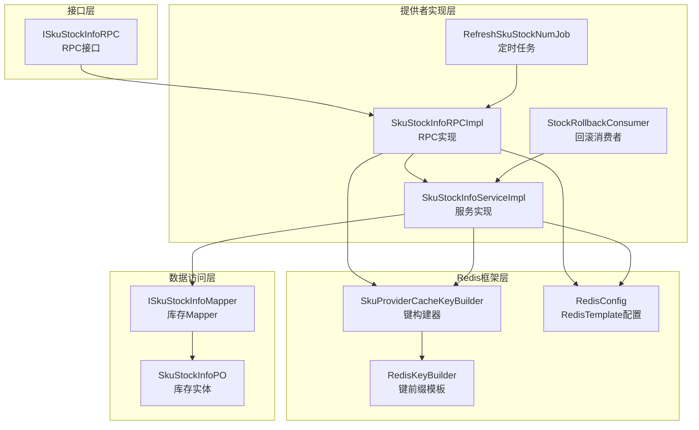
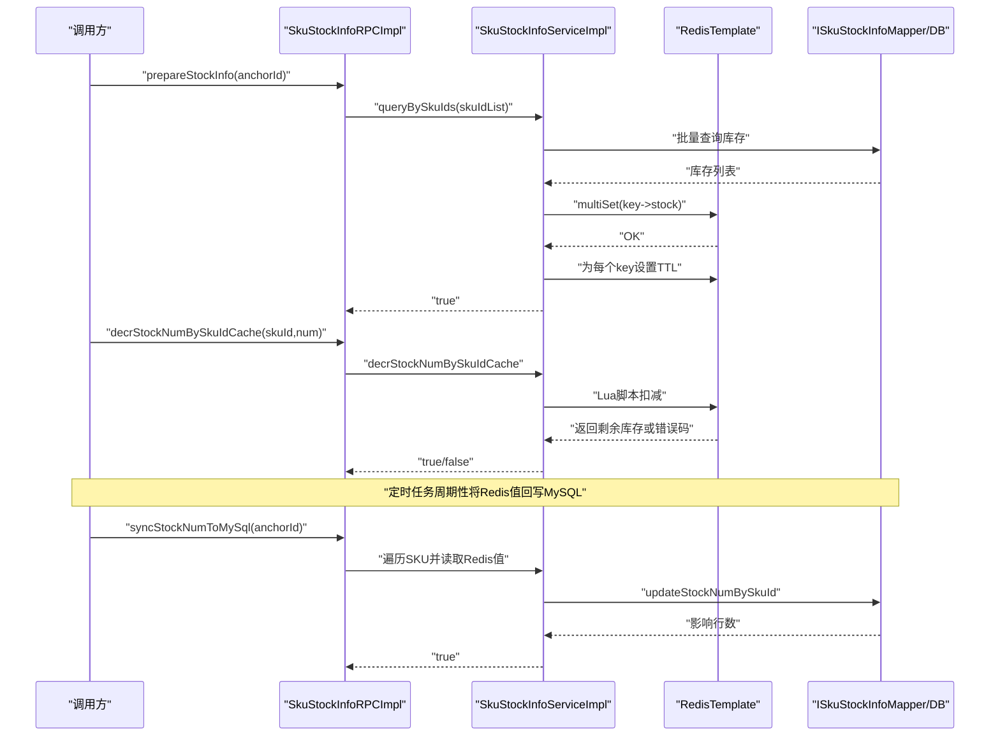
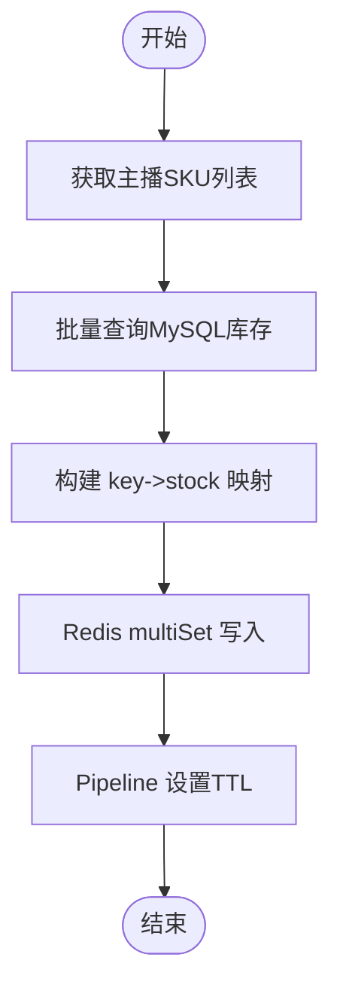
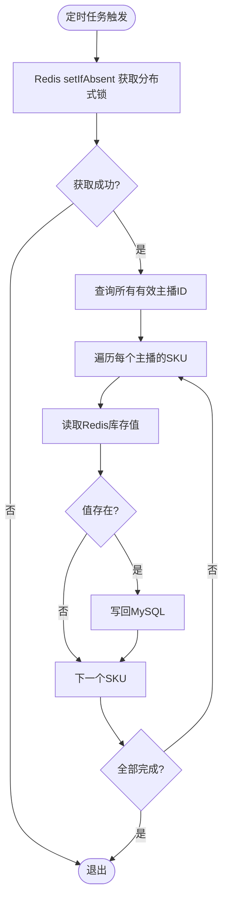
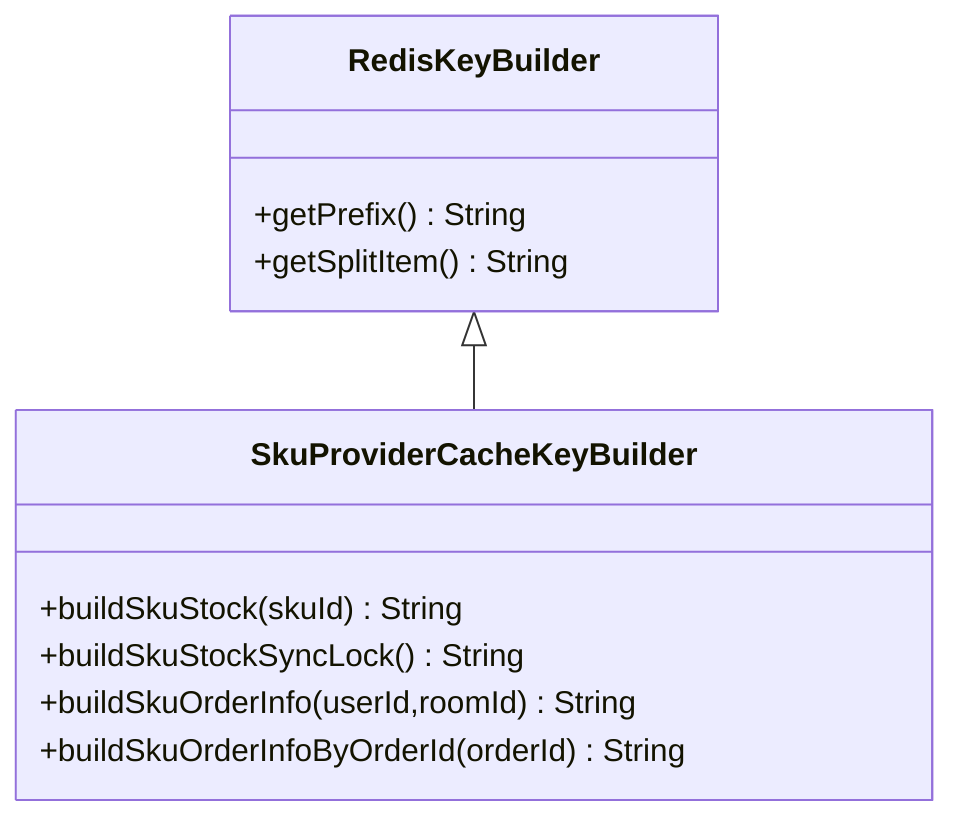
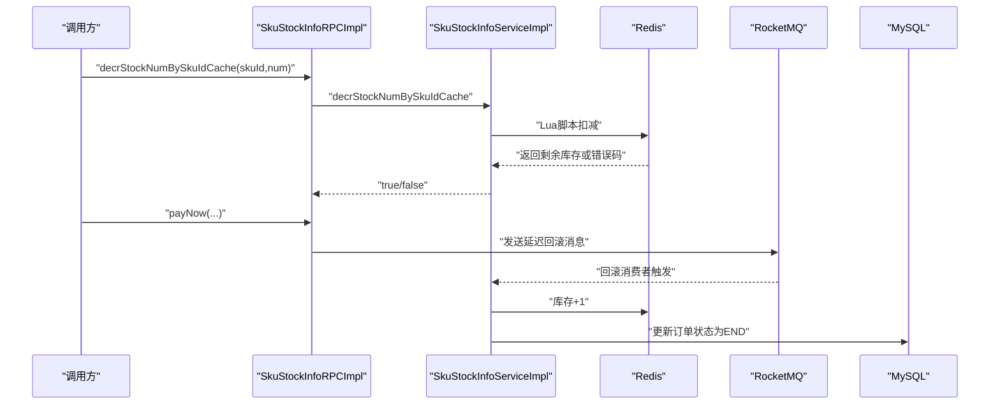
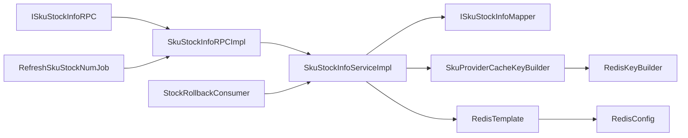

# 数据一致性保障

<cite>
**本文引用的文件**
- [ISkuStockInfoRPC.java](file://live-sku-interface/src/main/java/com/logilong/live/sku/interfaces/ISkuStockInfoRPC.java)
- [SkuStockInfoRPCImpl.java](file://live-sku-provider/src/main/java/com/logilong/live/sku/provider/rpc/SkuStockInfoRPCImpl.java)
- [ISkuStockInfoService.java](file://live-sku-provider/src/main/java/com/logilong/live/sku/provider/service/ISkuStockInfoService.java)
- [SkuStockInfoServiceImpl.java](file://live-sku-provider/src/main/java/com/logilong/live/sku/provider/service/impl/SkuStockInfoServiceImpl.java)
- [RefreshSkuStockNumJob.java](file://live-sku-provider/src/main/java/com/logilong/live/sku/provider/config/RefreshSkuStockNumJob.java)
- [SkuProviderCacheKeyBuilder.java](file://live-framework/live-framework-redis-starter/src/main/java/com/logilong/live/framework/redis/starter/key/SkuProviderCacheKeyBuilder.java)
- [RedisKeyBuilder.java](file://live-framework/live-framework-redis-starter/src/main/java/com/logilong/live/framework/redis/starter/key/RedisKeyBuilder.java)
- [RedisConfig.java](file://live-framework/live-framework-redis-starter/src/main/java/com/logilong/live/framework/redis/starter/config/RedisConfig.java)
- [ISkuStockInfoMapper.java](file://live-sku-provider/src/main/java/com/logilong/live/sku/provider/dao/mapper/ISkuStockInfoMapper.java)
- [SkuStockInfoPO.java](file://live-sku-provider/src/main/java/com/logilong/live/sku/provider/dao/po/SkuStockInfoPO.java)
- [IAnchorShopInfoService.java](file://live-sku-provider/src/main/java/com/logilong/live/sku/provider/service/IAnchorShopInfoService.java)
- [StockRollbackConsumer.java](file://live-sku-provider/src/main/java/com/logilong/live/sku/provider/consumer/StockRollbackConsumer.java)
- [SkuOrderInfoRPCImpl.java](file://live-sku-provider/src/main/java/com/logilong/live/sku/provider/rpc/SkuOrderInfoRPCImpl.java)
- [RollbackStockInfoDTO.java](file://live-sku-interface/src/main/java/com/logilong/live/sku/dto/RollbackStockInfoDTO.java)
</cite>

## 目录
1. [引言](#引言)
2. [项目结构](#项目结构)
3. [核心组件](#核心组件)
4. [架构总览](#架构总览)
5. [详细组件分析](#详细组件分析)
6. [依赖关系分析](#依赖关系分析)
7. [性能考量](#性能考量)
8. [故障排查指南](#故障排查指南)
9. [结论](#结论)

## 引言
本文件聚焦于库存系统中“缓存与数据库的数据一致性保障机制”。围绕以下目标展开：
- 预热库存（prepareStockInfo）的实现：如何通过批量将数据库库存加载到Redis，提升首次访问命中率并降低DB压力。
- 定时同步（syncStockNumToMySql）策略：通过定时任务将Redis中的库存变更持久化到MySQL，确保最终一致性。
- 缓存键设计（SkuProviderCacheKeyBuilder）：如何通过规范化的键空间设计支撑高效的数据同步与过期管理。
- 高并发下的同步频率与锁机制：如何在分布式部署下避免重复执行、减少竞争，并以合理频率达成最终一致。

## 项目结构
库存相关能力主要分布在以下模块：
- 接口层：定义对外RPC接口，包括预热、查询、扣减、同步等能力。
- 提供者实现层：具体业务逻辑，包含RPC实现、服务实现、定时任务、消费者等。
- Redis框架层：统一的键构建器与Redis配置，确保键命名规范与序列化一致。
- 数据访问层：MyBatis Mapper与实体类，承载库存数据的持久化。

图表来源
- [ISkuStockInfoRPC.java](file://live-sku-interface/src/main/java/com/logilong/live/sku/interfaces/ISkuStockInfoRPC.java#L1-L44)
- [SkuStockInfoRPCImpl.java](file://live-sku-provider/src/main/java/com/logilong/live/sku/provider/rpc/SkuStockInfoRPCImpl.java#L1-L103)
- [SkuStockInfoServiceImpl.java](file://live-sku-provider/src/main/java/com/logilong/live/sku/provider/service/impl/SkuStockInfoServiceImpl.java#L1-L150)
- [RefreshSkuStockNumJob.java](file://live-sku-provider/src/main/java/com/logilong/live/sku/provider/config/RefreshSkuStockNumJob.java#L1-L65)
- [StockRollbackConsumer.java](file://live-sku-provider/src/main/java/com/logilong/live/sku/provider/consumer/StockRollbackConsumer.java#L1-L52)
- [SkuProviderCacheKeyBuilder.java](file://live-framework/live-framework-redis-starter/src/main/java/com/logilong/live/framework/redis/starter/key/SkuProviderCacheKeyBuilder.java#L1-L32)
- [RedisKeyBuilder.java](file://live-framework/live-framework-redis-starter/src/main/java/com/logilong/live/framework/redis/starter/key/RedisKeyBuilder.java#L1-L22)
- [RedisConfig.java](file://live-framework/live-framework-redis-starter/src/main/java/com/logilong/live/framework/redis/starter/config/RedisConfig.java#L1-L28)
- [ISkuStockInfoMapper.java](file://live-sku-provider/src/main/java/com/logilong/live/sku/provider/dao/mapper/ISkuStockInfoMapper.java#L1-L18)
- [SkuStockInfoPO.java](file://live-sku-provider/src/main/java/com/logilong/live/sku/provider/dao/po/SkuStockInfoPO.java#L1-L21)

章节来源
- [ISkuStockInfoRPC.java](file://live-sku-interface/src/main/java/com/logilong/live/sku/interfaces/ISkuStockInfoRPC.java#L1-L44)
- [SkuStockInfoRPCImpl.java](file://live-sku-provider/src/main/java/com/logilong/live/sku/provider/rpc/SkuStockInfoRPCImpl.java#L1-L103)
- [SkuStockInfoServiceImpl.java](file://live-sku-provider/src/main/java/com/logilong/live/sku/provider/service/impl/SkuStockInfoServiceImpl.java#L1-L150)
- [RefreshSkuStockNumJob.java](file://live-sku-provider/src/main/java/com/logilong/live/sku/provider/config/RefreshSkuStockNumJob.java#L1-L65)
- [SkuProviderCacheKeyBuilder.java](file://live-framework/live-framework-redis-starter/src/main/java/com/logilong/live/framework/redis/starter/key/SkuProviderCacheKeyBuilder.java#L1-L32)
- [RedisKeyBuilder.java](file://live-framework/live-framework-redis-starter/src/main/java/com/logilong/live/framework/redis/starter/key/RedisKeyBuilder.java#L1-L22)
- [RedisConfig.java](file://live-framework/live-framework-redis-starter/src/main/java/com/logilong/live/framework/redis/starter/config/RedisConfig.java#L1-L28)
- [ISkuStockInfoMapper.java](file://live-sku-provider/src/main/java/com/logilong/live/sku/provider/dao/mapper/ISkuStockInfoMapper.java#L1-L18)
- [SkuStockInfoPO.java](file://live-sku-provider/src/main/java/com/logilong/live/sku/provider/dao/po/SkuStockInfoPO.java#L1-L21)
- [IAnchorShopInfoService.java](file://live-sku-provider/src/main/java/com/logilong/live/sku/provider/service/IAnchorShopInfoService.java#L1-L17)
- [StockRollbackConsumer.java](file://live-sku-provider/src/main/java/com/logilong/live/sku/provider/consumer/StockRollbackConsumer.java#L1-L52)
- [SkuOrderInfoRPCImpl.java](file://live-sku-provider/src/main/java/com/logilong/live/sku/provider/rpc/SkuOrderInfoRPCImpl.java#L154-L180)
- [RollbackStockInfoDTO.java](file://live-sku-interface/src/main/java/com/logilong/live/sku/dto/RollbackStockInfoDTO.java#L1-L16)

## 核心组件
- RPC接口与实现：负责对外暴露库存能力，包括预热、查询、扣减、同步等。
- 服务实现：封装Redis与DB交互、Lua脚本扣减、回滚处理等。
- 定时任务：周期性地将Redis中的库存写回MySQL，保证最终一致性。
- 键构建器与Redis配置：统一键命名与序列化策略，支撑高效同步与过期管理。
- 回滚消费者：基于MQ延迟消息触发库存回滚，修复异常状态导致的不一致。

章节来源
- [ISkuStockInfoRPC.java](file://live-sku-interface/src/main/java/com/logilong/live/sku/interfaces/ISkuStockInfoRPC.java#L1-L44)
- [SkuStockInfoRPCImpl.java](file://live-sku-provider/src/main/java/com/logilong/live/sku/provider/rpc/SkuStockInfoRPCImpl.java#L1-L103)
- [SkuStockInfoServiceImpl.java](file://live-sku-provider/src/main/java/com/logilong/live/sku/provider/service/impl/SkuStockInfoServiceImpl.java#L1-L150)
- [RefreshSkuStockNumJob.java](file://live-sku-provider/src/main/java/com/logilong/live/sku/provider/config/RefreshSkuStockNumJob.java#L1-L65)
- [SkuProviderCacheKeyBuilder.java](file://live-framework/live-framework-redis-starter/src/main/java/com/logilong/live/framework/redis/starter/key/SkuProviderCacheKeyBuilder.java#L1-L32)
- [RedisConfig.java](file://live-framework/live-framework-redis-starter/src/main/java/com/logilong/live/framework/redis/starter/config/RedisConfig.java#L1-L28)
- [StockRollbackConsumer.java](file://live-sku-provider/src/main/java/com/logilong/live/sku/provider/consumer/StockRollbackConsumer.java#L1-L52)

## 架构总览
库存系统采用“缓存优先、异步回写、Lua扣减、MQ回滚”的一致性策略：
- 预热阶段：将MySQL中的库存批量加载到Redis，设置合理TTL，提升命中率。
- 运行阶段：扣减库存走Redis Lua脚本，避免超卖；订单完成后将Redis值回写MySQL。
- 异常阶段：通过MQ延迟消息触发回滚，恢复Redis库存并结束订单状态，确保最终一致。

图表来源
- [SkuStockInfoRPCImpl.java](file://live-sku-provider/src/main/java/com/logilong/live/sku/provider/rpc/SkuStockInfoRPCImpl.java#L60-L102)
- [SkuStockInfoServiceImpl.java](file://live-sku-provider/src/main/java/com/logilong/live/sku/provider/service/impl/SkuStockInfoServiceImpl.java#L38-L130)
- [ISkuStockInfoMapper.java](file://live-sku-provider/src/main/java/com/logilong/live/sku/provider/dao/mapper/ISkuStockInfoMapper.java#L1-L18)
- [RefreshSkuStockNumJob.java](file://live-sku-provider/src/main/java/com/logilong/live/sku/provider/config/RefreshSkuStockNumJob.java#L55-L64)

## 详细组件分析

### 预热库存（prepareStockInfo）实现
- 入口：RPC接口定义了预热方法，提供者实现负责具体逻辑。
- 步骤：
  - 获取主播的商品SKU列表；
  - 批量查询MySQL库存；
  - 使用Redis的multiSet一次性写入多条库存键；
  - 通过Pipeline为每个键设置过期时间，确保缓存不过期。
- 复杂度与优化：
  - 批量查询与批量写入，减少网络往返；
  - Pipeline设置TTL，避免逐键操作带来的额外开销。

图表来源
- [SkuStockInfoRPCImpl.java](file://live-sku-provider/src/main/java/com/logilong/live/sku/provider/rpc/SkuStockInfoRPCImpl.java#L60-L83)
- [SkuStockInfoServiceImpl.java](file://live-sku-provider/src/main/java/com/logilong/live/sku/provider/service/impl/SkuStockInfoServiceImpl.java#L69-L75)

章节来源
- [ISkuStockInfoRPC.java](file://live-sku-interface/src/main/java/com/logilong/live/sku/interfaces/ISkuStockInfoRPC.java#L14-L18)
- [SkuStockInfoRPCImpl.java](file://live-sku-provider/src/main/java/com/logilong/live/sku/provider/rpc/SkuStockInfoRPCImpl.java#L60-L83)
- [SkuStockInfoServiceImpl.java](file://live-sku-provider/src/main/java/com/logilong/live/sku/provider/service/impl/SkuStockInfoServiceImpl.java#L69-L75)

### 定时同步（syncStockNumToMySql）策略
- 触发方式：定时任务周期性执行，避免频繁写库。
- 分布式锁：使用Redis的setIfAbsent设置短时锁，确保同一时刻仅一个实例执行同步。
- 同步范围：遍历所有有效主播，按SKU读取Redis中的库存值并写回MySQL。
- 频率与窗口：定时任务固定周期执行，结合锁的TTL控制重入风险。

图表来源
- [RefreshSkuStockNumJob.java](file://live-sku-provider/src/main/java/com/logilong/live/sku/provider/config/RefreshSkuStockNumJob.java#L55-L64)
- [SkuStockInfoRPCImpl.java](file://live-sku-provider/src/main/java/com/logilong/live/sku/provider/rpc/SkuStockInfoRPCImpl.java#L92-L102)
- [IAnchorShopInfoService.java](file://live-sku-provider/src/main/java/com/logilong/live/sku/provider/service/IAnchorShopInfoService.java#L1-L17)

章节来源
- [RefreshSkuStockNumJob.java](file://live-sku-provider/src/main/java/com/logilong/live/sku/provider/config/RefreshSkuStockNumJob.java#L36-L64)
- [SkuStockInfoRPCImpl.java](file://live-sku-provider/src/main/java/com/logilong/live/sku/provider/rpc/SkuStockInfoRPCImpl.java#L92-L102)
- [IAnchorShopInfoService.java](file://live-sku-provider/src/main/java/com/logilong/live/sku/provider/service/IAnchorShopInfoService.java#L1-L17)

### 缓存键设计（SkuProviderCacheKeyBuilder）
- 前缀与分隔符：继承RedisKeyBuilder，统一应用名作为前缀，使用冒号分隔，形成清晰的键空间。
- 关键键：
  - SKU库存键：sku_stock:{skuId}
  - 同步锁键：sku_stock_sync_lock
- 设计价值：
  - 统一键命名，便于运维检索与清理；
  - 同步锁键避免分布式重复执行；
  - 与RedisTemplate配置配合，确保键序列化一致。

图表来源
- [RedisKeyBuilder.java](file://live-framework/live-framework-redis-starter/src/main/java/com/logilong/live/framework/redis/starter/key/RedisKeyBuilder.java#L1-L22)
- [SkuProviderCacheKeyBuilder.java](file://live-framework/live-framework-redis-starter/src/main/java/com/logilong/live/framework/redis/starter/key/SkuProviderCacheKeyBuilder.java#L1-L32)

章节来源
- [SkuProviderCacheKeyBuilder.java](file://live-framework/live-framework-redis-starter/src/main/java/com/logilong/live/framework/redis/starter/key/SkuProviderCacheKeyBuilder.java#L1-L32)
- [RedisKeyBuilder.java](file://live-framework/live-framework-redis-starter/src/main/java/com/logilong/live/framework/redis/starter/key/RedisKeyBuilder.java#L1-L22)
- [RedisConfig.java](file://live-framework/live-framework-redis-starter/src/main/java/com/logilong/live/framework/redis/starter/config/RedisConfig.java#L1-L28)

### 高并发下的扣减与一致性
- Redis扣减：使用Lua脚本原子性判断与扣减，避免竞态导致的超卖。
- 批量扣减：支持批量SKU的原子扣减，进一步降低网络往返。
- MQ回滚：订单未支付或异常时，延迟消息触发回滚，恢复Redis库存并结束订单状态，确保最终一致。

图表来源
- [SkuStockInfoServiceImpl.java](file://live-sku-provider/src/main/java/com/logilong/live/sku/provider/service/impl/SkuStockInfoServiceImpl.java#L38-L130)
- [SkuOrderInfoRPCImpl.java](file://live-sku-provider/src/main/java/com/logilong/live/sku/provider/rpc/SkuOrderInfoRPCImpl.java#L154-L180)
- [StockRollbackConsumer.java](file://live-sku-provider/src/main/java/com/logilong/live/sku/provider/consumer/StockRollbackConsumer.java#L1-L52)

章节来源
- [SkuStockInfoServiceImpl.java](file://live-sku-provider/src/main/java/com/logilong/live/sku/provider/service/impl/SkuStockInfoServiceImpl.java#L38-L130)
- [SkuOrderInfoRPCImpl.java](file://live-sku-provider/src/main/java/com/logilong/live/sku/provider/rpc/SkuOrderInfoRPCImpl.java#L154-L180)
- [StockRollbackConsumer.java](file://live-sku-provider/src/main/java/com/logilong/live/sku/provider/consumer/StockRollbackConsumer.java#L1-L52)

## 依赖关系分析
- 接口与实现解耦：接口定义能力边界，实现承担具体逻辑，便于替换与扩展。
- Redis键构建与序列化：统一键前缀与序列化策略，降低跨模块差异带来的问题。
- 定时任务与分布式锁：通过短时锁避免分布式重复执行，提高可靠性。
- 回滚链路：MQ延迟消息与消费者协同，形成闭环，保障最终一致。

图表来源
- [ISkuStockInfoRPC.java](file://live-sku-interface/src/main/java/com/logilong/live/sku/interfaces/ISkuStockInfoRPC.java#L1-L44)
- [SkuStockInfoRPCImpl.java](file://live-sku-provider/src/main/java/com/logilong/live/sku/provider/rpc/SkuStockInfoRPCImpl.java#L1-L103)
- [SkuStockInfoServiceImpl.java](file://live-sku-provider/src/main/java/com/logilong/live/sku/provider/service/impl/SkuStockInfoServiceImpl.java#L1-L150)
- [SkuProviderCacheKeyBuilder.java](file://live-framework/live-framework-redis-starter/src/main/java/com/logilong/live/framework/redis/starter/key/SkuProviderCacheKeyBuilder.java#L1-L32)
- [RedisKeyBuilder.java](file://live-framework/live-framework-redis-starter/src/main/java/com/logilong/live/framework/redis/starter/key/RedisKeyBuilder.java#L1-L22)
- [RedisConfig.java](file://live-framework/live-framework-redis-starter/src/main/java/com/logilong/live/framework/redis/starter/config/RedisConfig.java#L1-L28)
- [RefreshSkuStockNumJob.java](file://live-sku-provider/src/main/java/com/logilong/live/sku/provider/config/RefreshSkuStockNumJob.java#L1-L65)
- [StockRollbackConsumer.java](file://live-sku-provider/src/main/java/com/logilong/live/sku/provider/consumer/StockRollbackConsumer.java#L1-L52)

章节来源
- [ISkuStockInfoRPC.java](file://live-sku-interface/src/main/java/com/logilong/live/sku/interfaces/ISkuStockInfoRPC.java#L1-L44)
- [SkuStockInfoRPCImpl.java](file://live-sku-provider/src/main/java/com/logilong/live/sku/provider/rpc/SkuStockInfoRPCImpl.java#L1-L103)
- [SkuStockInfoServiceImpl.java](file://live-sku-provider/src/main/java/com/logilong/live/sku/provider/service/impl/SkuStockInfoServiceImpl.java#L1-L150)
- [SkuProviderCacheKeyBuilder.java](file://live-framework/live-framework-redis-starter/src/main/java/com/logilong/live/framework/redis/starter/key/SkuProviderCacheKeyBuilder.java#L1-L32)
- [RedisKeyBuilder.java](file://live-framework/live-framework-redis-starter/src/main/java/com/logilong/live/framework/redis/starter/key/RedisKeyBuilder.java#L1-L22)
- [RedisConfig.java](file://live-framework/live-framework-redis-starter/src/main/java/com/logilong/live/framework/redis/starter/config/RedisConfig.java#L1-L28)
- [RefreshSkuStockNumJob.java](file://live-sku-provider/src/main/java/com/logilong/live/sku/provider/config/RefreshSkuStockNumJob.java#L1-L65)
- [StockRollbackConsumer.java](file://live-sku-provider/src/main/java/com/logilong/live/sku/provider/consumer/StockRollbackConsumer.java#L1-L52)

## 性能考量
- 批量预热：multiSet + Pipeline设置TTL，显著降低网络往返与写入次数。
- 原子扣减：Lua脚本避免多次往返与竞态，减少超卖风险。
- 定时同步频率：根据业务峰值与DB写入能力设定周期，平衡一致性与写库压力。
- 分布式锁：短时锁与固定TTL，防止长时间阻塞与脑裂。
- 序列化策略：统一的RedisTemplate配置，避免键值序列化差异导致的兼容问题。

## 故障排查指南
- 预热失败
  - 检查批量查询是否返回空或异常；
  - 确认multiSet与Pipeline设置TTL是否执行成功。
  - 参考路径：[SkuStockInfoRPCImpl.java](file://live-sku-provider/src/main/java/com/logilong/live/sku/provider/rpc/SkuStockInfoRPCImpl.java#L60-L83)
- 扣减失败
  - 检查Lua脚本返回值与Redis键是否存在；
  - 确认库存不足或脚本执行异常。
  - 参考路径：[SkuStockInfoServiceImpl.java](file://live-sku-provider/src/main/java/com/logilong/live/sku/provider/service/impl/SkuStockInfoServiceImpl.java#L102-L130)
- 同步未生效
  - 检查分布式锁是否被正确获取；
  - 确认定时任务是否运行且无异常。
  - 参考路径：[RefreshSkuStockNumJob.java](file://live-sku-provider/src/main/java/com/logilong/live/sku/provider/config/RefreshSkuStockNumJob.java#L55-L64)
- 回滚未触发
  - 检查MQ延迟消息是否发送成功；
  - 确认消费者订阅主题与消费逻辑正常。
  - 参考路径：[SkuOrderInfoRPCImpl.java](file://live-sku-provider/src/main/java/com/logilong/live/sku/provider/rpc/SkuOrderInfoRPCImpl.java#L154-L180)，[StockRollbackConsumer.java](file://live-sku-provider/src/main/java/com/logilong/live/sku/provider/consumer/StockRollbackConsumer.java#L1-L52)

章节来源
- [SkuStockInfoRPCImpl.java](file://live-sku-provider/src/main/java/com/logilong/live/sku/provider/rpc/SkuStockInfoRPCImpl.java#L60-L102)
- [SkuStockInfoServiceImpl.java](file://live-sku-provider/src/main/java/com/logilong/live/sku/provider/service/impl/SkuStockInfoServiceImpl.java#L38-L130)
- [RefreshSkuStockNumJob.java](file://live-sku-provider/src/main/java/com/logilong/live/sku/provider/config/RefreshSkuStockNumJob.java#L55-L64)
- [SkuOrderInfoRPCImpl.java](file://live-sku-provider/src/main/java/com/logilong/live/sku/provider/rpc/SkuOrderInfoRPCImpl.java#L154-L180)
- [StockRollbackConsumer.java](file://live-sku-provider/src/main/java/com/logilong/live/sku/provider/consumer/StockRollbackConsumer.java#L1-L52)

## 结论
该库存系统通过“预热批量写入 + Lua原子扣减 + 定时回写 + MQ回滚”的组合拳，在高并发场景下实现了缓存与数据库的最终一致性：
- 预热阶段以批量与Pipeline优化写入效率；
- 运行阶段以Lua脚本保障扣减原子性；
- 定时同步与分布式锁确保回写的可靠与幂等；
- MQ回滚链路兜底异常，形成闭环。
在分布式部署下，建议结合业务峰值与DB写入能力，动态调整定时同步频率与锁TTL，以获得更优的一致性与性能平衡。