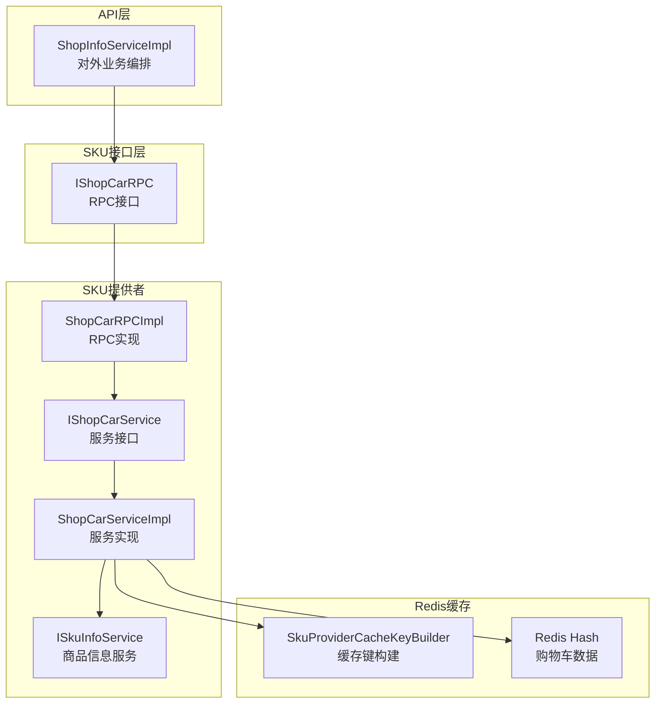
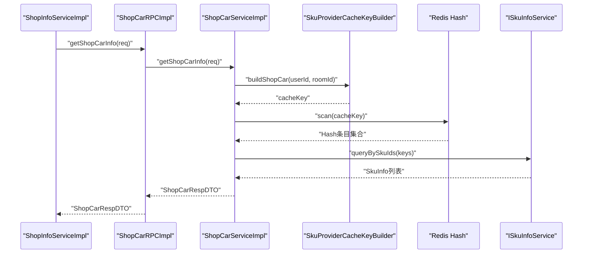
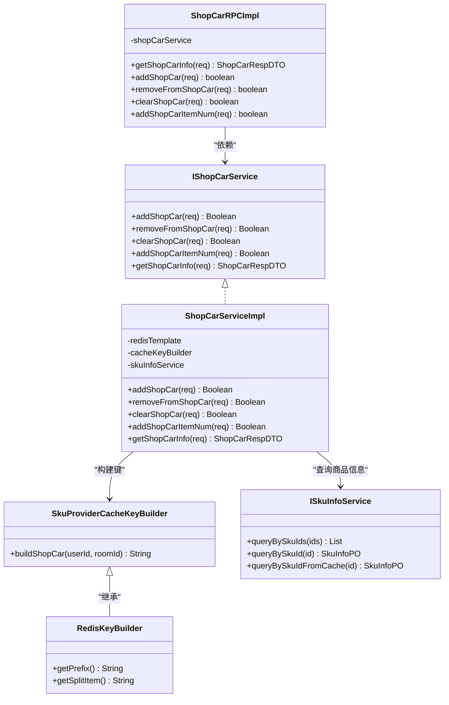
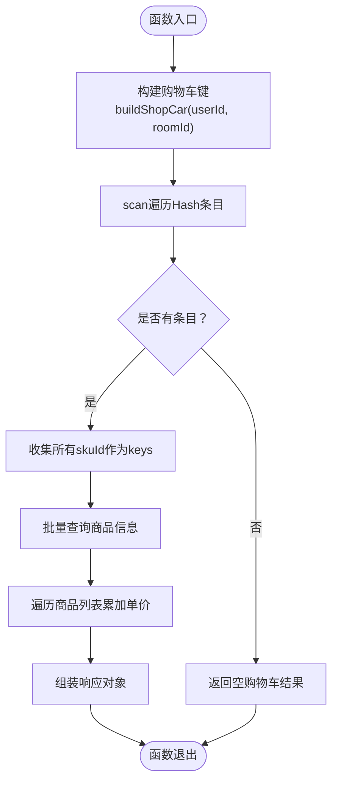
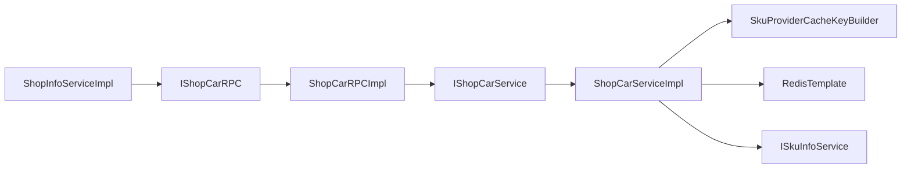

# 购物车服务

<cite>
**本文引用的文件列表**
- [ShopCarServiceImpl.java](file://live-sku-provider/src/main/java/com/logilong/live/sku/provider/service/impl/ShopCarServiceImpl.java)
- [IShopCarService.java](file://live-sku-provider/src/main/java/com/logilong/live/sku/provider/service/IShopCarService.java)
- [ShopCarRPCImpl.java](file://live-sku-provider/src/main/java/com/logilong/live/sku/provider/rpc/ShopCarRPCImpl.java)
- [IShopCarRPC.java](file://live-sku-interface/src/main/java/com/logilong/live/sku/interfaces/IShopCarRPC.java)
- [SkuProviderCacheKeyBuilder.java](file://live-framework/live-framework-redis-starter/src/main/java/com/logilong/live/framework/redis/starter/key/SkuProviderCacheKeyBuilder.java)
- [RedisKeyBuilder.java](file://live-framework/live-framework-redis-starter/src/main/java/com/logilong/live/framework/redis/starter/key/RedisKeyBuilder.java)
- [ShopCarReqDTO.java](file://live-sku-interface/src/main/java/com/logilong/live/sku/dto/ShopCarReqDTO.java)
- [ShopCarRespDTO.java](file://live-sku-interface/src/main/java/com/logilong/live/sku/dto/ShopCarRespDTO.java)
- [ShopCarItemRespDTO.java](file://live-sku-interface/src/main/java/com/logilong/live/sku/dto/ShopCarItemRespDTO.java)
- [ISkuInfoService.java](file://live-sku-provider/src/main/java/com/logilong/live/sku/provider/service/ISkuInfoService.java)
- [ShopInfoServiceImpl.java](file://live-api/src/main/java/com/logilong/live/api/service/impl/ShopInfoServiceImpl.java)
</cite>

## 目录
1. [引言](#引言)
2. [项目结构](#项目结构)
3. [核心组件](#核心组件)
4. [架构总览](#架构总览)
5. [详细组件分析](#详细组件分析)
6. [依赖关系分析](#依赖关系分析)
7. [性能考量](#性能考量)
8. [故障排查指南](#故障排查指南)
9. [结论](#结论)

## 引言
本文件围绕购物车服务（ShopCarService）在直播间的非持久化缓存实现进行系统化解析，重点覆盖以下方面：
- 基于Redis Hash结构的购物车数据存储方案
- addShopCar、removeFromShopCar、clearShopCar、addShopCarItemNum 等核心操作的实现逻辑
- getShopCarInfo 如何通过 scan 遍历 Hash 条目并结合商品信息服务计算总价
- 购物车缓存键构建规则（SkuProviderCacheKeyBuilder.buildShopCar），说明 userId 与 roomId 组合键设计
- 增加商品数量的原子性操作实现

该实现以“直播间维度”的临时购物场景为核心目标，采用 Redis 缓存而非持久化存储，确保高并发下的低延迟与可扩展性。

## 项目结构
购物车服务位于 SKU 提供者模块，通过 Dubbo RPC 对外暴露接口；前端或 API 层调用 ShopInfoServiceImpl 进行业务编排，最终落到 ShopCarRPCImpl 和 ShopCarServiceImpl 的具体实现。

图表来源
- [ShopInfoServiceImpl.java](file://live-api/src/main/java/com/logilong/live/api/service/impl/ShopInfoServiceImpl.java#L58-L93)
- [IShopCarRPC.java](file://live-sku-interface/src/main/java/com/logilong/live/sku/interfaces/IShopCarRPC.java#L1-L32)
- [ShopCarRPCImpl.java](file://live-sku-provider/src/main/java/com/logilong/live/sku/provider/rpc/ShopCarRPCImpl.java#L1-L42)
- [IShopCarService.java](file://live-sku-provider/src/main/java/com/logilong/live/sku/provider/service/IShopCarService.java#L1-L33)
- [ShopCarServiceImpl.java](file://live-sku-provider/src/main/java/com/logilong/live/sku/provider/service/impl/ShopCarServiceImpl.java#L1-L91)
- [SkuProviderCacheKeyBuilder.java](file://live-framework/live-framework-redis-starter/src/main/java/com/logilong/live/framework/redis/starter/key/SkuProviderCacheKeyBuilder.java#L1-L41)
- [ISkuInfoService.java](file://live-sku-provider/src/main/java/com/logilong/live/sku/provider/service/ISkuInfoService.java#L1-L21)

章节来源
- [ShopInfoServiceImpl.java](file://live-api/src/main/java/com/logilong/live/api/service/impl/ShopInfoServiceImpl.java#L58-L93)
- [IShopCarRPC.java](file://live-sku-interface/src/main/java/com/logilong/live/sku/interfaces/IShopCarRPC.java#L1-L32)
- [ShopCarRPCImpl.java](file://live-sku-provider/src/main/java/com/logilong/live/sku/provider/rpc/ShopCarRPCImpl.java#L1-L42)
- [IShopCarService.java](file://live-sku-provider/src/main/java/com/logilong/live/sku/provider/service/IShopCarService.java#L1-L33)
- [ShopCarServiceImpl.java](file://live-sku-provider/src/main/java/com/logilong/live/sku/provider/service/impl/ShopCarServiceImpl.java#L1-L91)
- [SkuProviderCacheKeyBuilder.java](file://live-framework/live-framework-redis-starter/src/main/java/com/logilong/live/framework/redis/starter/key/SkuProviderCacheKeyBuilder.java#L1-L41)
- [RedisKeyBuilder.java](file://live-framework/live-framework-redis-starter/src/main/java/com/logilong/live/framework/redis/starter/key/RedisKeyBuilder.java#L1-L22)
- [ISkuInfoService.java](file://live-sku-provider/src/main/java/com/logilong/live/sku/provider/service/ISkuInfoService.java#L1-L21)

## 核心组件
- IShopCarService：定义购物车核心能力（添加、移除、清空、增加数量、查询）
- ShopCarServiceImpl：基于 Redis Hash 实现购物车数据的增删改查
- SkuProviderCacheKeyBuilder：统一构建 Redis 键前缀与购物车键名
- ShopCarRPCImpl：Dubbo RPC 暴露层，转发请求至服务实现
- ISkuInfoService：商品信息服务，用于按 SKU 批量查询价格等信息
- ShopInfoServiceImpl：API 层业务编排，负责注入用户上下文并转换 VO/DTO

章节来源
- [IShopCarService.java](file://live-sku-provider/src/main/java/com/logilong/live/sku/provider/service/IShopCarService.java#L1-L33)
- [ShopCarServiceImpl.java](file://live-sku-provider/src/main/java/com/logilong/live/sku/provider/service/impl/ShopCarServiceImpl.java#L1-L91)
- [SkuProviderCacheKeyBuilder.java](file://live-framework/live-framework-redis-starter/src/main/java/com/logilong/live/framework/redis/starter/key/SkuProviderCacheKeyBuilder.java#L1-L41)
- [ShopCarRPCImpl.java](file://live-sku-provider/src/main/java/com/logilong/live/sku/provider/rpc/ShopCarRPCImpl.java#L1-L42)
- [ISkuInfoService.java](file://live-sku-provider/src/main/java/com/logilong/live/sku/provider/service/ISkuInfoService.java#L1-L21)
- [ShopInfoServiceImpl.java](file://live-api/src/main/java/com/logilong/live/api/service/impl/ShopInfoServiceImpl.java#L58-L93)

## 架构总览
购物车服务采用“接口层-服务层-RPC层-缓存层-商品信息服务”的分层架构。请求自 API 层进入，经由 RPC 接口转发到服务实现，服务实现通过 Redis Hash 存储购物车数据，并在查询时拉取商品价格信息进行总价计算。

图表来源
- [ShopInfoServiceImpl.java](file://live-api/src/main/java/com/logilong/live/api/service/impl/ShopInfoServiceImpl.java#L85-L93)
- [ShopCarRPCImpl.java](file://live-sku-provider/src/main/java/com/logilong/live/sku/provider/rpc/ShopCarRPCImpl.java#L16-L20)
- [ShopCarServiceImpl.java](file://live-sku-provider/src/main/java/com/logilong/live/sku/provider/service/impl/ShopCarServiceImpl.java#L64-L88)
- [SkuProviderCacheKeyBuilder.java](file://live-framework/live-framework-redis-starter/src/main/java/com/logilong/live/framework/redis/starter/key/SkuProviderCacheKeyBuilder.java#L33-L35)
- [ISkuInfoService.java](file://live-sku-provider/src/main/java/com/logilong/live/sku/provider/service/ISkuInfoService.java#L12-L12)

## 详细组件分析

### 购物车服务类图

图表来源
- [IShopCarService.java](file://live-sku-provider/src/main/java/com/logilong/live/sku/provider/service/IShopCarService.java#L1-L33)
- [ShopCarServiceImpl.java](file://live-sku-provider/src/main/java/com/logilong/live/sku/provider/service/impl/ShopCarServiceImpl.java#L1-L91)
- [ShopCarRPCImpl.java](file://live-sku-provider/src/main/java/com/logilong/live/sku/provider/rpc/ShopCarRPCImpl.java#L1-L42)
- [SkuProviderCacheKeyBuilder.java](file://live-framework/live-framework-redis-starter/src/main/java/com/logilong/live/framework/redis/starter/key/SkuProviderCacheKeyBuilder.java#L1-L41)
- [RedisKeyBuilder.java](file://live-framework/live-framework-redis-starter/src/main/java/com/logilong/live/framework/redis/starter/key/RedisKeyBuilder.java#L1-L22)
- [ISkuInfoService.java](file://live-sku-provider/src/main/java/com/logilong/live/sku/provider/service/ISkuInfoService.java#L1-L21)

章节来源
- [IShopCarService.java](file://live-sku-provider/src/main/java/com/logilong/live/sku/provider/service/IShopCarService.java#L1-L33)
- [ShopCarServiceImpl.java](file://live-sku-provider/src/main/java/com/logilong/live/sku/provider/service/impl/ShopCarServiceImpl.java#L1-L91)
- [ShopCarRPCImpl.java](file://live-sku-provider/src/main/java/com/logilong/live/sku/provider/rpc/ShopCarRPCImpl.java#L1-L42)
- [SkuProviderCacheKeyBuilder.java](file://live-framework/live-framework-redis-starter/src/main/java/com/logilong/live/framework/redis/starter/key/SkuProviderCacheKeyBuilder.java#L1-L41)
- [RedisKeyBuilder.java](file://live-framework/live-framework-redis-starter/src/main/java/com/logilong/live/framework/redis/starter/key/RedisKeyBuilder.java#L1-L22)
- [ISkuInfoService.java](file://live-sku-provider/src/main/java/com/logilong/live/sku/provider/service/ISkuInfoService.java#L1-L21)

### 核心操作实现逻辑

#### addShopCar（添加商品到购物车）
- 键构建：使用 SkuProviderCacheKeyBuilder.buildShopCar(userId, roomId) 生成购物车键
- 数据结构：Redis Hash，键为 skuId，值为数量（初始为 1）
- 并发特性：单次 Hash 写入，线程安全

章节来源
- [ShopCarServiceImpl.java](file://live-sku-provider/src/main/java/com/logilong/live/sku/provider/service/impl/ShopCarServiceImpl.java#L37-L41)
- [SkuProviderCacheKeyBuilder.java](file://live-framework/live-framework-redis-starter/src/main/java/com/logilong/live/framework/redis/starter/key/SkuProviderCacheKeyBuilder.java#L33-L35)

#### removeFromShopCar（从购物车移除商品）
- 键构建：同上
- 删除策略：针对指定 skuId 执行 Hash 删除
- 并发特性：单键删除，原子性

章节来源
- [ShopCarServiceImpl.java](file://live-sku-provider/src/main/java/com/logilong/live/sku/provider/service/impl/ShopCarServiceImpl.java#L43-L48)
- [SkuProviderCacheKeyBuilder.java](file://live-framework/live-framework-redis-starter/src/main/java/com/logilong/live/framework/redis/starter/key/SkuProviderCacheKeyBuilder.java#L33-L35)

#### clearShopCar（清空购物车）
- 键构建：同上
- 清理策略：直接删除整个购物车键，释放内存
- 并发特性：单键删除，原子性

章节来源
- [ShopCarServiceImpl.java](file://live-sku-provider/src/main/java/com/logilong/live/sku/provider/service/impl/ShopCarServiceImpl.java#L50-L55)
- [SkuProviderCacheKeyBuilder.java](file://live-framework/live-framework-redis-starter/src/main/java/com/logilong/live/framework/redis/starter/key/SkuProviderCacheKeyBuilder.java#L33-L35)

#### addShopCarItemNum（增加商品数量）
- 键构建：同上
- 原子性：使用 Hash increment 对指定 skuId 的值进行原子递增
- 并发特性：Redis 原子自增，天然线程安全

章节来源
- [ShopCarServiceImpl.java](file://live-sku-provider/src/main/java/com/logilong/live/sku/provider/service/impl/ShopCarServiceImpl.java#L58-L62)
- [SkuProviderCacheKeyBuilder.java](file://live-framework/live-framework-redis-starter/src/main/java/com/logilong/live/framework/redis/starter/key/SkuProviderCacheKeyBuilder.java#L33-L35)

#### getShopCarInfo（查询购物车信息）
- 键构建：同上
- 遍历策略：使用 scan + match "*" 遍历 Hash 中的所有条目
- 数据聚合：将 Hash 的 key（skuId）与 value（数量）组装为 Map
- 商品信息：调用 ISkuInfoService.queryBySkuIds 批量查询商品详情
- 总价计算：遍历商品列表，累加每个商品的价格（单价）
- 返回结构：封装为 ShopCarRespDTO，包含用户ID、房间ID、总价与明细列表

图表来源
- [ShopCarServiceImpl.java](file://live-sku-provider/src/main/java/com/logilong/live/sku/provider/service/impl/ShopCarServiceImpl.java#L64-L88)
- [ISkuInfoService.java](file://live-sku-provider/src/main/java/com/logilong/live/sku/provider/service/ISkuInfoService.java#L12-L12)

章节来源
- [ShopCarServiceImpl.java](file://live-sku-provider/src/main/java/com/logilong/live/sku/provider/service/impl/ShopCarServiceImpl.java#L64-L88)
- [ISkuInfoService.java](file://live-sku-provider/src/main/java/com/logilong/live/sku/provider/service/ISkuInfoService.java#L12-L12)

### 缓存键构建规则（SkuProviderCacheKeyBuilder.buildShopCar）
- 前缀来源：RedisKeyBuilder.getPrefix() 返回应用名 + 分隔符
- 键格式：prefix + "shop_Car" + 分隔符 + userId + 分隔符 + roomId
- 设计意图：以“用户+房间”为维度隔离购物车，避免跨房间数据污染；同时便于按房间维度清理

章节来源
- [SkuProviderCacheKeyBuilder.java](file://live-framework/live-framework-redis-starter/src/main/java/com/logilong/live/framework/redis/starter/key/SkuProviderCacheKeyBuilder.java#L1-L41)
- [RedisKeyBuilder.java](file://live-framework/live-framework-redis-starter/src/main/java/com/logilong/live/framework/redis/starter/key/RedisKeyBuilder.java#L1-L22)

### 与商品信息服务的集成
- 批量查询：getShopCarInfo 在收集到所有 skuId 后，调用 ISkuInfoService.queryBySkuIds 进行批量查询
- 映射与计价：将查询结果映射为 DTO 列表，并遍历累加单价得到总价
- 业务编排：ShopInfoServiceImpl 在 API 层负责注入当前用户上下文，再调用 RPC 接口

章节来源
- [ShopCarServiceImpl.java](file://live-sku-provider/src/main/java/com/logilong/live/sku/provider/service/impl/ShopCarServiceImpl.java#L74-L81)
- [ISkuInfoService.java](file://live-sku-provider/src/main/java/com/logilong/live/sku/provider/service/ISkuInfoService.java#L12-L12)
- [ShopInfoServiceImpl.java](file://live-api/src/main/java/com/logilong/live/api/service/impl/ShopInfoServiceImpl.java#L58-L93)

## 依赖关系分析
- 外部依赖
  - RedisTemplate：提供 Hash 操作与 scan 能力
  - SkuProviderCacheKeyBuilder：统一键构建
  - ISkuInfoService：商品信息服务
- 内部依赖
  - ShopCarRPCImpl 依赖 IShopCarService
  - ShopInfoServiceImpl 依赖 IShopCarRPC 与 ISkuInfoRPC

图表来源
- [ShopInfoServiceImpl.java](file://live-api/src/main/java/com/logilong/live/api/service/impl/ShopInfoServiceImpl.java#L58-L93)
- [IShopCarRPC.java](file://live-sku-interface/src/main/java/com/logilong/live/sku/interfaces/IShopCarRPC.java#L1-L32)
- [ShopCarRPCImpl.java](file://live-sku-provider/src/main/java/com/logilong/live/sku/provider/rpc/ShopCarRPCImpl.java#L1-L42)
- [IShopCarService.java](file://live-sku-provider/src/main/java/com/logilong/live/sku/provider/service/IShopCarService.java#L1-L33)
- [ShopCarServiceImpl.java](file://live-sku-provider/src/main/java/com/logilong/live/sku/provider/service/impl/ShopCarServiceImpl.java#L1-L91)
- [SkuProviderCacheKeyBuilder.java](file://live-framework/live-framework-redis-starter/src/main/java/com/logilong/live/framework/redis/starter/key/SkuProviderCacheKeyBuilder.java#L1-L41)
- [ISkuInfoService.java](file://live-sku-provider/src/main/java/com/logilong/live/sku/provider/service/ISkuInfoService.java#L1-L21)

章节来源
- [ShopInfoServiceImpl.java](file://live-api/src/main/java/com/logilong/live/api/service/impl/ShopInfoServiceImpl.java#L58-L93)
- [ShopCarRPCImpl.java](file://live-sku-provider/src/main/java/com/logilong/live/sku/provider/rpc/ShopCarRPCImpl.java#L1-L42)
- [ShopCarServiceImpl.java](file://live-sku-provider/src/main/java/com/logilong/live/sku/provider/service/impl/ShopCarServiceImpl.java#L1-L91)

## 性能考量
- Redis Hash 存储
  - 优点：键空间小、读写高效；适合以用户+房间为维度的临时购物车
  - 注意：Hash 条目过多时 scan 遍历成本上升，建议控制单个购物车商品种类数量
- 原子性操作
  - 增量操作使用 Hash increment，避免竞态条件
- 批量查询
  - getShopCarInfo 使用批量查询商品信息，减少多次网络往返
- 键设计
  - 以 userId + roomId 组合作为键，天然隔离不同房间购物车，降低冲突概率

[本节为通用性能讨论，不直接分析具体文件]

## 故障排查指南
- getShopCarInfo 结果为空
  - 可能原因：购物车键不存在或已被清理；scan 未匹配到任何条目
  - 排查要点：确认 userId 与 roomId 是否正确传入；检查键是否被其他流程删除
- 增量操作无效
  - 可能原因：skuId 不存在或类型不匹配
  - 排查要点：确认 skuId 类型与 Hash 键一致；检查 Redis 中对应键是否存在
- 总价异常
  - 可能原因：商品价格未正确返回或为空
  - 排查要点：确认 ISkuInfoService 查询结果；检查商品价格字段是否为空

章节来源
- [ShopCarServiceImpl.java](file://live-sku-provider/src/main/java/com/logilong/live/sku/provider/service/impl/ShopCarServiceImpl.java#L64-L88)
- [ISkuInfoService.java](file://live-sku-provider/src/main/java/com/logilong/live/sku/provider/service/ISkuInfoService.java#L12-L12)

## 结论
购物车服务通过 Redis Hash 实现了以“直播间维度”的临时购物车功能，具备以下特点：
- 键设计清晰：以 userId 与 roomId 组合，天然隔离不同房间数据
- 操作简洁：基于 Hash 的 put/delete/increment，满足常见购物车操作
- 查询高效：scan 遍历 + 批量商品查询，结合总价计算，形成完整的查询链路
- 原子性强：增量操作采用 Redis 原子自增，保证并发安全

该实现非常适合直播间的临时购物场景，既保证了性能，又降低了持久化成本。