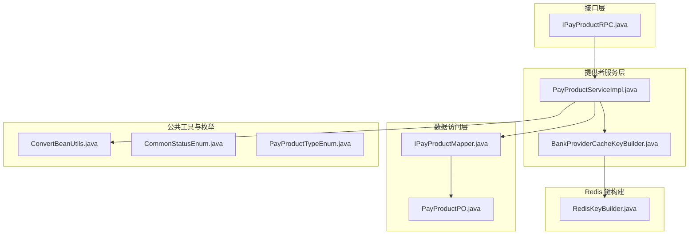
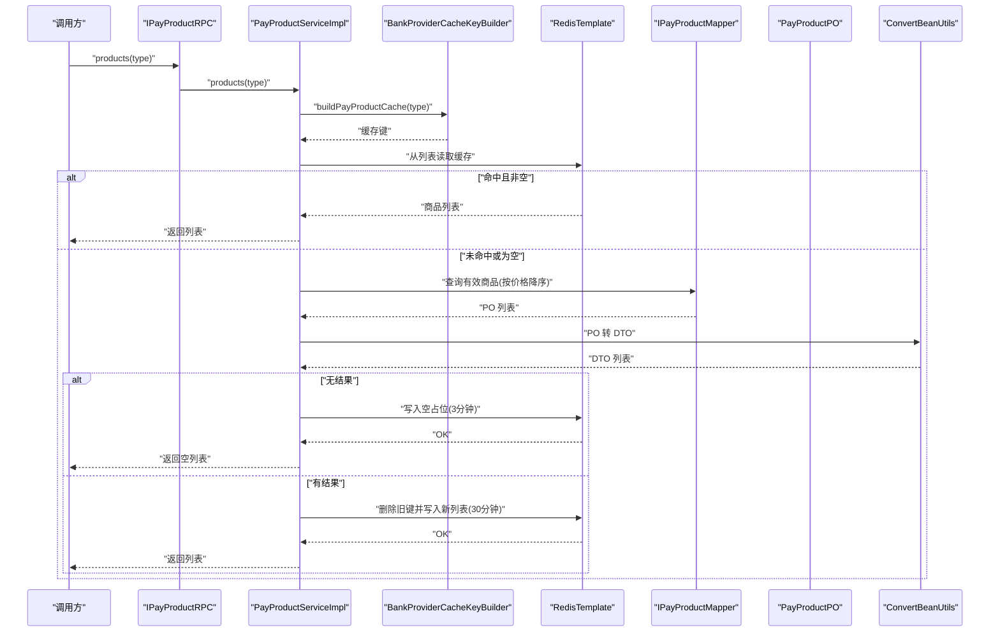
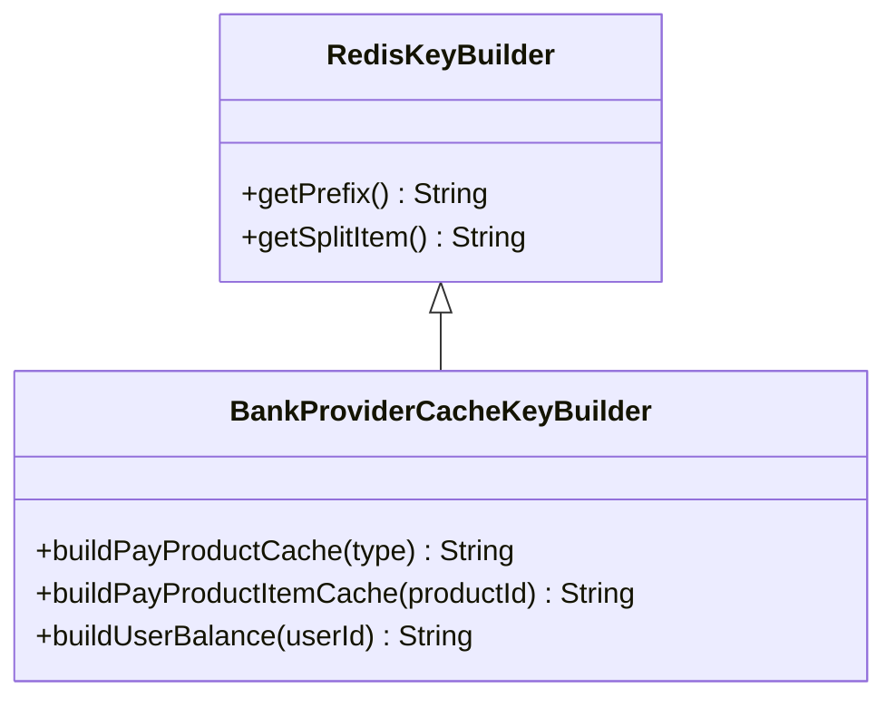
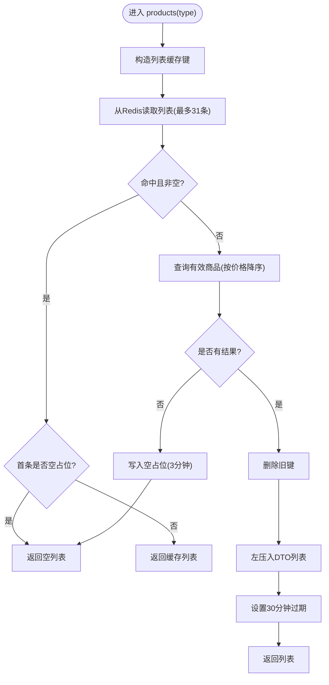
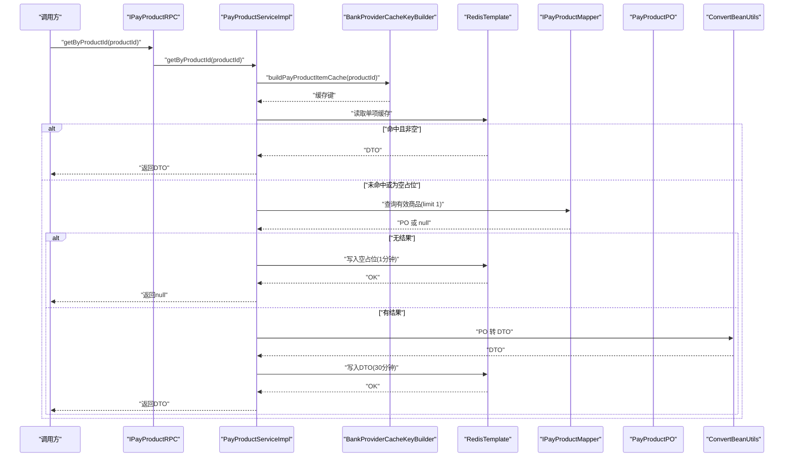
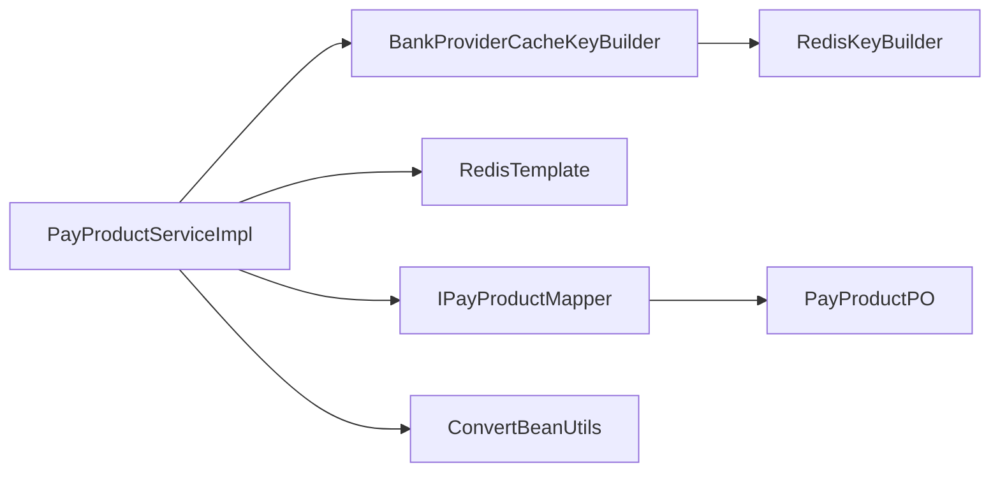

# 支付产品配置

<cite>
**本文引用的文件**
- [PayProductServiceImpl.java](file://live-bank-provider/src/main/java/com/logilong/live/bank/provider/service/impl/PayProductServiceImpl.java)
- [BankProviderCacheKeyBuilder.java](file://live-framework/live-framework-redis-starter/src/main/java/com/logilong/live/framework/redis/starter/key/BankProviderCacheKeyBuilder.java)
- [RedisKeyBuilder.java](file://live-framework/live-framework-redis-starter/src/main/java/com/logilong/live/framework/redis/starter/key/RedisKeyBuilder.java)
- [IPayProductRPC.java](file://live-bank-interface/src/main/java/com/logilong/live/bank/interfaces/IPayProductRPC.java)
- [IPayProductMapper.java](file://live-bank-provider/src/main/java/com/logilong/live/bank/provider/dao/mapper/IPayProductMapper.java)
- [PayProductPO.java](file://live-bank-provider/src/main/java/com/logilong/live/bank/provider/dao/po/PayProductPO.java)
- [PayProductDTO.java](file://live-bank-interface/src/main/java/com/logilong/live/bank/dto/PayProductDTO.java)
- [ConvertBeanUtils.java](file://live-common-interface/src/main/java/com/logilong/live/common/interfaces/utils/ConvertBeanUtils.java)
- [CommonStatusEnum.java](file://live-common-interface/src/main/java/com/logilong/live/common/interfaces/enums/CommonStatusEnum.java)
- [PayProductTypeEnum.java](file://live-bank-interface/src/main/java/com/logilong/live/bank/constants/PayProductTypeEnum.java)
</cite>

## 目录
1. [引言](#引言)
2. [项目结构](#项目结构)
3. [核心组件](#核心组件)
4. [架构总览](#架构总览)
5. [详细组件分析](#详细组件分析)
6. [依赖关系分析](#依赖关系分析)
7. [性能考量](#性能考量)
8. [故障排查指南](#故障排查指南)
9. [结论](#结论)

## 引言
本文件系统性阐述支付产品（PayProduct）的配置管理与缓存机制，重点围绕以下目标：
- 解析 PayProductServiceImpl 中 products 方法如何按产品类型查询有效商品列表，并实现 Redis 缓存的读取与写入。
- 分析缓存键构造策略（BankProviderCacheKeyBuilder.buildPayProductCache 与 buildPayProductItemCache），包括前缀管理、分隔符定义与键名生成规则。
- 解释空值缓存（Null Value Caching）以防止缓存穿透的设计，以及缓存过期时间（3 分钟空值缓存、30 分钟数据缓存）的业务考量。
- 描述 getByProductId 对单个产品信息的缓存处理流程，包括缓存击穿防护与热点数据更新策略。
- 结合代码示例路径展示 MyBatis-Plus 与 RedisTemplate 的协同使用，以及 ConvertBeanUtils 在 PO 到 DTO 转换中的应用。

## 项目结构
支付产品配置相关代码分布在如下模块：
- 接口层：提供 RPC 接口定义，用于对外暴露产品查询能力。
- 提供者服务层：实现具体业务逻辑，包含缓存读写与数据库访问。
- 数据访问层：基于 MyBatis-Plus 的 Mapper 与 PO 实体。
- 公共工具与枚举：提供通用转换工具与状态枚举。
- Redis 键构建：统一管理缓存键前缀、分隔符与命名规范。

图表来源
- [PayProductServiceImpl.java](file://live-bank-provider/src/main/java/com/logilong/live/bank/provider/service/impl/PayProductServiceImpl.java#L1-L80)
- [BankProviderCacheKeyBuilder.java](file://live-framework/live-framework-redis-starter/src/main/java/com/logilong/live/framework/redis/starter/key/BankProviderCacheKeyBuilder.java#L1-L36)
- [RedisKeyBuilder.java](file://live-framework/live-framework-redis-starter/src/main/java/com/logilong/live/framework/redis/starter/key/RedisKeyBuilder.java#L1-L22)
- [IPayProductRPC.java](file://live-bank-interface/src/main/java/com/logilong/live/bank/interfaces/IPayProductRPC.java#L1-L22)
- [IPayProductMapper.java](file://live-bank-provider/src/main/java/com/logilong/live/bank/provider/dao/mapper/IPayProductMapper.java#L1-L10)
- [PayProductPO.java](file://live-bank-provider/src/main/java/com/logilong/live/bank/provider/dao/po/PayProductPO.java#L1-L27)
- [ConvertBeanUtils.java](file://live-common-interface/src/main/java/com/logilong/live/common/interfaces/utils/ConvertBeanUtils.java#L1-L56)
- [CommonStatusEnum.java](file://live-common-interface/src/main/java/com/logilong/live/common/interfaces/enums/CommonStatusEnum.java#L1-L17)
- [PayProductTypeEnum.java](file://live-bank-interface/src/main/java/com/logilong/live/bank/constants/PayProductTypeEnum.java#L1-L17)

章节来源
- [PayProductServiceImpl.java](file://live-bank-provider/src/main/java/com/logilong/live/bank/provider/service/impl/PayProductServiceImpl.java#L1-L80)
- [BankProviderCacheKeyBuilder.java](file://live-framework/live-framework-redis-starter/src/main/java/com/logilong/live/framework/redis/starter/key/BankProviderCacheKeyBuilder.java#L1-L36)
- [RedisKeyBuilder.java](file://live-framework/live-framework-redis-starter/src/main/java/com/logilong/live/framework/redis/starter/key/RedisKeyBuilder.java#L1-L22)
- [IPayProductRPC.java](file://live-bank-interface/src/main/java/com/logilong/live/bank/interfaces/IPayProductRPC.java#L1-L22)
- [IPayProductMapper.java](file://live-bank-provider/src/main/java/com/logilong/live/bank/provider/dao/mapper/IPayProductMapper.java#L1-L10)
- [PayProductPO.java](file://live-bank-provider/src/main/java/com/logilong/live/bank/provider/dao/po/PayProductPO.java#L1-L27)
- [ConvertBeanUtils.java](file://live-common-interface/src/main/java/com/logilong/live/common/interfaces/utils/ConvertBeanUtils.java#L1-L56)
- [CommonStatusEnum.java](file://live-common-interface/src/main/java/com/logilong/live/common/interfaces/enums/CommonStatusEnum.java#L1-L17)
- [PayProductTypeEnum.java](file://live-bank-interface/src/main/java/com/logilong/live/bank/constants/PayProductTypeEnum.java#L1-L17)

## 核心组件
- PayProductServiceImpl：提供产品列表查询与单个产品查询的缓存实现，负责与 RedisTemplate 和 IPayProductMapper 协同工作。
- BankProviderCacheKeyBuilder：基于 RedisKeyBuilder 统一生成缓存键，包含前缀、分隔符与命名空间。
- RedisKeyBuilder：提供应用名前缀与冒号分隔符的基础能力。
- ConvertBeanUtils：提供 PO 到 DTO 的转换工具，支持单对象与列表转换。
- IPayProductMapper/PO：MyBatis-Plus 访问 t_pay_product 表，过滤有效状态并按价格降序排序。

章节来源
- [PayProductServiceImpl.java](file://live-bank-provider/src/main/java/com/logilong/live/bank/provider/service/impl/PayProductServiceImpl.java#L1-L80)
- [BankProviderCacheKeyBuilder.java](file://live-framework/live-framework-redis-starter/src/main/java/com/logilong/live/framework/redis/starter/key/BankProviderCacheKeyBuilder.java#L1-L36)
- [RedisKeyBuilder.java](file://live-framework/live-framework-redis-starter/src/main/java/com/logilong/live/framework/redis/starter/key/RedisKeyBuilder.java#L1-L22)
- [ConvertBeanUtils.java](file://live-common-interface/src/main/java/com/logilong/live/common/interfaces/utils/ConvertBeanUtils.java#L1-L56)
- [IPayProductMapper.java](file://live-bank-provider/src/main/java/com/logilong/live/bank/provider/dao/mapper/IPayProductMapper.java#L1-L10)
- [PayProductPO.java](file://live-bank-provider/src/main/java/com/logilong/live/bank/provider/dao/po/PayProductPO.java#L1-L27)

## 架构总览
下图展示了支付产品配置的调用链路与缓存交互：

图表来源
- [PayProductServiceImpl.java](file://live-bank-provider/src/main/java/com/logilong/live/bank/provider/service/impl/PayProductServiceImpl.java#L30-L55)
- [BankProviderCacheKeyBuilder.java](file://live-framework/live-framework-redis-starter/src/main/java/com/logilong/live/framework/redis/starter/key/BankProviderCacheKeyBuilder.java#L18-L27)
- [IPayProductMapper.java](file://live-bank-provider/src/main/java/com/logilong/live/bank/provider/dao/mapper/IPayProductMapper.java#L1-L10)
- [PayProductPO.java](file://live-bank-provider/src/main/java/com/logilong/live/bank/provider/dao/po/PayProductPO.java#L1-L27)
- [ConvertBeanUtils.java](file://live-common-interface/src/main/java/com/logilong/live/common/interfaces/utils/ConvertBeanUtils.java#L20-L46)

## 详细组件分析

### 缓存键构造策略（BankProviderCacheKeyBuilder）
- 前缀管理：继承自 RedisKeyBuilder，使用应用名作为前缀，避免多服务键冲突。
- 分隔符定义：统一使用冒号“:”作为分隔符，保证键名可读性与解析一致性。
- 键名生成规则：
  - 列表缓存键：前缀 + “pay_product_cache” + 分隔符 + 产品类型
  - 单项缓存键：前缀 + “pay_product_item_cache” + 分隔符 + 产品ID
- 作用域隔离：通过前缀+命名空间确保不同模块与不同业务场景的键不互相污染。

图表来源
- [RedisKeyBuilder.java](file://live-framework/live-framework-redis-starter/src/main/java/com/logilong/live/framework/redis/starter/key/RedisKeyBuilder.java#L1-L22)
- [BankProviderCacheKeyBuilder.java](file://live-framework/live-framework-redis-starter/src/main/java/com/logilong/live/framework/redis/starter/key/BankProviderCacheKeyBuilder.java#L1-L36)

章节来源
- [RedisKeyBuilder.java](file://live-framework/live-framework-redis-starter/src/main/java/com/logilong/live/framework/redis/starter/key/RedisKeyBuilder.java#L1-L22)
- [BankProviderCacheKeyBuilder.java](file://live-framework/live-framework-redis-starter/src/main/java/com/logilong/live/framework/redis/starter/key/BankProviderCacheKeyBuilder.java#L1-L36)

### products 方法：按类型查询有效商品列表与缓存读写
- 缓存读取：先根据类型构造列表缓存键，从 Redis 列表读取最多 31 条记录（范围 0..30），若首条记录的 id 为空，则视为“空值占位”，直接返回空列表。
- 数据库查询：若缓存未命中或为空占位，构造 LambdaQueryWrapper 查询有效商品（valid_status=1），并按价格降序排序。
- 转换与写入：使用 ConvertBeanUtils 将 PO 列表转换为 DTO 列表；若无结果，写入一个空 DTO 占位并设置 3 分钟过期；若有结果，先删除旧键，再将 DTO 列表左压入 Redis 列表并设置 30 分钟过期。
- 复杂度与性能：列表读取 O(k)，k≤31；列表写入 O(n)；数据库查询受索引影响，建议在 type 与 valid_status 上建立联合索引以提升查询效率。

图表来源
- [PayProductServiceImpl.java](file://live-bank-provider/src/main/java/com/logilong/live/bank/provider/service/impl/PayProductServiceImpl.java#L30-L55)
- [ConvertBeanUtils.java](file://live-common-interface/src/main/java/com/logilong/live/common/interfaces/utils/ConvertBeanUtils.java#L20-L46)
- [CommonStatusEnum.java](file://live-common-interface/src/main/java/com/logilong/live/common/interfaces/enums/CommonStatusEnum.java#L1-L17)

章节来源
- [PayProductServiceImpl.java](file://live-bank-provider/src/main/java/com/logilong/live/bank/provider/service/impl/PayProductServiceImpl.java#L30-L55)
- [ConvertBeanUtils.java](file://live-common-interface/src/main/java/com/logilong/live/common/interfaces/utils/ConvertBeanUtils.java#L20-L46)
- [CommonStatusEnum.java](file://live-common-interface/src/main/java/com/logilong/live/common/interfaces/enums/CommonStatusEnum.java#L1-L17)

### getByProductId 方法：单个产品信息缓存处理
- 缓存读取：根据产品ID构造单项缓存键，从 Redis 字典读取；若命中且首条 id 为空，则视为“空值占位”，直接返回 null。
- 数据库查询：若未命中或为空占位，查询有效商品（valid_status=1），限制 1 条。
- 写入策略：
  - 未查到：写入空 DTO 占位并设置 1 分钟过期，降低短期重复请求带来的数据库压力。
  - 查到：写入完整 DTO 并设置 30 分钟过期，兼顾热点数据的稳定性与新鲜度。
- 击穿防护：通过短时过期的空占位与长时过期的数据占位，避免同一时间大量并发请求同时打到数据库。

图表来源
- [PayProductServiceImpl.java](file://live-bank-provider/src/main/java/com/logilong/live/bank/provider/service/impl/PayProductServiceImpl.java#L57-L79)
- [BankProviderCacheKeyBuilder.java](file://live-framework/live-framework-redis-starter/src/main/java/com/logilong/live/framework/redis/starter/key/BankProviderCacheKeyBuilder.java#L18-L20)
- [IPayProductMapper.java](file://live-bank-provider/src/main/java/com/logilong/live/bank/provider/dao/mapper/IPayProductMapper.java#L1-L10)
- [PayProductPO.java](file://live-bank-provider/src/main/java/com/logilong/live/bank/provider/dao/po/PayProductPO.java#L1-L27)
- [ConvertBeanUtils.java](file://live-common-interface/src/main/java/com/logilong/live/common/interfaces/utils/ConvertBeanUtils.java#L20-L46)

章节来源
- [PayProductServiceImpl.java](file://live-bank-provider/src/main/java/com/logilong/live/bank/provider/service/impl/PayProductServiceImpl.java#L57-L79)
- [BankProviderCacheKeyBuilder.java](file://live-framework/live-framework-redis-starter/src/main/java/com/logilong/live/framework/redis/starter/key/BankProviderCacheKeyBuilder.java#L18-L20)
- [IPayProductMapper.java](file://live-bank-provider/src/main/java/com/logilong/live/bank/provider/dao/mapper/IPayProductMapper.java#L1-L10)
- [PayProductPO.java](file://live-bank-provider/src/main/java/com/logilong/live/bank/provider/dao/po/PayProductPO.java#L1-L27)
- [ConvertBeanUtils.java](file://live-common-interface/src/main/java/com/logilong/live/common/interfaces/utils/ConvertBeanUtils.java#L20-L46)

### 空值缓存与过期策略的业务考量
- 空值缓存（Null Value Caching）：当数据库查询无结果时，写入一个空 DTO 占位，避免缓存穿透导致的持续数据库压力。
- 过期时间设计：
  - 空值占位：3 分钟（列表场景）或 1 分钟（单项场景），缩短空值占位时间，减少脏数据滞留。
  - 数据占位：30 分钟，平衡热点数据的稳定性与更新频率。
- 业务影响：该策略能显著降低冷门类型或不存在商品时的数据库压力，同时保证热数据的高可用与一致性。

章节来源
- [PayProductServiceImpl.java](file://live-bank-provider/src/main/java/com/logilong/live/bank/provider/service/impl/PayProductServiceImpl.java#L30-L55)
- [PayProductServiceImpl.java](file://live-bank-provider/src/main/java/com/logilong/live/bank/provider/service/impl/PayProductServiceImpl.java#L57-L79)

### MyBatis-Plus 与 RedisTemplate 协同使用
- MyBatis-Plus：通过 IPayProductMapper 使用 LambdaQueryWrapper 构造查询条件，过滤有效状态并排序，返回 PO 列表。
- RedisTemplate：用于列表与字典两种数据结构：
  - 列表结构：products 场景使用 leftPushAll 左压入 DTO 列表，range 读取指定范围。
  - 字典结构：getByProductId 场景使用 opsForValue 读写单值。
- 转换工具：使用 ConvertBeanUtils 将 PO/PO 列表转换为 DTO/DTO 列表，保证接口层数据模型与持久层模型解耦。

章节来源
- [IPayProductMapper.java](file://live-bank-provider/src/main/java/com/logilong/live/bank/provider/dao/mapper/IPayProductMapper.java#L1-L10)
- [PayProductServiceImpl.java](file://live-bank-provider/src/main/java/com/logilong/live/bank/provider/service/impl/PayProductServiceImpl.java#L30-L55)
- [PayProductServiceImpl.java](file://live-bank-provider/src/main/java/com/logilong/live/bank/provider/service/impl/PayProductServiceImpl.java#L57-L79)
- [ConvertBeanUtils.java](file://live-common-interface/src/main/java/com/logilong/live/common/interfaces/utils/ConvertBeanUtils.java#L20-L46)

## 依赖关系分析
- 组件内聚与耦合：
  - PayProductServiceImpl 与 BankProviderCacheKeyBuilder 通过接口耦合，便于替换键构建策略。
  - 与 RedisTemplate 的耦合集中在缓存读写，职责清晰。
  - 与 IPayProductMapper 的耦合通过 MyBatis-Plus 的 Mapper 接口实现，遵循分层原则。
- 外部依赖：
  - Redis：提供高性能缓存存储。
  - MyBatis-Plus：提供简洁的 ORM 能力。
  - Spring 注入：通过 @Resource 注入 RedisTemplate、Mapper 与 CacheKeyBuilder。

图表来源
- [PayProductServiceImpl.java](file://live-bank-provider/src/main/java/com/logilong/live/bank/provider/service/impl/PayProductServiceImpl.java#L1-L80)
- [BankProviderCacheKeyBuilder.java](file://live-framework/live-framework-redis-starter/src/main/java/com/logilong/live/framework/redis/starter/key/BankProviderCacheKeyBuilder.java#L1-L36)
- [RedisKeyBuilder.java](file://live-framework/live-framework-redis-starter/src/main/java/com/logilong/live/framework/redis/starter/key/RedisKeyBuilder.java#L1-L22)
- [IPayProductMapper.java](file://live-bank-provider/src/main/java/com/logilong/live/bank/provider/dao/mapper/IPayProductMapper.java#L1-L10)
- [PayProductPO.java](file://live-bank-provider/src/main/java/com/logilong/live/bank/provider/dao/po/PayProductPO.java#L1-L27)
- [ConvertBeanUtils.java](file://live-common-interface/src/main/java/com/logilong/live/common/interfaces/utils/ConvertBeanUtils.java#L1-L56)

章节来源
- [PayProductServiceImpl.java](file://live-bank-provider/src/main/java/com/logilong/live/bank/provider/service/impl/PayProductServiceImpl.java#L1-L80)
- [BankProviderCacheKeyBuilder.java](file://live-framework/live-framework-redis-starter/src/main/java/com/logilong/live/framework/redis/starter/key/BankProviderCacheKeyBuilder.java#L1-L36)
- [RedisKeyBuilder.java](file://live-framework/live-framework-redis-starter/src/main/java/com/logilong/live/framework/redis/starter/key/RedisKeyBuilder.java#L1-L22)
- [IPayProductMapper.java](file://live-bank-provider/src/main/java/com/logilong/live/bank/provider/dao/mapper/IPayProductMapper.java#L1-L10)
- [PayProductPO.java](file://live-bank-provider/src/main/java/com/logilong/live/bank/provider/dao/po/PayProductPO.java#L1-L27)
- [ConvertBeanUtils.java](file://live-common-interface/src/main/java/com/logilong/live/common/interfaces/utils/ConvertBeanUtils.java#L1-L56)

## 性能考量
- 缓存命中率优化：
  - 列表缓存采用 Redis 列表结构，适合顺序读取与有限范围读取；products 方法仅读取少量元素，满足前端分页需求。
  - 单项缓存采用 Redis 字典结构，适合高频读取与快速过期控制。
- 数据库负载控制：
  - 空值占位与短时过期有效缓解缓存穿透与击穿风险。
  - 30 分钟数据过期时间兼顾热点数据稳定性与更新频率。
- 索引建议：
  - 在 t_pay_product 的 type 与 valid_status 字段上建立联合索引，提升查询效率。
- 转换成本：
  - ConvertBeanUtils 的列表转换为 O(n) 操作，建议在批量写入前评估 DTO 数量，避免过大批次导致瞬时 CPU 峰值。

[本节为通用性能讨论，无需列出具体文件来源]

## 故障排查指南
- 缓存未命中但数据库正常：
  - 检查缓存键前缀与分隔符是否一致，确认应用名配置正确。
  - 确认 Redis 是否正常运行，键是否存在。
- 缓存命中但返回空列表：
  - 检查空占位逻辑：首条 id 是否为空；若是，需等待过期后重新查询。
- 单项缓存击穿：
  - 若同一时间大量请求命中空占位，可在业务侧增加本地互斥或延迟重试，避免瞬时数据库压力。
- DTO 转换异常：
  - 检查 ConvertBeanUtils 的转换逻辑，确认字段映射与空值处理。
- 数据库查询异常：
  - 检查 LambdaQueryWrapper 条件是否正确，valid_status 是否匹配枚举值。

章节来源
- [PayProductServiceImpl.java](file://live-bank-provider/src/main/java/com/logilong/live/bank/provider/service/impl/PayProductServiceImpl.java#L30-L55)
- [PayProductServiceImpl.java](file://live-bank-provider/src/main/java/com/logilong/live/bank/provider/service/impl/PayProductServiceImpl.java#L57-L79)
- [CommonStatusEnum.java](file://live-common-interface/src/main/java/com/logilong/live/common/interfaces/enums/CommonStatusEnum.java#L1-L17)
- [ConvertBeanUtils.java](file://live-common-interface/src/main/java/com/logilong/live/common/interfaces/utils/ConvertBeanUtils.java#L20-L46)

## 结论
本方案通过统一的缓存键构建策略与双层过期策略（空值占位与数据占位），有效实现了支付产品配置的高效查询与稳定缓存。products 与 getByProductId 两个方法分别针对批量与单点场景进行了针对性优化，配合 MyBatis-Plus 与 ConvertBeanUtils，形成清晰的分层与职责边界。建议在生产环境中关注索引建设与热点数据治理，进一步提升整体性能与可靠性。