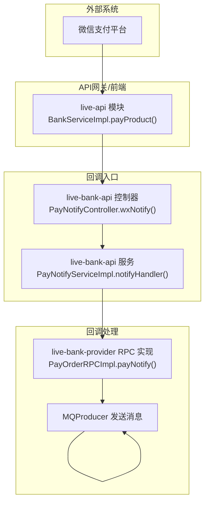
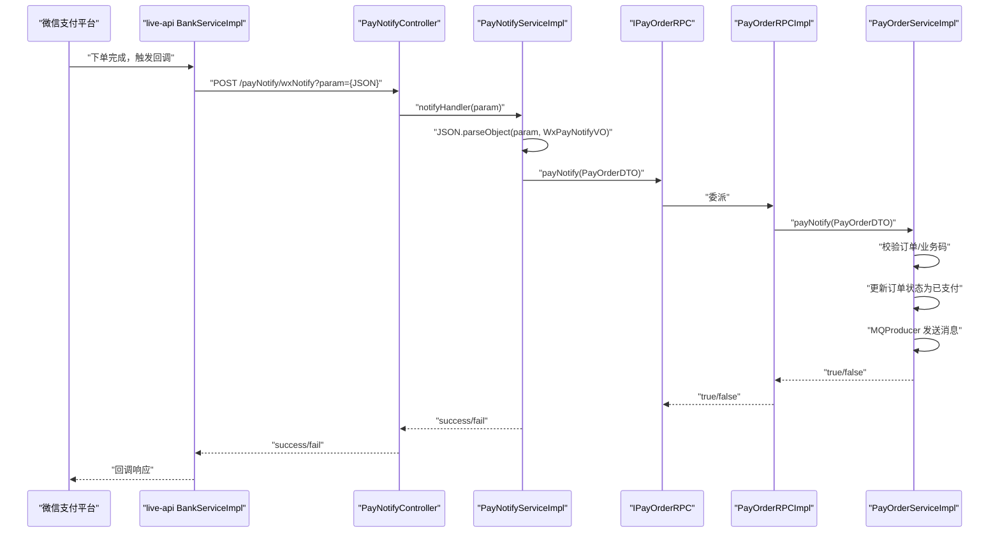
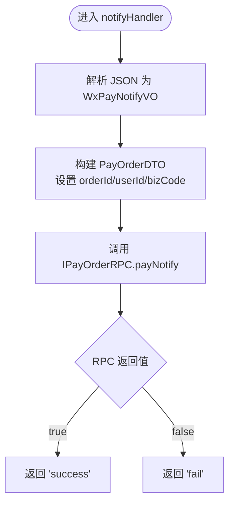
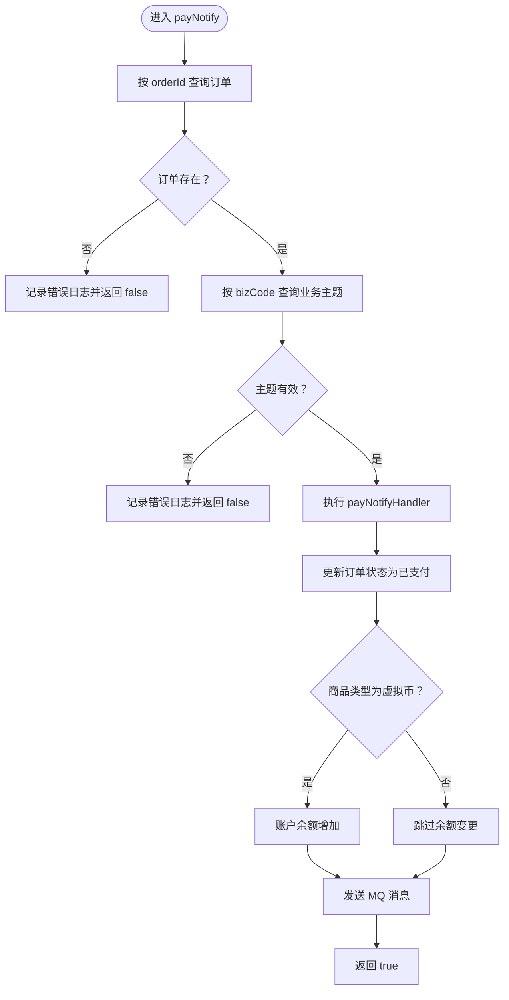
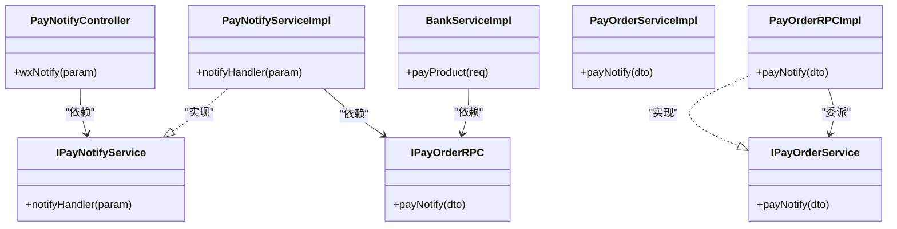

# 支付回调处理

<cite>
**本文引用的文件列表**
- [PayNotifyController.java](file://live-bank-api/src/main/java/com/logilong/live/bank/api/controller/PayNotifyController.java)
- [PayNotifyServiceImpl.java](file://live-bank-api/src/main/java/com/logilong/live/bank/api/service/impl/PayNotifyServiceImpl.java)
- [WxPayNotifyVO.java](file://live-bank-api/src/main/java/com/logilong/live/bank/api/vo/WxPayNotifyVO.java)
- [IPayNotifyService.java](file://live-bank-api/src/main/java/com/logilong/live/bank/api/service/IPayNotifyService.java)
- [PayOrderRPCImpl.java](file://live-bank-provider/src/main/java/com/logilong/live/bank/provider/rpc/PayOrderRPCImpl.java)
- [PayOrderServiceImpl.java](file://live-bank-provider/src/main/java/com/logilong/live/bank/provider/service/impl/PayOrderServiceImpl.java)
- [IPayOrderRPC.java](file://live-bank-interface/src/main/java/com/logilong/live/bank/interfaces/IPayOrderRPC.java)
- [PayOrderDTO.java](file://live-bank-interface/src/main/java/com/logilong/live/bank/dto/PayOrderDTO.java)
- [OrderStatusEnum.java](file://live-bank-interface/src/main/java/com/logilong/live/bank/constants/OrderStatusEnum.java)
- [PayProductTypeEnum.java](file://live-bank-interface/src/main/java/com/logilong/live/bank/constants/PayProductTypeEnum.java)
- [BankServiceImpl.java](file://live-api/src/main/java/com/logilong/live/api/service/impl/BankServiceImpl.java)
</cite>

## 目录
1. [引言](#引言)
2. [项目结构](#项目结构)
3. [核心组件](#核心组件)
4. [架构总览](#架构总览)
5. [详细组件分析](#详细组件分析)
6. [依赖关系分析](#依赖关系分析)
7. [性能与可靠性考量](#性能与可靠性考量)
8. [故障排查指南](#故障排查指南)
9. [结论](#结论)

## 引言
本文件面向支付回调处理机制的端到端链路，覆盖从外部请求接入到内部业务执行的全过程。重点围绕以下目标展开：
- PayNotifyController 如何接收微信支付回调请求（wxNotify 接口）并解析参数进行转发
- PayNotifyServiceImpl 中 notifyHandler 对回调数据的反序列化与 DTO 构造流程
- 通过 Dubbo RPC 调用 payOrderRPC.payNotify 的跨服务通信机制
- PayOrderServiceImpl.payNotify 的安全校验逻辑（订单存在性验证、业务码合法性检查）
- 支付成功后的核心处理流程（订单状态更新、MQ 消息通知）
- 异常捕获策略、日志记录规范与响应结果生成机制

## 项目结构
支付回调处理涉及三个模块：
- live-api：发起支付并构造回调参数，随后向回调接口发起 HTTP 请求
- live-bank-api：接收回调请求，解析参数，封装为 DTO 并通过 Dubbo 转发
- live-bank-provider：接收 Dubbo 调用，执行安全校验、订单状态更新、MQ 通知等核心业务

图表来源
- [PayNotifyController.java](file://live-bank-api/src/main/java/com/logilong/live/bank/api/controller/PayNotifyController.java#L1-L26)
- [PayNotifyServiceImpl.java](file://live-bank-api/src/main/java/com/logilong/live/bank/api/service/impl/PayNotifyServiceImpl.java#L1-L28)
- [PayOrderRPCImpl.java](file://live-bank-provider/src/main/java/com/logilong/live/bank/provider/rpc/PayOrderRPCImpl.java#L1-L37)
- [PayOrderServiceImpl.java](file://live-bank-provider/src/main/java/com/logilong/live/bank/provider/service/impl/PayOrderServiceImpl.java#L1-L126)
- [BankServiceImpl.java](file://live-api/src/main/java/com/logilong/live/api/service/impl/BankServiceImpl.java#L60-L93)

章节来源
- [PayNotifyController.java](file://live-bank-api/src/main/java/com/logilong/live/bank/api/controller/PayNotifyController.java#L1-L26)
- [PayNotifyServiceImpl.java](file://live-bank-api/src/main/java/com/logilong/live/bank/api/service/impl/PayNotifyServiceImpl.java#L1-L28)
- [PayOrderRPCImpl.java](file://live-bank-provider/src/main/java/com/logilong/live/bank/provider/rpc/PayOrderRPCImpl.java#L1-L37)
- [PayOrderServiceImpl.java](file://live-bank-provider/src/main/java/com/logilong/live/bank/provider/service/impl/PayOrderServiceImpl.java#L1-L126)
- [BankServiceImpl.java](file://live-api/src/main/java/com/logilong/live/api/service/impl/BankServiceImpl.java#L60-L93)

## 核心组件
- 回调入口控制器：接收外部回调请求，将参数交给服务层处理
- 回调服务实现：解析 JSON 参数为 VO，构造 PayOrderDTO，并通过 Dubbo 调用 provider 层
- Provider RPC 实现：将 Dubbo 接口委托给服务层实现
- Provider 服务实现：执行安全校验、订单状态更新、MQ 通知等

章节来源
- [PayNotifyController.java](file://live-bank-api/src/main/java/com/logilong/live/bank/api/controller/PayNotifyController.java#L1-L26)
- [PayNotifyServiceImpl.java](file://live-bank-api/src/main/java/com/logilong/live/bank/api/service/impl/PayNotifyServiceImpl.java#L1-L28)
- [PayOrderRPCImpl.java](file://live-bank-provider/src/main/java/com/logilong/live/bank/provider/rpc/PayOrderRPCImpl.java#L1-L37)
- [PayOrderServiceImpl.java](file://live-bank-provider/src/main/java/com/logilong/live/bank/provider/service/impl/PayOrderServiceImpl.java#L1-L126)

## 架构总览
回调处理链路采用“HTTP 入口 + Dubbo 内部调用”的分层设计：
- 外部系统（微信支付）向 live-api 注入的回调地址发起 POST 请求，携带参数 param（JSON 字符串）
- live-bank-api 的 PayNotifyController 接收请求，调用 PayNotifyServiceImpl.notifyHandler
- 服务层解析 JSON 为 WxPayNotifyVO，构造 PayOrderDTO，通过 Dubbo 调用 IPayOrderRPC.payNotify
- live-bank-provider 的 PayOrderRPCImpl 将调用转发至 PayOrderServiceImpl.payNotify
- 服务层执行安全校验、订单状态更新、MQ 通知，返回布尔结果
- 回调服务层根据 RPC 结果返回字符串 “success” 或 “fail”

图表来源
- [PayNotifyController.java](file://live-bank-api/src/main/java/com/logilong/live/bank/api/controller/PayNotifyController.java#L1-L26)
- [PayNotifyServiceImpl.java](file://live-bank-api/src/main/java/com/logilong/live/bank/api/service/impl/PayNotifyServiceImpl.java#L1-L28)
- [IPayOrderRPC.java](file://live-bank-interface/src/main/java/com/logilong/live/bank/interfaces/IPayOrderRPC.java#L1-L31)
- [PayOrderRPCImpl.java](file://live-bank-provider/src/main/java/com/logilong/live/bank/provider/rpc/PayOrderRPCImpl.java#L1-L37)
- [PayOrderServiceImpl.java](file://live-bank-provider/src/main/java/com/logilong/live/bank/provider/service/impl/PayOrderServiceImpl.java#L75-L125)
- [BankServiceImpl.java](file://live-api/src/main/java/com/logilong/live/api/service/impl/BankServiceImpl.java#L82-L90)

## 详细组件分析

### 组件一：回调入口控制器 PayNotifyController
- 职责：接收外部回调请求，将参数 param 传给服务层处理
- 关键点：
  - 使用 @PostMapping("/wxNotify") 提供回调入口
  - 从请求参数中读取 param（JSON 字符串）
  - 调用 IPayNotifyService.notifyHandler 完成后续处理

章节来源
- [PayNotifyController.java](file://live-bank-api/src/main/java/com/logilong/live/bank/api/controller/PayNotifyController.java#L1-L26)

### 组件二：回调服务实现 PayNotifyServiceImpl
- 职责：解析回调参数，构造 PayOrderDTO，并通过 Dubbo 调用 provider 层
- 关键点：
  - 使用 JSON.parseObject 将 param 反序列化为 WxPayNotifyVO
  - 从 VO 中提取 orderId、userId、bizCode，填充 PayOrderDTO
  - 通过 @DubboReference 注入 IPayOrderRPC，调用 payNotify
  - 根据 RPC 返回值返回字符串 “success” 或 “fail”

图表来源
- [PayNotifyServiceImpl.java](file://live-bank-api/src/main/java/com/logilong/live/bank/api/service/impl/PayNotifyServiceImpl.java#L1-L28)
- [WxPayNotifyVO.java](file://live-bank-api/src/main/java/com/logilong/live/bank/api/vo/WxPayNotifyVO.java#L1-L13)
- [PayOrderDTO.java](file://live-bank-interface/src/main/java/com/logilong/live/bank/dto/PayOrderDTO.java#L1-L24)
- [IPayOrderRPC.java](file://live-bank-interface/src/main/java/com/logilong/live/bank/interfaces/IPayOrderRPC.java#L1-L31)

章节来源
- [PayNotifyServiceImpl.java](file://live-bank-api/src/main/java/com/logilong/live/bank/api/service/impl/PayNotifyServiceImpl.java#L1-L28)
- [WxPayNotifyVO.java](file://live-bank-api/src/main/java/com/logilong/live/bank/api/vo/WxPayNotifyVO.java#L1-L13)
- [PayOrderDTO.java](file://live-bank-interface/src/main/java/com/logilong/live/bank/dto/PayOrderDTO.java#L1-L24)
- [IPayOrderRPC.java](file://live-bank-interface/src/main/java/com/logilong/live/bank/interfaces/IPayOrderRPC.java#L1-L31)

### 组件三：Provider RPC 实现 PayOrderRPCImpl
- 职责：将 Dubbo 接口方法委派给服务层实现
- 关键点：
  - @DubboService 暴露服务
  - insertOne/updateOrderStatus/payNotify 均直接调用 IPayOrderService 对应方法

章节来源
- [PayOrderRPCImpl.java](file://live-bank-provider/src/main/java/com/logilong/live/bank/provider/rpc/PayOrderRPCImpl.java#L1-L37)

### 组件四：Provider 服务实现 PayOrderServiceImpl.payNotify
- 职责：执行安全校验、订单状态更新、MQ 通知
- 关键点：
  - 安全校验：
    - 通过 orderId 查询订单是否存在；不存在则记录错误日志并返回 false
    - 通过 bizCode 获取业务主题信息，若缺失或 topic 为空则记录错误日志并返回 false
  - 订单状态更新：调用 updateOrderStatus 将订单状态置为已支付
  - 业务处理：根据商品类型（如虚拟币充值）执行账户余额增加等操作
  - MQ 通知：根据业务主题 topic 发送消息，包含订单 PO 的序列化体；异常时记录错误日志
  - 返回值：无论 MQ 是否成功，均返回 true（以保证回调侧收到成功响应）

图表来源
- [PayOrderServiceImpl.java](file://live-bank-provider/src/main/java/com/logilong/live/bank/provider/service/impl/PayOrderServiceImpl.java#L75-L125)
- [OrderStatusEnum.java](file://live-bank-interface/src/main/java/com/logilong/live/bank/constants/OrderStatusEnum.java#L1-L24)
- [PayProductTypeEnum.java](file://live-bank-interface/src/main/java/com/logilong/live/bank/constants/PayProductTypeEnum.java#L1-L17)

章节来源
- [PayOrderServiceImpl.java](file://live-bank-provider/src/main/java/com/logilong/live/bank/provider/service/impl/PayOrderServiceImpl.java#L75-L125)
- [OrderStatusEnum.java](file://live-bank-interface/src/main/java/com/logilong/live/bank/constants/OrderStatusEnum.java#L1-L24)
- [PayProductTypeEnum.java](file://live-bank-interface/src/main/java/com/logilong/live/bank/constants/PayProductTypeEnum.java#L1-L17)

### 组件五：上游发起方 BankServiceImpl（用于说明回调触发）
- 职责：在下单完成后，构造回调参数 param（JSON），并通过 RestTemplate 向回调地址发起 HTTP 请求
- 关键点：
  - 构造 JSON 包含 orderId、userId、bizCode
  - 使用 @Value 注入回调地址 live.wxNotify
  - 通过 POST 请求携带 param 参数

章节来源
- [BankServiceImpl.java](file://live-api/src/main/java/com/logilong/live/api/service/impl/BankServiceImpl.java#L60-L93)

## 依赖关系分析
- 控制器依赖服务接口 IPayNotifyService
- 服务实现依赖 IPayOrderRPC
- RPC 实现依赖 IPayOrderService
- 服务实现依赖多个领域服务（订单、商品、账户、MQ 等）
- 上游 BankServiceImpl 依赖 IPayOrderRPC 与回调地址配置

图表来源
- [PayNotifyController.java](file://live-bank-api/src/main/java/com/logilong/live/bank/api/controller/PayNotifyController.java#L1-L26)
- [IPayNotifyService.java](file://live-bank-api/src/main/java/com/logilong/live/bank/api/service/IPayNotifyService.java#L1-L8)
- [PayNotifyServiceImpl.java](file://live-bank-api/src/main/java/com/logilong/live/bank/api/service/impl/PayNotifyServiceImpl.java#L1-L28)
- [IPayOrderRPC.java](file://live-bank-interface/src/main/java/com/logilong/live/bank/interfaces/IPayOrderRPC.java#L1-L31)
- [PayOrderRPCImpl.java](file://live-bank-provider/src/main/java/com/logilong/live/bank/provider/rpc/PayOrderRPCImpl.java#L1-L37)
- [PayOrderServiceImpl.java](file://live-bank-provider/src/main/java/com/logilong/live/bank/provider/service/impl/PayOrderServiceImpl.java#L1-L126)
- [BankServiceImpl.java](file://live-api/src/main/java/com/logilong/live/api/service/impl/BankServiceImpl.java#L60-L93)

章节来源
- [IPayNotifyService.java](file://live-bank-api/src/main/java/com/logilong/live/bank/api/service/IPayNotifyService.java#L1-L8)
- [IPayOrderRPC.java](file://live-bank-interface/src/main/java/com/logilong/live/bank/interfaces/IPayOrderRPC.java#L1-L31)

## 性能与可靠性考量
- 反序列化与 DTO 构造：使用 JSON.parseObject 快速完成参数解析，复杂度 O(n)，n 为 JSON 字符串长度
- Dubbo 调用：跨进程调用，建议关注超时与重试策略，避免阻塞回调线程
- MQ 发送：try-catch 包裹，异常时记录日志但不影响回调返回；建议在 MQ 不可用时采取降级策略（如本地队列或告警）
- 日志记录：使用 SLF4J 记录关键路径（错误、成功、异常），便于问题定位与审计
- 响应生成：回调侧仅依据 RPC 结果返回字符串，保持简单可靠

[本节为通用指导，不直接分析具体文件]

## 故障排查指南
- 回调未到达：确认回调地址 live.wxNotify 配置正确，且 BankServiceImpl 已正确构造 param 参数
- 回调返回失败：检查 PayNotifyServiceImpl.notifyHandler 是否抛出异常或返回 false；查看 IPayOrderRPC 调用是否成功
- 订单未更新：核对 PayOrderServiceImpl.payNotify 的安全校验是否通过（订单存在、bizCode 对应主题有效）
- MQ 未通知：查看 MQProducer 发送是否抛出异常；确认 topic 配置正确
- 日志定位：关注 PayOrderServiceImpl 中的错误日志输出位置，定位失败原因

章节来源
- [PayNotifyController.java](file://live-bank-api/src/main/java/com/logilong/live/bank/api/controller/PayNotifyController.java#L1-L26)
- [PayNotifyServiceImpl.java](file://live-bank-api/src/main/java/com/logilong/live/bank/api/service/impl/PayNotifyServiceImpl.java#L1-L28)
- [PayOrderServiceImpl.java](file://live-bank-provider/src/main/java/com/logilong/live/bank/provider/service/impl/PayOrderServiceImpl.java#L75-L125)
- [BankServiceImpl.java](file://live-api/src/main/java/com/logilong/live/api/service/impl/BankServiceImpl.java#L82-L90)

## 结论
支付回调处理链路由“HTTP 入口 + Dubbo 内部调用 + MQ 通知”构成，具备清晰的职责划分与可追踪的日志体系。PayNotifyController 仅承担参数透传职责，PayNotifyServiceImpl 完成参数解析与 DTO 构造，PayOrderServiceImpl 执行安全校验与核心业务处理，并通过 MQ 实现异步通知。整体设计简洁可靠，便于扩展与维护。