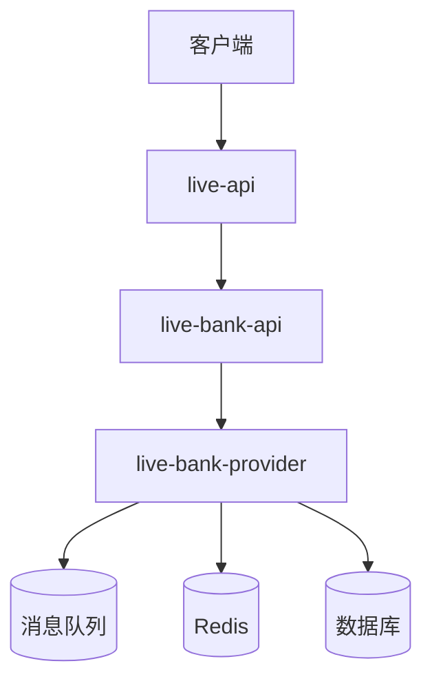
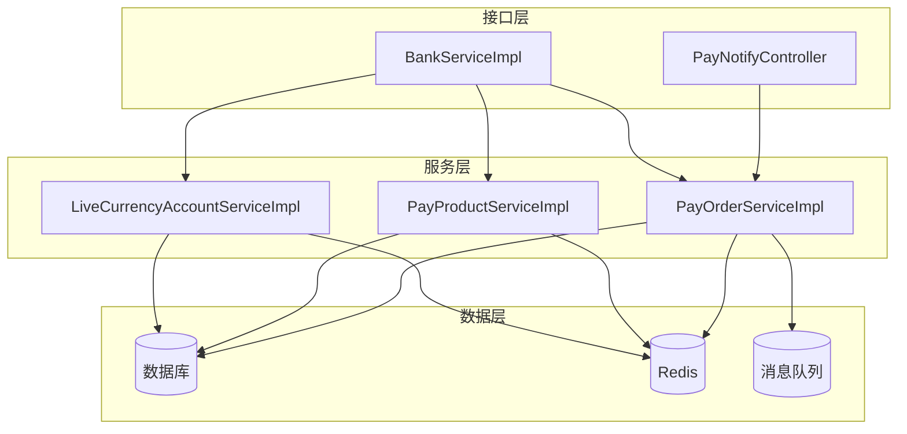
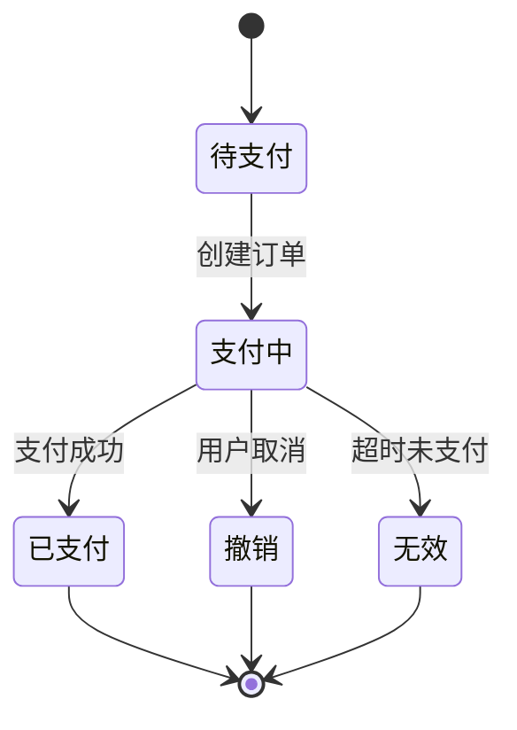
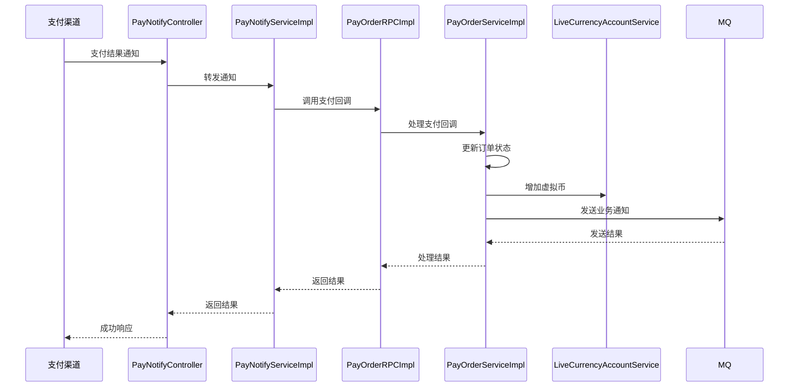
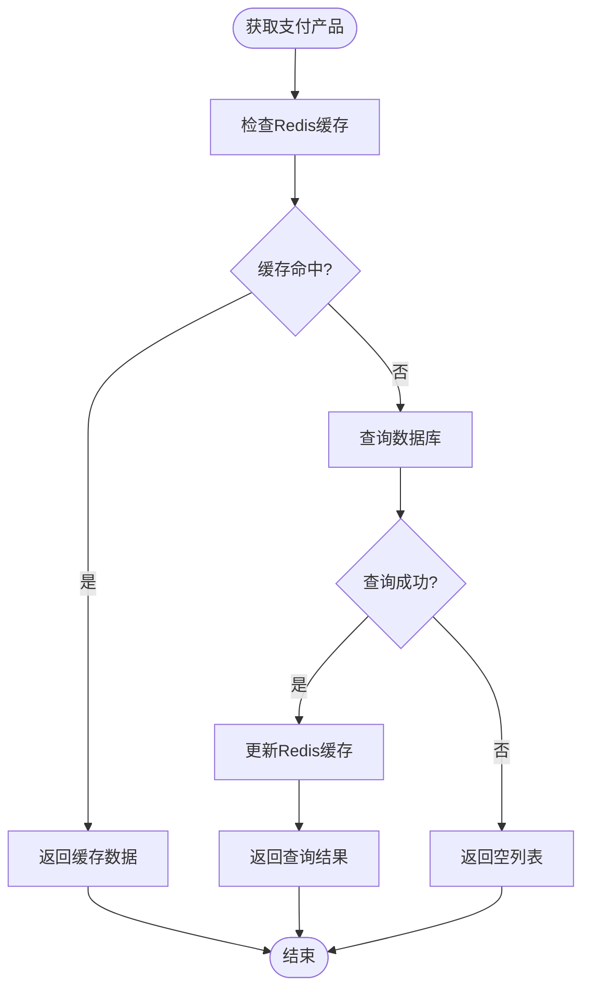
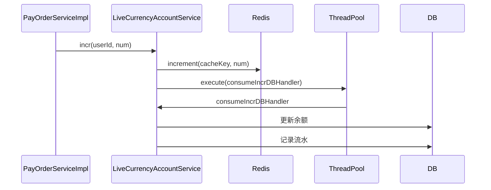
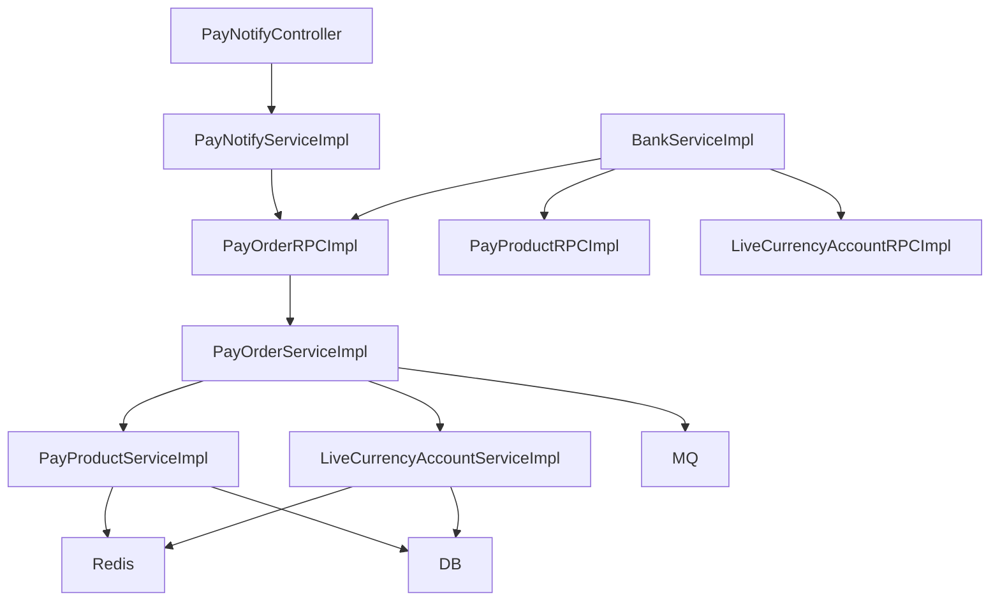

# 支付系统

<cite>
**本文档引用的文件**
- [PayOrderServiceImpl.java](file://live-bank-provider/src/main/java/com/logilong/live/bank/provider/service/impl/PayOrderServiceImpl.java)
- [PayNotifyController.java](file://live-bank-api/src/main/java/com/logilong/live/bank/api/controller/PayNotifyController.java)
- [PayNotifyServiceImpl.java](file://live-bank-api/src/main/java/com/logilong/live/bank/api/service/impl/PayNotifyServiceImpl.java)
- [PayOrderRPCImpl.java](file://live-bank-provider/src/main/java/com/logilong/live/bank/provider/rpc/PayOrderRPCImpl.java)
- [PayProductServiceImpl.java](file://live-bank-provider/src/main/java/com/logilong/live/bank/provider/service/impl/PayProductServiceImpl.java)
- [PayProductRPC.java](file://live-bank-interface/src/main/java/com/logilong/live/bank/interfaces/IPayProductRPC.java)
- [LiveCurrencyAccountServiceImpl.java](file://live-bank-provider/src/main/java/com/logilong/live/bank/provider/service/impl/LiveCurrencyAccountServiceImpl.java)
- [BankServiceImpl.java](file://live-api/src/main/java/com/logilong/live/api/service/impl/BankServiceImpl.java)
- [OrderStatusEnum.java](file://live-bank-interface/src/main/java/com/logilong/live/bank/constants/OrderStatusEnum.java)
- [PayChannelEnum.java](file://live-bank-interface/src/main/java/com/logilong/live/bank/constants/PayChannelEnum.java)
- [PayProductTypeEnum.java](file://live-bank-interface/src/main/java/com/logilong/live/bank/constants/PayProductTypeEnum.java)
- [WxPayNotifyVO.java](file://live-bank-api/src/main/java/com/logilong/live/bank/api/vo/WxPayNotifyVO.java)
- [PayOrderDTO.java](file://live-bank-interface/src/main/java/com/logilong/live/bank/dto/PayOrderDTO.java)
- [PayProductDTO.java](file://live-bank-interface/src/main/java/com/logilong/live/bank/dto/PayProductDTO.java)
- [LiveCurrencyAccountDTO.java](file://live-bank-interface/src/main/java/com/logilong/live/bank/dto/LiveCurrencyAccountDTO.java)
- [PayTopicPO.java](file://live-bank-provider/src/main/java/com/logilong/live/bank/provider/dao/po/PayTopicPO.java)
- [PayTopicServiceImpl.java](file://live-bank-provider/src/main/java/com/logilong/live/bank/provider/service/impl/PayTopicServiceImpl.java)
</cite>

## 目录
1. [引言](#引言)
2. [项目结构](#项目结构)
3. [核心组件](#核心组件)
4. [架构概述](#架构概述)
5. [详细组件分析](#详细组件分析)
6. [依赖分析](#依赖分析)
7. [性能考虑](#性能考虑)
8. [故障排除指南](#故障排除指南)
9. [结论](#结论)

## 引言
本文档深入解析支付服务的完整业务流程，涵盖支付订单创建、支付渠道对接（微信/支付宝）、支付结果回调处理等核心功能。详细说明PayOrderServiceImpl中订单状态机管理、幂等性控制、分布式事务处理机制。分析支付回调接口(PayNotifyController)的安全验证策略，包括签名验证、重复通知处理。阐述支付产品(PayProduct)的配置管理与缓存机制，以及与账户系统的余额变动集成。提供典型支付场景的时序图和代码示例，说明异常情况（如超时、失败）的处理方案。

## 项目结构
支付系统采用微服务架构，主要由以下几个模块组成：
- **live-bank-api**: 支付回调接口服务，处理来自支付渠道的异步通知
- **live-bank-provider**: 支付核心业务逻辑实现，包括订单管理、产品管理、账户管理等
- **live-bank-interface**: 定义支付服务的RPC接口契约
- **live-api**: 前端API服务，提供支付相关接口给客户端调用

**图源**
- [PayNotifyController.java](file://live-bank-api/src/main/java/com/logilong/live/bank/api/controller/PayNotifyController.java)
- [PayOrderServiceImpl.java](file://live-bank-provider/src/main/java/com/logilong/live/bank/provider/service/impl/PayOrderServiceImpl.java)

**节源**
- [PayNotifyController.java](file://live-bank-api/src/main/java/com/logilong/live/bank/api/controller/PayNotifyController.java)
- [PayOrderServiceImpl.java](file://live-bank-provider/src/main/java/com/logilong/live/bank/provider/service/impl/PayOrderServiceImpl.java)

## 核心组件
支付系统的核心组件包括支付订单服务、支付产品服务、虚拟币账户服务和支付回调服务。这些组件通过Dubbo RPC进行通信，确保服务间的解耦和可扩展性。

**节源**
- [PayOrderServiceImpl.java](file://live-bank-provider/src/main/java/com/logilong/live/bank/provider/service/impl/PayOrderServiceImpl.java)
- [PayProductServiceImpl.java](file://live-bank-provider/src/main/java/com/logilong/live/bank/provider/service/impl/PayProductServiceImpl.java)
- [LiveCurrencyAccountServiceImpl.java](file://live-bank-provider/src/main/java/com/logilong/live/bank/provider/service/impl/LiveCurrencyAccountServiceImpl.java)

## 架构概述
支付系统采用分层架构设计，从上到下分为接口层、服务层和数据层。接口层负责接收外部请求，服务层处理核心业务逻辑，数据层负责数据持久化和缓存。

**图源**
- [PayOrderServiceImpl.java](file://live-bank-provider/src/main/java/com/logilong/live/bank/provider/service/impl/PayOrderServiceImpl.java)
- [PayProductServiceImpl.java](file://live-bank-provider/src/main/java/com/logilong/live/bank/provider/service/impl/PayProductServiceImpl.java)
- [LiveCurrencyAccountServiceImpl.java](file://live-bank-provider/src/main/java/com/logilong/live/bank/provider/service/impl/LiveCurrencyAccountServiceImpl.java)

## 详细组件分析

### 支付订单服务分析
支付订单服务(PayOrderServiceImpl)是支付系统的核心，负责订单的全生命周期管理，包括订单创建、状态更新和支付回调处理。

#### 订单状态机管理
支付订单服务实现了完整的订单状态机，通过OrderStatusEnum枚举定义了订单的各个状态：待支付(0)、支付中(1)、已支付(2)、撤销(3)、无效(4)。状态转换通过updateOrderStatus方法实现，确保订单状态的正确流转。

**图源**
- [OrderStatusEnum.java](file://live-bank-interface/src/main/java/com/logilong/live/bank/constants/OrderStatusEnum.java)
- [PayOrderServiceImpl.java](file://live-bank-provider/src/main/java/com/logilong/live/bank/provider/service/impl/PayOrderServiceImpl.java)

#### 幂等性控制
支付订单服务通过UUID生成唯一的订单ID，确保订单创建的幂等性。在支付回调处理中，首先查询订单是否存在，如果订单不存在则返回失败，避免重复处理。

**节源**
- [PayOrderServiceImpl.java](file://live-bank-provider/src/main/java/com/logilong/live/bank/provider/service/impl/PayOrderServiceImpl.java#L52-L55)

#### 分布式事务处理
支付订单服务在处理支付回调时，采用最终一致性模式。首先更新订单状态为已支付，然后通过消息队列异步通知相关服务，确保主流程的高效执行。

**图源**
- [PayOrderServiceImpl.java](file://live-bank-provider/src/main/java/com/logilong/live/bank/provider/service/impl/PayOrderServiceImpl.java)
- [PayNotifyServiceImpl.java](file://live-bank-api/src/main/java/com/logilong/live/bank/api/service/impl/PayNotifyServiceImpl.java)

**节源**
- [PayOrderServiceImpl.java](file://live-bank-provider/src/main/java/com/logilong/live/bank/provider/service/impl/PayOrderServiceImpl.java#L76-L105)

### 支付回调接口安全验证
支付回调接口(PayNotifyController)通过多层安全验证确保回调请求的合法性和安全性。

#### 签名验证
虽然当前实现中未直接展示签名验证逻辑，但通过Dubbo RPC调用和参数校验确保了接口的安全性。在实际生产环境中，应增加支付渠道的签名验证机制。

#### 重复通知处理
支付回调服务通过查询订单状态来处理重复通知。如果订单已经处理过，则直接返回成功，避免重复处理。

**节源**
- [PayNotifyServiceImpl.java](file://live-bank-api/src/main/java/com/logilong/live/bank/api/service/impl/PayNotifyServiceImpl.java#L19-L25)

### 支付产品配置管理
支付产品服务(PayProductServiceImpl)负责管理支付产品的配置信息，并通过Redis缓存提高查询性能。

#### 缓存机制
支付产品服务采用两级缓存策略：首先查询Redis缓存，如果缓存中不存在则查询数据库并将结果写入缓存。对于批量查询，使用List结构存储；对于单个产品查询，使用Value结构存储。

**图源**
- [PayProductServiceImpl.java](file://live-bank-provider/src/main/java/com/logilong/live/bank/provider/service/impl/PayProductServiceImpl.java#L30-L54)
- [BankProviderCacheKeyBuilder.java](file://live-framework/live-framework-redis-starter/src/main/java/com/logilong/live/framework/redis/starter/key/BankProviderCacheKeyBuilder.java)

**节源**
- [PayProductServiceImpl.java](file://live-bank-provider/src/main/java/com/logilong/live/bank/provider/service/impl/PayProductServiceImpl.java)

### 账户系统余额变动集成
虚拟币账户服务(LiveCurrencyAccountServiceImpl)负责管理用户的虚拟币余额，并与支付系统集成。

#### 余额变动处理
当用户完成支付后，支付订单服务会调用虚拟币账户服务的incr方法增加用户的虚拟币余额。该操作采用异步处理模式，先更新Redis缓存，然后通过线程池异步更新数据库，确保高性能和最终一致性。

**图源**
- [LiveCurrencyAccountServiceImpl.java](file://live-bank-provider/src/main/java/com/logilong/live/bank/provider/service/impl/LiveCurrencyAccountServiceImpl.java#L55-L67)
- [PayOrderServiceImpl.java](file://live-bank-provider/src/main/java/com/logilong/live/bank/provider/service/impl/PayOrderServiceImpl.java#L122)

**节源**
- [LiveCurrencyAccountServiceImpl.java](file://live-bank-provider/src/main/java/com/logilong/live/bank/provider/service/impl/LiveCurrencyAccountServiceImpl.java)

## 依赖分析
支付系统各组件之间的依赖关系清晰，通过Dubbo RPC实现服务间的解耦。

**图源**
- [PayOrderServiceImpl.java](file://live-bank-provider/src/main/java/com/logilong/live/bank/provider/service/impl/PayOrderServiceImpl.java)
- [PayNotifyServiceImpl.java](file://live-bank-api/src/main/java/com/logilong/live/bank/api/service/impl/PayNotifyServiceImpl.java)
- [BankServiceImpl.java](file://live-api/src/main/java/com/logilong/live/api/service/impl/BankServiceImpl.java)

**节源**
- [PayOrderServiceImpl.java](file://live-bank-provider/src/main/java/com/logilong/live/bank/provider/service/impl/PayOrderServiceImpl.java)
- [PayNotifyServiceImpl.java](file://live-bank-api/src/main/java/com/logilong/live/bank/api/service/impl/PayNotifyServiceImpl.java)
- [BankServiceImpl.java](file://live-api/src/main/java/com/logilong/live/api/service/impl/BankServiceImpl.java)

## 性能考虑
支付系统在设计时充分考虑了性能因素，采用了多种优化策略：

1. **缓存优化**: 使用Redis缓存支付产品和用户余额信息，减少数据库查询压力
2. **异步处理**: 采用消息队列和线程池异步处理非核心业务，提高系统响应速度
3. **数据库优化**: 使用MyBatis-Plus进行数据库操作，支持分页查询和条件构造
4. **连接池**: 使用ShardingSphere进行数据源管理，提高数据库连接效率

## 故障排除指南
在支付系统运行过程中可能遇到的常见问题及解决方案：

1. **支付回调失败**: 检查支付渠道配置、网络连接和签名验证逻辑
2. **订单状态不一致**: 检查消息队列是否正常工作，确保最终一致性
3. **余额更新延迟**: 检查Redis缓存和数据库同步机制
4. **性能瓶颈**: 监控系统资源使用情况，考虑水平扩展服务实例

**节源**
- [PayOrderServiceImpl.java](file://live-bank-provider/src/main/java/com/logilong/live/bank/provider/service/impl/PayOrderServiceImpl.java)
- [LiveCurrencyAccountServiceImpl.java](file://live-bank-provider/src/main/java/com/logilong/live/bank/provider/service/impl/LiveCurrencyAccountServiceImpl.java)

## 结论
支付系统通过合理的架构设计和组件划分，实现了高可用、高性能和高安全性的支付服务。系统采用微服务架构，各组件职责清晰，通过Dubbo RPC进行通信，确保了系统的可扩展性和可维护性。通过缓存、异步处理和消息队列等技术手段，有效提升了系统性能和用户体验。未来可以进一步完善签名验证机制，增加更多的监控和告警功能，提高系统的稳定性和可靠性。