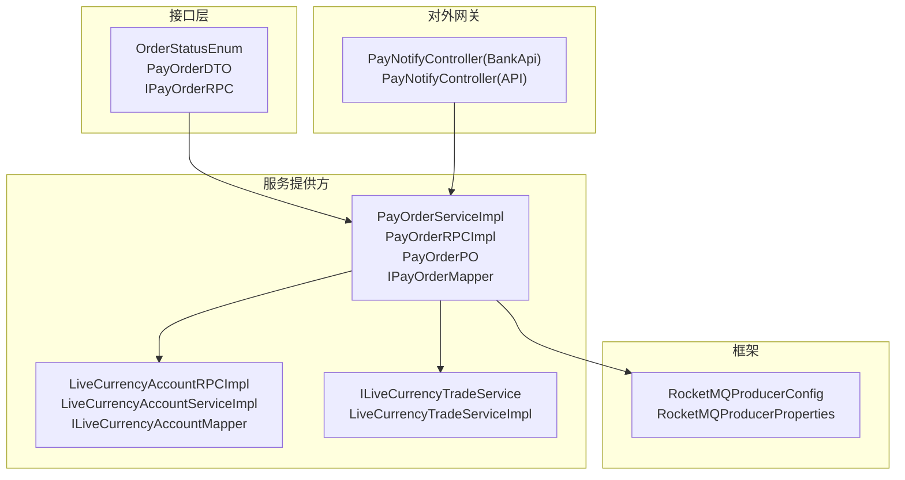
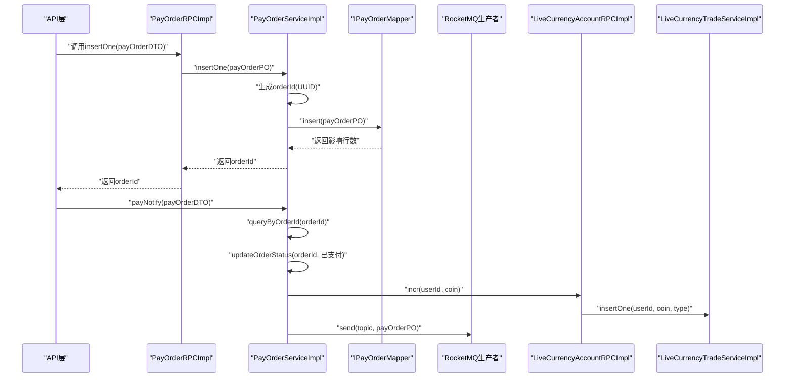
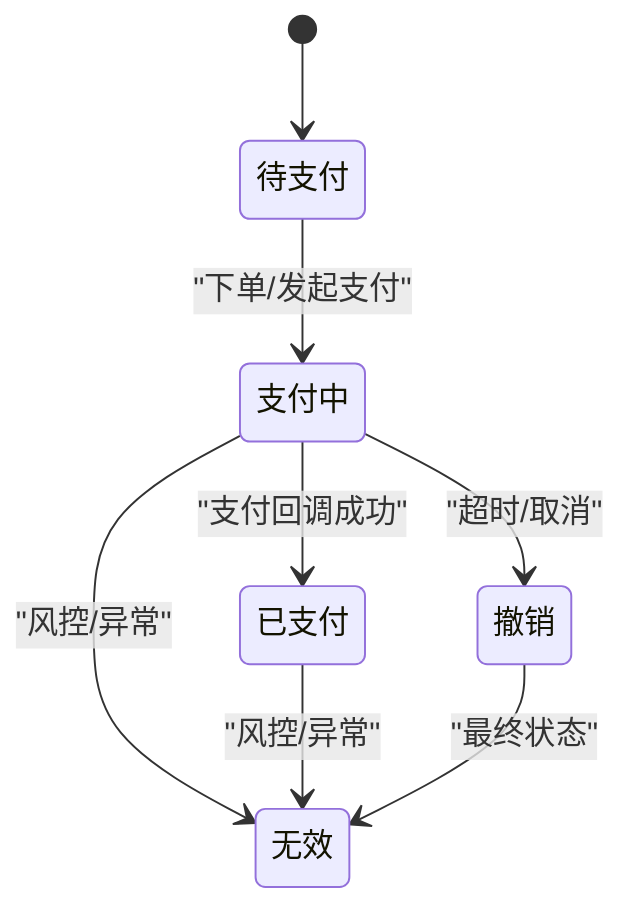
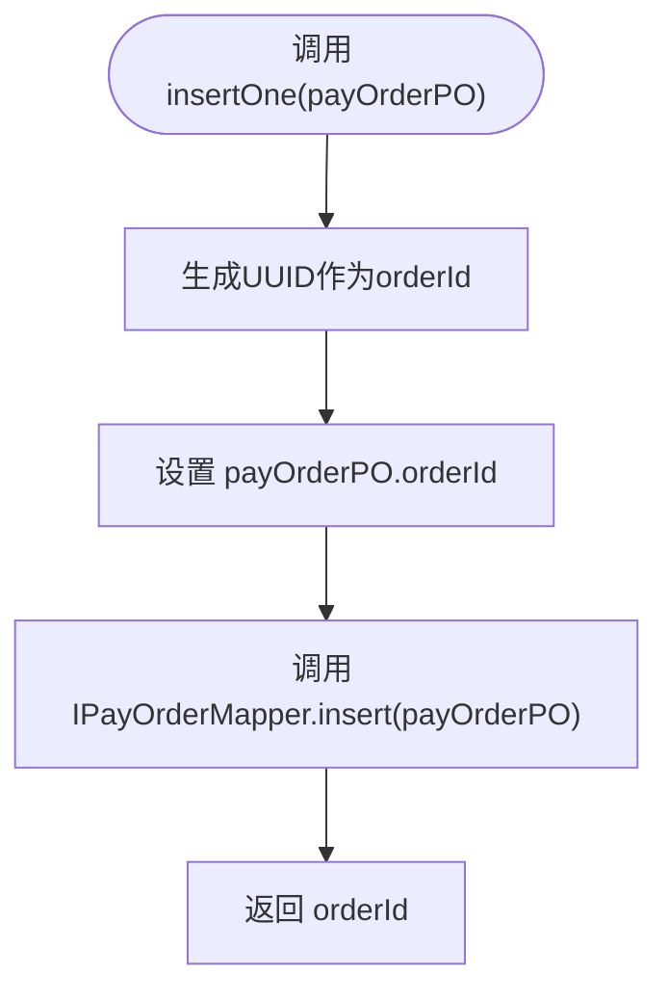
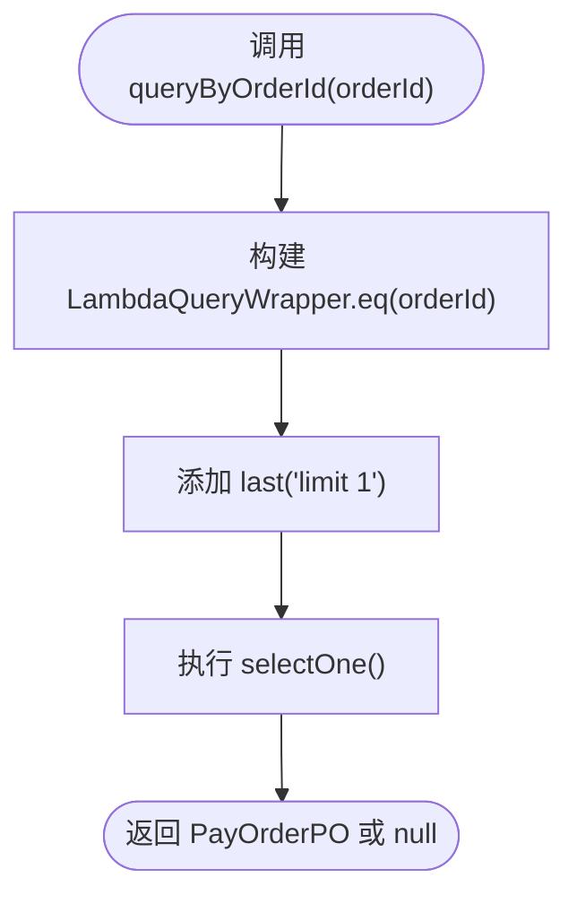
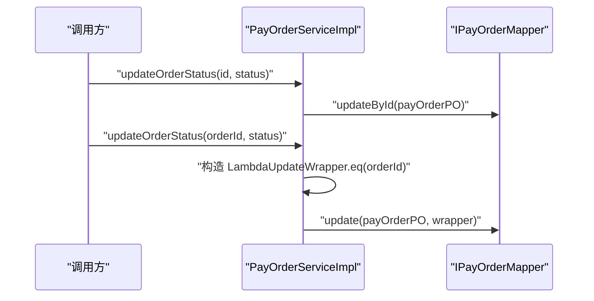
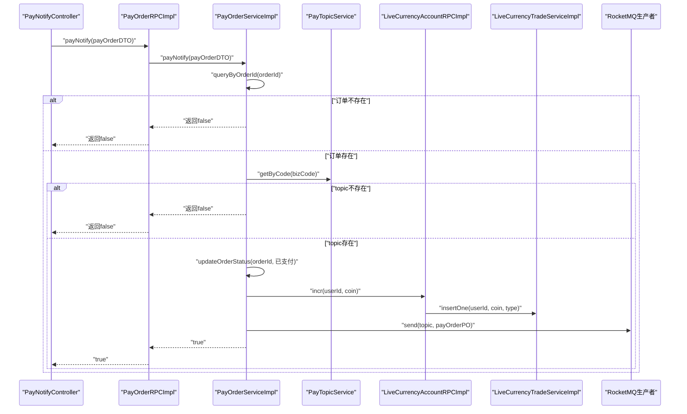
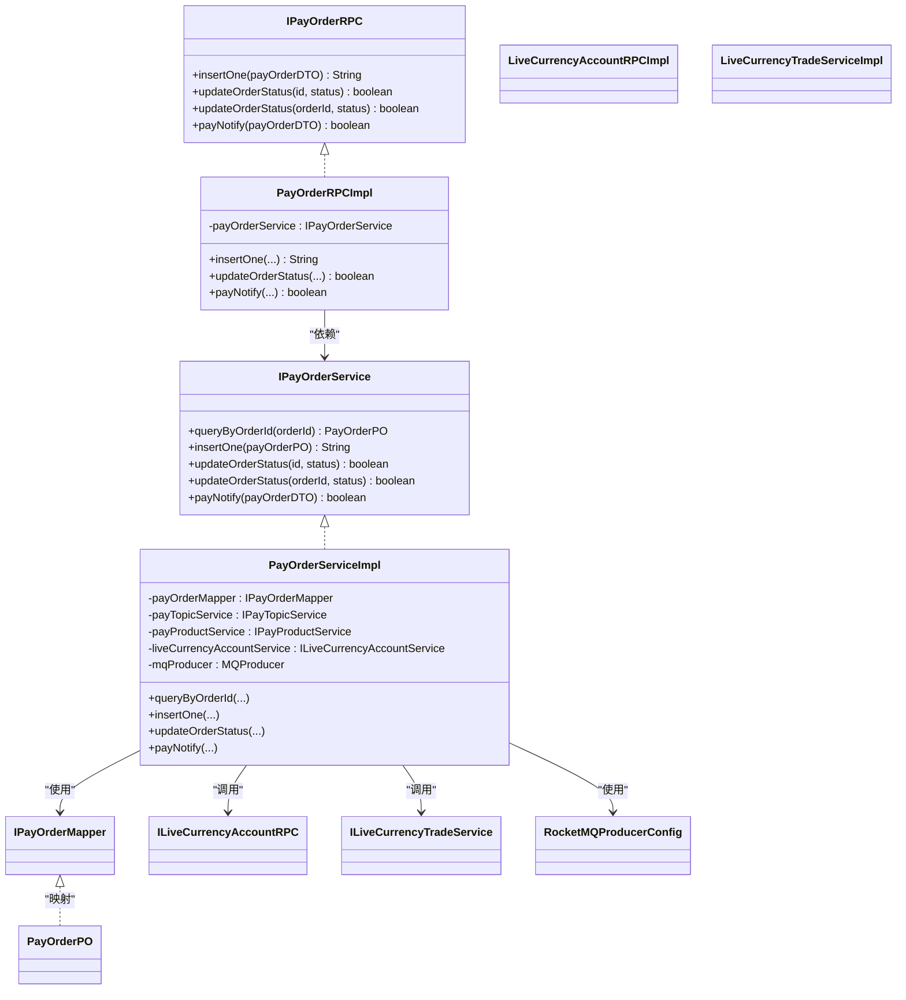

# 支付订单管理

<cite>
**本文引用的文件**
- [OrderStatusEnum.java](file://live-bank-interface/src/main/java/com/logilong/live/bank/constants/OrderStatusEnum.java)
- [PayOrderDTO.java](file://live-bank-interface/src/main/java/com/logilong/live/bank/dto/PayOrderDTO.java)
- [IPayOrderRPC.java](file://live-bank-interface/src/main/java/com/logilong/live/bank/interfaces/IPayOrderRPC.java)
- [PayOrderPO.java](file://live-bank-provider/src/main/java/com/logilong/live/bank/provider/dao/po/PayOrderPO.java)
- [IPayOrderMapper.java](file://live-bank-provider/src/main/java/com/logilong/live/bank/provider/dao/mapper/IPayOrderMapper.java)
- [PayOrderServiceImpl.java](file://live-bank-provider/src/main/java/com/logilong/live/bank/provider/service/impl/PayOrderServiceImpl.java)
- [PayOrderRPCImpl.java](file://live-bank-provider/src/main/java/com/logilong/live/bank/provider/rpc/PayOrderRPCImpl.java)
- [PayProductTypeEnum.java](file://live-bank-interface/src/main/java/com/logilong/live/bank/constants/PayProductTypeEnum.java)
- [ILiveCurrencyAccountService.java](file://live-bank-interface/src/main/java/com/logilong/live/bank/interfaces/ILiveCurrencyAccountRPC.java)
- [LiveCurrencyAccountRPCImpl.java](file://live-bank-provider/src/main/java/com/logilong/live/bank/provider/rpc/LiveCurrencyAccountRPCImpl.java)
- [LiveCurrencyAccountServiceImpl.java](file://live-bank-provider/src/main/java/com/logilong/live/bank/provider/service/impl/LiveCurrencyAccountServiceImpl.java)
- [ILiveCurrencyAccountMapper.java](file://live-bank-provider/src/main/java/com/logilong/live/bank/provider/dao/mapper/ILiveCurrencyAccountMapper.java)
- [ILiveCurrencyTradeService.java](file://live-bank-provider/src/main/java/com/logilong/live/bank/provider/service/ILiveCurrencyTradeService.java)
- [LiveCurrencyTradeServiceImpl.java](file://live-bank-provider/src/main/java/com/logilong/live/bank/provider/service/impl/LiveCurrencyTradeServiceImpl.java)
- [RocketMQProducerConfig.java](file://live-framework/live-framework-mq-starter/src/main/java/com/logilong/live/framework/mq/starter/producer/RocketMQProducerConfig.java)
- [RocketMQProducerProperties.java](file://live-framework/live-framework-mq-starter/src/main/java/com/logilong/live/framework/mq/starter/properties/RocketMQProducerProperties.java)
- [BankApiApplication.java](file://live-bank-api/src/main/java/com/logilong/live/bank/api/BankApiApplication.java)
- [PayNotifyController.java](file://live-bank-api/src/main/java/com/logilong/live/bank/api/controller/PayNotifyController.java)
- [PayNotifyServiceImpl.java](file://live-bank-api/src/main/java/com/logilong/live/bank/api/service/impl/PayNotifyServiceImpl.java)
- [BankServiceImpl.java](file://live-api/src/main/java/com/logilong/live/api/service/impl/BankServiceImpl.java)
- [PayNotifyController.java](file://live-api/src/main/java/com/logilong/live/api/controller/PayNotifyController.java)
- [PayOrderMapper.java](file://live-bank-provider/src/main/java/com/logilong/live/bank/provider/dao/mapper/IPayOrderMapper.java)
- [PayOrderPO.java](file://live-bank-provider/src/main/java/com/logilong/live/bank/provider/dao/po/PayOrderPO.java)
</cite>

## 目录
1. [简介](#简介)
2. [项目结构](#项目结构)
3. [核心组件](#核心组件)
4. [架构总览](#架构总览)
5. [详细组件分析](#详细组件分析)
6. [依赖关系分析](#依赖关系分析)
7. [性能考量](#性能考量)
8. [故障排查指南](#故障排查指南)
9. [结论](#结论)
10. [附录](#附录)

## 简介
本文件围绕支付订单的全生命周期管理展开，重点覆盖以下方面：
- 订单创建：insertOne方法如何生成唯一订单ID并持久化
- 订单查询与索引优化：queryByOrderId的实现与建议
- 订单状态机：OrderStatusEnum的状态定义与流转规则
- 状态更新：updateOrderStatus的两种使用方式与MyBatis-Plus条件更新
- 与其他模块协作：账户系统、消息队列的集成与异步通知
- 异常处理与幂等性保障：日志、错误码、重试与幂等设计

## 项目结构
支付订单相关代码主要分布在以下模块：
- 接口层（bank-interface）：定义订单状态枚举、DTO、RPC接口
- 服务提供方（bank-provider）：实现订单服务、RPC适配、DAO与PO
- 账户模块（account-interface/account-provider）：虚拟币账户RPC与服务
- 框架模块（framework）：RocketMQ生产者配置
- 对外网关（bank-api、api）：支付回调控制器与调用链路

图表来源
- [OrderStatusEnum.java](file://live-bank-interface/src/main/java/com/logilong/live/bank/constants/OrderStatusEnum.java#L1-L24)
- [PayOrderDTO.java](file://live-bank-interface/src/main/java/com/logilong/live/bank/dto/PayOrderDTO.java#L1-L24)
- [IPayOrderRPC.java](file://live-bank-interface/src/main/java/com/logilong/live/bank/interfaces/IPayOrderRPC.java#L1-L31)
- [PayOrderServiceImpl.java](file://live-bank-provider/src/main/java/com/logilong/live/bank/provider/service/impl/PayOrderServiceImpl.java#L1-L126)
- [PayOrderRPCImpl.java](file://live-bank-provider/src/main/java/com/logilong/live/bank/provider/rpc/PayOrderRPCImpl.java#L1-L37)
- [PayOrderPO.java](file://live-bank-provider/src/main/java/com/logilong/live/bank/provider/dao/po/PayOrderPO.java#L1-L26)
- [IPayOrderMapper.java](file://live-bank-provider/src/main/java/com/logilong/live/bank/provider/dao/mapper/IPayOrderMapper.java#L1-L10)
- [LiveCurrencyAccountRPCImpl.java](file://live-bank-provider/src/main/java/com/logilong/live/bank/provider/rpc/LiveCurrencyAccountRPCImpl.java#L1-L42)
- [LiveCurrencyAccountServiceImpl.java](file://live-bank-provider/src/main/java/com/logilong/live/bank/provider/service/impl/LiveCurrencyAccountServiceImpl.java#L1-L61)
- [ILiveCurrencyAccountMapper.java](file://live-bank-provider/src/main/java/com/logilong/live/bank/provider/dao/mapper/ILiveCurrencyAccountMapper.java#L1-L21)
- [ILiveCurrencyTradeService.java](file://live-bank-provider/src/main/java/com/logilong/live/bank/provider/service/ILiveCurrencyTradeService.java#L1-L6)
- [LiveCurrencyTradeServiceImpl.java](file://live-bank-provider/src/main/java/com/logilong/live/bank/provider/service/impl/LiveCurrencyTradeServiceImpl.java#L1-L35)
- [RocketMQProducerConfig.java](file://live-framework/live-framework-mq-starter/src/main/java/com/logilong/live/framework/mq/starter/producer/RocketMQProducerConfig.java#L1-L52)
- [RocketMQProducerProperties.java](file://live-framework/live-framework-mq-starter/src/main/java/com/logilong/live/framework/mq/starter/properties/RocketMQProducerProperties.java#L1-L18)
- [PayNotifyController.java](file://live-bank-api/src/main/java/com/logilong/live/bank/api/controller/PayNotifyController.java#L1-L200)
- [PayNotifyController.java](file://live-api/src/main/java/com/logilong/live/api/controller/PayNotifyController.java#L1-L200)

章节来源
- [OrderStatusEnum.java](file://live-bank-interface/src/main/java/com/logilong/live/bank/constants/OrderStatusEnum.java#L1-L24)
- [PayOrderDTO.java](file://live-bank-interface/src/main/java/com/logilong/live/bank/dto/PayOrderDTO.java#L1-L24)
- [IPayOrderRPC.java](file://live-bank-interface/src/main/java/com/logilong/live/bank/interfaces/IPayOrderRPC.java#L1-L31)
- [PayOrderServiceImpl.java](file://live-bank-provider/src/main/java/com/logilong/live/bank/provider/service/impl/PayOrderServiceImpl.java#L1-L126)
- [PayOrderRPCImpl.java](file://live-bank-provider/src/main/java/com/logilong/live/bank/provider/rpc/PayOrderRPCImpl.java#L1-L37)
- [PayOrderPO.java](file://live-bank-provider/src/main/java/com/logilong/live/bank/provider/dao/po/PayOrderPO.java#L1-L26)
- [IPayOrderMapper.java](file://live-bank-provider/src/main/java/com/logilong/live/bank/provider/dao/mapper/IPayOrderMapper.java#L1-L10)
- [LiveCurrencyAccountRPCImpl.java](file://live-bank-provider/src/main/java/com/logilong/live/bank/provider/rpc/LiveCurrencyAccountRPCImpl.java#L1-L42)
- [LiveCurrencyAccountServiceImpl.java](file://live-bank-provider/src/main/java/com/logilong/live/bank/provider/service/impl/LiveCurrencyAccountServiceImpl.java#L1-L61)
- [ILiveCurrencyAccountMapper.java](file://live-bank-provider/src/main/java/com/logilong/live/bank/provider/dao/mapper/ILiveCurrencyAccountMapper.java#L1-L21)
- [ILiveCurrencyTradeService.java](file://live-bank-provider/src/main/java/com/logilong/live/bank/provider/service/ILiveCurrencyTradeService.java#L1-L6)
- [LiveCurrencyTradeServiceImpl.java](file://live-bank-provider/src/main/java/com/logilong/live/bank/provider/service/impl/LiveCurrencyTradeServiceImpl.java#L1-L35)
- [RocketMQProducerConfig.java](file://live-framework/live-framework-mq-starter/src/main/java/com/logilong/live/framework/mq/starter/producer/RocketMQProducerConfig.java#L1-L52)
- [RocketMQProducerProperties.java](file://live-framework/live-framework-mq-starter/src/main/java/com/logilong/live/framework/mq/starter/properties/RocketMQProducerProperties.java#L1-L18)
- [PayNotifyController.java](file://live-bank-api/src/main/java/com/logilong/live/bank/api/controller/PayNotifyController.java#L1-L200)
- [PayNotifyController.java](file://live-api/src/main/java/com/logilong/live/api/controller/PayNotifyController.java#L1-L200)

## 核心组件
- 订单状态枚举：定义待支付、支付中、已支付、撤销、无效五种状态，用于统一状态语义与校验
- 订单DTO/PO：承载订单字段，PO映射数据库表结构
- 订单服务接口与实现：提供查询、插入、状态更新、支付回调处理
- RPC适配层：将DTO转换为PO，暴露服务接口
- 账户RPC与服务：虚拟币账户的增减与流水记录
- RocketMQ生产者：异步通知其他模块

章节来源
- [OrderStatusEnum.java](file://live-bank-interface/src/main/java/com/logilong/live/bank/constants/OrderStatusEnum.java#L1-L24)
- [PayOrderDTO.java](file://live-bank-interface/src/main/java/com/logilong/live/bank/dto/PayOrderDTO.java#L1-L24)
- [PayOrderPO.java](file://live-bank-provider/src/main/java/com/logilong/live/bank/provider/dao/po/PayOrderPO.java#L1-L26)
- [IPayOrderRPC.java](file://live-bank-interface/src/main/java/com/logilong/live/bank/interfaces/IPayOrderRPC.java#L1-L31)
- [PayOrderServiceImpl.java](file://live-bank-provider/src/main/java/com/logilong/live/bank/provider/service/impl/PayOrderServiceImpl.java#L1-L126)
- [PayOrderRPCImpl.java](file://live-bank-provider/src/main/java/com/logilong/live/bank/provider/rpc/PayOrderRPCImpl.java#L1-L37)
- [ILiveCurrencyAccountService.java](file://live-bank-interface/src/main/java/com/logilong/live/bank/interfaces/ILiveCurrencyAccountRPC.java#L1-L53)
- [LiveCurrencyAccountRPCImpl.java](file://live-bank-provider/src/main/java/com/logilong/live/bank/provider/rpc/LiveCurrencyAccountRPCImpl.java#L1-L42)
- [LiveCurrencyAccountServiceImpl.java](file://live-bank-provider/src/main/java/com/logilong/live/bank/provider/service/impl/LiveCurrencyAccountServiceImpl.java#L1-L61)
- [RocketMQProducerConfig.java](file://live-framework/live-framework-mq-starter/src/main/java/com/logilong/live/framework/mq/starter/producer/RocketMQProducerConfig.java#L1-L52)

## 架构总览
支付订单从创建到完成的端到端流程如下：

图表来源
- [PayOrderRPCImpl.java](file://live-bank-provider/src/main/java/com/logilong/live/bank/provider/rpc/PayOrderRPCImpl.java#L1-L37)
- [PayOrderServiceImpl.java](file://live-bank-provider/src/main/java/com/logilong/live/bank/provider/service/impl/PayOrderServiceImpl.java#L1-L126)
- [IPayOrderMapper.java](file://live-bank-provider/src/main/java/com/logilong/live/bank/provider/dao/mapper/IPayOrderMapper.java#L1-L10)
- [LiveCurrencyAccountRPCImpl.java](file://live-bank-provider/src/main/java/com/logilong/live/bank/provider/rpc/LiveCurrencyAccountRPCImpl.java#L1-L42)
- [LiveCurrencyTradeServiceImpl.java](file://live-bank-provider/src/main/java/com/logilong/live/bank/provider/service/impl/LiveCurrencyTradeServiceImpl.java#L1-L35)
- [RocketMQProducerConfig.java](file://live-framework/live-framework-mq-starter/src/main/java/com/logilong/live/framework/mq/starter/producer/RocketMQProducerConfig.java#L1-L52)

## 详细组件分析

### 订单状态机设计与流转
- 状态定义：待支付、支付中、已支付、撤销、无效
- 流转规则：
  - 待支付 -> 支付中：下单后进入支付中（由上游业务控制）
  - 支付中 -> 已支付：支付回调触发，更新为已支付
  - 支付中 -> 撤销：超时或取消触发
  - 支付中/已支付 -> 无效：异常或风控触发
- 使用建议：
  - 在支付回调中仅允许从“支付中”或“待支付”更新为“已支付”
  - 撤销与无效需配合风控策略，避免重复撤销

图表来源
- [OrderStatusEnum.java](file://live-bank-interface/src/main/java/com/logilong/live/bank/constants/OrderStatusEnum.java#L1-L24)

章节来源
- [OrderStatusEnum.java](file://live-bank-interface/src/main/java/com/logilong/live/bank/constants/OrderStatusEnum.java#L1-L24)

### 订单创建：insertOne方法与唯一ID生成
- 唯一ID生成：使用UUID生成orderId并设置到PO
- 持久化：通过IPayOrderMapper.insert写入数据库
- 返回值：返回生成的orderId，供上层使用

图表来源
- [PayOrderServiceImpl.java](file://live-bank-provider/src/main/java/com/logilong/live/bank/provider/service/impl/PayOrderServiceImpl.java#L50-L56)
- [IPayOrderMapper.java](file://live-bank-provider/src/main/java/com/logilong/live/bank/provider/dao/mapper/IPayOrderMapper.java#L1-L10)

章节来源
- [PayOrderServiceImpl.java](file://live-bank-provider/src/main/java/com/logilong/live/bank/provider/service/impl/PayOrderServiceImpl.java#L50-L56)
- [IPayOrderMapper.java](file://live-bank-provider/src/main/java/com/logilong/live/bank/provider/dao/mapper/IPayOrderMapper.java#L1-L10)

### 订单查询：queryByOrderId与索引优化
- 查询逻辑：按orderId精确查询，使用LambdaQueryWrapper并限制返回一条
- 索引优化建议：
  - 在数据库表t_pay_order上为orderId建立唯一索引，确保查询高效且具备幂等保障
  - 若存在高频复合查询（如userId+status），可考虑联合索引

图表来源
- [PayOrderServiceImpl.java](file://live-bank-provider/src/main/java/com/logilong/live/bank/provider/service/impl/PayOrderServiceImpl.java#L43-L48)
- [IPayOrderMapper.java](file://live-bank-provider/src/main/java/com/logilong/live/bank/provider/dao/mapper/IPayOrderMapper.java#L1-L10)

章节来源
- [PayOrderServiceImpl.java](file://live-bank-provider/src/main/java/com/logilong/live/bank/provider/service/impl/PayOrderServiceImpl.java#L43-L48)
- [PayOrderPO.java](file://live-bank-provider/src/main/java/com/logilong/live/bank/provider/dao/po/PayOrderPO.java#L1-L26)

### 状态更新：updateOrderStatus的两种方式与条件更新
- 主键ID更新：updateOrderStatus(Long id, Integer status)，直接按主键更新
- 订单号更新：updateOrderStatus(String orderId, Integer status)，使用LambdaUpdateWrapper按orderId条件更新
- 条件更新要点：
  - 使用LambdaUpdateWrapper.eq限定条件，避免误更新
  - 建议在orderId上建立唯一索引，保证更新命中唯一索引，减少锁竞争

图表来源
- [PayOrderServiceImpl.java](file://live-bank-provider/src/main/java/com/logilong/live/bank/provider/service/impl/PayOrderServiceImpl.java#L58-L73)
- [IPayOrderMapper.java](file://live-bank-provider/src/main/java/com/logilong/live/bank/provider/dao/mapper/IPayOrderMapper.java#L1-L10)

章节来源
- [PayOrderServiceImpl.java](file://live-bank-provider/src/main/java/com/logilong/live/bank/provider/service/impl/PayOrderServiceImpl.java#L58-L73)
- [IPayOrderMapper.java](file://live-bank-provider/src/main/java/com/logilong/live/bank/provider/dao/mapper/IPayOrderMapper.java#L1-L10)

### 支付回调与异步通知：payNotify流程
- 校验：先按orderId查询订单是否存在；不存在则记录错误并返回失败
- 业务校验：根据bizCode查询topic是否存在
- 处理：将订单状态更新为“已支付”，并根据商品类型对虚拟币账户进行充值
- 通知：将订单PO序列化后发送到RocketMQ指定topic，异步通知下游模块

图表来源
- [PayOrderServiceImpl.java](file://live-bank-provider/src/main/java/com/logilong/live/bank/provider/service/impl/PayOrderServiceImpl.java#L75-L125)
- [PayOrderRPCImpl.java](file://live-bank-provider/src/main/java/com/logilong/live/bank/provider/rpc/PayOrderRPCImpl.java#L1-L37)
- [PayNotifyController.java](file://live-bank-api/src/main/java/com/logilong/live/bank/api/controller/PayNotifyController.java#L1-L200)
- [LiveCurrencyAccountRPCImpl.java](file://live-bank-provider/src/main/java/com/logilong/live/bank/provider/rpc/LiveCurrencyAccountRPCImpl.java#L1-L42)
- [LiveCurrencyTradeServiceImpl.java](file://live-bank-provider/src/main/java/com/logilong/live/bank/provider/service/impl/LiveCurrencyTradeServiceImpl.java#L1-L35)
- [RocketMQProducerConfig.java](file://live-framework/live-framework-mq-starter/src/main/java/com/logilong/live/framework/mq/starter/producer/RocketMQProducerConfig.java#L1-L52)

章节来源
- [PayOrderServiceImpl.java](file://live-bank-provider/src/main/java/com/logilong/live/bank/provider/service/impl/PayOrderServiceImpl.java#L75-L125)
- [PayOrderRPCImpl.java](file://live-bank-provider/src/main/java/com/logilong/live/bank/provider/rpc/PayOrderRPCImpl.java#L1-L37)
- [PayNotifyController.java](file://live-bank-api/src/main/java/com/logilong/live/bank/api/controller/PayNotifyController.java#L1-L200)
- [LiveCurrencyAccountRPCImpl.java](file://live-bank-provider/src/main/java/com/logilong/live/bank/provider/rpc/LiveCurrencyAccountRPCImpl.java#L1-L42)
- [LiveCurrencyTradeServiceImpl.java](file://live-bank-provider/src/main/java/com/logilong/live/bank/provider/service/impl/LiveCurrencyTradeServiceImpl.java#L1-L35)
- [RocketMQProducerConfig.java](file://live-framework/live-framework-mq-starter/src/main/java/com/logilong/live/framework/mq/starter/producer/RocketMQProducerConfig.java#L1-L52)

### 与其他模块的协同
- 账户系统（虚拟币）：
  - 充值类型判断：当商品类型为直播币时，调用账户RPC进行余额增加
  - 交易流水：调用交易服务插入流水记录
- 消息队列：
  - 回调成功后，将订单PO发送到对应topic，异步通知下游关注的服务
  - 生产者配置包含超时、重试次数、线程池等参数，确保可靠性

章节来源
- [PayProductTypeEnum.java](file://live-bank-interface/src/main/java/com/logilong/live/bank/constants/PayProductTypeEnum.java#L1-L17)
- [PayOrderServiceImpl.java](file://live-bank-provider/src/main/java/com/logilong/live/bank/provider/service/impl/PayOrderServiceImpl.java#L108-L125)
- [LiveCurrencyAccountRPCImpl.java](file://live-bank-provider/src/main/java/com/logilong/live/bank/provider/rpc/LiveCurrencyAccountRPCImpl.java#L1-L42)
- [LiveCurrencyTradeServiceImpl.java](file://live-bank-provider/src/main/java/com/logilong/live/bank/provider/service/impl/LiveCurrencyTradeServiceImpl.java#L1-L35)
- [RocketMQProducerConfig.java](file://live-framework/live-framework-mq-starter/src/main/java/com/logilong/live/framework/mq/starter/producer/RocketMQProducerConfig.java#L1-L52)

## 依赖关系分析
- 接口与实现：
  - IPayOrderRPC定义对外RPC接口
  - PayOrderRPCImpl实现RPC适配，委托IPayOrderService
  - IPayOrderService定义服务接口，PayOrderServiceImpl提供实现
- 数据访问：
  - IPayOrderMapper继承BaseMapper，提供通用CRUD能力
  - PayOrderPO映射t_pay_order表
- 外部依赖：
  - RocketMQ生产者通过配置类注入
  - 账户RPC与交易服务通过接口隔离

图表来源
- [IPayOrderRPC.java](file://live-bank-interface/src/main/java/com/logilong/live/bank/interfaces/IPayOrderRPC.java#L1-L31)
- [PayOrderRPCImpl.java](file://live-bank-provider/src/main/java/com/logilong/live/bank/provider/rpc/PayOrderRPCImpl.java#L1-L37)
- [IPayOrderService.java](file://live-bank-provider/src/main/java/com/logilong/live/bank/provider/service/IPayOrderService.java#L1-L31)
- [PayOrderServiceImpl.java](file://live-bank-provider/src/main/java/com/logilong/live/bank/provider/service/impl/PayOrderServiceImpl.java#L1-L126)
- [IPayOrderMapper.java](file://live-bank-provider/src/main/java/com/logilong/live/bank/provider/dao/mapper/IPayOrderMapper.java#L1-L10)
- [PayOrderPO.java](file://live-bank-provider/src/main/java/com/logilong/live/bank/provider/dao/po/PayOrderPO.java#L1-L26)
- [ILiveCurrencyAccountService.java](file://live-bank-interface/src/main/java/com/logilong/live/bank/interfaces/ILiveCurrencyAccountRPC.java#L1-L53)
- [LiveCurrencyAccountRPCImpl.java](file://live-bank-provider/src/main/java/com/logilong/live/bank/provider/rpc/LiveCurrencyAccountRPCImpl.java#L1-L42)
- [ILiveCurrencyTradeService.java](file://live-bank-provider/src/main/java/com/logilong/live/bank/provider/service/ILiveCurrencyTradeService.java#L1-L6)
- [LiveCurrencyTradeServiceImpl.java](file://live-bank-provider/src/main/java/com/logilong/live/bank/provider/service/impl/LiveCurrencyTradeServiceImpl.java#L1-L35)
- [RocketMQProducerConfig.java](file://live-framework/live-framework-mq-starter/src/main/java/com/logilong/live/framework/mq/starter/producer/RocketMQProducerConfig.java#L1-L52)

章节来源
- [IPayOrderRPC.java](file://live-bank-interface/src/main/java/com/logilong/live/bank/interfaces/IPayOrderRPC.java#L1-L31)
- [PayOrderRPCImpl.java](file://live-bank-provider/src/main/java/com/logilong/live/bank/provider/rpc/PayOrderRPCImpl.java#L1-L37)
- [IPayOrderService.java](file://live-bank-provider/src/main/java/com/logilong/live/bank/provider/service/IPayOrderService.java#L1-L31)
- [PayOrderServiceImpl.java](file://live-bank-provider/src/main/java/com/logilong/live/bank/provider/service/impl/PayOrderServiceImpl.java#L1-L126)
- [IPayOrderMapper.java](file://live-bank-provider/src/main/java/com/logilong/live/bank/provider/dao/mapper/IPayOrderMapper.java#L1-L10)
- [PayOrderPO.java](file://live-bank-provider/src/main/java/com/logilong/live/bank/provider/dao/po/PayOrderPO.java#L1-L26)
- [ILiveCurrencyAccountService.java](file://live-bank-interface/src/main/java/com/logilong/live/bank/interfaces/ILiveCurrencyAccountRPC.java#L1-L53)
- [LiveCurrencyAccountRPCImpl.java](file://live-bank-provider/src/main/java/com/logilong/live/bank/provider/rpc/LiveCurrencyAccountRPCImpl.java#L1-L42)
- [ILiveCurrencyTradeService.java](file://live-bank-provider/src/main/java/com/logilong/live/bank/provider/service/ILiveCurrencyTradeService.java#L1-L6)
- [LiveCurrencyTradeServiceImpl.java](file://live-bank-provider/src/main/java/com/logilong/live/bank/provider/service/impl/LiveCurrencyTradeServiceImpl.java#L1-L35)
- [RocketMQProducerConfig.java](file://live-framework/live-framework-mq-starter/src/main/java/com/logilong/live/framework/mq/starter/producer/RocketMQProducerConfig.java#L1-L52)

## 性能考量
- 唯一ID生成：UUID具备全局唯一性，但可能带来索引碎片，建议在业务层引入有序ID生成器以提升写入性能
- 查询优化：为orderId建立唯一索引，避免全表扫描
- 更新优化：使用LambdaUpdateWrapper限定条件，确保走唯一索引
- 并发与事务：账户余额更新建议采用分布式锁或数据库层面的原子更新，避免超卖
- MQ可靠性：合理配置发送超时、重试次数与异步线程池，确保回调通知可靠投递

## 故障排查指南
- 支付回调失败：
  - 检查orderId是否正确传入，确认数据库是否存在该订单
  - 校验bizCode对应的topic是否存在
  - 查看RocketMQ生产者配置与网络连通性
- 账户余额未增加：
  - 确认商品类型是否为直播币
  - 检查账户RPC调用链路与交易流水插入情况
- 幂等性问题：
  - 通过orderId唯一索引与回调幂等校验，避免重复处理
  - 对外回调接口应支持重复调用而不产生副作用

章节来源
- [PayOrderServiceImpl.java](file://live-bank-provider/src/main/java/com/logilong/live/bank/provider/service/impl/PayOrderServiceImpl.java#L75-L125)
- [RocketMQProducerConfig.java](file://live-framework/live-framework-mq-starter/src/main/java/com/logilong/live/framework/mq/starter/producer/RocketMQProducerConfig.java#L1-L52)

## 结论
本方案通过清晰的状态机、稳定的唯一ID生成、严格的条件更新与可靠的异步通知，实现了支付订单的全生命周期管理。建议在生产环境中进一步完善索引策略、并发控制与幂等保障，以提升整体性能与稳定性。

## 附录
- 关键路径参考：
  - 订单创建：[insertOne](file://live-bank-provider/src/main/java/com/logilong/live/bank/provider/service/impl/PayOrderServiceImpl.java#L50-L56)
  - 订单查询：[queryByOrderId](file://live-bank-provider/src/main/java/com/logilong/live/bank/provider/service/impl/PayOrderServiceImpl.java#L43-L48)
  - 状态更新（主键）：[updateOrderStatus(id)](file://live-bank-provider/src/main/java/com/logilong/live/bank/provider/service/impl/PayOrderServiceImpl.java#L58-L64)
  - 状态更新（订单号）：[updateOrderStatus(orderId)](file://live-bank-provider/src/main/java/com/logilong/live/bank/provider/service/impl/PayOrderServiceImpl.java#L66-L73)
  - 支付回调：[payNotify](file://live-bank-provider/src/main/java/com/logilong/live/bank/provider/service/impl/PayOrderServiceImpl.java#L75-L125)
  - RPC适配：[PayOrderRPCImpl](file://live-bank-provider/src/main/java/com/logilong/live/bank/provider/rpc/PayOrderRPCImpl.java#L1-L37)
  - 账户RPC：[LiveCurrencyAccountRPCImpl](file://live-bank-provider/src/main/java/com/logilong/live/bank/provider/rpc/LiveCurrencyAccountRPCImpl.java#L1-L42)
  - MQ配置：[RocketMQProducerConfig](file://live-framework/live-framework-mq-starter/src/main/java/com/logilong/live/framework/mq/starter/producer/RocketMQProducerConfig.java#L1-L52)