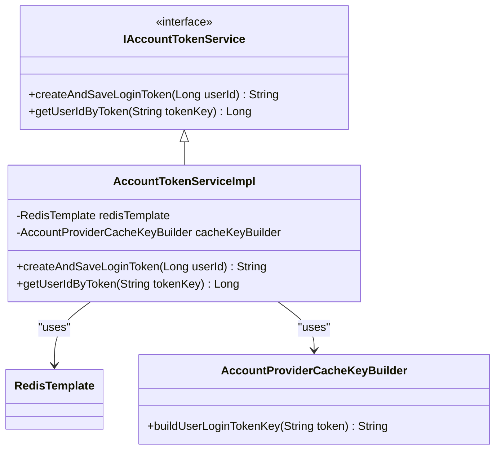
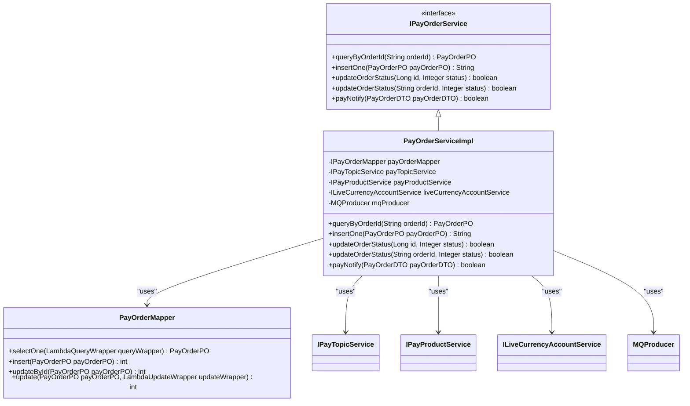
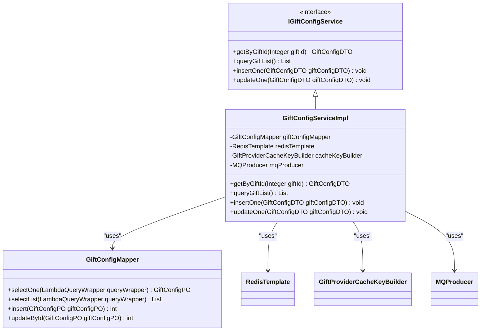
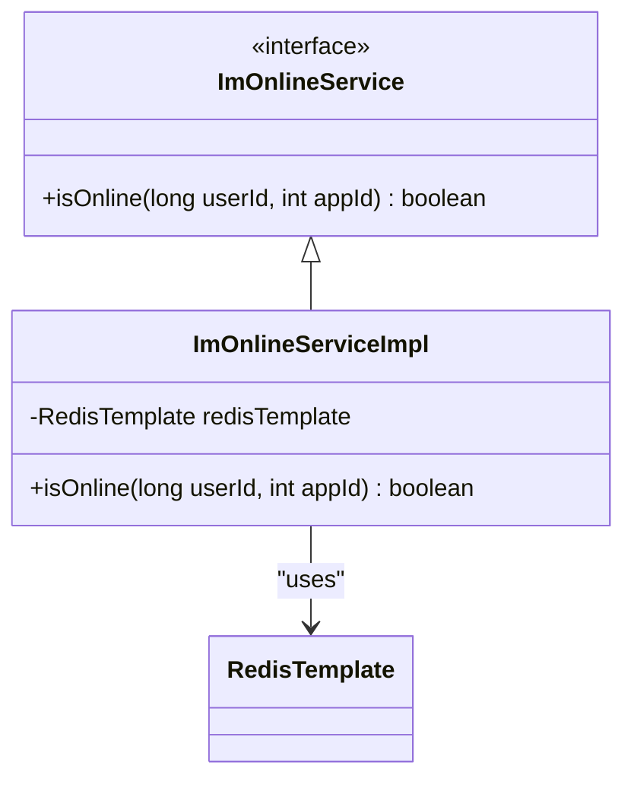
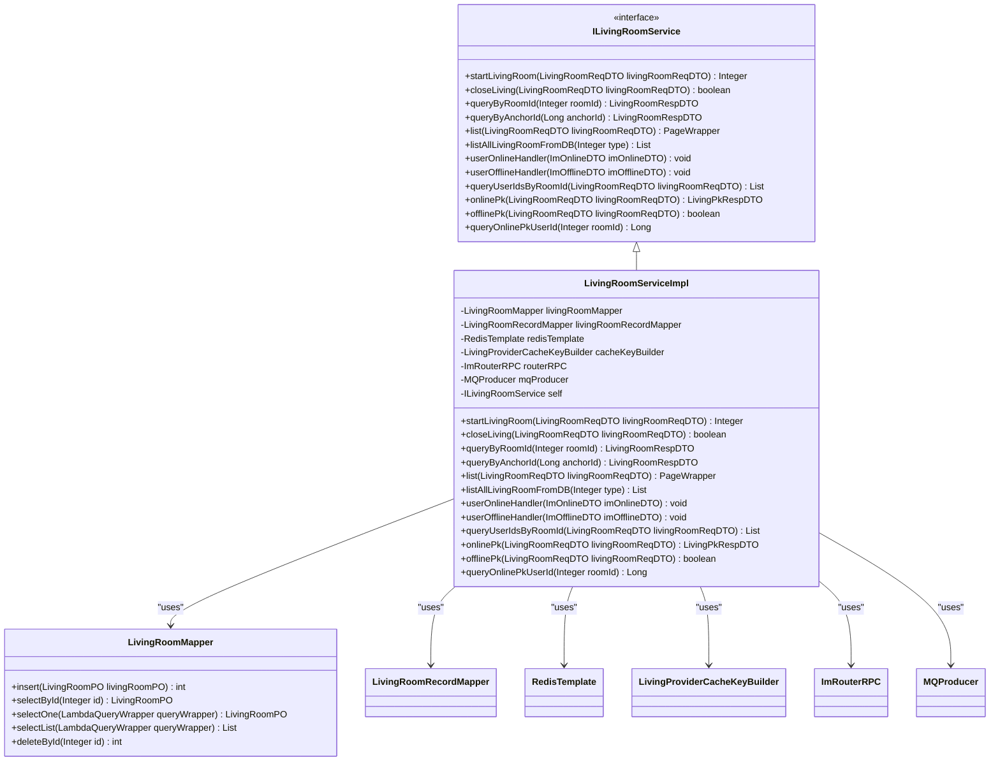
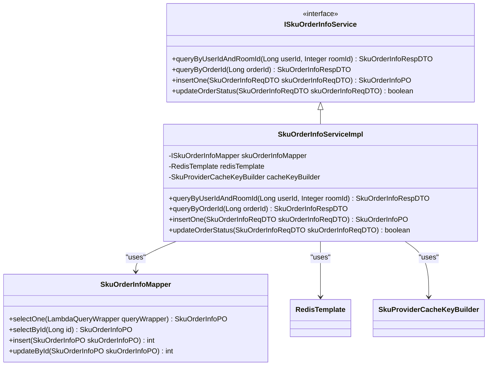
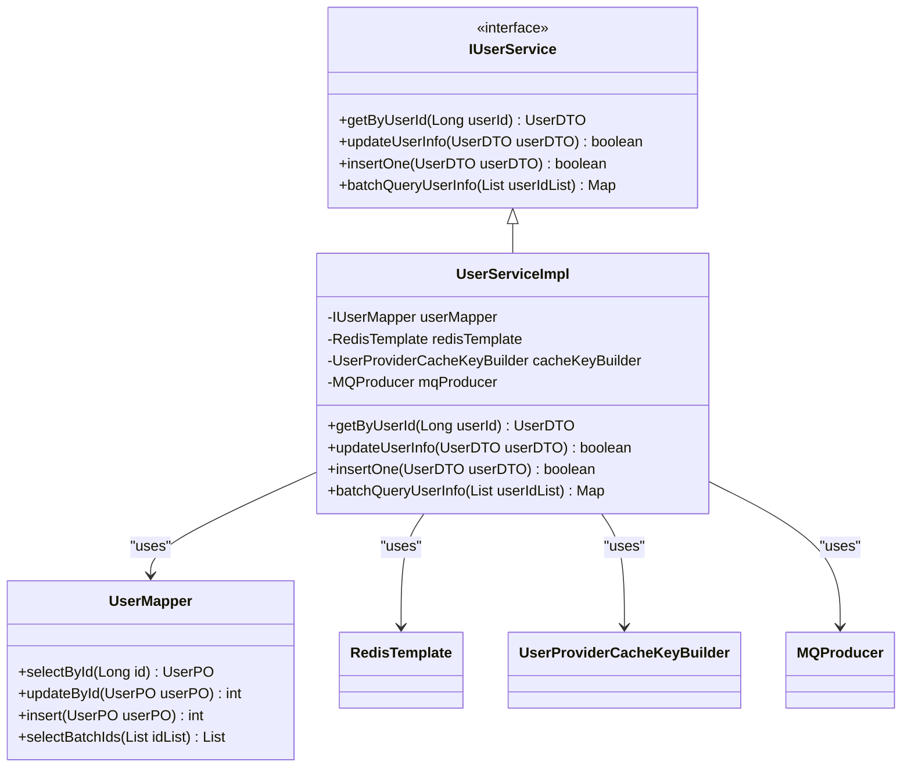

# 核心业务模块

<cite>
**本文档引用的文件**
- [AccountTokenServiceImpl.java](file://live-account-provider\src\main\java\com\logilong\live\account\provider\service\impl\AccountTokenServiceImpl.java)
- [LiveCurrencyAccountServiceImpl.java](file://live-bank-provider\src\main\java\com\logilong\live\bank\provider\service\impl\LiveCurrencyAccountServiceImpl.java)
- [BankServiceImpl.java](file://live-api\src\main\java\com\logilong\live\api\service\impl\BankServiceImpl.java)
- [GiftRecordServiceImpl.java](file://live-gift-provider\src\main\java\com\logilong\live\gift\provider\service\impl\GiftRecordServiceImpl.java)
- [ImOnlineServiceImpl.java](file://live-im-provider\src\main\java\com\logilong\live\im\provider\service\impl\ImOnlineServiceImpl.java)
- [LivingRoomServiceImpl.java](file://live-living-provider\src\main\java\com\logilong\live\living\provider\service\impl\LivingRoomServiceImpl.java)
- [SkuOrderInfoServiceImpl.java](file://live-sku-provider\src\main\java\com\logilong\live\sku\provider\service\impl\SkuOrderInfoServiceImpl.java)
- [UserServiceImpl.java](file://live-user-provider\src\main\java\com\logilong\live\user\provider\service\impl\UserServiceImpl.java)
- [GiftConfigServiceImpl.java](file://live-gift-provider\src\main\java\com\logilong\live\gift\provider\service\impl\GiftConfigServiceImpl.java)
- [PayOrderServiceImpl.java](file://live-bank-provider\src\main\java\com\logilong\live\bank\provider\service\impl\PayOrderServiceImpl.java)
- [BankController.java](file://live-api\src\main\java\com\logilong\live\api\controller\BankController.java)
- [GiftController.java](file://live-api\src\main\java\com\logilong\live\api\controller\GiftController.java)
- [ImController.java](file://live-api\src\main\java\com\logilong\live\api\controller\ImController.java)
- [LivingRoomController.java](file://live-api\src\main\java\com\logilong\live\api\controller\LivingRoomController.java)
- [ShopInfoController.java](file://live-api\src\main\java\com\logilong\live\api\controller\ShopInfoController.java)
- [UserLoginController.java](file://live-api\src\main\java\com\logilong\live\api\controller\UserLoginController.java)
</cite>

## 目录
1. [账户服务](#账户服务)
2. [支付服务](#支付服务)
3. [礼物服务](#礼物服务)
4. [IM服务](#im服务)
5. [直播服务](#直播服务)
6. [商品服务](#商品服务)
7. [用户服务](#用户服务)
8. [模块协作与依赖关系](#模块协作与依赖关系)

## 账户服务

账户服务主要负责用户登录令牌的创建与验证，以及虚拟币账户的管理。该服务通过Redis实现高效的令牌存储与查询，确保用户会话的安全性和高效性。

`AccountTokenServiceImpl`类实现了`IAccountTokenService`接口，提供了创建和验证登录令牌的功能。在创建令牌时，系统生成一个UUID作为令牌，并将其与用户ID关联存储在Redis中，设置30天的过期时间。验证令牌时，通过构建Redis键来查询对应的用户ID。



**图示来源**
- [AccountTokenServiceImpl.java](file://live-account-provider\src\main\java\com\logilong\live\account\provider\service\impl\AccountTokenServiceImpl.java)

**章节来源**
- [AccountTokenServiceImpl.java](file://live-account-provider\src\main\java\com\logilong\live\account\provider\service\impl\AccountTokenServiceImpl.java)

## 支付服务

支付服务负责处理订单的创建、状态更新以及支付回调。该服务通过与第三方支付平台的集成，实现了虚拟币的充值流程，并通过消息队列异步通知相关服务。

`PayOrderServiceImpl`类实现了`IPayOrderService`接口，提供了订单的查询、插入、状态更新和支付回调处理功能。在支付回调处理中，系统首先验证订单和业务代码的有效性，然后更新订单状态为已支付，并根据商品类型调用相应的服务进行余额增加和流水记录。



**图示来源**
- [PayOrderServiceImpl.java](file://live-bank-provider\src\main\java\com\logilong\live\bank\provider\service\impl\PayOrderServiceImpl.java)

**章节来源**
- [PayOrderServiceImpl.java](file://live-bank-provider\src\main\java\com\logilong\live\bank\provider\service\impl\PayOrderServiceImpl.java)

## 礼物服务

礼物服务负责礼物配置的管理、礼物记录的存储以及红包的发放。该服务通过缓存和消息队列优化了高并发场景下的性能，并确保了数据的一致性。

`GiftConfigServiceImpl`类实现了`IGiftConfigService`接口，提供了礼物配置的查询、列表获取、插入和更新功能。在插入和更新礼物配置时，系统会删除相关的缓存，并通过消息队列延迟删除缓存，以确保数据的一致性。



**图示来源**
- [GiftConfigServiceImpl.java](file://live-gift-provider\src\main\java\com\logilong\live\gift\provider\service\impl\GiftConfigServiceImpl.java)

**章节来源**
- [GiftConfigServiceImpl.java](file://live-gift-provider\src\main\java\com\logilong\live\gift\provider\service\impl\GiftConfigServiceImpl.java)

## IM服务

IM服务负责管理用户的在线状态和消息推送。该服务通过Redis存储用户的在线状态，并通过消息队列实现消息的异步推送，确保了高并发场景下的性能和可靠性。

`ImOnlineServiceImpl`类实现了`ImOnlineService`接口，提供了检查用户在线状态的功能。系统通过构建Redis键来查询用户是否在线，从而实现高效的在线状态管理。



**图示来源**
- [ImOnlineServiceImpl.java](file://live-im-provider\src\main\java\com\logilong\live\im\provider\service\impl\ImOnlineServiceImpl.java)

**章节来源**
- [ImOnlineServiceImpl.java](file://live-im-provider\src\main\java\com\logilong\live\im\provider\service\impl\ImOnlineServiceImpl.java)

## 直播服务

直播服务负责管理直播间的创建、关闭、PK机制以及用户在线状态的管理。该服务通过缓存和消息队列优化了高并发场景下的性能，并确保了数据的一致性。

`LivingRoomServiceImpl`类实现了`ILivingRoomService`接口，提供了直播间的创建、关闭、查询、用户在线状态管理、PK机制等功能。在创建直播间时，系统会插入直播间记录，并通过消息队列异步加载商品库存。在关闭直播间时，系统会将直播间记录迁移到历史表，并删除相关的缓存。



**图示来源**
- [LivingRoomServiceImpl.java](file://live-living-provider\src\main\java\com\logilong\live\living\provider\service\impl\LivingRoomServiceImpl.java)

**章节来源**
- [LivingRoomServiceImpl.java](file://live-living-provider\src\main\java\com\logilong\live\living\provider\service\impl\LivingRoomServiceImpl.java)

## 商品服务

商品服务负责管理购物车、库存扣减以及订单的预处理。该服务通过缓存和消息队列优化了高并发场景下的性能，并确保了数据的一致性。

`SkuOrderInfoServiceImpl`类实现了`ISkuOrderInfoService`接口，提供了订单的查询、插入和状态更新功能。在查询订单时，系统首先尝试从缓存中获取数据，如果缓存中没有，则从数据库中查询，并将结果存入缓存。在更新订单状态时，系统会删除相关的缓存，以确保数据的一致性。



**图示来源**
- [SkuOrderInfoServiceImpl.java](file://live-sku-provider\src\main\java\com\logilong\live\sku\provider\service\impl\SkuOrderInfoServiceImpl.java)

**章节来源**
- [SkuOrderInfoServiceImpl.java](file://live-sku-provider\src\main\java\com\logilong\live\sku\provider\service\impl\SkuOrderInfoServiceImpl.java)

## 用户服务

用户服务负责用户的注册、登录、标签管理以及用户信息的缓存。该服务通过缓存和消息队列优化了高并发场景下的性能，并确保了数据的一致性。

`UserServiceImpl`类实现了`IUserService`接口，提供了用户信息的查询、更新、插入和批量查询功能。在查询用户信息时，系统首先尝试从缓存中获取数据，如果缓存中没有，则从数据库中查询，并将结果存入缓存。在更新用户信息时，系统会删除相关的缓存，并通过消息队列延迟删除缓存，以确保数据的一致性。



**图示来源**
- [UserServiceImpl.java](file://live-user-provider\src\main\java\com\logilong\live\user\provider\service\impl\UserServiceImpl.java)

**章节来源**
- [UserServiceImpl.java](file://live-user-provider\src\main\java\com\logilong\live\user\provider\service\impl\UserServiceImpl.java)

## 模块协作与依赖关系

各个核心业务模块通过Dubbo RPC和消息队列进行协作，形成了一个松耦合、高内聚的微服务架构。API层作为统一的入口，接收外部请求，并通过Dubbo调用各个Provider模块的服务。Provider模块之间通过消息队列进行异步通信，确保了系统的高性能和可靠性。

```mermaid
graph TD
API[API层] --> AccountProvider[账户服务]
API --> BankProvider[支付服务]
API --> GiftProvider[礼物服务]
API --> ImProvider[IM服务]
API --> LivingProvider[直播服务]
API --> SkuProvider[商品服务]
API --> UserProvider[用户服务]
AccountProvider --> Redis[(Redis)]
BankProvider --> Redis
GiftProvider --> Redis
ImProvider --> Redis
LivingProvider --> Redis
SkuProvider --> Redis
UserProvider --> Redis
BankProvider --> MQ[(消息队列)]
GiftProvider --> MQ
LivingProvider --> MQ
UserProvider --> MQ
AccountProvider < --> UserProvider
BankProvider < --> UserProvider
GiftProvider < --> UserProvider
ImProvider < --> LivingProvider
SkuProvider < --> LivingProvider
```

**图示来源**
- [BankController.java](file://live-api\src\main\java\com\logilong\live\api\controller\BankController.java)
- [GiftController.java](file://live-api\src\main\java\com\logilong\live\api\controller\GiftController.java)
- [ImController.java](file://live-api\src\main\java\com\logilong\live\api\controller\ImController.java)
- [LivingRoomController.java](file://live-api\src\main\java\com\logilong\live\api\controller\LivingRoomController.java)
- [ShopInfoController.java](file://live-api\src\main\java\com\logilong\live\api\controller\ShopInfoController.java)
- [UserLoginController.java](file://live-api\src\main\java\com\logilong\live\api\controller\UserLoginController.java)

**章节来源**
- [BankController.java](file://live-api\src\main\java\com\logilong\live\api\controller\BankController.java)
- [GiftController.java](file://live-api\src\main\java\com\logilong\live\api\controller\GiftController.java)
- [ImController.java](file://live-api\src\main\java\com\logilong\live\api\controller\ImController.java)
- [LivingRoomController.java](file://live-api\src\main\java\com\logilong\live\api\controller\LivingRoomController.java)
- [ShopInfoController.java](file://live-api\src\main\java\com\logilong\live\api\controller\ShopInfoController.java)
- [UserLoginController.java](file://live-api\src\main\java\com\logilong\live\api\controller\UserLoginController.java)