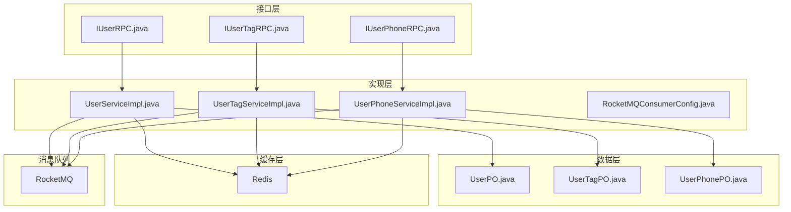
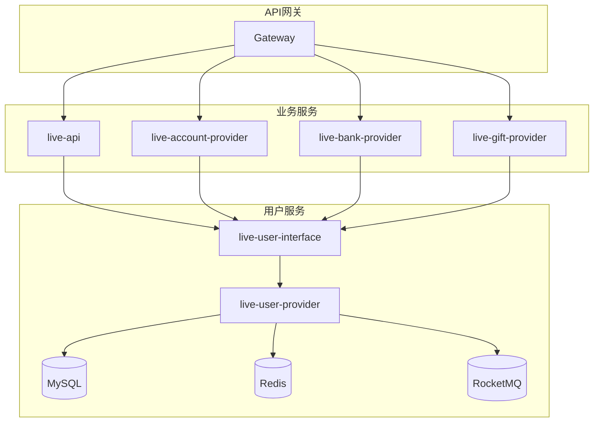
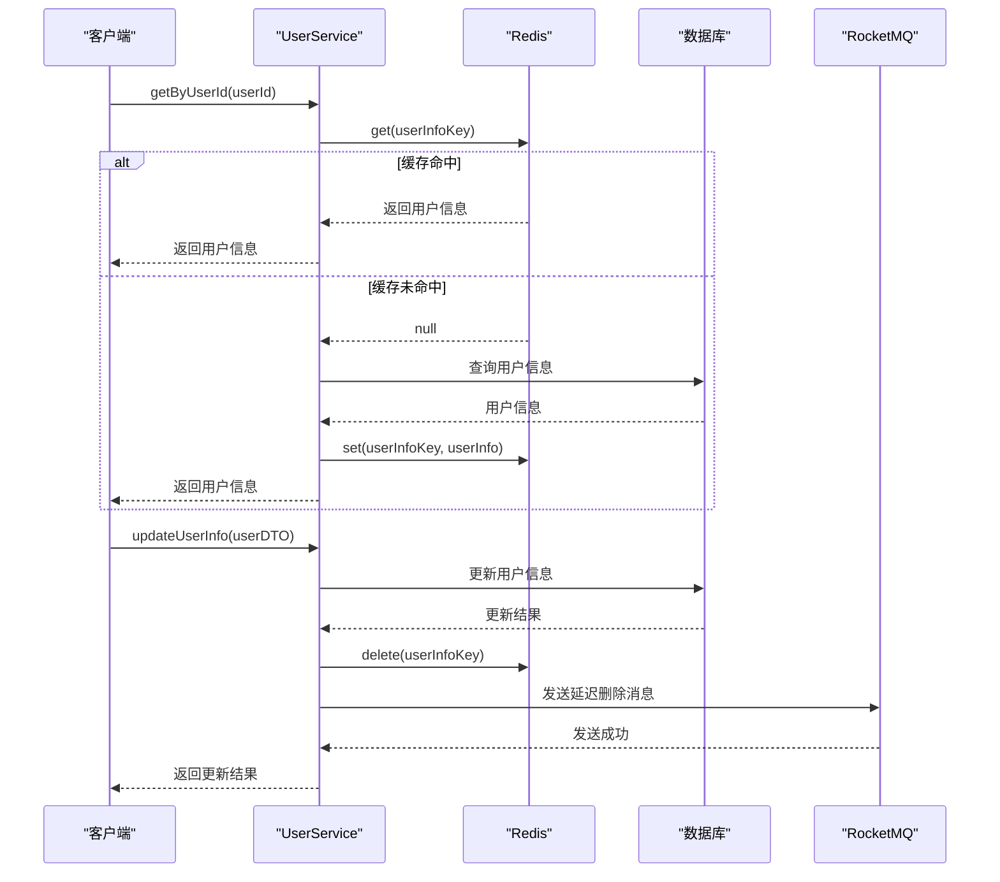
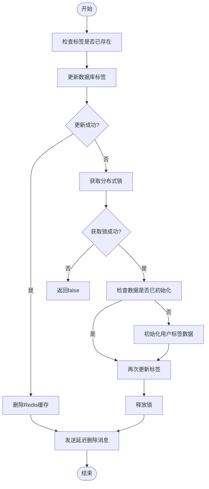
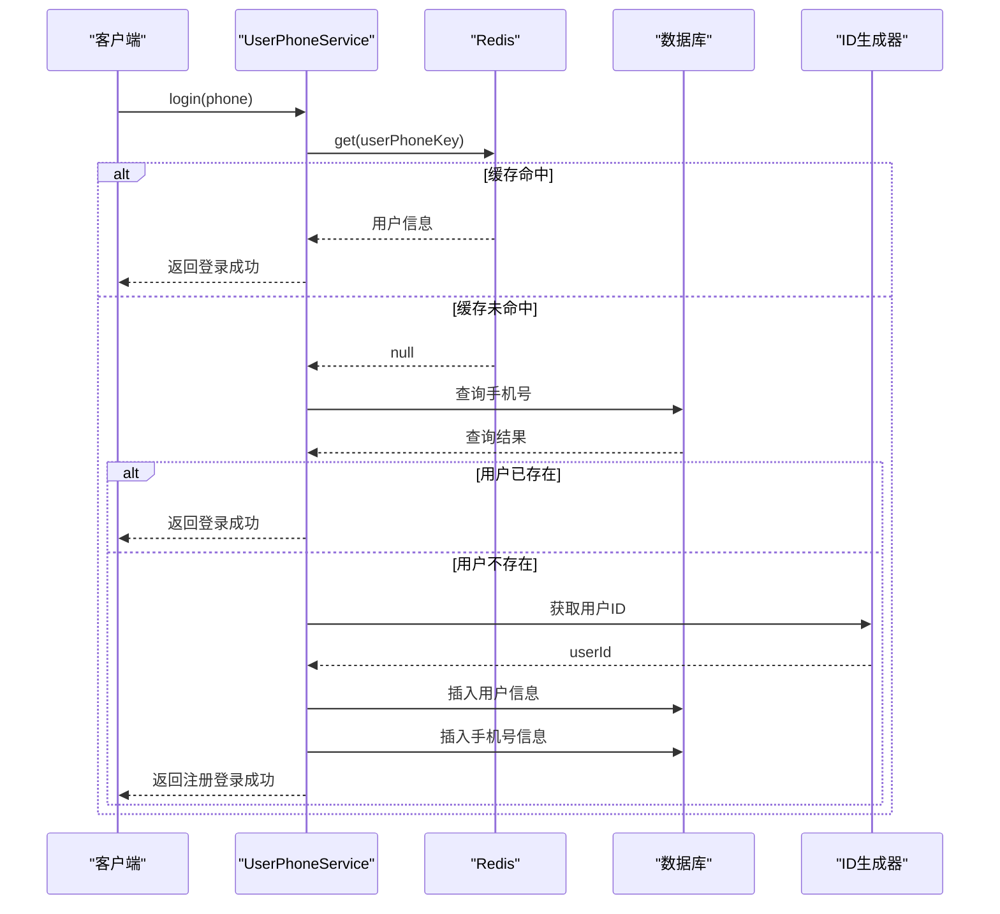
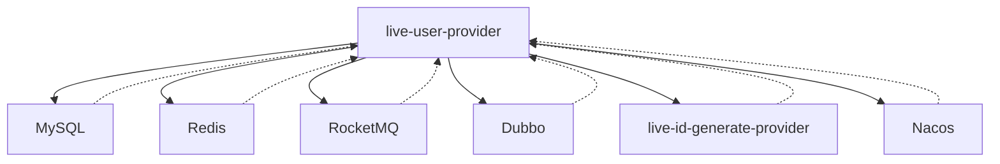

# 用户系统

<cite>
**本文档引用的文件**   
- [IUserRPC.java](file://live-user-interface/src/main/java/com/logilong/live/user/interfaces/IUserRPC.java)
- [IUserTagRPC.java](file://live-user-interface/src/main/java/com/logilong/live/user/interfaces/IUserTagRPC.java)
- [UserDTO.java](file://live-user-interface/src/main/java/com/logilong/live/user/dto/UserDTO.java)
- [UserTagDTO.java](file://live-user-interface/src/main/java/com/logilong/live/user/dto/UserTagDTO.java)
- [UserServiceImpl.java](file://live-user-provider/src/main/java/com/logilong/live/user/provider/service/impl/UserServiceImpl.java)
- [UserTagServiceImpl.java](file://live-user-provider/src/main/java/com/logilong/live/user/provider/service/impl/UserTagServiceImpl.java)
- [UserTagsEnum.java](file://live-user-interface/src/main/java/com/logilong/live/user/constants/UserTagsEnum.java)
- [UserTagFieldNameConstants.java](file://live-user-interface/src/main/java/com/logilong/live/user/constants/UserTagFieldNameConstants.java)
- [IUserPhoneRPC.java](file://live-user-interface/src/main/java/com/logilong/live/user/interfaces/IUserPhoneRPC.java)
- [UserPhoneServiceImpl.java](file://live-user-provider/src/main/java/com/logilong/live/user/provider/service/impl/UserPhoneServiceImpl.java)
- [UserPhoneDTO.java](file://live-user-interface/src/main/java/com/logilong/live/user/dto/UserPhoneDTO.java)
- [UserLoginController.java](file://live-api/src/main/java/com/logilong/live/api/controller/UserLoginController.java)
- [RocketMQConsumerConfig.java](file://live-user-provider/src/main/java/com/logilong/live/user/provider/consumer/RocketMQConsumerConfig.java)
- [UserCacheAsyncDeleteDTO.java](file://live-common-interface/src/main/java/com/logilong/live/common/interfaces/dto/UserCacheAsyncDeleteDTO.java)
- [UserProviderTopicNames.java](file://live-common-interface/src/main/java/com/logilong/live/common/interfaces/topic/UserProviderTopicNames.java)
- [CacheAsyncDeleteCode.java](file://live-user-interface/src/main/java/com/logilong/live/user/constants/CacheAsyncDeleteCode.java)
- [UserProviderCacheKeyBuilder.java](file://live-framework/live-framework-redis-starter/src/main/java/com/logilong/live/framework/redis/starter/key/UserProviderCacheKeyBuilder.java)
</cite>

## 目录
1. [简介](#简介)
2. [项目结构](#项目结构)
3. [核心组件](#核心组件)
4. [架构概述](#架构概述)
5. [详细组件分析](#详细组件分析)
6. [依赖分析](#依赖分析)
7. [性能考虑](#性能考虑)
8. [故障排除指南](#故障排除指南)
9. [结论](#结论)

## 简介
本文档系统化地介绍了直播平台用户服务的核心功能与实现细节。用户系统作为平台的核心基础服务，负责管理用户身份、个人信息、用户标签等关键数据，并为其他业务模块提供统一的用户信息服务。系统采用微服务架构，通过Dubbo RPC接口对外提供服务，实现了用户注册/登录、个人信息管理、用户标签体系等核心功能。在安全机制方面，系统实现了用户身份验证、密码加密存储、手机号绑定等功能。通过Redis缓存和RocketMQ消息队列，系统实现了高性能的数据访问和异步处理能力，确保了分布式环境下的数据一致性。

## 项目结构
用户系统采用微服务架构，分为接口层(live-user-interface)和实现层(live-user-provider)。接口层定义了对外提供的RPC服务接口，实现层包含了具体的业务逻辑、数据访问和缓存处理。系统通过Dubbo框架实现服务间的远程调用，使用Redis作为缓存层提升性能，通过RocketMQ实现异步消息处理。用户数据存储在MySQL数据库中，通过MyBatis-Plus进行数据访问。

**图示来源**
- [IUserRPC.java](file://live-user-interface/src/main/java/com/logilong/live/user/interfaces/IUserRPC.java)
- [IUserTagRPC.java](file://live-user-interface/src/main/java/com/logilong/live/user/interfaces/IUserTagRPC.java)
- [IUserPhoneRPC.java](file://live-user-interface/src/main/java/com/logilong/live/user/interfaces/IUserPhoneRPC.java)
- [UserServiceImpl.java](file://live-user-provider/src/main/java/com/logilong/live/user/provider/service/impl/UserServiceImpl.java)
- [UserTagServiceImpl.java](file://live-user-provider/src/main/java/com/logilong/live/user/provider/service/impl/UserTagServiceImpl.java)
- [UserPhoneServiceImpl.java](file://live-user-provider/src/main/java/com/logilong/live/user/provider/service/impl/UserPhoneServiceImpl.java)

**章节来源**
- [IUserRPC.java](file://live-user-interface/src/main/java/com/logilong/live/user/interfaces/IUserRPC.java)
- [IUserTagRPC.java](file://live-user-interface/src/main/java/com/logilong/live/user/interfaces/IUserTagRPC.java)
- [IUserPhoneRPC.java](file://live-user-interface/src/main/java/com/logilong/live/user/interfaces/IUserPhoneRPC.java)

## 核心组件

用户系统的核心组件包括用户服务(UserService)、用户标签服务(UserTagService)和用户手机服务(UserPhoneService)。UserService负责用户基本信息的管理，包括用户的增删改查操作；UserTagService负责用户标签的管理，支持标签的设置、取消和查询；UserPhoneService负责用户手机号的绑定和登录功能。这些服务通过Dubbo RPC暴露接口，供其他业务模块调用。系统采用分层架构，服务层调用数据访问层(DAO)进行数据库操作，同时与Redis缓存交互以提升性能。通过RocketMQ消息队列实现缓存的异步更新，确保数据一致性。

**章节来源**
- [UserServiceImpl.java](file://live-user-provider/src/main/java/com/logilong/live/user/provider/service/impl/UserServiceImpl.java)
- [UserTagServiceImpl.java](file://live-user-provider/src/main/java/com/logilong/live/user/provider/service/impl/UserTagServiceImpl.java)
- [UserPhoneServiceImpl.java](file://live-user-provider/src/main/java/com/logilong/live/user/provider/service/impl/UserPhoneServiceImpl.java)

## 架构概述

用户系统的整体架构采用微服务设计模式，各组件之间通过清晰的边界进行隔离。系统通过Dubbo RPC提供服务接口，实现了服务的远程调用和负载均衡。数据访问层使用MyBatis-Plus框架，简化了数据库操作。缓存层采用Redis，通过合理的缓存策略提升系统性能。消息队列使用RocketMQ，实现了异步解耦和最终一致性。系统还集成了分布式ID生成器，确保全局唯一ID的生成。

**图示来源**
- [IUserRPC.java](file://live-user-interface/src/main/java/com/logilong/live/user/interfaces/IUserRPC.java)
- [UserServiceImpl.java](file://live-user-provider/src/main/java/com/logilong/live/user/provider/service/impl/UserServiceImpl.java)
- [UserProviderApplication.java](file://live-user-provider/src/main/java/com/logilong/live/user/provider/UserProviderApplication.java)

## 详细组件分析

### 用户服务分析
用户服务(UserService)是用户系统的核心组件，负责管理用户的基本信息。服务提供了用户信息的查询、更新和插入功能。在查询用户信息时，系统首先尝试从Redis缓存中获取数据，如果缓存中不存在，则从数据库查询并将结果写入缓存。在更新用户信息时，系统会先更新数据库，然后删除对应的缓存，并通过RocketMQ发送延迟消息进行二次删除，以解决主从数据库同步延迟导致的缓存不一致问题。

**图示来源**
- [UserServiceImpl.java](file://live-user-provider/src/main/java/com/logilong/live/user/provider/service/impl/UserServiceImpl.java)
- [UserDTO.java](file://live-user-interface/src/main/java/com/logilong/live/user/dto/UserDTO.java)

**章节来源**
- [UserServiceImpl.java](file://live-user-provider/src/main/java/com/logilong/live/user/provider/service/impl/UserServiceImpl.java)
- [UserDTO.java](file://live-user-interface/src/main/java/com/logilong/live/user/dto/UserDTO.java)

### 用户标签服务分析
用户标签服务(UserTagService)负责管理用户的标签信息。系统采用位运算的方式存储用户标签，通过三个字段(tag_info_01, tag_info_02, tag_info_03)存储最多96个标签。这种设计既节省了存储空间，又提高了查询效率。在设置标签时，系统首先尝试直接更新数据库，如果更新失败（可能因为用户标签数据未初始化），则通过分布式锁确保只有一个线程进行数据初始化，避免了并发问题。

**图示来源**
- [UserTagServiceImpl.java](file://live-user-provider/src/main/java/com/logilong/live/user/provider/service/impl/UserTagServiceImpl.java)
- [UserTagsEnum.java](file://live-user-interface/src/main/java/com/logilong/live/user/constants/UserTagsEnum.java)

**章节来源**
- [UserTagServiceImpl.java](file://live-user-provider/src/main/java/com/logilong/live/user/provider/service/impl/UserTagServiceImpl.java)
- [UserTagsEnum.java](file://live-user-interface/src/main/java/com/logilong/live/user/constants/UserTagsEnum.java)

### 用户手机服务分析
用户手机服务(UserPhoneService)负责处理用户的手机号绑定和登录功能。系统采用手机号作为用户登录的唯一标识，新用户首次登录时会自动完成注册流程。为了保护用户隐私，手机号在存储时经过DES加密处理。服务实现了完善的缓存策略，包括空值缓存以防止缓存穿透，以及分布式锁防止缓存击穿。

**图示来源**
- [UserPhoneServiceImpl.java](file://live-user-provider/src/main/java/com/logilong/live/user/provider/service/impl/UserPhoneServiceImpl.java)
- [UserPhoneDTO.java](file://live-user-interface/src/main/java/com/logilong/live/user/dto/UserPhoneDTO.java)

**章节来源**
- [UserPhoneServiceImpl.java](file://live-user-provider/src/main/java/com/logilong/live/user/provider/service/impl/UserPhoneServiceImpl.java)
- [UserPhoneDTO.java](file://live-user-interface/src/main/java/com/logilong/live/user/dto/UserPhoneDTO.java)

## 依赖分析

用户系统依赖于多个外部组件和服务。在数据存储方面，系统依赖MySQL数据库存储用户数据，依赖Redis作为缓存层。在消息通信方面，系统依赖RocketMQ实现异步消息处理。在服务治理方面，系统依赖Dubbo框架实现服务的注册、发现和调用。此外，系统还依赖分布式ID生成器服务(live-id-generate-provider)来生成全局唯一的用户ID。

**图示来源**
- [UserServiceImpl.java](file://live-user-provider/src/main/java/com/logilong/live/user/provider/service/impl/UserServiceImpl.java)
- [UserTagServiceImpl.java](file://live-user-provider/src/main/java/com/logilong/live/user/provider/service/impl/UserTagServiceImpl.java)
- [UserPhoneServiceImpl.java](file://live-user-provider/src/main/java/com/logilong/live/user/provider/service/impl/UserPhoneServiceImpl.java)
- [RocketMQConsumerConfig.java](file://live-user-provider/src/main/java/com/logilong/live/user/provider/consumer/RocketMQConsumerConfig.java)

**章节来源**
- [UserServiceImpl.java](file://live-user-provider/src/main/java/com/logilong/live/user/provider/service/impl/UserServiceImpl.java)
- [UserTagServiceImpl.java](file://live-user-provider/src/main/java/com/logilong/live/user/provider/service/impl/UserTagServiceImpl.java)
- [UserPhoneServiceImpl.java](file://live-user-provider/src/main/java/com/logilong/live/user/provider/service/impl/UserPhoneServiceImpl.java)

## 性能考虑

用户系统在设计时充分考虑了性能优化。首先，通过Redis缓存热点数据，大幅减少了数据库的访问压力。其次，在批量查询用户信息时，系统采用并行流的方式分组查询数据库，提高了查询效率。再者，系统使用管道技术批量设置缓存的过期时间，减少了网络IO次数。最后，通过设置随机的缓存过期时间，避免了缓存雪崩问题。

在缓存更新策略上，系统采用了"先更新数据库，再删除缓存"的模式，并通过RocketMQ的延迟消息实现二次删除，解决了主从数据库同步延迟导致的缓存不一致问题。对于用户标签查询，系统采用位运算的方式存储和查询标签，既节省了存储空间，又提高了查询效率。

## 故障排除指南

在使用用户系统时，可能会遇到一些常见问题。对于缓存相关问题，如发现数据不一致，可以检查RocketMQ消费者是否正常运行，确保延迟删除消息能够被正确消费。对于数据库性能问题，可以检查SQL执行计划，确保查询语句能够正确使用索引。对于服务调用问题，可以检查Dubbo服务注册中心，确保服务提供者已正确注册。

在排查问题时，建议首先查看系统日志，特别是Redis操作和MQ消息处理的相关日志。对于缓存穿透问题，可以检查是否正确实现了空值缓存。对于缓存击穿问题，可以检查分布式锁的实现是否正确。对于数据库死锁问题，可以检查事务的范围和锁的获取顺序。

**章节来源**
- [UserServiceImpl.java](file://live-user-provider/src/main/java/com/logilong/live/user/provider/service/impl/UserServiceImpl.java)
- [UserTagServiceImpl.java](file://live-user-provider/src/main/java/com/logilong/live/user/provider/service/impl/UserTagServiceImpl.java)
- [UserPhoneServiceImpl.java](file://live-user-provider/src/main/java/com/logilong/live/user/provider/service/impl/UserPhoneServiceImpl.java)
- [RocketMQConsumerConfig.java](file://live-user-provider/src/main/java/com/logilong/live/user/provider/consumer/RocketMQConsumerConfig.java)

## 结论

用户系统作为直播平台的核心基础服务，通过合理的架构设计和技术创新，实现了高性能、高可用的用户管理功能。系统采用微服务架构，通过Dubbo RPC提供服务接口，实现了服务的解耦和可扩展性。通过Redis缓存和RocketMQ消息队列，系统在保证数据一致性的同时，提供了优异的性能表现。未来，系统可以进一步优化，如引入多级缓存、实现更智能的缓存预热策略等，以应对不断增长的业务需求。