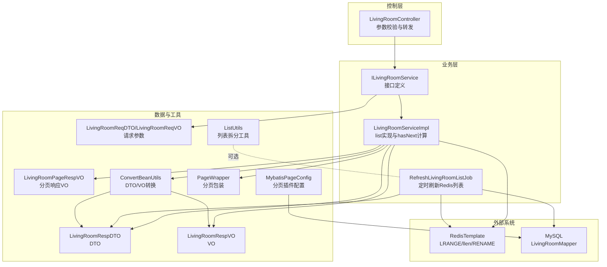
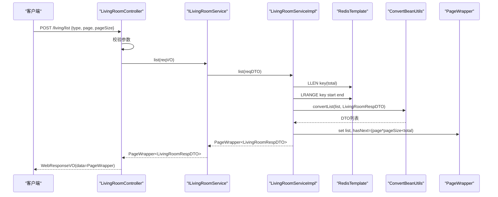
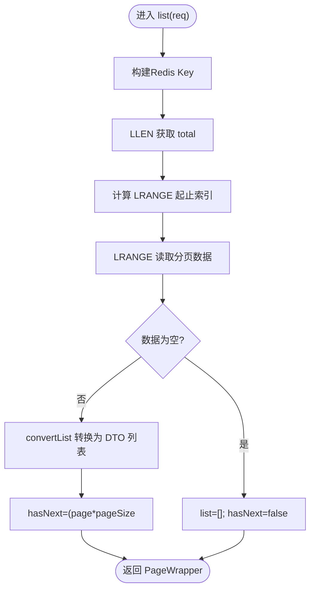
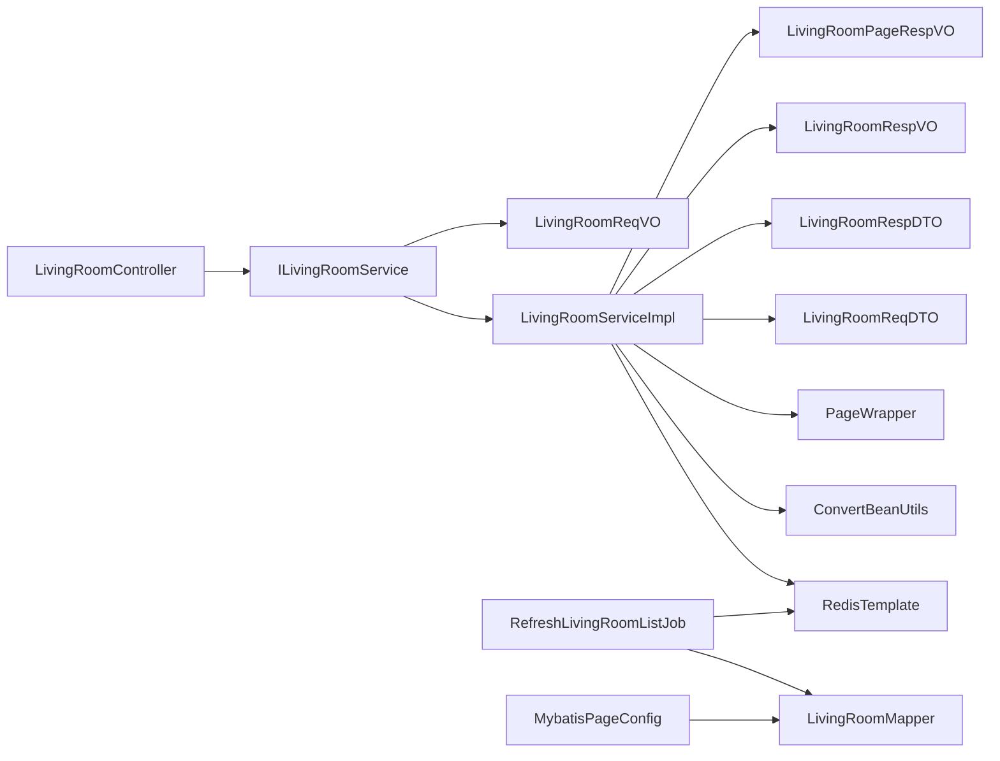

# 分页查询实现

<cite>
**本文引用的文件**
- [LivingRoomServiceImpl.java](file://live-living-provider/src/main/java/com/logilong/live/living/provider/service/impl/LivingRoomServiceImpl.java)
- [ILivingRoomService.java](file://live-living-provider/src/main/java/com/logilong/live/living/provider/service/ILivingRoomService.java)
- [RefreshLivingRoomListJob.java](file://live-living-provider/src/main/java/com/logilong/live/living/provider/config/RefreshLivingRoomListJob.java)
- [LivingRoomController.java](file://live-api/src/main/java/com/logilong/live/api/controller/LivingRoomController.java)
- [LivingRoomReqVO.java](file://live-api/src/main/java/com/logilong/live/api/vo/req/LivingRoomReqVO.java)
- [LivingRoomReqDTO.java](file://live-living-interface/src/main/java/com/logilong/live/living/interfaces/dto/LivingRoomReqDTO.java)
- [LivingRoomRespDTO.java](file://live-living-interface/src/main/java/com/logilong/live/living/interfaces/dto/LivingRoomRespDTO.java)
- [LivingRoomRespVO.java](file://live-api/src/main/java/com/logilong/live/api/vo/resp/LivingRoomRespVO.java)
- [LivingRoomPageRespVO.java](file://live-api/src/main/java/com/logilong/live/api/vo/resp/LivingRoomPageRespVO.java)
- [ConvertBeanUtils.java](file://live-common-interface/src/main/java/com/logilong/live/common/interfaces/utils/ConvertBeanUtils.java)
- [PageWrapper.java](file://live-common-interface/src/main/java/com/logilong/live/common/interfaces/dto/PageWrapper.java)
- [ListUtils.java](file://live-common-interface/src/main/java/com/logilong/live/common/interfaces/utils/ListUtils.java)
- [MybatisPageConfig.java](file://live-living-provider/src/main/java/com/logilong/live/living/provider/config/MybatisPageConfig.java)
- [ErrorAssert.java](file://live-framework/live-framework-web-starter/src/main/java/com/logilong/live/web/starter/error/ErrorAssert.java)
</cite>

## 目录
1. [简介](#简介)
2. [项目结构](#项目结构)
3. [核心组件](#核心组件)
4. [架构概览](#架构概览)
5. [详细组件分析](#详细组件分析)
6. [依赖分析](#依赖分析)
7. [性能考量](#性能考量)
8. [故障排查指南](#故障排查指南)
9. [结论](#结论)
10. [附录](#附录)

## 简介
本文件围绕“直播列表分页查询”的实现进行深入解析，重点说明：
- list 方法如何结合 Redis List 的 lrange 操作实现高效分页；
- pageWrapper 中 hasNext 标志位的计算逻辑（基于 Redis List 总长度 total 与当前页码 page 和每页大小 pageSize 的关系）；
- LivingRoomPageRespVO 与 LivingRoomRespVO 的结构映射关系；
- ConvertBeanUtils 在 DTO 到 VO 转换中的作用；
- 高并发场景下缓存总长度获取的性能影响与优化建议（如单独缓存 count）；
- 分页参数校验、边界情况处理（如空列表）及响应性能调优的实践指导。

## 项目结构
该功能涉及三层协作：
- 控制层：接收请求参数并进行基础校验；
- 业务层：从 Redis List 读取分页数据，计算 hasNext，并进行 DTO/VO 转换；
- 缓存刷新：定时任务从数据库拉取最新直播列表，写入 Redis List，确保分页数据来源稳定。

图表来源
- [LivingRoomController.java](file://live-api/src/main/java/com/logilong/live/api/controller/LivingRoomController.java#L1-L96)
- [ILivingRoomService.java](file://live-living-provider/src/main/java/com/logilong/live/living/provider/service/ILivingRoomService.java#L1-L75)
- [LivingRoomServiceImpl.java](file://live-living-provider/src/main/java/com/logilong/live/living/provider/service/impl/LivingRoomServiceImpl.java#L149-L166)
- [RefreshLivingRoomListJob.java](file://live-living-provider/src/main/java/com/logilong/live/living/provider/config/RefreshLivingRoomListJob.java#L58-L75)
- [LivingRoomReqVO.java](file://live-api/src/main/java/com/logilong/live/api/vo/req/LivingRoomReqVO.java#L1-L14)
- [LivingRoomReqDTO.java](file://live-living-interface/src/main/java/com/logilong/live/living/interfaces/dto/LivingRoomReqDTO.java#L1-L27)
- [LivingRoomRespDTO.java](file://live-living-interface/src/main/java/com/logilong/live/living/interfaces/dto/LivingRoomRespDTO.java#L1-L22)
- [LivingRoomRespVO.java](file://live-api/src/main/java/com/logilong/live/api/vo/resp/LivingRoomRespVO.java#L1-L15)
- [LivingRoomPageRespVO.java](file://live-api/src/main/java/com/logilong/live/api/vo/resp/LivingRoomPageRespVO.java#L1-L12)
- [ConvertBeanUtils.java](file://live-common-interface/src/main/java/com/logilong/live/common/interfaces/utils/ConvertBeanUtils.java#L1-L56)
- [PageWrapper.java](file://live-common-interface/src/main/java/com/logilong/live/common/interfaces/dto/PageWrapper.java#L1-L16)
- [ListUtils.java](file://live-common-interface/src/main/java/com/logilong/live/common/interfaces/utils/ListUtils.java#L1-L34)
- [MybatisPageConfig.java](file://live-living-provider/src/main/java/com/logilong/live/living/provider/config/MybatisPageConfig.java#L1-L35)

章节来源
- [LivingRoomController.java](file://live-api/src/main/java/com/logilong/live/api/controller/LivingRoomController.java#L25-L30)
- [LivingRoomServiceImpl.java](file://live-living-provider/src/main/java/com/logilong/live/living/provider/service/impl/LivingRoomServiceImpl.java#L149-L166)
- [RefreshLivingRoomListJob.java](file://live-living-provider/src/main/java/com/logilong/live/living/provider/config/RefreshLivingRoomListJob.java#L58-L75)

## 核心组件
- 分页服务实现：list 方法通过 RedisTemplate 对 Redis List 执行 LRANGE 读取指定区间数据，并基于 total 计算 hasNext。
- 定时刷新任务：从数据库拉取直播列表，按顺序写入 Redis List，并通过临时键 + 原子重命名的方式降低写入阻塞。
- 参数校验：控制层对 page/pageSize/type 进行基础校验，避免非法请求进入业务层。
- DTO/VO 转换：ConvertBeanUtils 提供通用的属性拷贝与列表转换能力，支撑 DTO 到 VO 的映射。
- 分页包装：PageWrapper 作为通用分页容器，承载 list 与 hasNext 字段。

章节来源
- [LivingRoomServiceImpl.java](file://live-living-provider/src/main/java/com/logilong/live/living/provider/service/impl/LivingRoomServiceImpl.java#L149-L166)
- [RefreshLivingRoomListJob.java](file://live-living-provider/src/main/java/com/logilong/live/living/provider/config/RefreshLivingRoomListJob.java#L58-L75)
- [LivingRoomController.java](file://live-api/src/main/java/com/logilong/live/api/controller/LivingRoomController.java#L25-L30)
- [ConvertBeanUtils.java](file://live-common-interface/src/main/java/com/logilong/live/common/interfaces/utils/ConvertBeanUtils.java#L1-L56)
- [PageWrapper.java](file://live-common-interface/src/main/java/com/logilong/live/common/interfaces/dto/PageWrapper.java#L1-L16)

## 架构概览
下面的序列图展示了从控制器到业务层再到 Redis 的完整调用链路，以及 Redis 列表的读取与 hasNext 计算流程。

图表来源
- [LivingRoomController.java](file://live-api/src/main/java/com/logilong/live/api/controller/LivingRoomController.java#L25-L30)
- [LivingRoomServiceImpl.java](file://live-living-provider/src/main/java/com/logilong/live/living/provider/service/impl/LivingRoomServiceImpl.java#L149-L166)
- [ConvertBeanUtils.java](file://live-common-interface/src/main/java/com/logilong/live/common/interfaces/utils/ConvertBeanUtils.java#L37-L46)
- [PageWrapper.java](file://live-common-interface/src/main/java/com/logilong/live/common/interfaces/dto/PageWrapper.java#L1-L16)

## 详细组件分析

### 分页查询核心流程（list 方法）
- Redis 列表读取：通过 LLEN 获取总长度 total；通过 LRANGE 读取 [start, end] 区间数据，其中 start=(page-1)*pageSize，end=page*pageSize-1。
- 空列表处理：若 LRANGE 返回为空，则 hasNext=false，list 为空。
- hasNext 计算：当 total 存在且 page*pageSize < total 时，hasNext=true；否则 false。
- DTO/VO 转换：将 Redis 中的对象列表转换为 DTO 列表，再由上层映射为 VO 列表（此处为业务层直接返回 DTO，前端 VO 映射由上层处理）。

图表来源
- [LivingRoomServiceImpl.java](file://live-living-provider/src/main/java/com/logilong/live/living/provider/service/impl/LivingRoomServiceImpl.java#L149-L166)

章节来源
- [LivingRoomServiceImpl.java](file://live-living-provider/src/main/java/com/logilong/live/living/provider/service/impl/LivingRoomServiceImpl.java#L149-L166)

### hasNext 标志位计算逻辑
- 计算依据：基于 Redis List 的总长度 total 与当前页码 page 和每页大小 pageSize 的关系。
- 判定条件：当 (long) page * pageSize < total 时，hasNext=true；否则 false。
- 说明：该逻辑假设 Redis 列表内容与数据库一致，且 total 代表当前缓存列表的总条目数。若 total 未及时更新或存在并发写入，可能产生 hasNext 与实际数据不一致的情况，需配合缓存刷新策略与原子重命名机制。

章节来源
- [LivingRoomServiceImpl.java](file://live-living-provider/src/main/java/com/logilong/live/living/provider/service/impl/LivingRoomServiceImpl.java#L163-L163)

### DTO/VO 结构映射关系
- LivingRoomRespDTO：后端领域模型的传输对象，包含 id、anchorId、roomName、covertImg、type、watchNum、goodNum、pkObjId 等字段。
- LivingRoomRespVO：前端响应对象，包含 id、roomName、anchorId、watchNum、goodNum、type、covertImg 等字段。
- 映射关系：两者字段名与类型基本一致，可通过 ConvertBeanUtils 进行属性拷贝转换。
- 分页响应 VO：LivingRoomPageRespVO 包含 list（LivingRoomRespVO 列表）与 hasNext 布尔标志。

章节来源
- [LivingRoomRespDTO.java](file://live-living-interface/src/main/java/com/logilong/live/living/interfaces/dto/LivingRoomRespDTO.java#L1-L22)
- [LivingRoomRespVO.java](file://live-api/src/main/java/com/logilong/live/api/vo/resp/LivingRoomRespVO.java#L1-L15)
- [LivingRoomPageRespVO.java](file://live-api/src/main/java/com/logilong/live/api/vo/resp/LivingRoomPageRespVO.java#L1-L12)
- [ConvertBeanUtils.java](file://live-common-interface/src/main/java/com/logilong/live/common/interfaces/utils/ConvertBeanUtils.java#L1-L56)

### DTO/VO 转换工具（ConvertBeanUtils）
- 单对象转换：convert(source, targetClass)，基于 BeanUtils.copyProperties 实现浅拷贝。
- 列表转换：convertList(sourceList, targetClass)，遍历源列表逐个转换为目标类型列表。
- 使用场景：在分页查询中，将 Redis 中的 DTO 列表转换为 VO 列表，便于对外输出。

章节来源
- [ConvertBeanUtils.java](file://live-common-interface/src/main/java/com/logilong/live/common/interfaces/utils/ConvertBeanUtils.java#L1-L56)

### 缓存刷新与 Redis 写入策略
- 刷新任务：RefreshLivingRoomListJob 定时从数据库拉取直播列表，按顺序 rightPush 到临时键，再通过 rename 原子替换为正式键，避免写入阻塞。
- 数据来源：listAllLivingRoomFromDB 限制最多 1000 条，保证缓存规模可控。
- 写入优化：使用临时键 + 原子重命名，减少对线上读取的影响。

章节来源
- [RefreshLivingRoomListJob.java](file://live-living-provider/src/main/java/com/logilong/live/living/provider/config/RefreshLivingRoomListJob.java#L58-L75)
- [LivingRoomServiceImpl.java](file://live-living-provider/src/main/java/com/logilong/live/living/provider/service/impl/LivingRoomServiceImpl.java#L169-L179)

### 分页参数校验与边界情况
- 控制层校验：要求 type 存在，page>0，pageSize<=100，避免无效请求。
- 边界处理：
  - 空列表：LRANGE 返回空时，hasNext=false，list 为空；
  - 越界安全：LRANGE 对越界索引会自动截断，不会抛错；
  - 总长度一致性：若 total 与实际数据不一致，需检查刷新任务是否正常执行。

章节来源
- [LivingRoomController.java](file://live-api/src/main/java/com/logilong/live/api/controller/LivingRoomController.java#L25-L30)
- [LivingRoomServiceImpl.java](file://live-living-provider/src/main/java/com/logilong/live/living/provider/service/impl/LivingRoomServiceImpl.java#L155-L166)

### 高并发场景下的性能影响与优化
- 性能影响点：
  - LLEN 与 LRANGE 为 O(n) 或 O(logN+n) 的复杂度，n 为列表长度或返回元素数；
  - 大量并发读取可能导致网络与 CPU 压力上升；
  - 若 total 未单独缓存，每次分页均需 LLEN，可能成为热点。
- 优化建议：
  - 单独缓存 count：在刷新任务中维护一个独立的计数键，分页时直接读取计数键，避免 LLEN；
  - 读写分离：读路径仅使用 LRANGE，写路径通过临时键 + rename；
  - 分页上限：控制 pageSize 上限与单次读取规模，避免一次性返回过多数据；
  - 前端分页：结合 hasNext 与前端滚动加载策略，减少不必要的分页请求。

章节来源
- [RefreshLivingRoomListJob.java](file://live-living-provider/src/main/java/com/logilong/live/living/provider/config/RefreshLivingRoomListJob.java#L58-L75)
- [LivingRoomServiceImpl.java](file://live-living-provider/src/main/java/com/logilong/live/living/provider/service/impl/LivingRoomServiceImpl.java#L149-L166)

## 依赖分析
- 控制层依赖业务接口 ILivingRoomService，参数来自 LivingRoomReqVO，返回统一 WebResponseVO。
- 业务层依赖 RedisTemplate、缓存键构建器、ConvertBeanUtils、PageWrapper。
- 缓存刷新依赖数据库访问与 RedisTemplate 的原子重命名能力。
- 分页插件 MybatisPageConfig 保障数据库侧分页能力，限制最大单页条数。

图表来源
- [LivingRoomController.java](file://live-api/src/main/java/com/logilong/live/api/controller/LivingRoomController.java#L25-L30)
- [ILivingRoomService.java](file://live-living-provider/src/main/java/com/logilong/live/living/provider/service/ILivingRoomService.java#L1-L75)
- [LivingRoomServiceImpl.java](file://live-living-provider/src/main/java/com/logilong/live/living/provider/service/impl/LivingRoomServiceImpl.java#L149-L166)
- [RefreshLivingRoomListJob.java](file://live-living-provider/src/main/java/com/logilong/live/living/provider/config/RefreshLivingRoomListJob.java#L58-L75)
- [MybatisPageConfig.java](file://live-living-provider/src/main/java/com/logilong/live/living/provider/config/MybatisPageConfig.java#L1-L35)

章节来源
- [LivingRoomController.java](file://live-api/src/main/java/com/logilong/live/api/controller/LivingRoomController.java#L25-L30)
- [LivingRoomServiceImpl.java](file://live-living-provider/src/main/java/com/logilong/live/living/provider/service/impl/LivingRoomServiceImpl.java#L149-L166)
- [RefreshLivingRoomListJob.java](file://live-living-provider/src/main/java/com/logilong/live/living/provider/config/RefreshLivingRoomListJob.java#L58-L75)
- [MybatisPageConfig.java](file://live-living-provider/src/main/java/com/logilong/live/living/provider/config/MybatisPageConfig.java#L1-L35)

## 性能考量
- Redis 读取路径：
  - LRANGE 时间复杂度与返回元素数线性相关，建议控制 pageSize；
  - LLEN 为 O(n)（n 为列表长度），可考虑单独缓存 count 键以降低 LLEN 次数。
- 写入路径：
  - 使用临时键 + rename 原子替换，避免阻塞；
  - 批量写入时注意网络与缓冲区压力，必要时拆分写入（参考 ListUtils）。
- 数据库侧：
  - 分页插件限制最大单页为 1000，避免超大数据集冲击；
  - 排序与过滤条件应尽量命中索引，减少全表扫描。
- 前端与网关：
  - 控制并发请求速率，避免短时间大量分页请求；
  - 结合 hasNext 做懒加载，减少无意义的翻页。

[本节为通用性能建议，无需特定文件来源]

## 故障排查指南
- 现象：hasNext 一直为 false
  - 可能原因：total 未正确更新或刷新任务失败；
  - 排查步骤：确认刷新任务是否运行、rename 是否成功、Redis 中是否存在对应 key。
- 现象：分页结果为空
  - 可能原因：Redis 中无数据或 LRANGE 起止索引越界；
  - 排查步骤：检查 page/pageSize 是否合理，确认 Redis 中列表长度与预期一致。
- 现象：参数校验失败
  - 可能原因：type 为空、page<=0、pageSize>100；
  - 排查步骤：核对请求参数，确保满足控制层校验条件。
- 现象：DTO/VO 转换异常
  - 可能原因：字段类型不匹配或缺少默认构造函数；
  - 排查步骤：检查 ConvertBeanUtils 的转换逻辑与实体类定义。

章节来源
- [LivingRoomController.java](file://live-api/src/main/java/com/logilong/live/api/controller/LivingRoomController.java#L25-L30)
- [LivingRoomServiceImpl.java](file://live-living-provider/src/main/java/com/logilong/live/living/provider/service/impl/LivingRoomServiceImpl.java#L149-L166)
- [RefreshLivingRoomListJob.java](file://live-living-provider/src/main/java/com/logilong/live/living/provider/config/RefreshLivingRoomListJob.java#L58-L75)
- [ConvertBeanUtils.java](file://live-common-interface/src/main/java/com/logilong/live/common/interfaces/utils/ConvertBeanUtils.java#L1-L56)

## 结论
- 该实现采用 Redis List 存储直播列表，通过 LRANGE 实现高效分页，hasNext 基于 total 与分页参数计算，逻辑清晰。
- 通过定时刷新任务与原子重命名，有效降低了写入阻塞风险，保证了读取性能。
- 建议进一步优化：
  - 单独缓存 count，减少 LLEN 次数；
  - 控制 pageSize 上限与单次读取规模；
  - 结合前端懒加载策略，提升用户体验与系统稳定性。

[本节为总结性内容，无需特定文件来源]

## 附录
- 请求参数定义
  - 控制层：LivingRoomReqVO（type、page、pageSize、roomId、redPacketConfigCode）
  - 业务层：LivingRoomReqDTO（包含 id、anchorId、roomName、covertImg、type、appId、page、pageSize 等）
- 响应对象
  - LivingRoomPageRespVO：list（LivingRoomRespVO 列表）、hasNext
  - LivingRoomRespVO：id、roomName、anchorId、watchNum、goodNum、type、covertImg
  - LivingRoomRespDTO：id、anchorId、roomName、covertImg、type、watchNum、goodNum、pkObjId

章节来源
- [LivingRoomReqVO.java](file://live-api/src/main/java/com/logilong/live/api/vo/req/LivingRoomReqVO.java#L1-L14)
- [LivingRoomReqDTO.java](file://live-living-interface/src/main/java/com/logilong/live/living/interfaces/dto/LivingRoomReqDTO.java#L1-L27)
- [LivingRoomPageRespVO.java](file://live-api/src/main/java/com/logilong/live/api/vo/resp/LivingRoomPageRespVO.java#L1-L12)
- [LivingRoomRespVO.java](file://live-api/src/main/java/com/logilong/live/api/vo/resp/LivingRoomRespVO.java#L1-L15)
- [LivingRoomRespDTO.java](file://live-living-interface/src/main/java/com/logilong/live/living/interfaces/dto/LivingRoomRespDTO.java#L1-L22)