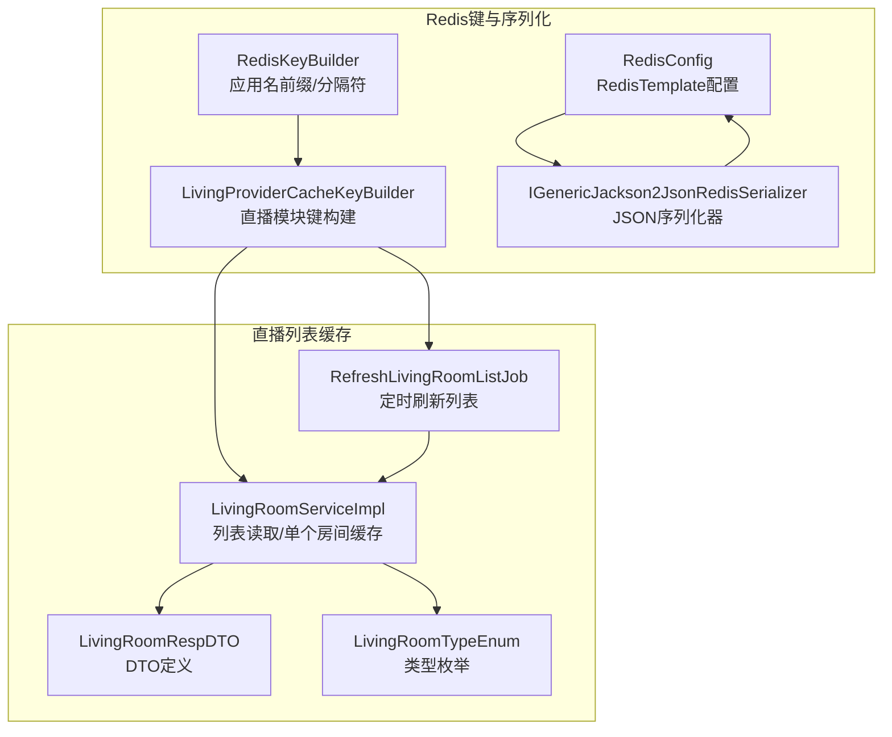
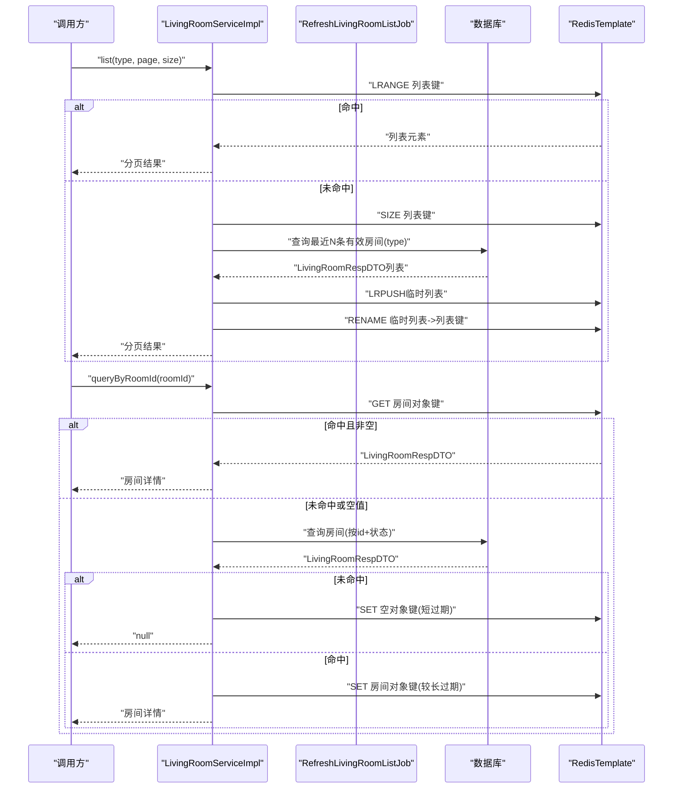
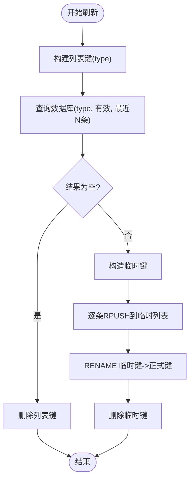
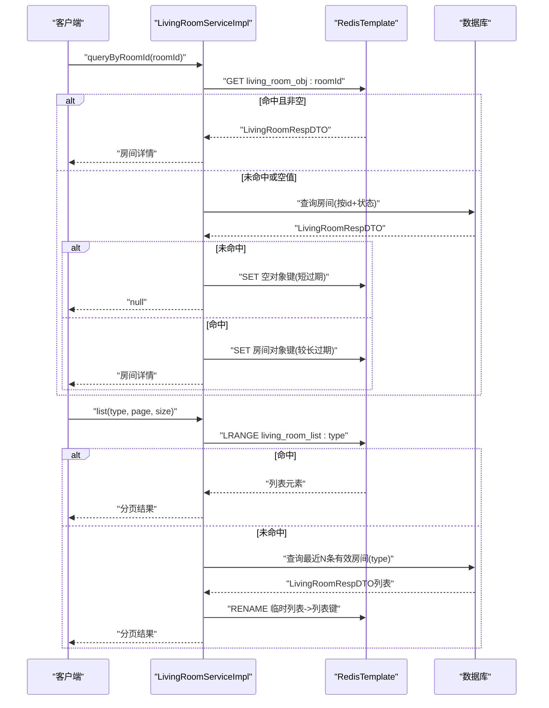
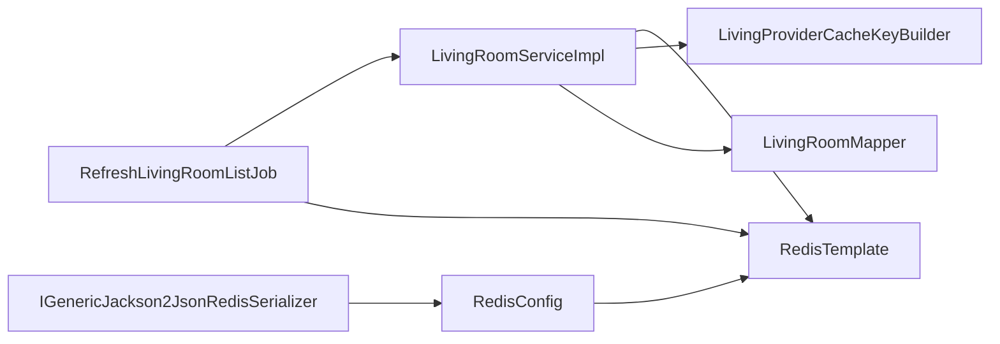

# 列表缓存设计

<cite>
**本文引用的文件**
- [RedisKeyBuilder.java](file://live-framework/live-framework-redis-starter/src/main/java/com/logilong/live/framework/redis/starter/key/RedisKeyBuilder.java)
- [LivingProviderCacheKeyBuilder.java](file://live-framework/live-framework-redis-starter/src/main/java/com/logilong/live/framework/redis/starter/key/LivingProviderCacheKeyBuilder.java)
- [RedisConfig.java](file://live-framework/live-framework-redis-starter/src/main/java/com/logilong/live/framework/redis/starter/config/RedisConfig.java)
- [IGenericJackson2JsonRedisSerializer.java](file://live-framework/live-framework-redis-starter/src/main/java/com/logilong/live/framework/redis/starter/config/IGenericJackson2JsonRedisSerializer.java)
- [RefreshLivingRoomListJob.java](file://live-living-provider/src/main/java/com/logilong/live/living/provider/config/RefreshLivingRoomListJob.java)
- [LivingRoomServiceImpl.java](file://live-living-provider/src/main/java/com/logilong/live/living/provider/service/impl/LivingRoomServiceImpl.java)
- [LivingRoomRespDTO.java](file://live-living-interface/src/main/java/com/logilong/live/living/interfaces/dto/LivingRoomRespDTO.java)
- [LivingRoomTypeEnum.java](file://live-living-interface/src/main/java/com/logilong/live/living/interfaces/constants/LivingRoomTypeEnum.java)
- [UserPhoneServiceImpl.java](file://live-user-provider/src/main/java/com/logilong/live/user/provider/service/impl/UserPhoneServiceImpl.java)
</cite>

## 目录
1. [引言](#引言)
2. [项目结构](#项目结构)
3. [核心组件](#核心组件)
4. [架构总览](#架构总览)
5. [详细组件分析](#详细组件分析)
6. [依赖关系分析](#依赖关系分析)
7. [性能考量](#性能考量)
8. [故障排查指南](#故障排查指南)
9. [结论](#结论)

## 引言
本文件围绕直播列表的Redis缓存设计展开，重点说明：
- 如何使用Redis List结构存储直播间数据；
- LivingProviderCacheKeyBuilder中buildLivingRoomList方法的缓存键命名规范；
- 缓存数据结构选择理由（List vs ZSet）；
- 缓存中LivingRoomRespDTO对象的序列化机制与字段含义；
- 缓存穿透防护策略（空值缓存）与缓存击穿应对方案（分布式锁）；
- 结合代码说明queryByRoomId方法中单个直播间对象缓存与列表缓存的协同工作机制，确保数据一致性；
- 提供缓存过期策略、内存占用评估及大规模并发访问下的性能优化建议。

## 项目结构
直播列表缓存涉及的关键模块与文件如下：
- Redis键构建与序列化：RedisKeyBuilder、LivingProviderCacheKeyBuilder、RedisConfig、IGenericJackson2JsonRedisSerializer
- 列表刷新与读取：RefreshLivingRoomListJob、LivingRoomServiceImpl
- 数据模型：LivingRoomRespDTO、LivingRoomTypeEnum
- 缓存穿透/击穿示例参考：UserPhoneServiceImpl（用于对比空值缓存与分布式锁）

图表来源
- [RedisKeyBuilder.java](file://live-framework/live-framework-redis-starter/src/main/java/com/logilong/live/framework/redis/starter/key/RedisKeyBuilder.java#L1-L22)
- [LivingProviderCacheKeyBuilder.java](file://live-framework/live-framework-redis-starter/src/main/java/com/logilong/live/framework/redis/starter/key/LivingProviderCacheKeyBuilder.java#L1-L39)
- [RedisConfig.java](file://live-framework/live-framework-redis-starter/src/main/java/com/logilong/live/framework/redis/starter/config/RedisConfig.java#L1-L28)
- [IGenericJackson2JsonRedisSerializer.java](file://live-framework/live-framework-redis-starter/src/main/java/com/logilong/live/framework/redis/starter/config/IGenericJackson2JsonRedisSerializer.java#L1-L21)
- [RefreshLivingRoomListJob.java](file://live-living-provider/src/main/java/com/logilong/live/living/provider/config/RefreshLivingRoomListJob.java#L1-L75)
- [LivingRoomServiceImpl.java](file://live-living-provider/src/main/java/com/logilong/live/living/provider/service/impl/LivingRoomServiceImpl.java#L1-L294)
- [LivingRoomRespDTO.java](file://live-living-interface/src/main/java/com/logilong/live/living/interfaces/dto/LivingRoomRespDTO.java#L1-L23)
- [LivingRoomTypeEnum.java](file://live-living-interface/src/main/java/com/logilong/live/living/interfaces/constants/LivingRoomTypeEnum.java#L1-L18)

章节来源
- [RedisKeyBuilder.java](file://live-framework/live-framework-redis-starter/src/main/java/com/logilong/live/framework/redis/starter/key/RedisKeyBuilder.java#L1-L22)
- [LivingProviderCacheKeyBuilder.java](file://live-framework/live-framework-redis-starter/src/main/java/com/logilong/live/framework/redis/starter/key/LivingProviderCacheKeyBuilder.java#L1-L39)
- [RedisConfig.java](file://live-framework/live-framework-redis-starter/src/main/java/com/logilong/live/framework/redis/starter/config/RedisConfig.java#L1-L28)
- [IGenericJackson2JsonRedisSerializer.java](file://live-framework/live-framework-redis-starter/src/main/java/com/logilong/live/framework/redis/starter/config/IGenericJackson2JsonRedisSerializer.java#L1-L21)
- [RefreshLivingRoomListJob.java](file://live-living-provider/src/main/java/com/logilong/live/living/provider/config/RefreshLivingRoomListJob.java#L1-L75)
- [LivingRoomServiceImpl.java](file://live-living-provider/src/main/java/com/logilong/live/living/provider/service/impl/LivingRoomServiceImpl.java#L1-L294)
- [LivingRoomRespDTO.java](file://live-living-interface/src/main/java/com/logilong/live/living/interfaces/dto/LivingRoomRespDTO.java#L1-L23)
- [LivingRoomTypeEnum.java](file://live-living-interface/src/main/java/com/logilong/live/living/interfaces/constants/LivingRoomTypeEnum.java#L1-L18)

## 核心组件
- RedisKeyBuilder：提供统一的应用名前缀与分隔符，保证键空间隔离。
- LivingProviderCacheKeyBuilder：基于RedisKeyBuilder扩展直播模块专用键，包含列表键、对象键、锁键、在线PK键、用户集合键等。
- RedisConfig：配置RedisTemplate，采用String作为key序列化器，自定义JSON序列化器作为value序列化器，支持Object类型。
- RefreshLivingRoomListJob：定时任务，按类型刷新Redis中的直播列表，使用临时列表+rename的方式实现无阻塞切换。
- LivingRoomServiceImpl：提供列表读取、单个房间缓存、在线PK、用户集合等能力；列表读取通过Redis List实现，单个房间通过Redis Value实现。

章节来源
- [RedisKeyBuilder.java](file://live-framework/live-framework-redis-starter/src/main/java/com/logilong/live/framework/redis/starter/key/RedisKeyBuilder.java#L1-L22)
- [LivingProviderCacheKeyBuilder.java](file://live-framework/live-framework-redis-starter/src/main/java/com/logilong/live/framework/redis/starter/key/LivingProviderCacheKeyBuilder.java#L1-L39)
- [RedisConfig.java](file://live-framework/live-framework-redis-starter/src/main/java/com/logilong/live/framework/redis/starter/config/RedisConfig.java#L1-L28)
- [RefreshLivingRoomListJob.java](file://live-living-provider/src/main/java/com/logilong/live/living/provider/config/RefreshLivingRoomListJob.java#L1-L75)
- [LivingRoomServiceImpl.java](file://live-living-provider/src/main/java/com/logilong/live/living/provider/service/impl/LivingRoomServiceImpl.java#L1-L294)

## 架构总览
直播列表缓存的整体流程：
- 定时任务按类型生成列表键，批量拉取数据库数据，逐条右推入临时列表，再rename覆盖原列表，避免读写阻塞。
- 读取时先查列表，若为空则回源数据库并缓存；单个房间查询走对象键，命中则直接返回，未命中则回源数据库并缓存。
- 通过空值缓存与短过期策略缓解缓存穿透；通过分布式锁或setIfAbsent原子操作缓解缓存击穿。

图表来源
- [RefreshLivingRoomListJob.java](file://live-living-provider/src/main/java/com/logilong/live/living/provider/config/RefreshLivingRoomListJob.java#L42-L75)
- [LivingRoomServiceImpl.java](file://live-living-provider/src/main/java/com/logilong/live/living/provider/service/impl/LivingRoomServiceImpl.java#L111-L166)

## 详细组件分析

### 缓存键命名规范：LivingProviderCacheKeyBuilder
- 应用前缀：由RedisKeyBuilder提供，格式为“应用名:”，确保键空间隔离。
- 列表键：buildLivingRoomList(type) → “应用名:living_room_list:type”
- 对象键：buildLivingRoomObj(roomId) → “应用名:living_room_obj:roomId”
- 锁键：buildRefreshLivingRoomListLock() → “应用名:refresh_living_room_list_lock”
- 用户集合键：buildLivingRoomUserSet(roomId, appId) → “应用名:living_room_user_set:appId:roomId”
- 在线PK键：buildLivingOnlinePk(roomId) → “应用名:living_online_pk:roomId”

章节来源
- [RedisKeyBuilder.java](file://live-framework/live-framework-redis-starter/src/main/java/com/logilong/live/framework/redis/starter/key/RedisKeyBuilder.java#L1-L22)
- [LivingProviderCacheKeyBuilder.java](file://live-framework/live-framework-redis-starter/src/main/java/com/logilong/live/framework/redis/starter/key/LivingProviderCacheKeyBuilder.java#L1-L39)

### 列表缓存结构与刷新策略
- 存储结构：Redis List（LPUSH/RPUSH/RENAME/DEL）。
- 刷新策略：定时任务每秒触发一次，按类型构建列表键，遍历数据库结果逐条右推入临时列表，最后rename覆盖原列表，避免阻塞。
- 删除逻辑：当数据库为空时，删除对应列表键，避免陈旧数据残留。

图表来源
- [RefreshLivingRoomListJob.java](file://live-living-provider/src/main/java/com/logilong/live/living/provider/config/RefreshLivingRoomListJob.java#L58-L75)

章节来源
- [RefreshLivingRoomListJob.java](file://live-living-provider/src/main/java/com/logilong/live/living/provider/config/RefreshLivingRoomListJob.java#L1-L75)

### 单个房间对象缓存与列表缓存协同
- 列表读取：list方法先查Redis List，命中则直接返回分页结果；未命中则回源数据库并刷新列表。
- 单个房间缓存：queryByRoomId先查Redis Value，命中且非空则返回；未命中或空值则回源数据库，未命中时写入短生命周期空对象以防止缓存穿透，命中则写入较长生命周期对象。
- 协同机制：列表键与对象键分别服务于不同场景（列表分页 vs 单房间详情），两者独立维护，互不干扰；对象键命中可直接返回，无需依赖列表键。

图表来源
- [LivingRoomServiceImpl.java](file://live-living-provider/src/main/java/com/logilong/live/living/provider/service/impl/LivingRoomServiceImpl.java#L111-L166)

章节来源
- [LivingRoomServiceImpl.java](file://live-living-provider/src/main/java/com/logilong/live/living/provider/service/impl/LivingRoomServiceImpl.java#L111-L166)

### 数据结构选择：List vs ZSet
- 选择List的理由：
  - 顺序性：列表天然保持插入顺序，适合首页/推荐等按时间倒序展示的场景。
  - 简洁性：LRANGE、LLEN等命令满足分页需求，无需额外score字段。
  - 性能：对于读多写少的直播列表，List的读取成本低，且通过rename实现无阻塞切换。
- 为什么不选ZSet：
  - ZSet需要score字段，通常用于排序或权重场景；而直播列表更关注顺序而非排序权重。
  - 若需按score排序（如热度、权重），ZSet更合适；但当前业务按创建时间倒序，List更贴合。

章节来源
- [RefreshLivingRoomListJob.java](file://live-living-provider/src/main/java/com/logilong/live/living/provider/config/RefreshLivingRoomListJob.java#L58-L75)
- [LivingRoomServiceImpl.java](file://live-living-provider/src/main/java/com/logilong/live/living/provider/service/impl/LivingRoomServiceImpl.java#L150-L166)

### 序列化机制与字段含义
- 序列化器：RedisConfig中使用自定义JSON序列化器IGenericJackson2JsonRedisSerializer，对Object类型进行JSON序列化，保证LivingRoomRespDTO等对象可持久化。
- LivingRoomRespDTO字段含义（来自接口层DTO）：
  - id：房间ID
  - anchorId：主播ID
  - roomName：房间名称
  - covertImg：封面图
  - type：房间类型（默认/PK）
  - watchNum：观看人数
  - goodNum：点赞数
  - pkObjId：PK对象ID（仅PK房间时填充）

章节来源
- [RedisConfig.java](file://live-framework/live-framework-redis-starter/src/main/java/com/logilong/live/framework/redis/starter/config/RedisConfig.java#L1-L28)
- [IGenericJackson2JsonRedisSerializer.java](file://live-framework/live-framework-redis-starter/src/main/java/com/logilong/live/framework/redis/starter/config/IGenericJackson2JsonRedisSerializer.java#L1-L21)
- [LivingRoomRespDTO.java](file://live-living-interface/src/main/java/com/logilong/live/living/interfaces/dto/LivingRoomRespDTO.java#L1-L23)

### 缓存穿透与击穿防护
- 缓存穿透（空值缓存）：
  - 单个房间：queryByRoomId在未命中时写入短生命周期空对象，后续相同请求直接返回null，避免重复回源。
  - 列表：列表为空时删除列表键，避免陈旧空列表。
- 缓存击穿（分布式锁）：
  - 示例参考：UserPhoneServiceImpl在查询用户电话列表时，使用Redis SET NX EX实现分布式锁，避免大量并发请求同时打到数据库。
  - 直播间对象缓存同样可借鉴：在高并发下，可通过setIfAbsent或分布式锁保护数据库回源，降低数据库压力。

章节来源
- [LivingRoomServiceImpl.java](file://live-living-provider/src/main/java/com/logilong/live/living/provider/service/impl/LivingRoomServiceImpl.java#L111-L138)
- [RefreshLivingRoomListJob.java](file://live-living-provider/src/main/java/com/logilong/live/living/provider/config/RefreshLivingRoomListJob.java#L42-L56)
- [UserPhoneServiceImpl.java](file://live-user-provider/src/main/java/com/logilong/live/user/provider/service/impl/UserPhoneServiceImpl.java#L124-L181)

### 过期策略与内存占用评估
- 过期策略：
  - 单个房间对象键：30分钟（常规房间），PK房间可能根据业务调整。
  - 列表键：由定时任务定期刷新，通常不设置固定TTL，避免频繁重建。
  - 空值缓存：1分钟（单个房间），列表为空时删除键。
- 内存占用评估：
  - 列表长度：受数据库查询限制（例如限制1000条），单类型列表元素数量可控。
  - 单元素大小：LivingRoomRespDTO字段较少，序列化后体积较小；列表整体内存占用与元素数量成正比。
  - 建议：结合业务峰值并发与列表长度，评估Redis内存上限，必要时拆分类型或分片。

章节来源
- [LivingRoomServiceImpl.java](file://live-living-provider/src/main/java/com/logilong/live/living/provider/service/impl/LivingRoomServiceImpl.java#L111-L138)
- [RefreshLivingRoomListJob.java](file://live-living-provider/src/main/java/com/logilong/live/living/provider/config/RefreshLivingRoomListJob.java#L58-L75)

## 依赖关系分析
- 组件耦合：
  - LivingRoomServiceImpl依赖RedisTemplate与LivingProviderCacheKeyBuilder，负责缓存读写与键构建。
  - RefreshLivingRoomListJob依赖ILivingRoomService与RedisTemplate，负责列表刷新。
  - RedisConfig与IGenericJackson2JsonRedisSerializer为序列化基础设施，被RedisTemplate使用。
- 外部依赖：
  - 数据库：MyBatis-Plus查询LivingRoomPO并转换为LivingRoomRespDTO。
  - RocketMQ：用于异步事件（如开始直播、关闭直播）。

图表来源
- [LivingRoomServiceImpl.java](file://live-living-provider/src/main/java/com/logilong/live/living/provider/service/impl/LivingRoomServiceImpl.java#L1-L294)
- [RefreshLivingRoomListJob.java](file://live-living-provider/src/main/java/com/logilong/live/living/provider/config/RefreshLivingRoomListJob.java#L1-L75)
- [RedisConfig.java](file://live-framework/live-framework-redis-starter/src/main/java/com/logilong/live/framework/redis/starter/config/RedisConfig.java#L1-L28)
- [IGenericJackson2JsonRedisSerializer.java](file://live-framework/live-framework-redis-starter/src/main/java/com/logilong/live/framework/redis/starter/config/IGenericJackson2JsonRedisSerializer.java#L1-L21)

章节来源
- [LivingRoomServiceImpl.java](file://live-living-provider/src/main/java/com/logilong/live/living/provider/service/impl/LivingRoomServiceImpl.java#L1-L294)
- [RefreshLivingRoomListJob.java](file://live-living-provider/src/main/java/com/logilong/live/living/provider/config/RefreshLivingRoomListJob.java#L1-L75)
- [RedisConfig.java](file://live-framework/live-framework-redis-starter/src/main/java/com/logilong/live/framework/redis/starter/config/RedisConfig.java#L1-L28)
- [IGenericJackson2JsonRedisSerializer.java](file://live-framework/live-framework-redis-starter/src/main/java/com/logilong/live/framework/redis/starter/config/IGenericJackson2JsonRedisSerializer.java#L1-L21)

## 性能考量
- 读多写少场景：直播列表属于典型读多写少，Redis List非常适合。
- 无阻塞切换：通过临时列表+rename避免阻塞，提升高并发下的读取稳定性。
- 分页读取：LRANGE复杂度O(k)，k为返回元素数量，结合Redis内存模型，分页读取成本较低。
- 并发控制：定时任务使用setIfAbsent实现轻量级锁，避免并发刷新冲突。
- 序列化成本：JSON序列化/反序列化对小对象开销可控，建议避免超大对象进入缓存。
- 建议优化：
  - 列表分页时尽量使用LRANGE一次性获取，减少多次往返。
  - 对于热点房间详情，可考虑在业务层增加本地缓存（如Caffeine）进一步降低Redis压力。
  - 监控Redis内存使用与命中率，必要时拆分类型或引入分片。

## 故障排查指南
- 列表为空：
  - 检查定时任务是否运行正常，确认临时键rename是否成功。
  - 确认数据库查询条件（状态、类型、时间排序、限制条数）。
- 单个房间返回null：
  - 检查是否命中空值缓存（对象键值为短生命周期空对象）。
  - 确认数据库是否存在该房间且状态有效。
- 缓存穿透：
  - 观察空值缓存键是否存在，过期时间是否正确。
  - 若频繁出现穿透，可适当缩短空值缓存过期时间或提高数据库查询效率。
- 缓存击穿：
  - 对高并发场景，可参考UserPhoneServiceImpl的分布式锁思路，在回源数据库前加锁。
  - 或使用setIfAbsent原子操作保护关键路径。

章节来源
- [RefreshLivingRoomListJob.java](file://live-living-provider/src/main/java/com/logilong/live/living/provider/config/RefreshLivingRoomListJob.java#L42-L75)
- [LivingRoomServiceImpl.java](file://live-living-provider/src/main/java/com/logilong/live/living/provider/service/impl/LivingRoomServiceImpl.java#L111-L138)
- [UserPhoneServiceImpl.java](file://live-user-provider/src/main/java/com/logilong/live/user/provider/service/impl/UserPhoneServiceImpl.java#L124-L181)

## 结论
- Redis List适合直播列表的顺序展示需求，配合定时任务与rename切换，实现高性能、低阻塞的缓存刷新。
- LivingProviderCacheKeyBuilder提供了清晰的键命名规范，便于维护与排查。
- 通过空值缓存与合理的过期策略，有效缓解缓存穿透；在高并发场景可借鉴分布式锁思路缓解缓存击穿。
- 单个房间对象缓存与列表缓存协同工作，既满足列表分页，也满足房间详情的快速读取，确保数据一致性与用户体验。