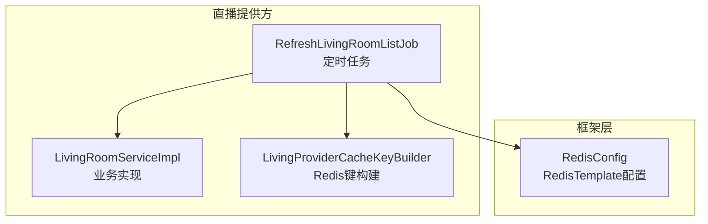
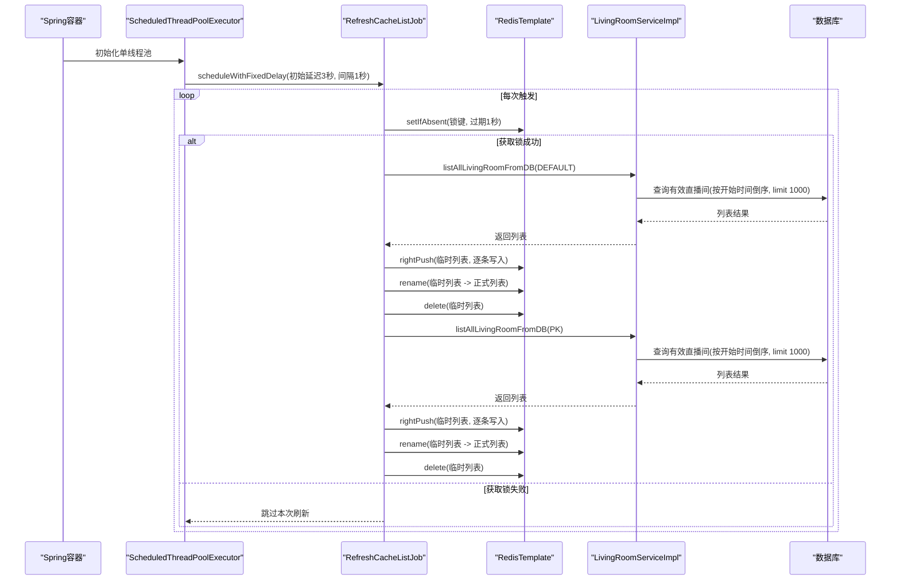
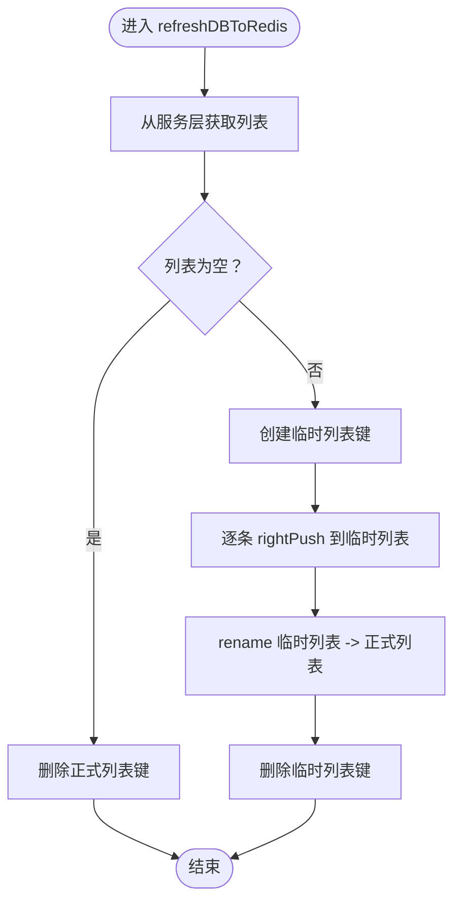
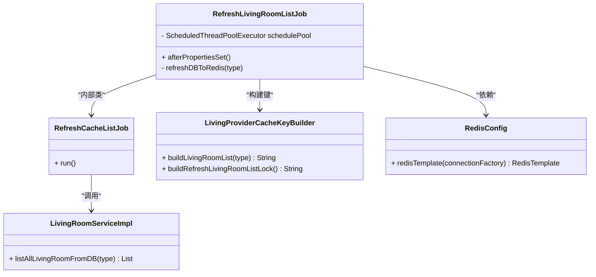
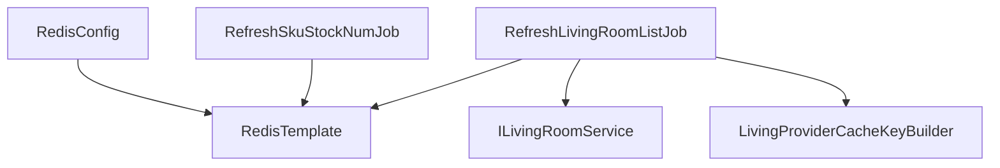

# 定时刷新机制

<cite>
**本文引用的文件**
- [RefreshLivingRoomListJob.java](file://live-living-provider/src/main/java/com/logilong/live/living/provider/config/RefreshLivingRoomListJob.java)
- [LivingRoomServiceImpl.java](file://live-living-provider/src/main/java/com/logilong/live/living/provider/service/impl/LivingRoomServiceImpl.java)
- [LivingRoomTypeEnum.java](file://live-living-interface/src/main/java/com/logilong/live/living/interfaces/constants/LivingRoomTypeEnum.java)
- [LivingProviderCacheKeyBuilder.java](file://live-framework/live-framework-redis-starter/src/main/java/com/logilong/live/framework/redis/starter/key/LivingProviderCacheKeyBuilder.java)
- [RedisConfig.java](file://live-framework/live-framework-redis-starter/src/main/java/com/logilong/live/framework/redis/starter/config/RedisConfig.java)
- [RefreshSkuStockNumJob.java](file://live-sku-provider/src/main/java/com/logilong/live/sku/provider/config/RefreshSkuStockNumJob.java)
</cite>

## 目录
1. [引言](#引言)
2. [项目结构](#项目结构)
3. [核心组件](#核心组件)
4. [架构总览](#架构总览)
5. [详细组件分析](#详细组件分析)
6. [依赖关系分析](#依赖关系分析)
7. [性能考量](#性能考量)
8. [故障排查指南](#故障排查指南)
9. [结论](#结论)
10. [附录](#附录)

## 引言
本文件围绕 RefreshLivingRoomListJob 定时任务展开，系统性解析其调度策略、分布式锁互斥、写时复制（COW）式缓存更新流程、数据库查询逻辑与限流策略，并给出任务频率调整、锁超时优化与异常处理的最佳实践建议。目标是帮助读者在理解现有实现的基础上，安全地扩展与优化该定时刷新机制。

## 项目结构
- 定时任务位于“直播提供方”模块，负责周期性将数据库中的有效直播间列表刷新至 Redis 缓存。
- Redis 键空间由统一的键构建器管理，保证不同模块键前缀隔离。
- RedisTemplate 由框架层统一配置，序列化策略适配对象缓存。
- 与之相似的定时任务实现可作为分布式锁与重试策略的参考。

图表来源
- [RefreshLivingRoomListJob.java](file://live-living-provider/src/main/java/com/logilong/live/living/provider/config/RefreshLivingRoomListJob.java#L1-L76)
- [LivingRoomServiceImpl.java](file://live-living-provider/src/main/java/com/logilong/live/living/provider/service/impl/LivingRoomServiceImpl.java#L1-L294)
- [LivingProviderCacheKeyBuilder.java](file://live-framework/live-framework-redis-starter/src/main/java/com/logilong/live/framework/redis/starter/key/LivingProviderCacheKeyBuilder.java#L1-L40)
- [RedisConfig.java](file://live-framework/live-framework-redis-starter/src/main/java/com/logilong/live/framework/redis/starter/config/RedisConfig.java#L1-L28)

章节来源
- [RefreshLivingRoomListJob.java](file://live-living-provider/src/main/java/com/logilong/live/living/provider/config/RefreshLivingRoomListJob.java#L1-L76)
- [RedisConfig.java](file://live-framework/live-framework-redis-starter/src/main/java/com/logilong/live/framework/redis/starter/config/RedisConfig.java#L1-L28)

## 核心组件
- 定时任务调度器：基于 ScheduledThreadPoolExecutor 的单线程池，使用 scheduleWithFixedDelay 实现固定周期刷新。
- 分布式锁：通过 Redis 的 setIfAbsent 设置短生命周期锁，避免多实例并发执行。
- 写时复制（COW）更新：先写入临时列表，再通过 rename 原子替换，降低对线上读取的阻塞。
- 数据源查询：按类型过滤有效直播间，按开始时间倒序，限制最大返回条数。

章节来源
- [RefreshLivingRoomListJob.java](file://live-living-provider/src/main/java/com/logilong/live/living/provider/config/RefreshLivingRoomListJob.java#L34-L74)
- [LivingRoomServiceImpl.java](file://live-living-provider/src/main/java/com/logilong/live/living/provider/service/impl/LivingRoomServiceImpl.java#L168-L179)

## 架构总览
定时任务在服务启动后，以固定延迟启动，周期性尝试获取分布式锁；成功后拉取两类直播间的有效列表，逐条写入临时列表，再原子替换为新列表，最后清理临时键。期间不直接修改旧列表，从而实现低干扰的 COW 更新。

图表来源
- [RefreshLivingRoomListJob.java](file://live-living-provider/src/main/java/com/logilong/live/living/provider/config/RefreshLivingRoomListJob.java#L34-L74)
- [LivingRoomServiceImpl.java](file://live-living-provider/src/main/java/com/logilong/live/living/provider/service/impl/LivingRoomServiceImpl.java#L168-L179)

## 详细组件分析

### 1) 调度器初始化与调度策略
- 初始化：创建单线程 ScheduledThreadPoolExecutor。
- 启动时机：实现 InitializingBean，在 afterPropertiesSet 中注册定时任务。
- 调度参数：初始延迟 3 秒，固定间隔 1 秒，使用 scheduleWithFixedDelay 保证每次执行完成后等待固定间隔再下一次执行，避免任务叠加。

章节来源
- [RefreshLivingRoomListJob.java](file://live-living-provider/src/main/java/com/logilong/live/living/provider/config/RefreshLivingRoomListJob.java#L34-L40)

### 2) 分布式锁与互斥执行
- 锁键生成：使用 LivingProviderCacheKeyBuilder 构建锁键，避免多实例重复执行。
- 获取方式：RedisTemplate.opsForValue().setIfAbsent(key, 1, 1, TimeUnit.SECONDS)，设置 1 秒过期，避免死锁。
- 互斥语义：仅当获取成功时才执行刷新逻辑；失败则跳过本次周期，等待下次触发。

章节来源
- [RefreshLivingRoomListJob.java](file://live-living-provider/src/main/java/com/logilong/live/living/provider/config/RefreshLivingRoomListJob.java#L46-L54)
- [LivingProviderCacheKeyBuilder.java](file://live-framework/live-framework-redis-starter/src/main/java/com/logilong/live/framework/redis-starter/key/LivingProviderCacheKeyBuilder.java#L28-L30)

### 3) 写时复制（COW）更新流程
- 临时列表：以“正式列表键 + _temp”命名临时列表，避免直接修改旧列表。
- 预写入：遍历结果集，逐条 rightPush 至临时列表，保持顺序一致性。
- 原子替换：使用 rename 将临时列表重命名为正式列表，实现无锁切换。
- 清理：删除临时列表键，释放资源。

图表来源
- [RefreshLivingRoomListJob.java](file://live-living-provider/src/main/java/com/logilong/live/living/provider/config/RefreshLivingRoomListJob.java#L58-L74)

章节来源
- [RefreshLivingRoomListJob.java](file://live-living-provider/src/main/java/com/logilong/live/living/provider/config/RefreshLivingRoomListJob.java#L58-L74)

### 4) 数据库查询与排序、限流
- 查询入口：LivingRoomServiceImpl.listAllLivingRoomFromDB(type)。
- 条件过滤：仅查询状态为有效的直播间。
- 排序规则：按开始时间倒序，便于首页优先展示最新开播。
- 限流策略：强制 limit 1000，避免一次性拉取过多导致内存压力与网络阻塞。

章节来源
- [LivingRoomServiceImpl.java](file://live-living-provider/src/main/java/com/logilong/live/living/provider/service/impl/LivingRoomServiceImpl.java#L168-L179)
- [LivingRoomTypeEnum.java](file://live-living-interface/src/main/java/com/logilong/live/living/interfaces/constants/LivingRoomTypeEnum.java#L1-L19)

### 5) RedisTemplate 序列化与键空间
- 序列化：RedisConfig 统一配置字符串键与 JSON 值序列化，确保对象缓存正确读写。
- 键构建：LivingProviderCacheKeyBuilder 提供直播模块专用键前缀与命名规范，避免冲突。

章节来源
- [RedisConfig.java](file://live-framework/live-framework-redis-starter/src/main/java/com/logilong/live/framework/redis/starter/config/RedisConfig.java#L1-L28)
- [LivingProviderCacheKeyBuilder.java](file://live-framework/live-framework-redis-starter/src/main/java/com/logilong/live/framework/redis/starter/key/LivingProviderCacheKeyBuilder.java#L1-L40)

### 6) 类关系图（代码级）

图表来源
- [RefreshLivingRoomListJob.java](file://live-living-provider/src/main/java/com/logilong/live/living/provider/config/RefreshLivingRoomListJob.java#L1-L76)
- [LivingRoomServiceImpl.java](file://live-living-provider/src/main/java/com/logilong/live/living/provider/service/impl/LivingRoomServiceImpl.java#L1-L294)
- [LivingProviderCacheKeyBuilder.java](file://live-framework/live-framework-redis-starter/src/main/java/com/logilong/live/framework/redis-starter/key/LivingProviderCacheKeyBuilder.java#L1-L40)
- [RedisConfig.java](file://live-framework/live-framework-redis-starter/src/main/java/com/logilong/live/framework/redis-starter/config/RedisConfig.java#L1-L28)

## 依赖关系分析
- RefreshLivingRoomListJob 依赖：
  - RedisTemplate：用于 setIfAbsent、list 操作与 rename/delete。
  - ILivingRoomService：提供 listAllLivingRoomFromDB 查询能力。
  - LivingProviderCacheKeyBuilder：统一键命名。
- RedisConfig 为 RedisTemplate 提供序列化配置。
- 与 SKU 提供方的 RefreshSkuStockNumJob 对比，两者均采用 setIfAbsent 分布式锁与固定周期调度，但前者侧重“DB -> Redis”，后者侧重“Redis -> DB”。

图表来源
- [RefreshLivingRoomListJob.java](file://live-living-provider/src/main/java/com/logilong/live/living/provider/config/RefreshLivingRoomListJob.java#L1-L76)
- [RedisConfig.java](file://live-framework/live-framework-redis-starter/src/main/java/com/logilong/live/framework/redis-starter/config/RedisConfig.java#L1-L28)
- [RefreshSkuStockNumJob.java](file://live-sku-provider/src/main/java/com/logilong/live/sku/provider/config/RefreshSkuStockNumJob.java#L1-L66)

章节来源
- [RefreshLivingRoomListJob.java](file://live-living-provider/src/main/java/com/logilong/live/living/provider/config/RefreshLivingRoomListJob.java#L1-L76)
- [RefreshSkuStockNumJob.java](file://live-sku-provider/src/main/java/com/logilong/live/sku/provider/config/RefreshSkuStockNumJob.java#L1-L66)

## 性能考量
- 刷新频率：固定间隔 1 秒，初始延迟 3 秒，适合小规模读多写少场景，避免频繁全量扫描数据库。
- 锁超时：1 秒过期，避免长时间阻塞；若任务耗时可能超过 1 秒，应考虑提升锁过期时间或拆分任务。
- COW 更新：通过 rename 原子替换，避免阻塞读取；临时列表写入采用 rightPush，顺序稳定。
- 数据量控制：limit 1000，兼顾首页展示与性能；如需更多数据，可结合分页缓存策略。
- 键序列化：JSON 序列化保障对象缓存一致性，注意字段变更的兼容性。

章节来源
- [RefreshLivingRoomListJob.java](file://live-living-provider/src/main/java/com/logilong/live/living/provider/config/RefreshLivingRoomListJob.java#L34-L74)
- [LivingRoomServiceImpl.java](file://live-living-provider/src/main/java/com/logilong/live/living/provider/service/impl/LivingRoomServiceImpl.java#L168-L179)
- [RedisConfig.java](file://live-framework/live-framework-redis-starter/src/main/java/com/logilong/live/framework/redis-starter/config/RedisConfig.java#L1-L28)

## 故障排查指南
- 未获取到锁：检查 Redis 是否可用、键空间前缀是否一致、锁过期时间是否过短。
- 列表为空：确认数据库中是否存在有效直播间，或查询条件是否正确。
- COW 替换失败：rename 通常原子成功；若出现异常，检查键名拼接与临时键清理逻辑。
- 性能抖动：观察任务耗时是否超过 1 秒，必要时延长锁过期时间或降低刷新频率。
- 日志定位：关注定时任务启动、锁获取、列表写入与 rename 的日志输出。

章节来源
- [RefreshLivingRoomListJob.java](file://live-living-provider/src/main/java/com/logilong/live/living/provider/config/RefreshLivingRoomListJob.java#L46-L74)
- [LivingRoomServiceImpl.java](file://live-living-provider/src/main/java/com/logilong/live/living/provider/service/impl/LivingRoomServiceImpl.java#L168-L179)

## 结论
RefreshLivingRoomListJob 通过单线程定时器、Redis 分布式锁与 COW 原子替换，实现了对两类直播房间的有效列表的低干扰刷新。配合 limit 1000 的数据量控制与按开始时间倒序的排序策略，满足首页展示与性能平衡。建议在生产环境中根据实际负载动态调整刷新频率与锁超时时间，并完善异常监控与告警。

## 附录

### A. 任务执行频率与锁超时优化建议
- 频率调整：若数据库变更频繁且列表较大，可适当降低频率（例如 2-3 秒），或引入增量变更队列。
- 锁超时：当前 1 秒；若任务耗时可能超过 1 秒，建议提升至 3-5 秒，并在任务末尾尽早释放资源。
- 并发控制：单线程池已足够；若未来扩展为多类型房间，可按类型分片执行，避免竞争。

章节来源
- [RefreshLivingRoomListJob.java](file://live-living-provider/src/main/java/com/logilong/live/living/provider/config/RefreshLivingRoomListJob.java#L34-L54)

### B. 异常处理最佳实践
- 当前实现未显式 try/catch；建议在任务 run 中增加异常捕获与日志记录，避免线程退出导致调度中断。
- 对 Redis 操作失败、数据库查询异常分别记录错误日志，并可考虑降级策略（如保留旧缓存）。
- 可结合全局异常处理与监控告警，及时发现并恢复。

章节来源
- [RefreshLivingRoomListJob.java](file://live-living-provider/src/main/java/com/logilong/live/living/provider/config/RefreshLivingRoomListJob.java#L42-L56)

### C. 与其他定时任务的对比参考
- SKU 提供方的 RefreshSkuStockNumJob 同样采用 setIfAbsent 分布式锁与固定周期调度，可借鉴其锁过期时间与任务粒度划分经验。

章节来源
- [RefreshSkuStockNumJob.java](file://live-sku-provider/src/main/java/com/logilong/live/sku/provider/config/RefreshSkuStockNumJob.java#L36-L66)