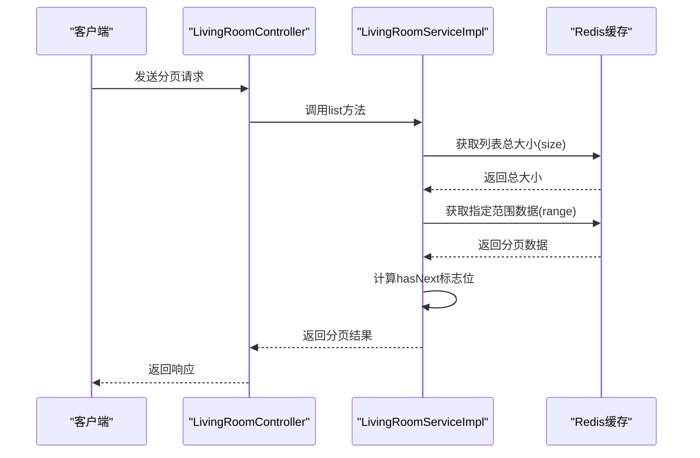
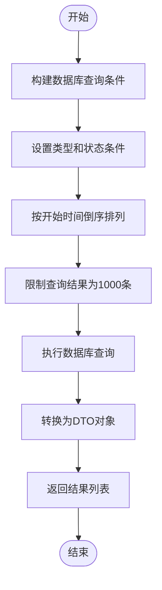
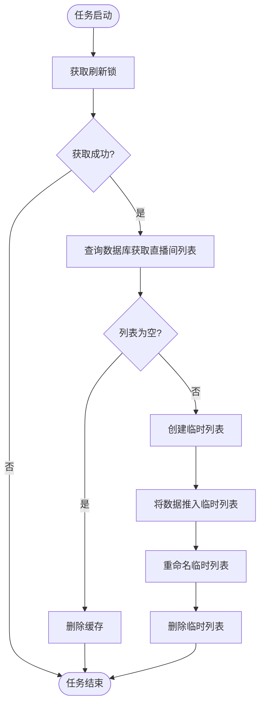
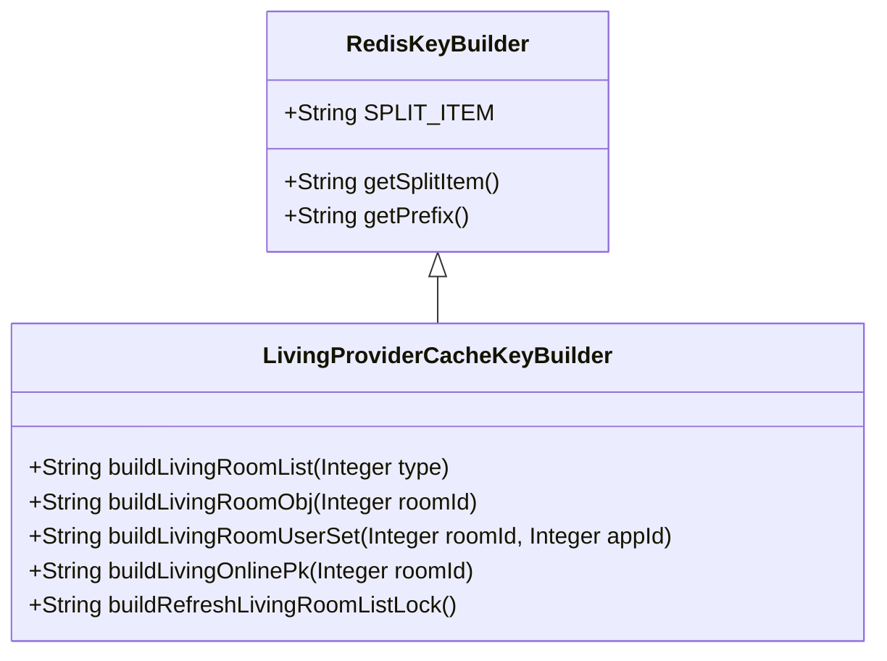

# 直播列表维护

<cite>
**本文档引用的文件**   
- [LivingRoomServiceImpl.java](file://live-living-provider/src/main/java/com/logilong/live/living/provider/service/impl/LivingRoomServiceImpl.java)
- [LivingRoomRPCImpl.java](file://live-living-provider/src/main/java/com/logilong/live/living/provider/rpc/LivingRoomRPCImpl.java)
- [ILivingRoomService.java](file://live-living-provider/src/main/java/com/logilong/live/living/provider/service/ILivingRoomService.java)
- [ILivingRoomRPC.java](file://live-living-interface/src/main/java/com/logilong/live/living/interfaces/rpc/ILivingRoomRPC.java)
- [LivingRoomReqDTO.java](file://live-living-interface/src/main/java/com/logilong/live/living/interfaces/dto/LivingRoomReqDTO.java)
- [LivingRoomRespDTO.java](file://live-living-interface/src/main/java/com/logilong/live/living/interfaces/dto/LivingRoomRespDTO.java)
- [LivingProviderCacheKeyBuilder.java](file://live-framework/live-framework-redis-starter/src/main/java/com/logilong/live/framework/redis/starter/key/LivingProviderCacheKeyBuilder.java)
- [RefreshLivingRoomListJob.java](file://live-living-provider/src/main/java/com/logilong/live/living/provider/config/RefreshLivingRoomListJob.java)
- [LivingRoomController.java](file://live-api/src/main/java/com/logilong/live/api/controller/LivingRoomController.java)
- [LivingRoomServiceImpl.java](file://live-api/src/main/java/com/logilong/live/api/service/impl/LivingRoomServiceImpl.java)
</cite>

## 目录
1. [引言](#引言)
2. [直播列表缓存策略](#直播列表缓存策略)
3. [分页查询实现](#分页查询实现)
4. [数据库查询实现](#数据库查询实现)
5. [定时刷新任务](#定时刷新任务)
6. [缓存键设计原则](#缓存键设计原则)
7. [性能优化建议](#性能优化建议)
8. [总结](#总结)

## 引言
本文档深入解析直播平台中直播列表的缓存维护机制。系统采用Redis作为缓存层，通过定时任务定期将数据库中的直播间数据同步到Redis中，实现高效的数据访问。文档详细说明了列表缓存策略、分页查询实现、数据库查询逻辑以及定时刷新任务的工作机制，为系统维护和性能优化提供指导。

## 直播列表缓存策略
直播列表采用Redis List数据结构进行缓存，以支持高效的分页查询。系统通过定时任务定期从数据库查询有效直播间数据，并将其同步到Redis缓存中。缓存策略设计考虑了数据实时性、一致性和系统性能，采用"临时列表+重命名"的原子操作方式更新缓存，避免了直接修改正在访问的列表可能造成的阻塞问题。

**Section sources**
- [LivingProviderCacheKeyBuilder.java](file://live-framework/live-framework-redis-starter/src/main/java/com/logilong/live/framework/redis/starter/key/LivingProviderCacheKeyBuilder.java)
- [RefreshLivingRoomListJob.java](file://live-living-provider/src/main/java/com/logilong/live/living/provider/config/RefreshLivingRoomListJob.java)

## 分页查询实现
分页查询通过`list`方法实现，该方法从Redis List中获取指定范围的数据，并计算`hasNext`标志位以指示是否存在下一页。

**Diagram sources**
- [LivingRoomServiceImpl.java](file://live-living-provider/src/main/java/com/logilong/live/living/provider/service/impl/LivingRoomServiceImpl.java#L150-L166)
- [LivingRoomRPCImpl.java](file://live-living-provider/src/main/java/com/logilong/live/living/provider/rpc/LivingRoomRPCImpl.java#L40-L43)

**Section sources**
- [LivingRoomServiceImpl.java](file://live-living-provider/src/main/java/com/logilong/live/living/provider/service/impl/LivingRoomServiceImpl.java#L150-L166)
- [LivingRoomRPCImpl.java](file://live-living-provider/src/main/java/com/logilong/live/living/provider/rpc/LivingRoomRPCImpl.java#L40-L43)

## 数据库查询实现
`listAllLivingRoomFromDB`方法负责从数据库查询所有有效直播间并按时间倒序排列。

该方法使用MyBatis-Plus的LambdaQueryWrapper构建查询条件，确保只查询状态为有效的直播间，并按开始时间倒序排列，保证最新的直播间排在前面。为保证系统性能，查询结果限制为1000条。

**Diagram sources**
- [LivingRoomServiceImpl.java](file://live-living-provider/src/main/java/com/logilong/live/living/provider/service/impl/LivingRoomServiceImpl.java#L169-L178)

**Section sources**
- [LivingRoomServiceImpl.java](file://live-living-provider/src/main/java/com/logilong/live/living/provider/service/impl/LivingRoomServiceImpl.java#L169-L178)

## 定时刷新任务
`RefreshLivingRoomListJob`定时任务负责定期将数据库查询结果同步到Redis缓存。

定时任务每秒执行一次，首先获取一个分布式锁以防止并发执行。获取锁后，分别查询普通直播间和PK直播间的数据，构建缓存键，然后将查询结果逐个推入Redis List中。采用"临时列表+重命名"的策略，先将数据写入临时列表，然后通过rename命令原子性地替换原有列表，避免了直接修改正在访问的列表可能造成的性能问题。

**Diagram sources**
- [RefreshLivingRoomListJob.java](file://live-living-provider/src/main/java/com/logilong/live/living/provider/config/RefreshLivingRoomListJob.java#L42-L75)

**Section sources**
- [RefreshLivingRoomListJob.java](file://live-living-provider/src/main/java/com/logilong/live/living/provider/config/RefreshLivingRoomListJob.java#L42-L75)

## 缓存键设计原则
缓存键设计遵循统一的命名规范，确保键的唯一性和可读性。

缓存键以应用名称为前缀，使用冒号(:)作为分隔符。不同类型的缓存使用不同的键名，如`living_room_list`用于直播间列表，`living_room_obj`用于单个直播间对象。这种设计既保证了键的唯一性，又便于管理和维护。

**Diagram sources**
- [RedisKeyBuilder.java](file://live-framework/live-framework-redis-starter/src/main/java/com/logilong/live/framework/redis/starter/key/RedisKeyBuilder.java)
- [LivingProviderCacheKeyBuilder.java](file://live-framework/live-framework-redis-starter/src/main/java/com/logilong/live/framework/redis/starter/key/LivingProviderCacheKeyBuilder.java)

**Section sources**
- [RedisKeyBuilder.java](file://live-framework/live-framework-redis-starter/src/main/java/com/logilong/live/framework/redis/starter/key/RedisKeyBuilder.java)
- [LivingProviderCacheKeyBuilder.java](file://live-framework/live-framework-redis-starter/src/main/java/com/logilong/live/framework/redis/starter/key/LivingProviderCacheKeyBuilder.java)

## 性能优化建议
针对大规模用户场景，提出以下性能优化建议：

1. **分页大小优化**：根据实际使用情况调整分页大小，避免单次查询数据过多导致网络传输延迟。
2. **缓存预热**：在系统启动或高峰期前，预先加载热点数据到缓存中。
3. **读写分离**：对于高并发场景，考虑使用Redis集群实现读写分离。
4. **监控告警**：建立完善的监控体系，及时发现和处理缓存命中率下降等问题。
5. **缓存穿透防护**：对查询结果为空的情况设置空值缓存，防止恶意请求导致数据库压力过大。
6. **批量操作**：在可能的情况下，使用Redis的批量操作命令减少网络往返次数。

**Section sources**
- [LivingRoomServiceImpl.java](file://live-living-provider/src/main/java/com/logilong/live/living/provider/service/impl/LivingRoomServiceImpl.java)
- [RefreshLivingRoomListJob.java](file://live-living-provider/src/main/java/com/logilong/live/living/provider/config/RefreshLivingRoomListJob.java)

## 总结
本文档详细解析了直播列表的缓存维护机制，包括缓存策略、分页查询、数据库查询和定时刷新任务的实现。通过合理的缓存设计和性能优化，系统能够高效地处理直播列表的查询请求，为用户提供流畅的观看体验。在大规模用户场景下，建议结合实际业务需求，进一步优化缓存策略和系统架构。